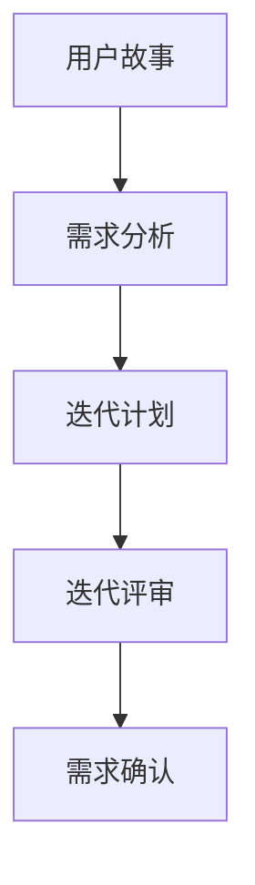
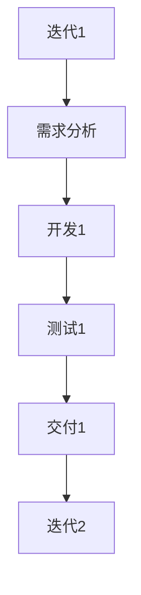

                 

# 《敏捷契约在大型应用开发中的应用》

## 关键词

敏捷契约、大型应用开发、软件开发、需求管理、项目计划、协同性、变更管理、挑战与解决方案。

## 摘要

本文深入探讨了敏捷契约在大型应用开发中的实际应用。首先，我们介绍了敏捷契约的基本概念及其在软件开发中的重要性。接着，文章详细阐述了敏捷契约的结构与要素，并通过实例分析了其在需求管理、项目计划与执行等方面的具体应用。随后，我们探讨了敏捷契约在大型应用开发中面临的挑战，并提出了相应的解决方案。最后，通过几个成功的案例，展示了敏捷契约在大型应用开发中的实践效果，并对未来发展趋势进行了展望。

## 引言

随着互联网的快速发展，大型应用项目的开发需求日益增加。然而，传统的软件开发方法和契约形式往往无法满足这种快速变化的需求。敏捷契约作为一种灵活、高效的软件开发模式，逐渐受到业界的关注。本文旨在探讨敏捷契约在大型应用开发中的应用，通过理论与实践相结合，为大型应用项目的成功实施提供指导。

### 敏捷契约的基本概念

敏捷契约（Agile Contract）是一种基于敏捷开发理念的契约形式，它强调快速响应需求变化、持续交付高质量软件产品。与传统的固定契约不同，敏捷契约更加灵活，允许在项目执行过程中根据实际情况进行调整。

#### 敏捷契约与传统契约的区别

1. **灵活性**：敏捷契约允许在项目执行过程中进行需求变更，而传统契约则较为固定。
2. **合作性**：敏捷契约强调客户、供应商和开发团队之间的紧密合作，以实现项目目标。
3. **迭代性**：敏捷契约采用迭代开发模式，每次迭代完成后对结果进行评估，并根据评估结果进行下一轮的开发。

#### 敏捷契约的核心原则

1. **客户满意度**：始终将客户需求放在首位，确保交付的产品能够满足客户的实际需求。
2. **持续交付**：通过持续交付，确保客户能够尽早获得可用软件产品。
3. **响应变化**：快速响应需求变化，以应对市场和环境的变化。

### 敏捷契约的结构与要素

敏捷契约的基本结构包括以下要素：

1. **项目目标**：明确项目的最终目标，以确保开发团队和客户对项目的理解一致。
2. **需求定义**：基于用户故事（User Story）的形式对需求进行定义，确保需求的清晰和可测性。
3. **迭代计划**：根据项目目标和需求，制定详细的迭代计划，包括每个迭代的具体任务和交付物。
4. **风险评估**：对项目进行风险评估，以便及时识别和应对潜在的风险。
5. **沟通机制**：建立有效的沟通机制，确保项目各方能够及时沟通和协作。

### 敏捷契约在软件开发中的实践

#### 敏捷契约在软件开发中的角色

敏捷契约在软件开发中扮演着重要的角色，它不仅能够提高软件项目的成功率，还能够增强客户和供应商之间的信任。

#### 敏捷契约在软件项目中的运用

1. **需求管理**：敏捷契约通过用户故事的形式对需求进行管理，确保需求的清晰和可测性。同时，通过迭代的方式逐步实现需求，以快速响应客户需求变化。
2. **项目计划**：敏捷契约采用迭代计划的方式，对每个迭代的具体任务和交付物进行规划，以实现项目的逐步交付。
3. **风险管理**：敏捷契约通过持续的风险评估，及时识别和应对项目中的潜在风险，以确保项目的顺利进行。

#### 敏捷契约对软件开发团队的影响

敏捷契约对软件开发团队的影响主要体现在以下几个方面：

1. **团队协作**：敏捷契约强调团队协作和沟通，通过建立有效的沟通机制，提高团队的工作效率。
2. **技能提升**：敏捷契约要求团队成员具备较强的需求分析和项目管理能力，以提高团队的整体素质。
3. **质量保障**：通过迭代开发和持续交付，确保软件产品的质量和客户满意度。

### 敏捷契约在需求管理中的应用

#### 敏捷契约在需求收集与确认中的运用

1. **用户故事**：敏捷契约采用用户故事的形式收集需求，确保需求的清晰和可测性。
2. **迭代评审**：通过迭代评审，对已收集的需求进行确认和验证，确保需求的准确性和可行性。

#### 敏捷契约在需求变更管理中的作用

1. **变更管理流程**：敏捷契约建立了一套完善的变更管理流程，以应对需求变更。
2. **优先级调整**：根据项目进度和资源情况，对需求变更进行优先级调整，以确保项目目标的实现。

#### 敏捷契约在需求文档编写中的实践

1. **简洁性**：敏捷契约强调需求文档的简洁性，以避免过多的细节和冗余。
2. **可操作性**：需求文档需要具备可操作性，以确保开发团队能够根据文档进行开发。

### 敏捷契约在项目计划与执行中的应用

#### 敏捷契约在项目计划中的作用

1. **迭代计划**：敏捷契约通过迭代计划，对每个迭代的具体任务和交付物进行规划。
2. **资源分配**：根据项目目标和迭代计划，合理分配资源，以确保项目的顺利进行。

#### 敏捷契约在项目执行中的运用

1. **每日站会**：通过每日站会，团队成员可以及时沟通和协作，确保项目进度。
2. **迭代评审**：通过迭代评审，对已完成的迭代进行评估和总结，为下一轮迭代做好准备。

#### 敏捷契约对项目风险管理的影响

1. **风险评估**：敏捷契约通过持续的风险评估，及时识别和应对项目中的潜在风险。
2. **风险应对策略**：针对不同类型的风险，制定相应的应对策略，以确保项目的顺利进行。

### 敏捷契约在大型应用开发中的挑战

#### 大型应用开发中的复杂性问题

1. **技术复杂性**：大型应用通常涉及多种技术，具有较高的技术复杂性。
2. **业务复杂性**：大型应用通常涉及复杂的业务流程和业务规则。

#### 大型应用开发中的协同性问题

1. **团队协同**：大型应用开发通常涉及多个团队的合作，需要高效的团队协同。
2. **利益协同**：不同团队之间的利益冲突，可能导致项目进度和质量受到影响。

#### 大型应用开发中的变更管理问题

1. **需求变更频繁**：大型应用开发过程中，需求变更较为频繁，需要有效的变更管理。
2. **变更影响评估**：需求变更可能对项目进度、质量和成本产生影响，需要有效的评估和应对。

### 敏捷契约在大型应用开发中的解决方案

#### 针对复杂性的解决方案

1. **技术培训**：通过技术培训，提高团队成员的技术能力和解决问题的能力。
2. **分层架构**：采用分层架构，将复杂系统分解为多个层次，降低系统的复杂性。

#### 针对协同性的解决方案

1. **协同平台**：建立协同平台，提高团队成员之间的沟通和协作效率。
2. **利益协调**：通过利益协调，解决不同团队之间的利益冲突，确保项目的顺利进行。

#### 针对变更管理的解决方案

1. **变更管理流程**：建立完善的变更管理流程，确保需求变更的及时处理和影响评估。
2. **优先级调整**：根据项目进度和资源情况，对需求变更进行优先级调整，确保项目目标的实现。

### 敏捷契约在大型应用开发中的成功案例

#### 案例一：敏捷契约在电商应用开发中的应用

1. **背景介绍**：某大型电商平台在开发过程中采用敏捷契约，通过用户故事和迭代评审，确保需求的有效管理和项目的顺利进行。
2. **核心概念与联系**：敏捷契约中的用户故事和迭代评审与电商平台的业务需求和项目目标紧密相关，通过敏捷契约实现了对电商业务的灵活应对。
3. **核心算法原理讲解**：用户故事和迭代评审的具体算法原理，如图：

4. **数学模型和公式讲解**：用户故事和迭代评审的具体数学模型和公式，如：

$$
\text{需求完成度} = \frac{\text{已验收的需求}}{\text{总需求}}
$$

5. **项目实战**：电商平台的开发环境搭建、源代码实现、代码解读和实际案例分析。

6. **最佳实践 tips**：在电商应用开发中，如何有效利用敏捷契约实现快速响应市场需求。

7. **项目小结**：敏捷契约在电商平台中的应用效果，以及给项目带来的积极影响。

#### 案例二：敏捷契约在金融应用开发中的应用

1. **背景介绍**：某大型金融机构在开发金融应用过程中采用敏捷契约，通过迭代开发和持续交付，确保金融业务的合规性和稳定性。
2. **核心概念与联系**：敏捷契约中的迭代开发和持续交付与金融业务的合规性和稳定性密切相关，通过敏捷契约实现了对金融风险的及时控制。
3. **核心算法原理讲解**：迭代开发和持续交付的具体算法原理，如图：

4. **数学模型和公式讲解**：迭代开发和持续交付的具体数学模型和公式，如：

$$
\text{风险度} = \frac{\text{潜在风险数}}{\text{总风险数}}
$$

5. **项目实战**：金融应用的开发环境搭建、源代码实现、代码解读和实际案例分析。

6. **最佳实践 tips**：在金融应用开发中，如何利用敏捷契约实现合规性和稳定性。

7. **项目小结**：敏捷契约在金融应用开发中的应用效果，以及给项目带来的积极影响。

#### 案例三：敏捷契约在物联网应用开发中的应用

1. **背景介绍**：某大型物联网平台在开发物联网应用过程中采用敏捷契约，通过用户故事和迭代评审，确保物联网业务的灵活性和高效性。
2. **核心概念与联系**：敏捷契约中的用户故事和迭代评审与物联网业务的灵活性和高效性密切相关，通过敏捷契约实现了对物联网业务的快速响应。
3. **核心算法原理讲解**：用户故事和迭代评审的具体算法原理，如图：

4. **数学模型和公式讲解**：用户故事和迭代评审的具体数学模型和公式，如：

$$
\text{响应度} = \frac{\text{已响应的需求}}{\text{总需求}}
$$

5. **项目实战**：物联网应用的开发环境搭建、源代码实现、代码解读和实际案例分析。

6. **最佳实践 tips**：在物联网应用开发中，如何利用敏捷契约实现业务的灵活性和高效性。

7. **项目小结**：敏捷契约在物联网应用开发中的应用效果，以及给项目带来的积极影响。

### 敏捷契约的未来发展趋势

#### 敏捷契约的未来发展方向

1. **智能化**：结合人工智能技术，实现敏捷契约的智能化管理，提高项目管理的效率和准确性。
2. **数字化转型**：随着数字化转型的推进，敏捷契约将在更多的领域得到应用，如智能制造、智能医疗等。

#### 敏捷契约在新型应用开发中的前景

1. **物联网应用**：敏捷契约在物联网应用开发中具有广泛的应用前景，通过敏捷契约实现物联网业务的快速响应和高效管理。
2. **区块链应用**：敏捷契约在区块链应用开发中具有重要价值，可以有效地降低区块链项目的风险。

#### 敏捷契约对软件开发行业的影响

1. **项目管理模式**：敏捷契约将改变传统的软件开发项目管理模式，推动软件行业的数字化转型。
2. **行业人才需求**：敏捷契约的广泛应用将导致对敏捷开发人才的需求增加，为软件开发行业注入新的活力。

## 总结

本文详细探讨了敏捷契约在大型应用开发中的应用，从理论到实践，全面阐述了敏捷契约的核心概念、结构要素、应用实践以及面临的挑战和解决方案。通过几个成功案例的解析，展示了敏捷契约在实际开发中的价值。展望未来，敏捷契约将在软件开发行业中发挥越来越重要的作用，推动行业的数字化转型和创新发展。

### 作者信息

作者：AI天才研究院/AI Genius Institute & 禅与计算机程序设计艺术 /Zen And The Art of Computer Programming

本文由AI天才研究院与禅与计算机程序设计艺术共同撰写，旨在为广大软件开发者提供有价值的参考和启示。希望本文能够帮助您更好地理解和应用敏捷契约，为您的软件开发项目带来成功。

