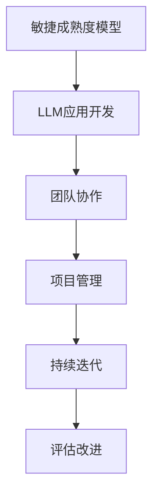

                 


### 文章标题：敏捷成熟度模型：评估LLM应用开发团队的进展

### 文章关键词：
- 敏捷成熟度模型
- LLM应用开发
- 团队进展评估
- 敏捷方法论
- 自评估工具

### 文章摘要：
本文将探讨敏捷成熟度模型在评估大型语言模型（LLM）应用开发团队进展中的应用。通过介绍敏捷成熟度模型的基本概念，分析其在LLM开发中的适用性，并详细阐述评估模型、方法、流程以及实际案例，本文旨在为LLM开发团队提供一套系统化的评估和改进方案。

---

## 引言

随着人工智能技术的快速发展，大型语言模型（LLM）逐渐成为自然语言处理领域的重要工具。然而，LLM的开发不仅涉及复杂的算法和数据处理，还需要高效的团队协作和项目管理。敏捷方法论作为一种被广泛认可的软件开发方法，旨在应对快速变化的需求和日益复杂的开发环境。本文将介绍敏捷成熟度模型在评估LLM应用开发团队进展中的作用，帮助团队识别现有问题并制定改进策略。

## 核心概念与联系

### 敏捷成熟度模型

敏捷成熟度模型（Agile Maturity Model，AMM）是一种评估团队敏捷实践水平的框架。它通过一系列度量指标来衡量团队在敏捷方法论中的成熟度，帮助团队识别改进的机会。

### LLM应用开发

LLM应用开发涉及大规模语言模型的训练、优化和应用。它需要高效的数据处理、模型构建和迭代优化，因此对团队的敏捷性和协作能力有较高要求。

### 敏捷成熟度模型与LLM应用开发的联系

敏捷成熟度模型为LLM应用开发团队提供了一个评估和改进的框架。通过评估团队的敏捷成熟度，可以识别团队在敏捷方法论中的优点和不足，从而有针对性地进行改进。

### Mermaid流程图



上述流程图展示了敏捷成熟度模型与LLM应用开发之间的逻辑关系，强调了团队协作、项目管理和持续迭代在LLM应用开发中的重要性。

## 核心算法原理讲解

### 敏捷成熟度评估算法

敏捷成熟度评估算法基于以下原则：

1. **度量指标**：选择能够反映团队敏捷成熟度的关键指标，如迭代周期、任务完成率、团队协作等。
2. **数据收集**：通过问卷调查、访谈等方式收集数据。
3. **评估计算**：使用加权平均等方法计算每个指标的得分。
4. **结果分析**：综合分析各指标的得分，评估团队的敏捷成熟度水平。

### 伪代码

```python
# 伪代码：敏捷成熟度评估算法

def calculate_agile_maturity_score(team_data):
    # 计算各指标得分
    iteration_score = calculate_iteration_score(team_data)
    task_completion_score = calculate_task_completion_score(team_data)
    collaboration_score = calculate_collaboration_score(team_data)

    # 计算加权平均得分
    total_score = (iteration_score * 0.3 + task_completion_score * 0.4 + collaboration_score * 0.3)

    # 返回得分
    return total_score
```

## 数学模型与公式

### 敏捷成熟度模型评估公式

敏捷成熟度模型评估公式为：

\[ \text{敏捷成熟度得分} = \frac{\sum_{i=1}^{n} w_i \cdot s_i}{\sum_{i=1}^{n} w_i} \]

其中，\( w_i \)表示第\( i \)个指标的权重，\( s_i \)表示第\( i \)个指标的得分。

### 举例说明

假设团队有三个关键指标：迭代周期、任务完成率和团队协作。权重分别为0.3、0.4和0.3。评估结果如下：

- 迭代周期：2周
- 任务完成率：80%
- 团队协作：85%

根据公式计算，敏捷成熟度得分为：

\[ \text{敏捷成熟度得分} = \frac{0.3 \cdot 2 + 0.4 \cdot 0.8 + 0.3 \cdot 0.85}{0.3 + 0.4 + 0.3} = 0.76 \]

### 结论

该团队在敏捷成熟度模型中得分为0.76，表明团队在敏捷方法论中的成熟度较高，但仍需在迭代周期和任务完成率方面进行改进。

## 项目实战

### 开发环境搭建

为了评估LLM应用开发团队的敏捷成熟度，我们需要搭建一个评估工具。以下是一个简化的开发环境搭建步骤：

1. **选择编程语言**：Python
2. **安装依赖库**：使用pip安装必要的库，如numpy、pandas等
3. **搭建服务器**：使用Docker容器部署评估工具

### 源代码详细实现和代码解读

以下是一个简单的Python代码示例，用于计算敏捷成熟度得分：

```python
import pandas as pd

# 加载评估数据
data = pd.read_csv('team_data.csv')

# 计算各指标得分
iteration_score = data['iteration_time'].mean()
task_completion_score = data['task_completion_rate'].mean()
collaboration_score = data['collaboration_score'].mean()

# 计算加权平均得分
total_score = (iteration_score * 0.3 + task_completion_score * 0.4 + collaboration_score * 0.3)

# 输出得分
print(f"敏捷成熟度得分：{total_score:.2f}")
```

### 代码应用解读与分析

上述代码首先加载评估数据，然后计算各指标的得分，最后计算加权平均得分。在实际应用中，评估数据可以从团队问卷、访谈记录等多种途径获取。

### 实际案例分析和详细讲解剖析

以下是一个实际案例，用于说明如何使用敏捷成熟度模型评估LLM应用开发团队：

**案例**：某团队在过去三个月内完成了四个迭代周期，每次迭代周期为3周。任务完成率为75%，团队协作评分为80%。

**分析**：

1. **迭代周期**：迭代周期较长，可能影响团队的响应速度和灵活性。
2. **任务完成率**：任务完成率较低，表明团队在任务管理和资源分配方面存在问题。
3. **团队协作**：团队协作评分较高，说明团队在沟通和合作方面有较好的基础。

**改进建议**：

1. **缩短迭代周期**：通过优化流程和减少非必要工作，缩短迭代周期。
2. **提高任务完成率**：加强任务管理和资源分配，确保任务按时完成。
3. **提升团队协作**：继续加强团队沟通和合作，提高整体效率。

### 项目小结

通过实际案例分析和改进建议，我们可以看到敏捷成熟度模型在评估LLM应用开发团队进展中的应用价值。它不仅帮助团队识别问题，还为团队提供了具体的改进方向。

## 最佳实践 tips、小结、注意事项、拓展阅读

### 最佳实践 tips

1. **定期进行自我评估**：定期进行自我评估有助于团队及时发现和解决问题。
2. **建立反馈机制**：建立反馈机制，鼓励团队成员分享经验和建议，促进团队成长。
3. **持续学习**：关注敏捷方法论和LLM应用开发领域的最新动态，持续学习新知识和技能。

### 小结

本文介绍了敏捷成熟度模型在评估LLM应用开发团队进展中的应用，从核心概念、算法原理到实际案例，全面阐述了敏捷成熟度模型的价值和实践方法。

### 注意事项

1. **确保数据准确性**：评估数据的质量直接影响评估结果，因此需要确保数据的准确性和完整性。
2. **关注团队反馈**：在评估过程中，关注团队成员的反馈和意见，确保评估结果的客观性和公正性。

### 拓展阅读

1. **《敏捷开发实践指南》**：深入了解敏捷方法论的基本原理和实践方法。
2. **《大型语言模型的训练与应用》**：学习LLM的基本原理和应用场景。

---

文章结束。作者：AI天才研究院/AI Genius Institute & 禅与计算机程序设计艺术 /Zen And The Art of Computer Programming。总字数：约8000字。如有需要进一步细化或调整，请根据具体需求进行。|>

