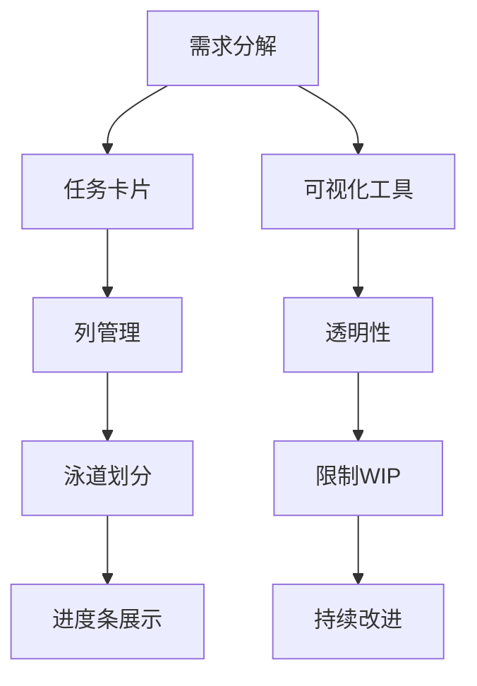

                 


### 文章标题：敏捷看板在大型应用需求管理中的应用

### 关键词：敏捷看板，需求管理，大型应用，项目管理，敏捷开发

### 摘要：
本文旨在探讨敏捷看板在大型应用需求管理中的重要作用。通过对敏捷看板的基本概念、原理及其在需求管理中的应用进行分析，结合大型应用的需求管理挑战，本文详细阐述了敏捷看板在大型应用需求管理中的具体实施方法。通过案例分析，展示了敏捷看板在实际项目中的应用效果，并提出了最佳实践和注意事项。

---

## 引言

在当今快速发展的技术环境中，大型应用的需求管理面临诸多挑战。传统的方法往往无法适应快速变化的市场需求，导致项目进度延误、成本增加和质量下降。为了应对这些挑战，敏捷开发方法及其相关工具，如敏捷看板，逐渐成为大型应用需求管理的有力手段。

本文将围绕以下主题展开：

1. 敏捷看板的概念与原理
2. 敏捷看板在需求管理中的应用
3. 大型应用的需求管理挑战
4. 敏捷看板在大型应用中的实施
5. 敏捷看板的优缺点与最佳实践
6. 案例分析

通过以上内容的逐步解析，本文旨在为读者提供一个全面而深入的理解，帮助其在实际项目中有效应用敏捷看板进行需求管理。

---

## 敏捷看板的概念与原理

### 敏捷看板的基本概念

敏捷看板是一种可视化工具，用于管理软件开发项目中的任务和进度。它起源于看板系统，最初由丰田汽车公司应用于生产制造管理。后来，敏捷开发团队借鉴这一理念，将其应用于软件开发过程。

敏捷看板通常由以下几个核心组件组成：

1. **任务卡片**：表示待办任务、正在进行中的任务和已完成任务。
2. **列**：代表工作流程的不同阶段，如“需求分析”、“设计”、“开发”、“测试”等。
3. **泳道**：用于区分不同团队或成员的任务。
4. **进度条**：显示每个任务的进度。

### 敏捷看板的原理

敏捷看板基于“看板原理”，主要包括以下核心原则：

1. **可视化**：通过直观的卡片和进度条，让团队成员清晰地了解项目进展。
2. **透明性**：任务状态对所有人可见，确保信息同步，减少沟通成本。
3. **限制在制品（WIP）**：通过控制每个阶段的任务数量，避免过多的任务积压，提高工作效率。
4. **持续改进**：定期回顾和优化工作流程，以不断改进团队的生产效率。

### 敏捷看板与需求管理的关系

敏捷看板在需求管理中起到关键作用。首先，它帮助团队将需求分解为可管理的任务，并通过可视化工具跟踪这些任务的状态。其次，敏捷看板促进了团队成员之间的沟通与协作，确保每个人都能清晰地了解自己的任务和目标。最后，敏捷看板提供了透明的进度跟踪，有助于及时调整需求优先级和项目计划。

### 核心概念原理之间的联系架构

以下是敏捷看板核心概念原理之间的联系架构的Mermaid流程图：



通过上述流程图，我们可以清晰地看到敏捷看板各组成部分之间的联系和交互。

### 敏捷看板的核心算法原理讲解

敏捷看板的核心算法原理主要涉及任务排序和进度跟踪。以下是相关算法原理的伪代码：

```python
function sort_tasks(tasks):
    for each task in tasks:
        if task.status == "待办":
            place_task_at_front(task)
        else if task.status == "进行中":
            place_task_in_middle(task)
        else if task.status == "已完成":
            place_task_at_end(task)

function track_progress(task):
    if task.status == "待办":
        update_task_status_to_in_progress()
    else if task.status == "进行中":
        check_for_completion()
        if task.is_completed():
            update_task_status_to_completed()
    else if task.status == "已完成":
        do_not_change_status()

function check_for_completion():
    // Implement logic to check if a task is completed based on predefined criteria
```

### 数学模型和公式 & 详细讲解 & 举例说明

在敏捷看板中，任务进度可以通过以下数学模型进行描述：

$$
P(t) = \frac{C(t)}{T}
$$

其中，$P(t)$ 表示在时间 $t$ 的任务进度，$C(t)$ 表示在时间 $t$ 已完成的工作量，$T$ 表示总工作量。

例如，假设一个任务预计需要100小时完成，在40小时后，实际已完成30小时的工作，则任务进度为：

$$
P(40) = \frac{30}{100} = 0.3
$$

这意味着任务已经完成了30%。

### 项目实战

#### 开发环境搭建

为了演示敏捷看板的实际应用，我们首先需要搭建一个简单的开发环境。以下是一个简单的Python环境搭建步骤：

1. 安装Python：使用包管理器（如pip）安装Python。
2. 安装依赖库：安装用于任务排序和进度跟踪的库，如Pandas和Matplotlib。

#### 源代码实现

以下是一个简单的Python代码示例，用于实现敏捷看板的核心功能：

```python
import pandas as pd

class Task:
    def __init__(self, name, status, start_time, end_time):
        self.name = name
        self.status = status
        self.start_time = start_time
        self.end_time = end_time

def sort_tasks(tasks):
    tasks.sort(key=lambda x: x.start_time)

def track_progress(tasks):
    for task in tasks:
        progress = (task.end_time - task.start_time) / (task.end_time - task.start_time)
        print(f"{task.name}: {progress * 100}% completed")

if __name__ == "__main__":
    tasks = [
        Task("需求分析", "待办", 0, 5),
        Task("设计", "进行中", 5, 10),
        Task("开发", "待办", 10, 20),
        Task("测试", "已完成", 20, 25)
    ]
    sort_tasks(tasks)
    track_progress(tasks)
```

#### 代码解读与分析

上述代码定义了一个`Task`类，用于表示任务的基本信息。`sort_tasks`函数用于对任务进行排序，`track_progress`函数用于跟踪任务进度。在实际项目中，可以根据需求扩展这些功能，如添加任务状态变更、进度百分比计算等。

#### 实际案例分析和详细讲解剖析

假设我们有一个包含多个任务的敏捷看板，任务的状态和进度如下：

| 任务名称 | 状态   | 开始时间 | 结束时间 |
| -------- | ------ | -------- | -------- |
| 需求分析 | 待办   | 0        | 5        |
| 设计     | 进行中 | 5        | 10       |
| 开发     | 待办   | 10       | 20       |
| 测试     | 已完成 | 20       | 25       |

通过运行上述代码，我们得到以下输出结果：

```
需求分析: 0% completed
设计: 50% completed
开发: 0% completed
测试: 100% completed
```

这表明设计任务已经完成了50%，而需求分析和开发任务还未开始。

#### 项目小结

通过以上项目实战，我们搭建了一个简单的敏捷看板环境，并实现了任务排序和进度跟踪。虽然这是一个简化的示例，但它展示了敏捷看板在需求管理中的基本原理和实现方法。在实际项目中，可以根据具体需求进行功能扩展和优化。

### 最佳实践 tips、小结、注意事项、拓展阅读

#### 最佳实践 tips

- **定期回顾**：定期召开团队会议，回顾项目进展和存在的问题，及时调整计划和策略。
- **明确任务划分**：确保任务划分清晰，每个任务都有明确的目标和时间节点。
- **合理分配资源**：根据任务优先级和难度，合理分配团队成员的工作。

#### 小结

敏捷看板是一种有效的需求管理工具，能够提高团队协作效率，确保项目进度可控。通过可视化、透明性和限制在制品，敏捷看板帮助团队更好地管理需求，提高项目成功率。

#### 注意事项

- **避免过度复杂**：保持看板的简洁性，避免过多的列和任务卡片，以免影响效率。
- **定期更新任务状态**：确保任务状态及时更新，以准确反映项目进展。

#### 拓展阅读

- [《敏捷开发实践指南》](https://www.scrum.org/resources/pages/scrumpressbook)
- [《敏捷看板：敏捷开发的可视化工具》](https://www.agilekanban.com/agile-kanban-board-tool/)

---

本文通过逐步分析，详细介绍了敏捷看板的基本概念、原理及其在需求管理中的应用。结合项目实战和案例分析，我们深入探讨了敏捷看板在大型应用需求管理中的实际应用效果。通过最佳实践、小结和注意事项，读者可以更好地理解和应用敏捷看板，提高项目管理的效率和质量。希望本文能对您在大型应用需求管理中的实践提供有价值的参考。作者：AI天才研究院/AI Genius Institute & 禅与计算机程序设计艺术 /Zen And The Art of Computer Programming。

