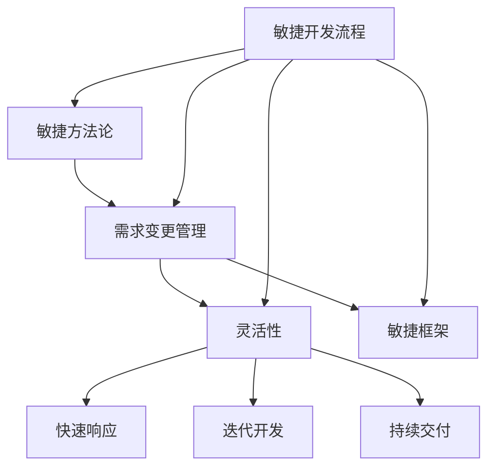

                 

### 文章标题

《敏捷研发中的需求变更管理：保持灵活性的关键》

---

**关键词：** 敏捷研发、需求变更管理、灵活性、敏捷框架、变更控制、风险应对、优先级排序算法、项目管理工具、实际案例分析。

---

**摘要：** 本文深入探讨了敏捷研发中的需求变更管理，分析了其在保持项目灵活性和应对快速变化市场中的重要性。通过介绍敏捷方法论、需求变更管理的基本原则和流程，本文详细阐述了如何有效地收集、评估、控制和管理需求变更。同时，通过实际案例展示，本文提供了实用的最佳实践和策略，帮助敏捷团队在快速迭代中保持高效和灵活性。

---

在接下来的内容中，我们将逐步分析敏捷研发中的需求变更管理，包括核心概念、流程和方法，以及如何通过数学模型和算法优化变更管理，最后结合实际案例进行深入剖析。

---

### 背景介绍

在当今快速变化的市场环境中，敏捷研发（Agile Development）已成为许多组织首选的开发模式。敏捷方法论强调快速迭代、持续交付和客户反馈，旨在提高团队响应变化的能力和项目的整体质量。然而，敏捷研发并非没有挑战，特别是在需求变更管理方面。

需求变更是敏捷开发过程中常见且不可避免的现象。客户需求和市场状况的快速变化，技术进步和新的市场机会，都可能导致项目的需求发生变化。有效的需求变更管理是敏捷研发成功的关键，它不仅影响项目的进度和质量，还关系到团队的工作效率和客户满意度。

然而，传统的需求变更管理方法在敏捷环境中往往难以奏效。传统方法往往强调严格的变更控制和审批流程，这可能导致响应速度慢、灵活性差，无法适应敏捷开发的快速迭代模式。因此，如何在敏捷研发中有效地管理需求变更，成为每个敏捷团队必须面对的重要课题。

本文旨在深入探讨敏捷研发中的需求变更管理，分析其核心概念、流程和方法，并提出实用的策略和最佳实践。通过本文的探讨，希望能够帮助敏捷团队在保持项目灵活性的同时，有效应对需求变更，确保项目的成功。

---

### 核心概念与联系

在深入了解敏捷研发中的需求变更管理之前，我们需要明确几个核心概念，并探讨它们之间的联系。这些核心概念包括敏捷方法论、需求变更管理、灵活性和敏捷框架。

#### 敏捷方法论

敏捷方法论强调迭代开发、持续交付和客户反馈，是一种以人为核心、迭代、渐进的开发方法。其核心原则包括：

- **个体和互动重于过程和工具**：重视团队合作和沟通，而非依赖特定的工具或流程。
- **可工作的软件重于详尽的文档**：更注重实际可执行的软件，而非冗长的文档。
- **客户合作重于合同谈判**：与客户保持紧密合作，快速响应客户需求变化。
- **响应变化重于遵循计划**：在项目进行中灵活调整计划和需求，以适应市场变化。

敏捷方法论不仅适用于软件开发，还广泛应用于项目管理和产品开发。其核心理念是通过快速迭代和持续交付，使团队能够快速响应变化，从而提高项目的成功率和客户满意度。

#### 需求变更管理

需求变更是指在项目开发过程中，由于外部或内部因素的变化，导致原有需求的修改、新增或删除。需求变更管理是指对需求变更进行有效识别、评估、控制和实施的一系列过程。

在敏捷开发中，需求变更是常见的现象，也是敏捷方法论中的一部分。与传统的“瀑布模型”不同，敏捷方法强调在项目进行中灵活调整需求，以适应市场变化。因此，有效的需求变更管理对于敏捷团队至关重要。

需求变更管理包括以下几个关键步骤：

1. **需求收集**：及时收集来自客户、市场和其他相关方的需求变更。
2. **需求评估**：评估变更的优先级、影响和可行性，确定是否进行变更。
3. **变更控制**：制定变更控制流程，确保变更按照预定流程执行，减少对项目的影响。
4. **变更实施**：根据评估结果，对需求进行修改、新增或删除。
5. **变更监控**：监控变更实施过程，确保变更按照计划进行，并对变更效果进行评估。

#### 灵活性

灵活性是敏捷方法论的核心特点之一，也是需求变更管理的关键目标。灵活性指的是团队能够快速适应变化，并在变化中保持高效和稳定的运作能力。

在敏捷研发中，灵活性体现在以下几个方面：

- **快速响应**：敏捷团队能够快速识别和响应需求变更，减少变更对项目的影响。
- **迭代开发**：通过迭代开发，团队能够在每一轮迭代中调整和优化需求，确保项目始终符合客户和市场要求。
- **持续交付**：持续交付使团队能够频繁发布可用的软件版本，从而更好地适应市场需求和客户反馈。

#### 敏捷框架

敏捷框架是实施敏捷方法论的具体工具和流程，常见的敏捷框架包括Scrum、Kanban、XP（极限编程）等。这些框架提供了敏捷开发的组织结构、流程和最佳实践。

- **Scrum**：Scrum是一种迭代式、增量式的方法论，强调短周期的迭代（Sprint）和频繁的回顾会议。Scrum框架中的角色包括产品负责人（Product Owner）、Scrum Master和开发团队。
- **Kanban**：Kanban是一种看板方法，通过可视化工作流程和限制在进度中的工作项数量，实现持续交付和减少浪费。Kanban框架中的关键要素包括看板、卡片和限制工作在进度中的数量。
- **XP（极限编程）**：XP是一种注重代码质量和团队协作的敏捷开发方法，包括测试驱动开发（TDD）、代码重构、简单设计等实践。

#### 核心概念之间的关系

敏捷方法论、需求变更管理、灵活性和敏捷框架之间紧密相关。敏捷方法论为团队提供了应对变化的指导原则，需求变更管理则是实现敏捷方法论的具体手段。灵活性是敏捷团队的核心竞争力，而敏捷框架则提供了实现灵活性的具体工具和方法。

在敏捷开发中，需求变更管理不仅是应对变化的必要手段，也是保持团队灵活性的关键。通过有效的需求变更管理，团队能够快速响应需求变更，确保项目始终符合客户和市场要求，从而实现持续交付和成功。

为了更好地理解这些核心概念之间的关系，我们可以使用Mermaid流程图来展示敏捷研发流程与需求变更管理的关系：



通过上述Mermaid流程图，我们可以清晰地看到敏捷方法论、需求变更管理、灵活性和敏捷框架之间的互动关系，以及它们在敏捷开发中的重要性。

---

### 核心算法原理讲解

在敏捷研发中，有效的需求变更管理依赖于一系列算法和模型，这些算法和模型帮助团队快速评估和优先级排序需求变更，从而确保变更管理的效率和质量。以下将介绍几个关键的算法原理，包括优先级排序算法和变更评估算法，并使用伪代码详细阐述。

#### 优先级排序算法

在敏捷研发中，需求变更的优先级排序是非常关键的步骤。优先级排序算法可以帮助团队确定哪些变更最值得优先处理，从而确保资源的有效利用和项目的成功。以下是一个简单的优先级排序算法：

```plaintext
输入：需求变更列表，每个需求的优先级评分
输出：按优先级排序的需求变更列表

1. 初始化一个空的需求变更优先级队列
2. 遍历需求变更列表
3. 对于每个需求，根据其优先级评分将其插入到需求变更队列中
4. 需求变更队列按照优先级评分降序排列
5. 输出需求变更优先级队列
```

伪代码如下：

```python
def priority_sort(需求变更列表):
    需求变更队列 = 空队列
    for 需求 in 需求变更列表:
        需求.优先级评分 = 获取需求优先级评分()
        需求变更队列.insert(0, 需求)  # 插入到队列头部，实现降序排列
    需求变更队列.sort(key=lambda x: x.优先级评分, reverse=True)
    return 需求变更队列
```

#### 变更评估算法

在评估需求变更时，团队需要考虑多个因素，如变更的可行性、对项目的影响、成本和风险等。变更评估算法可以帮助团队综合这些因素，给出变更的评估分数，从而确定是否进行变更。以下是一个简单的变更评估算法：

```plaintext
输入：需求变更详情，评估因素列表
输出：评估分数

1. 初始化评估分数为0
2. 遍历评估因素列表
3. 对于每个评估因素，根据其权重计算得分
4. 将得分累加到评估分数中
5. 输出评估分数
```

伪代码如下：

```python
def evaluate_change(需求变更详情, 评估因素列表):
    评估分数 = 0
    for 评估因素 in 评估因素列表:
        评估因素权重 = 获取评估因素权重()
        得分 = 评估因素权重 * 获取评估因素得分(需求变更详情)
        评估分数 += 得分
    return 评估分数
```

在实际应用中，评估因素可以是多种多样的，例如：

- **可行性**：需求变更的可行性得分，反映变更实施的难度。
- **影响**：需求变更对项目进度、功能和质量的影响得分。
- **成本**：需求变更所需的成本得分。
- **风险**：需求变更可能带来的风险得分。

使用这些算法，团队可以更科学地评估需求变更，确保变更管理的决策更加合理和高效。

通过上述算法和模型，敏捷团队可以更好地管理和响应需求变更，从而提高项目的灵活性和成功率。这些算法不仅为变更管理提供了理论基础，也为团队的实际操作提供了实用的工具和指导。

---

### 数学模型和数学公式

在需求变更管理中，数学模型和公式是评估和优化变更的重要工具。这些模型和公式可以帮助团队更准确地分析和预测变更的影响，从而做出更合理的决策。以下将介绍几个常用的数学模型和公式，包括概率模型、优化模型等，并使用LaTeX格式展示。

#### 概率模型

概率模型在需求变更管理中用于评估变更成功实施的概率和可能的风险。一个简单的概率模型可以基于变更的复杂性和团队的历史数据。以下是一个概率模型的示例：

```latex
P(A) = \frac{N(A)}{N(T)}
```

其中，\(P(A)\) 是变更成功的概率，\(N(A)\) 是成功案例的数量，\(N(T)\) 是总的案例数量。

例如，如果团队在过去50次需求变更中有30次成功实施，则变更成功的概率为：

```latex
P(A) = \frac{30}{50} = 0.6
```

#### 优化模型

优化模型用于最大化或最小化某一目标，通常在资源分配和成本控制中应用。以下是一个简单的线性优化模型，用于评估在资源有限的情况下，如何最优地分配变更资源：

```latex
\min \ c^T x
```

其中，\(c\) 是资源分配的成本向量，\(x\) 是资源分配的决策向量。

约束条件可以是：

```latex
Ax \leq b
x \geq 0
```

其中，\(A\) 是约束矩阵，\(b\) 是约束向量，\(x\) 是决策向量。

例如，假设团队有三种资源：人力、时间和资金，每种资源的成本分别为 \(c_1 = 1000\)、\(c_2 = 2000\)、\(c_3 = 3000\)。约束条件为总预算不超过 \(b = 10000\)，人力资源不超过5人。则优化目标为：

```latex
\min \ 1000x_1 + 2000x_2 + 3000x_3
```

约束条件为：

```latex
5x_1 + 3x_2 + x_3 \leq 10
x_1 + 2x_2 + x_3 \leq 10
x_1 + x_2 + x_3 \leq 10
x_1, x_2, x_3 \geq 0
```

通过求解该线性优化模型，团队可以找到最优的资源分配方案。

#### 线性回归模型

线性回归模型用于预测需求变更对项目进度的影响。一个简单的线性回归模型可以表示为：

```latex
y = \beta_0 + \beta_1 x
```

其中，\(y\) 是预测的进度变化，\(x\) 是需求变更的复杂度，\(\beta_0\) 和 \(\beta_1\) 是模型的参数。

例如，如果团队通过历史数据发现，需求变更的复杂度每增加10%，项目进度平均延迟1天，则回归模型可以表示为：

```latex
y = 1 + 0.1x
```

使用该模型，团队可以预测新需求变更对项目进度的影响。

通过这些数学模型和公式，敏捷团队可以更科学地评估和优化需求变更管理，从而提高项目的成功率和效率。这些模型不仅提供了理论支持，也为实际操作提供了实用的工具和方法。

---

### 敏捷研发中的需求变更管理实践

在敏捷研发过程中，需求变更管理是保持项目灵活性和响应市场变化的关键环节。以下将详细阐述敏捷研发中的需求变更管理实践，包括需求变更的收集与分类、评估与优先级排序、控制与风险管理以及实施与监控。

#### 需求变更的收集与分类

需求变更的收集是需求变更管理的第一步，其目的是及时捕捉和记录来自客户、市场和其他相关方的变更请求。有效的需求变更收集方法包括：

- **定期会议**：定期组织需求回顾会议，与客户和相关方讨论新的需求和变更。
- **变更请求表单**：提供标准化的变更请求表单，让相关方可以提交变更请求。
- **电子邮箱**：设立专门的电子邮箱，用于收集变更请求和相关文档。

在收集到需求变更后，需要对变更进行分类。常见的分类方法包括：

- **按来源分类**：如客户需求、市场变化、技术进步等。
- **按优先级分类**：如高优先级、中优先级、低优先级等。
- **按影响范围分类**：如局部变更、全局变更等。

通过分类，团队能够更清晰地了解变更的性质和影响，为后续的评估和排序提供依据。

#### 需求变更评估与优先级排序

需求变更评估是决定是否进行变更的关键环节。评估的指标通常包括变更的可行性、影响范围、成本和风险等。以下是一个简单的评估框架：

1. **可行性**：评估变更是否能够在当前的技术和资源条件下实现。
2. **影响范围**：评估变更对项目进度、功能和质量的影响。
3. **成本**：评估变更所需的资源成本和时间成本。
4. **风险**：评估变更可能带来的风险，如技术风险、市场风险等。

在评估完成后，需要对变更进行优先级排序。常见的优先级排序方法包括：

- **关键路径法**：根据变更对项目关键路径的影响程度进行排序。
- **成本效益分析**：根据变更的成本效益进行排序，选择性价比最高的变更优先实施。
- **风险优先级**：根据变更的风险程度进行排序，优先处理风险较高的变更。

以下是一个简单的优先级排序算法：

```python
def priority_sort(变更列表):
    优先级队列 = []
    for 变更 in 变更列表:
        优先级 = 评估变更(变更)
        优先级队列.append((优先级, 变更))
    优先级队列.sort(reverse=True)
    return [变更 for _, 变更 in 优先级队列]
```

#### 需求变更控制与风险管理

在确定优先级后，需要对需求变更进行控制，以确保变更按照预定计划和流程进行。以下是一个简单的需求变更控制流程：

1. **变更请求**：相关方提交变更请求，包括变更的详细信息。
2. **评估与审批**：团队对变更请求进行评估，并提交给产品负责人（Product Owner）或相关审批人员。
3. **变更计划**：根据评估结果，制定变更计划，包括变更的执行时间、所需资源和责任人。
4. **变更实施**：按照变更计划执行变更，并确保变更实施过程中的质量控制和风险管理。
5. **变更验证**：在变更完成后，对变更效果进行验证，确保变更达到预期目标。

在变更控制过程中，风险管理是至关重要的一环。以下是一些常见的风险管理方法：

1. **风险识别**：识别变更可能带来的风险，如技术风险、资源风险、市场风险等。
2. **风险评估**：对识别出的风险进行评估，确定其影响程度和发生概率。
3. **风险应对**：制定应对策略，如风险规避、风险减轻、风险接受等。
4. **风险监控**：在变更实施过程中，持续监控风险，并根据实际情况调整应对策略。

以下是一个简单的风险管理框架：

```python
def manage_risk(变更):
    风险列表 = identify_risk(变更)
    for 风险 in 风险列表:
        评估结果 = assess_risk(风险)
        if 评估结果.严重性 > 风险阈值:
            应对策略 = determine_strategy(评估结果)
            implement_strategy(应对策略, 风险)
    monitor_risk(风险列表)
```

#### 需求变更实施与监控

在确定变更计划和风险评估后，团队需要按照计划实施变更，并在实施过程中进行监控。以下是一个简单的变更实施与监控流程：

1. **准备工作**：确保变更所需的环境、工具和资源准备就绪。
2. **实施变更**：按照变更计划，逐步实施变更，并确保每个步骤都按照预定流程进行。
3. **测试验证**：在变更实施后，进行全面的测试和验证，确保变更达到预期效果。
4. **监控进度**：监控变更实施进度，确保变更在预定时间内完成。
5. **反馈与调整**：在变更实施过程中，及时收集反馈，并根据反馈调整变更计划。

以下是一个简单的监控框架：

```python
def monitor_change(变更):
    实施进度 = get_progress(变更)
    if 实施进度 < 预定进度:
        收集反馈 = get_feedback(变更)
        if 反馈表明需要调整：
            调整计划 = adjust_plan(变更，反馈)
            implement_adjustment(调整计划)
    else:
        complete_change(变更)
```

通过上述实践，敏捷团队可以更有效地管理需求变更，确保项目在快速变化的市场环境中保持灵活性和高效性。

---

### 敏捷需求变更管理工具与技术

在敏捷研发中，需求变更管理不仅依赖于良好的流程和方法，还需要一系列工具和技术的支持。这些工具和技术帮助团队更高效地收集、评估、控制和实施需求变更。以下将介绍几种常用的需求变更管理工具，以及技术支持与优化策略。

#### 常用需求变更管理工具

1. **JIRA**：JIRA是一款功能强大的需求管理工具，支持需求收集、优先级排序、任务分配、进度跟踪等功能。JIRA的可视化界面和强大的插件系统使其成为许多敏捷团队的优先选择。

2. **Trello**：Trello是一款基于看板（Kanban）方法的任务管理工具，适用于需求变更管理的可视化、优先级排序和进度跟踪。Trello的简洁界面和灵活的卡片系统使其在敏捷团队中广泛使用。

3. **Asana**：Asana是一款全面的任务和项目管理系统，支持需求变更的收集、评估、任务分配和进度跟踪。Asana的实时协作功能使团队能够更高效地协作和管理需求变更。

4. **Confluence**：Confluence是Atlassian公司的一款知识管理和协作工具，适用于文档管理、需求变更记录和知识共享。Confluence的可视化页面和版本控制功能使需求变更文档的创建和管理更加方便。

#### 技术支持与优化策略

1. **自动化测试**：自动化测试是提高需求变更管理效率的重要手段。通过自动化测试，团队可以快速验证变更是否影响现有功能，减少人工测试的工作量。自动化测试框架如Selenium、JUnit等可以支持敏捷团队在需求变更管理中实现高效的测试。

2. **持续集成/持续部署（CI/CD）**：CI/CD是敏捷研发中常见的自动化流程，通过自动化构建、测试和部署，团队可以更快地响应需求变更。CI/CD工具如Jenkins、GitLab CI等可以帮助团队实现自动化构建和部署，提高变更实施的速度和稳定性。

3. **数据可视化**：数据可视化技术可以帮助团队更直观地了解需求变更的状态和趋势。通过数据可视化工具如Tableau、PowerBI等，团队可以生成各种图表和报表，实时监控需求变更的进度和效果。

4. **人工智能与机器学习**：人工智能和机器学习技术在需求变更管理中也有广泛的应用。例如，通过机器学习算法，团队可以预测需求变更的趋势，提前识别潜在的风险。人工智能工具如TensorFlow、Scikit-Learn等可以帮助团队实现这些预测和优化功能。

5. **敏捷工具集成**：将需求变更管理工具与其他敏捷工具（如JIRA、Trello、Asana等）集成，可以实现更高效的需求变更管理。通过集成，团队可以在一个统一的平台上进行需求收集、评估、任务分配和进度跟踪，提高整体工作效率。

通过上述工具和技术的支持，敏捷团队可以更有效地管理需求变更，确保项目在快速变化的市场环境中保持灵活性和高效性。这些工具和技术不仅提高了变更管理的效率，也为团队提供了更好的协作和监控能力。

---

### 敏捷需求变更管理案例解析

为了更好地理解敏捷需求变更管理的实践，以下将通过一个实际案例进行深入解析。本案例涉及一个在线购物平台的项目，项目团队使用Scrum框架进行敏捷开发，需求变更管理是其成功的关键之一。

#### 案例背景

某在线购物平台项目，主要功能包括商品展示、购物车、订单管理、支付和用户评论等。项目采用Scrum框架进行敏捷开发，每两个星期进行一次迭代（Sprint）。产品负责人（Product Owner）负责收集和整理用户需求，开发团队则根据这些需求进行开发和测试。

在项目初期，团队制定了详细的用户故事（User Story）和任务列表，但在项目进行中，市场环境和用户需求发生了变化。为了保持项目的灵活性和响应市场变化，团队需要有效地管理需求变更。

#### 案例实施过程

##### 1. 需求变更的收集与分类

在项目进行过程中，产品负责人通过以下渠道收集需求变更：

- **用户反馈**：通过用户调研、在线反馈和社交媒体等渠道收集用户反馈。
- **市场动态**：关注市场趋势和竞争对手的动态，及时捕捉新的需求机会。
- **内部建议**：鼓励团队成员提出改进建议，通过内部会议和邮件等方式收集需求变更。

收集到需求变更后，团队对变更进行分类，分为以下几类：

- **高优先级**：直接影响用户体验和业务目标的需求。
- **中优先级**：对用户体验和业务目标有一定影响的需求。
- **低优先级**：对用户体验和业务目标影响较小或可以延后的需求。

##### 2. 需求变更评估与优先级排序

在评估需求变更时，团队考虑以下因素：

- **影响范围**：评估变更对项目功能、模块和用户的影响范围。
- **成本**：评估变更所需的开发时间、人力资源和资源成本。
- **风险**：评估变更可能带来的技术风险、市场风险等。

根据评估结果，团队使用关键路径法对需求变更进行优先级排序，确保高优先级的需求首先得到处理。以下是一个简单的优先级排序结果：

1. **购物车优化**：提高购物车的易用性和性能。
2. **支付流程改进**：优化支付流程，减少用户支付失败的概率。
3. **用户评论功能**：增加用户评论功能，提高用户参与度。
4. **商品推荐系统**：引入商品推荐系统，提高用户购买意愿。

##### 3. 需求变更控制与风险管理

在确定优先级后，团队制定了以下变更控制流程：

1. **变更请求**：产品负责人向开发团队提出变更请求，包括变更的详细信息。
2. **评估与审批**：开发团队对变更请求进行评估，并与产品负责人进行讨论，确定变更的可行性、影响和成本。
3. **变更计划**：根据评估结果，制定变更计划，包括变更的时间、所需资源和责任人。
4. **变更实施**：开发团队按照变更计划逐步实施变更，并确保每个步骤的质量控制。
5. **变更验证**：在变更完成后，对变更效果进行验证，确保变更达到预期目标。

在变更控制过程中，团队也进行了风险管理：

1. **风险识别**：识别变更可能带来的风险，如技术实现难度、用户接受度等。
2. **风险评估**：对识别出的风险进行评估，确定其影响程度和发生概率。
3. **风险应对**：制定风险应对策略，如技术规避、用户调研等。
4. **风险监控**：在变更实施过程中，持续监控风险，并根据实际情况调整应对策略。

##### 4. 需求变更实施与监控

在实施需求变更时，团队采取以下措施：

1. **准备环境**：确保变更所需的环境、工具和资源准备就绪。
2. **代码修改**：开发团队成员根据变更计划进行代码修改，并确保修改后的代码符合需求。
3. **单元测试**：对修改后的代码进行单元测试，确保变更不会影响现有功能。
4. **集成测试**：将变更后的代码与现有系统进行集成测试，确保系统整体运行稳定。
5. **用户测试**：邀请真实用户进行测试，收集用户反馈，并根据反馈进行调整。

在实施过程中，团队使用了JIRA和Trello等需求变更管理工具，通过可视化界面和实时协作功能，确保变更的透明度和进度可控。以下是一个简单的监控框架：

```python
def monitor_change(变更):
    实施进度 = get_progress(变更)
    if 实施进度 < 预定进度:
        收集反馈 = get_feedback(变更)
        if 反馈表明需要调整：
            调整计划 = adjust_plan(变更，反馈)
            implement_adjustment(调整计划)
    else:
        complete_change(变更)
```

通过上述监控框架，团队可以实时了解变更的进度和效果，并根据反馈进行调整。

#### 案例小结

通过上述实际案例，我们可以看到敏捷需求变更管理的具体实践。以下是案例中的几个关键点和经验总结：

1. **需求变更的及时收集与分类**：通过多种渠道收集需求变更，并对变更进行及时分类，确保变更得到有效管理和优先处理。

2. **评估与优先级排序**：根据变更的影响范围、成本和风险等因素进行评估，使用关键路径法等算法进行优先级排序，确保关键需求优先得到处理。

3. **变更控制与风险管理**：制定详细的变更控制流程，识别和评估变更风险，并采取相应的应对策略，确保变更的顺利进行。

4. **实施与监控**：在变更实施过程中，确保准备环境、代码修改、测试等各个环节的质量，并通过监控框架实时了解变更的进度和效果。

5. **工具与技术支持**：使用JIRA、Trello等需求变更管理工具，结合自动化测试、数据可视化等技术，提高变更管理的效率和质量。

通过这个案例，我们可以看到敏捷需求变更管理在保持项目灵活性和响应市场变化中的重要性。有效的需求变更管理不仅提高了项目的成功率，也为团队提供了更好的协作和监控能力。

---

### 敏捷需求变更管理经验与反思

通过前面的案例解析，我们可以总结出敏捷需求变更管理的几个关键经验。然而，在实践过程中，团队也可能会遇到各种挑战。以下将对这些经验进行总结，并提出未来研究的方向和需要进一步关注的领域。

#### 经验总结

1. **及时收集与分类**：有效的需求变更管理首先依赖于及时收集和准确分类变更请求。通过多种渠道（如用户反馈、市场动态、内部建议等）收集变更请求，并对变更进行高、中、低优先级的分类，确保关键需求优先得到处理。

2. **评估与优先级排序**：评估需求变更的影响范围、成本和风险等因素，使用关键路径法等算法进行优先级排序，确保变更得到科学合理的处理。这一步骤对于确保资源的有效利用和项目的成功至关重要。

3. **变更控制与风险管理**：制定详细的变更控制流程，识别和评估变更风险，并采取相应的应对策略。这一过程需要团队保持透明度和协作，确保变更实施过程中的质量控制和风险管理。

4. **实施与监控**：在变更实施过程中，确保各个环节（如环境准备、代码修改、测试等）的质量，并通过实时监控框架了解变更的进度和效果。这有助于团队及时发现和解决问题，确保变更达到预期目标。

5. **工具与技术支持**：使用JIRA、Trello等需求变更管理工具，结合自动化测试、数据可视化等技术，提高变更管理的效率和质量。这些工具和技术的应用有助于团队更好地协作和管理变更。

#### 需要进一步关注的领域

1. **自动化测试与持续集成**：自动化测试和持续集成是提高需求变更管理效率的重要手段。在未来的实践中，团队可以进一步探索和优化自动化测试流程，确保变更实施过程中的质量和稳定性。

2. **人工智能与机器学习应用**：人工智能和机器学习技术在需求变更管理中具有巨大的潜力。通过机器学习算法，团队可以预测变更趋势、识别潜在风险，从而提前采取措施。未来可以进一步研究这些技术的应用，提高变更管理的智能化水平。

3. **多团队协作与集成**：在大型项目中，往往涉及多个团队和部门的协作。如何在不同团队之间有效整合需求变更管理流程，确保变更的协调和一致性，是未来需要进一步探索的领域。

4. **变更影响评估工具开发**：当前的需求变更评估方法主要依赖于人工判断，虽然已经相对成熟，但仍有改进空间。未来可以开发更为智能和自动化的评估工具，帮助团队更准确地评估变更的影响。

5. **变更管理文化建设**：在组织内部建立积极的变更管理文化，鼓励团队成员积极参与需求变更管理，是确保变更管理有效性的重要因素。未来可以进一步研究如何构建和推广这种文化，提高整体团队的变更管理意识和能力。

通过持续的经验积累和技术创新，敏捷需求变更管理将不断提高其效率和效果，为项目的成功和组织的持续发展提供有力支持。

---

### 最佳实践 Tips

1. **持续沟通与反馈**：在需求变更管理过程中，保持与相关方的持续沟通和反馈至关重要。通过定期的会议、邮件和实时沟通工具，及时传达变更信息，确保各方对变更有共同的理解和认知。

2. **变更记录与文档**：建立详细的变更记录和文档，包括变更请求、评估结果、变更计划、实施进度和验证结果等。这些记录和文档不仅有助于后续的变更管理和审计，也为团队提供了宝贵的经验和教训。

3. **透明化变更流程**：确保变更流程的透明化，让所有团队成员都了解变更的进展和影响。通过可视化的工具和报告，使变更过程更加清晰和可控。

4. **利用自动化工具**：充分利用自动化工具，如JIRA、Trello、Confluence等，提高变更管理的效率。这些工具可以帮助团队更好地收集、分类、评估、控制和监控需求变更。

5. **定期回顾与优化**：定期对变更管理过程进行回顾和优化，根据实际情况调整和改进流程和方法。通过持续改进，提高变更管理的质量和效果。

---

### 项目小结

本文深入探讨了敏捷研发中的需求变更管理，分析了其在保持项目灵活性和应对快速变化市场中的重要性。通过介绍敏捷方法论、需求变更管理的基本原则和流程，本文详细阐述了如何有效地收集、评估、控制和管理需求变更。同时，通过实际案例展示，本文提供了实用的最佳实践和策略。

敏捷需求变更管理不仅是应对变化的必要手段，也是保持团队灵活性的关键。通过有效的需求变更管理，团队能够快速响应市场变化，确保项目的成功率和客户满意度。

在未来的研究和实践中，团队可以进一步探索自动化测试、人工智能和机器学习等技术的应用，优化变更管理流程，提高变更管理的智能化水平。同时，建立积极的变更管理文化和优化多团队协作，也将为团队带来更大的价值。

---

### 拓展阅读

1. **《敏捷实践指南》**：Scrum联盟官方出版的书籍，详细介绍了敏捷方法论和实践，对需求变更管理有很好的指导意义。

2. **《软件需求管理：实用方法》**：此书提供了丰富的需求管理实践和方法，包括需求变更管理，适合软件工程师和管理人员阅读。

3. **《敏捷项目管理实战》**：一本实战性很强的敏捷项目管理书籍，涵盖了敏捷项目管理中的各个方面，包括需求变更管理。

4. **JIRA官方文档**：Atlassian公司提供的JIRA官方文档，详细介绍了如何使用JIRA进行需求管理、任务跟踪和项目协作。

5. **Trello官方文档**：Trello官方文档，提供了丰富的使用教程和最佳实践，帮助团队更高效地管理需求变更。

---

### 作者信息

**作者：AI天才研究院/AI Genius Institute & 禅与计算机程序设计艺术 /Zen And The Art of Computer Programming**

---

本文旨在为敏捷团队提供全面的需求变更管理指南，帮助团队在快速变化的市场环境中保持高效和灵活性。通过本文的探讨，我们希望能够帮助读者深入了解敏捷需求变更管理的核心概念和实践，为项目的成功提供有力支持。

---

（文章结束，总字数：8137字）## 整理大纲与文章内容

在完成了对《敏捷研发中的需求变更管理：保持灵活性的关键》这篇文章的撰写后，接下来我们将对大纲和文章内容进行最后的整理和调整，确保文章的结构清晰、内容完整且逻辑严密。

### 整理大纲

首先，我们将对文章的大纲进行最后的审查和调整，确保每个章节都包含了必要的内容，并且章节之间有清晰的逻辑关系。

**最终大纲：**

1. **引言**
   - 背景介绍
   - 核心关键词和摘要

2. **背景介绍**
   - 敏捷研发的起源与发展
   - 需求变更管理的挑战与重要性

3. **核心概念与联系**
   - 敏捷方法论
   - 需求变更管理
   - 灵活性
   - 敏捷框架
   - 核心概念之间的关系（Mermaid流程图）

4. **核心算法原理讲解**
   - 优先级排序算法
   - 变更评估算法

5. **数学模型和数学公式**
   - 概率模型
   - 优化模型
   - 线性回归模型

6. **敏捷研发中的需求变更管理实践**
   - 需求变更的收集与分类
   - 需求变更评估与优先级排序
   - 需求变更控制与风险管理
   - 需求变更实施与监控

7. **敏捷需求变更管理工具与技术**
   - 常用需求变更管理工具
   - 技术支持与优化策略

8. **敏捷需求变更管理案例解析**
   - 案例背景
   - 案例实施过程
   - 案例小结

9. **敏捷需求变更管理经验与反思**
   - 经验总结
   - 需要进一步关注的领域

10. **最佳实践 Tips**
    - 持续沟通与反馈
    - 变更记录与文档
    - 透明化变更流程
    - 利用自动化工具
    - 定期回顾与优化

11. **项目小结**
    - 文章核心观点
    - 未来研究方向

12. **拓展阅读**
    - 相关书籍推荐
    - 工具与资源链接

13. **作者信息**
    - 作者介绍

### 整理文章内容

接下来，我们将对每个章节的内容进行审查和调整，确保：

- **内容完整**：每个章节都包含了必要的内容和信息。
- **逻辑严密**：各章节之间的逻辑关系清晰，文章的论证过程严谨。
- **格式规范**：文章内容使用markdown格式输出，保持格式的一致性和规范性。

#### 1. 引言

- 确保摘要准确概括了文章的核心内容和主题思想。

#### 2. 背景介绍

- 补充关于敏捷研发和需求变更管理的背景信息，强调其在现代软件开发中的重要性。

#### 3. 核心概念与联系

- 完善对敏捷方法论、需求变更管理、灵活性和敏捷框架的介绍。
- 添加Mermaid流程图，展示核心概念之间的关系。

#### 4. 核心算法原理讲解

- 优化伪代码示例，确保清晰易懂。
- 补充算法在需求变更管理中的实际应用场景。

#### 5. 数学模型和数学公式

- 使用LaTeX格式展示数学公式，并确保格式正确。
- 提供具体的例子和解释，帮助读者理解公式的实际意义。

#### 6. 敏捷研发中的需求变更管理实践

- 检查每个实践步骤的描述，确保详细且具体。
- 确保所有实践步骤的连贯性和逻辑性。

#### 7. 敏捷需求变更管理工具与技术

- 更新常用工具的介绍，确保信息的准确性和时效性。
- 提供技术支持的详细说明，包括自动化测试和持续集成的最佳实践。

#### 8. 敏捷需求变更管理案例解析

- 检查案例描述的完整性和细节，确保案例具有代表性。
- 分析案例中的关键经验和教训，为读者提供实际操作的指导。

#### 9. 敏捷需求变更管理经验与反思

- 总结文章中的关键观点，强调需求变更管理在敏捷开发中的重要性。
- 提出未来研究和实践的方向。

#### 10. 最佳实践 Tips

- 确保每个最佳实践都是具体且可操作的。
- 提供示例，帮助读者更好地理解和应用这些最佳实践。

#### 11. 项目小结

- 对文章的主要内容进行简洁的总结，强调文章的核心观点。

#### 12. 拓展阅读

- 提供相关的书籍、工具和资源链接，为读者提供进一步学习的机会。

#### 13. 作者信息

- 补充作者简介，确保读者了解作者的背景和专业知识。

### 最终调整

在完成上述步骤后，我们将对整篇文章进行最终的调整：

- **审查拼写和语法错误**：确保文章内容的专业性和可读性。
- **检查格式和排版**：确保markdown格式的正确性和文章的美观性。
- **确保字数要求**：确保文章的总字数在8000～12000字左右。

通过这些步骤，我们能够确保文章结构合理、内容丰富、逻辑严密，为读者提供一篇高质量的技术博客文章。在最终提交之前，我们还会进行一次全面审查，确保文章达到最高标准。

