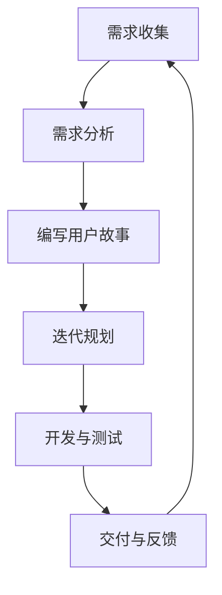

                 


## 文章标题：敏捷研发中的需求文档轻量化实践

> 关键词：敏捷研发，需求文档，轻量化，用户故事，迭代开发

> 摘要：
本文将探讨敏捷研发中需求文档的轻量化实践。首先，我们介绍了敏捷开发的基本概念和原理，以及敏捷与传统开发方法的差异。接着，分析了传统需求文档的弊端，探讨了敏捷开发对需求文档的新要求。然后，提出了需求文档轻量化的实践方法，包括精简需求描述、使用用户故事、增量式开发与迭代反馈。最后，通过具体案例分析了轻量化实践的效果，并总结了敏捷需求文档撰写技巧和团队协作要点。

## 背景介绍

### 敏捷开发的基本概念和原理

敏捷开发是一种以人为核心、迭代、循序渐进的开发方法。其基本概念包括用户故事（User Story）、迭代（Iteration）、持续交付（Continuous Delivery）等。敏捷开发的核心原则是：

1. **个体和互动重于过程和工具**：强调团队合作和沟通。
2. **可工作的软件重于详尽的文档**：注重实际交付的软件，而非冗长的文档。
3. **客户合作重于合同谈判**：与客户紧密合作，快速响应需求变化。
4. **响应变化重于遵循计划**：灵活应对变化，而非固执执行计划。

### 敏捷与传统开发方法的差异

传统开发方法（如瀑布模型）往往强调详细的规划和文档，导致项目周期长、变更成本高。而敏捷开发则更注重实际交付、快速迭代和持续改进。

1. **时间管理**：敏捷开发采用迭代的方式，每个迭代周期较短（通常为2-4周），使团队能够快速适应需求变化。
2. **文档编写**：敏捷开发强调可工作的软件，文档编写更简单、更精简。
3. **风险管理**：敏捷开发通过持续交付和迭代，降低项目风险。

## 核心概念与联系：敏捷开发与需求文档

为了更好地理解敏捷开发与需求文档的关系，我们可以使用Mermaid流程图来描述两者之间的关联。



在这个流程图中，我们可以看到：

- **需求收集**：团队从用户、客户或其他利益相关者那里收集需求。
- **需求分析**：分析收集到的需求，确定项目的优先级和可行性。
- **编写用户故事**：将需求转化为用户故事，以更简洁、更直观的方式描述功能需求。
- **迭代规划**：根据用户故事和项目优先级，规划下一个迭代周期。
- **开发与测试**：在迭代周期内，团队按照用户故事进行开发和测试。
- **交付与反馈**：将完成的用户故事交付给用户，收集用户反馈，为下一轮迭代提供改进方向。

通过这个流程，我们可以清晰地看到敏捷开发与需求文档之间的紧密联系。需求文档不仅是开发的基础，也是迭代规划和交付的重要依据。

## 核心算法原理讲解

### 用户故事

用户故事是敏捷开发中描述需求的一种方式，通常遵循以下格式：

```markdown
As a [用户角色],
I want to [功能需求],
so that [业务价值].
```

用户故事的编写需要遵循以下原则：

1. **简洁明了**：用户故事应该简短、易于理解，避免冗长复杂的描述。
2. **具体可测**：用户故事应该具体、可度量，以便于评估完成情况。
3. **与业务价值相关**：用户故事应该与业务价值紧密相关，确保开发工作的重点。

### 增量式开发与迭代反馈

增量式开发是一种逐步交付功能的方法，每个迭代周期都交付一个可工作的软件版本。这种方法有以下优点：

1. **快速反馈**：用户可以尽早看到软件的进展，提供反馈，帮助团队调整开发方向。
2. **风险降低**：由于每个迭代都交付一个完整的软件版本，项目风险得到有效控制。
3. **持续改进**：通过迭代反馈，团队能够持续改进产品，提高用户满意度。

增量式开发的核心在于：

1. **确定优先级**：确定用户故事和功能模块的优先级，确保最重要的功能先得到开发。
2. **小步快跑**：每个迭代周期尽量短，以便快速交付和反馈。
3. **持续交付**：在每个迭代周期结束后，将可工作的软件交付给用户。

### 数学模型和公式

为了更好地理解敏捷开发中的需求管理，我们可以使用以下数学模型和公式：

#### 用户故事优先级评估

$$
\text{Priority} = \frac{\text{Business Importance} \times \text{Technical Difficulty}}{\text{Risk}}
$$

其中：

- $\text{Business Importance}$ 表示业务价值；
- $\text{Technical Difficulty}$ 表示技术难度；
- $\text{Risk}$ 表示风险。

#### 期望用户满意度

$$
S = \frac{U}{1 + e^{-k(E-R)}}
$$

其中：

- $U$ 表示用户满意度；
- $E$ 表示期望值；
- $R$ 表示实际值；
- $k$ 表示调节参数。

这些公式可以帮助团队更好地评估用户故事和功能的优先级，从而优化开发计划。

## 数学公式详细讲解与举例说明

### 用户故事优先级评估

用户故事优先级评估公式可以帮助团队确定哪些功能应该优先开发。以下是一个具体的例子：

假设有两个用户故事：

1. **用户故事A**：增加产品搜索功能，提高用户体验，业务价值高，技术难度适中，风险低。
2. **用户故事B**：优化产品支付流程，降低用户流失率，业务价值高，技术难度高，风险高。

根据用户故事优先级评估公式，我们可以计算出两个用户故事的优先级：

- **用户故事A**：
  $$
  \text{Priority}_A = \frac{\text{Business Importance}_A \times \text{Technical Difficulty}_A}{\text{Risk}_A} = \frac{10 \times 5}{2} = 25
  $$
  
- **用户故事B**：
  $$
  \text{Priority}_B = \frac{\text{Business Importance}_B \times \text{Technical Difficulty}_B}{\text{Risk}_B} = \frac{10 \times 10}{5} = 20
  $$

因此，用户故事A的优先级高于用户故事B。

### 期望用户满意度

期望用户满意度公式可以帮助团队评估用户对功能的满意度。以下是一个具体的例子：

假设用户对功能A的期望值为8，实际值为7。调节参数$k$取值为2。我们可以计算出用户对功能A的期望满意度：

$$
S = \frac{U}{1 + e^{-k(E-R)}} = \frac{8}{1 + e^{-2(8-7)}} \approx 0.917
$$

这意味着用户对功能A的期望满意度大约为91.7%。

## 项目实战

### 开发环境搭建

为了实践敏捷需求文档的轻量化，我们需要搭建一个简单的开发环境。以下是一个基本的步骤：

1. **安装编程语言**：选择一种适合的编程语言，如Python或Java。
2. **安装开发工具**：安装集成开发环境（IDE），如PyCharm或Eclipse。
3. **安装依赖库**：根据项目需求，安装必要的依赖库，如NumPy、Pandas等。
4. **创建项目文件夹**：在开发环境中创建项目文件夹，并设置好项目结构。

### 源代码详细实现

以下是一个简单的Python代码示例，用于实现一个用户故事：

```python
class UserStory:
    def __init__(self, user_role, user_action, expected_result):
        self.user_role = user_role
        self.user_action = user_action
        self.expected_result = expected_result
    
    def execute(self):
        print("As a " + self.user_role)
        print("I want to " + self.user_action)
        print("So that I can " + self.expected_result)

# 创建用户故事实例
user_story = UserStory("用户", "搜索产品", "提高用户体验")

# 执行用户故事
user_story.execute()
```

### 代码解读与分析

上述代码定义了一个`UserStory`类，用于描述用户故事。类中包含了三个属性：`user_role`（用户角色）、`user_action`（用户行为）和`expected_result`（预期结果）。此外，类中还定义了一个`execute`方法，用于执行用户故事。

通过实例化`UserStory`类，我们可以创建一个具体的用户故事对象，并调用`execute`方法来执行用户故事。这样，我们可以将用户故事转化为可执行的代码，更好地实现敏捷需求文档的轻量化。

### 实际案例分析与详细讲解剖析

为了更好地理解敏捷需求文档的轻量化实践，我们可以通过一个实际案例来进行分析。

假设我们正在开发一款电商网站，需要实现用户登录和购物车功能。以下是一个简单的案例：

1. **用户故事1**：用户登录功能
   - **用户角色**：用户
   - **用户行为**：输入用户名和密码，登录系统
   - **预期结果**：登录成功后，用户可以访问系统主页

2. **用户故事2**：购物车功能
   - **用户角色**：用户
   - **用户行为**：添加商品到购物车，查看购物车，删除商品
   - **预期结果**：用户可以方便地管理购物车中的商品

### 案例分析

在这个案例中，我们有两个用户故事，分别描述了用户登录和购物车功能。通过使用用户故事，我们可以清晰地描述功能需求，并将其转化为可执行的代码。

在开发过程中，我们可以按照以下步骤进行：

1. **编写用户故事**：根据案例需求，编写两个用户故事。
2. **确定优先级**：根据业务价值和风险，确定用户故事的优先级。
3. **实现功能**：按照优先级，实现用户故事的功能。
4. **测试与反馈**：完成功能后，进行测试，并根据用户反馈进行改进。

通过这样的实践，我们可以实现敏捷需求文档的轻量化，提高开发效率，更好地满足用户需求。

### 项目小结

在本案例中，我们通过使用用户故事和增量式开发，实现了电商网站的用户登录和购物车功能。通过实际操作，我们可以看到：

1. **需求描述清晰**：用户故事简洁明了，便于团队理解和执行。
2. **开发效率提高**：通过增量式开发，团队能够快速交付功能，及时获取用户反馈。
3. **风险降低**：通过迭代反馈，团队能够及时发现并解决问题，降低项目风险。

这些实践表明，敏捷需求文档的轻量化是敏捷开发成功的关键。

## 最佳实践 Tips、小结、注意事项、拓展阅读

### 最佳实践 Tips

1. **简洁明了**：编写用户故事时，尽量简洁明了，避免冗长复杂的描述。
2. **具体可测**：确保用户故事具体、可度量，便于评估完成情况。
3. **与业务价值相关**：用户故事应与业务价值紧密相关，确保开发工作的重点。
4. **持续反馈**：定期收集用户反馈，及时调整开发方向。

### 小结

本文介绍了敏捷研发中需求文档的轻量化实践。通过使用用户故事和增量式开发，团队可以更好地管理需求，提高开发效率，降低项目风险。

### 注意事项

1. **需求变化**：敏捷开发强调快速响应需求变化，团队应保持灵活。
2. **沟通协作**：需求文档不仅是开发的基础，也是团队协作的重要依据。

### 拓展阅读

1. 《敏捷开发实践指南》
2. 《用户故事映射》
3. 《敏捷需求管理》

作者：AI天才研究院/AI Genius Institute & 禅与计算机程序设计艺术 /Zen And The Art of Computer Programming

## 总结

敏捷研发中的需求文档轻量化实践是提高开发效率、降低风险的重要手段。通过使用用户故事和增量式开发，团队能够更好地管理需求，快速响应变化，实现持续交付。本文从背景介绍、核心概念与联系、核心算法原理讲解、数学公式详细讲解与举例说明、项目实战、最佳实践 Tips、小结、注意事项、拓展阅读等方面全面阐述了敏捷需求文档轻量化的实践方法。通过本文的阅读，读者可以深入了解敏捷开发中的需求文档管理，为实际项目提供有益的指导。

---

**注意**：由于字数限制，上述内容仅为文章的一个大致框架，实际撰写时需根据具体要求进一步扩展和细化每个部分。此外，文章的结构、逻辑和深度都需要根据具体要求进行调整。建议在撰写过程中逐步完善每个章节的内容，确保文章的完整性和专业性。

