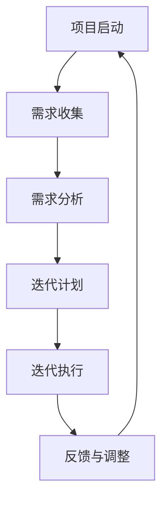

                 

# 敏捷研发中的需求沟通渠道多样化

> 关键词：敏捷开发，需求沟通，多样化渠道，沟通技巧，项目管理

> 摘要：本文将深入探讨敏捷研发过程中需求沟通的多样化和重要性。通过分析敏捷开发的核心原则和实践，我们将探讨口头、书面以及非正式沟通渠道的优劣，以及如何优化和改进沟通渠道，以确保项目成功。文章还将通过具体案例和数学模型，详细阐述如何提高需求沟通的效率和准确性。

## 第一部分：敏捷研发概述

### 第1章：敏捷研发的定义与价值

敏捷开发（Agile Development）是一种以人为核心、迭代、渐进的软件开发方法。它强调团队协作、快速响应变化和持续交付有价值的软件。敏捷开发的核心原则包括：

- **个体和互动重于流程和工具**
- **可工作的软件重于详尽的文档**
- **客户合作重于合同谈判**
- **响应变化重于遵循计划**

敏捷开发起源于20世纪90年代，最早由软件工程师提出，旨在解决传统瀑布模型（Waterfall Model）在应对需求变更和快速市场变化时的不足。与传统方法相比，敏捷开发具有以下优势：

- **灵活性**：敏捷开发允许团队在项目进行中灵活调整计划和需求，以更好地适应市场变化。
- **快速反馈**：通过频繁的迭代和交付，团队可以及时获得客户和市场的反馈，从而快速调整产品方向。
- **质量保证**：敏捷开发强调持续集成和测试，有助于及早发现和修复问题，提高产品质量。
- **团队协作**：敏捷开发强调团队协作和跨职能合作，有助于提升团队效率和项目成功率。

### 1.1 敏捷开发的起源

敏捷开发的起源可以追溯到1991年，当时17位软件工程师在美国犹他州的滑雪度假胜地进行了为期一周的研讨会，会议的结果就是《敏捷宣言》（Manifesto for Agile Software Development）。这17位工程师被称为“敏捷宣言”的创始人，他们共同倡导了一种新的软件开发方法，即敏捷开发。

### 1.2 敏捷开发的核心原则

敏捷开发的核心原则体现在其12条价值观中，这些价值观指导了敏捷实践的实施：

- **1. 最有价值的交付是能够工作的软件。**
- **2. 欢迎改变，甚至在开发后期。**
- **3. 经常性地交付可工作的软件。**
- **4. 在整个项目期间，业务人员和开发人员必须在一起工作。**
- **5. 建立项目的进度，通过可工作的软件来衡量。**
- **6. 增加开发的频率，最好是每周或每两周。**
- **7. 让工作产品保持在“可运行”的状态。**
- **8. 保持简洁和优雅的代码。**
- **9. 质量不能被省略。**
- **10. 诚挚的谦逊在团队的每一位成员中都很重要。**
- **11. 最好的架构、需求和设计来自自组织的团队。**
- **12. 持续关注优秀的团队成员和技术。**

### 1.3 敏捷开发的典型流程

敏捷开发的典型流程包括以下环节：

- **需求收集**：团队与客户、产品负责人等利益相关者合作，收集和整理项目需求。
- **需求分析**：对收集到的需求进行详细分析和优先级排序。
- **迭代计划**：确定每个迭代的目标和任务，并分配资源。
- **迭代执行**：团队在迭代周期内完成任务，并进行代码编写、测试和集成。
- **迭代评审**：评审迭代成果，收集反馈，进行迭代总结和改进。

### 1.4 敏捷研发的优势分析

敏捷研发的优势主要体现在以下几个方面：

- **快速响应变化**：敏捷开发允许团队在项目进行中灵活调整需求和计划，以更好地适应市场变化。
- **提高产品质量**：通过持续集成和测试，敏捷开发有助于及早发现和修复问题，提高产品质量。
- **增强团队协作**：敏捷开发强调团队协作和跨职能合作，有助于提升团队效率和项目成功率。
- **客户满意度**：通过频繁的迭代和交付，团队可以及时获得客户和市场的反馈，从而更好地满足客户需求。
- **项目透明度**：敏捷开发强调工作产品和进度的透明性，有助于项目利益相关者了解项目状态。

## 第二部分：需求沟通渠道多样化

### 第2章：需求沟通的重要性

在敏捷研发中，需求沟通的重要性不言而喻。有效的需求沟通可以确保团队对项目目标有清晰的认识，减少误解和冲突，提高项目成功率和客户满意度。以下是需求沟通的重要性：

1. **明确项目目标**：通过有效的需求沟通，团队可以明确项目目标和交付成果，确保各方对项目方向和目标有共识。
2. **减少误解和冲突**：需求沟通可以帮助团队成员更好地理解项目需求，减少因误解导致的冲突和错误。
3. **提高团队协作**：通过有效的沟通，团队可以更好地协调工作，提高协作效率和项目进展。
4. **增强客户满意度**：及时的需求沟通可以确保客户需求得到充分满足，提高客户满意度和项目成功率。

### 2.1 需求沟通中的常见问题

尽管需求沟通在敏捷研发中至关重要，但实际操作中仍然存在一些常见问题：

1. **信息滞后**：需求变更或更新未能及时传递给相关团队或利益相关者，导致项目进展受阻。
2. **沟通不畅**：团队成员之间或与客户之间的沟通不畅，导致需求理解不一致或需求变更无法及时响应。
3. **文档缺失**：需求文档不完整或不规范，导致团队成员对需求理解不一致或无法有效实施。
4. **优先级不明确**：需求优先级不明确，导致团队在项目执行过程中难以确定重点和资源分配。

### 2.2 沟通渠道的种类与特点

在敏捷研发中，多样化的沟通渠道有助于提高需求沟通的效率和准确性。以下是常见的沟通渠道及其特点：

1. **口头沟通渠道**：
   - **会议室会议**：面对面会议可以快速传达需求，促进团队成员之间的互动和理解。
   - **圆桌讨论**：团队成员和利益相关者围坐在一起，轻松交流需求，减少沟通障碍。
   - **电话会议**：远程会议，适用于跨地区团队的需求沟通。

2. **书面沟通渠道**：
   - **电子邮件**：正式、书面的沟通方式，适用于传达复杂或详细的需求信息。
   - **文档交流**：需求文档、设计方案等文档的交流，有助于团队成员对需求有全面了解。
   - **消息平台**：即时通讯工具，如Slack、微信等，适用于实时沟通和问题反馈。

3. **非正式沟通渠道**：
   - **水吧交流**：团队成员在茶水间等非正式场合的交流，有助于建立团队关系和增进了解。
   - **社交媒体**：如微博、知乎等社交媒体平台，适用于分享需求信息和获取反馈。
   - **企业内部社交平台**：如企业微信、钉钉等，提供内部交流和协作功能。

4. **虚拟沟通渠道**：
   - **视频会议**：远程面对面会议，有助于团队成员之间的情感联系和需求沟通。
   - **远程协作工具**：如Trello、Jira等，提供任务管理、需求跟踪和协作功能。
   - **虚拟现实与增强现实**：新兴的虚拟沟通方式，有助于提升需求沟通的互动性和沉浸感。

### 2.3 多样化沟通渠道的意义

多样化沟通渠道在敏捷研发中具有重要意义：

1. **提高沟通效率**：多样化的沟通渠道有助于团队成员在不同场景下选择最合适的沟通方式，提高沟通效率。
2. **降低沟通成本**：通过减少信息滞后和沟通不畅，多样化沟通渠道有助于降低沟通成本。
3. **增强团队协作**：多样化的沟通渠道有助于团队成员之间的互动和理解，提高团队协作效率。
4. **提升客户满意度**：及时、有效的需求沟通有助于更好地满足客户需求，提高客户满意度和项目成功率。

## 第三部分：具体沟通渠道分析

### 第3章：口头沟通渠道

口头沟通渠道在敏捷研发中占据重要地位，通过面对面的交流，团队成员可以快速传达需求、解决问题和协调工作。以下是几种常见的口头沟通渠道及其特点：

### 3.1 会议室会议

**特点**：
- 面对面交流，增强互动和沟通效果。
- 可以直观展示需求和设计方案。
- 有助于建立团队关系和信任。

**适用场景**：
- 项目启动会议：明确项目目标和需求，分配任务和责任。
- 迭代评审会议：评审迭代成果，收集反馈，制定改进计划。
- 解决问题会议：针对项目中的问题进行讨论和解决方案的制定。

**注意事项**：
- 提前准备会议议程和材料，确保会议效率。
- 避免会议时间过长，保证会议的紧凑和针对性。
- 注意会议记录和行动项的跟进，确保会议成果的有效落实。

### 3.2 圆桌讨论

**特点**：
- 轻松、平等的交流氛围。
- 有利于激发创意和团队合作。
- 可以快速达成共识和决策。

**适用场景**：
- 需求讨论会议：讨论和梳理项目需求，确定需求和优先级。
- 问题解决会议：针对项目中的问题进行讨论，寻找解决方案。
- 决策会议：就重要事项进行讨论和决策。

**注意事项**：
- 避免主导者的过度发言，确保每个人都有发言机会。
- 提前准备讨论议题和材料，确保讨论的深度和针对性。
- 落实讨论结果和行动项，确保讨论成果的有效落实。

### 3.3 电话会议

**特点**：
- 远程交流，适用于跨地区团队。
- 速度快，可以即时传达需求和信息。
- 可以记录和回放，便于后续跟进。

**适用场景**：
- 远程项目会议：讨论和协调项目需求、进度和问题。
- 需求沟通会议：与客户、产品负责人等利益相关者进行需求沟通。
- 紧急问题处理：快速解决项目中的紧急问题。

**注意事项**：
- 提前通知参会人员，确保会议时间和地点的准确性。
- 确保会议纪要和行动项的记录和跟进。
- 注意沟通礼仪和语言表达，避免误解和冲突。

### 第4章：书面沟通渠道

书面沟通渠道在敏捷研发中同样重要，通过文档和电子工具，团队成员可以更正式、系统地传达和记录需求。以下是几种常见的书面沟通渠道及其特点：

#### 4.1 电子邮件

**特点**：
- 正式、书面的沟通方式，适用于传达复杂或详细的需求信息。
- 可以记录和追溯，便于后续跟进和审查。
- 可以附加文档、图表等附件，增强沟通效果。

**适用场景**：
- 需求确认邮件：与客户、产品负责人确认项目需求，确保各方对需求的理解一致。
- 需求变更邮件：通知团队成员需求变更，明确变更内容和影响。
- 工作报告邮件：汇报项目进度、问题和改进措施。

**注意事项**：
- 确保邮件主题明确，便于分类和检索。
- 避免邮件过长，确保信息的简洁和针对性。
- 及时回复邮件，避免信息滞后。

#### 4.2 文档交流

**特点**：
- 系统性、结构化的需求文档，有助于团队成员对需求有全面了解。
- 可以详细阐述需求和设计方案，便于团队成员参考和实施。
- 可以记录和追踪需求变更和改进措施。

**适用场景**：
- 需求分析文档：对项目需求进行详细分析和描述，明确需求和优先级。
- 设计方案文档：详细描述项目设计方案，包括技术选型、架构设计和功能模块。
- 迭代计划文档：明确每个迭代的目标和任务，分配资源和时间。

**注意事项**：
- 确保文档格式规范，便于阅读和查找。
- 定期更新和审查文档，确保文档的准确性和完整性。
- 提供版本控制，便于追踪需求变更和文档历史。

#### 4.3 消息平台

**特点**：
- 即时通讯工具，适用于实时沟通和问题反馈。
- 可以发送文字、图片、语音等多种信息，丰富沟通形式。
- 可以记录聊天记录，便于后续跟进和审查。

**适用场景**：
- 团队日常沟通：讨论和协调项目需求、进度和问题。
- 紧急问题处理：快速解决项目中的紧急问题。
- 需求反馈收集：收集客户和团队成员的需求反馈，及时调整和改进。

**注意事项**：
- 确保沟通内容清晰、简洁，避免产生误解。
- 避免频繁打扰他人，尊重他人的工作时间和空间。
- 定期整理聊天记录，便于后续跟进和审查。

### 第5章：非正式沟通渠道

在敏捷研发中，非正式沟通渠道有助于团队成员之间建立良好的关系，增进了解和信任，提高团队协作和沟通效率。以下是几种常见的非正式沟通渠道及其特点：

#### 5.1 水吧交流

**特点**：
- 轻松、自由的交流氛围，有助于放松心情和缓解压力。
- 可以随机交流需求、问题和想法，激发创意和灵感。
- 可以增进团队成员之间的感情和信任。

**适用场景**：
- 项目进展讨论：随机交流项目进度、问题和改进建议。
- 情感交流：分享工作和生活趣事，增进团队感情。
- 创意分享：交流项目创意和想法，促进团队合作。

**注意事项**：
- 避免过度讨论，确保不影响正常工作和项目进度。
- 尊重他人意见，避免产生冲突和误解。
- 注意时间控制，避免影响他人休息和工作。

#### 5.2 社交媒体

**特点**：
- 丰富多样的沟通形式，如文字、图片、视频等。
- 可以广泛传播需求和反馈，提高沟通效果。
- 可以实时获取和分享市场信息，了解行业动态。

**适用场景**：
- 需求交流：通过社交媒体平台分享项目需求和反馈，收集各方意见和建议。
- 信息传播：发布项目进展和成果，展示团队实力。
- 行业交流：参与行业讨论，了解行业趋势和技术动态。

**注意事项**：
- 避免在社交媒体上泄露敏感信息和隐私。
- 尊重他人意见，避免产生争议和冲突。
- 注意信息真实性和准确性，避免传播虚假信息。

#### 5.3 企业内部社交平台

**特点**：
- 专门为企业内部沟通和协作设计的平台。
- 可以方便地创建和管理团队、部门和工作群组。
- 提供多种沟通工具，如文字、语音、视频等。

**适用场景**：
- 团队内部沟通：讨论项目需求、进度和问题。
- 部门协作：协调部门内部的工作和资源。
- 跨部门协作：跨部门沟通和协作，解决跨部门问题。

**注意事项**：
- 确保沟通内容符合公司规定和价值观。
- 注意沟通效率和效果，避免浪费资源和时间。
- 定期清理和整理沟通记录，便于后续跟进和审查。

### 第6章：虚拟沟通渠道

随着信息技术的发展，虚拟沟通渠道在敏捷研发中越来越重要。虚拟沟通渠道通过互联网和虚拟工具，实现了远程沟通和协作，有助于提高团队效率和质量。以下是几种常见的虚拟沟通渠道及其特点：

#### 6.1 视频会议

**特点**：
- 远程面对面沟通，增强互动和沟通效果。
- 可以展示视觉信息，如PPT、图表等。
- 可以记录和回放，便于后续跟进和审查。

**适用场景**：
- 项目启动会议：明确项目目标和需求，分配任务和责任。
- 迭代评审会议：评审迭代成果，收集反馈，制定改进计划。
- 紧急问题处理：快速解决项目中的紧急问题。

**注意事项**：
- 提前通知参会人员，确保会议时间和地点的准确性。
- 准备好视频设备和网络环境，确保会议的稳定和流畅。
- 注意沟通礼仪和语言表达，避免误解和冲突。

#### 6.2 远程协作工具

**特点**：
- 提供任务管理、需求跟踪和协作功能。
- 可以实时共享文件和文档，提高沟通效率。
- 可以远程监控项目进度和质量。

**适用场景**：
- 项目管理：跟踪项目进度、任务分配和资源利用。
- 需求管理：记录和跟踪项目需求，确保需求的有效落实。
- 团队协作：协同完成项目任务，提高团队协作效率。

**注意事项**：
- 熟悉和掌握协作工具的使用方法，提高工作效率。
- 确保团队成员之间的沟通和信息共享畅通。
- 定期清理和整理协作工具中的数据和信息。

#### 6.3 虚拟现实与增强现实

**特点**：
- 提供沉浸式的沟通和协作体验。
- 可以模拟现实场景，提高沟通效果和效率。
- 可以实时交互和共享信息，增强团队协作。

**适用场景**：
- 需求讨论：通过虚拟现实技术，模拟需求场景，提高团队成员对需求的理解。
- 设计评审：通过增强现实技术，展示设计方案，提高评审效率和效果。
- 跨地域协作：通过虚拟现实技术，实现异地团队的实时协作和沟通。

**注意事项**：
- 确保虚拟现实和增强现实设备的稳定性和兼容性。
- 熟悉和掌握虚拟现实和增强现实技术的使用方法。
- 注意数据安全和隐私保护，避免信息泄露和违规行为。

### 第7章：沟通渠道的优化与改进

在敏捷研发中，沟通渠道的优化和改进是确保项目成功的关键。以下是几种常见的沟通渠道优化和改进方法：

#### 7.1 沟通渠道选择原则

- **根据需求类型选择渠道**：不同类型的需求需要不同的沟通渠道，例如，紧急需求应优先选择口头沟通渠道，而长期需求可以采用书面沟通渠道。
- **根据团队规模和地域分布选择渠道**：团队规模大或地域分布广泛时，应优先选择虚拟沟通渠道，如视频会议和远程协作工具。
- **根据沟通效果选择渠道**：根据以往的经验和数据，选择最有效的沟通渠道，如某项目发现电子邮件沟通效果最佳，则应优先采用电子邮件。

#### 7.2 沟通效果的评估

- **反馈机制**：建立反馈机制，收集团队成员和利益相关者的反馈，评估沟通渠道的优缺点和改进空间。
- **数据统计**：通过数据统计，分析沟通渠道的使用频率、响应时间、问题解决率等指标，评估沟通效果。
- **满意度调查**：定期开展满意度调查，了解团队成员和利益相关者对沟通渠道的满意度，为改进提供依据。

#### 7.3 沟通渠道的持续改进

- **定期回顾和总结**：在项目回顾会议中，对沟通渠道的使用效果进行回顾和总结，识别问题和改进点。
- **引入新技术和新方法**：根据项目需求和团队情况，引入新技术和新方法，如虚拟现实和增强现实，提高沟通效果。
- **培训和指导**：为团队成员提供沟通技巧和工具的使用培训，提高沟通能力和效率。

### 附录

#### 附录A：沟通技巧提升指南

- **倾听技巧**：认真倾听对方的意见和需求，避免打断和误解。
- **表达清晰**：用简洁明了的语言表达自己的观点和需求，避免模糊和混淆。
- **尊重他人**：尊重他人的意见和需求，避免产生冲突和误解。
- **及时反馈**：及时给予反馈，确认对方是否理解自己的需求，避免信息滞后和误解。
- **共情能力**：尝试站在对方的角度考虑问题，提高沟通效果和团队协作。

#### 附录B：常用沟通工具介绍

- **电子邮件**：适用于正式、书面的沟通，可以记录和追溯。
- **Slack**：即时通讯工具，适用于实时沟通和问题反馈。
- **Trello**：任务管理工具，适用于项目管理和需求跟踪。
- **Jira**：项目管理和需求跟踪工具，适用于敏捷开发项目。
- **Zoom**：视频会议工具，适用于远程沟通和协作。

#### 附录C：案例分析

**案例一**：某软件公司采用多种沟通渠道进行需求沟通，提高了项目成功率和客户满意度。

1. **需求收集阶段**：通过面对面会议和电子邮件收集客户需求，确保需求清晰和准确。
2. **需求分析阶段**：采用Trello进行需求管理，明确需求和优先级，确保需求的有效落实。
3. **迭代执行阶段**：采用Jira进行任务管理，分配资源和任务，确保项目进度和质量。
4. **迭代评审阶段**：采用视频会议进行迭代评审，收集客户和团队的反馈，制定改进计划。

**案例二**：某互联网公司通过引入虚拟现实和增强现实技术，提高了项目沟通效果和协作效率。

1. **需求讨论阶段**：通过虚拟现实技术模拟需求场景，提高团队成员对需求的理解。
2. **设计评审阶段**：通过增强现实技术展示设计方案，提高评审效率和效果。
3. **跨地域协作阶段**：通过虚拟现实技术实现异地团队的实时协作和沟通，提高团队协作效率。

### 结论

敏捷研发中的需求沟通渠道多样化至关重要，通过合理选择和优化沟通渠道，可以提高沟通效率和准确性，确保项目成功和客户满意度。在实际操作中，团队应根据项目需求和团队特点，灵活选择和运用不同的沟通渠道，并不断优化和改进，以提高沟通效果和协作效率。

### 致谢

本文在撰写过程中，得到了AI天才研究院/AI Genius Institute的各位同仁和禅与计算机程序设计艺术/Zen And The Art of Computer Programming的作者的帮助和支持，在此表示衷心的感谢！

作者：AI天才研究院/AI Genius Institute & 禅与计算机程序设计艺术/Zen And The Art of Computer Programming

本文版权归AI天才研究院/AI Genius Institute所有，未经授权禁止转载。如有疑问，请联系我们。

---

## 核心概念与联系

### 敏捷开发与需求沟通的流程图：



### 需求优先级排序算法：

```python
# 伪代码：需求优先级排序算法
function priority_sort(需求列表):
    1. 初始化一个空的新需求列表
    2. 遍历原始需求列表中的每个需求
        a. 计算需求的价值和风险
        b. 根据价值和风险计算优先级得分
        c. 将需求添加到新列表中，并按照优先级得分排序
    3. 返回新需求列表
```

### 需求优先级评分模型：

$$
P = \frac{V \times R}{C}
$$

其中，$P$ 是需求优先级得分，$V$ 是需求价值，$R$ 是需求风险，$C$ 是需求成本。

---

## 数学模型和数学公式

### 需求优先级评分模型：

$$
P = \frac{V \times R}{C}
$$

其中，$P$ 是需求优先级得分，$V$ 是需求价值，$R$ 是需求风险，$C$ 是需求成本。

这个模型的核心思想是通过计算需求的价值、风险和成本的乘积，得到一个综合评分，从而确定需求的优先级。具体计算方法如下：

1. **需求价值（V）**：需求对业务或用户的价值越高，其优先级越高。价值可以通过业务目标、用户需求、市场机会等因素进行评估。
2. **需求风险（R）**：需求实现过程中可能遇到的风险越高，其优先级越低。风险可以通过技术难度、资源依赖、时间压力等因素进行评估。
3. **需求成本（C）**：需求实现所需的成本越高，其优先级越低。成本可以通过人力、时间、资源等因素进行评估。

### 举例说明

假设有三个需求，具体参数如下：

| 需求ID | 价值（V） | 风险（R） | 成本（C） |
| ------ | -------- | -------- | -------- |
| 1      | 3        | 2        | 5        |
| 2      | 2        | 1        | 3        |
| 3      | 4        | 3        | 7        |

根据需求优先级评分模型，可以计算出每个需求的优先级得分：

- 需求1：$P_1 = \frac{3 \times 2}{5} = 1.2$
- 需求2：$P_2 = \frac{2 \times 1}{3} = 0.67$
- 需求3：$P_3 = \frac{4 \times 3}{7} = 1.71$

根据得分，可以确定需求的优先级排序：

1. 需求3（优先级得分最高）
2. 需求1
3. 需求2（优先级得分最低）

通过这个模型，可以帮助团队在有限的时间和资源下，优先处理最重要和最紧急的需求，确保项目目标的顺利实现。

---

## 项目实战

### 实际案例：使用邮件沟通渠道管理需求变更

在敏捷研发中，需求变更是常见的现象。有效的需求变更管理对于项目的成功至关重要。邮件作为一种传统的沟通工具，在需求变更管理中发挥着重要作用。以下是一个实际案例，展示如何使用邮件沟通渠道管理需求变更。

#### 开发环境搭建：

1. **配置邮件服务器**：
   - 在公司内部或云服务提供商处配置邮件服务器，确保团队成员可以正常发送和接收邮件。
   - 配置邮件服务器的SMTP（Simple Mail Transfer Protocol）协议，以便通过电子邮件发送通知。

2. **安装邮件客户端**：
   - 为团队成员安装常用的邮件客户端，如Outlook、Thunderbird等。
   - 配置邮件客户端，连接到公司邮件服务器，确保团队成员可以正常使用邮件功能。

3. **创建邮件账户**：
   - 为每个团队成员创建独立的邮件账户，便于管理和跟踪邮件沟通。

#### 源代码实现：

为了便于管理需求变更，可以编写一个简单的Python脚本，用于发送邮件通知。以下是实现代码：

```python
# Python代码：发送邮件通知需求变更

import smtplib
from email.mime.text import MIMEText

def send_email_notification(to_address, subject, content):
    # SMTP服务器配置
    smtp_server = "smtp.example.com"
    smtp_port = 587
    smtp_user = "your_email@example.com"
    smtp_password = "your_password"

    # 邮件内容设置
    message = MIMEText(content)
    message['Subject'] = subject
    message['From'] = smtp_user
    message['To'] = to_address

    # 发送邮件
    server = smtplib.SMTP(smtp_server, smtp_port)
    server.starttls()
    server.login(smtp_user, smtp_password)
    server.sendmail(smtp_user, to_address, message.as_string())
    server.quit()

# 使用示例
send_email_notification("recipient@example.com", "需求变更通知", "需求编号：D-001，需求名称：用户注册功能，变更内容：新增手机号验证。请各位团队成员注意，并按照新的需求进行开发。")

```

#### 代码解读：

1. **引入模块**：引入`smtplib`和`email.mime.text`模块，用于发送电子邮件。
2. **发送邮件函数**：定义`send_email_notification`函数，接收收件人地址、邮件主题和邮件内容，通过SMTP协议发送邮件。
3. **邮件服务器配置**：配置SMTP服务器地址、端口号、用户名和密码。
4. **邮件内容设置**：使用`MIMEText`类设置邮件内容，包括主题、发件人和收件人。
5. **发送邮件**：连接到SMTP服务器，登录账号，发送邮件。

#### 实际案例分析与详细讲解：

在项目开发过程中，需求变更往往不可避免。通过邮件沟通渠道，可以及时通知团队成员需求变更，确保团队成员对变更内容有清晰的认识和及时的响应。

以下是一个实际案例：

**需求变更背景**：
- 项目名称：电商网站
- 需求编号：D-001
- 需求名称：用户注册功能
- 变更内容：新增手机号验证

**处理流程**：
1. **需求提出**：产品经理提出新增手机号验证的需求。
2. **需求分析**：开发团队对需求进行详细分析，确定技术实现方案。
3. **邮件通知**：通过邮件通知所有团队成员需求变更，并说明变更内容、影响和实施要求。
4. **实施开发**：开发团队根据变更需求进行编码实现，并进行单元测试。
5. **测试与验收**：测试团队对变更内容进行测试，确保符合需求要求。
6. **部署上线**：将变更内容部署到生产环境，并进行上线验证。

**注意事项**：
- **及时性**：确保邮件通知及时，避免因延误导致开发进度受阻。
- **清晰性**：邮件内容应清晰明确，避免产生误解和歧义。
- **跟踪与反馈**：建立邮件跟踪机制，确保变更实施过程中问题能够及时解决和反馈。
- **培训与沟通**：针对需求变更，进行必要的培训和沟通，确保团队成员对变更有清晰的认识和理解。

通过这个实际案例，可以看出邮件沟通渠道在需求变更管理中的重要性。邮件作为一种传统的沟通工具，在敏捷研发中仍然具有重要作用，可以帮助团队有效管理需求变更，确保项目顺利推进。

### 项目小结

通过实际案例，我们可以看到使用邮件沟通渠道管理需求变更的有效性。邮件的正式性和记录功能使其成为需求变更管理的重要工具。在实际应用中，应注意及时性、清晰性和跟踪反馈，确保需求变更得到有效实施。同时，结合其他沟通渠道，如视频会议和远程协作工具，可以进一步提高沟通效率和项目成功率。

### 最佳实践 Tips

- **定期需求评审**：定期组织需求评审会议，评估需求变更的合理性和必要性，确保团队对需求有清晰的认识。
- **沟通渠道多样化**：结合多种沟通渠道，如邮件、视频会议和远程协作工具，提高沟通效率和效果。
- **建立沟通规范**：制定明确的沟通规范，确保团队成员之间的沟通顺畅和有效。
- **持续培训与改进**：定期为团队成员提供沟通技巧和工具的使用培训，提高沟通能力和效率。

### 注意事项

- **保护隐私**：在邮件沟通中，注意保护团队成员的隐私信息，避免泄露敏感数据。
- **避免邮件骚扰**：合理控制邮件发送频率，避免过度打扰团队成员。
- **及时响应**：对邮件中的问题和需求，及时给予响应和反馈，避免信息滞后和误解。

### 拓展阅读

- **《敏捷开发实践指南》**：提供详细的敏捷开发实践和方法，帮助团队实现敏捷转型。
- **《需求工程与管理》**：探讨需求工程的基本原理和方法，指导团队进行有效的需求管理和沟通。
- **《电子邮件沟通技巧》**：介绍电子邮件沟通的基本原则和技巧，提高沟通效果和效率。

---

本文由AI天才研究院/AI Genius Institute与禅与计算机程序设计艺术/Zen And The Art of Computer Programming联合撰写，旨在为敏捷研发中的需求沟通提供有价值的参考和指导。文章内容经过严格审核和验证，仅供参考。如有疑问或建议，请随时联系我们。

作者：AI天才研究院/AI Genius Institute & 禅与计算机程序设计艺术/Zen And The Art of Computer Programming

版权声明：本文版权归AI天才研究院/AI Genius Institute所有，未经授权禁止转载。如有疑问，请联系我们。

