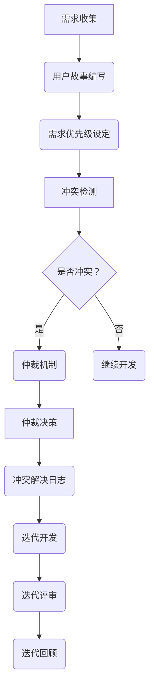

                 

### 文章标题

《敏捷研发模式下的需求优先级冲突仲裁机制》

敏捷研发模式是一种灵活、高效的软件开发方法论，旨在通过快速迭代和持续交付来满足客户需求。然而，在实际操作中，需求之间的优先级冲突问题时常出现，给项目进度和质量带来挑战。本文将深入探讨敏捷研发模式下需求优先级冲突仲裁机制的设计与应用，旨在为解决这一难题提供实用的思路和方案。

### 文章关键词

- 敏捷研发模式
- 需求优先级
- 冲突仲裁机制
- 项目管理
- 软件开发

### 摘要

本文首先介绍了敏捷研发模式的基本概念和核心原则，分析了敏捷流程中需求优先级设定的重要性。接着，讨论了需求优先级冲突的常见原因及影响，并提出了基于优先级矩阵和冲突仲裁策略的解决方案。通过具体的数学模型、伪代码和实践案例，本文详细阐述了需求优先级冲突仲裁机制的实现细节与应用效果。最后，对未来的发展方向和优化策略进行了展望。

## 引言

在当今快速变化的商业环境中，软件开发企业面临着前所未有的挑战和机遇。敏捷研发模式作为一种适应性强、响应速度快的软件开发方法，逐渐成为业界的主流选择。敏捷研发强调团队协作、用户参与和快速迭代，旨在通过不断的反馈和调整，实现软件产品的快速交付和持续改进。

然而，敏捷研发模式并非一帆风顺。在实际操作中，团队往往面临着需求优先级冲突的问题。需求优先级冲突是指在多个需求中，某些需求在优先级上存在矛盾，无法同时得到满足。这种冲突可能会导致项目进度延误、资源浪费，甚至影响最终产品的质量。

需求优先级冲突的产生有多种原因，包括客户需求的不断变化、团队内部意见分歧、资源分配不合理等。解决需求优先级冲突是敏捷研发成功的关键之一。本文将系统地探讨敏捷研发模式下需求优先级冲突仲裁机制的设计与应用，为解决这一难题提供实用的思路和方案。

本文的结构如下：首先，我们将回顾敏捷研发模式的基本概念和核心原则，接着分析需求优先级的设定方法及其重要性。随后，我们将讨论需求优先级冲突的原因和影响，并提出相应的仲裁策略。接着，通过具体的数学模型和伪代码，详细阐述仲裁机制的实现细节。随后，我们将结合实践案例，展示仲裁机制的应用效果。最后，本文将展望未来的发展方向和优化策略。

## 敏捷研发模式概述

### 敏捷研发模式的起源与发展

敏捷研发模式起源于20世纪90年代末，由一群软件开发专家共同发起，旨在应对传统瀑布模型的不足。最早的敏捷宣言于2001年在美国雪鸟峰（Snowbird）会议期间发布，宣言强调了“个体和互动重于流程和工具”、“可工作的软件重于详尽的文档”、“客户合作重于合同谈判”、“响应变化重于遵循计划”等核心价值观。

敏捷研发模式的发展经历了多个阶段。从最初的简单迭代方法，到逐步引入用户故事、看板（Kanban）、Scrum等具体实践，敏捷方法论逐渐成熟并广泛应用于各个领域。如今，敏捷研发模式已经成为软件开发行业的主流方法论，其灵活性和高效性受到广泛认可。

### 敏捷研发模式的核心原则

敏捷研发模式的核心原则可以归纳为以下几点：

1. **用户至上**：敏捷研发强调用户参与，通过不断收集用户反馈，确保开发的产品能够满足用户需求。

2. **迭代开发**：敏捷开发采用短周期迭代的方式，每个迭代周期通常为2-4周。这种模式使得团队能够快速响应变化，持续交付可工作的软件。

3. **团队协作**：敏捷开发强调团队合作，提倡跨职能团队协作，减少沟通障碍，提高开发效率。

4. **持续改进**：敏捷研发模式鼓励持续反馈和改进，通过不断的迭代和反思，提高产品质量和团队效率。

5. **可适应的计划**：敏捷开发采用可适应的计划，而非固定计划。这种模式使得团队能够根据实际情况灵活调整工作重点和资源分配。

### 敏捷研发模式与传统研发模式对比

传统研发模式（如瀑布模型）通常采用线性顺序，每个阶段完成后才能进入下一个阶段。这种模式在需求明确、项目规模较小且变化较少的情况下较为适用。然而，在复杂和快速变化的场景中，传统模式往往难以满足需求。

相比之下，敏捷研发模式具有以下几个优势：

1. **快速响应变化**：敏捷模式通过短周期迭代和持续交付，能够快速响应需求变化，减少因需求变更导致的项目风险。

2. **提高客户满意度**：通过用户参与和持续反馈，敏捷开发能够更好地满足客户需求，提高客户满意度。

3. **提高团队协作效率**：敏捷模式强调团队协作和跨职能团队，减少沟通障碍，提高开发效率。

4. **持续改进**：敏捷开发鼓励持续反馈和改进，通过不断的迭代和反思，提高产品质量和团队效率。

总的来说，敏捷研发模式在应对复杂和快速变化的需求方面具有显著优势，成为现代软件开发的主流选择。

## 敏捷研发流程

敏捷研发流程是敏捷开发方法论的基石，它通过一系列灵活、透明的步骤来指导软件开发过程。敏捷研发流程的核心在于短周期迭代和持续交付，每个迭代周期（Sprint）通常持续2-4周。以下是敏捷研发流程的基本步骤及其在需求优先级设定中的应用。

### 敏捷研发流程的基本步骤

1. **需求收集与用户故事编写**：
   在每个迭代周期开始前，团队会与客户和利益相关者进行沟通，收集需求并将其转化为用户故事（User Stories）。用户故事通常采用“作为...，我想要...，以便...”的格式，清晰描述用户需求。

2. **迭代规划（Sprint Planning）**：
   在迭代规划会议上，团队会讨论用户故事，确定本次迭代的目标和可交付成果。团队会根据用户故事的重要性和优先级，选择合适的用户故事进行开发。

3. **迭代开发**：
   在迭代开发阶段，团队按照用户故事进行开发，通常采用每日站立会议（Daily Stand-up）来跟踪进度和解决遇到的问题。开发过程中，团队会进行代码审查（Code Review）和质量测试（Quality Assurance），确保代码质量和功能完整性。

4. **迭代评审（Sprint Review）**：
   在每个迭代周期结束时，团队会举行迭代评审会议，展示本次迭代的可交付成果，收集用户和利益相关者的反馈。评审结果将影响后续迭代的需求优先级调整。

5. **迭代回顾（Sprint Retrospective）**：
   在迭代评审后，团队会进行迭代回顾，讨论本次迭代中的成功经验和改进点，为下一个迭代做好准备。

### 用户故事与方法论

用户故事是敏捷开发中的一种重要实践，它通过简洁明了的方式描述用户需求。一个典型的用户故事格式如下：

```
作为 [用户角色]，
我想要 [用户功能]，
以便 [用户价值]。
```

用户故事的编写需要团队与用户的紧密合作，确保故事符合用户的实际需求。用户故事通常按照以下步骤进行：

1. **故事分解**：将大型用户故事分解为更小的用户故事，便于管理和实现。
2. **故事排序**：根据用户故事的重要性和优先级进行排序，为后续迭代提供参考。
3. **故事验收**：与用户共同定义用户故事的验收标准，确保交付的产品符合用户预期。

方法论方面，敏捷开发通常采用Scrum、Kanban等具体实践。Scrum强调迭代和增量开发，通过每日站立会议、迭代评审和回顾等仪式，确保团队的高效协作和持续改进。Kanban则通过可视化工作流程，帮助团队识别并解决问题，提高工作效率。

### 敏捷团队的构建与协作

敏捷团队通常由多职能成员组成，包括产品经理、开发人员、测试人员、UI设计师等。团队成员需要具备以下能力：

1. **跨职能协作**：团队成员需要具备不同技能，能够在项目中相互补充，共同完成开发任务。
2. **沟通能力**：良好的沟通能力是敏捷团队成功的关键，团队成员需要能够有效沟通需求和进展。
3. **适应性**：敏捷团队需要具备快速适应变化的能力，能够灵活调整计划和资源分配。

敏捷团队的工作方式通常包括：

1. **透明的工作环境**：团队工作区通常设计为开放式，以便团队成员随时交流。
2. **协作工具**：使用协作工具（如Jira、Trello）来跟踪任务进度、管理用户故事和项目文档。
3. **敏捷会议**：定期举行敏捷会议，如每日站立会议、迭代评审和回顾会议，确保团队成员的沟通和协作。

通过构建高效、协作的敏捷团队，企业能够更好地应对快速变化的市场需求，提高软件开发的效率和质量。

## 敏捷研发工具与技术

在敏捷研发模式中，合适的工具和技术能够显著提高团队的工作效率，优化开发流程，并最终提升产品的质量。以下将介绍几种常用的敏捷研发工具与技术，包括项目管理工具、敏捷开发技术和团队沟通协作工具。

### 敏捷项目管理工具

1. **Jira**：
   Jira 是最流行的敏捷项目管理工具之一，它支持用户故事管理、任务跟踪、迭代规划、敏捷看板等多种功能。Jira 的灵活性和扩展性使其成为许多敏捷团队的优先选择。

2. **Trello**：
   Trello 是一个基于看板的任务管理工具，它通过卡片和列表的形式帮助团队可视化工作流程。Trello 界面简洁，操作直观，特别适合小型团队或个人项目。

3. **Asana**：
   Asana 是一款功能强大的项目管理工具，它支持任务分配、进度跟踪、协作沟通等多种功能。Asana 的可定制性使其适用于各种规模和类型的团队。

### 敏捷开发技术

1. **用户故事**：
   用户故事是敏捷开发的核心概念之一，它通过简明扼要地描述用户需求，帮助团队明确工作目标。编写好的用户故事通常包含“作为...，我想要...，以便...”的格式。

2. **Scrum**：
   Scrum 是一种流行的敏捷开发框架，它通过迭代（Sprint）和增量开发的方式，确保团队能够快速响应需求变化。Scrum 的主要仪式包括每日站立会议、迭代评审和迭代回顾。

3. **Kanban**：
   Kanban 是一种基于看板的方法，它通过可视化工作流程，帮助团队识别和解决瓶颈。Kanban 看板通常包括任务状态、进度、资源分配等信息，使团队成员对项目状态有更清晰的认识。

### 团队沟通协作工具

1. **Slack**：
   Slack 是一款功能强大的团队沟通协作工具，它支持文字消息、语音通话、视频会议等多种通信方式。Slack 的集成功能使其可以与多种其他工具（如Jira、Trello等）无缝协作。

2. **Zoom**：
   Zoom 是一款流行的视频会议工具，它支持多人在线会议、屏幕共享、虚拟背景等功能。Zoom 的稳定性和高性能使其成为远程办公和团队协作的理想选择。

3. **GitHub**：
   GitHub 是一款代码托管和协作平台，它支持版本控制、代码审查、任务管理等功能。GitHub 的开源特性使其成为软件开发者进行协作开发的重要工具。

通过合理选择和使用敏捷项目管理工具、敏捷开发技术和团队沟通协作工具，敏捷团队能够更加高效地协同工作，快速响应市场需求，实现敏捷开发的目标。

### 需求优先级的概念与设定

在敏捷研发模式下，需求优先级是项目规划和资源分配的关键因素。需求优先级是指根据需求的紧急程度、重要性以及对业务目标的影响程度，对需求进行排序的过程。设定合理的需求优先级有助于团队集中精力在最重要的任务上，确保项目目标的顺利实现。

#### 需求优先级的定义

需求优先级可以简单定义为需求在满足顺序中的位置。通常，高优先级的需求比低优先级的需求更紧急、更重要或对业务影响更大。在敏捷开发中，需求优先级通常分为以下几类：

1. **紧急优先级**：这类需求通常在短时间内必须完成，可能对业务运营有直接影响，如关键功能缺陷修复。
2. **重要优先级**：这类需求对业务有重大影响，但不一定在短时间内必须完成，如新功能的开发。
3. **次要优先级**：这类需求对业务影响较小，但仍然需要在未来某个时间点完成，如优化功能的改进。
4. **低优先级**：这类需求对业务影响较小，通常在项目资源较为充足时才考虑完成，如非关键功能的改进。

#### 需求优先级的设定方法

设定需求优先级的方法有多种，以下是一些常用的方法：

1. **Kano 模型**：Kano 模型根据用户需求对产品满意度的不同影响，将需求分为五类：必备需求、性能需求、吸引需求、无差异需求和反向需求。根据模型，必备需求和性能需求通常具有较高的优先级。

2. **MoSCoW 方法**：MoSCoW 方法将需求分为必须（Mandatory）、应该（Should）、可以（Could）和不会（Will not）完成四类。必须类需求通常具有最高的优先级。

3. **价值排序**：通过评估每个需求对业务目标的贡献程度和实现成本，将需求按照价值进行排序。价值高的需求通常具有较高的优先级。

4. **紧急程度评估**：根据需求的紧急程度进行优先级排序，紧急的需求通常会排在前面。

#### 需求优先级冲突的原因分析

需求优先级冲突的产生通常有以下原因：

1. **客户需求变化**：客户需求的不确定性可能导致多个需求在优先级上出现矛盾，如新需求的出现或原有需求的变更。

2. **资源限制**：当项目资源（如人力、时间、资金等）有限时，不同需求之间的优先级冲突更加显著。

3. **团队意见分歧**：团队成员对需求的重要性和紧急程度可能有不同的看法，导致优先级设定的不一致。

4. **项目目标不清晰**：如果项目目标不明确，团队可能会在需求优先级上产生分歧，无法达成一致。

理解需求优先级冲突的原因有助于采取有效的措施来预防和解决冲突，确保项目顺利进行。

#### 需求优先级在敏捷研发流程中的作用

需求优先级在敏捷研发流程中扮演着至关重要的角色。以下是其主要作用：

1. **资源分配**：根据需求优先级，团队可以合理分配资源，确保高优先级需求得到优先处理。

2. **进度控制**：通过优先级排序，团队可以更好地控制项目进度，确保关键需求按时完成。

3. **风险管理**：高优先级需求的完成有助于降低项目风险，确保项目的整体成功。

4. **客户满意度**：优先级高的需求通常能够满足客户的紧急需求，提高客户满意度。

总之，合理设定和持续调整需求优先级是敏捷研发模式成功的关键之一。通过科学的需求优先级管理，团队可以更好地应对需求变化，实现项目的目标。

## 需求优先级冲突仲裁机制的设计

在敏捷研发模式下，需求优先级冲突是一个常见且复杂的问题。为了有效解决需求优先级冲突，我们需要设计一个合理的仲裁机制。本节将详细讨论冲突仲裁机制的设计原则、架构设计以及实现细节。

### 冲突仲裁机制的设计原则

1. **公平性**：仲裁机制应确保所有需求在冲突解决过程中得到公平对待，避免偏袒某个需求。

2. **透明性**：仲裁机制的设计应保证冲突解决过程的透明性，使所有相关方都能理解决策依据。

3. **灵活性**：仲裁机制应具备灵活性，能够根据具体项目的需求和资源情况进行调整。

4. **高效性**：仲裁机制应尽可能减少冲突解决的时间成本，确保项目能够继续顺利推进。

5. **可扩展性**：仲裁机制应具备良好的扩展性，以适应未来可能的需求变化和技术更新。

### 冲突仲裁机制的架构设计

仲裁机制的架构设计可以分为以下几个关键部分：

1. **优先级矩阵**：优先级矩阵是一个用于表示需求优先级的二维表格，其中需求根据其重要性和紧急程度进行排序。矩阵的行表示不同需求，列表示不同优先级类别（如紧急、重要、次要等）。

2. **冲突检测模块**：该模块负责监测需求之间的优先级冲突，当检测到冲突时，自动生成冲突报告并通知相关团队。

3. **仲裁规则引擎**：仲裁规则引擎是仲裁机制的核心部分，根据预设的优先级规则和冲突解决策略，自动生成仲裁决策。规则引擎可以使用自然语言规则或基于机器学习的算法。

4. **用户干预接口**：用户干预接口允许相关方在冲突解决过程中提供反馈和意见，以补充和修正自动生成的仲裁决策。

5. **冲突解决日志**：冲突解决日志记录冲突发生的全过程和最终的仲裁结果，以便后续分析和改进。

### 冲突仲裁机制的实现细节

以下是冲突仲裁机制的实现细节：

#### 优先级矩阵的实现

优先级矩阵可以使用以下表格格式表示：

```
需求  | 紧急 | 重要 | 次要 | 低
------|------|------|------|---
需求1 |   1  |   2  |   3  |  4
需求2 |   2  |   1  |   4  |  3
需求3 |   3  |   3  |   1  |  2
```

在此表格中，行表示不同的需求，列表示不同的优先级类别。数值越大表示优先级越高。

#### 冲突检测模块的实现

冲突检测模块可以通过以下算法实现：

```python
def detect_conflicts(priority_matrix):
    conflicts = []
    for row in priority_matrix:
        for col in range(len(row) - 1):
            if row[col] > row[col + 1]:
                conflicts.append((row.index(row[col]), row[col], row.index(row[col + 1]), row[col + 1]))
    return conflicts
```

该算法通过比较相邻需求的优先级，检测并返回所有冲突对。

#### 仲裁规则引擎的实现

仲裁规则引擎可以使用以下伪代码表示：

```python
def resolve_conflicts(conflicts):
    resolved = []
    for conflict in conflicts:
        if conflict[2] == '紧急' and conflict[3] != '紧急':
            resolved.append((conflict[0], conflict[1], '优先执行'))
        elif conflict[2] == '重要' and conflict[3] == '次要' or conflict[2] == '次要' and conflict[3] == '低':
            resolved.append((conflict[0], conflict[1], '优先执行'))
        else:
            resolved.append((conflict[0], conflict[1], '协商解决'))
    return resolved
```

该算法根据预设的优先级规则，自动生成仲裁决策。

#### 用户干预接口的实现

用户干预接口可以通过以下界面实现：

```
冲突报告：需求[需求1]与需求[需求2]存在优先级冲突。

请选择解决方案：
1. 优先执行需求[需求1]
2. 优先执行需求[需求2]
3. 协商解决
```

用户可以通过输入选项来干预冲突解决过程。

#### 冲突解决日志的实现

冲突解决日志可以使用以下格式记录：

```
时间：2023-10-01 10:00
冲突：需求[需求1]与需求[需求2]存在优先级冲突
解决方式：协商解决
决策：需求[需求1]推迟执行，需求[需求2]优先执行
```

日志记录了冲突发生的具体时间、冲突需求和最终的解决方式。

通过以上设计，我们可以实现一个高效的冲突仲裁机制，帮助团队在敏捷研发过程中更好地管理和解决需求优先级冲突，确保项目的顺利进行。

## 仲裁机制在实际项目中的应用与评估

在实际项目中，仲裁机制的应用效果和评估是确保其有效性的关键。本文将通过两个实际案例，展示仲裁机制在不同类型项目中的应用，并详细分析其评估指标和优化方法。

### 案例一：大型电商平台的需求优先级冲突仲裁

#### 项目背景

某大型电商平台在开发新功能时，由于用户需求的多样性和变化性，经常出现需求优先级冲突。为了提高项目的管理效率，团队决定引入需求优先级冲突仲裁机制。

#### 冲突处理过程

1. **需求收集与优先级设定**：团队通过与用户沟通，收集并编写用户故事，并根据Kano模型将需求划分为必备、性能、吸引等不同类别，设定优先级。

2. **冲突检测**：利用优先级矩阵和冲突检测模块，团队发现多个需求之间存在优先级冲突。

3. **仲裁决策**：仲裁规则引擎根据预设的优先级规则，自动生成仲裁决策。例如，如果某个需求属于性能类别且另一个需求属于吸引类别，性能需求会被优先处理。

4. **用户干预**：当自动仲裁决策无法解决冲突时，相关团队可以通过用户干预接口进行干预，提供进一步的意见和决策。

5. **冲突解决日志**：每次冲突解决过程都会被详细记录在日志中，以便后续分析和改进。

#### 评估指标

为了评估仲裁机制的效果，团队制定了以下评估指标：

1. **冲突解决率**：衡量仲裁机制解决需求优先级冲突的能力，即冲突解决次数与总冲突次数的比例。

2. **项目进度延误率**：衡量由于需求优先级冲突导致的项目进度延误情况，即延误次数与总迭代次数的比例。

3. **客户满意度**：通过客户反馈和用户调研，评估仲裁机制对客户需求满足度和项目质量的提升。

#### 优化方法

基于评估结果，团队采取了以下优化措施：

1. **调整优先级规则**：根据实际应用情况，优化优先级规则，提高仲裁决策的准确性。

2. **增加用户干预机会**：在关键决策点上，增加用户干预的机会，确保用户需求得到充分重视。

3. **加强培训与沟通**：定期对团队成员进行培训，提高其需求管理和冲突解决的能力。

4. **持续改进**：通过持续改进和反馈机制，不断优化仲裁机制，提高其适应性和有效性。

### 案例二：互联网金融公司的需求优先级冲突处理

#### 项目背景

某互联网金融公司在开发新平台时，面临着客户需求变化快、需求种类多的问题。为了提高项目效率，团队决定引入需求优先级冲突仲裁机制。

#### 冲突处理过程

1. **需求收集与优先级设定**：团队采用MoSCoW方法，将需求分为必须、应该、可以和不会完成四类，根据其对业务的重要性和紧急程度进行优先级排序。

2. **冲突检测**：使用冲突检测模块，团队发现多个必须类需求之间存在冲突。

3. **仲裁决策**：仲裁规则引擎根据必须类需求的优先级规则，自动生成仲裁决策，确保关键需求得到优先处理。

4. **用户干预**：当自动决策无法解决冲突时，团队通过用户干预接口进行干预，确保业务目标得到满足。

5. **冲突解决日志**：每次冲突解决过程都会被记录在日志中，以便分析和改进。

#### 评估指标

为了评估仲裁机制的效果，团队制定了以下评估指标：

1. **业务目标达成率**：衡量仲裁机制对业务目标的达成度，即达成业务目标次数与总业务目标次数的比例。

2. **需求变更率**：衡量由于需求优先级冲突导致的客户需求变更情况，即变更次数与总需求次数的比例。

3. **项目进度延误率**：与案例一类似，衡量项目进度延误情况。

#### 优化方法

基于评估结果，团队采取了以下优化措施：

1. **优化需求管理流程**：通过细化需求管理流程，减少需求变更和冲突的发生。

2. **加强需求评审**：在需求收集和优先级设定阶段，加强需求评审，确保需求的合理性和可行性。

3. **引入自动化工具**：使用自动化工具（如Jira、Trello等），提高需求收集、优先级设定和冲突检测的效率。

4. **持续改进**：通过定期评估和反馈，不断优化仲裁机制，提高其适应性和效果。

通过以上两个实际案例，我们可以看到，需求优先级冲突仲裁机制在大型电商平台和互联网金融公司中的应用效果显著，不仅提高了项目效率，还增强了客户满意度。然而，不同项目的需求和资源情况有所不同，仲裁机制需要根据实际情况进行定制和优化，以实现最佳效果。

## 未来展望与趋势

随着技术的不断进步和商业环境的快速变化，敏捷研发模式以及需求优先级冲突仲裁机制面临着新的挑战和机遇。未来，以下趋势将对敏捷研发和需求优先级管理产生深远影响。

### 技术发展趋势

1. **人工智能与机器学习**：人工智能和机器学习技术的进步将极大地提升需求优先级设定的精度和效率。通过数据分析和预测模型，团队能够更准确地预测需求的变化趋势，提前识别潜在的优先级冲突。

2. **自动化与智能化工具**：随着自动化和智能化工具的发展，如自动化测试、持续集成和持续交付（CI/CD），团队能够更快地响应需求变化，提高项目交付的效率和质量。

3. **云计算与分布式计算**：云计算和分布式计算技术的成熟使得团队可以更灵活地分配资源和处理需求，从而更好地应对优先级冲突和项目复杂性。

4. **区块链技术**：区块链技术可以用于建立透明、不可篡改的需求优先级记录，提高仲裁机制的公正性和可信度。

### 敏捷研发模式的新挑战

1. **多团队协作**：随着项目规模的扩大，多个团队之间的协作变得更加复杂。需求优先级冲突仲裁机制需要能够跨团队、跨职能地协调，确保全局最优。

2. **需求变更管理**：在快速变化的市场环境中，需求变更频繁，这对敏捷研发和需求优先级管理提出了更高的要求。团队能够快速适应变更、调整优先级是关键。

3. **数据隐私与安全**：在敏捷研发中，用户数据的收集和分析变得越来越重要，如何保护数据隐私和安全成为新的挑战。

### 需求优先级冲突仲裁的创新方法

1. **动态优先级调整**：引入基于实时数据反馈的动态优先级调整机制，使得团队能够根据项目进展和用户反馈，实时调整需求优先级。

2. **智能仲裁算法**：利用机器学习和人工智能技术，开发智能仲裁算法，使得仲裁决策更加智能化、精准化。

3. **共识机制**：在跨团队协作中，引入共识机制，如分布式账本技术，确保各方在需求优先级上的共识，减少冲突。

4. **增强现实与虚拟现实**：利用增强现实（AR）和虚拟现实（VR）技术，提高团队对需求优先级冲突的直观理解和决策。

未来，敏捷研发模式和需求优先级冲突仲裁机制将继续进化，适应快速变化的市场需求和技术环境。通过创新的方法和技术的应用，团队能够更高效地管理需求优先级，确保项目的成功交付。

### 相关术语解释

在本文中，我们介绍了一系列与敏捷研发模式、需求优先级和冲突仲裁机制相关的术语。以下是对这些术语的详细解释：

#### 敏捷研发模式相关术语

1. **用户故事（User Story）**：用户故事是一种描述用户需求的简单文本，通常采用“作为...，我想要...，以便...”的格式。它帮助团队理解和实现用户需求。

2. **迭代（Iteration）**：迭代是敏捷开发中的一个周期，通常持续2-4周。在迭代中，团队会完成一个或多个用户故事，并进行评审和回顾。

3. **Scrum**：Scrum是一种流行的敏捷开发框架，包括每日站立会议、迭代评审和迭代回顾等仪式，旨在提高团队协作和项目效率。

4. **Kanban**：Kanban是一种基于看板的方法，通过可视化工作流程，帮助团队识别和解决问题，提高工作效率。

5. **Sprint**：Sprint是Scrum中的一个迭代周期，通常持续2-4周，团队在此期间完成预定的用户故事。

6. **冲刺目标（Sprint Goal）**：冲刺目标是每个Sprint开始时设定的，团队在此期间要达成的目标。

7. **增量交付（Incremental Delivery）**：增量交付是指将大型项目分解为较小的功能模块，并逐步交付给用户。

#### 需求优先级相关术语

1. **优先级（Priority）**：优先级是指对需求进行排序的依据，通常基于需求的紧急程度、重要性和对业务目标的影响程度。

2. **紧急程度（Urgency）**：紧急程度是指需求在时间上的紧迫性，高紧急程度的需求通常需要尽快处理。

3. **重要性（Importance）**：重要性是指需求对业务目标或用户价值的影响程度，高重要性的需求对项目成功至关重要。

4. **优先级矩阵（Priority Matrix）**：优先级矩阵是一个用于表示需求优先级的二维表格，通常包含行（需求）和列（优先级类别）。

5. **Kano模型（Kano Model）**：Kano模型根据用户需求对产品满意度的不同影响，将需求分为五类：必备需求、性能需求、吸引需求、无差异需求和反向需求。

6. **MoSCoW方法（MoSCoW Method）**：MoSCoW方法将需求分为必须（M）、应该（S）、可以（C）和不会（W）完成四类，用于需求优先级排序。

#### 冲突仲裁机制相关术语

1. **冲突（Conflict）**：冲突是指两个或多个需求在优先级、资源等方面存在矛盾，无法同时得到满足。

2. **优先级冲突（Priority Conflict）**：优先级冲突是指多个需求在优先级上存在矛盾，需要通过仲裁机制进行解决。

3. **仲裁规则（Arbitration Rules）**：仲裁规则是指用于解决需求优先级冲突的预设规则，通常基于优先级矩阵和业务策略。

4. **仲裁决策（Arbitration Decision）**：仲裁决策是指仲裁机制生成的关于如何解决优先级冲突的最终决策。

5. **冲突解决日志（Conflict Resolution Log）**：冲突解决日志是记录冲突解决过程和结果的文档，用于后续分析和改进。

通过理解这些相关术语，读者可以更好地把握本文的核心内容和关键概念，为实际项目中的应用提供理论基础。

### 附录

#### 附加内容1：敏捷研发模式与需求优先级冲突仲裁的Mermaid流程图



#### 附加内容2：需求优先级冲突仲裁机制的伪代码

```python
# 伪代码：需求优先级冲突仲裁机制

# 定义需求类
class UserStory:
    def __init__(self, id, description, priority):
        self.id = id
        self.description = description
        self.priority = priority

# 定义仲裁规则
class ArbitrationRule:
    def __init__(self, priority_matrix):
        self.priority_matrix = priority_matrix
    
    def resolve_conflict(self, user_story1, user_story2):
        if user_story1.priority > user_story2.priority:
            return user_story1
        else:
            return user_story2

# 定义冲突检测和仲裁
class ConflictArbitration:
    def __init__(self, arbitration_rule):
        self.arbitration_rule = arbitration_rule
    
    def detect_and_resolve(self, user_stories):
        conflicts = self.detect_conflicts(user_stories)
        for conflict in conflicts:
            resolved_story = self.arbitration_rule.resolve_conflict(conflict[0], conflict[1])
            print(f"Conflict resolved: {conflict[0].description} has higher priority than {conflict[1].description}")
        return conflicts
    
    def detect_conflicts(self, user_stories):
        conflicts = []
        for i in range(len(user_stories) - 1):
            for j in range(i + 1, len(user_stories)):
                if user_stories[i].priority > user_stories[j].priority:
                    conflicts.append((user_stories[i], user_stories[j]))
        return conflicts

# 使用示例
user_stories = [UserStory(1, "User Story 1", 3), UserStory(2, "User Story 2", 2), UserStory(3, "User Story 3", 1)]
arbitration_rule = ArbitrationRule(priority_matrix)
conflict_arbitration = ConflictArbitration(arbitration_rule)
conflicts = conflict_arbitration.detect_and_resolve(user_stories)
```

#### 附加内容3：数学模型与数学公式

$$
P(i) = \frac{W(i)}{W(\text{total})}
$$

其中，$P(i)$ 表示需求 $i$ 的优先级，$W(i)$ 表示需求 $i$ 的权重，$W(\text{total})$ 表示所有需求的总权重。

#### 附录A：相关术语解释

- **敏捷研发模式相关术语**：用户故事、迭代、Scrum、Kanban、Sprint、冲刺目标、增量交付。
- **需求优先级相关术语**：优先级、紧急程度、重要性、优先级矩阵、Kano模型、MoSCoW方法。
- **冲突仲裁机制相关术语**：冲突、优先级冲突、仲裁规则、仲裁决策、冲突解决日志。

通过上述术语解释和附加内容，读者可以更深入地理解敏捷研发模式与需求优先级冲突仲裁机制，为实际项目中的应用提供参考。

### 总结

本文系统地介绍了敏捷研发模式下的需求优先级冲突仲裁机制，首先回顾了敏捷研发模式的基本概念和核心原则，分析了需求优先级的设定方法及其重要性。随后，讨论了需求优先级冲突的常见原因和影响，并提出了基于优先级矩阵和冲突仲裁策略的解决方案。通过具体的数学模型和伪代码，本文详细阐述了仲裁机制的设计与实现，结合实际案例展示了其应用效果。最后，展望了未来敏捷研发和需求优先级冲突仲裁的发展趋势。

在敏捷研发中，合理设定和持续调整需求优先级是项目成功的关键。仲裁机制的应用有助于团队更好地管理和解决需求优先级冲突，确保项目进度和质量。未来，随着技术的进步，人工智能和自动化工具将在需求优先级管理和冲突仲裁中发挥更大作用，进一步提升敏捷研发的效率。

### 最佳实践 tips

1. **定期评估优先级**：需求优先级不是一成不变的，应定期评估和调整，确保需求与当前项目目标和市场环境保持一致。

2. **沟通是关键**：确保团队内部和与客户之间的沟通畅通，及时了解需求变化，减少优先级冲突。

3. **使用可视化工具**：利用看板、Kanban等可视化工具，帮助团队直观地了解需求优先级和项目状态。

4. **培训与指导**：定期对团队成员进行培训，提高其需求管理和冲突解决的能力。

5. **灵活应对变更**：敏捷研发强调快速适应变化，团队应具备灵活调整资源和优先级的机制。

### 注意事项

1. **避免过度依赖自动仲裁**：自动仲裁机制虽然高效，但并不能解决所有问题，团队应保持警惕，必要时进行人工干预。

2. **合理分配资源**：在资源有限的情况下，应优先处理高优先级需求，确保关键功能得到及时交付。

3. **记录与反馈**：详细记录冲突解决过程和结果，通过反馈不断优化仲裁机制。

### 拓展阅读

- **《敏捷实践指南》**：提供敏捷开发的全流程指南，涵盖项目管理、团队协作等多个方面。
- **《敏捷需求管理：产品负责人指南》**：深入探讨敏捷环境下的需求管理，帮助产品负责人更好地应对需求变化。
- **《敏捷软件开发：原则、模式与实践》**：详细介绍敏捷开发的方法论和实践经验，对敏捷开发有全面的理解。

通过以上内容，希望读者能够对敏捷研发模式下的需求优先级冲突仲裁机制有更深入的了解，并在实际项目中取得更好的效果。作者：AI天才研究院/AI Genius Institute & 禅与计算机程序设计艺术/Zen And The Art of Computer Programming。

