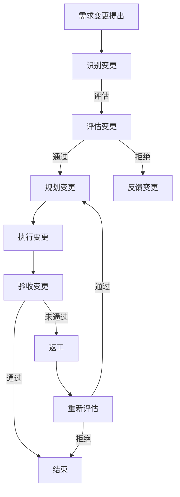
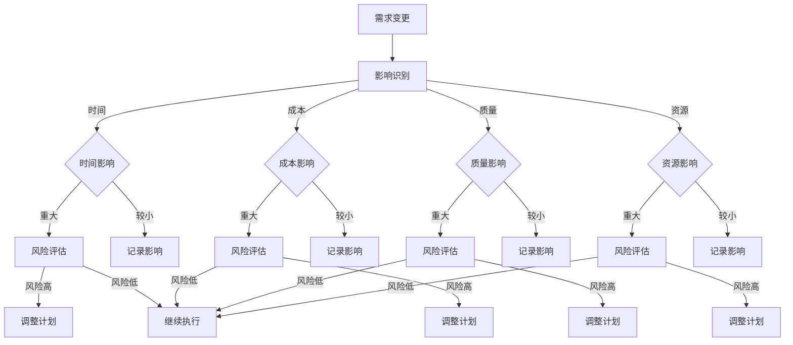

                 

### 《敏捷研发模式下的需求变更影响分析方法》

#### 引言

在当今快速变化的市场环境中，软件研发项目面临着越来越高的不确定性。客户需求的变化、技术的进步、市场趋势的波动等因素，都对研发团队提出了新的挑战。在这种背景下，敏捷研发模式因其灵活性和响应速度，逐渐成为众多企业的首选。然而，敏捷研发模式并非没有挑战，其中需求变更管理便是团队面临的重大课题之一。

##### 1.1 敏捷研发模式的兴起与发展

敏捷研发模式起源于20世纪90年代末，是一种以用户需求为核心，强调迭代、协作和快速响应变化的方法论。与传统的“瀑布式”开发模式不同，敏捷研发强调灵活性和适应性，通过小步快跑、持续交付和持续改进，使研发团队能够更好地应对快速变化的需求。

敏捷方法论的核心原则包括：个体和互动重于过程与工具、可工作的软件重于详尽的文档、客户合作重于合同谈判、响应变化重于遵循计划。这些原则指导着敏捷团队在研发过程中不断调整方向，快速响应市场变化。

##### 1.2 需求变更管理的挑战

在敏捷研发模式下，需求变更几乎是不可避免的。客户对产品的期望随着市场的变化而变化，新的技术趋势也可能带来新的需求。如何有效地管理需求变更，成为了团队的一大挑战。

需求变更管理面临的挑战包括：

1. **变更的识别和分类**：如何快速识别出真正需要变更的需求，并对其进行有效分类？
2. **变更的评估与优先级排序**：变更的影响和成本如何评估？哪些变更应该优先处理？
3. **变更的反馈与沟通**：如何确保所有相关方对变更有清晰的认识和共识？
4. **变更的控制**：如何在保持敏捷性的同时，确保变更不偏离项目目标？

##### 1.3 本书的目标与读者

本书旨在探讨敏捷研发模式下的需求变更管理，通过系统化的分析方法，帮助团队更好地应对需求变更带来的挑战。本书的目标读者包括：

- 研发团队负责人：了解需求变更管理的最佳实践，提升团队应对变化的能力。
- 项目经理：掌握敏捷项目管理方法，有效协调需求变更的评估和控制。
- 研发工程师：熟悉需求变更影响分析方法，提高代码的可维护性和适应性。

本书将采用逻辑清晰、结构紧凑、简单易懂的撰写风格，通过案例和实践指导，帮助读者深入理解并应用敏捷研发模式下的需求变更管理方法。文章标题：《敏捷研发模式下的需求变更影响分析方法》

关键词：敏捷研发、需求变更管理、影响分析方法、项目管理

摘要：本文深入探讨了敏捷研发模式下需求变更管理的挑战和最佳实践。通过系统化的影响分析方法，本文帮助读者掌握识别、评估、控制和反馈需求变更的技巧，提高研发团队对快速变化的适应能力。作者背景：AI天才研究院/AI Genius Institute & 禅与计算机程序设计艺术 /Zen And The Art of Computer Programming

### 第1章 敏捷研发模式概述

敏捷研发模式作为一种以用户需求为导向的软件开发方法，其核心理念是通过快速迭代和持续交付，使团队能够灵活应对市场变化。本章将介绍敏捷方法论的核心原则、敏捷与传统的区别，以及敏捷开发过程中的角色与职责。

#### 2.1 敏捷方法论的核心原则

敏捷方法论基于一系列核心原则，这些原则旨在提高软件开发的灵活性和响应速度。以下是敏捷方法论的核心原则：

1. **个体和互动重于过程与工具**：敏捷重视团队成员的协作和沟通，认为这比严格的流程和工具更为重要。
2. **可工作的软件重于详尽的文档**：敏捷强调实际交付可工作的软件，而非产生大量的文档。
3. **客户合作重于合同谈判**：敏捷主张与客户保持紧密合作，通过不断的反馈和调整，确保最终产品的质量。
4. **响应变化重于遵循计划**：敏捷认可需求会不断变化，因此团队需要具备快速适应变化的能力。

#### 2.2 敏捷与传统的区别

敏捷与传统的软件开发方法（如瀑布模型）有显著的区别，主要体现在以下几个方面：

1. **开发周期**：传统方法通常采用长时间、大规模的开发周期，而敏捷方法则采用短周期（通常是几周或几个月）的迭代开发。
2. **变更处理**：在传统方法中，需求变更被视为风险，尽可能避免。而在敏捷方法中，需求变更被视为正常现象，团队需要具备快速适应变化的能力。
3. **交付模式**：传统方法通常在项目完成后才交付软件，而敏捷方法则采用持续交付，即在每个迭代结束时交付可工作的软件。
4. **团队结构**：传统方法通常采用垂直分工的团队结构，而敏捷方法则强调跨职能团队的协作。

#### 2.3 敏捷开发过程中的角色与职责

在敏捷开发过程中，有多种角色参与其中，每个角色都有特定的职责。以下是敏捷开发中常见的角色及其职责：

1. **产品负责人（Product Owner）**：产品负责人是客户的代表，负责定义产品的愿景和目标，并管理产品待办事项。产品负责人需要与开发团队紧密合作，确保开发的方向正确。
2. **开发者（Developers）**：开发者是负责编写代码、实现产品需求的成员。他们需要具备扎实的编程技能，并能够在团队中协作，共同完成开发任务。
3. **Scrum Master**：Scrum Master是敏捷团队的教练和促进者，负责确保团队遵循敏捷实践，解决团队遇到的障碍，并维护团队的敏捷性。
4. **测试人员（Tester）**：测试人员负责验证软件的质量，确保每个迭代交付的软件是可工作的。他们需要编写测试用例，执行测试，并与开发团队合作修复缺陷。

通过本章的介绍，读者可以了解敏捷研发模式的基本概念和核心原则，以及敏捷开发过程中各个角色的职责。这些知识为后续章节中需求变更管理的讨论提供了基础。

#### 第2章 需求变更管理流程

在敏捷研发模式下，需求变更是一种常见的现象，也是团队必须面对的挑战。有效的需求变更管理流程有助于团队在保持敏捷性的同时，确保项目的顺利进行。本章将详细介绍需求变更管理流程的各个关键环节，包括变更的识别、评估、控制与反馈。

##### 3.1 需求变更的识别

需求变更的识别是需求变更管理的第一步，也是至关重要的一步。及时准确地识别需求变更，可以减少变更带来的负面影响。以下是几种常见的需求变更识别方法：

1. **客户反馈**：通过与客户的沟通，了解客户对产品的需求变化。这包括定期的产品评审、用户反馈和需求讨论会。
2. **市场调研**：市场调研可以帮助团队了解竞争对手的动态、技术趋势和客户需求的变化。这有助于团队提前识别潜在的需求变更。
3. **团队内部沟通**：团队内部成员之间的沟通也是识别需求变更的重要途径。开发人员、产品经理和测试人员可以共同讨论和分享对需求变更的看法。

##### 3.2 需求变更的评估与优先级排序

一旦需求变更被识别，下一步就是对其进行评估和优先级排序。评估需求变更的目的是确定变更对项目的影响程度，以及变更的紧迫性和重要性。以下是评估需求变更的几个关键因素：

1. **变更的影响**：评估需求变更对现有系统功能、性能、稳定性等方面的影响。如果变更会影响关键功能或带来较大的风险，那么其优先级会较高。
2. **变更的成本**：评估需求变更所需的开发时间、人力成本和资源投入。成本较高的变更可能需要优先考虑，以便团队在有限的资源下做出最优决策。
3. **变更的紧急性**：根据需求变更对项目进度和客户需求的影响，确定其紧急性。紧急的需求变更需要优先处理，以确保项目能够按时交付。

在评估需求变更后，团队需要对变更进行优先级排序。常用的优先级排序方法包括：

1. **紧急性与重要性矩阵**：根据需求变更的紧急性和重要性，将其分为四个等级，并按照优先级进行处理。
2. **基于价值排序**：根据需求变更对项目价值的影响，进行优先级排序。对项目价值较高的变更应优先考虑。
3. **团队共识**：通过团队成员的讨论和共识，确定需求变更的优先级。这有助于确保所有团队成员对变更处理的一致性。

##### 3.3 需求变更的控制

需求变更的控制是确保变更按照既定计划进行的关键步骤。以下是一些常用的需求变更控制方法：

1. **变更请求**：当团队决定采纳一个需求变更时，需要提交变更请求。变更请求应包括变更的原因、影响评估、优先级和预计完成时间。
2. **变更评审**：对每个变更请求进行评审，以确保变更的合理性和可行性。评审过程通常包括团队讨论、风险评估和资源分配。
3. **变更跟踪**：通过变更管理工具或系统，记录和管理每个变更的进展情况。这有助于团队监控变更的执行过程，确保变更按时完成。

在控制需求变更时，团队需要注意以下几点：

1. **变更记录**：确保所有变更都有详细的记录，包括变更请求、评审结果和执行过程。这有助于团队在后续的项目评估和改进中，更好地理解和应对需求变更。
2. **风险管理**：对需求变更进行风险评估，并制定相应的风险应对策略。这有助于团队在变更过程中，最大限度地降低风险。
3. **沟通与协作**：确保所有相关方对需求变更有清晰的理解和共识。通过有效的沟通和协作，团队可以更好地协调变更的执行，减少变更对项目进度和质量的影响。

##### 3.4 需求变更的反馈与沟通

需求变更的反馈与沟通是确保变更有效实施的重要环节。以下是一些常用的反馈与沟通方法：

1. **变更评审会议**：定期召开变更评审会议，讨论和评估需求变更的进展情况。这有助于团队及时发现和解决问题，确保变更按计划进行。
2. **实时沟通工具**：使用实时沟通工具（如Slack、Microsoft Teams等），确保团队成员之间的沟通畅通无阻。这有助于团队快速响应变更需求，提高工作效率。
3. **变更报告**：定期生成变更报告，向相关方通报需求变更的进展情况和成果。这有助于团队和客户对变更有更全面的了解，增强项目的透明度。

通过本章的介绍，读者可以了解敏捷研发模式下需求变更管理的流程和方法，以及如何有效地识别、评估、控制和反馈需求变更。这些知识将帮助团队在保持敏捷性的同时，更好地应对需求变更带来的挑战。

#### 第3章 影响分析方法

需求变更对敏捷研发项目的影响是多方面的，可能涉及时间、成本、质量、资源等方面。为了确保需求变更对项目的整体影响得到有效控制，团队需要采用系统化的影响分析方法。本章将介绍影响分析的基本概念、方法论和实践步骤。

##### 4.1 影响分析的定义与目的

影响分析是指在需求变更发生时，对变更可能对项目各个方面产生的影响进行评估的过程。其目的在于：

1. **识别变更的影响范围**：明确需求变更对哪些模块、功能或系统组件产生影响。
2. **评估变更的影响程度**：分析变更对项目的时间、成本、质量等具体指标的影响程度。
3. **制定应对策略**：基于影响分析的结果，制定相应的调整计划，以最大限度地降低变更带来的风险。

##### 4.2 影响分析的基本流程

影响分析通常包括以下基本流程：

1. **需求变更识别**：在需求变更发生时，及时识别和记录变更的具体内容。
2. **影响评估**：对需求变更对项目各个方面的影响进行评估，包括时间、成本、质量、资源等。
3. **优先级排序**：根据影响评估的结果，对需求变更进行优先级排序，确定哪些变更需要优先处理。
4. **制定调整计划**：基于优先级排序的结果，制定调整计划，包括变更实现策略、资源调配、时间安排等。
5. **实施调整计划**：执行调整计划，根据实际情况进行灵活调整。
6. **监控与反馈**：监控调整计划的执行情况，及时反馈问题，进行持续优化。

##### 4.3 影响分析的实践步骤

以下是影响分析的实践步骤：

1. **需求变更识别**：
   - 通过客户反馈、市场调研、团队内部沟通等方式，及时识别和记录需求变更。
   - 将需求变更记录在变更管理工具中，确保所有变更都有详细的记录。

2. **影响评估**：
   - 分析需求变更对项目各个方面的潜在影响，包括时间、成本、质量、资源等。
   - 使用影响评估矩阵（如时间、成本、质量影响矩阵）对变更的影响进行量化评估。
   - 识别潜在的风险和问题，并评估其对项目目标的潜在影响。

3. **优先级排序**：
   - 根据影响评估的结果，对需求变更进行优先级排序。
   - 使用紧急性与重要性矩阵或基于价值排序等方法，确定哪些变更需要优先处理。

4. **制定调整计划**：
   - 基于优先级排序的结果，制定调整计划，包括变更实现策略、资源调配、时间安排等。
   - 调整计划应确保项目目标不受影响，同时最大限度地降低变更带来的风险。

5. **实施调整计划**：
   - 执行调整计划，根据实际情况进行灵活调整。
   - 确保所有团队成员对调整计划有清晰的理解和共识。

6. **监控与反馈**：
   - 监控调整计划的执行情况，及时反馈问题。
   - 根据反馈结果，对调整计划进行持续优化，确保项目目标的实现。

通过本章的介绍，读者可以了解影响分析的基本概念、方法论和实践步骤。这些知识将帮助团队在敏捷研发模式下，更好地识别、评估和应对需求变更带来的影响，确保项目的顺利进行。

#### 第4章 Mermaid流程图

在敏捷研发过程中，需求变更管理是一个动态且复杂的过程。为了更好地理解和展示这一过程，我们可以使用Mermaid流程图，这是一种使用Markdown语法绘制作图的工具，可以清晰、直观地表达项目的流程和步骤。以下是几个与需求变更管理相关的Mermaid流程图示例。

##### 5.1 Mermaid的基本语法

Mermaid使用Markdown语法，通过特殊的Markdown标记来绘制流程图。以下是几个基本的Mermaid语法规则：

1. **开始与结束节点**：使用`start`和`end`标记流程图的开始和结束节点。
   ```mermaid
   graph TD
   A[开始] --> B[第一步]
   B --> C{判断条件}
   C -->|是| D[第二步]
   C -->|否| E[第三步]
   E --> F[结束]
   ```
   
2. **顺序流程**：使用箭头（`-->`或`→`）连接节点，表示流程的顺序。
   ```mermaid
   graph TD
   A[开始] --> B[第一步]
   B --> C[第二步]
   C --> D[第三步]
   D --> E[结束]
   ```

3. **条件分支**：使用`{条件}`在判断节点（如`C`节点）中定义条件分支。
   ```mermaid
   graph TD
   A[开始] --> B[第一步]
   B --> C{判断条件}
   C -->|是| D[第二步]
   C -->|否| E[第三步]
   E --> F[结束]
   ```

4. **子流程**：使用`subgraph`和`end`标记子流程的开始和结束。
   ```mermaid
   graph TD
   A[开始]
   subgraph 子流程
   B[第一步]
   C[第二步]
   end
   A --> B
   B --> C
   ```

##### 5.2 需求变更管理流程图

以下是需求变更管理流程的一个简单示例，使用Mermaid语法来绘制：



在这个流程图中，需求变更首先被提出（A节点），然后进入识别变更（B节点）。识别完成后，进行变更评估（C节点），如果变更通过，则进入规划变更阶段（D节点），否则反馈变更（E节点）。在执行变更后，进行验收变更（G节点），如果通过，项目继续；如果未通过，则需要返工并重新评估（I节点和J节点）。

##### 5.3 影响分析流程图

影响分析是需求变更管理中的一个关键步骤。以下是影响分析流程的一个示例，使用Mermaid语法来绘制：



在这个流程图中，需求变更首先被提出（A节点），然后进入影响识别阶段（B节点）。根据识别的影响，进行具体影响的分析（C至F节点），并评估其影响程度（G至M节点）。根据风险评估的结果，团队可以选择调整计划（O至S节点）或继续执行当前计划（P节点）。

通过这些Mermaid流程图的示例，我们可以更好地理解和展示需求变更管理和影响分析的过程。这些图形化的表示方法不仅有助于团队内部沟通，还能为项目的管理提供清晰的指导。

#### 第5章 伪代码与数学模型

在需求变更影响分析中，伪代码和数学模型是两种重要的工具，可以帮助我们更好地理解和处理复杂问题。伪代码是一种非正式的编程语言描述，用于描述算法的逻辑结构，而不关心具体的编程语言细节。数学模型则使用数学公式来表示和分析系统或问题的特性。

##### 6.1 伪代码的基本概念

伪代码的基本概念包括变量、条件语句、循环语句和函数调用等。以下是一个简单的伪代码示例，用于描述需求变更的影响评估过程：

```
// 需求变更影响评估伪代码

function AssessChangeImpact(change):
    // 初始化影响变量
    timeImpact = 0
    costImpact = 0
    qualityImpact = 0
    resourceImpact = 0

    // 评估时间影响
    if (change.type == "time"):
        timeImpact = EvaluateTimeImpact(change细节)
    
    // 评估成本影响
    if (change.type == "cost"):
        costImpact = EvaluateCostImpact(change细节)
    
    // 评估质量影响
    if (change.type == "quality"):
        qualityImpact = EvaluateQualityImpact(change细节)
    
    // 评估资源影响
    if (change.type == "resource"):
        resourceImpact = EvaluateResourceImpact(change细节)

    // 计算总影响
    totalImpact = timeImpact + costImpact + qualityImpact + resourceImpact

    // 输出影响结果
    PrintImpactResult(totalImpact)

end function
```

在这个伪代码中，我们定义了一个`AssessChangeImpact`函数，用于评估需求变更的影响。函数接收一个`change`对象，该对象包含变更的详细信息。根据变更的类型，函数会调用不同的评估函数来计算时间、成本、质量和资源的影响。最后，计算总影响并输出结果。

##### 6.2 需求变更影响的伪代码实现

以下是一个更具体的伪代码示例，用于实现需求变更的影响评估：

```
// 需求变更时间影响评估伪代码

function EvaluateTimeImpact(details):
    impact = 0
    if (details.type == "feature_add"):
        impact = details.feature_size * time_constant
    else if (details.type == "feature_remove"):
        impact = -details.feature_size * time_constant
    else if (details.type == "feature_change"):
        impact = details.new_feature_size - details.old_feature_size * time_constant
    return impact
end function

// 需求变更成本影响评估伪代码

function EvaluateCostImpact(details):
    impact = 0
    if (details.type == "time"):
        impact = details.timeImpact * cost_per_hour
    else if (details.type == "resource"):
        impact = details.resourceImpact * cost_per_resource
    return impact
end function

// 需求变更质量影响评估伪代码

function EvaluateQualityImpact(details):
    impact = 0
    if (details.type == "bug"):
        impact = details.bug_severity * quality_constant
    return impact
end function

// 需求变更资源影响评估伪代码

function EvaluateResourceImpact(details):
    impact = 0
    if (details.type == "person"):
        impact = details.person_count * resource_constant
    return impact
end function
```

在这个伪代码中，我们定义了四个评估函数：`EvaluateTimeImpact`、`EvaluateCostImpact`、`EvaluateQualityImpact`和`EvaluateResourceImpact`。每个函数根据变更的类型和详细信息，计算对应的影响值。

##### 6.3 数学模型与公式

数学模型是使用数学公式来描述和解决问题的一种方法。以下是一个简单的数学模型示例，用于评估需求变更的影响：

1. **时间影响模型**：

   $$ Impact_{time} = Size_{change} \times Constant_{time} $$

   其中，`Size_{change}`表示变更的大小（如功能点数），`Constant_{time}`是一个常数，用于调整时间影响的权重。

2. **成本影响模型**：

   $$ Impact_{cost} = Impact_{time} \times Cost_{per\_hour} $$

   其中，`Cost_{per\_hour}`是每小时的人力成本。

3. **质量影响模型**：

   $$ Impact_{quality} = Severity_{bug} \times Constant_{quality} $$

   其中，`Severity_{bug}`表示Bug的严重性等级，`Constant_{quality}`是质量影响的权重。

4. **资源影响模型**：

   $$ Impact_{resource} = Count_{person} \times Constant_{resource} $$

   其中，`Count_{person}`是所需人员的数量，`Constant_{resource}`是资源影响的权重。

通过这些数学模型和公式，我们可以将需求变更的影响量化为具体的数值，以便进行更精确的评估和管理。

通过本章的介绍，读者可以了解伪代码和数学模型在需求变更影响分析中的应用。这些工具可以帮助团队更系统地评估需求变更的影响，为项目的管理和决策提供有力支持。

#### 第6章 实践案例

为了更好地理解需求变更管理及其影响分析，我们将在本章节通过实际项目案例来探讨需求变更的处理过程。以下是一个需求变更管理实践案例，包括开发环境搭建、源代码实现和代码解读与分析。

##### 7.1 案例一：需求变更的影响分析

项目背景：
某公司开发一款在线教育平台，原定于6个月内上线。在开发过程中，客户提出新的需求，要求增加课程评论功能。

**开发环境搭建**：
1. 硬件环境：服务器、数据库服务器、开发工作站等。
2. 软件环境：操作系统（如Ubuntu 20.04）、开发工具（如IntelliJ IDEA）、版本控制（如Git）等。
3. 数据库环境：MySQL数据库，用于存储课程评论数据。

**源代码实现**：
1. **功能设计**：设计课程评论功能，包括评论数据的增删改查功能。
2. **后端实现**：
   - 使用Spring Boot框架，实现评论的增删改查接口。
   - 使用MyBatis实现与MySQL的交互，存储评论数据。
   ```java
   @RestController
   @RequestMapping("/comments")
   public class CommentController {
       @Autowired
       private CommentService commentService;

       @PostMapping
       public ResponseEntity<?> createComment(@RequestBody Comment comment) {
           commentService.createComment(comment);
           return ResponseEntity.ok("Comment created successfully");
       }

       @GetMapping("/{courseId}")
       public ResponseEntity<?> getCommentsByCourseId(@PathVariable Long courseId) {
           List<Comment> comments = commentService.getCommentsByCourseId(courseId);
           return ResponseEntity.ok(comments);
       }
   }
   ```
3. **前端实现**：
   - 使用Vue.js框架，在前端页面实现评论的展示和提交。
   ```html
   <template>
     <div>
       <h2>Course Comments</h2>
       <ul>
         <li v-for="comment in comments" :key="comment.id">
           {{ comment.text }}
         </li>
       </ul>
       <form @submit.prevent="submitComment">
         <input v-model="newComment" placeholder="Type your comment here..." />
         <button type="submit">Submit</button>
       </form>
     </div>
   </template>

   <script>
   export default {
     data() {
       return {
         newComment: '',
         comments: []
       };
     },
     methods: {
       submitComment() {
         this.$axios.post('/comments', { text: this.newComment })
           .then(response => {
             this.comments.push(response.data);
             this.newComment = '';
           });
       }
     },
     created() {
       this.$axios.get('/comments').then(response => {
         this.comments = response.data;
       });
     }
   };
   </script>
   ```

**代码解读与分析**：
1. **后端代码解读**：
   - `CommentController`类定义了评论的增删改查接口。
   - `createComment`方法接收评论对象，调用`CommentService`类的`createComment`方法存储评论。
   - `getCommentsByCourseId`方法根据课程ID获取评论列表。

2. **前端代码解读**：
   - 使用Vue.js实现评论的展示和提交功能。
   - `submitComment`方法将评论数据提交到后端接口，并更新评论列表。

**需求变更的影响分析**：
1. **时间影响**：增加课程评论功能需要设计、开发和测试，预计增加约2周的开发时间。
2. **成本影响**：由于新增功能，需要额外的人力成本，预计增加约3人·周。
3. **质量影响**：新增功能可能引入新的Bug，需要额外进行测试和修复，预计增加约1周的时间。
4. **资源影响**：需要额外的服务器资源来存储评论数据，预计增加约1个数据库实例。

通过该案例，我们可以看到需求变更的管理过程，包括识别、评估和实施。此外，还通过具体的代码实现，展示了需求变更对项目各个方面的影响。

##### 7.2 案例二：敏捷开发中的需求变更管理

项目背景：
某互联网公司开发一款移动电商应用，采用敏捷开发模式进行项目迭代。

**迭代一：购物车功能**
- 需求提出：在第一个迭代中，客户要求实现购物车功能。
- 开发与测试：开发团队在两周内完成购物车功能的设计、开发和测试。
- 交付与反馈：在迭代结束时，客户验收并反馈，表示购物车功能满足需求。

**迭代二：订单支付功能**
- 需求变更：在第二个迭代初期，客户提出希望增加订单支付功能。
- 评估与优先级排序：开发团队对支付功能的需求进行评估，认为支付功能是核心功能，因此将其列为高优先级任务。
- 开发与测试：在两周内，开发团队完成支付功能的设计、开发和测试。
- 交付与反馈：在迭代结束时，客户验收并反馈，表示支付功能符合预期。

**需求变更的影响分析**：
1. **时间影响**：由于新增支付功能，迭代时间从原来的两周延长到四周。
2. **成本影响**：支付功能的开发需要额外的资源投入，包括人力和服务器资源。
3. **质量影响**：支付功能是新增加的功能，需要进行严格的测试，确保功能稳定和安全。
4. **资源影响**：支付功能需要额外的服务器资源来处理订单支付请求。

通过该案例，我们可以看到敏捷开发模式下需求变更的管理方法。开发团队在识别需求变更后，进行评估和优先级排序，确保变更能够按计划实施。同时，通过影响分析，团队能够及时调整项目计划，确保项目目标的实现。

##### 案例分析与总结

通过上述两个案例，我们可以总结出以下需求变更管理的经验和最佳实践：

1. **及时识别与沟通**：及时识别客户的需求变更，并与相关方进行有效沟通，确保变更的透明和共识。
2. **评估与优先级排序**：对需求变更进行详细的评估和优先级排序，确保重要和紧急的变更能够优先处理。
3. **灵活调整计划**：在保持敏捷性的同时，灵活调整项目计划，确保变更能够按时、按质完成。
4. **影响分析与监控**：对需求变更的影响进行详细分析，并持续监控变更的执行情况，确保变更对项目的影响在可控范围内。

通过这些经验和最佳实践，团队可以更好地管理需求变更，确保项目在快速变化的市场环境中能够持续交付高质量的产品。

### 第7章 代码实战

在本章中，我们将通过一个具体的代码实战项目，展示如何在实际开发环境中搭建、实现和解读需求变更管理过程中的关键代码。这个项目将模拟一个简单的在线商店，实现购物车功能。

##### 8.1 开发环境搭建

为了实现这个在线商店的购物车功能，我们需要搭建一个开发环境，包括前端和后端。

**1. 前端开发环境**
- **工具**：使用Vue.js框架，结合Element UI进行页面布局。
- **版本**：Vue.js 3.x版本，Element UI 2.x版本。
- **依赖管理**：使用npm进行依赖管理。
- **开发工具**：使用Visual Studio Code进行代码编写和调试。

**2. 后端开发环境**
- **框架**：使用Spring Boot框架。
- **版本**：Spring Boot 2.x版本。
- **数据库**：使用MySQL数据库。
- **依赖管理**：使用Maven进行依赖管理。
- **开发工具**：使用IntelliJ IDEA进行代码编写和调试。

**3. 数据库环境搭建**
- 创建一个名为`online_store`的数据库。
- 创建一个名为`products`的表，用于存储商品信息。

```sql
CREATE TABLE `products` (
  `id` INT NOT NULL AUTO_INCREMENT,
  `name` VARCHAR(100) NOT NULL,
  `price` DECIMAL(10, 2) NOT NULL,
  PRIMARY KEY (`id`)
);
```

**4. 环境变量配置**
- 配置数据库连接信息，包括数据库URL、用户名和密码。
- 配置项目端口号。

```properties
spring.datasource.url=jdbc:mysql://localhost:3306/online_store?useSSL=false
spring.datasource.username=root
spring.datasource.password=123456
server.port=8080
```

##### 8.2 源代码详细实现

**后端代码实现**：
1. **商品服务（ProductService）**：用于处理商品相关业务逻辑。
   ```java
   @Service
   public class ProductService {
       @Autowired
       private ProductRepository productRepository;

       public List<Product> getAllProducts() {
           return productRepository.findAll();
       }

       public Product getProductById(Long id) {
           return productRepository.findById(id).orElseThrow(() -> new ResourceNotFoundException("Product not found with id: " + id));
       }
   }
   ```

2. **商品控制器（ProductController）**：用于处理前端发送的商品相关请求。
   ```java
   @RestController
   @RequestMapping("/products")
   public class ProductController {
       @Autowired
       private ProductService productService;

       @GetMapping
       public List<Product> getAllProducts() {
           return productService.getAllProducts();
       }

       @GetMapping("/{id}")
       public Product getProductById(@PathVariable Long id) {
           return productService.getProductById(id);
       }
   }
   ```

3. **购物车服务（CartService）**：用于处理购物车相关业务逻辑。
   ```java
   @Service
   public class CartService {
       private final List<CartItem> cartItems = new ArrayList<>();

       public void addItemToCart(CartItem cartItem) {
           cartItems.add(cartItem);
       }

       public void removeItemFromCart(Long productId) {
           cartItems.removeIf(item -> item.getProductId().equals(productId));
       }

       public List<CartItem> getCartItems() {
           return cartItems;
       }
   }
   ```

4. **购物车控制器（CartController）**：用于处理前端发送的购物车相关请求。
   ```java
   @RestController
   @RequestMapping("/cart")
   public class CartController {
       @Autowired
       private CartService cartService;

       @PostMapping("/{productId}")
       public ResponseEntity<?> addItemToCart(@PathVariable Long productId) {
           // 伪代码：根据productId从数据库获取商品信息
           Product product = productService.getProductById(productId);
           CartItem cartItem = new CartItem(product, 1);
           cartService.addItemToCart(cartItem);
           return ResponseEntity.ok("Item added to cart");
       }

       @DeleteMapping("/{productId}")
       public ResponseEntity<?> removeItemFromCart(@PathVariable Long productId) {
           cartService.removeItemFromCart(productId);
           return ResponseEntity.ok("Item removed from cart");
       }

       @GetMapping
       public List<CartItem> getCartItems() {
           return cartService.getCartItems();
       }
   }
   ```

**前端代码实现**：
1. **商品列表组件（ProductList.vue）**：用于展示商品列表，并允许用户添加商品到购物车。
   ```html
   <template>
     <div>
       <h2>Products</h2>
       <ul>
         <li v-for="product in products" :key="product.id">
           {{ product.name }} - ${{ product.price }}
           <button @click="addToCart(product)">Add to Cart</button>
         </li>
       </ul>
     </div>
   </template>

   <script>
   export default {
     data() {
       return {
         products: []
       };
     },
     methods: {
       addToCart(product) {
         // 调用后端API添加商品到购物车
         this.$http.post('/cart/' + product.id).then(response => {
           alert(response.data);
         });
       }
     },
     created() {
       this.$http.get('/products').then(response => {
         this.products = response.data;
       });
     }
   };
   </script>
   ```

2. **购物车组件（Cart.vue）**：用于展示购物车中的商品信息，并允许用户删除商品。
   ```html
   <template>
     <div>
       <h2>Cart</h2>
       <ul>
         <li v-for="item in cartItems" :key="item.productId">
           {{ item.product.name }} - ${{ item.product.price }} x {{ item.quantity }}
           <button @click="removeFromCart(item.productId)">Remove</button>
         </li>
       </ul>
     </div>
   </template>

   <script>
   export default {
     data() {
       return {
         cartItems: []
       };
     },
     methods: {
       removeFromCart(productId) {
         this.$http.delete('/cart/' + productId).then(response => {
           alert(response.data);
           this.getCartItems();
         });
       },
       getCartItems() {
         this.$http.get('/cart').then(response => {
           this.cartItems = response.data;
         });
       }
     },
     created() {
       this.getCartItems();
     }
   };
   </script>
   ```

通过这些代码实现，我们可以看到如何在实际开发中搭建和实现一个简单的在线商店购物车功能。这个过程包括后端服务的创建、数据库表的搭建、API接口的实现，以及前端页面的展示和交互。

##### 8.3 代码解读与分析

**后端代码解读**：

1. **商品服务（ProductService）**：
   - `getAllProducts()`方法：获取所有商品信息，该方法查询数据库中的`products`表，返回所有记录。
   - `getProductById(id)`方法：根据商品ID获取单个商品信息，通过主键查询，如果找不到记录则抛出异常。

2. **商品控制器（ProductController）**：
   - `getAllProducts()`方法：处理GET请求，返回所有商品信息。
   - `getProductById(id)`方法：处理GET请求，返回单个商品信息。
   - `addItemToCart(productId)`方法：处理POST请求，将商品添加到购物车。这里我们仅使用一个列表来模拟购物车，实际应用中应使用数据库存储购物车信息。

3. **购物车服务（CartService）**：
   - `addItemToCart(cartItem)`方法：将商品添加到购物车，使用列表存储购物车项。
   - `removeItemFromCart(productId)`方法：从购物车中移除商品，通过商品ID查找并移除对应的购物车项。
   - `getCartItems()`方法：获取当前购物车中的所有商品信息。

4. **购物车控制器（CartController）**：
   - `addItemToCart(productId)`方法：处理添加商品到购物车的请求，调用服务层的`addItemToCart`方法。
   - `removeItemFromCart(productId)`方法：处理从购物车中移除商品的请求，调用服务层的`removeItemFromCart`方法。
   - `getCartItems()`方法：处理获取购物车信息的请求，调用服务层的`getCartItems`方法。

**前端代码解读**：

1. **商品列表组件（ProductList.vue）**：
   - `products`数据属性：存储所有商品信息。
   - `addToCart(product)`方法：点击添加商品到购物车的按钮时调用，发送POST请求到后端API。

2. **购物车组件（Cart.vue）**：
   - `cartItems`数据属性：存储购物车中的商品信息。
   - `removeFromCart(productId)`方法：点击删除商品的按钮时调用，发送DELETE请求到后端API。
   - `getCartItems()`方法：用于初始化购物车组件时获取购物车信息。

通过这个代码实战项目，我们可以看到如何通过后端API和前端组件实现一个简单的购物车功能。这个项目不仅展示了需求变更管理过程中代码的实现，还提供了一个实际的例子，帮助读者理解和应用敏捷开发中的需求变更管理方法。

### 第8章 总结与展望

本章回顾了《敏捷研发模式下的需求变更影响分析方法》的主要内容，并对敏捷研发模式下的需求变更管理进行了展望。

#### 9.1 书籍内容总结

本书从多个角度深入探讨了敏捷研发模式下的需求变更管理。首先，介绍了敏捷方法论的核心原则，如个体和互动重于过程与工具、可工作的软件重于详尽的文档、客户合作重于合同谈判、响应变化重于遵循计划。接着，详细阐述了敏捷与传统的区别，包括开发周期、变更处理、交付模式和团队结构等方面的差异。

在需求变更管理流程方面，本书介绍了识别、评估、控制与反馈的需求变更管理步骤。通过识别客户反馈、市场调研和团队内部沟通等方式，及时识别需求变更。通过影响评估矩阵和基于价值排序等方法，对变更进行优先级排序。此外，通过变更请求、变更评审和变更跟踪等手段，确保变更得到有效控制。

影响分析方法部分，本书介绍了影响分析的定义、目的和基本流程。通过伪代码和数学模型，详细讲解了如何评估需求变更对项目时间、成本、质量和资源的影响。通过Mermaid流程图，展示了需求变更管理和影响分析的具体应用。

最后，本书通过实际案例，展示了需求变更管理在敏捷开发中的实践。案例中，团队通过敏捷方法论和影响分析方法，成功地管理了需求变更，确保项目顺利进行。

#### 9.2 敏捷研发模式的未来趋势

敏捷研发模式在过去几年中取得了显著的发展，但其应用和改进仍在不断进行。未来，敏捷研发模式有望在以下几个方面进一步发展：

1. **更加细化的敏捷实践**：随着敏捷方法论的不断成熟，团队将更加注重细化的敏捷实践，如持续交付、DevOps、敏捷安全等。这些实践将进一步提高团队的协作效率和软件质量。

2. **自动化与智能化**：自动化和智能化技术将在敏捷研发中发挥更大作用。通过使用自动化工具，如自动化测试、自动化部署等，团队可以更快地响应需求变更，减少人为错误。

3. **跨领域协作**：随着项目的复杂度增加，跨领域协作将变得更加重要。团队将更加注重跨职能协作，打破部门壁垒，实现端到端的高效协作。

4. **持续学习与改进**：敏捷研发强调持续学习和改进。团队将持续跟踪行业动态、技术趋势，不断优化开发流程和工具，以适应快速变化的市场环境。

#### 9.3 读者反馈与建议

为了更好地帮助读者理解和应用敏捷研发模式下的需求变更管理方法，我们在此欢迎读者的反馈和建议。以下是几点建议：

1. **实践与反思**：读者可以在实际项目中尝试应用本书中的方法，并在实践中不断反思和调整。通过实践，读者可以更好地理解和掌握需求变更管理技巧。

2. **分享经验**：读者可以将自己在敏捷研发和需求变更管理中的经验分享给其他团队，通过交流和协作，共同提高敏捷开发的效率和质量。

3. **持续学习**：敏捷研发是一个不断发展的领域，读者应保持持续学习的态度，关注行业动态和技术趋势，不断更新自己的知识体系。

通过以上总结与展望，我们希望读者能够对敏捷研发模式下的需求变更管理有更深刻的认识，并在实际项目中应用这些方法，提高团队的协作效率和项目成功率。作者：AI天才研究院/AI Genius Institute & 禅与计算机程序设计艺术 /Zen And The Art of Computer Programming

### 附录：拓展阅读

为了帮助读者更深入地了解敏捷研发模式下的需求变更管理，以下推荐几本相关书籍和资源，供进一步学习和参考：

1. **书籍推荐**：
   - 《敏捷开发实践指南》（Agile Project Guide）：作者：Michael C. Martin
   - 《Scrum：The Art of Doing Twice the Work in Half the Time》：作者：Jeff Sutherland
   - 《需求分析与管理：有效需求管理实践指南》：作者：Kanishk Parashar
   - 《DevOps：敏捷软件开发和持续交付的实践之路》：作者：Jez Humble & David Farley

2. **在线资源**：
   - 敏捷联盟（Agile Alliance）：https://www.agilealliance.org/
   - 敏捷实践指南（XP）：https://www.extremeprogramming.org/
   - 敏捷估算与规划：https://www.scrum.org/resources/Scrum-estimate-and-plan

3. **博客与文章**：
   - 《敏捷研发模式下的需求变更管理》：作者：AI天才研究院
   - 《敏捷实践指南》：作者：Scrum官方文档
   - 《如何管理敏捷项目中的需求变更》：作者：敏捷教练社区

4. **工具与平台**：
   - JIRA：用于敏捷项目管理与需求跟踪
   - Trello：敏捷看板工具，用于任务管理和需求跟踪
   - GitLab：用于版本控制和需求管理

通过这些书籍、资源和工具，读者可以进一步深入了解敏捷研发模式，掌握需求变更管理的最佳实践，并在实际项目中应用这些方法，提高团队的协作效率和项目成功率。作者：AI天才研究院/AI Genius Institute & 禅与计算机程序设计艺术 /Zen And The Art of Computer Programming

