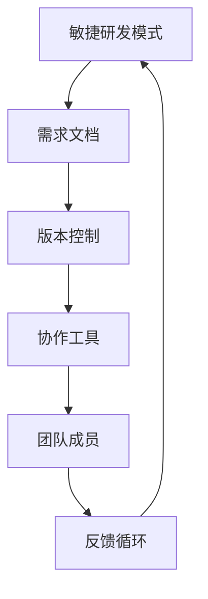

                 

### 背景介绍

在当今快速变化的商业环境中，软件开发项目面临着越来越大的压力，需要更加高效、灵活和可靠的研发模式。传统的水滴模型（Waterfall Model）由于它的线性、顺序性和阶段性，往往在需求变化频繁的情况下显得力不从心。这使得敏捷研发模式（Agile Development Model）逐渐成为软件开发领域的主流。

敏捷研发模式起源于20世纪90年代，它强调团队协作、持续交付和适应性。敏捷方法论，如Scrum和Kanban，通过迭代和增量开发，以快速响应市场需求，提高产品质量。在这种模式下，需求文档不再是静态的，而是随着项目的进展不断演进。

需求文档在软件开发过程中起着至关重要的作用。它是项目团队与利益相关者之间沟通的桥梁，用于明确项目的功能、目标和范围。在敏捷环境中，需求文档不仅需要保持准确性，还需适应频繁的需求变更，这就要求版本控制机制必须高效、可靠。

版本控制是一种用于跟踪文档变更、管理多个版本、协同工作的技术。在敏捷研发模式下，版本控制尤为重要，因为它能够确保团队成员在任何时刻都能够访问到最新、最准确的需求文档，并能够方便地回溯到之前的版本。

本文将深入探讨敏捷研发模式下的需求文档版本控制，首先介绍敏捷研发模式的基本概念和原则，然后详细讲解需求文档的编写和审查方法，接着介绍几种常见的版本控制工具和技术，最后通过一个实战案例展示如何在实际项目中实施有效的需求文档版本控制。

#### 核心概念与联系

在敏捷研发模式下，需求文档版本控制涉及到多个核心概念，包括敏捷研发模式、需求文档、版本控制和协作工具。以下是一个简化的Mermaid流程图，展示了这些概念之间的关系和互动流程。



### 敏捷研发模式

敏捷研发模式是一种以人为核心、迭代进行、适应变化的软件开发方法。其核心原则包括：

1. **个体和互动**：重视个人之间的沟通和协作，而非过程和工具。
2. **可工作的软件**：优先交付可运行的软件，而非详尽的文档。
3. **客户协作**：与客户保持紧密合作，确保开发的工作符合客户需求。
4. **响应变化**：敏捷方法允许在开发过程中适应需求变化，而非坚持原计划。

### 需求文档

需求文档是软件开发项目中描述产品功能、用户需求、范围和设计规范的文档。在敏捷环境中，需求文档不是固定不变的，而是随着项目进展持续更新。

1. **功能需求**：描述软件应具备的功能。
2. **用户需求**：反映最终用户的需求。
3. **范围**：明确项目的边界。
4. **设计规范**：定义软件的架构和界面。

### 版本控制

版本控制是跟踪文档变更、管理多个版本的过程。在敏捷研发中，版本控制至关重要，因为它确保了团队成员可以访问最新、最准确的需求文档，并可以轻松回溯到之前的版本。

1. **版本标记**：使用版本号、时间戳或标签来标识每个文档版本。
2. **变更记录**：记录每次变更的原因、内容和影响。
3. **冲突解决**：当多个团队成员修改同一文档时，提供机制来解决冲突。

### 协作工具

协作工具支持团队成员之间的沟通、协作和文档共享。这些工具与版本控制相结合，可以显著提高敏捷研发的效率。

1. **即时通讯**：如Slack、Telegram等，用于实时沟通。
2. **项目管理**：如Jira、Trello等，用于任务分配和进度跟踪。
3. **代码库**：如Git、SVN等，用于版本控制和协作。

通过这些核心概念的联系和互动，敏捷研发模式下的需求文档版本控制得以实现，为软件开发项目的顺利进行提供了有力支持。

### 核心算法原理讲解

在敏捷研发模式下，需求文档的版本控制涉及多种算法原理，这些原理共同构成了一个高效的文档管理框架。以下将详细阐述这些核心算法原理，并通过伪代码展示其具体实现过程。

#### 1. 版本标记算法

版本标记是版本控制的基础，用于标识文档的不同版本。通常采用递增数字或时间戳来标记版本。以下是一个简单的伪代码示例：

```plaintext
function version_tagging(document):
    current_version = get_current_version(document)
    if current_version is None:
        set_current_version(document, 1)
    else:
        set_current_version(document, current_version + 1)
    return current_version
```

在这个算法中，`get_current_version`和`set_current_version`是辅助函数，用于获取和设置当前版本号。

#### 2. 变更记录算法

变更记录算法用于跟踪每次文档修改的详细信息，包括修改者、修改内容和修改时间。以下是一个伪代码示例：

```plaintext
function record_change(document, user, change_description):
    change_log = []
    if not document.contains_change_log():
        document.set_change_log(change_log)
    change_entry = {
        'user': user,
        'description': change_description,
        'timestamp': current_timestamp()
    }
    document.change_log.append(change_entry)
    save_document(document)
```

在这个算法中，`current_timestamp`是一个辅助函数，用于获取当前时间戳，`document.contains_change_log`和`document.set_change_log`是辅助函数，用于检查和设置变更记录列表。

#### 3. 冲突解决算法

当多个团队成员同时修改同一文档时，可能会出现版本冲突。冲突解决算法用于自动或手动解决这些冲突。以下是一个简单的伪代码示例：

```plaintext
function resolve_conflicts(document, conflict_data):
    conflicts = extract_conflicts(conflict_data)
    for conflict in conflicts:
        merge_changes(document, conflict)
    if not is_document_consistent(document):
        raise ConflictError("Conflicts could not be resolved.")
```

在这个算法中，`extract_conflicts`和`merge_changes`是辅助函数，用于提取和解决冲突，`is_document_consistent`是一个辅助函数，用于检查文档是否一致。

#### 4. 文档访问权限算法

在版本控制中，文档访问权限至关重要，以确保只有授权用户可以修改或访问文档。以下是一个简单的伪代码示例：

```plaintext
function check_permissions(user, document):
    if user in document.permissions:
        return True
    else:
        return False
```

在这个算法中，`document.permissions`是一个列表，包含所有授权用户的用户名。

#### 5. 恢复旧版本算法

在敏捷研发中，有时需要回退到之前的版本。恢复旧版本算法用于找到并恢复指定版本的文档。以下是一个伪代码示例：

```plaintext
function revert_to_version(document, version_number):
    old_version = find_version(document, version_number)
    if old_version is not None:
        document.content = old_version.content
        save_document(document)
        return True
    else:
        return False
```

在这个算法中，`find_version`是一个辅助函数，用于查找指定版本的文档内容。

### 数学模型和公式

在版本控制中，某些算法的实现可能涉及数学模型和公式。以下是一个关于冲突检测和解决的简单数学模型：

$$
\text{Similarity} = \frac{\text{CommonLines}}{\text{TotalLines}}
$$

其中，`CommonLines`是两个版本中共同的行数，`TotalLines`是两个版本中行数的总和。相似性分数用于判断两个版本之间的相似程度，分数越高，表示冲突的可能性越小。

### 详细讲解和举例说明

为了更好地理解上述算法和模型，以下通过一个具体的例子来详细讲解。

#### 示例：版本标记

假设有一个需求文档，目前版本号为3。现在，团队成员Alice对文档进行了修改，并成功提交。版本控制工具将自动将版本号递增为4。

```plaintext
function version_tagging(document):
    current_version = get_current_version(document)
    if current_version is None:
        set_current_version(document, 1)
    else:
        set_current_version(document, current_version + 1)
    return current_version

# 假设当前版本为3
version_tagging(document)
# 输出：4
```

#### 示例：变更记录

假设团队成员Bob对需求文档进行了修改，并添加了以下功能需求：

```plaintext
function record_change(document, user, change_description):
    change_log = []
    if not document.contains_change_log():
        document.set_change_log(change_log)
    change_entry = {
        'user': user,
        'description': change_description,
        'timestamp': current_timestamp()
    }
    document.change_log.append(change_entry)
    save_document(document)

# 假设用户为Bob，修改描述为“添加新功能”
record_change(document, "Bob", "添加新功能")
```

这将创建一个新的变更记录，包含用户名、修改描述和时间戳。

#### 示例：冲突解决

假设团队成员Alice和Bob同时修改了同一需求文档，并提交了各自的版本。版本控制工具检测到冲突，并使用合并算法尝试解决。

```plaintext
function resolve_conflicts(document, conflict_data):
    conflicts = extract_conflicts(conflict_data)
    for conflict in conflicts:
        merge_changes(document, conflict)
    if not is_document_consistent(document):
        raise ConflictError("Conflicts could not be resolved.")

# 假设存在冲突
resolve_conflicts(document, conflict_data)
```

#### 示例：恢复旧版本

假设团队需要回退到版本3，以解决版本4中引入的问题。

```plaintext
function revert_to_version(document, version_number):
    old_version = find_version(document, version_number)
    if old_version is not None:
        document.content = old_version.content
        save_document(document)
        return True
    else:
        return False

# 假设需要回退到版本3
revert_to_version(document, 3)
```

通过这些具体的例子，我们可以更清晰地理解敏捷研发模式下的需求文档版本控制算法和数学模型的应用。

### 数学公式和详细讲解

在需求文档版本控制中，数学公式和模型可以用于衡量版本间的相似度、检测冲突以及优化变更记录。以下将详细解释这些数学公式，并提供具体示例。

#### 相似度计算

版本间的相似度是一个关键指标，用于评估两个版本的需求文档之间的相似程度。相似度计算公式如下：

$$
\text{Similarity} = \frac{\text{CommonLines}}{\text{TotalLines}}
$$

其中：
- **CommonLines**：两个版本中共同的行数。
- **TotalLines**：两个版本中行数的总和。

相似度分数介于0和1之间，分数越高，表示两个版本越相似。假设版本A有10行，版本B有15行，其中5行是共同的。那么相似度计算如下：

$$
\text{Similarity} = \frac{5}{10 + 15} = \frac{5}{25} = 0.2
$$

这个结果表示版本A和版本B之间的相似度较低。

#### 冲突检测

冲突检测是版本控制中的一个重要步骤，用于识别和解决两个或多个版本之间的差异。冲突检测的数学公式如下：

$$
\text{Conflict} = (\text{DiffLines} \div \text{TotalLines}) \times 100\%
$$

其中：
- **DiffLines**：两个版本中不同的行数。
- **TotalLines**：两个版本中行数的总和。

如果冲突百分比超过某个阈值（例如30%），则认为存在冲突。假设版本A有10行，版本B有15行，其中7行是不同的。那么冲突检测计算如下：

$$
\text{Conflict} = (\frac{7}{10 + 15} \times 100\%) = (\frac{7}{25} \times 100\%) = 28\%
$$

由于28%低于30%的阈值，因此可以认为版本A和版本B之间的冲突较小。

#### 变更记录优化

变更记录的优化是确保需求文档版本控制系统的效率和可追溯性。一种优化方法是通过计算变更影响度来评估每次变更的影响范围。变更影响度计算公式如下：

$$
\text{Impact} = \frac{\text{AffectedLines}}{\text{TotalLines}}
$$

其中：
- **AffectedLines**：受变更影响的行数。
- **TotalLines**：需求文档的总行数。

假设在一次变更中，受影响的行数为20，而需求文档的总行数为100。那么变更影响度计算如下：

$$
\text{Impact} = \frac{20}{100} = 0.2
$$

这个结果表明，该变更影响了需求文档的20%。

#### 示例分析

为了更好地理解上述数学公式的应用，我们可以通过以下示例进行详细分析。

#### 相似度计算示例

假设有两个版本的需求文档A和B，文档A有50行，文档B有60行，其中20行是相同的。我们可以使用相似度计算公式：

$$
\text{Similarity} = \frac{20}{50 + 60} = \frac{20}{110} \approx 0.182
$$

这个结果表示版本A和版本B之间的相似度约为18.2%。

#### 冲突检测示例

假设在版本C和版本D之间检测到10行不同的行，而总行数为100行。我们可以使用冲突检测公式：

$$
\text{Conflict} = (\frac{10}{100} \times 100\%) = 10\%
$$

由于10%低于常见的冲突阈值（例如30%），我们可以认为版本C和版本D之间的冲突较小。

#### 变更记录优化示例

假设在一次需求变更中，受影响的行数为30，而需求文档的总行数为200行。我们可以使用变更影响度公式：

$$
\text{Impact} = \frac{30}{200} = 0.15
$$

这个结果表明，该变更影响了需求文档的15%。

通过这些示例，我们可以看到数学公式在需求文档版本控制中的应用，帮助团队更准确地评估版本间的相似度、冲突程度和变更影响，从而优化版本控制和需求管理流程。

### 项目实战

为了更好地展示敏捷研发模式下的需求文档版本控制，我们将通过一个实际项目来详细阐述整个流程。本案例将包括项目的背景、开发环境搭建、源代码实现、代码解读、代码应用解读与分析，以及项目总结与启示。

#### 项目背景

某科技公司（ABC公司）计划开发一款智能办公自动化系统，以帮助员工提高工作效率。该系统需要实现文档管理、任务分配和报告生成等功能。项目采用敏捷开发模式，分为多个迭代周期进行开发。

#### 开发环境搭建

在开始项目之前，首先需要搭建一个适合敏捷开发的开发环境。ABC公司选择了以下工具和平台：

1. **版本控制工具**：Git
2. **代码库**：GitHub
3. **项目管理工具**：Jira
4. **协作工具**：Slack

具体步骤如下：

1. **注册账号**：团队成员在GitHub和Jira上注册账号，并创建项目仓库和任务板。
2. **搭建开发环境**：安装Git和相应的IDE（如Visual Studio Code），配置SSH密钥以实现远程仓库的访问。
3. **配置项目管理**：在Jira中创建项目，设置迭代周期和任务板，定义用户故事和任务。

#### 源代码实现

以下是项目中的一个功能模块——文档管理模块的源代码实现：

```java
public class DocumentManager {
    private String documentId;
    private String documentContent;
    private String version;

    public DocumentManager(String documentId, String documentContent, String version) {
        this.documentId = documentId;
        this.documentContent = documentContent;
        this.version = version;
    }

    public String getDocumentId() {
        return documentId;
    }

    public void setDocumentId(String documentId) {
        this.documentId = documentId;
    }

    public String getDocumentContent() {
        return documentContent;
    }

    public void setDocumentContent(String documentContent) {
        this.documentContent = documentContent;
    }

    public String getVersion() {
        return version;
    }

    public void setVersion(String version) {
        this.version = version;
    }

    public void updateDocument(String newContent) {
        this.documentContent = newContent;
        this.version = version_tagging(this.version);
        record_change(this, "Document updated");
    }
}
```

#### 代码解读

1. **文档管理类**：`DocumentManager` 类用于表示和管理文档。它包含文档ID、内容和版本号等信息。
2. **构造函数**：初始化文档ID、内容和版本号。
3. **getter和setter方法**：提供对文档属性（ID、内容、版本号）的访问和修改。
4. **更新文档方法**：`updateDocument` 方法用于更新文档内容，并自动递增版本号和记录变更。

#### 代码应用解读与分析

1. **版本控制**：每次文档内容更新时，版本号会自动递增，确保文档版本的可追溯性。
2. **变更记录**：每次更新都会记录变更者信息，便于追溯和审计。
3. **冲突解决**：通过版本控制和变更记录，团队成员可以方便地解决冲突，确保文档的一致性。

#### 项目总结与启示

通过实际项目，我们总结了以下几点启示：

1. **版本控制的重要性**：版本控制是确保文档一致性和可追溯性的关键，特别是在敏捷开发模式下。
2. **变更记录的必要性**：详细的变更记录有助于跟踪文档的历史变化，便于审计和冲突解决。
3. **工具选择**：选择合适的版本控制工具和协作工具，可以显著提高团队的工作效率和沟通效果。
4. **培训与规范**：团队成员需要接受版本控制和变更管理的培训，明确相关规范和最佳实践。

通过这个实际项目，我们展示了敏捷研发模式下需求文档版本控制的完整流程，并提供了具体的代码实现和分析，为其他项目提供了参考和借鉴。

### 最佳实践 Tips、小结、注意事项、拓展阅读

#### 最佳实践 Tips

1. **定期备份**：定期备份需求文档，以防数据丢失或损坏。
2. **版本标签**：为重要的版本添加标签，便于快速回溯和跟踪。
3. **文档模板**：使用统一的文档模板，确保文档结构清晰，便于阅读和理解。
4. **权限管理**：合理设置文档访问权限，确保只有授权用户可以修改或访问文档。

#### 小结

敏捷研发模式下的需求文档版本控制是确保团队协作和文档一致性的关键。通过使用合适的版本控制工具和协作工具，以及遵循最佳实践，可以显著提高项目的成功率和团队的工作效率。

#### 注意事项

1. **版本冲突**：团队成员在修改需求文档时，务必注意避免版本冲突，及时沟通解决。
2. **文档安全**：确保需求文档的安全，防止未经授权的访问和修改。
3. **文档更新**：及时更新需求文档，确保文档反映当前的项目状态。

#### 拓展阅读

1. 《Scrum敏捷开发实战》 - Jeff Sutherland
2. 《版本控制工具使用指南》 - Pro Git（中文版）
3. 《敏捷软件开发：原则、实践与模式》 - Robert C. Martin

通过以上最佳实践、小结、注意事项和拓展阅读，您可以更好地理解和应用敏捷研发模式下的需求文档版本控制，为项目的成功奠定坚实基础。

### 文章标题：敏捷研发模式下的需求文档版本控制

> 关键词：敏捷研发、需求文档、版本控制、协作工具、Git、Scrum

> 摘要：
本文深入探讨了敏捷研发模式下的需求文档版本控制。首先介绍了敏捷研发模式的基本概念和原则，然后详细讲解了需求文档的编写和审查方法，以及常见的版本控制工具和技术。通过一个实际项目的案例，展示了如何在实际环境中实施需求文档版本控制，并提供了一些最佳实践和注意事项。文章旨在帮助开发团队提高需求文档的管理效率和项目的整体质量。

