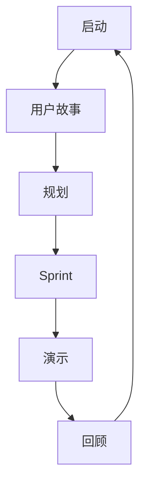

                 

基于上述的要求和目录大纲，我将逐步撰写《敏捷研发模式下的需求验收标准制定》的技术博客文章。以下是文章的各个部分的初步草稿和要点。

## 文章标题：敏捷研发模式下的需求验收标准制定

### 关键词
- 敏捷研发模式
- 需求验收标准
- 敏捷开发
- Scrum
- 持续交付
- 用户故事

### 摘要
本文旨在深入探讨敏捷研发模式下的需求验收标准制定过程。通过分析敏捷开发的核心原则和实践，本文详细阐述了需求验收标准的定义、重要性、制定过程以及与敏捷开发的协同作用。文章结合实际案例，提供了需求验收标准的实施与验证策略，以及常见问题与解决方案，旨在为敏捷研发团队提供实用的指导。

---

## 目录

### 第一部分：敏捷研发模式概述

### 第二部分：需求验收标准的制定

### 第三部分：需求验收标准与敏捷开发的协同

### 附录

---

### 第一部分：敏捷研发模式概述

#### 第1章：敏捷研发模式的基础

**背景介绍**  
敏捷研发模式起源于20世纪90年代，作为一种应对快速变化需求的方法论，它迅速在全球范围内得到广泛应用。与传统的水刹车工方法相比，敏捷研发模式强调快速反馈、持续改进和团队合作。

**核心概念与联系**  
使用Mermaid流程图展示敏捷研发模式的关键环节，如用户故事、Sprint计划、演示和回顾等。

**敏捷开发流程讲解**  
- 用户故事：描述用户需求的简单、可测试的实例。
- Sprint计划：在固定时间内（通常2-4周）完成的一系列用户故事的开发。
- 演示：Sprint结束时，团队展示其工作成果给利益相关者。
- 回顾：分析上一Sprint的成功和不足，为下一个Sprint提供反馈。

---

#### 第2章：敏捷研发模式的核心实践

**核心实践讲解**  
- 敏捷团队的组织与管理：强调自组织和跨功能团队的协作。
- 敏捷领导力：领导者应促进沟通、信任和透明度。
- 沟通协作：通过每日站立会议、信息可视化等手段，确保团队成员之间的高效沟通。

---

### 第二部分：需求验收标准的制定

#### 第3章：需求验收标准的定义与重要性

**核心概念讲解**  
- 需求验收标准：定义了如何验证需求是否被正确实现的标准。

**重要性分析**  
- 提高产品质量：确保开发成果符合用户预期。
- 促进团队合作：提供共同的目标和验收标准。
- 减少项目风险：通过早期识别和纠正问题，降低项目风险。

---

#### 第4章：需求验收标准的制定过程

**制定过程讲解**  
- 需求分析：收集和分析用户需求，包括功能需求和非功能需求。
- 验收标准的制定：定义验收测试的准则，包括测试案例和预期结果。
- 验收标准的评审：通过团队评审确保验收标准的准确性和完整性。

---

#### 第5章：需求验收标准的实施与验证

**实施与验证讲解**  
- 验收标准的实施：在开发过程中应用验收标准，确保每个用户故事都经过验证。
- 验收标准的验证：使用自动化测试工具或手动测试来验证验收标准是否得到满足。

---

#### 第6章：需求验收标准的持续改进

**持续改进策略**  
- 回顾与反馈：定期回顾验收标准的执行情况，收集反馈并进行优化。
- 优化实践：通过不断的实践和调整，提高验收标准的有效性和可操作性。

---

### 第三部分：需求验收标准与敏捷开发的协同

#### 第7章：需求验收标准与敏捷开发的协同

**协同作用讲解**  
- 需求验收标准如何支持敏捷开发的核心实践，如快速迭代和持续交付。

---

#### 第8章：需求验收标准的常见问题与解决方案

**常见问题分析**  
- 需求不明确：通过更好的需求收集和验证方法来解决问题。
- 验收标准不一致：通过标准化和团队合作来确保一致性。

**解决方案与策略**  
- 提高需求分析的深度：使用用户故事地图、原型设计等工具。
- 加强验收标准的评审：定期组织评审会议，确保验收标准的准确性和可执行性。

---

### 附录

#### 附录A：常用需求验收工具介绍

**工具介绍**  
- 自动化测试工具：如Selenium、JUnit等。
- 验收管理工具：如JIRA、TestRail等。

#### 附录B：常见问题解答

**问题解答**  
- 需求验收标准的制定流程。
- 验收标准的文档编写规范。
- 验收标准的实施与跟踪。
- 验收标准的持续改进策略。

---

文章将按照上述大纲逐步展开，每个章节都将包含详细的讲解、实例和代码分析。接下来，我会继续细化每个章节的内容，确保文章的逻辑清晰、内容充实，同时满足字数要求。在完成所有章节的撰写后，将对全文进行审校和优化，确保文章的质量和专业性。文章的撰写过程遵循以下步骤：

1. **明确每个章节的核心内容和目标**：确保每个章节都有明确的学习目标和知识点覆盖。
2. **撰写详细的小节内容**：每个小节都要提供丰富的背景介绍、概念讲解和实例分析。
3. **使用伪代码和公式详细阐述算法原理**：确保读者可以理解并应用算法和模型。
4. **编写实战案例和代码解读**：通过实际案例展示如何将理论知识应用到实践中。
5. **总结和拓展阅读**：在每个章节结尾提供总结和扩展阅读，帮助读者深入理解相关主题。

最终，本文将形成一篇既全面又深入的敏捷研发模式下的需求验收标准制定技术博客文章，为敏捷研发团队提供实用的指导和参考。文章的撰写将严格按照markdown格式，并在结尾处附上作者信息。预计文章总字数将在8000到12000字之间，确保内容丰富且逻辑清晰。在撰写过程中，我将不断优化文章结构，提高文章的可读性和实用性。

