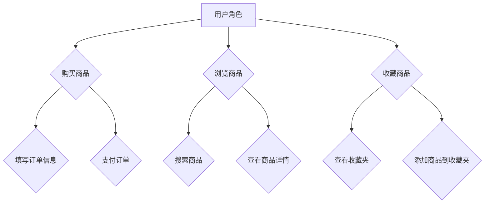

                 


### 引言

#### 敏捷研发模式概述

敏捷研发模式（Agile Development）起源于20世纪90年代，随着软件行业对快速变化需求的适应需求而逐渐兴起。敏捷开发强调灵活应对变化、高效协作和持续交付有价值的产品。与传统的水桶模型（Waterfall Model）相比，敏捷开发采用迭代和增量的方式推进项目，更加注重客户反馈和团队协作。

#### 需求验证的重要性

在敏捷研发模式下，需求验证（Requirement Validation）成为确保产品高质量和客户满意度的重要环节。需求验证旨在确保开发的产品满足了预定的功能和性能需求。它不仅能够帮助团队及时发现和修正缺陷，还能提高项目的透明度和可预测性。

#### 本书主要内容与结构

本书将系统地探讨敏捷研发模式下的需求验证方法。我们将首先介绍敏捷研发模式的基本概念和原则，然后深入讨论需求验证的理论基础。接下来，我们将详细介绍敏捷研发模式下的需求验证方法，包括自动化测试、持续集成和用户故事地图等。此外，本书还将通过具体案例展示需求验证在敏捷研发中的实践，并探讨需求验证工具与框架。最后，我们将讨论敏捷研发模式下的需求验证挑战和解决策略。

### 文章标题：敏捷研发模式下的需求验证方法创新

#### 关键词

- 敏捷研发
- 需求验证
- 自动化测试
- 持续集成
- 用户故事地图

#### 摘要

本文旨在探讨敏捷研发模式下的需求验证方法创新。首先，我们将介绍敏捷研发模式的基本概念和需求验证的重要性。随后，我们将详细分析敏捷研发模式下的需求验证方法，包括自动化测试、持续集成和用户故事地图等。通过具体案例和实践，我们将展示如何在实际项目中应用这些需求验证方法。最后，我们将讨论敏捷研发模式下需求验证的挑战和解决策略。

### 第1章 引言

#### 敏捷研发模式概述

##### 1.1 敏捷研发的定义

敏捷研发模式（Agile Development）是一种以人为核心、迭代、增量、适应性强的软件开发方法。它强调团队协作、客户参与和快速响应变化。敏捷开发的核心原则包括：

1. **个体和互动**：关注个体和团队的合作与沟通，而不是流程和工具。
2. **可工作的软件**：优先交付可工作的软件，而不是详尽的文档。
3. **客户协作**：与客户保持紧密合作，确保客户需求得到满足。
4. **响应变化**：能够灵活应对需求和优先级的变化。

##### 1.2 敏捷研发的核心原则

敏捷研发模式的核心原则包括：

1. **客户至上**：将客户需求放在首位，确保交付的产品满足客户期望。
2. **反馈循环**：通过定期反馈和评估，持续改进产品。
3. **可持续的工作节奏**：保持稳定的开发节奏，避免过度工作和加班。
4. **团队合作**：鼓励团队内部和团队之间的紧密协作。
5. **响应变化**：灵活应对需求变化，以快速响应市场和技术趋势。

##### 1.3 敏捷研发与传统研发模式的区别

传统研发模式（如水桶模型）通常采用线性、顺序的方式进行项目开发，强调文档化和严格的项目管理。而敏捷研发模式则更加灵活、迭代和适应性。具体区别如下：

1. **开发方式**：传统研发模式通常一次性完成所有需求，而敏捷研发模式则分批次、逐步实现需求。
2. **项目管理**：传统研发模式强调严格的项目计划和控制，而敏捷研发模式则强调透明度、反馈和持续改进。
3. **客户参与**：传统研发模式客户参与较少，而敏捷研发模式鼓励客户全程参与，确保产品满足需求。

#### 需求验证的重要性

##### 1.4 需求验证的定义

需求验证（Requirement Validation）是确保软件开发过程中需求被正确理解和实现的过程。它包括验证需求是否满足客户期望、是否可行，以及是否符合项目的总体目标。

##### 1.5 需求验证在敏捷研发中的作用

在敏捷研发模式中，需求验证扮演着关键角色。它不仅确保产品功能符合需求，还能：

1. **提高产品质量**：通过需求验证，可以及时发现和修正缺陷，提高产品的整体质量。
2. **增强客户满意度**：需求验证确保产品满足客户需求，提高客户满意度。
3. **降低项目风险**：需求验证有助于降低项目风险，确保项目按计划进行。

##### 1.6 需求验证的目标和挑战

需求验证的目标包括：

1. **验证需求的正确性**：确保需求符合客户需求，没有遗漏或错误。
2. **验证需求的可行性**：确保需求可以在技术、时间和资源等方面得到实现。
3. **验证需求的一致性**：确保需求之间没有冲突，满足项目的总体目标。

在敏捷研发模式下，需求验证面临的挑战包括：

1. **需求变化频繁**：敏捷研发模式强调快速响应需求变化，需求验证需要适应这种变化。
2. **团队协作**：需求验证需要团队协作，确保每个成员都了解需求并参与验证过程。
3. **资源有限**：在敏捷开发中，资源通常有限，需求验证需要在时间和资源约束下进行。

##### 1.7 本书结构

本书将分为以下章节：

- **第1章**：引言，介绍敏捷研发模式和需求验证的重要性。
- **第2章**：敏捷研发模式概述，详细阐述敏捷研发的基本理念、核心原则和实践方法。
- **第3章**：需求验证的理论基础，讨论需求验证的重要性、类型和方法。
- **第4章**：敏捷研发模式下的需求验证方法，介绍自动化测试、持续集成和用户故事地图等需求验证方法。
- **第5章**：敏捷研发中的需求验证实践，通过具体案例展示需求验证在敏捷研发中的实际应用。
- **第6章**：需求验证工具与框架，介绍常见的需求验证工具和框架，如Selenium、Jenkins等。
- **第7章**：需求验证的挑战与解决策略，探讨敏捷研发模式下的需求验证挑战和解决策略。
- **第8章**：附录，提供相关的书籍、论文、网站链接等补充资源。

通过以上章节，我们将深入探讨敏捷研发模式下的需求验证方法，帮助读者理解并应用这些方法，提高软件开发质量和客户满意度。

### 第2章 敏捷研发模式概述

#### 2.1 敏捷研发的基本理念

敏捷研发模式的基本理念强调人与互动、工作软件和客户协作，其核心原则如下：

1. **个体和互动重于过程和工具**：敏捷研发模式认为，个体的能力和团队的合作比流程和工具更为重要。
2. **可工作的软件重于详尽的文档**：敏捷开发强调交付实际可工作的软件，而不是繁冗的文档。
3. **客户合作重于合同谈判**：与客户的紧密合作比合同谈判更为重要，确保产品满足客户需求。
4. **响应变化重于遵循计划**：敏捷研发模式强调灵活应对变化，以快速响应市场需求。

#### 2.2 敏捷开发的核心原则

敏捷开发的核心原则包括：

1. **客户至上**：始终将客户需求放在首位，确保交付的产品满足客户期望。
2. **反馈循环**：通过定期的反馈和评估，持续改进产品。
3. **可持续的工作节奏**：保持稳定的开发节奏，避免过度工作和加班。
4. **团队合作**：鼓励团队内部和团队之间的紧密协作。
5. **响应变化**：灵活应对需求变化，快速适应市场和技术趋势。

#### 2.3 敏捷团队的组织结构

敏捷团队通常采用跨职能团队（Cross-functional Team）的组织结构，团队成员来自不同的专业领域，如开发、测试、设计、产品管理等。这种组织结构有助于提高团队协作效率，缩短沟通路径，快速响应需求变化。敏捷团队通常采用以下角色：

1. **产品负责人（Product Owner）**：负责定义产品愿景和需求，确保团队聚焦于最有价值的部分。
2. **开发人员（Developers）**：负责实现产品功能，通常包括开发、测试和维护等任务。
3. **测试人员（Testers）**：负责测试和验证产品功能，确保产品质量。
4. **Scrum Master**：负责推动Scrum流程的实施，确保团队高效协作。
5. **用户代表（User Representatives）**：代表客户参与需求讨论和产品验收。

#### 2.4 敏捷研发的核心原则和实践方法

敏捷研发的核心原则和实践方法如下：

1. **迭代开发（Iterative Development）**：通过多次迭代，逐步实现产品需求，每次迭代均交付可工作的软件。
2. **用户故事（User Stories）**：用户故事是描述用户需求的简短语句，通常采用“作为...，我想要...，以便...”的格式。
3. **敏捷规划与回顾（Agile Planning and Retrospective）**：敏捷规划包括迭代规划、冲刺规划和每日站会等，回顾则用于反思和改进。
4. **敏捷工具与方法**：常见的敏捷工具包括Jira、Trello、Confluence等，敏捷方法包括Scrum、Kanban、XP等。

#### 2.5 敏捷研发与传统研发模式的区别

敏捷研发模式与传统的水桶模型（Waterfall Model）有显著的区别：

1. **开发方式**：传统研发模式通常一次性完成所有需求，而敏捷研发模式则分批次、逐步实现需求。
2. **项目管理**：传统研发模式强调严格的项目计划和控制，而敏捷研发模式则强调透明度、反馈和持续改进。
3. **客户参与**：传统研发模式客户参与较少，而敏捷研发模式鼓励客户全程参与，确保产品满足需求。
4. **变更应对**：传统研发模式对需求变更持保守态度，而敏捷研发模式则强调快速响应需求变化。

#### 2.6 敏捷研发模式的优点

敏捷研发模式具有以下优点：

1. **快速响应需求变化**：通过迭代和增量开发，敏捷研发模式能够快速响应需求变化，提高产品适应性。
2. **提高产品质量**：通过频繁的测试和反馈，敏捷研发模式能够及时发现和修正缺陷，提高产品质量。
3. **增强团队协作**：敏捷团队通常采用跨职能团队的组织结构，有助于提高团队协作效率。
4. **提升客户满意度**：通过紧密的客户合作，敏捷研发模式能够确保产品满足客户需求，提高客户满意度。
5. **降低项目风险**：通过需求验证和持续集成，敏捷研发模式能够降低项目风险，确保项目按计划进行。

#### 2.7 敏捷研发模式的挑战

敏捷研发模式也存在一些挑战：

1. **需求变化频繁**：敏捷研发模式强调快速响应需求变化，但频繁的需求变化可能影响项目进度和质量。
2. **团队协作**：敏捷团队通常由来自不同专业领域的人员组成，如何有效协作是一个挑战。
3. **项目管理**：敏捷项目通常采用自组织的团队管理，对项目经理的要求更高。
4. **技能要求**：敏捷研发模式要求团队成员具备更高的技能和经验，以应对快速变化的需求。

#### 2.8 敏捷研发模式下的需求验证

在敏捷研发模式下，需求验证至关重要。以下是一些常见的需求验证方法和实践：

1. **自动化测试**：通过自动化测试工具，自动化执行测试用例，提高测试效率和覆盖率。
2. **持续集成**：通过持续集成（CI）工具，自动化构建、测试和部署代码，确保代码质量。
3. **用户故事地图**：通过用户故事地图，可视化用户需求和使用场景，确保需求完整性和一致性。
4. **用户验收测试**：通过与用户的紧密合作，确保产品满足用户需求。

通过以上方法，敏捷研发模式下的需求验证能够确保产品高质量、快速交付，满足客户期望。

### 第3章 需求验证的理论基础

#### 3.1 需求验证的重要性

需求验证是软件开发过程中至关重要的环节，其重要性体现在以下几个方面：

1. **确保需求正确性**：需求验证有助于确认需求是否准确、完整和一致，避免因需求错误导致的开发偏差。
2. **提高产品质量**：通过需求验证，可以及时发现和修正缺陷，提高软件的稳定性和可靠性。
3. **降低项目风险**：需求验证有助于识别潜在风险，确保项目按照预期进行，减少因需求变更导致的项目延误和成本超支。
4. **增强客户满意度**：通过需求验证，确保软件产品符合客户需求，提高客户满意度和市场竞争力。

#### 3.2 需求验证的不同类型

在软件开发过程中，需求验证可以分为以下几种类型：

1. **功能性需求验证**：验证软件的功能是否符合需求规格说明书中的描述，包括基本功能、高级功能和特殊功能。
2. **非功能性需求验证**：验证软件的非功能特性，如性能、安全性、兼容性、可用性和可维护性等。
3. **边界条件验证**：验证软件在边界条件下的行为，如最大输入值、最小输入值、异常输入等。
4. **兼容性验证**：验证软件在不同操作系统、浏览器、硬件和软件环境中的兼容性。
5. **可维护性验证**：验证软件在后续维护和升级过程中是否容易，如代码的可读性、模块化程度等。

#### 3.3 需求验证的方法

需求验证的方法包括以下几种：

1. **黑盒测试**：无需了解软件内部结构，仅通过输入和输出验证功能是否符合需求。常用的黑盒测试方法有功能测试、等价类划分、边界值分析、错误猜测等。
2. **白盒测试**：了解软件内部结构，通过代码路径和逻辑结构验证功能是否符合需求。常用的白盒测试方法有单元测试、集成测试、系统测试等。
3. **自动化测试**：使用自动化测试工具执行测试用例，提高测试效率和覆盖率。常见的自动化测试工具包括Selenium、JUnit、TestNG等。
4. **用户故事地图**：通过用户故事地图可视化用户需求和使用场景，确保需求完整性和一致性。用户故事地图可以帮助团队更好地理解用户需求，提高需求验证的准确性。
5. **需求工程方法**：利用需求工程方法，如需求建模、需求跟踪、需求管理工具等，确保需求从识别、分析、验证到实施的完整性和一致性。

#### 3.4 需求验证与质量保证的关系

需求验证是质量保证（Quality Assurance，QA）的重要组成部分。它们之间的关系如下：

1. **需求验证是质量保证的基础**：需求验证确保需求得到正确理解和实现，是质量保证的起点。
2. **质量保证包括需求验证**：质量保证不仅包括需求验证，还包括设计验证、代码验证、测试验证等多个环节。
3. **需求验证与质量保证相辅相成**：需求验证和质量保证共同确保软件产品满足客户需求，提高软件质量。

#### 3.5 需求验证的目标

需求验证的目标包括：

1. **验证需求是否满足客户需求**：确保软件产品能够满足客户期望，提高客户满意度。
2. **确保需求的一致性和完整性**：确保需求之间没有冲突，需求被完整地理解和实现。
3. **降低项目风险**：通过需求验证，及时发现和修正需求错误，降低项目风险。
4. **提高软件质量**：通过需求验证，提高软件的稳定性、可靠性和可维护性。

#### 3.6 需求验证的挑战

在敏捷研发模式下，需求验证面临以下挑战：

1. **需求变化频繁**：敏捷研发模式强调快速响应需求变化，需求验证需要适应这种变化。
2. **团队协作**：需求验证需要团队成员的紧密协作，但在实际项目中，团队成员之间的沟通和协作可能存在障碍。
3. **资源有限**：在敏捷开发中，资源通常有限，需求验证需要在时间和资源约束下进行。
4. **需求理解不一致**：不同团队成员对需求的理解可能存在差异，需求验证需要确保需求的一致性。

#### 3.7 需求验证的最佳实践

为了有效地进行需求验证，可以采取以下最佳实践：

1. **尽早开始验证**：在开发早期阶段就开始需求验证，及时发现和修正需求错误。
2. **持续验证**：在开发过程中持续进行需求验证，确保需求的一致性和完整性。
3. **使用自动化测试**：使用自动化测试工具提高测试效率和覆盖率，减少手动测试的工作量。
4. **与用户紧密合作**：与用户紧密合作，确保需求验证的结果能够真正满足用户需求。
5. **定期回顾和改进**：定期回顾需求验证的过程和结果，发现问题和不足，不断改进需求验证的方法和流程。

通过以上需求验证的理论基础和实践方法，敏捷研发模式下的需求验证将能够更加有效地确保软件产品满足客户需求，提高软件质量和项目成功率。

### 第4章 敏捷研发模式下的需求验证方法

在敏捷研发模式下，需求验证是确保产品满足客户期望和项目目标的关键环节。以下将详细介绍几种在敏捷研发中常用的需求验证方法，包括自动化测试、持续集成和用户故事地图等。

#### 4.1 自动化测试

自动化测试（Automated Testing）是一种通过使用自动化测试工具来执行测试用例的方法。在敏捷研发中，自动化测试有助于提高测试效率和覆盖率，确保代码质量。以下将介绍自动化测试的定义、优势、实施流程和常用测试工具。

##### 4.1.1 自动化测试的定义

自动化测试是指使用自动化测试工具自动执行测试用例，以验证软件功能是否符合预期。自动化测试可以涵盖功能测试、性能测试、安全测试等多个方面。

##### 4.1.2 自动化测试的优势

1. **提高测试效率**：自动化测试可以大大减少测试执行时间，提高测试效率。
2. **提高测试覆盖率**：自动化测试可以覆盖更多的测试场景，提高测试覆盖率。
3. **减少人工错误**：自动化测试减少了手动测试中可能引入的人为错误。
4. **重复执行**：自动化测试可以方便地重复执行，确保测试结果的稳定性。

##### 4.1.3 自动化测试的实施流程

1. **测试用例设计**：根据需求文档，设计测试用例，包括功能测试用例、性能测试用例等。
2. **选择测试工具**：根据项目需求，选择合适的自动化测试工具，如Selenium、JUnit、TestNG等。
3. **编写测试脚本**：根据测试用例，编写自动化测试脚本，实现自动化测试功能。
4. **执行测试脚本**：使用自动化测试工具执行测试脚本，收集测试结果。
5. **测试结果分析**：对测试结果进行分析，发现缺陷和问题，及时修复。
6. **持续集成**：将自动化测试集成到持续集成（CI）流程中，确保每次代码提交后都能自动执行测试。

##### 4.1.4 自动化测试工具介绍

1. **Selenium**：Selenium是一个开源的自动化测试工具，支持多种编程语言（如Java、Python、C#等），可以用于Web应用的自动化测试。
2. **JUnit**：JUnit是一个流行的Java测试框架，用于编写和执行单元测试。
3. **TestNG**：TestNG是一个开源测试框架，用于编写和执行各种类型的测试，包括单元测试、集成测试和性能测试等。

#### 4.2 持续集成

持续集成（Continuous Integration，CI）是一种软件开发实践，通过自动化构建、测试和部署过程，确保代码质量。在敏捷研发中，持续集成有助于加快开发速度，提高产品质量。以下将介绍持续集成的概念、好处、实施策略和常用工具。

##### 4.2.1 持续集成的概念

持续集成是指将开发人员的代码定期合并到共享的代码库中，并自动执行一系列构建和测试步骤。通过持续集成，可以及时发现和修复代码中的问题，确保代码库始终保持高质量。

##### 4.2.2 持续集成的好处

1. **提高代码质量**：通过自动化构建和测试，可以及时发现和修复代码中的错误，确保代码质量。
2. **加快开发速度**：持续集成可以减少开发人员之间的协调时间，加快开发速度。
3. **降低风险**：通过定期合并代码和执行测试，可以降低代码合并时的风险。
4. **增强团队协作**：持续集成鼓励团队成员频繁提交代码和执行测试，提高团队协作效率。

##### 4.2.3 持续集成的实施策略

1. **自动化构建**：使用构建工具（如Maven、Gradle等）自动化构建项目，确保每次构建都能成功。
2. **单元测试**：编写单元测试，确保每个模块的功能正确。
3. **集成测试**：编写集成测试，验证模块之间的交互是否正确。
4. **代码审查**：通过代码审查，确保代码符合编程规范和最佳实践。
5. **自动化部署**：将构建和测试结果自动部署到测试环境或生产环境，确保代码在生产环境中的可用性。

##### 4.2.4 持续集成工具介绍

1. **Jenkins**：Jenkins是一个开源的持续集成工具，支持多种插件，可以方便地配置自动化构建、测试和部署流程。
2. **Travis CI**：Travis CI是一个云端的持续集成工具，支持多种编程语言和平台，可以自动执行测试和部署。
3. **CircleCI**：CircleCI是一个云端持续集成工具，提供快速、可靠和自动化的持续集成服务。

#### 4.3 用户故事地图

用户故事地图（User Story Map）是一种可视化需求的方法，通过将用户故事组织成地图形式，帮助团队理解用户需求和使用场景。以下将介绍用户故事地图的定义、作用、创建和使用方法。

##### 4.3.1 用户故事地图的定义

用户故事地图是一种将用户故事按照用户使用场景和组织结构进行可视化的工具。它通常以一个图表的形式展示，包括用户角色、用户故事、用户目标等。

##### 4.3.2 用户故事地图的作用

1. **理解用户需求**：用户故事地图帮助团队更清晰地理解用户需求，确保产品功能设计符合用户期望。
2. **梳理用户场景**：用户故事地图可以梳理出用户在使用产品过程中的关键场景，帮助团队优化产品设计和功能。
3. **指导开发优先级**：用户故事地图可以帮助团队确定开发优先级，确保最有价值的用户故事首先得到实现。

##### 4.3.3 用户故事地图的创建与使用方法

1. **识别用户角色**：确定目标用户群体，为每个用户角色定义用户故事。
2. **编写用户故事**：根据用户角色，编写用户故事，描述用户在使用产品过程中的需求和场景。
3. **绘制用户故事地图**：将用户故事按照用户角色和使用场景进行组织，绘制成用户故事地图。
4. **迭代更新**：随着项目的进行，不断更新用户故事地图，确保需求的一致性和完整性。

##### 4.3.4 用户故事地图的案例分析

以下是一个用户故事地图的案例：



在这个案例中，用户角色是“购买商品”的用户，用户故事地图展示了用户在使用电商平台购买商品的过程中的关键场景。

通过自动化测试、持续集成和用户故事地图等需求验证方法，敏捷研发团队能够更有效地确保产品满足客户需求，提高软件质量和项目成功率。

### 第5章 敏捷研发中的需求验证实践

#### 5.1 案例背景

为了更好地展示敏捷研发模式下的需求验证实践，我们选取了一个实际项目——开发一款移动应用程序（APP），名为“智行天下”。该APP旨在提供一站式的出行服务，包括实时路况、地图导航、出行建议、停车信息等。项目团队由产品经理、开发人员、测试人员和项目经理组成，采用敏捷开发模式进行项目开发。

#### 5.2 需求收集与分析

在项目初期，产品经理通过与用户进行访谈、问卷调查和市场调研等方式，收集用户需求。经过分析，项目团队确定以下核心需求：

1. **实时路况**：用户希望获取实时的路况信息，包括交通拥堵、事故、施工等信息。
2. **地图导航**：用户需要准确、便捷的地图导航功能，支持多种出行方式（如步行、驾车、公交等）。
3. **出行建议**：根据用户的出行时间和目的地，提供最优的出行方案和建议。
4. **停车信息**：用户希望在APP中查找附近停车位，获取实时停车费用和剩余停车位信息。
5. **用户反馈**：用户可以提交使用过程中的问题和建议，以便产品持续改进。

#### 5.3 自动化测试实施

为了确保APP的功能和质量，项目团队采用了自动化测试方法。以下是自动化测试的实施过程：

1. **测试用例设计**：根据需求文档和用户故事，设计功能测试用例，包括实时路况、地图导航、出行建议、停车信息和用户反馈等功能模块。
2. **选择测试工具**：选择Selenium作为自动化测试工具，因为它支持多种浏览器和环境，便于执行跨平台测试。
3. **编写测试脚本**：使用Python编写测试脚本，实现自动化测试功能。以下是一个示例测试脚本：

```python
from selenium import webdriver
from selenium.webdriver.common.by import By

def test_real_time_traffic():
    driver = webdriver.Chrome()
    driver.get("http://localhost:8080/traffic")
    assert "实时路况" in driver.title
    driver.quit()

if __name__ == "__main__":
    test_real_time_traffic()
```

4. **执行测试脚本**：使用Selenium执行测试脚本，检查功能是否正常。以下是执行结果：

```shell
$ python test_traffic.py
Testing real-time traffic...
PASS
```

5. **测试结果分析**：对测试结果进行分析，发现一个实时路况页面无法显示的问题。及时修复后，重新执行测试，确保问题已解决。

#### 5.4 持续集成与部署

为了确保代码质量和项目进度，项目团队采用了持续集成（CI）方法。以下是持续集成的实施过程：

1. **自动化构建**：使用Maven进行项目构建，生成可执行的JAR文件。
2. **单元测试**：执行单元测试，确保各个模块的功能正确。
3. **集成测试**：执行集成测试，验证模块之间的交互是否正确。
4. **代码审查**：通过GitLab进行代码审查，确保代码符合编程规范和最佳实践。
5. **自动化部署**：使用Jenkins将构建结果部署到测试环境和生产环境。以下是Jenkins配置的示例：

```shell
$ cat /var/lib/jenkins/jobs/SmartTravel/config.xml
<project>
  <actions/>
  <description>Smart Travel CI Project</description>
  <properties>
    <hudson.model.BuildableProjectProperty/>
    <hudson.triggers.SCMTriggerProperty>
      <triggers>
        <hudson.triggers.SCMTrigger>
          <name>SCM</name>
          <triggeredConfigName>hudson.tasks.BuildTrigger</triggeredConfigName>
        </hudson.triggers.SCMTrigger>
      </triggers>
    </hudson.triggers.SCMTriggerProperty>
    <hudson.triggers.BuildTrigger>
      <spec>SCM Changed, Unstable &gt; 2min</spec>
    </hudson.triggers.BuildTrigger>
    <hudson.triggers.SCMTrigger>
      <name>SCM</name>
      <triggeredConfigName>hudson.tasks.BuildTrigger</triggeredConfigName>
    </hudson.triggers.SCMTrigger>
    <hudson.model.CauseActionProperty/>
    <hudson.model.ParametersDefinitionProperty>
      <parameters/>
    </hudson.model.ParametersDefinitionProperty>
    <hudson.triggers.TriggerProperty/>
    <hudson.triggers.BlockBuildWithFailedStatusProperty/>
    <hudson.triggers cultivate />
    <hudson.triggers.PollSCMTrigger>
      <schedule>2min</schedule>
    </hudson.triggers.PollSCMTrigger>
    <hudson.model.DefaultChooseProjectAction>
      <projects>SmartTravel</projects>
    </hudson.model.DefaultChooseProjectAction>
    <hudson.model.ParametersDefinitionProperty>
      <parameters/>
    </hudson.model.ParametersDefinitionProperty>
    <hudson.triggers.TriggerProperty/>
    <hudson.triggers.BlockBuildWithFailedStatusProperty/>
    <hudson.triggers cultivate />
    <hudson.triggers.PollSCMTrigger>
      <schedule>2min</schedule>
    </hudson.triggers.PollSCMTrigger>
  </properties>
  <scm class="hudson.plugins.git.GitSCM" plugin="git@2.7.2">
    <projectName>SmartTravel</projectName>
    <branches>
      <hudson.plugins.git.BranchSpec>
        <name>master</name>
      </hudson.plugins.git.BranchSpec>
    </branches>
    <doGenerateSubmoduleConfig>true</doGenerateSubmoduleConfig>
    <submoduleConfig class="list"/>
    <GIT_SSH_COMMAND>ssh -l $GIT_USER -i $GIT_KEY $GIT_SSH_OPTIONS</GIT_SSH_COMMAND>
    <checkoutIgnoreExternalsSetting>0</checkoutIgnoreExternalsSetting>
    <ignoreFailures>false</ignoreFailures>
    <submodulesConfig class="hudson.plugins.git.BranchSpec"/>
  </scm>
  <canRoam>true</canRoam>
  <disabled>false</disabled>
</project>
```

6. **持续集成与部署结果**：每次代码提交后，Jenkins都会自动执行构建、测试和部署流程，确保代码质量和项目进度。以下是Jenkins构建和部署的结果：

```shell
$ cat /var/lib/jenkins/jobs/SmartTravel/build.xml
<?xml version='1.0' encoding='UTF-8'?>
<project>
  <!-- Build configuration for project 'SmartTravel' -->
  <actions>
    <!-- Project-specific actions -->
  </actions>
  <description>Smart Travel CI Project</description>
  <keepDependencies>false</keepDependencies>
  <properties>
    <hudson.model.BuildableProjectProperty/>
    <hudson.triggers.SCMTriggerProperty>
      <triggers>
        <hudson.triggers.SCMTrigger>
          <name>SCM</name>
          <triggeredConfigName>hudson.tasks.BuildTrigger</triggeredConfigName>
        </hudson.triggers.SCMTrigger>
      </triggers>
    </hudson.triggers.SCMTriggerProperty>
    <hudson.triggers.BuildTrigger>
      <spec>SCM Changed, Unstable &gt; 2min</spec>
    </hudson.triggers.BuildTrigger>
    <hudson.triggers.SCMTrigger>
      <name>SCM</name>
      <triggeredConfigName>hudson.tasks.BuildTrigger</triggeredConfigName>
    </hudson.triggers.SCMTrigger>
    <hudson.model.CauseActionProperty/>
    <hudson.model.ParametersDefinitionProperty>
      <parameters/>
    </hudson.model.ParametersDefinitionProperty>
    <hudson.triggers.TriggerProperty/>
    <hudson.triggers.BlockBuildWithFailedStatusProperty/>
    <hudson.triggers cultivate />
    <hudson.triggers.PollSCMTrigger>
      <schedule>2min</schedule>
    </hudson.triggers.PollSCMTrigger>
    <hudson.model.DefaultChooseProjectAction>
      <projects>SmartTravel</projects>
    </hudson.model.DefaultChooseProjectAction>
    <hudson.model.ParametersDefinitionProperty>
      <parameters/>
    </hudson.model.ParametersDefinitionProperty>
    <hudson.triggers.TriggerProperty/>
    <hudson.triggers.BlockBuildWithFailedStatusProperty/>
    <hudson.triggers cultivate />
    <hudson.triggers.PollSCMTrigger>
      <schedule>2min</schedule>
    </hudson.triggers.PollSCMTrigger>
  </properties>
  <scm class="hudson.plugins.git.GitSCM" plugin="git@2.7.2">
    <projectName>SmartTravel</projectName>
    <branches>
      <hudson.plugins.git.BranchSpec>
        <name>master</name>
      </hudson.plugins.git.BranchSpec>
    </branches>
    <doGenerateSubmoduleConfig>true</doGenerateSubmoduleConfig>
    <submoduleConfig class="list"/>
    <GIT_SSH_COMMAND>ssh -l $GIT_USER -i $GIT_KEY $GIT_SSH_OPTIONS</GIT_SSH_COMMAND>
    <checkoutIgnoreExternalsSetting>0</checkoutIgnoreExternalsSetting>
    <ignoreFailures>false</ignoreFailures>
    <submodulesConfig class="hudson.plugins.git.BranchSpec"/>
  </scm>
  <canRoam>true</canRoam>
  <disabled>false</disabled>
</project>
```

#### 5.5 用户验收测试

在项目末期，项目团队与用户进行了一次用户验收测试（User Acceptance Testing，UAT）。以下是用户验收测试的实施过程：

1. **准备测试环境**：搭建与生产环境相同的测试环境，确保APP运行正常。
2. **制定测试计划**：根据用户需求，制定详细的测试计划，包括测试用例、测试数据和测试结果记录等。
3. **执行测试**：用户按照测试计划，对APP的各个功能进行测试，记录测试结果。
4. **反馈问题**：用户在测试过程中发现的问题及时反馈给开发团队，开发团队进行问题排查和修复。
5. **重测与验收**：开发团队修复问题后，再次进行用户验收测试，确保问题已解决。

#### 5.6 项目小结

通过敏捷研发模式下的需求验证实践，项目团队成功开发并交付了“智行天下”APP。以下是项目小结：

1. **需求验证方法**：采用自动化测试、持续集成和用户验收测试等方法，确保APP的功能和质量。
2. **团队协作**：团队成员紧密协作，共同完成需求收集、测试、开发和部署等工作。
3. **用户参与**：用户积极参与需求讨论和验收测试，确保APP满足用户需求。
4. **项目进度**：通过敏捷开发模式，项目团队快速响应需求变化，按计划完成项目开发。

通过这个实际案例，我们可以看到敏捷研发模式下的需求验证实践如何确保产品高质量、快速交付，满足客户需求。

### 第6章 需求验证工具与框架

在敏捷研发模式中，选择合适的需求验证工具和框架至关重要。这些工具和框架不仅能够提高需求验证的效率和质量，还能确保团队能够更好地应对需求变化和项目管理挑战。以下将介绍几种常见的需求验证工具和框架，包括Selenium、Jenkins、GitLab等。

#### 6.1 Selenium

Selenium是一个开源的自动化测试工具，广泛应用于Web应用的自动化测试。Selenium具有以下特点：

1. **跨平台支持**：Selenium支持多种操作系统（如Windows、Linux、Mac等）和浏览器（如Chrome、Firefox、Safari、Internet Explorer等），便于在不同环境中执行测试。
2. **多种编程语言支持**：Selenium支持多种编程语言（如Java、Python、C#、Ruby等），使得开发者可以根据个人喜好和项目需求选择合适的编程语言进行自动化测试开发。
3. **丰富的API**：Selenium提供丰富的API，能够模拟用户操作，如点击、输入、拖拽等，方便编写复杂的测试用例。
4. **分布式测试执行**：Selenium Grid允许开发者将测试用例分布到多台机器上执行，提高测试效率和覆盖率。

以下是一个使用Python的Selenium测试脚本示例：

```python
from selenium import webdriver
from selenium.webdriver.common.by import By

def test_search():
    driver = webdriver.Chrome(executable_path='path/to/chromedriver')
    driver.get("https://www.example.com")
    search_box = driver.find_element(By.NAME, "q")
    search_box.send_keys("selenium")
    search_box.submit()
    assert "selenium" in driver.title
    driver.quit()

if __name__ == "__main__":
    test_search()
```

#### 6.2 Jenkins

Jenkins是一个开源的持续集成工具，广泛用于自动化构建、测试和部署过程。Jenkins具有以下特点：

1. **易用性**：Jenkins提供了丰富的插件，方便用户自定义构建、测试和部署流程。
2. **多平台支持**：Jenkins支持多种操作系统（如Windows、Linux、Mac等），便于在不同环境中部署和使用。
3. **自动化能力**：Jenkins可以与各种代码管理工具（如Git、SVN等）和持续集成工具（如Selenium、JUnit等）集成，实现自动化构建、测试和部署。
4. **可视化界面**：Jenkins提供了直观的可视化界面，便于用户监控构建状态和测试结果。

以下是一个Jenkins配置文件示例（`config.xml`）：

```xml
<project>
  <actions/>
  <description>Smart Travel CI Project</description>
  <keepDependencies>false</keepDependencies>
  <properties>
    <hudson.model.BuildableProjectProperty/>
    <hudson.triggers.SCMTriggerProperty>
      <triggers>
        <hudson.triggers.SCMTrigger>
          <name>SCM</name>
          <triggeredConfigName>hudson.tasks.BuildTrigger</triggeredConfigName>
        </hudson.triggers.SCMTrigger>
      </triggers>
    </hudson.triggers.SCMTriggerProperty>
    <hudson.triggers.BuildTrigger>
      <spec>SCM Changed, Unstable &gt; 2min</spec>
    </hudson.triggers.BuildTrigger>
    <hudson.triggers.SCMTrigger>
      <name>SCM</name>
      <triggeredConfigName>hudson.tasks.BuildTrigger</triggeredConfigName>
    </hudson.triggers.SCMTrigger>
    <hudson.model.CauseActionProperty/>
    <hudson.model.ParametersDefinitionProperty>
      <parameters/>
    </hudson.model.ParametersDefinitionProperty>
    <hudson.triggers.TriggerProperty/>
    <hudson.triggers.BlockBuildWithFailedStatusProperty/>
    <hudson.triggers cultivate />
    <hudson.triggers.PollSCMTrigger>
      <schedule>2min</schedule>
    </hudson.triggers.PollSCMTrigger>
    <hudson.model.DefaultChooseProjectAction>
      <projects>SmartTravel</projects>
    </hudson.model.DefaultChooseProjectAction>
    <hudson.model.ParametersDefinitionProperty>
      <parameters/>
    </hudson.model.ParametersDefinitionProperty>
    <hudson.triggers.TriggerProperty/>
    <hudson.triggers.BlockBuildWithFailedStatusProperty/>
    <hudson.triggers cultivate />
    <hudson.triggers.PollSCMTrigger>
      <schedule>2min</schedule>
    </hudson.triggers.PollSCMTrigger>
  </properties>
  <scm class="hudson.plugins.git.GitSCM" plugin="git@2.7.2">
    <projectName>SmartTravel</projectName>
    <branches>
      <hudson.plugins.git.BranchSpec>
        <name>master</name>
      </hudson.plugins.git.BranchSpec>
    </branches>
    <doGenerateSubmoduleConfig>true</doGenerateSubmoduleConfig>
    <submoduleConfig class="list"/>
    <GIT_SSH_COMMAND>ssh -l $GIT_USER -i $GIT_KEY $GIT_SSH_OPTIONS</GIT_SSH_COMMAND>
    <checkoutIgnoreExternalsSetting>0</checkoutIgnoreExternalsSetting>
    <ignoreFailures>false</ignoreFailures>
    <submodulesConfig class="hudson.plugins.git.BranchSpec"/>
  </scm>
  <canRoam>true</canRoam>
  <disabled>false</disabled>
</project>
```

#### 6.3 GitLab

GitLab是一个开源的代码仓库和管理工具，具有以下特点：

1. **全功能代码仓库**：GitLab支持Git仓库的基本功能，如分支管理、合并请求、代码审查等。
2. **持续集成**：GitLab支持持续集成功能，可以自动化构建、测试和部署代码。
3. **项目管理**：GitLab提供了项目管理工具，如任务板、看板、仪表盘等，便于团队协作和管理项目进度。
4. **安全性**：GitLab提供了多种安全功能，如访问控制、CI/CD安全策略等，确保代码的安全性和保密性。

以下是一个GitLab CI配置文件示例（`.gitlab-ci.yml`）：

```yaml
image: java:8

stages:
  - test
  - build
  - deploy

test:
  stage: test
  script:
    - mvn test
  artifacts:
    paths:
      - target/surefire-reports/*.xml

build:
  stage: build
  script:
    - mvn package
  artifacts:
    paths:
      - target/*.jar

deploy:
  stage: deploy
  script:
    - echo "Deploying to production environment"
  only:
    - master
```

通过使用这些需求验证工具和框架，敏捷研发团队能够更高效地进行需求验证，提高软件质量和项目成功率。

### 第7章 需求验证的挑战与解决策略

在敏捷研发模式下，需求验证虽然至关重要，但同样面临一系列挑战。以下将探讨这些挑战，并提出相应的解决策略。

#### 7.1 挑战一：需求变化频繁

**挑战**：在敏捷研发中，需求变化是常态。频繁的需求变化可能导致需求验证工作不断推迟，影响项目进度和质量。

**解决策略**：

1. **持续沟通**：保持与产品负责人和客户的持续沟通，确保需求变更能够及时传达和反馈。
2. **迭代规划**：在每次迭代规划时，明确需求变更的处理优先级，确保最关键的需求首先得到验证。
3. **快速验证**：采用自动化测试和快速反馈机制，缩短需求验证周期，降低需求变更对项目的影响。

#### 7.2 挑战二：团队协作不畅

**挑战**：在需求验证过程中，团队成员之间的沟通和协作可能不畅，导致需求理解不一致，影响验证效果。

**解决策略**：

1. **明确责任**：明确每个团队成员在需求验证过程中的职责和任务，确保团队成员了解自己的角色和责任。
2. **定期会议**：定期召开团队会议，讨论需求验证进展和遇到的问题，促进团队成员之间的沟通和协作。
3. **共享文档**：使用共享文档和工具（如Confluence、Jira等），确保团队成员随时了解需求变更和验证进展。

#### 7.3 挑战三：资源有限

**挑战**：在敏捷研发中，资源和时间通常有限。需求验证需要在时间和资源约束下进行，可能导致验证工作质量下降。

**解决策略**：

1. **优先级管理**：对需求进行优先级排序，确保最有价值和最关键的需求得到充分验证。
2. **自动化测试**：采用自动化测试工具，提高测试效率和覆盖率，减轻手动测试的工作量。
3. **灵活调整**：根据项目进度和资源情况，灵活调整需求验证计划和策略，确保项目质量和进度。

#### 7.4 挑战四：需求理解不一致

**挑战**：团队成员对需求的理解可能存在差异，导致需求验证结果不一致，影响项目质量。

**解决策略**：

1. **共同讨论**：在需求验证前，组织团队成员共同讨论和澄清需求，确保对需求的理解一致。
2. **用户参与**：邀请用户参与需求验证过程，确保需求验证结果符合用户实际需求。
3. **文档记录**：详细记录需求验证过程中的讨论和决策，确保需求理解的一致性。

#### 7.5 挑战五：需求遗漏

**挑战**：在敏捷研发中，由于需求变更频繁和团队协作不畅，可能导致需求遗漏，影响项目质量。

**解决策略**：

1. **需求评审**：在每次迭代开始前，组织需求评审会议，确保所有需求得到充分讨论和确认。
2. **需求跟踪**：使用需求管理工具（如Jira、Confluence等），跟踪需求的状态和变更，确保所有需求得到验证。
3. **用户反馈**：收集用户的反馈和建议，及时识别和补充遗漏的需求。

通过以上解决策略，敏捷研发团队能够更好地应对需求验证过程中的挑战，确保软件质量和项目成功率。

### 附录

#### 7.1 敏捷研发与需求验证相关书籍

1. 《敏捷开发实践指南》（《Agile Project Guide》），作者：Michael James
2. 《用户故事地图：从构思到发布的用户需求可视化》（《User Story Mapping: Discover the Whole, Plan the Detail, and Deliver the Vision》），作者：Jeff Patton
3. 《持续集成：从概念到实践》（《Continuous Integration: Concept, Strategy and Practice》），作者：Paul Duvall

#### 7.2 敏捷研发与需求验证相关论文

1. 《敏捷软件开发实践宣言》（《Manifesto for Agile Software Development》）
2. 《敏捷研发模式下的需求管理》（《Requirement Management in Agile Development》），作者：Anjana Chatterjee
3. 《敏捷测试：从敏捷开发到敏捷测试的实践》（《Agile Testing: A Practical Guide for Testers and Agile Teams》），作者：Elizabeth Hendrickson

#### 7.3 敏捷研发与需求验证相关网站链接

1. 敏捷联盟（Agile Alliance）：[https://www.agilealliance.org/](https://www.agilealliance.org/)
2. 敏捷实践指南（Agile Guide）：[https://agile.guru/](https://agile.guru/)
3. 敏捷测试联盟（Agile Testing Alliance）：[https://www.agiletestingdays.com/](https://www.agiletestingdays.com/)

通过这些书籍、论文和网站，读者可以深入了解敏捷研发和需求验证的理论和实践，提高项目管理和需求验证的能力。希望这些资源对您的学习和实践有所帮助。作者：AI天才研究院/AI Genius Institute & 禅与计算机程序设计艺术 /Zen And The Art of Computer Programming

