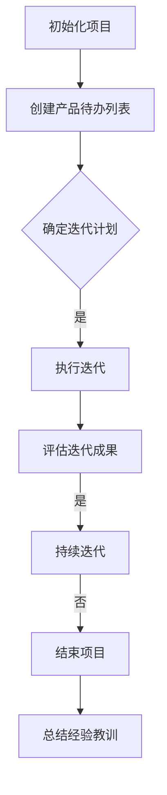

                 

### 引言与背景

在现代软件开发的快速变革中，敏捷开发已成为一种主流的开发方法论。然而，随着项目的规模和复杂度的增加，传统的敏捷开发方法逐渐暴露出其局限性。为了应对这些挑战，敏捷规模化框架（Agile Scaling Frameworks）应运而生。本文旨在探讨敏捷规模化框架在需求管理中的应用，以帮助项目团队更高效地管理需求，提升软件交付的质量。

首先，我们简要回顾一下敏捷开发的起源与发展。敏捷开发起源于20世纪90年代末，当时软件开发面临市场需求快速变化、项目延期、成本超支等问题。为了应对这些挑战，软件开发社区开始探索新的开发方法。2001年，一群软件开发专家在瑞士的圣莫里茨（St. Moritz）召开会议，形成了《敏捷软件开发宣言》（Manifesto for Agile Software Development），标志着敏捷开发的正式诞生。

随着敏捷开发的普及，越来越多的团队开始采用敏捷方法。然而，传统的敏捷开发方法主要适用于小型、简单项目。在面对大型、复杂项目时，敏捷方法往往显得力不从心。为了解决这一问题，敏捷规模化框架应运而生。敏捷规模化框架通过扩展敏捷开发的核心原则，提供了适用于不同规模和复杂度项目的解决方案。

需求管理是软件开发过程中至关重要的环节。需求管理涉及需求收集、分析、优先级排序、变更管理等多个方面。有效的需求管理有助于确保项目团队明确项目目标，减少误解和冲突，提高项目交付的效率和成功率。然而，在敏捷开发中，需求管理也面临一些挑战，如需求频繁变更、需求不明确等。

本文旨在解决以下问题：
1. 什么是敏捷规模化框架？
2. 敏捷规模化框架如何应用于需求管理？
3. 敏捷规模化框架在需求管理中带来了哪些好处和挑战？

本文结构如下：
- 引言与背景：简要介绍敏捷开发的起源与发展，以及需求管理的现状与挑战。
- 敏捷规模化框架基础：介绍敏捷规模化框架的核心原则、组件与架构。
- 需求管理理论：阐述需求管理的核心概念、方法和技术。
- 敏捷规模化需求管理实践：探讨敏捷规模化框架在需求管理中的具体应用。
- 案例分析：通过实际案例展示敏捷规模化需求管理的实践。
- 未来展望与趋势：分析敏捷规模化需求管理的未来发展趋势。

通过本文的阅读，读者将了解到敏捷规模化框架在需求管理中的应用方法，以及如何应对敏捷开发中需求管理的挑战。这不仅有助于提高项目团队的工作效率，还能提升软件交付的质量。

### 敏捷规模化框架基础

敏捷规模化框架是一种旨在扩展敏捷开发方法，以适应不同规模和复杂度项目的框架。它通过引入一系列核心原则、组件和架构，为项目团队提供了更为灵活和高效的工作方式。

#### 核心原则

敏捷规模化框架的核心原则源于《敏捷软件开发宣言》，主要包括以下四个方面：

1. **个体和互动胜过过程和工具**：强调团队成员之间的协作和沟通，认为这是成功的关键。
2. **可工作的软件胜过详尽的文档**：注重实际交付的可工作的软件，而不是过多的文档。
3. **客户合作胜过合同谈判**：与客户紧密合作，以更好地理解其需求，并快速响应变化。
4. **响应变化胜过遵循计划**：鼓励团队在面对变化时，灵活调整计划，以应对需求的变化。

#### 组件与架构

敏捷规模化框架由多个组件和架构组成，这些组件和架构共同作用，帮助团队实现高效的需求管理。

1. **Scrum**：Scrum是一种流行的敏捷开发方法，它通过迭代和增量开发，使团队能够快速响应需求变化。Scrum框架的核心组件包括产品待办列表（Product Backlog）、冲刺待办列表（Sprint Backlog）、每日站会、冲刺评审和回顾会议。

2. **Kanban**：Kanban是一种基于看板（Visual Board）的方法，用于管理项目的流程。Kanban强调可视化和持续交付，通过限制在流程中工作的任务数量（WIP），提高团队的效率和生产力。

3. **SAFe（Scaled Agile Framework）**：SAFe是一种全面的敏捷规模化框架，适用于大型、复杂项目。SAFe通过引入多个层级（如团队层、程序层、解决方案层和组织层），提供了一个系统化的方法，以协调不同团队和角色的工作。

4. **LeSS（Large-Scale Scrum）**：LeSS是一种基于Scrum的敏捷规模化框架，旨在支持多个团队的敏捷开发。LeSS通过减少冗余角色和活动，提高团队的协作和效率。

5. **DAD（Disciplined Agile Delivery）**：DAD是一种灵活的敏捷开发方法，它结合了多种敏捷实践，以适应不同项目的需求和情境。DAD通过引入一系列决策点和实践，帮助团队在敏捷开发过程中做出更好的决策。

#### Mermaid流程图

为了更好地理解敏捷规模化框架的组件和架构，我们可以使用Mermaid流程图来展示其核心流程。以下是一个简单的Mermaid流程图示例：

在这个流程图中，项目首先进行初始化，然后创建产品待办列表。接下来，团队确定迭代计划并执行迭代。在每次迭代结束后，团队会评估迭代成果，并根据评估结果决定是否继续迭代。如果项目完成，则进行总结经验教训。这个流程图展示了敏捷规模化框架的基本流程，有助于我们理解框架的运作方式。

通过了解敏捷规模化框架的基础知识，我们可以更好地应用这一框架来管理需求，提高项目的交付效率和质量。接下来，我们将探讨需求管理的核心概念和理论。

### 需求管理理论

需求管理是软件开发过程中至关重要的环节，它涉及需求的收集、分析、优先级排序、变更管理以及需求文档的编写与跟踪等多个方面。有效的需求管理有助于确保项目团队明确项目目标，减少误解和冲突，提高项目交付的效率和成功率。

#### 需求管理的核心概念

1. **需求**：需求是用户或项目发起人对系统功能、性能、可靠性等方面的期望和需求。需求可以分为功能需求和非功能需求。功能需求描述系统应具备的功能，非功能需求则描述系统的性能、安全性、可靠性等特性。

2. **需求管理**：需求管理是一种系统化的方法，用于识别、分析、记录、优先级排序、跟踪和变更管理需求。需求管理的目标是确保项目团队对需求有清晰的理解，并能根据需求进行有效的规划和交付。

3. **需求收集**：需求收集是需求管理过程中的第一步，涉及识别和获取用户和项目发起人的需求。需求收集可以通过问卷调查、用户访谈、市场调研、用户故事等方法进行。

4. **需求分析**：需求分析是对收集到的需求进行深入研究和理解的过程。需求分析的目标是确保需求是完整、一致、可实现的，并能满足用户的实际需求。

5. **需求优先级排序**：需求优先级排序是根据需求的紧急程度、重要性、风险等因素对需求进行排序。优先级排序有助于项目团队确定哪些需求应该首先实现，确保项目能够按计划交付。

6. **需求变更管理**：需求变更管理是需求管理的一个重要方面，涉及对需求变更的识别、评估、批准和实施。有效的需求变更管理可以确保需求变更不会对项目进度和预算造成不利影响。

7. **需求文档编写与跟踪**：需求文档是需求管理的核心输出，用于记录和跟踪需求的状态。需求文档包括需求规格说明书、用户故事、功能需求和非功能需求列表等。需求文档不仅用于内部沟通，还可以作为项目验收的依据。

#### 需求收集与分析

1. **需求收集方法**：

   - **问卷调查**：通过设计问卷，收集用户和项目发起人的需求。
   - **用户访谈**：直接与用户进行面对面的访谈，获取详细的需求信息。
   - **市场调研**：通过调查市场趋势和竞争产品，获取相关需求信息。
   - **用户故事**：通过编写用户故事，描述用户需求和使用场景。

2. **需求分析**：

   - **需求验证**：通过用户验证，确保需求是准确和完整的。
   - **需求建模**：使用需求建模工具，如UML类图、用例图等，对需求进行可视化表示。
   - **需求文档编写**：编写需求规格说明书，详细描述每个需求的内容、优先级和实现方法。

#### 需求优先级排序

需求优先级排序是需求管理的重要步骤，它有助于项目团队确定哪些需求应该首先实现。以下是一些常用的需求优先级排序方法：

1. **业务价值排序**：根据需求对业务价值的贡献程度进行排序，优先实现高价值需求。
2. **紧急程度排序**：根据需求的紧急程度进行排序，优先实现迫切需求。
3. **风险排序**：根据需求实现的风险程度进行排序，优先实现低风险需求。
4. **用户反馈排序**：根据用户反馈和需求热度进行排序，优先实现用户最关心的需求。

#### 需求变更管理

需求变更管理是需求管理的一个重要方面，它涉及对需求变更的识别、评估、批准和实施。以下是一些需求变更管理的最佳实践：

1. **变更请求**：建立变更请求流程，确保所有需求变更都经过正式的审核和批准。
2. **变更评估**：对需求变更的影响进行评估，包括成本、时间、资源等方面。
3. **变更审批**：建立变更审批机制，确保变更请求得到适当的评估和批准。
4. **变更实施**：根据变更审批结果，实施需求变更，并对变更的影响进行监控和控制。

#### 需求文档编写与跟踪

需求文档是需求管理的核心输出，它用于记录和跟踪需求的状态。以下是一些需求文档编写与跟踪的最佳实践：

1. **文档模板**：使用统一的需求文档模板，确保文档的结构和内容规范。
2. **版本控制**：使用版本控制工具，如Git，确保需求文档的版本管理和变更记录。
3. **需求跟踪**：使用需求跟踪工具，如Jira，跟踪需求的进展状态和变更历史。
4. **文档评审**：定期进行需求文档评审，确保文档的准确性和完整性。

通过了解需求管理的核心概念和方法，我们可以更好地管理需求，确保项目团队对需求有清晰的理解，并能根据需求进行有效的规划和交付。接下来，我们将探讨如何将敏捷规模化框架应用于需求管理。

### 敏捷规模化需求管理实践

在敏捷规模化框架中，需求管理不仅是一个关键环节，也是一个复杂的挑战。为了更有效地应用敏捷规模化框架进行需求管理，项目团队需要采用一系列具体的方法、工具和技术。以下将详细探讨敏捷规模化需求管理的具体方法、工具和技术，并介绍其工作流程。

#### 具体方法

1. **用户故事地图**：用户故事地图是一种可视化工具，用于展示用户需求、功能和目标之间的关系。它有助于团队了解整个项目的全景，并确保需求与用户目标一致。

2. **需求优先级矩阵**：需求优先级矩阵是一种用于排序需求的方法，通过将需求按照业务价值、紧急程度、风险等因素进行评估和排序。这种方法有助于团队确定哪些需求应该优先实现。

3. **需求评审会议**：需求评审会议是定期举行的需求评审活动，用于审查、讨论和批准需求。通过需求评审会议，团队能够确保需求是准确、一致和可实现的。

4. **迭代规划**：在敏捷开发中，迭代规划是一个关键步骤，用于确定在每个迭代中实现哪些需求。通过迭代规划，团队能够将需求分解为可管理的任务，并确保在预定时间内交付。

#### 工具与技术

1. **需求管理工具**：如Jira、Confluence、Asana等，用于记录、跟踪和管理需求。这些工具提供了强大的需求管理功能，包括需求创建、优先级排序、状态跟踪、版本控制等。

2. **需求建模工具**：如Rational Software Architect、Enterprise Architect等，用于创建和可视化需求模型。这些工具支持多种建模方法，如UML、BPMN等，有助于团队更好地理解需求。

3. **协作工具**：如Slack、Microsoft Teams等，用于团队沟通和协作。这些工具提供了实时的消息传递、文件共享和讨论功能，有助于团队高效地沟通和协作。

#### 工作流程

1. **需求收集**：团队通过问卷调查、用户访谈、用户故事等方法收集需求。收集到的需求将存储在需求管理工具中。

2. **需求分析**：对收集到的需求进行深入分析和验证，确保需求是完整、一致和可实现的。需求分析结果将更新到需求文档中。

3. **需求优先级排序**：使用需求优先级矩阵等方法对需求进行排序，确定哪些需求应该优先实现。排序结果将用于迭代规划和资源分配。

4. **需求评审**：定期举行需求评审会议，审查、讨论和批准需求。需求评审会议的结果将更新需求文档和需求管理工具。

5. **迭代规划**：在每次迭代开始前，团队根据需求优先级和资源情况，确定本次迭代要实现的需求。迭代规划的结果将用于指导团队的日常工作。

6. **需求跟踪**：使用需求管理工具跟踪需求的进展状态，确保需求按时交付。需求跟踪工具将记录需求的创建、更新、评审、实现和验收过程。

7. **需求变更管理**：对需求变更进行识别、评估和批准。需求变更管理流程将确保需求变更得到有效控制，并最小化对项目进度和预算的影响。

通过采用敏捷规模化框架的需求管理实践，项目团队能够更高效地管理需求，确保需求的及时交付和项目成功。接下来，我们将通过案例分析，进一步探讨敏捷规模化需求管理的实际应用。

### 案例分析

为了更好地理解敏捷规模化框架在需求管理中的实际应用，我们来看两个公司的成功案例。

#### 案例一：公司A的敏捷规模化需求管理实践

**公司背景**：公司A是一家全球知名的软件公司，专注于开发大型、复杂的软件系统。由于公司项目规模庞大，传统的需求管理方法已无法满足需求。因此，公司决定采用敏捷规模化框架进行需求管理。

**具体实施**：

1. **需求收集**：公司A采用用户访谈和市场调研相结合的方式，收集客户和市场需求。此外，他们还通过问卷调查和用户故事地图，确保需求收集的全面性和准确性。

2. **需求分析**：对收集到的需求进行详细分析，确保每个需求都是完整、一致和可实现的。公司A使用UML类图和用例图对需求进行建模，以便更好地理解需求之间的关系。

3. **需求优先级排序**：公司A使用需求优先级矩阵对需求进行排序，根据业务价值、紧急程度和风险等因素，确定哪些需求应该优先实现。

4. **需求评审**：定期举行需求评审会议，审查、讨论和批准需求。通过需求评审会议，公司A确保需求是准确、一致和可实现的。

5. **迭代规划**：在每次迭代开始前，团队根据需求优先级和资源情况，确定本次迭代要实现的需求。迭代规划的结果将用于指导团队的日常工作。

6. **需求跟踪**：公司A使用Jira进行需求管理，跟踪需求的进展状态。通过Jira，团队能够实时了解需求的创建、更新、评审、实现和验收过程。

7. **需求变更管理**：公司A建立了一套变更管理流程，对需求变更进行识别、评估和批准。确保需求变更得到有效控制，并最小化对项目进度和预算的影响。

**结果**：采用敏捷规模化框架后，公司A在需求管理方面取得了显著改进。需求交付周期缩短，需求变更得到有效控制，项目成功率大幅提升。

#### 案例二：公司B的敏捷规模化需求管理实践

**公司背景**：公司B是一家初创公司，专注于开发创新的移动应用程序。由于公司规模较小，资源有限，他们决定采用敏捷规模化框架来提高需求管理的效率。

**具体实施**：

1. **需求收集**：公司B通过用户访谈和市场调研，收集客户和市场需求。此外，他们还利用社交媒体和用户反馈渠道，及时了解用户需求。

2. **需求分析**：公司B对收集到的需求进行详细分析，确保需求是完整、一致和可实现的。他们使用用户故事地图和用例图，对需求进行可视化和建模。

3. **需求优先级排序**：公司B使用需求优先级矩阵对需求进行排序，根据用户反馈和业务价值，确定哪些需求应该优先实现。

4. **需求评审**：公司B定期举行需求评审会议，审查、讨论和批准需求。通过需求评审会议，团队确保需求是准确、一致和可实现的。

5. **迭代规划**：在每次迭代开始前，团队根据需求优先级和资源情况，确定本次迭代要实现的需求。迭代规划的结果将用于指导团队的日常工作。

6. **需求跟踪**：公司B使用Jira进行需求管理，跟踪需求的进展状态。通过Jira，团队能够实时了解需求的创建、更新、评审、实现和验收过程。

7. **需求变更管理**：公司B建立了一套变更管理流程，对需求变更进行识别、评估和批准。确保需求变更得到有效控制，并最小化对项目进度和预算的影响。

**结果**：采用敏捷规模化框架后，公司B在需求管理方面取得了显著进步。需求交付周期缩短，需求变更得到有效控制，团队协作效率提高，产品市场竞争力增强。

通过这两个案例，我们可以看到，敏捷规模化框架在需求管理中的应用确实带来了显著的好处。不仅提高了需求交付的效率，还降低了需求变更的风险，有助于项目团队更好地实现项目目标。

### 未来展望与趋势

敏捷规模化需求管理作为一种高效的需求管理方法，正在不断发展和成熟。随着软件项目的规模和复杂度的增加，以及市场需求的快速变化，敏捷规模化需求管理将继续发挥重要作用。以下是对敏捷规模化需求管理的未来展望与趋势的分析。

#### 未来发展趋势

1. **智能化需求管理**：随着人工智能技术的不断发展，未来的敏捷规模化需求管理将更加智能化。通过机器学习和数据分析，需求管理工具可以更准确地预测需求变化，自动调整需求优先级，甚至自动生成需求文档。

2. **持续集成与持续部署（CI/CD）**：敏捷规模化需求管理将更加紧密地与持续集成和持续部署相结合。通过自动化测试和部署流程，团队能够更快地响应需求变化，提高交付速度和质量。

3. **云原生需求管理**：随着云计算的普及，敏捷规模化需求管理将更加依赖于云原生架构。云原生需求管理工具可以提供更高的灵活性、可扩展性和可靠性，满足不同规模和类型的软件项目的需求。

4. **跨领域协同**：未来的敏捷规模化需求管理将更加注重跨领域协同。项目团队将不仅仅是开发团队，还将包括产品经理、设计师、测试人员等不同领域的专家，通过紧密协作，实现高效的需求管理。

#### 挑战与机遇

1. **需求变更管理**：需求变更管理是敏捷规模化需求管理中的一大挑战。随着需求的不断变化，团队需要有效地识别、评估和应对变更，以避免对项目进度和预算造成不利影响。未来，需求变更管理工具和方法的创新将是关键。

2. **团队协作与沟通**：在敏捷规模化需求管理中，团队协作和沟通至关重要。随着团队规模的扩大和跨领域的协作，如何确保有效的沟通和协作将成为一个挑战。未来，需求管理工具将更加注重提高团队协作效率。

3. **数据隐私与安全**：随着需求管理工具的智能化和数据化，数据隐私与安全将成为一个重要议题。如何确保需求管理过程中的数据安全和隐私保护，将是未来敏捷规模化需求管理需要解决的一个重要问题。

4. **人才培养**：敏捷规模化需求管理需要专业的需求管理人才。未来，如何培养和吸引这类人才，将是一个重要的机遇。高校和培训机构可以加强与企业的合作，培养更多具备敏捷规模化需求管理能力的人才。

总之，敏捷规模化需求管理在未来的发展中将继续面临挑战和机遇。通过不断创新和优化，敏捷规模化需求管理将为项目团队提供更加高效、灵活和智能的需求管理方法，推动软件项目的成功交付。

### 总结与展望

本文深入探讨了敏捷规模化框架在需求管理中的应用，从敏捷开发的起源、需求管理的核心概念、敏捷规模化框架的基础，到具体的需求管理实践、案例分析以及未来展望，全面阐述了敏捷规模化需求管理的优势和挑战。通过本文的阅读，读者可以了解如何利用敏捷规模化框架提升需求管理的效率和质量。

敏捷规模化框架作为一种高效的需求管理方法，具有以下几大优势：
1. **灵活性与适应性**：敏捷规模化框架能够适应不同规模和复杂度的项目，满足多样化的需求管理需求。
2. **高效的沟通与协作**：通过用户故事地图、需求评审会议等工具和方法，团队能够更有效地沟通和协作，确保需求的一致性和准确性。
3. **快速响应变化**：敏捷规模化框架强调响应变化，通过迭代规划和持续集成，团队能够快速适应需求的变化，提高项目的交付速度和质量。
4. **数据驱动决策**：敏捷规模化框架引入了数据分析和智能工具，使团队能够基于数据做出更准确的决策，优化需求管理流程。

然而，敏捷规模化需求管理也面临一些挑战，如需求变更管理、团队协作与沟通、数据隐私与安全等。未来，随着技术的不断进步，敏捷规模化需求管理将变得更加智能化、数据化和协同化，为项目团队提供更加高效、灵活和智能的需求管理解决方案。

在实践敏捷规模化需求管理时，以下是一些最佳实践和注意事项：
1. **建立清晰的流程**：确保团队对需求管理流程有清晰的理解和遵循，避免流程混乱和重复工作。
2. **强化团队协作**：鼓励团队成员之间的沟通和协作，确保需求收集、分析和实现过程中的信息畅通。
3. **数据化需求管理**：利用数据分析和智能工具，提高需求管理的精度和效率，减少需求变更的风险。
4. **持续培训与学习**：定期组织团队培训和研讨会，提高团队成员的敏捷规模化需求管理能力。
5. **关注数据隐私与安全**：确保在需求管理过程中遵守数据隐私和安全法规，保护用户数据和项目信息的安全。

展望未来，敏捷规模化需求管理将继续发展和完善，为项目团队提供更加高效、智能和可靠的需求管理方法。通过不断探索和实践，我们将能够更好地应对敏捷开发中的需求管理挑战，推动软件项目的成功交付。

### 作者信息

作者：AI天才研究院/AI Genius Institute & 禅与计算机程序设计艺术 /Zen And The Art of Computer Programming

在此，感谢读者对本文的关注和支持。希望本文能为您在敏捷规模化需求管理领域带来启发和帮助。如果您有任何疑问或建议，欢迎随时与我们联系。期待与您在未来的技术交流中再次相遇！

