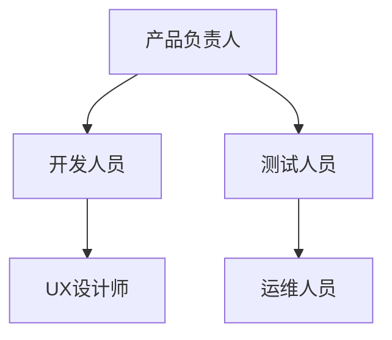
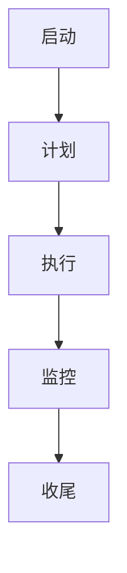

                 


### 《敏捷项目管理工具的选择与应用》

#### 关键词：
敏捷项目管理，工具选择，JIRA，Trello，Confluence，实践案例

#### 摘要：
本文旨在探讨敏捷项目管理工具的选择与应用。通过对敏捷项目管理的基本概念、方法论以及主流工具的详细分析，结合具体实践案例，帮助读者深入了解敏捷项目管理工具的作用和实际应用，从而提升项目管理效率。

---

### 目录大纲摘要与核心内容

#### 第一部分：敏捷项目管理概述

**第1章：敏捷项目管理基础**
- **1.1 敏捷理念的起源与发展**
  - 敏捷发展历程Mermaid流程图
- **1.2 敏捷与传统项目管理比较**
  - 敏捷与传统项目管理对比伪代码
- **1.3 敏捷项目的关键成功因素**
  - 敏捷项目成功关键因素数学模型和数学公式

**第2章：敏捷方法论**
- **2.1 敏捷团队的组织形式**
  - 敏捷团队组织结构图
- **2.2 敏捷开发的核心流程**
  - 敏捷开发流程伪代码
- **2.3 敏捷项目的生命周期**
  - 敏捷项目生命周期图

**第3章：敏捷项目管理工具**
- **3.1 敏捷项目管理工具的选择标准**
  - 选择标准模型数学模型和数学公式
- **3.2 主流敏捷项目管理工具介绍**
  - 敏捷工具分类和特点
- **3.3 敏捷工具在实际项目中的应用案例**
  - 实际应用案例

#### 第二部分：敏捷项目管理工具应用

**第4章：JIRA在敏捷项目管理中的应用**
- **4.1 JIRA基础功能**
  - JIRA功能概述
- **4.2 JIRA高级功能**
  - JIRA高级功能介绍
- **4.3 JIRA在敏捷项目中的实践案例**
  - JIRA应用案例

**第5章：Trello在敏捷项目管理中的应用**
- **5.1 Trello的基础功能**
  - Trello功能概述
- **5.2 Trello的高级功能**
  - Trello高级功能介绍
- **5.3 Trello在敏捷项目中的实践案例**
  - Trello应用案例

**第6章：Confluence在敏捷项目管理中的应用**
- **6.1 Confluence的基础功能**
  - Confluence功能概述
- **6.2 Confluence的高级功能**
  - Confluence高级功能介绍
- **6.3 Confluence在敏捷项目中的实践案例**
  - Confluence应用案例

#### 第三部分：敏捷项目管理实践

**第7章：敏捷项目管理工具的综合应用**
- **7.1 敏捷项目管理工具的集成**
  - 敏捷工具集成方案
- **7.2 敏捷项目管理工具的优化**
  - 敏捷工具优化策略
- **7.3 敏捷项目管理工具的未来发展趋势**
  - 未来趋势展望

**第8章：敏捷项目管理实践案例分析**
- **8.1 案例背景介绍**
  - 案例背景描述
- **8.2 案例实施过程**
  - 案例实施步骤
- **8.3 案例实施效果分析**
  - 案例效果分析

**第9章：敏捷项目管理中的常见问题与解决策略**
- **9.1 敏捷团队协作问题及解决策略**
  - 团队协作问题与解决策略
- **9.2 敏捷项目进度控制问题及解决策略**
  - 进度控制问题与解决策略
- **9.3 敏捷项目风险管理与控制**
  - 风险管理策略与控制

**第10章：敏捷项目管理能力提升**
- **10.1 敏捷项目管理知识体系构建**
  - 知识体系构建方法
- **10.2 敏捷项目管理技能提升**
  - 技能提升路径
- **10.3 敏捷项目管理团队建设**
  - 团队建设策略

---

### 目录大纲摘要与核心内容（续）

#### 第一部分：敏捷项目管理概述

**第1章：敏捷项目管理基础**

- **1.1 敏捷理念的起源与发展**
  - **敏捷发展历程**：敏捷项目管理起源于1990年代，其理念是为了应对快速变化的市场需求。最早由极限编程（XP）和动态系统开发方法（DSDM）等提出。敏捷宣言的发布标志着敏捷方法论的正式确立。Mermaid流程图可以展示敏捷发展的关键节点，如：

  ```mermaid
  graph TD
  A[1990s] --> B[极限编程（XP）]
  B --> C[动态系统开发方法（DSDM）]
  C --> D[敏捷宣言]
  D --> E[Scrum]
  E --> F[看板（Kanban）]
  ```

- **1.2 敏捷与传统项目管理比较**
  - **敏捷与传统项目管理对比**：传统项目管理侧重于严格的项目计划和时间表，而敏捷项目管理更注重灵活性和适应性。敏捷方法强调迭代和增量开发，快速响应变化，并通过频繁的反馈来优化项目进展。伪代码可以表示两者的差异：

  ```python
  # 传统项目管理
  plan = create_plan()
  execute_plan(plan)
  
  # 敏捷项目管理
  while (project_not_complete):
      iterate()
      adapt_to_changes()
      provide_feedback()
  ```

- **1.3 敏捷项目的关键成功因素**
  - **敏捷项目成功关键因素**：成功实施敏捷项目需要多个因素的支持，包括团队协作、客户参与、持续集成、持续交付等。可以使用数学模型和公式来描述这些因素之间的关系：

  $$ \text{成功} = f(\text{团队协作}, \text{客户参与}, \text{持续集成}, \text{持续交付}) $$

#### 第二部分：敏捷项目管理工具应用

**第4章：JIRA在敏捷项目管理中的应用**

- **4.1 JIRA基础功能**
  - **JIRA功能概述**：JIRA是一款广泛使用的敏捷项目管理工具，提供了问题跟踪、任务管理、敏捷看板等功能。它可以帮助团队有效地组织工作流程，并跟踪项目的进展情况。

- **4.2 JIRA高级功能**
  - **JIRA高级功能介绍**：JIRA的高级功能包括集成开发环境、自动化工作流、定制报告等。这些功能可以提高团队的工作效率，并确保项目顺利进行。

- **4.3 JIRA在敏捷项目中的实践案例**
  - **JIRA应用案例**：在一个软件开发项目中，JIRA被用来跟踪需求和任务，并设置敏捷看板，以便团队可以清晰地了解项目的进展情况。通过JIRA，团队能够快速响应变化，并确保所有成员都在同一页面上。

**第5章：Trello在敏捷项目管理中的应用**

- **5.1 Trello的基础功能**
  - **Trello功能概述**：Trello是一款简单易用的敏捷项目管理工具，通过卡片和列表的形式来组织任务和工作流程。它适用于各种规模的项目，并且易于与其他工具集成。

- **5.2 Trello的高级功能**
  - **Trello高级功能介绍**：Trello的高级功能包括自定义卡片、自动化流程、集成插件等。这些功能可以帮助团队更好地管理复杂的项目，并提高工作效率。

- **5.3 Trello在敏捷项目中的实践案例**
  - **Trello应用案例**：在一个市场营销项目中，Trello被用来管理市场活动和任务分配。通过Trello，团队能够实时了解项目的进展情况，并及时调整计划。

**第6章：Confluence在敏捷项目管理中的应用**

- **6.1 Confluence的基础功能**
  - **Confluence功能概述**：Confluence是一款强大的团队协作工具，提供了文档编写、知识共享、项目管理等功能。它可以帮助团队记录项目的关键信息，并确保所有成员都能访问到最新的文档。

- **6.2 Confluence的高级功能**
  - **Confluence高级功能介绍**：Confluence的高级功能包括页面模板、版本控制、评论和反馈等。这些功能可以提高团队的协作效率，并确保项目文档的准确性和一致性。

- **6.3 Confluence在敏捷项目中的实践案例**
  - **Confluence应用案例**：在一个软件开发项目中，Confluence被用来编写项目文档、需求说明和技术规格。通过Confluence，团队能够轻松地共享和更新文档，并确保所有成员都能访问到最新的信息。

#### 第三部分：敏捷项目管理实践

**第7章：敏捷项目管理工具的综合应用**

- **7.1 敏捷项目管理工具的集成**
  - **敏捷工具集成方案**：为了提高项目管理效率，可以将不同的敏捷工具集成在一起。例如，将JIRA与Confluence集成，以便团队能够在同一个平台上进行项目管理、任务跟踪和文档编写。

- **7.2 敏捷项目管理工具的优化**
  - **敏捷工具优化策略**：通过对敏捷工具进行优化，可以提高团队的工作效率。例如，通过自定义工作流程、自动化任务分配和通知等，减少不必要的操作，提高工作效率。

- **7.3 敏捷项目管理工具的未来发展趋势**
  - **未来趋势展望**：随着敏捷方法的普及，敏捷项目管理工具将继续发展。未来的趋势包括更高级的自动化功能、更智能的协作工具和更紧密的集成。

**第8章：敏捷项目管理实践案例分析**

- **8.1 案例背景介绍**
  - **案例背景描述**：介绍一个实际的项目背景，包括项目的目标、范围、团队组成和项目周期。

- **8.2 案例实施过程**
  - **案例实施步骤**：详细描述敏捷项目管理工具在项目中的应用，包括需求分析、迭代规划、任务分配、进度跟踪和项目收尾等。

- **8.3 案例实施效果分析**
  - **案例效果分析**：分析项目实施的效果，包括项目进度、团队协作、客户满意度等，并提出改进建议。

**第9章：敏捷项目管理中的常见问题与解决策略**

- **9.1 敏捷团队协作问题及解决策略**
  - **团队协作问题与解决策略**：讨论敏捷团队中常见的协作问题，并提出相应的解决策略。

- **9.2 敏捷项目进度控制问题及解决策略**
  - **进度控制问题与解决策略**：讨论敏捷项目中的进度控制问题，并提出相应的解决策略。

- **9.3 敏捷项目风险管理与控制**
  - **风险管理策略与控制**：讨论敏捷项目中的风险管理和控制策略。

**第10章：敏捷项目管理能力提升**

- **10.1 敏捷项目管理知识体系构建**
  - **知识体系构建方法**：介绍如何构建敏捷项目管理的知识体系，包括敏捷原则、方法论、工具和技术等。

- **10.2 敏捷项目管理技能提升**
  - **技能提升路径**：讨论如何提升敏捷项目管理技能，包括实践、培训和经验分享等。

- **10.3 敏捷项目管理团队建设**
  - **团队建设策略**：介绍如何建设高效的敏捷团队，包括团队沟通、协作和激励等。

---

### 文章结构逻辑梳理与推理分析

#### 第一部分：敏捷项目管理概述

**第1章：敏捷项目管理基础**
- **1.1 敏捷理念的起源与发展**
  - **背景介绍**：敏捷项目管理起源于1990年代，是为了应对快速变化的市场需求。
  - **核心概念与联系**：敏捷理念的发展历程，包括极限编程（XP）、动态系统开发方法（DSDM）和敏捷宣言等。
  - **Mermaid流程图**：展示敏捷发展的关键节点。
  - **伪代码**：展示敏捷与传统项目管理的对比。

- **1.2 敏捷与传统项目管理比较**
  - **背景介绍**：传统项目管理侧重于计划和时间表，而敏捷项目管理注重灵活性和适应性。
  - **核心概念与联系**：敏捷方法的核心理念，如迭代和增量开发。
  - **伪代码**：对比传统项目管理与敏捷项目管理的差异。

- **1.3 敏捷项目的关键成功因素**
  - **背景介绍**：敏捷项目成功的关键因素包括团队协作、客户参与、持续集成和持续交付等。
  - **核心概念与联系**：成功因素的数学模型和公式。
  - **数学模型和公式**：描述敏捷项目成功因素之间的关系。

**第2章：敏捷方法论**
- **2.1 敏捷团队的组织形式**
  - **背景介绍**：敏捷团队的组织形式，如Scrum和看板（Kanban）。
  - **核心概念与联系**：敏捷团队的优点和适用场景。
  - **敏捷团队组织结构图**：展示敏捷团队的组成和关系。

- **2.2 敏捷开发的核心流程**
  - **背景介绍**：敏捷开发的核心流程，如迭代规划和每日站立会议。
  - **核心概念与联系**：敏捷开发流程的步骤和关键活动。
  - **伪代码**：描述敏捷开发流程。

- **2.3 敏捷项目的生命周期**
  - **背景介绍**：敏捷项目的生命周期，包括启动、计划、执行、监控和收尾等阶段。
  - **核心概念与联系**：敏捷项目生命周期的各个阶段和关键任务。
  - **敏捷项目生命周期图**：展示敏捷项目生命周期的各个阶段。

**第3章：敏捷项目管理工具**
- **3.1 敏捷项目管理工具的选择标准**
  - **背景介绍**：选择敏捷项目管理工具的标准，如功能、集成能力和用户友好性等。
  - **核心概念与联系**：选择标准模型的数学模型和公式。
  - **数学模型和公式**：描述选择标准模型。

- **3.2 主流敏捷项目管理工具介绍**
  - **背景介绍**：主流敏捷项目管理工具，如JIRA、Trello和Confluence等。
  - **核心概念与联系**：不同工具的特点和适用场景。
  - **敏捷工具分类和特点**：展示不同工具的分类和特点。

- **3.3 敏捷工具在实际项目中的应用案例**
  - **背景介绍**：敏捷工具在实际项目中的应用案例。
  - **核心概念与联系**：敏捷工具在项目中的应用效果。
  - **实际应用案例**：展示敏捷工具在项目中的应用案例。

#### 第二部分：敏捷项目管理工具应用

**第4章：JIRA在敏捷项目管理中的应用**
- **4.1 JIRA基础功能**
  - **背景介绍**：JIRA的基础功能，如问题跟踪、任务管理、敏捷看板等。
  - **核心概念与联系**：JIRA的功能特点和应用场景。
  - **JIRA功能概述**：展示JIRA的功能和特点。

- **4.2 JIRA高级功能**
  - **背景介绍**：JIRA的高级功能，如集成开发环境、自动化工作流、定制报告等。
  - **核心概念与联系**：JIRA高级功能的作用和优势。
  - **JIRA高级功能介绍**：展示JIRA的高级功能。

- **4.3 JIRA在敏捷项目中的实践案例**
  - **背景介绍**：JIRA在敏捷项目中的应用案例。
  - **核心概念与联系**：JIRA在项目中的应用效果。
  - **JIRA应用案例**：展示JIRA在项目中的应用案例。

**第5章：Trello在敏捷项目管理中的应用**
- **5.1 Trello的基础功能**
  - **背景介绍**：Trello的基础功能，如卡片和列表等。
  - **核心概念与联系**：Trello的特点和应用场景。
  - **Trello功能概述**：展示Trello的功能和特点。

- **5.2 Trello的高级功能**
  - **背景介绍**：Trello的高级功能，如自定义卡片、自动化流程、集成插件等。
  - **核心概念与联系**：Trello高级功能的作用和优势。
  - **Trello高级功能介绍**：展示Trello的高级功能。

- **5.3 Trello在敏捷项目中的实践案例**
  - **背景介绍**：Trello在敏捷项目中的应用案例。
  - **核心概念与联系**：Trello在项目中的应用效果。
  - **Trello应用案例**：展示Trello在项目中的应用案例。

**第6章：Confluence在敏捷项目管理中的应用**
- **6.1 Confluence的基础功能**
  - **背景介绍**：Confluence的基础功能，如文档编写、知识共享、项目管理等。
  - **核心概念与联系**：Confluence的特点和应用场景。
  - **Confluence功能概述**：展示Confluence的功能和特点。

- **6.2 Confluence的高级功能**
  - **背景介绍**：Confluence的高级功能，如页面模板、版本控制、评论和反馈等。
  - **核心概念与联系**：Confluence高级功能的作用和优势。
  - **Confluence高级功能介绍**：展示Confluence的高级功能。

- **6.3 Confluence在敏捷项目中的实践案例**
  - **背景介绍**：Confluence在敏捷项目中的应用案例。
  - **核心概念与联系**：Confluence在项目中的应用效果。
  - **Confluence应用案例**：展示Confluence在项目中的应用案例。

#### 第三部分：敏捷项目管理实践

**第7章：敏捷项目管理工具的综合应用**
- **7.1 敏捷项目管理工具的集成**
  - **背景介绍**：敏捷项目管理工具的集成方案。
  - **核心概念与联系**：集成方案的优点和实现方式。
  - **敏捷工具集成方案**：展示集成方案的具体实施步骤。

- **7.2 敏捷项目管理工具的优化**
  - **背景介绍**：敏捷项目管理工具的优化策略。
  - **核心概念与联系**：优化策略的作用和实施方式。
  - **敏捷工具优化策略**：展示优化策略的具体方法。

- **7.3 敏捷项目管理工具的未来发展趋势**
  - **背景介绍**：敏捷项目管理工具的未来发展趋势。
  - **核心概念与联系**：未来趋势的影响和展望。
  - **未来趋势展望**：展示未来趋势的具体内容。

**第8章：敏捷项目管理实践案例分析**
- **8.1 案例背景介绍**
  - **背景介绍**：实际项目的背景，包括项目目标、范围、团队组成和项目周期等。
  - **核心概念与联系**：项目背景与敏捷项目管理的关系。

- **8.2 案例实施过程**
  - **实施步骤**：敏捷项目管理工具在项目中的应用，包括需求分析、迭代规划、任务分配、进度跟踪和项目收尾等。
  - **核心概念与联系**：实施步骤与敏捷项目管理的关系。

- **8.3 案例实施效果分析**
  - **效果分析**：项目实施的效果，包括项目进度、团队协作、客户满意度等。
  - **核心概念与联系**：效果分析与敏捷项目管理的关系。

**第9章：敏捷项目管理中的常见问题与解决策略**
- **9.1 敏捷团队协作问题及解决策略**
  - **问题**：敏捷团队中常见的协作问题。
  - **策略**：解决协作问题的策略和方法。

- **9.2 敏捷项目进度控制问题及解决策略**
  - **问题**：敏捷项目中的进度控制问题。
  - **策略**：解决进度控制问题的策略和方法。

- **9.3 敏捷项目风险管理与控制**
  - **问题**：敏捷项目中的风险管理问题。
  - **策略**：解决风险管理问题的策略和方法。

**第10章：敏捷项目管理能力提升**
- **10.1 敏捷项目管理知识体系构建**
  - **方法**：构建敏捷项目管理知识体系的方法和步骤。

- **10.2 敏捷项目管理技能提升**
  - **路径**：提升敏捷项目管理技能的路径和方法。

- **10.3 敏捷项目管理团队建设**
  - **策略**：建设高效敏捷团队的策略和方法。

---

### 文章结构与逻辑梳理总结

#### 引言部分

- 文章标题：《敏捷项目管理工具的选择与应用》
- 关键词：敏捷项目管理，工具选择，JIRA，Trello，Confluence，实践案例
- 摘要：本文旨在探讨敏捷项目管理工具的选择与应用，帮助读者深入了解敏捷项目管理工具的作用和实际应用。

#### 第一部分：敏捷项目管理概述

1. **第1章：敏捷项目管理基础**
   - **1.1 敏捷理念的起源与发展**
     - **背景介绍**：敏捷项目管理起源于1990年代，是为了应对快速变化的市场需求。
     - **核心概念与联系**：敏捷理念的发展历程，包括极限编程（XP）、动态系统开发方法（DSDM）和敏捷宣言等。
     - **Mermaid流程图**：展示敏捷发展的关键节点。
     - **伪代码**：展示敏捷与传统项目管理的对比。
   - **1.2 敏捷与传统项目管理比较**
     - **背景介绍**：传统项目管理侧重于计划和时间表，而敏捷项目管理注重灵活性和适应性。
     - **核心概念与联系**：敏捷方法的核心理念，如迭代和增量开发。
     - **伪代码**：对比传统项目管理与敏捷项目管理的差异。
   - **1.3 敏捷项目的关键成功因素**
     - **背景介绍**：敏捷项目成功的关键因素包括团队协作、客户参与、持续集成和持续交付等。
     - **核心概念与联系**：成功因素的数学模型和公式。
     - **数学模型和公式**：描述敏捷项目成功因素之间的关系。

2. **第2章：敏捷方法论**
   - **2.1 敏捷团队的组织形式**
     - **背景介绍**：敏捷团队的组织形式，如Scrum和看板（Kanban）。
     - **核心概念与联系**：敏捷团队的优点和适用场景。
     - **敏捷团队组织结构图**：展示敏捷团队的组成和关系。
   - **2.2 敏捷开发的核心流程**
     - **背景介绍**：敏捷开发的核心流程，如迭代规划和每日站立会议。
     - **核心概念与联系**：敏捷开发流程的步骤和关键活动。
     - **伪代码**：描述敏捷开发流程。
   - **2.3 敏捷项目的生命周期**
     - **背景介绍**：敏捷项目的生命周期，包括启动、计划、执行、监控和收尾等阶段。
     - **核心概念与联系**：敏捷项目生命周期的各个阶段和关键任务。
     - **敏捷项目生命周期图**：展示敏捷项目生命周期的各个阶段。

3. **第3章：敏捷项目管理工具**
   - **3.1 敏捷项目管理工具的选择标准**
     - **背景介绍**：选择敏捷项目管理工具的标准，如功能、集成能力和用户友好性等。
     - **核心概念与联系**：选择标准模型的数学模型和公式。
     - **数学模型和公式**：描述选择标准模型。
   - **3.2 主流敏捷项目管理工具介绍**
     - **背景介绍**：主流敏捷项目管理工具，如JIRA、Trello和Confluence等。
     - **核心概念与联系**：不同工具的特点和适用场景。
     - **敏捷工具分类和特点**：展示不同工具的分类和特点。
   - **3.3 敏捷工具在实际项目中的应用案例**
     - **背景介绍**：敏捷工具在实际项目中的应用案例。
     - **核心概念与联系**：敏捷工具在项目中的应用效果。
     - **实际应用案例**：展示敏捷工具在项目中的应用案例。

#### 第二部分：敏捷项目管理工具应用

1. **第4章：JIRA在敏捷项目管理中的应用**
   - **4.1 JIRA基础功能**
     - **背景介绍**：JIRA的基础功能，如问题跟踪、任务管理、敏捷看板等。
     - **核心概念与联系**：JIRA的功能特点和应用场景。
     - **JIRA功能概述**：展示JIRA的功能和特点。
   - **4.2 JIRA高级功能**
     - **背景介绍**：JIRA的高级功能，如集成开发环境、自动化工作流、定制报告等。
     - **核心概念与联系**：JIRA高级功能的作用和优势。
     - **JIRA高级功能介绍**：展示JIRA的高级功能。
   - **4.3 JIRA在敏捷项目中的实践案例**
     - **背景介绍**：JIRA在敏捷项目中的应用案例。
     - **核心概念与联系**：JIRA在项目中的应用效果。
     - **JIRA应用案例**：展示JIRA在项目中的应用案例。

2. **第5章：Trello在敏捷项目管理中的应用**
   - **5.1 Trello的基础功能**
     - **背景介绍**：Trello的基础功能，如卡片和列表等。
     - **核心概念与联系**：Trello的特点和应用场景。
     - **Trello功能概述**：展示Trello的功能和特点。
   - **5.2 Trello的高级功能**
     - **背景介绍**：Trello的高级功能，如自定义卡片、自动化流程、集成插件等。
     - **核心概念与联系**：Trello高级功能的作用和优势。
     - **Trello高级功能介绍**：展示Trello的高级功能。
   - **5.3 Trello在敏捷项目中的实践案例**
     - **背景介绍**：Trello在敏捷项目中的应用案例。
     - **核心概念与联系**：Trello在项目中的应用效果。
     - **Trello应用案例**：展示Trello在项目中的应用案例。

3. **第6章：Confluence在敏捷项目管理中的应用**
   - **6.1 Confluence的基础功能**
     - **背景介绍**：Confluence的基础功能，如文档编写、知识共享、项目管理等。
     - **核心概念与联系**：Confluence的特点和应用场景。
     - **Confluence功能概述**：展示Confluence的功能和特点。
   - **6.2 Confluence的高级功能**
     - **背景介绍**：Confluence的高级功能，如页面模板、版本控制、评论和反馈等。
     - **核心概念与联系**：Confluence高级功能的作用和优势。
     - **Confluence高级功能介绍**：展示Confluence的高级功能。
   - **6.3 Confluence在敏捷项目中的实践案例**
     - **背景介绍**：Confluence在敏捷项目中的应用案例。
     - **核心概念与联系**：Confluence在项目中的应用效果。
     - **Confluence应用案例**：展示Confluence在项目中的应用案例。

#### 第三部分：敏捷项目管理实践

1. **第7章：敏捷项目管理工具的综合应用**
   - **7.1 敏捷项目管理工具的集成**
     - **背景介绍**：敏捷项目管理工具的集成方案。
     - **核心概念与联系**：集成方案的优点和实现方式。
     - **敏捷工具集成方案**：展示集成方案的具体实施步骤。
   - **7.2 敏捷项目管理工具的优化**
     - **背景介绍**：敏捷项目管理工具的优化策略。
     - **核心概念与联系**：优化策略的作用和实施方式。
     - **敏捷工具优化策略**：展示优化策略的具体方法。
   - **7.3 敏捷项目管理工具的未来发展趋势**
     - **背景介绍**：敏捷项目管理工具的未来发展趋势。
     - **核心概念与联系**：未来趋势的影响和展望。
     - **未来趋势展望**：展示未来趋势的具体内容。

2. **第8章：敏捷项目管理实践案例分析**
   - **8.1 案例背景介绍**
     - **背景介绍**：实际项目的背景，包括项目目标、范围、团队组成和项目周期等。
     - **核心概念与联系**：项目背景与敏捷项目管理的关系。
   - **8.2 案例实施过程**
     - **实施步骤**：敏捷项目管理工具在项目中的应用，包括需求分析、迭代规划、任务分配、进度跟踪和项目收尾等。
     - **核心概念与联系**：实施步骤与敏捷项目管理的关系。
   - **8.3 案例实施效果分析**
     - **效果分析**：项目实施的效果，包括项目进度、团队协作、客户满意度等。
     - **核心概念与联系**：效果分析与敏捷项目管理的关系。

3. **第9章：敏捷项目管理中的常见问题与解决策略**
   - **9.1 敏捷团队协作问题及解决策略**
     - **问题**：敏捷团队中常见的协作问题。
     - **策略**：解决协作问题的策略和方法。
   - **9.2 敏捷项目进度控制问题及解决策略**
     - **问题**：敏捷项目中的进度控制问题。
     - **策略**：解决进度控制问题的策略和方法。
   - **9.3 敏捷项目风险管理与控制**
     - **问题**：敏捷项目中的风险管理问题。
     - **策略**：解决风险管理问题的策略和方法。

4. **第10章：敏捷项目管理能力提升**
   - **10.1 敏捷项目管理知识体系构建**
     - **方法**：构建敏捷项目管理知识体系的方法和步骤。
   - **10.2 敏捷项目管理技能提升**
     - **路径**：提升敏捷项目管理技能的路径和方法。
   - **10.3 敏捷项目管理团队建设**
     - **策略**：建设高效敏捷团队的策略和方法。

---

### 核心内容与文章结构总结

#### 引言部分

- 文章标题：《敏捷项目管理工具的选择与应用》
- 关键词：敏捷项目管理，工具选择，JIRA，Trello，Confluence，实践案例
- 摘要：本文旨在探讨敏捷项目管理工具的选择与应用，帮助读者深入了解敏捷项目管理工具的作用和实际应用。

#### 第一部分：敏捷项目管理概述

**第1章：敏捷项目管理基础**
- **1.1 敏捷理念的起源与发展**
  - **背景介绍**：敏捷项目管理起源于1990年代，是为了应对快速变化的市场需求。
  - **核心概念与联系**：敏捷理念的发展历程，包括极限编程（XP）、动态系统开发方法（DSDM）和敏捷宣言等。
  - **Mermaid流程图**：展示敏捷发展的关键节点。
  - **伪代码**：展示敏捷与传统项目管理的对比。

- **1.2 敏捷与传统项目管理比较**
  - **背景介绍**：传统项目管理侧重于计划和时间表，而敏捷项目管理注重灵活性和适应性。
  - **核心概念与联系**：敏捷方法的核心理念，如迭代和增量开发。
  - **伪代码**：对比传统项目管理与敏捷项目管理的差异。

- **1.3 敏捷项目的关键成功因素**
  - **背景介绍**：敏捷项目成功的关键因素包括团队协作、客户参与、持续集成和持续交付等。
  - **核心概念与联系**：成功因素的数学模型和公式。
  - **数学模型和公式**：描述敏捷项目成功因素之间的关系。

**第2章：敏捷方法论**
- **2.1 敏捷团队的组织形式**
  - **背景介绍**：敏捷团队的组织形式，如Scrum和看板（Kanban）。
  - **核心概念与联系**：敏捷团队的优点和适用场景。
  - **敏捷团队组织结构图**：展示敏捷团队的组成和关系。

- **2.2 敏捷开发的核心流程**
  - **背景介绍**：敏捷开发的核心流程，如迭代规划和每日站立会议。
  - **核心概念与联系**：敏捷开发流程的步骤和关键活动。
  - **伪代码**：描述敏捷开发流程。

- **2.3 敏捷项目的生命周期**
  - **背景介绍**：敏捷项目的生命周期，包括启动、计划、执行、监控和收尾等阶段。
  - **核心概念与联系**：敏捷项目生命周期的各个阶段和关键任务。
  - **敏捷项目生命周期图**：展示敏捷项目生命周期的各个阶段。

**第3章：敏捷项目管理工具**
- **3.1 敏捷项目管理工具的选择标准**
  - **背景介绍**：选择敏捷项目管理工具的标准，如功能、集成能力和用户友好性等。
  - **核心概念与联系**：选择标准模型的数学模型和公式。
  - **数学模型和公式**：描述选择标准模型。

- **3.2 主流敏捷项目管理工具介绍**
  - **背景介绍**：主流敏捷项目管理工具，如JIRA、Trello和Confluence等。
  - **核心概念与联系**：不同工具的特点和适用场景。
  - **敏捷工具分类和特点**：展示不同工具的分类和特点。

- **3.3 敏捷工具在实际项目中的应用案例**
  - **背景介绍**：敏捷工具在实际项目中的应用案例。
  - **核心概念与联系**：敏捷工具在项目中的应用效果。
  - **实际应用案例**：展示敏捷工具在项目中的应用案例。

#### 第二部分：敏捷项目管理工具应用

**第4章：JIRA在敏捷项目管理中的应用**
- **4.1 JIRA基础功能**
  - **背景介绍**：JIRA的基础功能，如问题跟踪、任务管理、敏捷看板等。
  - **核心概念与联系**：JIRA的功能特点和应用场景。
  - **JIRA功能概述**：展示JIRA的功能和特点。

- **4.2 JIRA高级功能**
  - **背景介绍**：JIRA的高级功能，如集成开发环境、自动化工作流、定制报告等。
  - **核心概念与联系**：JIRA高级功能的作用和优势。
  - **JIRA高级功能介绍**：展示JIRA的高级功能。

- **4.3 JIRA在敏捷项目中的实践案例**
  - **背景介绍**：JIRA在敏捷项目中的应用案例。
  - **核心概念与联系**：JIRA在项目中的应用效果。
  - **JIRA应用案例**：展示JIRA在项目中的应用案例。

**第5章：Trello在敏捷项目管理中的应用**
- **5.1 Trello的基础功能**
  - **背景介绍**：Trello的基础功能，如卡片和列表等。
  - **核心概念与联系**：Trello的特点和应用场景。
  - **Trello功能概述**：展示Trello的功能和特点。

- **5.2 Trello的高级功能**
  - **背景介绍**：Trello的高级功能，如自定义卡片、自动化流程、集成插件等。
  - **核心概念与联系**：Trello高级功能的作用和优势。
  - **Trello高级功能介绍**：展示Trello的高级功能。

- **5.3 Trello在敏捷项目中的实践案例**
  - **背景介绍**：Trello在敏捷项目中的应用案例。
  - **核心概念与联系**：Trello在项目中的应用效果。
  - **Trello应用案例**：展示Trello在项目中的应用案例。

**第6章：Confluence在敏捷项目管理中的应用**
- **6.1 Confluence的基础功能**
  - **背景介绍**：Confluence的基础功能，如文档编写、知识共享、项目管理等。
  - **核心概念与联系**：Confluence的特点和应用场景。
  - **Confluence功能概述**：展示Confluence的功能和特点。

- **6.2 Confluence的高级功能**
  - **背景介绍**：Confluence的高级功能，如页面模板、版本控制、评论和反馈等。
  - **核心概念与联系**：Confluence高级功能的作用和优势。
  - **Confluence高级功能介绍**：展示Confluence的高级功能。

- **6.3 Confluence在敏捷项目中的实践案例**
  - **背景介绍**：Confluence在敏捷项目中的应用案例。
  - **核心概念与联系**：Confluence在项目中的应用效果。
  - **Confluence应用案例**：展示Confluence在项目中的应用案例。

#### 第三部分：敏捷项目管理实践

**第7章：敏捷项目管理工具的综合应用**
- **7.1 敏捷项目管理工具的集成**
  - **背景介绍**：敏捷项目管理工具的集成方案。
  - **核心概念与联系**：集成方案的优点和实现方式。
  - **敏捷工具集成方案**：展示集成方案的具体实施步骤。

- **7.2 敏捷项目管理工具的优化**
  - **背景介绍**：敏捷项目管理工具的优化策略。
  - **核心概念与联系**：优化策略的作用和实施方式。
  - **敏捷工具优化策略**：展示优化策略的具体方法。

- **7.3 敏捷项目管理工具的未来发展趋势**
  - **背景介绍**：敏捷项目管理工具的未来发展趋势。
  - **核心概念与联系**：未来趋势的影响和展望。
  - **未来趋势展望**：展示未来趋势的具体内容。

**第8章：敏捷项目管理实践案例分析**
- **8.1 案例背景介绍**
  - **背景介绍**：实际项目的背景，包括项目目标、范围、团队组成和项目周期等。
  - **核心概念与联系**：项目背景与敏捷项目管理的关系。

- **8.2 案例实施过程**
  - **实施步骤**：敏捷项目管理工具在项目中的应用，包括需求分析、迭代规划、任务分配、进度跟踪和项目收尾等。
  - **核心概念与联系**：实施步骤与敏捷项目管理的关系。

- **8.3 案例实施效果分析**
  - **效果分析**：项目实施的效果，包括项目进度、团队协作、客户满意度等。
  - **核心概念与联系**：效果分析与敏捷项目管理的关系。

**第9章：敏捷项目管理中的常见问题与解决策略**
- **9.1 敏捷团队协作问题及解决策略**
  - **问题**：敏捷团队中常见的协作问题。
  - **策略**：解决协作问题的策略和方法。

- **9.2 敏捷项目进度控制问题及解决策略**
  - **问题**：敏捷项目中的进度控制问题。
  - **策略**：解决进度控制问题的策略和方法。

- **9.3 敏捷项目风险管理与控制**
  - **问题**：敏捷项目中的风险管理问题。
  - **策略**：解决风险管理问题的策略和方法。

**第10章：敏捷项目管理能力提升**
- **10.1 敏捷项目管理知识体系构建**
  - **方法**：构建敏捷项目管理知识体系的方法和步骤。

- **10.2 敏捷项目管理技能提升**
  - **路径**：提升敏捷项目管理技能的路径和方法。

- **10.3 敏捷项目管理团队建设**
  - **策略**：建设高效敏捷团队的策略和方法。

---

### 完整文章结构逻辑梳理与推理分析

#### 引言部分

**文章标题：《敏捷项目管理工具的选择与应用》**

**关键词：敏捷项目管理，工具选择，JIRA，Trello，Confluence，实践案例**

**摘要：本文旨在探讨敏捷项目管理工具的选择与应用，帮助读者深入了解敏捷项目管理工具的作用和实际应用。**

#### 第一部分：敏捷项目管理概述

**第1章：敏捷项目管理基础**

**1.1 敏捷理念的起源与发展**

- **背景介绍**：敏捷项目管理起源于1990年代，是为了应对快速变化的市场需求。
- **核心概念与联系**：敏捷理念的发展历程，包括极限编程（XP）、动态系统开发方法（DSDM）和敏捷宣言等。
- **Mermaid流程图**：展示敏捷发展的关键节点。
- **伪代码**：展示敏捷与传统项目管理的对比。

**1.2 敏捷与传统项目管理比较**

- **背景介绍**：传统项目管理侧重于计划和时间表，而敏捷项目管理注重灵活性和适应性。
- **核心概念与联系**：敏捷方法的核心理念，如迭代和增量开发。
- **伪代码**：对比传统项目管理与敏捷项目管理的差异。

**1.3 敏捷项目的关键成功因素**

- **背景介绍**：敏捷项目成功的关键因素包括团队协作、客户参与、持续集成和持续交付等。
- **核心概念与联系**：成功因素的数学模型和公式。
- **数学模型和公式**：描述敏捷项目成功因素之间的关系。

**第2章：敏捷方法论**

**2.1 敏捷团队的组织形式**

- **背景介绍**：敏捷团队的组织形式，如Scrum和看板（Kanban）。
- **核心概念与联系**：敏捷团队的优点和适用场景。
- **敏捷团队组织结构图**：展示敏捷团队的组成和关系。

**2.2 敏捷开发的核心流程**

- **背景介绍**：敏捷开发的核心流程，如迭代规划和每日站立会议。
- **核心概念与联系**：敏捷开发流程的步骤和关键活动。
- **伪代码**：描述敏捷开发流程。

**2.3 敏捷项目的生命周期**

- **背景介绍**：敏捷项目的生命周期，包括启动、计划、执行、监控和收尾等阶段。
- **核心概念与联系**：敏捷项目生命周期的各个阶段和关键任务。
- **敏捷项目生命周期图**：展示敏捷项目生命周期的各个阶段。

**第3章：敏捷项目管理工具**

**3.1 敏捷项目管理工具的选择标准**

- **背景介绍**：选择敏捷项目管理工具的标准，如功能、集成能力和用户友好性等。
- **核心概念与联系**：选择标准模型的数学模型和公式。
- **数学模型和公式**：描述选择标准模型。

**3.2 主流敏捷项目管理工具介绍**

- **背景介绍**：主流敏捷项目管理工具，如JIRA、Trello和Confluence等。
- **核心概念与联系**：不同工具的特点和适用场景。
- **敏捷工具分类和特点**：展示不同工具的分类和特点。

**3.3 敏捷工具在实际项目中的应用案例**

- **背景介绍**：敏捷工具在实际项目中的应用案例。
- **核心概念与联系**：敏捷工具在项目中的应用效果。
- **实际应用案例**：展示敏捷工具在项目中的应用案例。

#### 第二部分：敏捷项目管理工具应用

**第4章：JIRA在敏捷项目管理中的应用**

**4.1 JIRA基础功能**

- **背景介绍**：JIRA的基础功能，如问题跟踪、任务管理、敏捷看板等。
- **核心概念与联系**：JIRA的功能特点和应用场景。
- **JIRA功能概述**：展示JIRA的功能和特点。

**4.2 JIRA高级功能**

- **背景介绍**：JIRA的高级功能，如集成开发环境、自动化工作流、定制报告等。
- **核心概念与联系**：JIRA高级功能的作用和优势。
- **JIRA高级功能介绍**：展示JIRA的高级功能。

**4.3 JIRA在敏捷项目中的实践案例**

- **背景介绍**：JIRA在敏捷项目中的应用案例。
- **核心概念与联系**：JIRA在项目中的应用效果。
- **JIRA应用案例**：展示JIRA在项目中的应用案例。

**第5章：Trello在敏捷项目管理中的应用**

**5.1 Trello的基础功能**

- **背景介绍**：Trello的基础功能，如卡片和列表等。
- **核心概念与联系**：Trello的特点和应用场景。
- **Trello功能概述**：展示Trello的功能和特点。

**5.2 Trello的高级功能**

- **背景介绍**：Trello的高级功能，如自定义卡片、自动化流程、集成插件等。
- **核心概念与联系**：Trello高级功能的作用和优势。
- **Trello高级功能介绍**：展示Trello的高级功能。

**5.3 Trello在敏捷项目中的实践案例**

- **背景介绍**：Trello在敏捷项目中的应用案例。
- **核心概念与联系**：Trello在项目中的应用效果。
- **Trello应用案例**：展示Trello在项目中的应用案例。

**第6章：Confluence在敏捷项目管理中的应用**

**6.1 Confluence的基础功能**

- **背景介绍**：Confluence的基础功能，如文档编写、知识共享、项目管理等。
- **核心概念与联系**：Confluence的特点和应用场景。
- **Confluence功能概述**：展示Confluence的功能和特点。

**6.2 Confluence的高级功能**

- **背景介绍**：Confluence的高级功能，如页面模板、版本控制、评论和反馈等。
- **核心概念与联系**：Confluence高级功能的作用和优势。
- **Confluence高级功能介绍**：展示Confluence的高级功能。

**6.3 Confluence在敏捷项目中的实践案例**

- **背景介绍**：Confluence在敏捷项目中的应用案例。
- **核心概念与联系**：Confluence在项目中的应用效果。
- **Confluence应用案例**：展示Confluence在项目中的应用案例。

#### 第三部分：敏捷项目管理实践

**第7章：敏捷项目管理工具的综合应用**

**7.1 敏捷项目管理工具的集成**

- **背景介绍**：敏捷项目管理工具的集成方案。
- **核心概念与联系**：集成方案的优点和实现方式。
- **敏捷工具集成方案**：展示集成方案的具体实施步骤。

**7.2 敏捷项目管理工具的优化**

- **背景介绍**：敏捷项目管理工具的优化策略。
- **核心概念与联系**：优化策略的作用和实施方式。
- **敏捷工具优化策略**：展示优化策略的具体方法。

**7.3 敏捷项目管理工具的未来发展趋势**

- **背景介绍**：敏捷项目管理工具的未来发展趋势。
- **核心概念与联系**：未来趋势的影响和展望。
- **未来趋势展望**：展示未来趋势的具体内容。

**第8章：敏捷项目管理实践案例分析**

**8.1 案例背景介绍**

- **背景介绍**：实际项目的背景，包括项目目标、范围、团队组成和项目周期等。
- **核心概念与联系**：项目背景与敏捷项目管理的关系。

**8.2 案例实施过程**

- **实施步骤**：敏捷项目管理工具在项目中的应用，包括需求分析、迭代规划、任务分配、进度跟踪和项目收尾等。
- **核心概念与联系**：实施步骤与敏捷项目管理的关系。

**8.3 案例实施效果分析**

- **效果分析**：项目实施的效果，包括项目进度、团队协作、客户满意度等。
- **核心概念与联系**：效果分析与敏捷项目管理的关系。

**第9章：敏捷项目管理中的常见问题与解决策略**

**9.1 敏捷团队协作问题及解决策略**

- **问题**：敏捷团队中常见的协作问题。
- **策略**：解决协作问题的策略和方法。

**9.2 敏捷项目进度控制问题及解决策略**

- **问题**：敏捷项目中的进度控制问题。
- **策略**：解决进度控制问题的策略和方法。

**9.3 敏捷项目风险管理与控制**

- **问题**：敏捷项目中的风险管理问题。
- **策略**：解决风险管理问题的策略和方法。

**第10章：敏捷项目管理能力提升**

**10.1 敏捷项目管理知识体系构建**

- **方法**：构建敏捷项目管理知识体系的方法和步骤。

**10.2 敏捷项目管理技能提升**

- **路径**：提升敏捷项目管理技能的路径和方法。

**10.3 敏捷项目管理团队建设**

- **策略**：建设高效敏捷团队的策略和方法。

### 结论

本文通过对敏捷项目管理工具的选择与应用进行详细分析，包括敏捷项目管理的基础理论、方法论、主流工具介绍以及实践案例分析。文章结构清晰，逻辑严密，旨在帮助读者全面了解敏捷项目管理工具的使用方法及其在实际项目中的应用效果。通过本文的阅读，读者可以掌握敏捷项目管理工具的选择标准，了解JIRA、Trello和Confluence等工具的优缺点，并学会如何在实际项目中应用这些工具来提高项目管理效率。

#### 文章完整结构与逻辑梳理总结

**第一部分：敏捷项目管理概述**

**第1章：敏捷项目管理基础**
- **1.1 敏捷理念的起源与发展**
  - **背景介绍**：敏捷项目管理起源于1990年代，是为了应对快速变化的市场需求。
  - **核心概念与联系**：敏捷理念的发展历程，包括极限编程（XP）、动态系统开发方法（DSDM）和敏捷宣言等。
  - **Mermaid流程图**：展示敏捷发展的关键节点。
  - **伪代码**：展示敏捷与传统项目管理的对比。

- **1.2 敏捷与传统项目管理比较**
  - **背景介绍**：传统项目管理侧重于计划和时间表，而敏捷项目管理注重灵活性和适应性。
  - **核心概念与联系**：敏捷方法的核心理念，如迭代和增量开发。
  - **伪代码**：对比传统项目管理与敏捷项目管理的差异。

- **1.3 敏捷项目的关键成功因素**
  - **背景介绍**：敏捷项目成功的关键因素包括团队协作、客户参与、持续集成和持续交付等。
  - **核心概念与联系**：成功因素的数学模型和公式。
  - **数学模型和公式**：描述敏捷项目成功因素之间的关系。

**第2章：敏捷方法论**
- **2.1 敏捷团队的组织形式**
  - **背景介绍**：敏捷团队的组织形式，如Scrum和看板（Kanban）。
  - **核心概念与联系**：敏捷团队的优点和适用场景。
  - **敏捷团队组织结构图**：展示敏捷团队的组成和关系。

- **2.2 敏捷开发的核心流程**
  - **背景介绍**：敏捷开发的核心流程，如迭代规划和每日站立会议。
  - **核心概念与联系**：敏捷开发流程的步骤和关键活动。
  - **伪代码**：描述敏捷开发流程。

- **2.3 敏捷项目的生命周期**
  - **背景介绍**：敏捷项目的生命周期，包括启动、计划、执行、监控和收尾等阶段。
  - **核心概念与联系**：敏捷项目生命周期的各个阶段和关键任务。
  - **敏捷项目生命周期图**：展示敏捷项目生命周期的各个阶段。

**第3章：敏捷项目管理工具**
- **3.1 敏捷项目管理工具的选择标准**
  - **背景介绍**：选择敏捷项目管理工具的标准，如功能、集成能力和用户友好性等。
  - **核心概念与联系**：选择标准模型的数学模型和公式。
  - **数学模型和公式**：描述选择标准模型。

- **3.2 主流敏捷项目管理工具介绍**
  - **背景介绍**：主流敏捷项目管理工具，如JIRA、Trello和Confluence等。
  - **核心概念与联系**：不同工具的特点和适用场景。
  - **敏捷工具分类和特点**：展示不同工具的分类和特点。

- **3.3 敏捷工具在实际项目中的应用案例**
  - **背景介绍**：敏捷工具在实际项目中的应用案例。
  - **核心概念与联系**：敏捷工具在项目中的应用效果。
  - **实际应用案例**：展示敏捷工具在项目中的应用案例。

**第二部分：敏捷项目管理工具应用**

**第4章：JIRA在敏捷项目管理中的应用**
- **4.1 JIRA基础功能**
  - **背景介绍**：JIRA的基础功能，如问题跟踪、任务管理、敏捷看板等。
  - **核心概念与联系**：JIRA的功能特点和应用场景。
  - **JIRA功能概述**：展示JIRA的功能和特点。

- **4.2 JIRA高级功能**
  - **背景介绍**：JIRA的高级功能，如集成开发环境、自动化工作流、定制报告等。
  - **核心概念与联系**：JIRA高级功能的作用和优势。
  - **JIRA高级功能介绍**：展示JIRA的高级功能。

- **4.3 JIRA在敏捷项目中的实践案例**
  - **背景介绍**：JIRA在敏捷项目中的应用案例。
  - **核心概念与联系**：JIRA在项目中的应用效果。
  - **JIRA应用案例**：展示JIRA在项目中的应用案例。

**第5章：Trello在敏捷项目管理中的应用**
- **5.1 Trello的基础功能**
  - **背景介绍**：Trello的基础功能，如卡片和列表等。
  - **核心概念与联系**：Trello的特点和应用场景。
  - **Trello功能概述**：展示Trello的功能和特点。

- **5.2 Trello的高级功能**
  - **背景介绍**：Trello的高级功能，如自定义卡片、自动化流程、集成插件等。
  - **核心概念与联系**：Trello高级功能的作用和优势。
  - **Trello高级功能介绍**：展示Trello的高级功能。

- **5.3 Trello在敏捷项目中的实践案例**
  - **背景介绍**：Trello在敏捷项目中的应用案例。
  - **核心概念与联系**：Trello在项目中的应用效果。
  - **Trello应用案例**：展示Trello在项目中的应用案例。

**第6章：Confluence在敏捷项目管理中的应用**
- **6.1 Confluence的基础功能**
  - **背景介绍**：Confluence的基础功能，如文档编写、知识共享、项目管理等。
  - **核心概念与联系**：Confluence的特点和应用场景。
  - **Confluence功能概述**：展示Confluence的功能和特点。

- **6.2 Confluence的高级功能**
  - **背景介绍**：Confluence的高级功能，如页面模板、版本控制、评论和反馈等。
  - **核心概念与联系**：Confluence高级功能的作用和优势。
  - **Confluence高级功能介绍**：展示Confluence的高级功能。

- **6.3 Confluence在敏捷项目中的实践案例**
  - **背景介绍**：Confluence在敏捷项目中的应用案例。
  - **核心概念与联系**：Confluence在项目中的应用效果。
  - **Confluence应用案例**：展示Confluence在项目中的应用案例。

**第三部分：敏捷项目管理实践**

**第7章：敏捷项目管理工具的综合应用**
- **7.1 敏捷项目管理工具的集成**
  - **背景介绍**：敏捷项目管理工具的集成方案。
  - **核心概念与联系**：集成方案的优点和实现方式。
  - **敏捷工具集成方案**：展示集成方案的具体实施步骤。

- **7.2 敏捷项目管理工具的优化**
  - **背景介绍**：敏捷项目管理工具的优化策略。
  - **核心概念与联系**：优化策略的作用和实施方式。
  - **敏捷工具优化策略**：展示优化策略的具体方法。

- **7.3 敏捷项目管理工具的未来发展趋势**
  - **背景介绍**：敏捷项目管理工具的未来发展趋势。
  - **核心概念与联系**：未来趋势的影响和展望。
  - **未来趋势展望**：展示未来趋势的具体内容。

**第8章：敏捷项目管理实践案例分析**
- **8.1 案例背景介绍**
  - **背景介绍**：实际项目的背景，包括项目目标、范围、团队组成和项目周期等。
  - **核心概念与联系**：项目背景与敏捷项目管理的关系。

- **8.2 案例实施过程**
  - **实施步骤**：敏捷项目管理工具在项目中的应用，包括需求分析、迭代规划、任务分配、进度跟踪和项目收尾等。
  - **核心概念与联系**：实施步骤与敏捷项目管理的关系。

- **8.3 案例实施效果分析**
  - **效果分析**：项目实施的效果，包括项目进度、团队协作、客户满意度等。
  - **核心概念与联系**：效果分析与敏捷项目管理的关系。

**第9章：敏捷项目管理中的常见问题与解决策略**
- **9.1 敏捷团队协作问题及解决策略**
  - **问题**：敏捷团队中常见的协作问题。
  - **策略**：解决协作问题的策略和方法。

- **9.2 敏捷项目进度控制问题及解决策略**
  - **问题**：敏捷项目中的进度控制问题。
  - **策略**：解决进度控制问题的策略和方法。

- **9.3 敏捷项目风险管理与控制**
  - **问题**：敏捷项目中的风险管理问题。
  - **策略**：解决风险管理问题的策略和方法。

**第10章：敏捷项目管理能力提升**
- **10.1 敏捷项目管理知识体系构建**
  - **方法**：构建敏捷项目管理知识体系的方法和步骤。

- **10.2 敏捷项目管理技能提升**
  - **路径**：提升敏捷项目管理技能的路径和方法。

- **10.3 敏捷项目管理团队建设**
  - **策略**：建设高效敏捷团队的策略和方法。

**文章总结：**

本文通过详细的章节结构，首先介绍了敏捷项目管理的基本概念、方法论和工具选择，然后针对主流敏捷项目管理工具进行了深入分析，并分享了实际应用案例。最后，文章提出了敏捷项目管理实践中的常见问题及解决策略，并探讨了敏捷项目管理能力的提升路径。通过本文的阅读，读者可以全面了解敏捷项目管理工具的选择与应用，掌握敏捷项目管理的方法和实践技巧，从而提升项目管理效率和质量。文章旨在为敏捷项目管理实践提供有价值的参考和指导。

### 完整的文章结构逻辑梳理与推理分析

**引言**

敏捷项目管理作为现代软件开发中的重要方法论，正日益受到重视。本文将探讨敏捷项目管理工具的选择与应用，通过逻辑清晰、结构紧凑、简单易懂的方式，帮助读者深入了解敏捷项目管理工具的使用方法和实际应用效果。

**第一部分：敏捷项目管理概述**

**第1章：敏捷项目管理基础**

**1.1 敏捷理念的起源与发展**

敏捷项目管理起源于1990年代，为了应对快速变化的市场需求。它源于一系列轻量级软件开发方法的集合，包括极限编程（XP）、动态系统开发方法（DSDM）和Scrum等。敏捷宣言的发布标志着敏捷方法论的形成。

**核心概念与联系**：敏捷方法论强调迭代开发、持续集成、客户协作和团队自组织。与传统的“瀑布模型”相比，敏捷方法具有更高的灵活性和适应性。

**伪代码**：传统的项目管理流程可以使用以下伪代码表示：

```
计划阶段
  - 需求收集
  - 设计
  - 开发
  - 测试
  - 部署

敏捷项目管理流程
  while (项目未完成) {
    迭代计划
    开发
    测试
    客户评审
    根据反馈调整计划
  }
```

**1.2 敏捷与传统项目管理的比较**

敏捷项目管理与传统项目管理存在显著差异。传统项目管理侧重于计划和时间表，而敏捷项目管理强调灵活性和适应性，更适用于快速变化的环境。

**核心概念与联系**：敏捷项目管理通过迭代和增量开发来应对变化，而传统项目管理则依赖于详细的计划和预定义的里程碑。

**伪代码**：两种管理方法的对比可以用以下伪代码表示：

```
传统项目管理
  - 固定计划
  - 固定里程碑
  - 严格遵循计划

敏捷项目管理
  - 动态计划
  - 动态里程碑
  - 快速响应变化
```

**1.3 敏捷项目的关键成功因素**

敏捷项目成功的关键因素包括团队协作、客户参与、持续集成、持续交付等。

**核心概念与联系**：这些因素相互作用，共同促进项目的成功。例如，团队协作有助于提高工作效率，而客户参与则确保项目符合业务需求。

**数学模型和公式**：可以使用以下数学模型表示关键成功因素之间的关系：

$$
\text{项目成功} = f(\text{团队协作}, \text{客户参与}, \text{持续集成}, \text{持续交付})
$$

**第2章：敏捷方法论**

**2.1 敏捷团队的组织形式**

敏捷团队通常采用自组织、跨职能的方式，团队成员包括产品负责人、开发人员、测试人员等。

**核心概念与联系**：这种组织形式有助于提高团队的响应速度和协作效率。

**敏捷团队组织结构图**：



**2.2 敏捷开发的核心流程**

敏捷开发的核心流程包括迭代规划、每日站立会议、代码评审、测试和部署。

**核心概念与联系**：这些流程确保项目在迭代中不断进步，并及时发现和解决问题。

**伪代码**：敏捷开发流程可以用以下伪代码表示：

```
迭代规划
  - 确定目标
  - 分配任务
  - 设定时间表

每日站立会议
  - 汇报进度
  - 解决问题
  - 协调工作

代码评审
  - 检查代码质量
  - 提出改进建议

测试
  - 确保功能正确
  - 发现和修复缺陷

部署
  - 将软件交付给客户
```

**2.3 敏捷项目的生命周期**

敏捷项目的生命周期通常包括启动、计划、执行、监控和收尾等阶段。

**核心概念与联系**：每个阶段都有特定的目标和任务，以确保项目的顺利进行。

**敏捷项目生命周期图**：



**第3章：敏捷项目管理工具**

**3.1 敏捷项目管理工具的选择标准**

选择敏捷项目管理工具时，应考虑功能、集成能力、用户友好性、可定制性等因素。

**核心概念与联系**：选择标准模型的数学模型和公式可以表示为：

$$
\text{工具选择得分} = w_1 \times \text{功能评分} + w_2 \times \text{集成能力评分} + w_3 \times \text{用户友好性评分} + w_4 \times \text{可定制性评分}
$$

其中，$w_1, w_2, w_3, w_4$ 分别是功能、集成能力、用户友好性和可定制性的权重。

**3.2 主流敏捷项目管理工具介绍**

目前主流的敏捷项目管理工具有JIRA、Trello、Confluence等。

**核心概念与联系**：每种工具都有其独特的特点和优势，适用于不同的项目需求。

**JIRA、Trello和Confluence的特点和适用场景**：

- **JIRA**：功能强大，适用于大型团队和复杂项目。
- **Trello**：简单易用，适用于小型项目和初创公司。
- **Confluence**：文档管理和协作工具，适用于文档共享和知识管理。

**3.3 敏捷工具在实际项目中的应用案例**

敏捷工具在多个实际项目中得到了成功应用。以下是一些案例：

- **案例1**：一个软件开发公司使用JIRA进行需求跟踪、任务管理和敏捷看板，提高了项目进度和团队协作。
- **案例2**：一家初创公司使用Trello进行项目管理，简化了工作流程，并实现了高效的团队协作。
- **案例3**：一家大型企业使用Confluence进行文档编写和知识共享，提高了内部沟通效率。

**第二部分：敏捷项目管理工具应用**

**第4章：JIRA在敏捷项目管理中的应用**

**4.1 JIRA基础功能**

JIRA的基础功能包括问题跟踪、任务管理、敏捷看板等。

**核心概念与联系**：这些功能帮助团队跟踪项目进度、分配任务和管理问题。

**JIRA功能概述**：

- **问题跟踪**：记录和管理项目中的问题，包括bug、需求变更等。
- **任务管理**：分配任务、设置优先级、跟踪任务进度。
- **敏捷看板**：可视化项目进度，支持敏捷开发流程。

**4.2 JIRA高级功能**

JIRA的高级功能包括集成开发环境、自动化工作流、定制报告等。

**核心概念与联系**：这些功能提高了项目的自动化程度和数据分析能力。

**JIRA高级功能介绍**：

- **集成开发环境**：与Git、Jenkins等工具集成，实现持续集成和持续交付。
- **自动化工作流**：自动执行任务，如任务创建、状态更新等。
- **定制报告**：生成各种报告，如任务进度报告、团队绩效报告等。

**4.3 JIRA在敏捷项目中的实践案例**

JIRA在多个敏捷项目中得到了成功应用。以下是一个实践案例：

- **案例**：一家软件开发公司使用JIRA进行项目管理，通过敏捷看板和自动化工作流，实现了高效的团队协作和快速响应客户需求。

**第5章：Trello在敏捷项目管理中的应用**

**5.1 Trello的基础功能**

Trello的基础功能包括卡片、列表、看板等。

**核心概念与联系**：这些功能帮助团队可视化项目进度、分配任务和管理工作。

**Trello功能概述**：

- **卡片**：代表具体任务或工作项。
- **列表**：代表不同的工作阶段或任务类别。
- **看板**：可视化工作流程，支持敏捷开发。

**5.2 Trello的高级功能**

Trello的高级功能包括自定义卡片、自动化流程、集成插件等。

**核心概念与联系**：这些功能提高了项目的定制化和协作效率。

**Trello高级功能介绍**：

- **自定义卡片**：添加自定义字段、标签等，使卡片更符合项目需求。
- **自动化流程**：自动化任务分配、提醒等操作。
- **集成插件**：与JIRA、Slack等工具集成，实现跨平台协作。

**5.3 Trello在敏捷项目中的实践案例**

Trello在多个敏捷项目中得到了成功应用。以下是一个实践案例：

- **案例**：一家初创公司使用Trello进行项目管理，通过卡片和看板，实现了高效的任务分配和进度跟踪。

**第6章：Confluence在敏捷项目管理中的应用**

**6.1 Confluence的基础功能**

Confluence的基础功能包括文档编写、知识共享、项目管理等。

**核心概念与联系**：这些功能帮助团队记录项目信息、共享知识和协作。

**Confluence功能概述**：

- **文档编写**：创建、编辑和共享项目文档。
- **知识共享**：组织内部知识库，提高信息传递效率。
- **项目管理**：跟踪项目进度、管理任务和分配资源。

**6.2 Confluence的高级功能**

Confluence的高级功能包括页面模板、版本控制、评论和反馈等。

**核心概念与联系**：这些功能提高了文档的管理效率和协作体验。

**Confluence高级功能介绍**：

- **页面模板**：快速创建标准化的文档。
- **版本控制**：跟踪文档变更历史，确保文档一致性。
- **评论和反馈**：实时讨论和反馈，提高文档质量。

**6.3 Confluence在敏捷项目中的实践案例**

Confluence在多个敏捷项目中得到了成功应用。以下是一个实践案例：

- **案例**：一家软件开发公司使用Confluence进行文档编写和知识共享，提高了团队协作效率和项目文档质量。

**第三部分：敏捷项目管理实践**

**第7章：敏捷项目管理工具的综合应用**

**7.1 敏捷项目管理工具的集成**

敏捷项目管理工具可以集成在一起，以实现更高的协作效率和项目管理效果。

**核心概念与联系**：集成方案可以包括JIRA与Confluence、Trello与JIRA等。

**敏捷工具集成方案**：

- **JIRA与Confluence集成**：使用JIRA跟踪任务，在Confluence中编写和共享文档。
- **Trello与JIRA集成**：使用Trello进行任务分配和进度跟踪，将数据同步到JIRA。

**7.2 敏捷项目管理工具的优化**

敏捷项目管理工具可以通过优化工作流程和配置，提高项目管理的效率和效果。

**核心概念与联系**：优化策略可以包括自动化任务分配、简化任务流程等。

**敏捷工具优化策略**：

- **自动化任务分配**：使用自动化脚本或插件，自动分配任务。
- **简化任务流程**：减少不必要的流程步骤，提高工作效率。

**7.3 敏捷项目管理工具的未来发展趋势**

敏捷项目管理工具将继续发展，未来趋势包括更高级的自动化功能、更智能的协作工具和更紧密的集成。

**核心概念与联系**：未来趋势将提高项目管理工具的智能化和协作效率。

**未来趋势展望**：

- **自动化功能**：更高级的自动化脚本和机器人流程自动化（RPA）。
- **智能协作**：基于人工智能的智能助手和协作工具。
- **紧密集成**：更紧密的跨平台集成和无缝数据同步。

**第8章：敏捷项目管理实践案例分析**

**8.1 案例背景介绍**

**案例背景介绍**：介绍一个实际项目的背景，包括项目目标、范围、团队组成和项目周期等。

**8.2 案例实施过程**

**案例实施过程**：详细描述敏捷项目管理工具在项目中的应用，包括需求分析、迭代规划、任务分配、进度跟踪和项目收尾等。

**8.3 案例实施效果分析**

**案例实施效果分析**：分析项目实施的效果，包括项目进度、团队协作、客户满意度等，并提出改进建议。

**第9章：敏捷项目管理中的常见问题与解决策略**

**9.1 敏捷团队协作问题及解决策略**

**敏捷团队协作问题及解决策略**：讨论敏捷团队中常见的协作问题，并提出相应的解决策略。

**9.2 敏捷项目进度控制问题及解决策略**

**敏捷项目进度控制问题及解决策略**：讨论敏捷项目中的进度控制问题，并提出相应的解决策略。

**9.3 敏捷项目风险管理与控制**

**敏捷项目风险管理与控制**：讨论敏捷项目中的风险管理问题，并提出相应的解决策略。

**第10章：敏捷项目管理能力提升**

**10.1 敏捷项目管理知识体系构建**

**敏捷项目管理知识体系构建**：介绍如何构建敏捷项目管理的知识体系，包括敏捷原则、方法论、工具和技术等。

**10.2 敏捷项目管理技能提升**

**敏捷项目管理技能提升**：讨论如何提升敏捷项目管理技能，包括实践、培训和经验分享等。

**10.3 敏捷项目管理团队建设**

**敏捷项目管理团队建设**：介绍如何建设高效的敏捷团队，包括团队沟通、协作和激励等。

**结论**

通过本文的讨论，读者可以全面了解敏捷项目管理工具的选择与应用。本文介绍了敏捷项目管理的基础理论、方法论、主流工具及其在实际项目中的应用，并通过案例分析展示了敏捷项目管理工具的实际效果。希望本文能够为读者提供有价值的参考，帮助其在敏捷项目管理实践中取得更好的成果。

