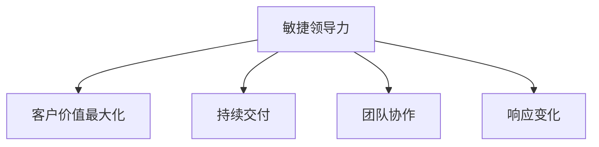

                 

### 引言与概述

在当今快速变化的技术环境中，大型应用开发的挑战日益严峻。传统的开发模式往往面临着需求变更频繁、开发周期长、成本高昂等问题。为了应对这些挑战，敏捷领导力作为一种新的管理方法，逐渐成为驱动大型应用开发需求变革的关键因素。

**关键词**：敏捷领导力、大型应用开发、需求变革、挑战与应对

**摘要**：本文旨在探讨敏捷领导力在大型应用开发中的重要性，分析其核心理论、实践应用、挑战与应对策略，并通过案例分析提供实际操作指南。文章结构如下：

1. 引言与概述：介绍敏捷领导力与大型应用开发的背景与联系。
2. 敏捷领导力核心理论：阐述敏捷领导力的基本概念、核心要素和关键技能。
3. 需求变革与敏捷领导力实践：分析需求变革的趋势，探讨敏捷领导力在需求管理中的应用和实践。
4. 大型应用开发中的挑战与应对：分析大型应用开发中的挑战，提出敏捷领导力的应对策略。
5. 敏捷领导力与组织文化：探讨敏捷领导力与组织文化的融合。
6. 案例分析与实践指南：通过案例分析，提供敏捷领导力的实践指南。

### 敏捷领导力的背景与重要性

敏捷领导力起源于软件开发领域，最早可以追溯到20世纪90年代。随着互联网的兴起和技术的快速变革，软件项目面临着需求变更频繁、开发周期短、竞争激烈等挑战。为了应对这些挑战，软件开发团队开始探索更加灵活和高效的工作方式，敏捷开发方法应运而生。

敏捷开发的核心原则包括客户价值最大化、持续交付、团队协作和响应变化等。敏捷领导力则是在这种环境下产生的管理思想，它强调领导者通过赋能团队、激发创造力、建立信任和实现透明度来推动项目成功。敏捷领导力不仅适用于软件开发，还可以广泛应用于大型应用开发的各个领域。

**核心概念与联系**

为了更好地理解敏捷领导力的核心概念，我们可以通过一个Mermaid流程图来展示其基本框架：

**核心概念与联系**

1. **客户价值最大化**：敏捷领导力强调始终关注客户需求，通过快速迭代和持续交付来确保客户价值最大化。
2. **持续交付**：敏捷领导力倡导频繁地交付可工作的软件，以便及时反馈和调整。
3. **团队协作**：敏捷领导力认为团队协作是成功的关键，领导者应致力于建立协作、互信的团队环境。
4. **响应变化**：敏捷领导力鼓励团队对变化保持开放态度，灵活调整计划以适应不断变化的需求。

### 大型应用开发的挑战

大型应用开发通常涉及多个部门、复杂的技术架构和庞大的项目规模，面临着诸多挑战：

1. **复杂性与不确定性**：大型应用开发的项目规模庞大，技术架构复杂，需求变更频繁，不确定性高。
2. **跨部门协作的难题**：大型应用开发涉及多个部门和团队，跨部门协作的效率和质量直接影响项目进度和成果。
3. **时间与成本控制**：大型应用开发周期长，成本高昂，如何在保证质量的前提下控制时间和成本是领导者的主要挑战。

### 敏捷领导力与大型应用开发的联系

敏捷领导力与大型应用开发之间存在紧密的联系。敏捷领导力通过以下方式驱动大型应用开发的需求变革：

1. **赋能团队**：敏捷领导力鼓励领导者赋予团队成员更多的自主权和决策权，激发团队的创造力和创新精神，提高团队的工作效率和成果。
2. **持续交付**：敏捷领导力强调频繁的交付和迭代，确保项目能够及时响应变更和客户需求，降低项目风险。
3. **响应变化**：敏捷领导力鼓励团队对变化保持开放态度，灵活调整计划和策略，以适应不断变化的需求和环境。
4. **跨部门协作**：敏捷领导力通过建立协作、互信的团队环境，促进跨部门的沟通和合作，提高项目协作效率和质量。

### 敏捷领导力核心理论

敏捷领导力是一种以客户价值为中心，以团队协作和持续交付为核心理念的管理方法。其核心理论包括以下几个方面：

1. **敏捷价值观与实践原则**：敏捷价值观包括客户满意、响应变化、持续交付、团队协作、开放沟通、简洁性和自组织等原则。
2. **核心要素**：敏捷领导力的核心要素包括自组织团队、持续交付、客户价值优先等。
3. **关键技能**：敏捷领导力要求领导者具备沟通与协作、决策能力、风险管理等关键技能。

#### 敏捷价值观与实践原则

敏捷价值观与实践原则是敏捷领导力的基石。以下是几个核心原则：

1. **客户满意**：始终关注客户需求，确保产品和服务能够满足客户期望。
2. **响应变化**：对需求变更保持开放态度，灵活调整计划和策略。
3. **持续交付**：频繁交付可工作的软件，确保客户能够及时获得价值。
4. **团队协作**：鼓励团队协作，共享知识和资源，共同实现目标。
5. **开放沟通**：建立透明、开放的沟通环境，促进信息共享和问题解决。
6. **简洁性**：避免过度设计，简化流程和架构，提高开发效率。
7. **自组织**：赋予团队成员更多的自主权和决策权，激发团队的创造力和创新精神。

#### 核心要素

敏捷领导力的核心要素包括以下几个方面：

1. **自组织团队**：自组织团队是敏捷领导力的核心，团队成员拥有明确的角色和职责，同时拥有一定的自主权和决策权，能够自我管理和自我调整。
2. **持续交付**：持续交付是敏捷领导力的关键实践，通过频繁的交付和迭代，确保项目能够及时响应变更和客户需求。
3. **客户价值优先**：敏捷领导力强调始终关注客户价值，确保项目投入和产出能够最大化地满足客户需求。

#### 关键技能

敏捷领导力要求领导者具备以下关键技能：

1. **沟通与协作**：领导者需要具备良好的沟通能力，能够有效地与团队成员、客户和利益相关者进行沟通和协作。
2. **决策能力**：领导者需要具备快速决策的能力，能够在不确定性和变化中做出明智的决策。
3. **风险管理**：领导者需要具备风险管理的能力，能够识别、评估和控制项目风险，确保项目能够按计划进行。

### 需求变革与敏捷领导力实践

在大型应用开发中，需求变更是一种常见且不可避免的挑战。传统的需求管理方法往往难以应对这种变革，导致项目进度延误、成本超支和质量下降。敏捷领导力通过一系列实践，有效地应对了需求变革的挑战。

#### 需求管理的变革

需求管理的变革主要体现在以下几个方面：

1. **需求的动态性**：传统的需求管理往往基于固定的需求文档，而敏捷领导力强调需求的动态性，通过持续的需求收集、分析和调整，确保需求能够及时反映市场和客户的变化。
2. **需求的优先级管理**：敏捷领导力通过优先级管理，确保项目资源和精力能够集中在最重要和最紧急的需求上，提高项目的价值产出。
3. **需求验证与反馈循环**：敏捷领导力通过频繁的需求验证和反馈循环，确保需求能够及时得到验证和调整，提高需求的准确性和可行性。

#### 敏捷领导力在需求管理中的应用

敏捷领导力在需求管理中的应用主要体现在以下几个方面：

1. **演进式需求开发**：敏捷领导力倡导演进式需求开发，通过逐步完善和细化需求，确保需求能够适应不断变化的环境。
2. **需求验证与反馈循环**：敏捷领导力强调通过频繁的需求验证和反馈循环，确保需求能够及时得到验证和调整，提高需求的准确性和可行性。
3. **需求优先级管理**：敏捷领导力通过优先级管理，确保项目资源和精力能够集中在最重要和最紧急的需求上，提高项目的价值产出。

#### 敏捷领导力在大型应用开发中的实践

在大型应用开发中，敏捷领导力通过以下实践，有效地应对了需求变革的挑战：

1. **拉式系统架构**：拉式系统架构是一种基于需求驱动和资源优化的架构方法，通过逐步构建和优化系统，确保系统能够灵活适应需求变化。
2. **小步快跑与迭代开发**：小步快跑与迭代开发是一种快速交付和迭代的方法，通过频繁的交付和迭代，确保项目能够及时响应变更和客户需求。
3. **人员与资源的优化配置**：敏捷领导力通过优化人员与资源的配置，确保项目团队能够高效协作，快速响应需求变化。

### 大型应用开发中的挑战与应对

在大型应用开发中，领导者面临着诸多挑战，包括复杂性与不确定性、跨部门协作的难题、时间与成本控制等。敏捷领导力通过一系列策略，有效地应对了这些挑战。

#### 挑战分析

1. **复杂性与不确定性**：大型应用开发通常涉及复杂的技术架构和庞大的项目规模，需求变更频繁，不确定性高，给项目带来了巨大的挑战。
2. **跨部门协作的难题**：大型应用开发涉及多个部门和团队，跨部门协作的效率和质量直接影响项目进度和成果。
3. **时间与成本控制**：大型应用开发周期长，成本高昂，如何在保证质量的前提下控制时间和成本是领导者的主要挑战。

#### 敏捷领导力的应对策略

1. **持续改进与适应变化**：敏捷领导力鼓励团队持续改进和适应变化，通过快速迭代和反馈循环，确保项目能够及时响应变更和客户需求。
2. **增强团队凝聚力**：敏捷领导力通过建立信任、鼓励协作和共享知识，增强团队凝聚力，提高团队协作效率和质量。
3. **优化沟通与协作机制**：敏捷领导力通过建立透明、开放的沟通环境和优化协作机制，提高跨部门协作的效率和质量。

### 敏捷领导力与组织文化

组织文化是影响敏捷领导力实施效果的重要因素。传统的组织文化往往强调权威、层级和规范化，与敏捷领导力所倡导的开放、协作和创新存在一定冲突。因此，在实施敏捷领导力时，组织文化的转变至关重要。

#### 组织文化的转变

1. **从权威到赋能**：传统的组织文化强调权威和层级，领导者拥有绝对的决策权。而敏捷领导力倡导领导者赋能团队，赋予团队成员更多的自主权和决策权。
2. **从规范化到灵活性**：传统的组织文化强调规范化和标准化，要求团队成员按照统一的标准进行工作。而敏捷领导力强调灵活性，鼓励团队成员根据实际情况进行调整和优化。
3. **从层级到扁平化**：传统的组织文化通常存在明显的层级结构，信息传递效率低下。而敏捷领导力倡导扁平化的组织结构，减少层级，提高信息传递速度和决策效率。

#### 敏捷领导力与组织文化的融合

1. **领导力模式的转变**：领导者需要从传统的权威模式转向赋能模式，鼓励团队成员参与决策和项目管理，激发团队的创造力和创新精神。
2. **文化变革的推动策略**：组织需要制定相应的文化变革策略，包括领导力培训、员工激励、企业文化宣传等，以推动敏捷领导力的有效实施。
3. **建立协作平台**：通过建立协作平台，促进团队成员之间的沟通和协作，提高团队整体的工作效率和质量。

### 案例分析与实践指南

通过案例分析，我们可以更深入地了解敏捷领导力在大型应用开发中的实际应用效果。以下是两个具体的案例分析：

#### 案例一：大型应用项目中的敏捷领导力实践

某公司正在开发一款大型企业级应用，项目规模庞大，涉及多个部门和技术团队。在项目初期，由于需求变更频繁，项目进度缓慢，成本不断上升。为了解决这些问题，公司引入了敏捷领导力。

1. **需求变革与敏捷领导力实践**：公司通过敏捷方法，对需求进行动态管理和优先级排序，确保项目能够快速响应变更。同时，引入了迭代开发和持续交付的实践，提高了项目的交付速度和质量。
2. **跨部门协作与应对策略**：公司建立了跨部门协作平台，通过定期的会议和沟通，确保各部门之间信息的畅通和协作的高效。同时，通过优化资源配置和增强团队凝聚力，提高了项目的整体效率。

#### 案例二：敏捷领导力在初创企业的应用

某初创企业正在开发一款创新性的移动应用，项目规模相对较小，但需求变更频繁，市场竞争激烈。为了在竞争中获得优势，公司采用了敏捷领导力。

1. **需求变革与敏捷领导力实践**：公司通过敏捷方法，对需求进行动态管理和优先级排序，确保项目能够快速响应变更。同时，引入了迭代开发和持续交付的实践，提高了项目的交付速度和质量。
2. **跨部门协作与应对策略**：公司建立了跨部门协作平台，通过定期的会议和沟通，确保各部门之间信息的畅通和协作的高效。同时，通过优化资源配置和增强团队凝聚力，提高了项目的整体效率。

#### 实践指南

1. **敏捷领导力实施步骤**：在实施敏捷领导力时，可以分为以下几个步骤：
    - **需求变革与敏捷领导力实践**：对需求进行动态管理和优先级排序，引入迭代开发和持续交付的实践。
    - **跨部门协作与应对策略**：建立跨部门协作平台，优化资源配置和增强团队凝聚力。
    - **领导力模式转变**：从传统的权威模式转向赋能模式，鼓励团队成员参与决策和项目管理。
    - **文化变革**：推动组织文化的转变，建立开放、协作和创新的文化氛围。

2. **领导者必备的技能与素质**：敏捷领导力要求领导者具备以下技能与素质：
    - **沟通与协作能力**：具备良好的沟通能力和协作能力，能够有效地与团队成员、客户和利益相关者进行沟通和协作。
    - **决策能力**：具备快速决策的能力，能够在不确定性和变化中做出明智的决策。
    - **风险管理能力**：具备风险管理的能力，能够识别、评估和控制项目风险，确保项目能够按计划进行。

3. **敏捷团队的建设与管理**：建立敏捷团队需要以下几个关键步骤：
    - **团队组建**：根据项目需求和特点，组建合适的敏捷团队，确保团队成员具备相应的技能和经验。
    - **团队协作**：通过定期的会议、沟通和协作，确保团队成员之间的信息共享和工作协同。
    - **团队激励**：通过激励措施，激发团队成员的工作热情和创造力，提高团队的整体绩效。

### 结语

敏捷领导力作为一种全新的管理方法，在大型应用开发中发挥了重要作用。通过本文的探讨，我们可以看到敏捷领导力在需求变革、团队协作、跨部门协作和项目风险控制等方面的优势。同时，我们也提出了具体的实践指南，以帮助领导者有效地实施敏捷领导力。然而，敏捷领导力并非一蹴而就，需要领导者、团队和组织共同的努力和持续改进。只有不断探索和实践，才能充分发挥敏捷领导力的潜力，推动大型应用开发的持续成功。作者：AI天才研究院/AI Genius Institute & 禅与计算机程序设计艺术 /Zen And The Art of Computer Programming

