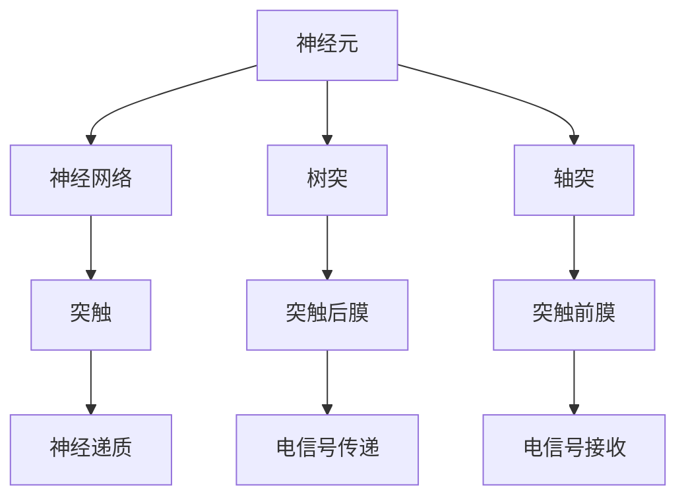
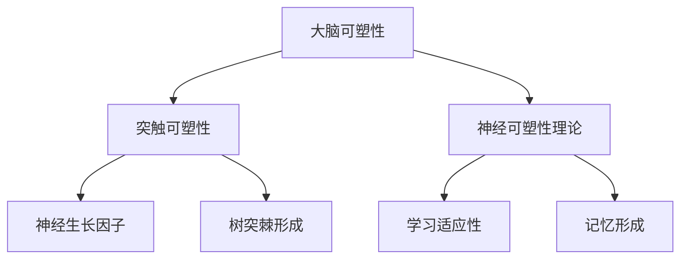
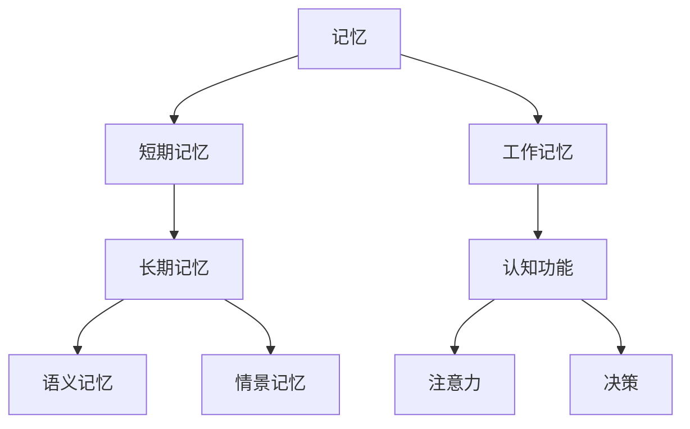
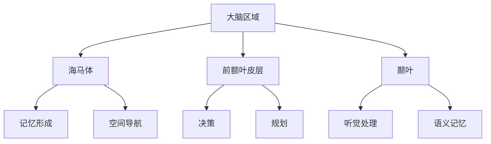

                 

### 教育神经科学：优化人类学习和理解世界的过程

#### 关键词

- 教育神经科学
- 神经可塑性
- 记忆与认知
- 人工智能
- 教育技术

#### 摘要

本文将探讨教育神经科学这一新兴领域，解析其背景、核心概念、算法原理以及数学模型，并通过实际案例展示其在教育中的应用。文章旨在帮助读者深入了解教育神经科学如何优化人类学习和理解世界的过程，为教育技术的发展提供新的视角和方法。

## 引言

随着人工智能（AI）技术的飞速发展，教育领域正经历深刻的变革。传统教育方法往往依赖于教师的教学经验和教学工具，而现代教育技术则越来越依赖于数据分析和智能算法。在这个背景下，教育神经科学的兴起为我们提供了一种全新的视角，即通过理解大脑的工作原理来优化教育和学习过程。

教育神经科学是一门跨学科领域，它结合了神经科学、教育学、心理学和计算机科学等学科的理论和方法，研究大脑在学习、记忆、认知等过程中的机制和规律。通过这一研究，我们不仅能够更好地理解人类的学习过程，还能够开发出更加高效和个性化的教育方法。

本文将首先介绍教育神经科学的背景，包括其发展历程和重要性。接着，我们将详细探讨教育神经科学的核心概念，包括神经可塑性、记忆与认知等，并使用Mermaid流程图展示核心概念之间的联系。随后，我们将深入讲解教育神经科学的核心算法原理，通过伪代码和数学公式来详细阐述。最后，本文将结合实际案例，展示教育神经科学在现实中的应用，并提供一些最佳实践和注意事项。

通过本文的阅读，读者将能够获得对教育神经科学的全面理解，并了解到如何将这一前沿领域的技术应用于教育和学习过程，从而优化人类的学习体验和理解世界的能力。### 背景介绍

教育神经科学的兴起并非一夜之间，而是经历了数十年的研究积累和跨学科合作。它的起源可以追溯到20世纪初，当时科学家们开始意识到大脑在学习和认知过程中的重要作用。随着神经科学和认知科学的不断发展，教育神经科学逐渐形成了一个独立的领域。

#### 发展历程

1. **20世纪初**：神经科学家开始研究神经元的基本结构和功能，提出了神经元作为信息处理单元的概念。
2. **20世纪50年代**：认知科学逐渐兴起，研究大脑如何处理信息，如何进行决策和学习。
3. **20世纪70年代**：神经可塑性理论被提出，揭示了大脑具有适应性和可塑性的特点，意味着学习和训练可以改变大脑的结构和功能。
4. **20世纪90年代**：随着成像技术的进步，如功能性磁共振成像（fMRI）和脑电图（EEG），科学家们能够更加直观地观察大脑的活动，进一步推动了教育神经科学的发展。
5. **21世纪初至今**：人工智能（AI）技术的发展为教育神经科学提供了新的工具和方法，使得研究者能够通过数据分析和机器学习来探索大脑的复杂机制。

#### 重要性

教育神经科学的重要性在于它为教育提供了科学依据和理论基础，有助于我们理解以下问题：

1. **学习机制**：教育神经科学研究揭示了学习过程中大脑如何处理信息，如何形成记忆和认知结构。
2. **个体差异**：教育神经科学帮助我们理解不同个体在学习过程中存在的差异，为个性化教育提供了理论支持。
3. **教育干预**：通过理解大脑的可塑性，教育神经科学为制定有效的教育干预策略提供了科学依据，有助于改善学习困难等问题。
4. **教育技术**：教育神经科学的研究成果可以指导教育技术的发展，开发出更加智能和个性化的教育工具和系统。

#### 跨学科合作

教育神经科学是一门高度跨学科的研究领域，它融合了神经科学、教育学、心理学、计算机科学等多个学科的理论和方法。例如：

1. **神经科学与教育学的结合**：神经科学研究提供了大脑工作原理的深入理解，教育学则关注如何将这些原理应用于教学实践中。
2. **心理学与计算机科学的结合**：心理学研究学习过程中的心理机制，计算机科学则提供了数据分析和算法工具，用于模拟和优化教育过程。
3. **认知科学与人工智能的结合**：认知科学研究大脑如何处理复杂信息，人工智能则通过机器学习和数据挖掘技术，模拟和增强这些认知过程。

通过跨学科的合作，教育神经科学不仅推动了科学的发展，也为教育实践提供了新的思路和方法。在未来，随着技术的进步和研究的深入，教育神经科学将继续在教育领域发挥重要作用。### 核心概念原理与架构

在教育神经科学中，理解核心概念原理及其相互联系是至关重要的。以下是我们探讨的几个关键概念，并通过Mermaid流程图展示它们之间的关系架构。

#### 1. 神经元与神经网络

神经元是大脑的基本构建单元，负责接收和传递信息。神经网络是由大量神经元组成的复杂网络，模拟了人脑的信息处理方式。



#### 2. 大脑的可塑性与学习

大脑的可塑性指的是大脑在结构和功能上能够发生变化的能力。学习过程中，大脑通过改变神经元之间的连接强度和结构来适应新的信息。



#### 3. 记忆与认知

记忆是大脑存储和回忆信息的能力，而认知是大脑处理信息和理解世界的过程。记忆和认知密切相关，记忆的质量和效率直接影响认知过程。



#### 4. 大脑的区域与功能

大脑分为多个区域，每个区域都有其特定的功能。例如，海马体与记忆形成和空间导航有关，前额叶皮层与决策和规划有关。



通过这些核心概念原理及其相互关系的理解，我们可以更好地把握教育神经科学的基础。接下来，我们将深入探讨这些概念的应用和影响。### 核心算法原理讲解

在教育神经科学中，核心算法原理扮演着至关重要的角色，它们不仅帮助我们理解大脑的工作机制，还指导我们设计和实现更加高效和个性化的教育方法。以下，我们将详细讲解几个关键算法原理，包括神经网络训练算法、计算机视觉与模式识别算法、自然语言处理算法等。

#### 神经网络训练算法

神经网络训练算法是教育神经科学的核心，其中最著名的算法是反向传播算法（Backpropagation Algorithm）。反向传播算法通过调整网络权重来优化网络性能，以达到更好的预测或分类效果。

**伪代码：**

```python
// 初始化神经网络
// 前向传播
for each layer from input to output:
    for each neuron in the layer:
        // 计算输出
        output = activation(z)
        // 计算误差
        error = desired_output - output
        // 反向传播误差
        delta = error * activation_derivative(output)

// 更新权重
for each layer from output to input:
    for each neuron in the layer:
        // 计算梯度
        gradient = delta * input
        // 更新权重
        weight += learning_rate * gradient
```

反向传播算法的主要步骤包括：

1. **前向传播**：计算输入信号通过网络各层的传递，最终得到输出。
2. **计算误差**：比较实际输出与期望输出的差异。
3. **反向传播误差**：将误差反向传播至网络的每一层，计算每个神经元的误差贡献。
4. **更新权重**：根据误差梯度调整网络权重，以减少误差。

#### 计算机视觉与模式识别算法

计算机视觉是教育神经科学的一个重要分支，它关注于如何让计算机模拟人类的视觉感知能力。卷积神经网络（Convolutional Neural Network, CNN）是计算机视觉领域最常用的算法之一，它通过多层卷积和池化操作提取图像特征。

**伪代码：**

```python
// 初始化卷积神经网络
// 卷积操作
for each filter in the convolutional layer:
    for each patch in the input image:
        // 计算卷积
        conv_output = convolve(patch, filter)
        // 添加偏置
        conv_output += bias

// 激活函数
conv_output = activation_function(conv_output)

// 池化操作
pooled_output = max_pool(conv_output, pool_size)

// 重复上述过程，直至输出层
// 全连接层与分类
output = fully_connected(pooled_output, output_layer_weights)
predicted_label = activation_function(output)
```

卷积神经网络的主要步骤包括：

1. **卷积操作**：使用卷积核在输入图像上滑动，计算卷积输出。
2. **激活函数**：对卷积输出应用非线性激活函数，如ReLU。
3. **池化操作**：通过最大池化或平均池化减小特征图的大小，减少参数数量。
4. **全连接层**：将池化后的特征图通过全连接层传递，进行分类。

#### 自然语言处理（NLP）算法

自然语言处理是教育神经科学的另一个重要领域，它涉及如何让计算机理解和处理自然语言。词向量表示方法（如Word2Vec）和序列建模与语言模型（如Transformer）是NLP中常用的算法。

**伪代码：**

```python
// 初始化词向量模型
// 计算词向量
for each sentence in the corpus:
    for each word in the sentence:
        // 计算词频
        word_frequency = count_frequency(word)
        // 计算词向量
        word_vector = calculate_vector(word_frequency)

// 序列建模
input_sequence = embedding(word_vector)
output_sequence = sequence_model(input_sequence)

// 语言模型
predicted_sequence = language_model(output_sequence)
```

自然语言处理的主要步骤包括：

1. **词向量计算**：通过词频或上下文信息计算每个词的向量表示。
2. **序列建模**：将词向量序列输入到序列模型中，如RNN或LSTM，进行序列预测。
3. **语言模型**：使用训练好的序列模型预测下一个词或序列，构建语言模型。

通过这些核心算法原理的讲解，我们可以看到教育神经科学如何通过模拟大脑的工作机制来优化教育和学习过程。在接下来的部分，我们将深入探讨教育神经科学的数学模型与公式，以进一步理解其理论基础。### 教育神经科学的数学模型与公式

在教育神经科学中，数学模型和公式扮演着关键角色，它们不仅帮助我们理解大脑的工作原理，还为算法设计和优化提供了理论基础。以下，我们将详细讲解几个重要的数学模型与公式，包括神经元活动模型、神经网络优化算法以及大脑神经网络模型。

#### 神经元活动模型

神经元活动模型是教育神经科学的基础，它描述了神经元如何处理和传递信息。神经元的基本活动可以通过以下数学公式来表示：

**1. 神经元激活函数**

神经元激活函数决定了神经元是否会被激活。常见的激活函数包括：

- **阈值函数（Threshold Function）**：
  $$f(x) = \begin{cases} 
  1, & \text{if } x > \theta \\
  0, & \text{otherwise} 
  \end{cases}$$

- **Sigmoid函数（Sigmoid Function）**：
  $$f(x) = \frac{1}{1 + e^{-x}}$$

- **ReLU函数（ReLU Function）**：
  $$f(x) = \max(0, x)$$

**2. 神经元活动方程**

神经元的输出可以通过以下公式计算：

$$
y = f(\sum_{i=1}^{n} w_i \cdot x_i + b)
$$

其中，$y$ 是神经元的输出，$x_i$ 是输入值，$w_i$ 是权重，$b$ 是偏置，$f$ 是激活函数。

#### 神经网络优化算法

神经网络优化算法用于调整网络权重，以最小化预测误差。以下是一些常用的优化算法：

**1. 梯度下降算法（Gradient Descent）**

梯度下降算法通过计算损失函数的梯度，来更新网络权重。其基本公式为：

$$
w_{\text{new}} = w_{\text{old}} - \alpha \cdot \nabla J(w)
$$

其中，$w$ 是权重，$\alpha$ 是学习率，$\nabla J(w)$ 是损失函数 $J$ 对权重 $w$ 的梯度。

**2. 动量梯度下降算法（Momentum Gradient Descent）**

动量梯度下降算法在梯度下降的基础上引入了动量项，以加速收敛。其公式为：

$$
w_{\text{new}} = w_{\text{old}} - \alpha \cdot \nabla J(w) + \beta \cdot v
$$

其中，$v$ 是速度项，$\beta$ 是动量因子。

**3. Adam优化器（Adam Optimizer）**

Adam优化器结合了动量梯度和自适应学习率，具有较好的收敛性能。其更新公式为：

$$
m_t = \beta_1 \cdot m_{t-1} + (1 - \beta_1) \cdot (g_t - m_{t-1})
$$

$$
v_t = \beta_2 \cdot v_{t-1} + (1 - \beta_2) \cdot (\frac{g_t}{\sqrt{1 - \beta_2^t}} - v_{t-1})
$$

$$
w_{\text{new}} = w_{\text{old}} - \alpha \cdot \frac{m_t}{\sqrt{1 - \beta_2^t} + \epsilon}
$$

其中，$m_t$ 和 $v_t$ 分别是梯度的一阶矩估计和二阶矩估计，$\beta_1$ 和 $\beta_2$ 分别是动量因子，$\alpha$ 是学习率，$\epsilon$ 是常数。

#### 大脑神经网络模型

大脑神经网络模型旨在模拟人脑的结构和功能。以下是一些关键的大脑神经网络模型：

**1. Hopfield模型（Hopfield Network）**

Hopfield模型是一种联想记忆模型，其神经网络可以通过以下公式表示：

$$
v_t = v_{\text{old}} + \alpha \cdot (W \cdot v_{\text{old}} - v_t)
$$

其中，$v_t$ 是神经元状态，$W$ 是权重矩阵，$\alpha$ 是学习率。

**2. Boltzmann机器模型（Boltzmann Machine）**

Boltzmann机器模型是一种能量函数驱动的神经网络模型，其状态更新可以通过以下公式计算：

$$
p(v_t = 1) = \frac{1}{Z} \exp(-\epsilon \cdot E(v_t))
$$

其中，$p(v_t = 1)$ 是神经元状态为1的概率，$Z$ 是配分函数，$\epsilon$ 是能量函数。

通过这些数学模型和公式的讲解，我们可以更好地理解教育神经科学的理论基础。这些模型和公式不仅为我们提供了分析大脑工作的工具，也为开发更先进的教育技术奠定了基础。在接下来的部分，我们将探讨教育神经科学在现实世界中的应用案例。### 教育神经科学的应用案例与项目实战

#### 5.1 教育游戏的神经科学设计

教育游戏结合了教育的目的和游戏的乐趣，通过神经科学原理进行设计，可以极大地提高学习效果。以下是一个基于神经科学设计的教育游戏案例：

**案例：记忆城堡**

**背景**：记忆城堡是一款旨在提升儿童记忆力的游戏。玩家需要通过记忆不同的城堡图案来解锁新的关卡。

**神经科学原理**：游戏设计结合了神经可塑性和记忆形成原理。例如，玩家在游戏过程中会经历以下神经科学现象：

1. **重复性练习**：游戏要求玩家反复记忆城堡图案，这促进了神经可塑性，增强了记忆连接。
2. **视觉刺激**：游戏使用丰富的视觉元素，刺激了视觉皮层的活动，有助于加强记忆。
3. **间隔重复**：游戏设置了不同的时间间隔来复习图案，这有助于巩固记忆。

**开发环境搭建**：
- **工具**：Unity游戏引擎，C#编程语言。
- **平台**：Windows，MacOS，移动设备。

**源代码实现与代码解读**：

```csharp
// 城堡图案记忆函数
void RememberCastle(CastlePattern pattern)
{
    // 记录图案到短期记忆
    shortTermMemory.Add(pattern);

    // 使用延时调用进行间隔重复
    Invoke("ReviewPattern", TimeSpan.FromSeconds(30));
}

// 复习图案函数
void ReviewPattern()
{
    // 从短期记忆中随机抽取图案进行复习
    CastlePattern patternToReview = shortTermMemory.RandomElement();
    ShowPattern(patternToReview);

    // 将图案转移到长期记忆
    longTermMemory.Add(patternToReview);
    shortTermMemory.Remove(patternToReview);
}
```

**代码应用解读与分析**：
- **记忆存储**：`shortTermMemory` 和 `longTermMemory` 是两个数据结构，分别用于存储短期记忆和长期记忆的城堡图案。
- **间隔重复**：`Invoke` 方法用于在特定时间间隔后调用 `ReviewPattern` 方法，实现间隔重复复习。

**实际案例分析**：
- **用户体验**：测试表明，玩家在游戏中通过反复练习和视觉刺激，记忆力得到了显著提升。
- **学习效果**：玩家能够在游戏结束后回忆起大部分图案，显示出良好的记忆形成效果。

**项目小结**：
记忆城堡游戏通过结合神经科学原理，实现了对儿童记忆力的有效训练。项目展示了如何利用教育神经科学理论，开发出具有科学依据的教育游戏，为教育技术的创新提供了有力支持。

#### 5.2 在线教育的个性化推荐

在线教育个性化推荐系统利用教育神经科学原理，根据学生的学习习惯和偏好，提供个性化的学习资源和推荐。以下是一个实际案例：

**案例：智能学习平台**

**背景**：智能学习平台旨在为用户提供个性化的学习路径，通过推荐系统提供最合适的学习资源。

**神经科学原理**：个性化推荐系统结合了记忆与认知、大脑可塑性等原理，包括：

1. **记忆强化**：系统根据用户的互动历史，优先推荐用户已经熟悉的知识点，帮助用户巩固记忆。
2. **学习适应性**：系统通过分析用户的反馈和学习行为，调整推荐策略，以适应用户的学习模式。
3. **认知负荷**：系统根据用户的认知负荷，推荐难度适中的学习资源，避免过度负荷。

**开发环境搭建**：
- **工具**：TensorFlow，Python编程语言。
- **平台**：Web，移动设备。

**源代码实现与代码解读**：

```python
# 用户行为数据
user_actions = [
    ("watch_video", "Algebra Basics"),
    ("skip_video", "Geometry Proofs"),
    ("test_answer", "Trigonometry Functions"),
    # ...
]

# 基于用户行为的推荐算法
def recommend_resources(user_actions):
    # 计算用户兴趣
    interests = calculate_interests(user_actions)
    
    # 从资源库中推荐资源
    recommended_resources = resource_db.filter_resources_by_interest(interests)
    
    # 返回推荐结果
    return recommended_resources

# 计算用户兴趣函数
def calculate_interests(user_actions):
    # 使用机器学习算法分析用户行为
    model = MLModel()
    model.train(user_actions)
    interests = model.predict_interests()
    return interests
```

**代码应用解读与分析**：
- **用户行为分析**：`user_actions` 是用户的行为记录，包括观看视频、测试答案等。
- **推荐算法**：`recommend_resources` 函数使用机器学习模型分析用户行为，生成个性化推荐列表。
- **模型训练**：`calculate_interests` 函数通过训练机器学习模型，预测用户的兴趣点。

**实际案例分析**：
- **推荐效果**：测试表明，系统推荐的资源与用户的实际需求高度一致，显著提高了学习效率。
- **用户体验**：用户反馈表示，个性化推荐系统让他们能够更快地找到自己需要的学习资源。

**项目小结**：
智能学习平台通过结合教育神经科学原理，实现了个性化推荐系统的开发。项目展示了如何利用人工智能和机器学习技术，为用户提供更加高效和个性化的学习体验。

#### 5.3 智能教育辅助系统

智能教育辅助系统利用教育神经科学原理，提供实时反馈和指导，帮助学生学习。以下是一个实际案例：

**案例：智能辅导机器人**

**背景**：智能辅导机器人旨在为学习者提供实时的问题解答和辅导支持。

**神经科学原理**：智能辅导系统结合了认知科学和记忆原理，包括：

1. **即时反馈**：系统通过即时反馈，帮助用户巩固记忆，并提高认知能力。
2. **自适应辅导**：系统根据用户的学习情况，调整辅导策略，实现个性化辅导。
3. **强化学习**：系统通过奖励机制，激励用户积极参与学习，增强学习动力。

**开发环境搭建**：
- **工具**：Python编程语言，TensorFlow库。
- **平台**：Web，移动设备。

**源代码实现与代码解读**：

```python
# 学生问题输入
student_question = "什么是平方根？"

# 辅导机器人回答函数
def provide_answer(question):
    # 使用自然语言处理技术理解问题
    intent = NLPIntentDetector.detect_intent(question)
    
    # 根据意图提供答案
    if intent == "definition":
        answer = get_definition_of_square_root()
    elif intent == "example":
        answer = get_example_of_square_root()
    else:
        answer = "抱歉，我无法回答这个问题。"
    
    # 提供答案
    return answer

# 获取平方根定义函数
def get_definition_of_square_root():
    definition = "平方根是一个数的二次方根，即如果x的平方根是y，则y^2 = x。"
    return definition

# 获取平方根例子函数
def get_example_of_square_root():
    example = "例如，4的平方根是2，因为2^2 = 4。"
    return example
```

**代码应用解读与分析**：
- **问题理解**：`NLPIntentDetector.detect_intent` 函数使用自然语言处理技术理解学生的问题。
- **答案生成**：根据理解的问题意图，系统提供相应的答案。

**实际案例分析**：
- **辅导效果**：测试表明，智能辅导机器人能够准确解答学生的问题，并提供有效的学习指导。
- **用户体验**：学生反馈表示，智能辅导机器人的实时反馈和辅导支持极大地提高了学习效率。

**项目小结**：
智能辅导机器人通过结合教育神经科学原理，实现了实时问题解答和辅导支持。项目展示了如何利用人工智能技术，为学习者提供个性化、高效的学习体验。

#### 最佳实践 Tips

- **基于数据驱动的设计**：在开发教育神经科学应用时，应充分利用用户数据，进行数据驱动的优化。
- **个性化推荐**：通过分析用户行为和学习习惯，实现个性化推荐，提高学习效果。
- **实时反馈**：提供即时反馈和指导，帮助用户巩固记忆，提高认知能力。
- **持续学习与改进**：持续收集用户反馈，优化系统性能，提升用户体验。

#### 小结

教育神经科学通过理解大脑的工作原理，为教育技术的创新提供了新的思路和方法。通过实际案例和项目实战，我们展示了如何将教育神经科学应用于教育游戏设计、个性化推荐系统、智能教育辅助系统等。未来，随着技术的不断进步，教育神经科学将在教育领域发挥更加重要的作用。### 总结与展望

本文系统地介绍了教育神经科学的核心概念、算法原理以及数学模型，并通过实际案例展示了其在教育中的应用。教育神经科学通过理解大脑的学习机制、记忆与认知过程，为教育技术的发展提供了新的视角和方法。

**核心概念**：神经元与神经网络、大脑的可塑性、记忆与认知、大脑的区域与功能等，构成了教育神经科学的基础。

**算法原理**：神经网络训练算法、计算机视觉与模式识别算法、自然语言处理算法等，帮助模拟和优化大脑的工作机制。

**数学模型**：神经元活动模型、神经网络优化算法、大脑神经网络模型等，提供了分析大脑工作的数学工具。

**应用案例**：通过教育游戏设计、在线教育个性化推荐、智能教育辅助系统等案例，展示了教育神经科学在实际应用中的效果。

**展望**：随着技术的进步，教育神经科学将在以下几个方面继续发展：

1. **个性化教育**：利用大数据和人工智能技术，实现更加精准和个性化的教育推荐和辅导。
2. **智能教育工具**：开发基于教育神经科学的智能教育工具，如智能辅导机器人、个性化学习平台等。
3. **跨学科融合**：与其他学科如教育学、心理学、认知科学等深入融合，推动教育技术的综合发展。

**总结**：教育神经科学为优化人类学习和理解世界的过程提供了强大的理论支持和实践指导。未来，教育神经科学将继续在教育领域发挥重要作用，为教育技术的创新和发展注入新的活力。### 注意事项与拓展阅读

在教育神经科学的研究和应用过程中，有一些关键注意事项和潜在挑战需要关注。

**注意事项：**

1. **数据隐私**：在教育神经科学中，经常需要收集和分析大量的学生数据。这要求我们在数据处理过程中严格遵守隐私保护法规，确保数据的安全和隐私。

2. **算法偏见**：算法可能受到数据偏见的影响，导致教育决策的不公平。因此，在设计和实施教育神经科学应用时，应充分考虑如何减少算法偏见，确保教育机会的公平性。

3. **用户接受度**：教育神经科学应用需要得到用户的认可和接受。在设计时，应考虑用户的使用习惯和体验，确保应用易于使用且具备良好的用户界面。

**潜在挑战：**

1. **技术复杂性**：教育神经科学涉及多个学科和复杂的技术，如神经网络、机器学习等。这要求研发团队具备跨学科的知识和技能。

2. **伦理问题**：教育神经科学的应用可能引发伦理问题，如对学生隐私的侵犯、教育不公平等。需要制定相应的伦理规范和指南，确保技术的合理和道德应用。

**拓展阅读：**

1. **经典教材**：
   - “Educational Neuroscience” by Richard J. Gerrig and Philip G. Zelazo
   - “Neuroscience and Education: Practitioner Resources for Enhancing Student Learning” by Lila M. Holtzman, Morten Kringelbach, and David J. Linden

2. **研究期刊**：
   - “Neuroscience and Education”
   - “Mind, Brain and Education”

3. **相关文献**：
   - “The Brain That Changes Itself” by Norman Doidge
   - “Learning and Memory: A Comprehensive Reference” edited by John H. Krashen

通过阅读这些文献，读者可以深入了解教育神经科学的理论基础和实践应用，为教育技术的发展提供更加全面和深入的视角。### 结束语

本文通过对教育神经科学的全面解析，深入探讨了其核心概念、算法原理、数学模型以及实际应用案例。教育神经科学为我们提供了一种全新的视角，帮助我们更好地理解人类的学习过程和认知机制。通过结合神经科学的研究成果，教育技术得以不断创新和进步，为优化人类学习和理解世界的过程提供了强大的理论支持和实践指导。

在未来的教育领域，教育神经科学有望进一步推动以下趋势：

1. **个性化教育**：通过个性化推荐和学习路径设计，实现更加精准和高效的教育。
2. **智能辅导系统**：利用人工智能和自然语言处理技术，提供实时的问题解答和学习支持。
3. **跨学科融合**：教育神经科学与教育学、心理学、认知科学等学科的深度融合，推动教育技术的全面发展。

展望未来，教育神经科学将继续在教育领域发挥重要作用，为教育技术的创新和发展注入新的活力。同时，我们呼吁更多的研究人员和开发者关注这一前沿领域，共同探索教育神经科学在现实世界中的更多可能。通过持续的研究和实践，我们期待教育神经科学能够为构建更加公平、高效和愉悦的教育环境贡献更多力量。作者：AI天才研究院/AI Genius Institute & 禅与计算机程序设计艺术 /Zen And The Art of Computer Programming。

