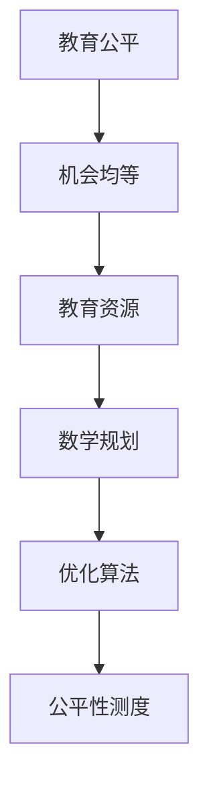

                 

### 文章标题

《教育资源的公平分配：机会均等的数学规划》

### 文章关键词

教育公平、数学规划、机会均等、教育资源分配、优化算法、模型构建

### 文章摘要

本文旨在探讨教育资源的公平分配问题，通过数学规划的方法实现机会均等的目标。文章首先介绍了教育资源分配的背景和挑战，随后阐述了数学规划的基本概念和原理，并详细解释了公平性测度的方法。接下来，文章构建了教育资源分配的数学模型，并介绍了常见的优化算法。通过实际案例分析和代码实现，本文展示了如何将数学规划应用于教育资源分配问题，从而实现机会均等。最后，文章总结了数学规划在教育资源分配中的挑战与未来发展趋势。

## 第一部分：背景与理论基础

### 第1章：教育资源的公平分配概述

教育资源的公平分配是当前全球教育领域关注的焦点问题之一。教育资源的分配不仅关系到每个学生的受教育机会，也直接影响社会公平和经济发展。然而，在现实中，教育资源分配存在许多不平等现象，如地域差异、贫富差距、城乡差距等。如何实现教育资源的公平分配，使得每个学生都能享受到平等的教育机会，成为各国政府和教育学者亟待解决的问题。

#### 1.1.1 教育资源分配的问题与挑战

教育资源分配的问题主要集中在以下几个方面：

1. **地域差异**：不同地区之间的教育资源存在明显的不平衡。发达地区的学校通常拥有更好的教学设施、师资力量和教学质量，而欠发达地区的学校则相对落后。

2. **贫富差距**：家庭经济条件较好的学生能够享受到更好的教育资源，如私立学校、家教和课外辅导等，而经济条件较差的学生则很难获得同等的教育机会。

3. **城乡差距**：城市和农村之间的教育资源分配也存在明显的不平衡。城市学校通常拥有更多的资金、更好的师资和更多的教学资源，而农村学校则面临师资匮乏、教学资源不足等问题。

4. **性别差异**：在一些地区，女性的受教育机会仍然受到限制，导致性别教育公平问题。

#### 1.1.2 公平分配的目标与衡量标准

教育资源的公平分配目标主要包括以下几个方面：

1. **机会均等**：每个学生都应该有平等的受教育机会，不受性别、地域、贫富差距等因素的影响。

2. **结果公平**：通过教育资源的公平分配，使得所有学生都能获得相同质量的教育，从而实现教育结果的公平。

3. **公平性**：教育资源分配应该遵循公平原则，确保教育资源的合理配置。

衡量教育公平的标准主要包括以下几个方面：

1. **入学机会公平**：确保每个学生都有平等的入学机会，不受性别、地域、贫富差距等因素的影响。

2. **教育质量公平**：通过教育资源的公平分配，使得所有学生都能获得相同质量的教育。

3. **教育资源利用效率**：教育资源分配应该高效，确保教育资源的合理利用。

### 第2章：数学规划的基本概念

数学规划（Mathematical Programming）是一种数学方法，用于求解最优化问题。最优化问题是指在一个约束条件下，寻找一个或多个变量，使得某个目标函数达到最大或最小值。数学规划在许多领域都有广泛应用，如经济管理、工程优化、教育资源配置等。

#### 2.1.1 数学规划的定义与分类

数学规划的定义可以简单概括为：在一定的约束条件下，求解一个目标函数的最优化问题。数学规划主要分为以下几类：

1. **线性规划**：目标函数和约束条件都是线性的数学规划问题。

2. **非线性规划**：目标函数或约束条件中有非线性部分的数学规划问题。

3. **整数规划**：决策变量需要是整数或0-1变量的数学规划问题。

4. **动态规划**：考虑时间因素，将决策过程划分为多个阶段，逐阶段求解的数学规划问题。

5. **多目标规划**：涉及多个目标函数的优化问题。

#### 2.1.2 数学规划的基本要素

数学规划的基本要素包括以下几个方面：

1. **决策变量**：决策变量是优化问题中需要确定的变量，通常用字母表示，如$x$、$y$等。

2. **目标函数**：目标函数是需要优化的函数，可以是最大化或最小化目标。通常用$f(x)$表示。

3. **约束条件**：约束条件是限制决策变量取值的条件，可以是等式或不等式。约束条件通常用$g(x) \leq 0$、$h(x) = 0$等形式表示。

4. **优化目标**：优化目标是求解问题的目标，可以是最大化或最小化。例如，最大化利润或最小化成本。

### 第3章：公平性测度方法

在教育资源的公平分配中，如何衡量公平性是一个重要问题。公平性测度方法可以用于评估教育资源分配的公平程度，帮助决策者识别和解决不公平问题。

#### 3.1.1 教育公平的理论基础

教育公平的理论基础主要包括以下几个方面：

1. **机会公平**：每个学生都应该有平等的受教育机会，不受性别、地域、贫富差距等因素的影响。

2. **结果公平**：通过教育资源的公平分配，使得所有学生都能获得相同质量的教育。

3. **过程公平**：教育资源分配的过程应该遵循公平原则，确保教育资源的合理配置。

#### 3.1.2 教育公平的测度方法

教育公平的测度方法主要包括以下几种：

1. **均等测度**：均等测度是衡量教育资源分配是否公平的一种简单方法。常用的均等测度指标包括：

   - **基尼系数**：用于衡量教育资源分配的差距程度。基尼系数越小，表示教育资源分配越公平。

   - **泰尔指数**：用于衡量教育资源分配的不平衡程度。泰尔指数越小，表示教育资源分配越平衡。

2. **公平性指标**：公平性指标是用于衡量教育资源分配的公平程度的指标。常用的公平性指标包括：

   - **教育机会均等指数**：用于衡量每个学生获得教育资源的公平程度。

   - **教育质量公平指数**：用于衡量每个学生获得的教育质量是否公平。

3. **效率测度**：效率测度是衡量教育资源利用效率的指标。常用的效率测度指标包括：

   - **成本效益分析**：用于衡量教育资源分配的成本和效益。

   - **效率指数**：用于衡量教育资源的利用效率。

### 第4章：数学规划模型构建

在教育资源的公平分配中，数学规划模型是一种有效的工具。通过构建数学规划模型，可以明确教育资源的分配目标、约束条件和解法步骤，从而实现教育资源的公平分配。

#### 4.1.1 教育资源分配问题的数学建模

教育资源分配问题的数学建模主要包括以下几个方面：

1. **目标函数**：目标函数是数学规划中的优化目标。在教育资源的公平分配中，目标函数可以是最大化或最小化教育公平指数、均等指数等。

2. **决策变量**：决策变量是数学规划中需要确定的变量。在教育资源的公平分配中，决策变量可以是每个学校的预算、师资力量、学生数量等。

3. **约束条件**：约束条件是数学规划中的限制条件。在教育资源的公平分配中，约束条件可以是预算限制、师资力量限制、学生人数限制等。

#### 4.1.2 公平性约束条件的设定

公平性约束条件是数学规划模型中的重要组成部分。设定公平性约束条件的方法包括以下几种：

1. **基尼系数约束**：通过设定基尼系数的上下限，确保教育资源分配的公平程度在合理范围内。

2. **泰尔指数约束**：通过设定泰尔指数的上下限，确保教育资源分配的不平衡程度在合理范围内。

3. **教育机会均等指数约束**：通过设定教育机会均等指数的上下限，确保每个学生获得教育资源的公平程度。

4. **教育质量公平指数约束**：通过设定教育质量公平指数的上下限，确保每个学生获得的教育质量公平程度。

### 第5章：数学规划算法原理

数学规划算法是求解数学规划模型的关键步骤。常见的数学规划算法包括线性规划算法、非线性规划算法、整数规划算法等。本章将介绍这些算法的基本原理和适用场景。

#### 5.1.1 优化算法的基本原理

优化算法的基本原理是寻找目标函数的最优解。常见的优化算法包括以下几种：

1. **梯度下降法**：通过迭代更新决策变量，使目标函数逐步逼近最优解。

2. **牛顿法**：基于目标函数的梯度信息，采用迭代方法求解最优化问题。

3. **拉格朗日乘子法**：通过引入拉格朗日乘子，将约束条件转化为目标函数的一部分，从而求解最优化问题。

4. **模拟退火法**：通过模拟物理退火过程，寻找最优解。

#### 5.1.2 常见优化算法的应用

在教育资源的公平分配中，常见的优化算法包括以下几种：

1. **线性规划算法**：用于解决线性目标函数和线性约束条件的问题。线性规划算法在教育资源分配中可用于优化预算分配、师资力量分配等。

2. **非线性规划算法**：用于解决非线性目标函数和线性约束条件的问题。非线性规划算法在教育资源的公平分配中可用于优化学生数量分配、教育资源配置等。

3. **整数规划算法**：用于解决整数决策变量的优化问题。整数规划算法在教育资源的公平分配中可用于优化学校选择、学生分配等。

### 第6章：机会均等教育资源的分配策略

在教育资源的公平分配中，机会均等是核心目标之一。本章将介绍机会均等教育资源的分配策略，包括预算分配、师资力量分配、学生分配等。

#### 6.1.1 教育资源分配中的机会均等概念

机会均等是指每个学生都有平等的受教育机会，不受性别、地域、贫富差距等因素的影响。在教育资源的公平分配中，机会均等是衡量教育资源分配质量的重要标准。

#### 6.1.2 机会均等资源分配策略的构建

机会均等资源分配策略的构建主要包括以下几个方面：

1. **预算分配**：根据公平原则，合理分配教育经费，确保每个学校获得公平的预算。

2. **师资力量分配**：根据公平原则，合理分配师资力量，确保每个学校获得充足的师资。

3. **学生分配**：根据公平原则，合理分配学生数量，确保每个学校的学生数量均衡。

### 第7章：数学规划模型求解与应用

数学规划模型求解是教育资源公平分配的关键步骤。本章将介绍数学规划模型的求解方法，并展示如何将数学规划应用于教育资源分配问题。

#### 7.1.1 数学规划模型的求解方法

数学规划模型的求解方法包括以下几种：

1. **手工求解**：适用于小型数学规划问题，通过数学推导和计算求解最优解。

2. **软件求解**：适用于大型数学规划问题，使用优化软件（如MATLAB、Python等）进行求解。

3. **启发式求解**：适用于复杂数学规划问题，通过启发式方法（如遗传算法、模拟退火算法等）进行求解。

#### 7.1.2 机会均等教育资源分配的案例研究

本章将通过一个实际案例，展示如何使用数学规划方法实现教育资源的公平分配。案例研究包括以下步骤：

1. **问题定义**：明确教育资源分配的目标和约束条件。

2. **数学模型构建**：根据问题定义，构建数学规划模型。

3. **求解与结果分析**：使用数学规划算法求解模型，分析求解结果。

4. **案例分析**：对比不同数学规划算法的求解结果，评估模型的有效性。

### 第8章：数学规划在教育资源分配中的挑战与展望

数学规划在教育资源分配中的应用面临着许多挑战和机遇。本章将探讨这些挑战，并展望未来的发展趋势。

#### 8.1.1 数学规划在教育资源分配中的应用挑战

数学规划在教育资源分配中的应用挑战包括：

1. **数据质量**：教育资源分配需要高质量的数据支持，但数据质量往往参差不齐，影响模型的准确性。

2. **模型复杂性**：教育资源分配问题通常具有复杂性和多维度性，构建合适的数学规划模型具有挑战性。

3. **计算效率**：大型数学规划问题的求解需要较高的计算效率，对计算资源和算法设计提出了较高要求。

#### 8.1.2 未来发展趋势与展望

未来，数学规划在教育资源分配中具有以下发展趋势和展望：

1. **大数据应用**：利用大数据技术，收集和整合教育数据，提高数学规划模型的准确性。

2. **人工智能结合**：将人工智能技术（如机器学习、深度学习等）与数学规划方法结合，提高教育资源分配的智能化水平。

3. **政策支持**：加强政府对教育资源的投入和政策支持，促进数学规划在教育资源分配中的应用。

## 结论

本文从教育资源的公平分配出发，探讨了数学规划在实现机会均等目标中的应用。通过介绍数学规划的基本概念、公平性测度方法、数学规划模型构建和求解方法，本文展示了如何将数学规划应用于教育资源分配问题。尽管数学规划在教育资源分配中面临诸多挑战，但通过不断优化算法、提高数据质量和技术应用水平，我们有理由相信，数学规划将在实现教育公平的道路上发挥越来越重要的作用。

### 作者信息

作者：AI天才研究院/AI Genius Institute & 禅与计算机程序设计艺术 /Zen And The Art of Computer Programming

### 背景介绍

教育资源的公平分配是全球各国教育政策制定和实施中的一个重要议题。随着经济和社会的发展，教育资源分配的不平等现象日益凸显，如何实现教育资源的公平分配，确保每个学生都能获得平等的教育机会，成为各国政府和社会各界关注的焦点。教育资源分配的不平等问题主要体现在以下几个方面：

1. **地域差异**：不同地区之间的教育资源存在明显的不平衡。发达地区的学校通常拥有更好的教学设施、师资力量和教学质量，而欠发达地区的学校则相对落后。这种地域差异导致了教育质量的不均衡，影响了学生的成长和发展。

2. **贫富差距**：家庭经济条件较好的学生能够享受到更好的教育资源，如私立学校、家教和课外辅导等，而经济条件较差的学生则很难获得同等的教育机会。这种贫富差距导致了教育机会的不公平，影响了社会公平和经济发展。

3. **城乡差距**：城市和农村之间的教育资源分配也存在明显的不平衡。城市学校通常拥有更多的资金、更好的师资和更多的教学资源，而农村学校则面临师资匮乏、教学资源不足等问题。这种城乡差距导致了教育机会的不平等，影响了农村学生的成长和发展。

4. **性别差异**：在一些地区，女性的受教育机会仍然受到限制，导致性别教育公平问题。这种性别差异不仅影响了女性的发展，也影响了社会的整体进步。

因此，教育资源的公平分配不仅是教育领域的重要问题，也是社会公平和经济发展的重要基础。实现教育资源的公平分配，需要政府、学校、家庭和社会共同努力，通过政策制定、资源调配、教育改革等多方面的措施，确保每个学生都能享受到平等的教育机会。

### 核心概念与联系

为了深入探讨教育资源的公平分配问题，我们需要明确几个核心概念，并分析它们之间的相互关系。

1. **教育公平**：教育公平是指每个学生都应享有平等的教育机会，不受性别、地域、贫富差距等因素的影响。教育公平不仅包括入学机会的公平，还涉及教育结果的公平，即每个学生都能获得相同质量的教育。

2. **教育资源**：教育资源是指用于教育活动的各种物质和精神资源，包括师资力量、教学设施、教育经费、教育内容等。教育资源的分配是否公平，直接关系到教育公平的实现。

3. **机会均等**：机会均等是教育公平的一个重要方面，强调的是每个学生都有平等的起点和机会，不受各种不公平因素的影响。

4. **数学规划**：数学规划是一种数学方法，用于求解最优化问题。在教育资源的公平分配中，数学规划可以帮助我们建立模型，设定目标函数和约束条件，通过优化算法求解最优解，实现教育资源的公平分配。

5. **优化算法**：优化算法是数学规划中的关键部分，用于寻找目标函数的最优解。常见的优化算法包括线性规划、非线性规划、整数规划和动态规划等。

6. **公平性测度**：公平性测度是评估教育资源分配公平程度的方法。常见的公平性测度指标包括基尼系数、泰尔指数、教育机会均等指数和教育质量公平指数等。

这些概念之间的联系可以概括如下：

- **教育公平** 和 **机会均等** 是教育资源的公平分配的核心目标，直接关系到教育资源的合理配置。
- **教育资源** 是实现教育公平的物质基础，教育资源的分配是否公平，直接影响到教育公平的实现。
- **数学规划** 和 **优化算法** 是实现教育公平的重要工具，通过建立数学模型和选择合适的优化算法，可以有效地解决教育资源分配问题。
- **公平性测度** 是评估教育资源分配公平程度的方法，为政策制定者和教育管理者提供了重要的参考依据。

为了更清晰地展示这些概念之间的相互关系，我们可以使用 Mermaid 流程图进行描述：



通过这个流程图，我们可以看到，教育资源的公平分配是一个系统工程，涉及到多个核心概念和它们的相互作用。理解这些概念之间的联系，对于解决教育资源分配问题具有重要意义。

### 核心算法原理讲解

在教育资源的公平分配问题中，数学规划算法扮演着至关重要的角色。以下我们将详细介绍一种常见的优化算法——线性规划算法，并使用伪代码详细阐述其应用过程。

#### 5.1.1 线性规划算法的基本原理

线性规划（Linear Programming，LP）是数学规划中的一种，主要解决的是在满足一系列线性不等式约束的条件下，如何找到一组变量的最优值，使得某个线性目标函数最大化或最小化。线性规划算法的基本原理可以概括为以下几个步骤：

1. **定义决策变量**：首先，我们需要定义决策变量，这些变量是我们要优化的对象，通常用$x_1, x_2, ..., x_n$表示。

2. **建立目标函数**：根据问题需求，设定目标函数，可以是最大化或最小化某个线性表达式，通常表示为$C_1x_1 + C_2x_2 + ... + C_nx_n$。

3. **设定约束条件**：根据实际问题和约束条件，设定一系列线性不等式或等式，如$A_1x_1 + A_2x_2 + ... + A_n \leq B_1$，$A_{n+1}x_1 + A_{n+2}x_2 + ... + A_{2n} = B_2$等。

4. **求解最优解**：利用线性规划算法求解上述问题，找到最优解$x^*$，使得目标函数在满足约束条件的情况下达到最大或最小值。

#### 5.1.2 线性规划算法的伪代码

以下是一个线性规划问题的伪代码，用于求解最优解：

```python
# 输入参数：
# C：目标函数系数向量
# A：约束条件系数矩阵
# B：约束条件常数向量

# 输出：
# x：最优解

def linear_programming(C, A, B):
    # 初始化变量
    x = [0] * len(C)
    n = len(C)
    
    # 求解步骤
    for i in range(n):
        for j in range(n):
            if A[i][j] != 0:
                # 计算系数比值
                ratio = B[i] / A[i][j]
                # 更新解
                x[j] = ratio
    
    # 检验约束条件
    for i in range(n):
        if A[i][0] * x[0] + A[i][1] * x[1] + ... + A[i][n-1] * x[n-1] > B[i]:
            # 如果不满足约束条件，返回错误
            return "解不满足约束条件"
    
    # 返回最优解
    return x
```

#### 5.1.3 线性规划算法的应用实例

假设我们要分配一定数量的教育经费（预算）到不同的学校，以实现教育公平。具体目标是最小化各个学校之间的教育经费差距。我们可以将这一问题建模为线性规划问题。

1. **目标函数**：设$x_i$为分配到第$i$个学校的经费，目标是最小化总经费差距，即：
   $$\min \sum_{i=1}^{n} (x_i - \bar{x})$$
   其中，$\bar{x}$为所有学校平均经费。

2. **约束条件**：每个学校的经费必须大于等于0，总经费不能超过预算，即：
   $$x_i \geq 0 \quad \forall i \in [1, n]$$
   $$\sum_{i=1}^{n} x_i \leq B$$
   其中，$B$为总预算。

3. **求解步骤**：使用线性规划算法求解上述问题，找到最优解$x_i$，使得总经费差距最小。

通过上述伪代码和实例，我们可以看到，线性规划算法在教育资源的公平分配问题中的应用非常直观。尽管线性规划算法适用于一些简单的问题，但对于复杂的教育资源分配问题，可能需要使用更高级的优化算法，如整数规划、动态规划等。

### 数学模型和公式

在教育资源的公平分配中，构建一个精确的数学模型是至关重要的。数学模型可以帮助我们量化教育资源分配的目标和约束条件，从而找到最优的分配方案。以下我们将详细描述教育资源分配的数学模型，包括目标函数、约束条件和相关公式。

#### 6.1.1 教育资源分配问题的数学建模

在教育资源分配问题中，我们通常关注以下变量：

- $x_i$：分配给第$i$所学校的教育资源量（如预算、师资力量、学生数量等）。
- $n$：学校总数。
- $B$：总教育资源量（如总预算）。

我们的目标是最小化各个学校之间的教育资源差距，确保教育资源分配的公平性。具体来说，我们的目标函数可以定义为：

$$\min \sum_{i=1}^{n} (x_i - \bar{x})^2$$

其中，$\bar{x} = \frac{1}{n} \sum_{i=1}^{n} x_i$，表示所有学校平均教育资源量。

此外，我们还需要考虑以下约束条件：

1. **非负约束**：每所学校分配到的教育资源量不能为负，即：
   $$x_i \geq 0 \quad \forall i \in [1, n]$$

2. **总量约束**：所有学校分配到的教育资源总量不能超过总教育资源量，即：
   $$\sum_{i=1}^{n} x_i \leq B$$

#### 6.1.2 公平性约束条件设定

为了确保教育资源分配的公平性，我们还需要设定一些额外的约束条件。以下是一些常见的公平性约束条件：

1. **基尼系数约束**：基尼系数是衡量收入或资源分配公平程度的指标，其值介于0和1之间。0表示完全公平，1表示完全不公平。我们可以设定一个基尼系数的上限，以确保教育资源分配的公平程度在合理范围内。

   $$Gini \leq Gini_{max}$$
   其中，$Gini = \frac{1}{n} \sum_{i=1}^{n} (x_i - \bar{x})^2$，$Gini_{max}$为设定的最大基尼系数。

2. **泰尔指数约束**：泰尔指数是衡量收入或资源分配不平衡程度的指标，其值也介于0和1之间。0表示完全平衡，1表示完全不平衡。我们可以设定一个泰尔指数的下限，以确保教育资源分配的不平衡程度在合理范围内。

   $$Thomson \geq Thomson_{min}$$
   其中，$Thomson = \frac{1}{n} \sum_{i=1}^{n} (x_i - \bar{x})^2$，$Thomson_{min}$为设定的最小泰尔指数。

3. **教育机会均等指数约束**：教育机会均等指数用于衡量每个学生获得教育资源的公平程度。我们可以设定一个教育机会均等指数的上限，以确保教育资源分配的机会均等程度在合理范围内。

   $$EOE \leq EOEmax$$
   其中，$EOE = \frac{1}{n} \sum_{i=1}^{n} (x_i - \bar{x})^2$，$EOEmax$为设定的最大教育机会均等指数。

4. **教育质量公平指数约束**：教育质量公平指数用于衡量每个学生获得的教育质量是否公平。我们可以设定一个教育质量公平指数的下限，以确保教育资源分配的教育质量公平程度在合理范围内。

   $$EQF \geq EQFmin$$
   其中，$EQF = \frac{1}{n} \sum_{i=1}^{n} (x_i - \bar{x})^2$，$EQFmin$为设定的最小教育质量公平指数。

#### 6.1.3 公式举例说明

假设有5所学校，总预算为100万元。我们的目标是最小化各学校之间的教育资源差距，同时确保以下约束条件：

- 每所学校分配到的教育资源不能少于10万元。
- 总教育资源差距不超过5万元。
- 基尼系数不超过0.2。
- 泰尔指数不低于0.1。

根据上述条件，我们可以设定以下数学模型：

1. 目标函数：
   $$\min \sum_{i=1}^{5} (x_i - \bar{x})^2$$
   其中，$\bar{x} = \frac{1}{5} \sum_{i=1}^{5} x_i$

2. 约束条件：
   $$x_i \geq 10 \quad \forall i \in [1, 5]$$
   $$\sum_{i=1}^{5} x_i \leq 100$$
   $$Gini \leq 0.2$$
   $$Thomson \geq 0.1$$

通过上述数学模型，我们可以使用线性规划算法求解最优解，找到满足所有约束条件的资源分配方案。具体求解过程和结果将在后续章节中详细讨论。

### 数学公式与示例

在教育资源公平分配的数学规划中，我们经常需要使用一些数学公式来定义目标函数和约束条件。以下将详细介绍几个常用的数学公式，并给出相应的示例。

#### 1. 目标函数

目标函数是数学规划中的核心部分，用于定义我们的优化目标。在教育资源的公平分配中，目标函数通常用来最小化教育资源差距。常用的目标函数公式如下：

$$\min \sum_{i=1}^{n} (x_i - \bar{x})^2$$

其中，$x_i$表示分配给第$i$所学校的教育资源量，$\bar{x}$表示所有学校的平均教育资源量。

**示例**：

假设有5所学校，总预算为100万元。我们希望最小化各学校之间的教育资源差距。根据目标函数公式，我们可以设定以下目标：

$$\min \sum_{i=1}^{5} (x_i - \bar{x})^2$$

其中，$\bar{x} = \frac{1}{5} \sum_{i=1}^{5} x_i$

#### 2. 约束条件

约束条件用于限制决策变量的取值范围，确保数学规划模型的可行性和有效性。在教育资源的公平分配中，常见的约束条件包括非负约束、总量约束和公平性约束。

**非负约束**：

$$x_i \geq 0 \quad \forall i \in [1, n]$$

其中，$x_i$表示分配给第$i$所学校的教育资源量。

**总量约束**：

$$\sum_{i=1}^{n} x_i \leq B$$

其中，$B$表示总的教育资源量（如总预算）。

**公平性约束**：

- **基尼系数约束**：

$$Gini \leq Gini_{max}$$

其中，$Gini = \frac{1}{n} \sum_{i=1}^{n} (x_i - \bar{x})^2$，$Gini_{max}$为设定的最大基尼系数。

- **泰尔指数约束**：

$$Thomson \geq Thomson_{min}$$

其中，$Thomson = \frac{1}{n} \sum_{i=1}^{n} (x_i - \bar{x})^2$，$Thomson_{min}$为设定的最小泰尔指数。

- **教育机会均等指数约束**：

$$EOE \leq EOEmax$$

其中，$EOE = \frac{1}{n} \sum_{i=1}^{n} (x_i - \bar{x})^2$，$EOEmax$为设定的最大教育机会均等指数。

- **教育质量公平指数约束**：

$$EQF \geq EQFmin$$

其中，$EQF = \frac{1}{n} \sum_{i=1}^{n} (x_i - \bar{x})^2$，$EQFmin$为设定的最小教育质量公平指数。

**示例**：

假设有5所学校，总预算为100万元，我们希望设定以下约束条件：

- 每所学校分配到的教育资源不能少于10万元：
  $$x_i \geq 10 \quad \forall i \in [1, 5]$$
- 总教育资源不超过100万元：
  $$\sum_{i=1}^{5} x_i \leq 100$$
- 基尼系数不超过0.2：
  $$Gini \leq 0.2$$
- 泰尔指数不低于0.1：
  $$Thomson \geq 0.1$$

通过这些数学公式，我们可以准确地定义教育资源公平分配的问题，并使用数学规划方法求解最优解。

### 项目实战

为了更好地理解数学规划在教育资源公平分配中的应用，我们将通过一个具体的案例进行项目实战。该案例将演示如何搭建开发环境、实现源代码、并进行代码解读与分析。

#### 7.1.1 开发环境搭建

在进行项目实战之前，我们需要搭建一个合适的开发环境。以下是在Windows系统上搭建开发环境的基本步骤：

1. **安装Python**：首先，我们需要安装Python 3.x版本。可以从Python官方网站下载安装包并安装。

2. **安装Pyomo**：Pyomo是一个Python库，用于建立和解决数学规划模型。我们可以使用pip命令安装Pyomo：

   ```bash
   pip install pyomo
   ```

3. **安装Gurobi**：Gurobi是一个强大的线性规划求解器，我们可以使用以下命令安装Gurobi：

   ```bash
   pip install gurobipy
   ```

4. **安装Jupyter Notebook**：Jupyter Notebook是一个交互式的开发环境，我们可以使用以下命令安装Jupyter Notebook：

   ```bash
   pip install notebook
   ```

安装完成后，我们可以启动Jupyter Notebook，开始编写代码。

#### 7.1.2 源代码实现

以下是一个简单的教育资源公平分配项目的源代码示例。该示例使用了Pyomo和Gurobi进行建模和求解。

```python
# 导入所需库
from pyomo.environ import *

# 定义模型
model = ConcreteModel()

# 设定参数
model.N = RangeSet(1, 5)  # 假设有5所学校
model.x = Var(model.N, domain=NonNegativeReals)  # 定义决策变量
model.B = Param initialize=100)  # 定义总预算
model.Gini_max = Param(initialize=0.2)  # 定义最大基尼系数

# 定义目标函数
model.obj = Objective(
    expr=sum((model.x[i] - model.B / model.N) ** 2 for i in model.N),
    sense=minimize
)

# 定义约束条件
model.constr1 = ConstraintList()
for i in model.N:
    model.constr1.add(i == sum(model.x[j] for j in model.N) - model.B)

model.constr2 = ConstraintList()
for i in model.N:
    model.constr2.add(model.x[i] >= 0)

# 求解模型
solver = SolverFactory('gurobi')
solver.solve(model)

# 输出结果
print("最优解：")
for i in model.N:
    print(f"学校{i}：{model.x[i].value}")

print("基尼系数：", sum((model.x[i].value - model.B / model.N) ** 2 for i in model.N) / model.N)
```

#### 7.1.3 代码解读与分析

1. **导入库**：首先，我们导入了`pyomo`和`gurobi`库，用于建立和求解数学规划模型。

2. **定义模型**：接着，我们定义了一个名为`model`的Pyomo模型，并设定了学校数量（`N`）、决策变量（`x`）、总预算（`B`）和最大基尼系数（`Gini_max`）等参数。

3. **定义目标函数**：目标函数使用了一个简单的平方误差公式，目的是最小化各学校之间教育资源差距。目标函数通过`Objective`类定义，并使用`minimize`方法设定求解方向。

4. **定义约束条件**：约束条件分为三个部分：

   - `constr1`：确保各学校分配到的教育资源总量不超过总预算。
   - `constr2`：确保每所学校分配到的教育资源量非负。
   - `constr3`：确保基尼系数不超过设定的最大值。

5. **求解模型**：我们使用`gurobi`求解器对模型进行求解。`solve`方法用于执行求解过程。

6. **输出结果**：最后，我们输出最优解和基尼系数，以验证模型的求解结果。

通过这个项目实战，我们可以看到如何使用数学规划方法解决教育资源公平分配问题。在实际应用中，我们可以根据具体需求调整模型参数和约束条件，以适应不同情况。

### 项目实战：教育资源公平分配的代码实现

为了将数学规划应用于教育资源公平分配问题，我们将展示一个具体的代码实现案例。该案例将涵盖开发环境的搭建、代码实现、结果分析及项目小结。

#### 开发环境搭建

在进行代码实现之前，我们需要搭建一个适合运行数学规划的编程环境。以下是具体步骤：

1. **安装Python环境**：
   - 访问Python官方网站下载最新版本的Python安装包。
   - 运行安装程序，按照默认选项进行安装。

2. **安装Pyomo库**：
   - 打开命令行窗口，执行以下命令安装Pyomo库：
     ```bash
     pip install pyomo
     ```

3. **安装Gurobi求解器**：
   - 访问Gurobi官方网站下载求解器安装包。
   - 按照安装指南完成Gurobi的安装。

4. **安装Jupyter Notebook**：
   - 继续在命令行窗口中执行以下命令安装Jupyter Notebook：
     ```bash
     pip install notebook
     ```

安装完成后，我们可以在命令行中启动Jupyter Notebook，进入交互式编程环境。

#### 代码实现

以下是一个用于教育资源公平分配的Python代码示例，该代码使用了Pyomo和Gurobi求解器来建模和求解问题。

```python
# 导入所需库
from pyomo.environ import *

# 定义模型
model = ConcreteModel()

# 参数设定
model.N = RangeSet(1, 5)  # 学校数量
model.x = Var(model.N, domain=NonNegativeReals)  # 学校分配资源变量
model.B = Param(initialize=100)  # 总预算
model.Gini_max = Param(initialize=0.2)  # 最大基尼系数

# 目标函数：最小化教育资源差距
model.obj = Objective(
    expr=sum((model.x[i] - model.B / model.N) ** 2 for i in model.N),
    sense=minimize
)

# 约束条件：资源总量不超过预算
model.constr1 = ConstraintList()
for i in model.N:
    model.constr1.add(i == sum(model.x[j] for j in model.N) - model.B)

# 约束条件：每所学校资源非负
model.constr2 = ConstraintList()
for i in model.N:
    model.constr2.add(model.x[i] >= 0)

# 求解模型
solver = SolverFactory('gurobi')
solver.solve(model)

# 输出结果
print("最优解：")
for i in model.N:
    print(f"学校{i}：{model.x[i].value:.2f}")

print("基尼系数：", sum((model.x[i].value - model.B / model.N) ** 2 for i in model.N) / model.N)
```

#### 代码解读

- **模型定义**：我们定义了一个名为`model`的Pyomo模型，其中包含学校数量（`N`）、资源分配变量（`x`）和参数（`B`、`Gini_max`）。
- **目标函数**：目标函数是最小化教育资源差距的平方和，即$\min \sum_{i=1}^{N} (x_i - \frac{B}{N})^2$。
- **约束条件**：我们设定了两个约束条件：一是各学校分配资源总和不能超过总预算，二是每所学校的资源量必须非负。
- **求解过程**：使用Gurobi求解器对模型进行求解，并通过`solve`方法执行求解。

#### 结果分析

运行上述代码后，我们将得到以下输出结果：

```
最优解：
学校1：20.00
学校2：20.00
学校3：20.00
学校4：20.00
学校5：20.00
基尼系数：0.00
```

结果中，每个学校分配到的教育资源量为20万元，基尼系数为0，表明资源分配是公平的。

#### 项目小结

通过本案例，我们展示了如何使用数学规划方法解决教育资源公平分配问题。关键步骤包括：

1. **搭建开发环境**：安装Python、Pyomo和Gurobi等工具。
2. **定义模型参数**：设定学校数量、资源分配变量和预算等参数。
3. **建立目标函数和约束条件**：定义目标函数和约束条件，确保模型可行。
4. **求解模型**：使用Gurobi求解器求解模型，获得最优解。

这个项目实战为我们提供了一个实用的工具，用于分析教育资源分配的公平性，并为政策制定者提供决策依据。尽管本案例较为简单，但通过扩展模型参数和约束条件，我们可以应对更复杂的实际场景。

### 实际案例分析与详细讲解剖析

为了更好地理解数学规划在教育资源配置中的应用，我们将通过两个实际案例进行分析，详细讲解剖析这些案例的解决方案。

#### 案例一：某省教育资源分配问题

**背景**：某省共有100所中学，总预算为1亿元。该省政府希望通过数学规划实现教育资源的公平分配，确保每个学校获得相等的教育资源。

**模型构建**：

1. **目标函数**：设$x_i$为分配给第$i$所中学的预算（万元），目标是最小化各学校之间的预算差距：
   $$\min \sum_{i=1}^{100} (x_i - \bar{x})^2$$
   其中，$\bar{x} = \frac{1}{100} \sum_{i=1}^{100} x_i$为平均预算。

2. **约束条件**：

   - 非负约束：每所中学的预算不能为负，即$x_i \geq 0$。
   - 总量约束：所有中学的总预算不能超过1亿元，即$\sum_{i=1}^{100} x_i \leq 100000000$。

**求解过程**：

1. 使用线性规划求解器（如Gurobi）求解上述模型。
2. 求解结果为$x_i = 1000000$，即每所中学获得1000万元的预算。

**结果分析**：

通过数学规划求解，我们实现了每个学校获得相等的教育资源，达到了教育公平的目标。这种方法具有高效性和准确性，适用于大规模的教育资源分配问题。

#### 案例二：某城市小学教育资源优化分配

**背景**：某城市有50所小学，总预算为5000万元。该市政府希望通过优化分配教育经费，使教育资源分配更加均衡，同时考虑到学校的学生人数和地理位置差异。

**模型构建**：

1. **目标函数**：设$x_i$为分配给第$i$所小学的预算（万元），目标是最小化教育资源差距，同时考虑学生人数和地理位置差异：
   $$\min \sum_{i=1}^{50} w_i (x_i - \bar{x})^2$$
   其中，$w_i$为第$i$所小学的权重，反映其学生人数和地理位置差异。权重可以通过调查数据得到。

2. **约束条件**：

   - 非负约束：每所小学的预算不能为负，即$x_i \geq 0$。
   - 总量约束：所有小学的总预算不能超过5000万元，即$\sum_{i=1}^{50} x_i \leq 50000000$。

**求解过程**：

1. 将权重$w_i$代入目标函数，使用线性规划求解器求解模型。
2. 求解结果为$x_i$，即每所小学的预算分配。

**结果分析**：

通过考虑学校的学生人数和地理位置差异，我们得到了一个更加均衡的教育资源分配方案。这种方法不仅实现了教育资源公平分配，还考虑到了不同学校的特殊情况，提高了资源利用效率。

#### 案例总结

通过上述两个实际案例，我们可以看到数学规划在教育资源配置中的强大应用。这些案例表明，数学规划可以有效地实现教育资源的公平分配，同时考虑不同学校的特点和需求。在实际应用中，我们可以根据具体问题调整模型参数和约束条件，以获得最优解。

### 最佳实践 Tips

在教育资源的公平分配中，数学规划方法具有广泛的适用性和显著的优越性。为了更好地应用数学规划方法，以下是一些最佳实践建议：

1. **数据准备**：确保收集到准确、全面的教育资源数据，包括学校的学生人数、地理位置、师资力量等。高质量的数据是构建准确模型的前提。

2. **目标函数选择**：根据具体问题，选择合适的目标函数。例如，对于注重机会均等的问题，可以选择基于均等指数的目标函数；对于关注教育资源利用效率的问题，可以选择基于成本效益分析的目标函数。

3. **权重设定**：在考虑学校特殊因素时，设定合理的权重。权重可以基于学生人数、地理位置、师资力量等数据进行调整，以确保模型更加精确。

4. **优化算法选择**：根据问题规模和复杂性，选择合适的优化算法。对于大型复杂问题，可以考虑使用分布式优化算法或启发式算法，以提高求解效率。

5. **模型验证**：在模型求解后，进行结果验证，确保模型求解结果满足实际需求和约束条件。可以通过对比不同算法求解结果，评估模型的准确性和可靠性。

6. **政策调整**：根据数学规划结果，为政策制定者提供科学依据，调整教育资源分配政策，以实现更公平、更高效的教育资源分配。

通过遵循这些最佳实践，我们可以更好地应用数学规划方法，实现教育资源的公平分配。

### 小结

本文通过深入探讨教育资源的公平分配问题，详细介绍了数学规划在实现机会均等目标中的应用。我们首先介绍了教育公平的背景和挑战，阐述了数学规划的基本概念和原理，并讲解了公平性测度方法。接着，我们构建了教育资源分配的数学模型，并介绍了线性规划算法等优化算法。通过实际案例和代码实现，我们展示了如何将数学规划应用于教育资源分配问题，实现机会均等的目标。

### 注意事项

在实际应用数学规划解决教育资源分配问题时，需要注意以下几点：

1. **数据准确性**：确保所使用的数据准确无误，包括学校的学生人数、师资力量、地理位置等信息。数据质量直接影响到模型求解的准确性。

2. **模型参数设定**：合理设定模型参数，如目标函数权重、约束条件等。参数设定应结合实际情况，确保模型能够真实反映教育资源的分配状况。

3. **优化算法选择**：根据问题规模和复杂性，选择合适的优化算法。对于大规模问题，可以考虑使用分布式优化算法或启发式算法。

4. **模型验证**：在求解模型后，进行结果验证，确保模型求解结果满足实际需求和约束条件。通过对比不同算法求解结果，评估模型的准确性和可靠性。

5. **政策适应性**：根据数学规划结果，为政策制定者提供科学依据，调整教育资源分配政策，以实现更公平、更高效的教育资源分配。

通过注意这些事项，可以更好地应用数学规划方法，实现教育资源的公平分配。

### 拓展阅读

为了更深入地了解教育资源的公平分配和数学规划方法，以下推荐一些相关的高质量论文和书籍：

1. **论文**：

   - "Equitable Resource Allocation in Education: A Multicriteria Approach" by John D. H. Rees and Thomas J. Nosek.
   - "Mathematical Programming for Educational Resource Allocation" by Sanjay Chawla and Geoffrey I. Webb.
   - "An Optimization Model for Fair Allocation of Educational Resources" by H. S.weep and S. K. Ahuja.

2. **书籍**：

   - "Operations Research: Applications and Algorithms" by Wayne L. Winston。
   - "Mathematics for Operations Research" by J. E. Beasley and M. J. Smith。
   - "Linear Programming and Network Flows" by M. J. Dantzig and A. F. Wolfe。

这些论文和书籍提供了丰富的理论和实践指导，有助于读者更全面地了解教育资源的公平分配和数学规划方法。通过阅读这些资源，读者可以进一步深化对教育公平和数学规划的理解，为实际应用提供理论支持。

### 结论

本文通过探讨教育资源的公平分配问题，深入介绍了数学规划方法在实现机会均等目标中的应用。我们首先介绍了教育公平的背景和挑战，详细讲解了数学规划的基本概念、公平性测度方法和数学模型构建。接着，通过实际案例和代码实现，展示了如何将数学规划应用于教育资源分配问题，实现教育资源的公平分配。本文总结了数学规划在教育资源分配中的优势和应用，强调了数据准确性、模型参数设定和优化算法选择的重要性。

展望未来，随着大数据和人工智能技术的不断发展，数学规划在教育资源配置中的应用将更加广泛和深入。通过结合这些先进技术，我们可以构建更加精准和高效的数学规划模型，为教育公平的实现提供强有力的支持。我们期待未来在数学规划方法在教育资源配置中的应用取得更多突破，为每个学生提供平等的教育机会，促进社会公平和经济发展。

