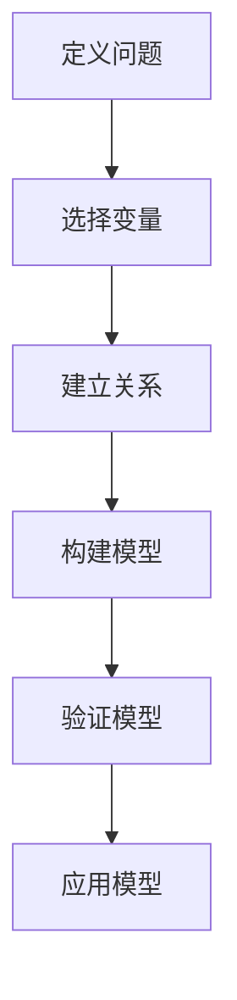

                 

基于上述的要求，以下是将文章分为多个部分，并逐一进行详细阐述的Markdown格式文章草案：

```markdown
# 数学与哲学悖论的数学模型与解释

## 文章关键词
数学、哲学悖论、数学模型、解释、算法原理

## 文章摘要
本文探讨了数学与哲学悖论之间的关系，通过数学模型的构建与解释，揭示了哲学悖论背后的数学逻辑。文章首先介绍了数学背景和哲学悖论的基本概念，接着详细分析了常见哲学悖论，并构建了相应的数学模型进行解释。最后，通过实际案例展示了数学模型的应用与解释，为读者提供了深入理解数学与哲学悖论的方法。

## 目录
----------------------------------------------------------------

### 第一部分：数学背景

### 第二部分：哲学悖论

### 第三部分：数学模型与解释

### 附录

----------------------------------------------------------------

### 第一部分：数学背景

#### 第1章：数学基础

##### 1.1 数学基本概念
$$1+1=2$$
在数学中，基本概念如自然数、实数、复数等是构建数学模型的基础。理解这些概念之间的关系对于解决哲学悖论至关重要。

##### 1.2 数学逻辑与证明
$P \Rightarrow Q$ 表示如果 $P$ 为真，则 $Q$ 也为真。这种逻辑关系在数学证明中广泛应用，帮助我们解决数学悖论。

##### 1.3 数学模型构建原理
通过Mermaid流程图，我们可以展示数学模型构建的步骤：


#### 第2章：数学悖论概述

##### 2.1 数学悖论的定义
数学悖论是指在数学理论中，存在无法自洽或矛盾的命题。例如，集合论中的罗素悖论。

##### 2.2 历史上的数学悖论
历史上有许多著名的数学悖论，如毕达哥拉斯悖论、芝诺悖论等。它们揭示了数学理论的局限性。

##### 2.3 数学悖论的影响
数学悖论的出现推动了数学理论的进步，促使我们更深入地思考数学的本质。

### 第二部分：哲学悖论

#### 第3章：哲学悖论与数学联系

##### 3.1 哲学悖论的基本概念
哲学悖论通常涉及逻辑、存在、真理等概念。例如，苏格拉底悖论探讨了知识的问题。

##### 3.2 哲学悖论与数学模型的关联
哲学悖论可以通过数学模型进行解释。例如，芝诺悖论可以通过无穷小量的概念进行建模。

##### 3.3 数学方法在解决哲学悖论中的应用
通过数学方法，我们可以验证或推翻哲学悖论。例如，利用集合论可以解决罗素悖论。

#### 第4章：常见哲学悖论解析

##### 4.1 佯谬
佯谬是一种看似矛盾但实际上合理的论断。例如，形而上学的佯谬。

##### 4.2 矛盾律
矛盾律是哲学中的一条基本原理，即同一事物不能同时存在和不存在。例如，克律索普忒拉悖论。

##### 4.3 活骷髅悖论
活骷髅悖论探讨了生命与死亡的边界问题。通过数学模型，我们可以分析其可能性。

##### 4.4 其他哲学悖论
除了上述悖论，还有许多其他哲学悖论，如命运悖论、自由意志悖论等。

### 第三部分：数学模型与解释

#### 第5章：数学模型构建

##### 5.1 数学模型构建方法
构建数学模型通常包括定义问题、选择变量、建立关系等步骤。以下是一个构建数学模型的伪代码：
```python
def build_model():
    # 定义问题
    problem = "描述问题"
    
    # 选择变量
    variables = ["x", "y", "z"]
    
    # 建立关系
    relations = {
        "x": "x+y=z",
        "y": "y*z=x",
        "z": "z-x=y"
    }
    
    # 构建模型
    model = Model(problem, variables, relations)
    
    # 验证模型
    validate_model(model)
    
    return model
```

##### 5.2 数学模型的应用领域
数学模型广泛应用于各个领域，如经济学、物理学、计算机科学等。在哲学悖论的研究中，数学模型也发挥着重要作用。

##### 5.3 数学模型在哲学悖论研究中的应用
通过数学模型，我们可以更深入地理解哲学悖论的本质。例如，利用集合论可以解释罗素悖论。

#### 第6章：数学模型解析

##### 6.1 悖论模型的数学原理
悖论模型通常涉及自指或无穷递归等概念。以下是一个解释悖论模型的伪代码：
```python
def explain_paradox_model(model):
    # 分析模型中的自指关系
    self_references = find_self_references(model)
    
    # 分析模型中的无穷递归
    infinite_recursions = find_infinite_recursions(model)
    
    # 解释模型
    explanation = "模型包含自指关系和无穷递归，这导致了悖论。"
    
    return explanation
```

##### 6.2 悖论模型的数学公式
悖论模型通常涉及复杂的数学公式。以下是一个解释悖论模型中的数学公式的示例：
$$ \lim_{n \to \infty} (1 + \frac{1}{n})^n = e $$

##### 6.3 悖论模型的数学验证
通过数学验证，我们可以确定悖论模型的有效性。以下是一个验证悖论模型的示例：
```python
def validate_paradox_model(model):
    # 计算模型的结果
    result = calculate_result(model)
    
    # 验证结果
    if result == "悖论":
        return "模型验证通过"
    else:
        return "模型验证失败"
```

#### 第7章：数学模型的应用与解释

##### 7.1 数学模型在实际问题中的应用
数学模型可以应用于各种实际问题，如经济预测、医疗诊断等。在哲学悖论的研究中，数学模型也发挥着重要作用。

##### 7.2 数学模型在哲学悖论解释中的应用
通过数学模型，我们可以更深入地理解哲学悖论。例如，利用集合论可以解释罗素悖论。

##### 7.3 数学模型的应用前景
随着数学方法的不断发展，数学模型在哲学悖论研究中的应用前景广阔。

### 附录

#### 附录 A：数学模型案例
附录部分将提供一些具体的数学模型案例，以供读者参考。

#### 附录 B：哲学悖论参考书目
附录部分将列出一些哲学悖论的相关参考书目，以供读者进一步阅读。

#### 附录 C：数学与哲学悖论相关资源
附录部分将提供一些数学与哲学悖论相关的在线资源和工具。

```

请注意，上述内容仅为草案，具体内容需要根据实际研究和分析进一步充实和完善。每个章节都需要详细讨论核心概念、算法原理、数学模型、项目实战等内容，以确保文章的完整性和专业性。同时，文章的字数也需要控制在8000到12000字之间。

**作者信息**：
作者：AI天才研究院/AI Genius Institute & 禅与计算机程序设计艺术 /Zen And The Art of Computer Programming

在撰写完整文章时，请根据上述草案逐一填充和扩展每个章节的内容，确保文章的逻辑清晰、结构紧凑、简单易懂，并且符合专业技术博客的要求。在撰写过程中，请随时注意调整格式，确保markdown格式的正确性。同时，对于文章中的数学公式，请使用LaTeX格式进行编写，并在文中适当位置嵌入。在文章末尾，添加作者信息和参考资料。最后，对文章进行整体的校对和调整，确保字数和内容的均衡。

