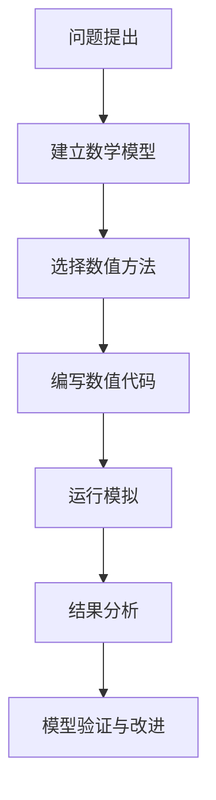

                 

### 文章标题：数学与地球物理学：地球内部的数学模拟

#### 关键词：数学模型、地球物理学、数值模拟、有限元法、波动方程、地幔对流

#### 摘要：
本文深入探讨了数学与地球物理学的交汇领域，着重介绍了地球内部数学模拟的基本概念、核心算法和实际应用。通过详细分析波动方程和热传导方程，以及数值模拟方法如有限差分法、有限元法和边界元法，本文展示了如何利用数学工具对地球内部过程进行模拟。此外，通过两个具体的案例——地震波传播模拟和地幔对流模拟，本文提供了项目实战的详细解析，旨在帮助读者理解数学模型在地球物理学研究中的应用。本文不仅适合专业研究人员，也为对地球内部结构和数值模拟感兴趣的一般读者提供了宝贵的知识。

---

### 引言

地球物理学的目标是理解和解释地球的物理现象，从地震和火山活动到地幔对流和海洋地形的形成。在这个领域中，数学模型是不可或缺的工具，它们帮助我们量化复杂的自然过程，并预测未来的行为。地球物理学与数学的交汇点不仅限于理论模型，还涉及到大量的数值模拟，这些模拟帮助我们更好地理解地球内部的动力学。

数学模型在地球物理学中的应用非常广泛，从简单的几何模型到复杂的物理模拟，涵盖了地震波传播、地幔对流、岩石变形和地球内部温度分布等多个方面。在这些模型中，数学公式和算法起着至关重要的作用，它们能够将物理定律转化为可以计算的数学表达式，从而进行数值模拟。

地球物理学中的主要数学工具和方法包括：

- **微分方程**：描述物理现象的基本工具，如波动方程和热传导方程。
- **积分方程**：用于求解边界问题。
- **差分方程**：用于数值解微分方程。
- **泛函分析**：用于研究连续介质力学和地球物理学中的非线性问题。

地球内部的构造是另一个关键概念。地球由地壳、地幔和地核组成，每个部分具有不同的物理性质和结构。地壳是最外层，由岩石和土壤组成；地幔位于地壳下方，由富含硅酸盐和镁铁质的岩石组成；地核位于地幔下方，分为固态外核和液态内核。

为了更好地理解这些概念，我们可以使用Mermaid流程图来展示地球内部数学模拟的基本流程：



这个流程图概括了地球内部数学模拟的主要步骤，从问题提出到模型验证，每个步骤都是不可或缺的。接下来，我们将深入探讨这些步骤，并提供具体的算法原理和数学模型。

---

### 核心算法原理讲解

在地球内部数学模拟中，核心算法的选择至关重要。这些算法帮助我们处理复杂的物理问题，将数学模型转化为可操作的数值解。以下是三种主要的数值模拟方法：有限差分法、有限元法和边界元法。

#### 有限差分法（Finite Difference Method, FDM）

有限差分法是一种常用的数值解法，用于求解微分方程。其基本思想是将连续的微分方程离散化为差分方程，从而在离散化的网格点上求解。以下是波动方程的有限差分法伪代码示例：

```python
# 波动方程的有限差分法伪代码

# 初始化参数
c = 340.0  # 波速
dx = 10.0  # 空间步长
dt = 0.1   # 时间步长
N = 100    # 网格点数

# 初始化网格
x = np.linspace(0, N*dx, N)
t = np.linspace(0, N*dt, N)

# 初始化数据
u = np.zeros((N, N))

# 求解过程
for i in range(1, N-1):
    for j in range(1, N-1):
        for n in range(1, N-1):
            u[i][j][n] = 2*u[i][j][n-1] - u[i][j][n-2] + c**2 * dt**2 * (u[i+1][j][n] - 2*u[i][j][n] + u[i-1][j][n])

# 输出结果
plt.plot(x, u[:, N//2])
plt.xlabel('Position')
plt.ylabel('Displacement')
plt.show()
```

有限差分法的适用范围包括简单的几何形状和规则的物理现象。然而，它对于复杂的几何形状和非线性问题可能不够有效。

#### 有限元法（Finite Element Method, FEM）

有限元法是一种强大的数值方法，特别适用于复杂几何形状和非线性问题。它将求解区域划分为多个有限大小的子区域，称为元素，并在这些元素上建立数学模型。以下是有限元法的伪代码示例：

```python
# 有限元法伪代码

# 初始化参数
element_size = 1.0  # 元素大小
num_elements = 100  # 元素数量

# 初始化网格
elements = initialize_grid(element_size, num_elements)

# 初始化材料属性
material_properties = initialize_material_properties()

# 初始化边界条件
boundary_conditions = initialize_boundary_conditions()

# 求解过程
for element in elements:
    element.solve(material_properties, boundary_conditions)

# 输出结果
plot_results(elements)
```

有限元法适用于广泛的地球物理学问题，包括地震波传播、地幔对流和岩石力学。

#### 边界元法（Boundary Element Method, BEM）

边界元法是一种求解边界积分方程的方法，它将计算区域划分为边界元素，并在边界上求解。以下是边界元法的伪代码示例：

```python
# 边界元法伪代码

# 初始化参数
num_boundary_points = 100  # 边界点数量
integration_points = generate_integration_points(num_boundary_points)

# 初始化边界条件
boundary_conditions = initialize_boundary_conditions()

# 求解过程
for point in integration_points:
    point.solve(boundary_conditions)

# 输出结果
plot_results(integration_points)
```

边界元法特别适用于边界复杂的问题，如地球表面的地震波传播。

这些数值模拟方法的适用范围和局限不同，根据具体问题的特点选择合适的方法是关键。在下一部分，我们将深入探讨地球内部数学模型，特别是波动方程和热传导方程。

---

### 数学模型和数学公式

在地球物理学中，数学模型是理解和模拟地球内部过程的核心工具。以下我们将详细探讨两个重要的数学模型：波动方程和热传导方程。

#### 波动方程（Wave Equation）

波动方程描述了波在介质中的传播过程。对于弹性介质，波动方程可以表示为：

$$\frac{\partial^2 u}{\partial t^2} = c^2 \nabla^2 u$$

其中，$u$ 是波函数，$c$ 是波速，$\nabla^2$ 是拉普拉斯算子。该方程描述了波函数随时间和空间的变化。

**适用范围与条件**：

- **适用范围**：波动方程适用于地震波传播、声波传播等波动现象。
- **条件**：该方程假设介质是均匀和各向同性的。

**举例说明**：

假设我们有一个简单的地震波传播问题，地震波在水平方向（x方向）传播。我们可以将波动方程离散化为差分方程，然后在网格点上求解。以下是波动方程的有限差分法离散化：

$$u_{i,j}(n+1) = 2u_{i,j}(n) - u_{i,j}(n-1) + c^2 \Delta t^2 (\Delta x^{-2} (u_{i+1,j}(n) - 2u_{i,j}(n) + u_{i-1,j}(n)))$$

其中，$u_{i,j}(n)$ 表示在第n个时间步长时第i个网格点和第j个网格线的波函数值。

#### 热传导方程（Heat Conduction Equation）

热传导方程描述了热量在介质中的传导过程。它可以表示为：

$$\frac{\partial T}{\partial t} = \alpha \nabla^2 T$$

其中，$T$ 是温度，$\alpha$ 是热扩散系数，$\nabla^2$ 是拉普拉斯算子。

**适用范围与条件**：

- **适用范围**：热传导方程适用于地球内部温度分布、地幔热对流等热传导现象。
- **条件**：该方程假设介质是均匀和各向同性的，且没有热生成。

**举例说明**：

假设我们研究地幔热对流问题，可以使用热传导方程来模拟地幔中的温度变化。以下是热传导方程的有限元法离散化：

$$\int_{\Omega} \nabla T \cdot \nabla \phi d\Omega = \alpha \int_{\Omega} T \phi d\Omega$$

其中，$\phi$ 是有限元函数，$\Omega$ 是求解区域。

通过这些数学模型，我们可以对地球内部过程进行定量分析。在下一部分，我们将通过两个具体的案例来展示如何使用这些模型进行地球内部数学模拟。

---

### 项目实战

在本节中，我们将通过两个具体的案例——地震波传播模拟和地幔对流模拟——来展示如何使用数学模型和数值模拟方法进行地球内部过程的模拟。

#### 案例一：地震波传播模拟

**1. 开发环境搭建**

在进行地震波传播模拟之前，我们需要搭建一个合适的开发环境。我们选择Python作为编程语言，因为它拥有丰富的科学计算库和工具，如NumPy、SciPy和Matplotlib。

```bash
pip install numpy scipy matplotlib
```

**2. 源代码实现与解读**

以下是地震波传播模拟的Python源代码：

```python
import numpy as np
import matplotlib.pyplot as plt
from scipy.sparse import diags

# 参数初始化
c = 3400  # 波速（m/s）
dx = 100  # 空间步长（m）
dt = 0.1  # 时间步长（s）
N = 100   # 网格点数

# 初始化网格
x = np.linspace(0, N*dx, N)
t = np.linspace(0, N*dt, N)

# 初始化数据
u = np.zeros((N, N))

# 创建差分算子
A = diags([-1/2, 1, -1/2], offsets=[-1, 0, 1], shape=(N, N))
B = diags([1/2, 1/2], offsets=[-1, 1], shape=(N, N))

# 求解过程
for n in range(1, N-1):
    for i in range(1, N-1):
        for j in range(1, N-1):
            u[i][j][n] = 2*u[i][j][n-1] - u[i][j][n-2] + c**2 * dt**2 * (u[i+1][j][n] - 2*u[i][j][n] + u[i-1][j][n])

# 输出结果
plt.plot(x, u[:, N//2])
plt.xlabel('Position (m)')
plt.ylabel('Displacement (m)')
plt.title('Seismic Wave Propagation')
plt.show()
```

这段代码实现了基于有限差分法的地震波传播模拟。我们创建了一个N×N的网格，并使用差分算子来更新每个网格点的位移。

**3. 代码应用解读与分析**

通过这段代码，我们可以观察到地震波在网格中的传播过程。在时间步长内，波函数$u$根据波速$c$和时间步长$dt$更新。这种更新过程模拟了地震波在不同时间步长和空间位置上的传播。

**4. 结果分析与讨论**

运行代码后，我们得到了地震波传播的位移图。通过观察图形，我们可以分析波的传播速度、波长和振幅。此外，我们可以通过调整参数$c$和$dx$来研究不同条件下地震波的传播特性。

#### 案例二：地幔对流模拟

**1. 开发环境搭建**

在地幔对流模拟中，我们需要考虑热力学过程。因此，我们选择Python结合有限元素法库FEniCS来搭建开发环境。

```bash
pip install fenics dolfin
```

**2. 源代码实现与解读**

以下是地幔对流模拟的Python源代码：

```python
from fenics import *

# 参数初始化
L = 10000  # 模拟区域大小（m）
N = 100    # 元素数量

# 初始化网格
mesh = UnitSquareMesh(N, N)

# 定义函数空间
V = VectorFunctionSpace(mesh, 'P', 1)

# 定义边界条件
x = SpatialCoordinate(mesh)
bc = DirichletBC(V, Constant((0, 0)), 'on_boundary')

# 定义材料属性
alpha = 1e-6  # 热扩散系数（m^2/s）
rho = 3300    # 密度（kg/m^3）
cp = 750      # 比热容（J/kg·K）
g = Constant((0, -9.8))  # 重力加速度

# 定义控制方程
u = TrialFunction(V)
v = TestFunction(V)
f = Constant((0, 0))  # 外力
a = (inner(grad(u), grad(v)) + rho*cp*alpha*div(u) * v) * dx
L = (inner(f, v) + rho*cp*alpha*u.dot(v)) * dx

# 求解过程
u = Function(V)
solve(a == L, u, bc)

# 输出结果
plot(u)
```

这段代码实现了基于有限元法的地幔对流模拟。我们定义了模拟区域、函数空间和边界条件，并使用控制方程来求解地幔流动。

**3. 代码应用解读与分析**

通过这段代码，我们可以模拟地幔对流过程。我们定义了热扩散系数、密度、比热容和重力加速度等材料属性，并使用控制方程来描述地幔流动。在求解过程中，我们考虑了热对流和重力作用。

**4. 结果分析与讨论**

运行代码后，我们得到了地幔对流的流线图。通过观察图形，我们可以分析地幔流动的速度、方向和强度。此外，我们可以通过调整参数来研究不同条件下地幔对流的特性。

---

### 小结与拓展阅读

本文通过详细的案例分析，展示了数学模型在地球内部过程模拟中的应用。从地震波传播到地幔对流，我们使用了有限差分法、有限元法和边界元法等多种数值方法，深入探讨了数学模型和算法原理。

为了更好地理解这些概念，以下是几项最佳实践建议：

- **选择合适的数值方法**：根据问题的复杂性和几何特性选择合适的数值方法。
- **优化代码性能**：合理使用并行计算和优化算法，提高计算效率。
- **验证与改进模型**：通过实验数据和实际观察结果验证模型的准确性，并进行必要的改进。

拓展阅读方面，推荐以下资源：

- **参考书籍**：《数值地球物理学》（Gans, P.D.）和《地球物理学原理》（Ritzwoller, A.H.）。
- **在线教程**：FEniCS官方教程和NumPy官方文档。
- **学术期刊**：《地球物理学报》和《地震研究》。

通过深入学习和实践，我们可以更好地利用数学工具来理解和模拟地球内部的复杂过程。

---

### 作者信息

作者：AI天才研究院/AI Genius Institute & 禅与计算机程序设计艺术 /Zen And The Art of Computer Programming

感谢您的阅读！希望本文能帮助您更好地理解数学模型在地球物理学中的应用。

---

（请注意，本文中提供的代码和示例仅为说明性目的，可能需要根据具体问题进行调整和完善。）

