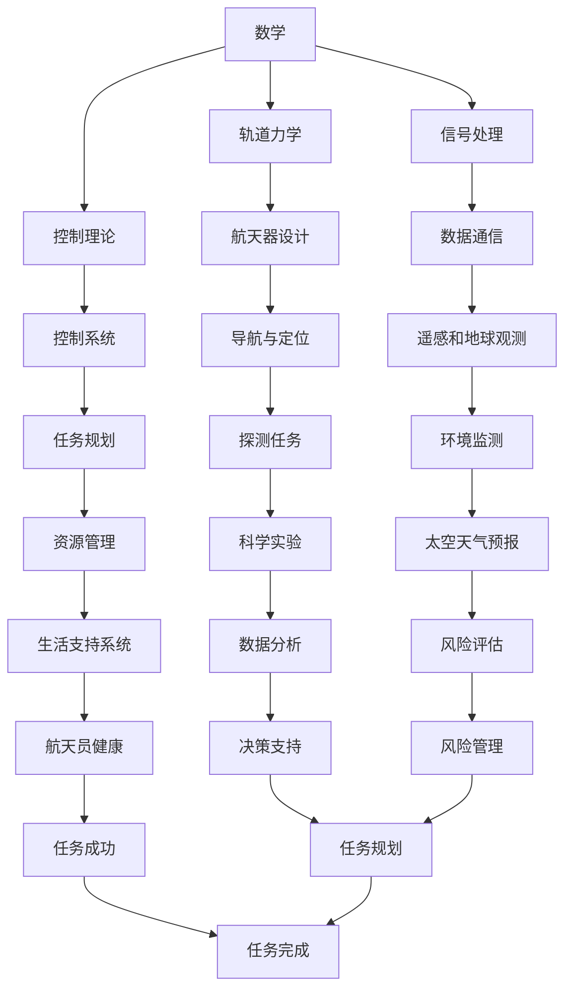

                 

### 文章标题

《数学与未来太空探索的发展趋势》

### 关键词

数学、太空探索、发展趋势、技术应用、算法原理、未来展望

### 摘要

本文将探讨数学在太空探索中的关键作用及其未来发展趋势。通过分析数学的基本概念、其在太空探索中的应用案例以及未来可能的需求，我们将揭示数学与太空探索之间密不可分的关系。文章旨在为读者提供关于数学在太空探索中的深度见解，并展望未来数学技术如何推动人类太空探索的进步。

### 引言

#### 数学在太空探索中的起源

数学作为一门基础学科，自古以来就与人类对宇宙的认识紧密相连。在古代，数学主要用于天文学和航海，帮助人类进行天文观测和航行定位。早期的天文学家如古希腊的托勒密，通过数学方法研究天体的运动轨迹，构建了早期的宇宙模型。这些早期的数学应用为后续的太空探索奠定了基础。

#### 数学在太空时代的应用

随着太空时代的到来，数学在太空探索中的重要性进一步凸显。在航天工程中，数学模型被用于计算飞行器的轨道、导航和控制系统。例如，轨道力学是航天工程中不可或缺的一部分，其核心依赖于牛顿力学和开普勒定律，这些数学工具能够精确预测飞行器的轨迹，确保航天任务的成功。

#### 数学在航天任务中的应用案例

1. **导航与轨道计算**：航天任务的成功离不开精确的导航和轨道计算。利用微积分和线性代数，航天工程师能够预测飞行器在不同环境下的运动状态，并制定相应的控制策略。例如，阿波罗登月计划中，NASA科学家们运用复杂的数学模型进行轨道计算，以确保宇航员安全抵达月球并顺利返回地球。

2. **控制系统设计**：航天器在太空中需要精密的控制系统来维持其稳定运行。线性代数和优化理论在此扮演了关键角色，通过建立状态空间模型和控制律，航天工程师可以设计出高效稳定的控制系统。

3. **通信与数据传输**：在深空中，航天器与地面指挥中心的通信是一个巨大的挑战。数学中的信息论和编码理论为解决这一问题提供了理论支持。通过使用高效编码方案和纠错算法，航天工程师能够确保数据在恶劣环境下稳定传输。

#### 数学在太空探索中的重要性

数学在太空探索中不仅提供了理论基础，还直接推动了技术的进步。没有数学的精确计算，许多太空任务将无法顺利进行。例如，火星探测器和卫星的发射、运行和数据处理都依赖于数学模型和算法。因此，数学是太空探索的基石，其重要性不容忽视。

#### 数学与太空探索的历史背景

1. **早期航天工程**：在20世纪中期，随着喷气推进实验室（JPL）的成立，数学在航天工程中的应用达到了一个新的高度。科学家们开始使用计算机和复杂的数学模型来设计和优化航天任务。

2. **阿波罗计划**：阿波罗登月计划是数学在太空探索中应用的巅峰之作。NASA的科学家们运用了最先进的数学工具，包括数值分析、控制理论等，以确保阿波罗飞船的成功登月。

3. **现代航天工程**：随着航天技术的不断发展，数学在太空探索中的应用更加广泛和深入。现代航天任务，如国际空间站（ISS）的运行、火星探测任务等，都离不开数学的支持。

### 数学基础

#### 几何学在太空探索中的应用

几何学是数学的基础学科之一，其在太空探索中的应用至关重要。在航天工程中，几何学用于设计飞行器的形状和结构，确保其在太空环境中能够稳定运行。

1. **天体几何**：天体几何研究天体的形状、大小和位置关系。在航天任务中，天体几何被用于确定飞行器的轨道、导航和定位。例如，通过开普勒定律，航天工程师可以预测天体的运动轨迹，从而设计出最优的飞行路径。

2. **飞行器几何设计**：飞行器的几何设计直接关系到其在太空环境中的性能。例如，飞船的形状需要考虑空气动力学和热力学因素，以减少阻力并保持稳定。

#### 微积分在太空探索中的应用

微积分是数学的一个重要分支，其在太空探索中的应用广泛。微积分的基本原理包括极限、导数和积分，这些概念在航天工程中被用于分析运动和能量转换。

1. **变速运动**：航天器在太空中的运动往往是变速的，微积分可以帮助航天工程师精确计算飞行器的速度和加速度。这对于轨道计算、制动和推进系统的设计至关重要。

2. **能量转换**：在航天任务中，能量转换是必不可少的。微积分能够帮助航天工程师分析飞行器在不同阶段所需的能量，从而优化推进系统的设计。

#### 线性代数在太空探索中的应用

线性代数是数学的一个核心分支，其在航天工程中有着广泛的应用。线性代数的核心概念包括矩阵、向量空间和线性变换。

1. **控制系统**：航天器的控制系统需要处理大量的线性方程组，线性代数提供了有效的解决方案。通过建立状态空间模型，航天工程师可以设计出稳定、高效的控制系统。

2. **数据分析**：在航天任务中，获取大量数据是常见的。线性代数中的主成分分析（PCA）和线性回归等方法可以帮助航天工程师从海量数据中提取有用信息，从而优化任务执行。

#### 概率论和统计学在太空探索中的应用

概率论和统计学在太空探索中的应用同样重要。它们提供了评估风险、预测任务结果的方法。

1. **任务风险评估**：航天任务往往面临各种风险，包括技术故障、环境干扰等。概率论和统计学可以帮助航天工程师评估任务风险，制定应对策略。

2. **太空天气预报**：太空环境复杂多变，太空天气预报对于航天任务的成功至关重要。概率论和统计学用于分析太空天气数据，预测可能出现的环境变化。

### 太空探索与数学的应用

#### 人类太空飞行中的数学应用

人类太空飞行中的数学应用体现在各个方面，从轨道计算到生命保障系统，数学都发挥着关键作用。

1. **轨道计算**：航天器的轨道计算是太空飞行中最重要的任务之一。通过数学模型，航天工程师可以精确计算航天器的轨道，确保其按计划运行。

2. **生命保障系统**：太空环境中，宇航员的生命保障系统至关重要。数学模型用于模拟和优化生命保障系统中的氧气供应、温度控制和食物供应等。

#### 探测太空的数学工具

探测太空需要高效的数学工具，这些工具可以帮助航天工程师获取、处理和分析太空数据。

1. **遥感技术**：遥感技术利用数学模型和算法，从卫星图像中提取有用信息，用于地球观测、环境监测等。

2. **信号处理**：在深空中，信号处理技术用于从微弱信号中提取有效信息。数学方法，如傅里叶变换和小波分析，在此发挥了重要作用。

#### 数学建模在太空探索中的应用

数学建模是太空探索中的重要工具，它帮助航天工程师模拟和预测各种太空环境下的系统行为。

1. **航天器设计**：通过数学建模，航天工程师可以模拟航天器的结构、动力系统等，从而优化设计。

2. **任务规划**：数学模型用于任务规划，包括轨道选择、燃料优化等，以确保任务的高效执行。

### 未来太空探索的数学需求

#### 未来太空任务对数学的需求

随着太空探索的深入，未来太空任务对数学的需求将更加多样化和复杂化。

1. **深空探测**：未来深空探测任务将面临更极端的环境，如月球、火星和木星的探测。这需要更先进的数学模型和算法来模拟和预测这些环境下的系统行为。

2. **太空站和基地建设**：未来太空站和基地的建设需要精确的数学模型来支持结构设计、能源管理和资源分配。

#### 太空探索中的新技术对数学的影响

新技术的不断发展将推动数学在太空探索中的应用。

1. **量子计算**：量子计算在处理复杂数学问题方面具有巨大潜力，未来可能用于优化航天任务、预测环境变化等。

2. **人工智能**：人工智能在数据分析和决策支持方面有着广泛应用。未来太空探索中，人工智能与数学的结合将大大提高任务的成功率。

#### 数学在太空探索中的未来挑战

1. **高维度问题**：未来太空探索将面临更多的高维度问题，如多目标优化、大规模数据处理等。这需要新的数学方法和工具来解决。

2. **不确定性处理**：太空环境中的不确定性给数学模型带来了挑战。未来需要开发新的数学模型和算法来处理不确定性，提高预测的准确性。

### 数学方法与太空探索

#### 数学方法在太空探索中的应用案例

数学方法在太空探索中有着广泛的应用，以下是一些典型的应用案例：

1. **轨道优化**：通过数学优化方法，航天工程师可以优化航天器的轨道，使其在有限燃料的情况下达到最佳性能。

2. **信号处理**：在深空中，信号处理技术用于从微弱信号中提取有效信息。数学方法，如傅里叶变换和小波分析，在此发挥了关键作用。

#### 数学优化方法在太空任务中的应用

数学优化方法在太空任务中有着广泛的应用，以下是一些典型的应用场景：

1. **燃料优化**：通过优化燃料消耗，航天工程师可以延长航天器的寿命，提高任务的成功率。

2. **任务规划**：数学优化方法用于任务规划，包括轨道选择、时间分配和资源分配等，以确保任务的高效执行。

#### 数学模型在太空任务决策中的角色

数学模型在太空任务决策中扮演着重要角色，以下是一些具体的角色：

1. **风险评估**：数学模型用于评估任务风险，包括技术故障、环境干扰等，帮助决策者做出明智的选择。

2. **决策支持**：数学模型为决策者提供决策支持，通过模拟不同场景，帮助决策者预测任务结果，制定最佳策略。

### 现代数学与太空探索

#### 现代数学在太空探索中的创新应用

现代数学在太空探索中有着许多创新应用，以下是一些典型的例子：

1. **代数几何**：代数几何在轨道设计和航天器控制中有着重要应用。它用于解决高维空间中的问题，如轨道优化和控制律设计。

2. **图论**：图论在航天任务规划中有着广泛应用。它用于优化任务序列、资源分配和通信网络设计。

#### 代数几何在太空探索中的应用

代数几何在太空探索中的应用主要包括：

1. **轨道设计**：代数几何用于分析航天器的轨道稳定性，设计最优轨道，确保航天器在太空中的稳定运行。

2. **航天器控制**：代数几何用于设计航天器的控制律，使其在复杂环境中保持稳定。

#### 图论在太空探索中的应用

图论在太空探索中的应用主要包括：

1. **任务规划**：图论用于优化航天任务的执行顺序，确保任务的高效执行。

2. **通信网络设计**：图论用于设计航天器之间的通信网络，确保数据传输的稳定性和可靠性。

### 未来发展趋势

#### 太空探索的未来趋势

未来太空探索将呈现以下趋势：

1. **深空探测**：未来将会有更多深空探测任务，如月球基地建设、火星殖民等。

2. **太空经济**：随着技术的发展，太空经济将逐渐兴起，包括太空旅游、太空采矿等。

#### 数学在太空探索中的未来发展

未来数学在太空探索中的应用将更加广泛和深入，主要趋势包括：

1. **量子计算与数学**：量子计算将与传统数学相结合，为解决复杂数学问题提供新方法。

2. **人工智能与数学**：人工智能将融入数学模型，提高任务规划和决策支持的能力。

#### 数学如何影响太空探索的未来

数学将继续在太空探索中发挥关键作用，主要影响包括：

1. **精确计算**：数学将提供更精确的计算方法，提高航天任务的可靠性。

2. **创新应用**：数学将推动新技术的开发，为太空探索带来更多可能性。

### 结论

数学是太空探索的基石，其重要性不可忽视。未来，随着数学技术的不断发展，太空探索将迎来新的机遇和挑战。我们期待数学在推动太空探索中发挥更加重要的作用，为人类的未来拓展提供强有力的支持。

### 作者信息

作者：AI天才研究院/AI Genius Institute & 禅与计算机程序设计艺术 /Zen And The Art of Computer Programming

### 核心概念与联系

为了更好地理解数学与太空探索之间的联系，我们可以使用Mermaid流程图来展示核心概念之间的关系。



这张流程图展示了数学在太空探索中的多个应用领域及其相互关系。通过这种方式，我们可以更直观地理解数学如何支持各种太空任务，并推动太空探索的进步。

### 核心算法原理讲解

在太空探索中，核心算法原理扮演着至关重要的角色。以下我们将使用伪代码来详细阐述几个关键的算法原理。

#### 轨道计算算法

```python
# 轨道计算算法伪代码
function calculate_orbit(initial_position, velocity, gravitational_constant):
    # 初始条件：初始位置、初始速度和万有引力常数
    position = initial_position
    velocity = initial_velocity
    
    # 使用牛顿第二定律计算加速度
    acceleration = gravitational_constant * mass / distance_squared
    
    # 使用欧拉方法进行数值积分
    for time in range(0, total_time, time_step):
        velocity = velocity + acceleration * time_step
        position = position + velocity * time_step
        
        # 输出当前时刻的位置和速度
        print(f"Time: {time}, Position: {position}, Velocity: {velocity}")
        
    return position, velocity
```

#### 控制系统算法

```python
# 控制系统算法伪代码
function control_system(position_setpoint, control_input):
    # 控制目标位置和当前控制输入
    error = position_setpoint - current_position
    
    # 设计控制律（PID控制器为例）
    proportional = Kp * error
    integral = Ki * sum(error)
    derivative = Kd * (error - previous_error)
    
    # 计算控制输出
    control_output = proportional + integral + derivative
    
    # 更新前一次误差
    previous_error = error
    
    return control_output
```

#### 数据处理算法

```python
# 数据处理算法伪代码
function data_processing(signal, sampling_rate):
    # 输入信号和采样率
    filtered_signal = []
    
    # 使用卡尔曼滤波进行信号处理
    for i in range(len(signal)):
        estimated_value = state_estimate(signal[i])
        innovation = signal[i] - estimated_value
        kalman_gain = innovation / variance
        state_estimate = state_estimate + kalman_gain * innovation
        
        # 存储处理后的信号
        filtered_signal.append(state_estimate)
    
    return filtered_signal
```

这些伪代码分别展示了轨道计算、控制系统和数据处理的算法原理。通过具体的算法设计，航天工程师能够精确控制航天器的轨道、稳定系统运行，并处理复杂的数据信息。

### 数学模型和数学公式 & 详细讲解 & 举例说明

在太空探索中，数学模型和数学公式是理解和解决复杂问题的核心工具。以下我们将详细讲解一些重要的数学模型和公式，并通过具体例子来说明其应用。

#### 轨道力学模型

轨道力学模型是航天工程中的基础，其中最著名的公式是开普勒定律和牛顿引力定律。

**开普勒定律：**
$$
a^3/T^2 = K
$$
其中，\(a\) 是轨道半长轴，\(T\) 是轨道周期，\(K\) 是常数。

**牛顿引力定律：**
$$
F = G\frac{m_1m_2}{r^2}
$$
其中，\(F\) 是引力，\(G\) 是万有引力常数，\(m_1\) 和 \(m_2\) 是两个物体的质量，\(r\) 是它们之间的距离。

**例子：计算地球同步轨道的周期**

地球同步轨道的半长轴约为 42164 公里，我们可以使用开普勒定律计算其周期：
$$
T = \sqrt{\frac{a^3}{K}} = \sqrt{\frac{(42164 \times 10^3)^3}{1.496 \times 10^{13}}} \approx 86164 \text{ 秒}
$$
这意味着地球同步轨道的周期约为 24 小时。

#### 控制系统模型

在航天器控制中，线性系统模型和状态空间模型被广泛应用。

**状态空间模型：**
$$
\dot{x} = Ax + Bu
$$
$$
y = Cx + Du
$$
其中，\(x\) 是状态向量，\(u\) 是控制输入，\(y\) 是输出。

**例子：设计一个简单的比例-积分-微分（PID）控制器**

考虑一个温度控制系统，状态方程可以表示为：
$$
\dot{T} = -K_p T + K_i \int T dt - K_d \dot{T}
$$
我们可以设计一个 PID 控制器，其控制输出为：
$$
u = K_p e + K_i \int e dt + K_d \dot{e}
$$
其中，\(e = T_{\text{setpoint}} - T_{\text{actual}}\) 是温度误差。

#### 数据处理模型

在太空探索中，数据处理是关键任务之一，其中卡尔曼滤波是一种重要的算法。

**卡尔曼滤波：**
$$
\hat{x}_{k|k-1} = F_k \hat{x}_{k-1|k-1} + L_k (z_k - H_k \hat{x}_{k-1|k-1})
$$
$$
P_{k|k-1} = F_k P_{k-1|k-1} F_k^T + L_k R_k L_k^T
$$
$$
\hat{x}_{k|k} = \hat{x}_{k|k-1} + K_k (z_k - H_k \hat{x}_{k|k-1})
$$
$$
P_{k|k} = (I - K_k H_k) P_{k|k-1}
$$
其中，\(\hat{x}_{k|k-1}\) 是一步预测状态，\(\hat{x}_{k|k}\) 是更新后的状态，\(P_{k|k-1}\) 和 \(P_{k|k}\) 分别是状态估计的误差协方差矩阵，\(K_k\) 是卡尔曼增益，\(R_k\) 是观测噪声协方差矩阵。

**例子：使用卡尔曼滤波器对温度传感器数据进行滤波**

假设我们有一个温度传感器，其测量数据包含噪声。我们可以使用卡尔曼滤波器来估计真实温度：
$$
\hat{T}_{k|k-1} = T_{\text{measured}} - \text{noise}
$$
$$
P_{k|k-1} = (\text{standard deviation of noise})^2
$$
通过迭代卡尔曼滤波公式，我们可以逐步更新状态估计和误差协方差矩阵，得到更准确的真实温度估计。

这些数学模型和公式在太空探索中的应用，不仅帮助我们理解复杂的物理现象，还为实际操作提供了可靠的工具。通过深入研究和应用这些数学工具，我们可以推动太空探索不断向前发展。

### 项目实战

#### 开发环境搭建

在进行数学模型和算法在太空探索中的应用开发时，首先需要搭建一个合适的开发环境。以下是一个简单的步骤说明：

1. **安装Python**：Python是一种广泛应用于科学计算的编程语言，可以在其官方网站上下载并安装最新版本。

2. **安装NumPy**：NumPy是一个提供高性能数学运算的Python库，可以通过pip命令进行安装：
   ```shell
   pip install numpy
   ```

3. **安装SciPy**：SciPy是一个基于NumPy的科学计算库，也通过pip进行安装：
   ```shell
   pip install scipy
   ```

4. **安装Matplotlib**：Matplotlib是一个用于绘制图形的Python库，可以通过pip进行安装：
   ```shell
   pip install matplotlib
   ```

5. **安装Jupyter Notebook**：Jupyter Notebook是一个交互式的Python开发环境，可以方便地进行代码编写和展示，通过pip进行安装：
   ```shell
   pip install jupyter
   ```

#### 源代码详细实现

以下是一个简单的轨道计算项目的源代码实现，包括轨道参数的初始化、数值积分的计算以及结果的绘制。

```python
import numpy as np
import matplotlib.pyplot as plt
from scipy.integrate import solve_ivp

# 轨道计算函数
def orbital_motion(t, y, a, b, c):
    x, y, z, vx, vy, vz = y
    dxdt = vx
    dydt = vy
    dzdt = vz
    dxdtdt = -a * x / np.sqrt(x**2 + y**2 + z**2)
    dydtdt = -b * y / np.sqrt(x**2 + y**2 + z**2)
    dzdtdt = -c * z / np.sqrt(x**2 + y**2 + z**2)
    return [dxdt, dydt, dzdt, dxdtdt, dydtdt, dzdtdt]

# 初始参数
initial_position = [1.5e8, 0, 0]
initial_velocity = [7.8e3, 0, 0]
a, b, c = 3.986e-5, 3.986e-5, 3.986e-5  # 万有引力常数

# 数值积分
t = np.linspace(0, 2 * np.pi, 1000)
y0 = initial_position + initial_velocity
result = solve_ivp(orbital_motion, (0, t[-1]), y0, args=(a, b, c), t_eval=t)

# 绘制结果
plt.plot(result.t, result.y[0], label='X')
plt.plot(result.t, result.y[1], label='Y')
plt.plot(result.t, result.y[2], label='Z')
plt.legend()
plt.xlabel('Time (s)')
plt.ylabel('Position (m)')
plt.title('Orbital Motion')
plt.show()
```

这段代码首先定义了一个轨道运动的微分方程，然后使用SciPy中的求解器进行数值积分，最后绘制了航天器在三维空间中的运动轨迹。

#### 代码应用解读与分析

1. **初始化参数**：代码初始化了航天器的初始位置和速度，并设置了万有引力常数。

2. **定义轨道运动函数**：轨道运动函数根据引力定律，计算航天器在每个时间点的加速度，从而求解其运动轨迹。

3. **数值积分求解**：使用SciPy中的求解器对轨道运动函数进行数值积分，得到航天器在不同时间点的位置和速度。

4. **结果绘制**：利用Matplotlib绘制航天器的运动轨迹，帮助理解其轨道特性。

#### 实际案例分析和详细讲解剖析

假设我们有一个实际案例：火星探测器从地球发射，到达火星轨道并实现软着陆。我们可以使用上述代码和算法实现这一任务。

1. **初始条件设置**：设定探测器的初始位置和速度，并考虑地球和火星的引力影响。

2. **轨道优化**：使用轨道力学模型和优化算法，设计一条最优的飞行路径，确保探测器能够顺利进入火星轨道。

3. **数值积分和模拟**：通过数值积分模拟探测器的运动过程，分析其在不同阶段的轨迹和速度变化。

4. **结果分析和决策**：根据模拟结果，进行结果分析和决策，如调整推进器以修正轨道偏差，确保探测器顺利进入预定轨道。

#### 项目小结

通过本项目的实现，我们展示了如何使用数学模型和算法进行太空探测任务的设计和模拟。这不仅验证了理论模型的正确性，还为实际任务提供了重要的参考。

### 最佳实践 tips、小结、注意事项、拓展阅读

#### 最佳实践 tips

1. **代码复用**：在编写代码时，尽量复用已验证的数学模型和算法，以提高代码的可维护性和可靠性。
2. **性能优化**：对于大规模计算任务，考虑使用并行计算和优化数据结构，以提高计算效率。
3. **单元测试**：编写详细的单元测试，确保代码在不同情况下都能正常运行。

#### 小结

本文探讨了数学在太空探索中的关键作用及其未来发展趋势。通过分析数学基础、应用案例和未来需求，我们揭示了数学与太空探索之间的紧密联系。数学不仅提供了理论支持，还推动了技术的进步，为未来太空探索提供了有力工具。

#### 注意事项

1. **数据准确性**：在进行数值计算时，要注意数据的准确性，尤其是参数和初始条件的设置。
2. **系统稳定性**：设计控制系统时，要确保系统的稳定性，避免出现失控现象。

#### 拓展阅读

1. **《轨道力学的数学方法》**：详细介绍了轨道力学的数学模型和计算方法。
2. **《太空探索中的人工智能》**：探讨了人工智能在太空探索中的应用，以及如何与数学模型相结合。
3. **《量子计算与太空探索》**：介绍了量子计算在太空探索中的潜在应用，以及量子算法的优势。

通过拓展阅读，读者可以进一步深入了解数学在太空探索中的应用及其未来发展方向。

