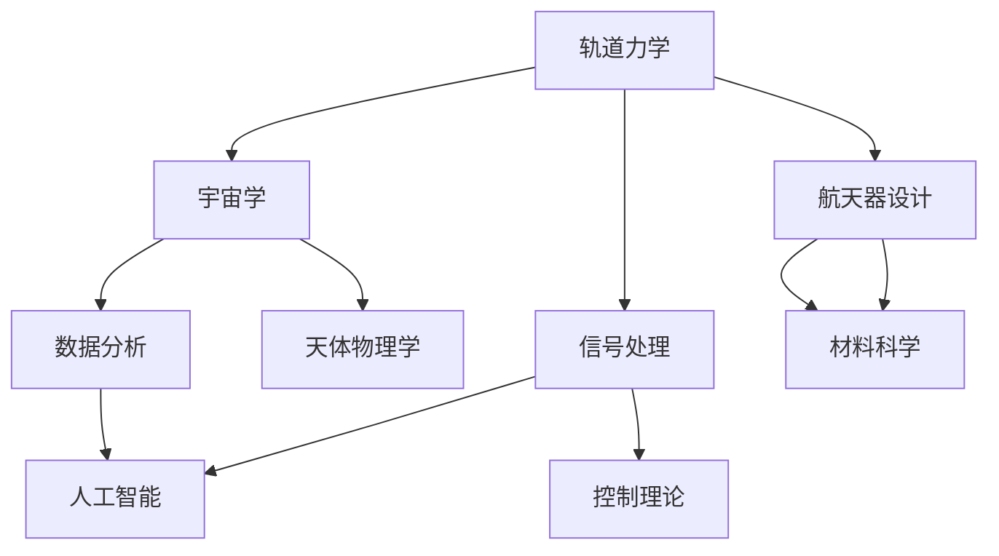

                 

### 1.1 数学在太空探索中的应用概述

数学在太空探索中扮演着至关重要的角色，几乎涉及了所有太空任务的核心技术和科学问题。首先，我们可以通过一个Mermaid流程图来概述数学在太空探索中的各种应用领域：



**轨道力学**：轨道力学的核心在于利用数学模型来描述航天器在地球和其他天体的引力场中的运动。开普勒定律、牛顿运动定律等经典物理定律提供了计算轨道的基础。以下是一个轨道力学中的核心算法——开普勒定律的伪代码示例：

```pseudo
function calculateOrbit(initialPosition, velocity, gravitationalConstant, massOfCentralBody) {
    // 计算轨道周期
    period = 2 * pi * sqrt(a^3 / gravitationalConstant * massOfCentralBody)
    
    // 计算轨道半径
    r = a * (1 - e^2) / (1 + e * cos(ω * t + Ω + φ))
    
    // 返回轨道参数
    return [r, period]
}
```

**宇宙学**：宇宙学涉及宇宙的起源、结构和演化，其核心在于对宇宙膨胀和暗能量等问题的研究。宇宙学的数学基础包括相对论、微分方程等。例如，暗能量模型中的宇宙膨胀方程可以表示为：

```latex
H(t) = H_0 * (1 - q)
```

其中，$H(t)$ 是哈勃参数，$H_0$ 是哈勃常数，$q$ 是宇宙质量参数。

**信号处理**：太空通信中的信号处理需要解决信号传输过程中的衰减、噪声等问题。例如，通信信号中的噪声可以通过傅里叶变换和滤波器设计来进行处理。以下是一个简单的信号处理算法伪代码：

```pseudo
function filterSignal(signal, cutoffFrequency) {
    // 计算傅里叶变换
    frequencyDomainSignal = fft(signal)
    
    // 设计滤波器
    filter = designBandpassFilter(cutoffFrequency)
    
    // 滤波信号
    filteredSignal = filter * frequencyDomainSignal
    
    // 反变换回时域
    return ifft(filteredSignal)
}
```

通过以上示例，我们可以看到数学在太空探索中的广泛应用。每个领域都有其特定的数学模型和算法，这些模型和算法为太空任务的规划和执行提供了坚实的理论基础。

### 1.2 未来太空探索的技术挑战

未来的太空探索将面临许多技术挑战，这些挑战不仅需要尖端科技的支持，还需要创新的数学方法来解决。以下是一些未来太空探索中的主要技术挑战：

#### 深空探测中的数学问题

随着人类太空探测任务的深入，深空探测中的数学问题变得越来越复杂。例如，行星表面的地形分析和路径规划需要使用复杂的几何算法。以下是一个用于行星表面路径规划的伪代码示例：

```pseudo
function findPath(terrainMap, start, end) {
    // 使用A*算法寻找最优路径
    path = AStarSearch(terrainMap, start, end)
    
    // 返回路径
    return path
}
```

此外，深空探测中还存在通信延迟和数据传输速率的限制，这些都需要高效的信号处理和压缩算法来解决。

#### 宇宙探索中的未知数学挑战

宇宙的广阔和复杂带来了许多未知的数学挑战。例如，宇宙极端条件下的物质和能量状态可能会涉及到全新的数学模型。当前，对于宇宙中的暗物质和暗能量，科学家们还在探索其数学描述。以下是一个用于描述暗能量的伪代码示例：

```pseudo
function describeDarkEnergy(observableUniverse) {
    // 计算宇宙膨胀速率
    expansionRate = calculateExpansionRate(observableUniverse)
    
    // 使用Lagrangian描述暗能量
    lagrangian = LagrangianModel(expansionRate)
    
    // 返回暗能量模型
    return lagrangian
}
```

#### 数学在太空探索中的未来发展趋势

未来，数学在太空探索中的应用将继续发展。随着计算能力的提升和新型算法的发明，数学模型将变得更加精确和高效。例如，量子计算有望在信号处理、轨道计算等领域带来革命性的变化。以下是一个量子算法的伪代码示例：

```pseudo
function quantumSignalProcessing(signal) {
    // 将信号转换为量子态
    quantumSignal = quantumEncoding(signal)
    
    // 使用量子傅里叶变换处理信号
    processedSignal = quantumFourierTransform(quantumSignal)
    
    // 反转换回经典态
    return quantumDecoding(processedSignal)
}
```

此外，数学在人工智能和机器学习领域的进展也将为太空探索提供新的工具。例如，利用深度学习技术进行图像识别和数据分析，可以大大提高探测效率和准确性。

综上所述，未来的太空探索将面临许多数学挑战，这些挑战需要科学家们不断创新和合作，以推动太空科技的进步。

### 1.3 数学在太空探索中的未来发展趋势

随着太空探索的不断深入，数学在其中的作用将愈加重要。未来，数学在太空探索中可能会出现以下几种发展趋势：

#### 新兴数学领域的出现

随着太空探索技术的进步，可能会出现一些新的数学领域。例如，极端环境下的物质状态研究可能会催生新的数学模型。这些模型将有助于我们理解宇宙中的奇异现象，如黑洞和中子星内部的物质状态。

#### 量子计算的融合

量子计算是一种具有巨大潜力的计算范式，它将在未来对太空探索产生深远影响。量子算法在信号处理、轨道计算等方面具有显著优势，能够大幅提高计算效率。例如，量子傅里叶变换可以用于快速处理大量太空数据，从而优化探测任务的执行。

#### 人工智能的融入

人工智能和机器学习在太空探索中的应用已经取得了显著成果。未来，随着算法的进一步发展，人工智能将在数据分析和路径规划等方面发挥更大作用。例如，利用深度学习技术进行图像识别和目标检测，可以大大提高探测任务的效率和准确性。

#### 网络科学的发展

随着太空任务变得越来越复杂，网络科学将在太空探索中扮演关键角色。通过网络科学的方法，可以更好地理解航天器集群和地面控制系统的交互作用，优化任务执行策略。

#### 跨学科的合作

未来，数学与其他学科的交叉合作将成为推动太空探索的重要力量。例如，物理学家、工程师和数学家共同研究新型材料，以应对太空环境中的极端条件。这种跨学科的合作将有助于开发出更加先进和可靠的太空技术。

综上所述，未来数学在太空探索中的应用将呈现出多元化、创新化的发展趋势，为人类探索宇宙提供更加坚实的理论基础和技术支持。

### 2.1 轨道力学

轨道力学是太空探索中的一个核心领域，它涉及航天器在地球和其他天体引力场中的运动规律。理解轨道力学的基本原理对于设计和执行太空任务至关重要。在这一节中，我们将详细探讨轨道力学的数学模型、核心算法以及其在太空探索中的应用。

#### 轨道力学的数学模型

轨道力学的数学模型通常基于牛顿力学和引力理论。最常用的模型之一是开普勒定律，它描述了行星围绕恒星的运动。开普勒定律分为三条：

1. **开普勒第一定律（椭圆轨道定律）**：行星绕恒星的运动轨道是一个椭圆，恒星位于椭圆的一个焦点上。
2. **开普勒第二定律（面积速度定律）**：行星在椭圆轨道上的运动速度是变化的，但它在任何相等时间内划过的面积都是相等的。
3. **开普勒第三定律（调和定律）**：行星绕恒星运动的轨道周期的平方与轨道半长轴的立方成正比。

开普勒定律可以通过以下数学公式表示：

$$
T^2 \propto a^3
$$

其中，$T$ 是轨道周期，$a$ 是椭圆轨道的半长轴。

更复杂的轨道模型，如广义相对论修正的轨道模型，则需要使用更为复杂的数学工具，如拉格朗日方程和爱因斯坦场方程。

#### 轨道力学的核心算法

轨道力学的核心算法通常基于牛顿第二定律和万有引力定律。以下是计算轨道的常见算法之一——牛顿-欧拉算法的伪代码：

```pseudo
function calculateOrbit(initialPosition, initialVelocity, gravitationalField) {
    position = initialPosition
    velocity = initialVelocity
    
    while (conditionForContinuation) {
        acceleration = calculateAcceleration(gravitationalField, position)
        velocity = velocity + acceleration * timeStep
        position = position + velocity * timeStep
        
        // 更新物理量
        updatePhysicalQuantities(position, velocity, acceleration)
    }
    
    return [position, velocity]
}
```

在这个算法中，`calculateAcceleration` 函数根据万有引力定律计算引力加速度，`timeStep` 是时间步长，用于迭代计算。

#### 轨道力学在太空探索中的应用

轨道力学在太空探索中的应用非常广泛，以下是一些具体的应用场景：

1. **卫星轨道设计**：卫星轨道的设计需要精确的数学模型来计算轨道参数，以确保卫星在预定轨道上运行。
2. **航天器再入**：航天器返回地球时，需要通过轨道力学计算再入轨迹，以安全降落在预定区域。
3. **航天器编队飞行**：在航天器编队飞行任务中，轨道力学用于计算和调整航天器的相对位置和速度，以实现精确编队。
4. **行星际探测器**：行星际探测器的轨道设计需要复杂的数学模型，以确保探测器能够到达目标行星并执行探测任务。

总之，轨道力学是太空探索中不可或缺的一部分，其数学模型和算法为太空任务的成功执行提供了坚实的技术基础。

### 2.2 宇宙学

宇宙学是研究宇宙的起源、结构、演化和最终命运的科学。它涉及到大量数学模型和理论，用以描述宇宙中的各种现象和过程。在这一节中，我们将探讨宇宙学的数学基础、宇宙膨胀与暗能量的数学模型，以及宇宙学中的数学挑战与解决方法。

#### 宇宙学的数学基础

宇宙学的数学基础主要建立在广义相对论、宇宙学原理和物理学的基本定律之上。以下是宇宙学中几个关键的数学概念：

1. **宇宙学原理**：宇宙学原理假设宇宙在大尺度上是均匀且各向同性的，这意味着宇宙的宏观性质在任何地方都是相同的。
   
2. **弗里德曼-勒梅特-罗伯逊-沃尔克度规**：这是描述宇宙膨胀的数学模型，通常表示为以下形式的微分方程：

   $$
   \ddot{a}(t) + \frac{4\pi G}{3}\rho a(t) = -\frac{3}{8\pi G}\Lambda a(t)
   $$

   其中，$a(t)$ 是宇宙尺度因子，$\rho$ 是宇宙的平均密度，$G$ 是引力常数，$\Lambda$ 是宇宙学常数。

3. **哈勃定律**：哈勃定律描述了宇宙膨胀的速度与宇宙距离之间的关系，其数学表达式为：

   $$
   v = H_0 d
   $$

   其中，$v$ 是膨胀速度，$H_0$ 是哈勃常数，$d$ 是宇宙距离。

#### 宇宙膨胀与暗能量的数学模型

宇宙膨胀是宇宙学中的一个核心问题，而暗能量则是解释宇宙膨胀加速现象的关键。暗能量被假设为一种具有负压力的宇宙学场，其数学模型通常通过以下方程表示：

$$
p = -\rho
$$

其中，$p$ 是暗能量产生的压力，$\rho$ 是暗能量密度。

目前，最流行的暗能量模型是黎曼曲率假设，其通过以下方程描述宇宙的加速度：

$$
\dot{\rho} + 3(\dot{a}/a)\rho = -\frac{8\pi G}{3}\Lambda
$$

这个方程说明了暗能量密度随时间的演化，以及其对宇宙膨胀的影响。

#### 宇宙学中的数学挑战与解决方法

尽管宇宙学在数学上取得了巨大进展，但仍然存在许多挑战：

1. **宇宙早期暴胀**：宇宙在极早期经历了一个快速膨胀的阶段，称为暴胀。理解暴胀的物理机制需要新的数学工具和理论，如量子引力理论。

2. **暗物质**：暗物质是宇宙中不发光的物质，其存在通过引力效应得知。研究暗物质的性质和分布需要发展新的数学模型，以解释其行为。

3. **暗能量**：暗能量是推动宇宙加速膨胀的神秘力量。目前，对暗能量的理解仍然有限，需要新的观测数据和更精确的数学模型。

解决这些挑战的方法包括：

1. **更精确的观测**：通过更精确的宇宙微波背景辐射探测和其他观测手段，可以获得更多的数据，以验证和改进现有的宇宙学模型。

2. **量子引力理论**：量子引力理论可能提供解释宇宙早期暴胀和暗物质的新途径。

3. **多信使天文学**：结合不同类型的天文学观测（如引力波、光学、射电观测），可以提供更全面的宇宙图像。

总之，宇宙学是数学与物理学结合的前沿领域，其数学模型和理论不断推动我们对宇宙的理解。未来的研究将继续挑战我们的数学能力，为我们揭示宇宙的奥秘。

### 2.3 数学在深空探测中的应用

深空探测任务是对人类科技水平和数学能力的一次巨大考验。这些任务涉及到大量的数据处理、路径规划和信号处理技术，这些技术都需要精确的数学模型和算法。在这一节中，我们将详细探讨数学在深空探测中的应用，包括数据处理方法、路径规划算法和信号处理技术。

#### 深空探测的数据处理方法

深空探测任务产生的大量数据需要进行有效的处理和分析，以确保任务的顺利进行。以下是一些常用的数据处理方法：

1. **数据采集与预处理**：在探测任务开始时，首先需要收集各种传感器数据，如成像数据、光谱数据和温度数据。这些数据通常需要进行预处理，包括去除噪声、纠正畸变和进行数据压缩。

2. **数据压缩与存储**：由于深空通信的带宽限制，需要对探测数据进行压缩。常用的压缩方法包括无损压缩和有损压缩。无损压缩方法如霍夫曼编码和算术编码可以保留数据完整性，而有损压缩方法如小波变换和主成分分析可以显著减少数据大小。

3. **数据融合与多模态分析**：深空探测任务中，多个传感器可能会同时采集数据。通过数据融合技术，可以将不同传感器获得的数据进行综合分析，以提高探测效率和准确性。

4. **机器学习与人工智能**：近年来，机器学习和人工智能技术在深空探测数据处理中得到了广泛应用。通过训练深度神经网络和机器学习模型，可以自动识别和分类探测数据中的特征，从而提高数据分析的效率和准确性。

#### 深空探测的路径规划算法

深空探测任务的路径规划需要考虑多个因素，如任务目标、燃料效率、安全性和探测范围。以下是一些常用的路径规划算法：

1. **基于梯度的路径规划**：这种方法通过计算当前位置到目标位置的最短路径或最优路径，利用梯度下降算法逐步逼近最优路径。例如，A*算法和Dijkstra算法是两种常用的基于梯度的路径规划算法。

2. **基于采样的路径规划**：这种方法通过在搜索空间中随机采样，然后评估每个采样点的路径成本，从而找到最优路径。RRT（快速随机树）算法和RRT*算法是两种常用的基于采样的路径规划算法。

3. **基于遗传算法的路径规划**：遗传算法是一种基于自然选择的优化算法，通过模拟生物进化过程来寻找最优路径。这种方法适用于复杂的路径规划问题，特别是在存在多个约束条件时。

以下是一个基于遗传算法的路径规划算法的伪代码示例：

```pseudo
function geneticPathPlanning(start, goal, obstacles) {
    population = initializePopulation(start, goal, obstacles)
    
    while (not converged) {
        // 评估每个个体的适应度
        fitness = evaluateFitness(population)
        
        // 选择和交叉产生下一代
        nextGeneration = selectAndCrossover(population, fitness)
        
        // 变异产生更多多样性
        nextGeneration = mutate(nextGeneration)
        
        // 替换当前种群
        population = nextGeneration
        
        // 检查收敛条件
        converged = checkConvergence(population)
    }
    
    return bestPath(population)
}
```

#### 深空探测中的信号处理技术

深空探测任务中的信号处理技术是确保数据准确性和任务成功的关键。以下是一些重要的信号处理技术：

1. **噪声抑制与滤波**：深空探测任务中的信号常常受到各种噪声的干扰，如宇宙噪声、通信噪声和仪器噪声。使用滤波器（如卡尔曼滤波器、小波滤波器）可以有效地去除噪声，提高信号质量。

2. **频谱分析**：频谱分析是一种重要的信号处理技术，用于分析信号的频率成分。通过频谱分析，可以识别信号中的关键特征，如行星特征、天文事件等。

3. **模式识别与分类**：在深空探测中，需要对探测数据进行模式识别和分类，以识别目标物体和特征。机器学习算法（如支持向量机、决策树、神经网络）在模式识别和分类中得到了广泛应用。

4. **信号压缩与传输**：由于深空通信的带宽限制，需要对信号进行压缩，以减少传输时间和带宽消耗。常用的信号压缩方法包括变换编码（如离散余弦变换）和熵编码（如霍夫曼编码）。

综上所述，数学在深空探测中的应用涵盖了数据处理、路径规划和信号处理等多个方面。通过精确的数学模型和算法，我们可以有效应对深空探测中的各种挑战，为人类探索宇宙提供坚实的技术支持。

### 3.1 太空通信与信号处理

太空通信与信号处理是确保深空探测任务成功执行的关键技术之一。太空通信需要克服巨大的距离和恶劣的宇宙环境带来的挑战，而信号处理技术则负责在复杂的环境中确保数据的可靠传输和有效解调。以下将详细讨论太空通信的数学模型、信号处理技术在实际应用中的挑战以及相应的解决方案和未来展望。

#### 太空通信的数学模型

太空通信的数学模型主要基于电磁波传播理论和信息论。电磁波传播理论描述了电磁波在空间中的传播特性，包括传播速度、衰减和散射等。信息论则提供了衡量信息传输效率和可靠性的理论基础。

1. **传播模型**：在太空通信中，常用的传播模型包括自由空间传播模型和多路径传播模型。自由空间传播模型假设信号在理想条件下传播，其路径损耗可以通过以下公式计算：

   $$
   L = 32.45 + 20 \log_{10}(d) + 20 \log_{10}(f)
   $$

   其中，$L$ 是路径损耗（单位：dB），$d$ 是传输距离（单位：km），$f$ 是频率（单位：MHz）。

2. **信息论模型**：信息论模型则关注信号的信噪比（SNR）对传输效率的影响。香农公式提供了计算最大传输速率的下限：

   $$
   C = B \log_2(1 + SNR)
   $$

   其中，$C$ 是信道容量（单位：bps），$B$ 是带宽（单位：Hz），$SNR$ 是信噪比。

#### 信号处理技术在实际应用中的挑战

在实际应用中，太空通信面临以下几大挑战：

1. **噪声干扰**：宇宙中的辐射、大气噪声和仪器噪声会显著影响信号的清晰度和可靠性。
2. **多路径效应**：信号在传播过程中可能遇到反射、折射和散射，导致接收信号出现多路径干扰。
3. **带宽限制**：深空通信的带宽通常受到限制，需要在有限的带宽内传输大量数据。
4. **时延和延迟扩展**：信号在长距离传输过程中会产生时延和延迟扩展，影响通信的实时性和效率。

#### 解决方案与未来展望

为了克服上述挑战，科学家们已经开发了一系列信号处理技术：

1. **信道编码与调制**：信道编码如卷积码、Turbo码和LDPC码可以提高信号的抗干扰能力。调制技术如QAM（正交幅度调制）和PSK（相位键控）可以提高频谱利用率。

2. **噪声抑制与滤波**：使用自适应滤波器（如自适应噪声Cancellation）和卡尔曼滤波器可以有效抑制噪声，提高信号质量。

3. **多路径信号分离与相干检测**：多路径信号分离技术如MRC（最大比合并）和RAKE接收机可以分离多路径信号，提高接收信号的信噪比。相干检测技术可以减少多路径干扰的影响。

4. **信号压缩与传输**：数据压缩技术如JPEG 2000和H.264可以显著减少数据大小，提高传输效率。自适应编码与调制（ACM）技术可以根据信道条件动态调整传输参数，优化传输性能。

未来，太空通信与信号处理将继续朝着更加高效、可靠和智能化的方向发展：

1. **量子通信**：量子通信利用量子纠缠和量子隐形传态实现超长距离和超高安全性的通信，有望在未来改变太空通信的面貌。
2. **机器学习**：机器学习技术在信号处理中的应用将进一步提高信号检测、噪声抑制和数据压缩的效率。
3. **卫星通信网络**：建立全球覆盖的卫星通信网络，结合地面站和卫星间的通信，可以实现全球范围内的无缝通信。

总之，太空通信与信号处理是深空探测任务成功的关键技术，通过不断创新和优化，我们可以应对太空环境中的各种挑战，为人类探索宇宙提供更加坚实的通信支持。

### 3.2 宇宙探测器的轨道设计与控制

宇宙探测器的轨道设计与控制是确保探测器能够成功完成探测任务的关键环节。在这一节中，我们将详细探讨轨道设计的数学原理、控制算法在轨道设计中的应用，并结合实际案例进行深入分析。

#### 轨道设计的数学原理

轨道设计需要精确的数学模型来预测和计算探测器在空间中的运动轨迹。以下是一些关键的数学原理和模型：

1. **开普勒定律**：开普勒定律是轨道设计的基础，描述了行星或其他天体绕恒星的运动规律。这些定律可以通过以下数学公式表示：

   $$
   T^2 \propto a^3
   $$

   其中，$T$ 是轨道周期，$a$ 是椭圆轨道的半长轴。

2. **牛顿运动定律**：牛顿运动定律描述了物体在力作用下的运动规律，其公式为：

   $$
   F = m \cdot a
   $$

   其中，$F$ 是作用力，$m$ 是物体质量，$a$ 是加速度。

3. **哈密顿原理**：哈密顿原理提供了计算轨道的一种方法，它基于能量守恒定律。哈密顿原理的数学表达式为：

   $$
   S = \int L \, dt
   $$

   其中，$S$ 是作用量，$L$ 是拉格朗日量，$t$ 是时间。

4. **拉格朗日方程**：拉格朗日方程用于计算轨道的偏微分方程，其公式为：

   $$
   \frac{d}{dt} \left( \frac{\partial L}{\partial \dot{q}_i} \right) - \frac{\partial L}{\partial q_i} = 0
   $$

   其中，$q_i$ 是广义坐标，$\dot{q}_i$ 是广义速度。

#### 控制算法在轨道设计中的应用

轨道设计不仅需要数学模型，还需要精确的控制算法来调整探测器的轨道。以下是一些常用的控制算法：

1. **PID控制**：PID（比例-积分-微分）控制是一种经典的控制算法，通过调节比例、积分和微分系数来控制系统的输出。其公式为：

   $$
   u(t) = K_p e(t) + K_i \int e(t) \, dt + K_d \frac{de(t)}{dt}
   $$

   其中，$u(t)$ 是控制输入，$e(t)$ 是误差，$K_p$、$K_i$ 和 $K_d$ 分别是比例、积分和微分系数。

2. **自适应控制**：自适应控制算法可以根据探测器的实时状态调整控制参数，以适应不同的轨道条件。常见的自适应控制算法包括模型参考自适应控制（MRAC）和自校正控制（SCC）。

3. **最优控制**：最优控制算法通过优化控制输入，使系统性能达到最优。常用的最优控制算法包括动态规划、变分法和线性二次调节（LQR）。

以下是一个基于最优控制的轨道设计算法的伪代码示例：

```pseudo
function optimalTrajectory( initialState, goalState ) {
    // 初始化控制变量和目标函数
    controlVariables = initializeControlVariables()
    objectiveFunction = defineObjectiveFunction()

    // 使用动态规划求解最优控制策略
    optimalPolicy = dynamicProgramming( controlVariables, objectiveFunction )

    // 计算轨道轨迹
    trajectory = computeTrajectory( initialState, goalState, optimalPolicy )

    return trajectory
}
```

#### 实际案例与解决方案

为了更好地理解轨道设计与控制的应用，我们可以分析一些实际案例：

1. **火星探测任务**：例如，“火星探测漫游者”（Curiosity）的轨道设计和控制。在任务初期，探测器需要进入火星轨道，这需要精确的计算和控制。通过使用开普勒定律和牛顿运动定律，计算出发射窗口和进入火星轨道所需的初始速度和方向。在轨道运行期间，使用PID控制和自适应控制算法调整探测器的位置和速度，确保其稳定运行。

2. **深空探测器任务**：例如，“旅行者2号”（Voyager 2）的任务。在长达数十年的任务中，旅行者2号需要多次进行轨道机动以访问不同的行星系统。通过使用最优控制和自适应控制算法，科学家们能够根据实时数据调整探测器的轨道，确保其顺利访问目标行星。

3. **引力助推**：利用行星和其他天体的引力场进行助推是深空探测任务中常用的一种策略。通过精确计算行星的轨道和相对速度，探测器可以在适当的时机和位置进行引力助推，从而减少燃料消耗并优化轨道。

综上所述，轨道设计与控制是宇宙探测任务中不可或缺的环节。通过精确的数学模型和先进控制算法，我们可以实现复杂的轨道设计和控制，确保探测任务的顺利完成。

### 3.3 未来太空探索中的未知数学问题

随着人类太空探索的不断深入，我们面临的新问题和挑战也在不断增加，这其中包含了许多未知的数学问题。这些未知数学问题不仅影响太空探索的科学和技术进展，也可能揭示宇宙的新奥秘。以下将探讨一些未来太空探索中可能遇到的未知数学问题，包括空间引力波探测的数学模型、宇宙极端条件下的数学建模，以及这些未知数学问题对太空探索的影响。

#### 空间引力波探测的数学模型

引力波是爱因斯坦广义相对论预测的一种现象，它是由大质量天体加速运动时产生的时空波动。近年来，通过LIGO和VIRGO等实验设施的观测，科学家们已经证实了引力波的存在。未来，空间引力波探测将成为一个重要的研究方向，以更全面、精确地探测宇宙中的引力波信号。

空间引力波探测的数学模型主要依赖于引力波的理论公式，即爱因斯坦场方程。这些方程描述了引力波在时空中的传播特性。以下是引力波信号的一个简化模型：

$$
h_{\mu \nu} = \frac{2}{r} \left( \frac{1}{c} \right) \partial_{\tau}^2 \Phi
$$

其中，$h_{\mu \nu}$ 是引力波的张量，$r$ 是观测者到波源的距离，$c$ 是光速，$\Phi$ 是引力波波前的相位。

为了探测空间引力波，科学家们需要开发更精确的数学模型，以描述引力波与各种天体物质的相互作用，以及探测器的响应特性。这些模型将有助于解释复杂的引力波信号，从而揭示宇宙的更多奥秘。

#### 宇宙极端条件下的数学建模

宇宙中存在许多极端条件，如黑洞、中子星和宇宙大爆炸等。这些极端条件下的物理现象需要新的数学模型来描述。以下是一些宇宙极端条件下的数学建模问题：

1. **黑洞物理学**：黑洞是宇宙中最神秘的天体之一。其数学模型基于广义相对论，通过爱因斯坦场方程描述黑洞的时空结构。然而，黑洞内部的具体物理状态仍然未知，这需要新的数学工具和理论来探索。

2. **中子星物理学**：中子星是密度极高的恒星残余，其物理性质复杂。中子星的数学模型包括相对论性流体动力学和量子力学，这些模型需要解决高密度、强磁场和相对论效应等问题。

3. **宇宙大爆炸**：宇宙大爆炸是宇宙起源的假设，其数学模型基于宇宙学原理和热力学定律。大爆炸模型描述了宇宙从一个极度热密状态迅速膨胀到现在的状态。然而，大爆炸模型中的一些细节，如宇宙微波背景辐射的起源，仍然需要新的数学模型来解释。

#### 未知数学问题对太空探索的影响

未来太空探索中的未知数学问题将对探测任务的设计和执行产生深远影响。以下是一些可能的影响：

1. **探测任务规划**：未知数学问题可能导致探测任务的规划变得更加复杂。例如，在引力波探测任务中，精确的数学模型有助于确定最佳的探测器和观测位置，以提高探测效率。

2. **数据处理与分析**：未知数学问题可能导致探测数据的分析变得更加复杂。例如，在探测黑洞和中子星时，需要新的数学工具来解释复杂的物理现象，从而从数据中提取有用信息。

3. **探测器设计**：未知数学问题可能要求新的探测器设计和材料。例如，在极端条件下探测引力波需要高灵敏度的探测器，这需要新的材料和技术支持。

4. **科学发现**：未知数学问题可能揭示宇宙的新奥秘。通过解决这些未知问题，科学家们可以更深入地理解宇宙的本质，推动科学的发展。

总之，未来太空探索中的未知数学问题是一个充满挑战和机遇的领域。通过不断探索和解决这些未知问题，我们可以更好地理解宇宙，推动人类太空探索的进程。

### 4.1 国际空间站数学应用实例

国际空间站（ISS）是一个典型的太空探索平台，其在运行和科学实验中广泛应用了数学知识和技术。以下将详细介绍国际空间站中的数学应用实例，包括数学应用概述、具体问题与解决方案，以及这些应用的国际合作意义和教育意义。

#### 数学应用概述

在国际空间站的运行过程中，数学被广泛应用于以下几个方面：

1. **轨道计算与控制**：国际空间站的轨道计算和控制需要精确的数学模型和算法。科学家们使用牛顿力学和开普勒定律来计算空间站的轨道参数，并采用PID控制和自适应控制算法进行轨道调整，确保空间站稳定运行。

2. **姿态控制**：空间站的姿态控制需要实时监测和调整其方向。这涉及到旋转动力学和稳定性分析，使用拉格朗日方程和数值积分方法来模拟空间站的姿态变化，并采用最优控制算法进行姿态调整。

3. **航天员健康监测**：在长期太空飞行中，航天员的健康状况需要密切监测。这涉及到生物医学统计和信号处理技术，通过数据分析来评估航天员的生理状态，并采取相应的保健措施。

4. **科学实验设计**：国际空间站上的科学实验通常需要复杂的数学模型来设计和分析。例如，微重力条件下的流体动力学实验、材料科学实验和生物学实验，都依赖于数学模型来模拟实验条件和预测实验结果。

#### 具体问题与解决方案

以下是一些国际空间站中遇到的数学问题及其解决方案：

1. **轨道衰减预测**：国际空间站由于大气阻力和其他因素，其轨道高度会逐渐衰减。科学家们使用开普勒定律和牛顿运动定律，结合实时监测数据，预测轨道衰减趋势，并制定轨道提升计划。

   **解决方案**：通过在预定时间进行轨道提升机动，使用火箭发动机推力调整空间站的轨道高度。

2. **姿态稳定控制**：在长时间太空飞行中，国际空间站需要保持稳定。由于空间站的旋转速度和外部干扰，其姿态可能会发生不稳定。科学家们使用旋转动力学和最优控制算法，设计姿态控制系统来维持空间站的稳定性。

   **解决方案**：采用四元数描述空间站的姿态，结合姿态传感器数据，使用PID控制算法进行实时姿态调整。

3. **航天员健康监测**：长期太空飞行对航天员的生理系统有显著影响。科学家们使用生物医学统计和信号处理技术，对航天员的生物标志物进行实时监测和分析，预测健康状态的变化。

   **解决方案**：通过分析航天员的心电图、血液样本和生理信号，开发智能诊断系统，提供个性化的健康建议。

#### 国际合作意义

国际空间站的数学应用不仅展示了数学在太空探索中的重要性，也体现了国际合作的意义：

1. **技术交流**：国际空间站项目汇集了多个国家和顶尖科研机构的智慧，通过数学模型和算法的共享，推动了全球科学技术的进步。

2. **人才培养**：国际空间站为科学家和工程师提供了实践平台，培养了大量的太空技术人才，这些人才在未来的太空探索中将继续发挥重要作用。

3. **科学研究**：国际空间站上的科学实验涉及多个学科，数学的应用促进了跨学科的合作，推动了科学研究的深入。

#### 教育意义

国际空间站的数学应用对教育事业也具有重要意义：

1. **科学启蒙**：通过展示数学在太空探索中的应用，激发了学生对科学和数学的兴趣，鼓励他们投身于相关领域的学习和研究。

2. **教学方法**：国际空间站项目提供了丰富的实际案例，教师可以结合这些案例设计教学内容，提高学生的实践能力和创新思维。

3. **跨学科学习**：国际空间站的数学应用涉及多个学科，鼓励学生进行跨学科学习，培养综合素质。

总之，国际空间站是一个数学应用的典范，其数学模型和算法的应用不仅确保了空间站的正常运行，也推动了全球科学技术的进步和教育事业的发展。

### 4.2 火星探测任务中的数学应用

火星探测任务是人类探索外层空间的重要一步，其成功离不开精确的数学模型和算法。以下将详细探讨火星探测任务中的数学应用，包括数学模型、面临的挑战及解决方案，并举例说明具体的算法实现和项目细节。

#### 数学模型

火星探测任务的数学模型主要涉及轨道设计、路径规划、信号处理和数据处理等方面。以下是一些关键的数学模型：

1. **轨道设计**：火星探测器的轨道设计需要精确计算发射窗口、行星转移窗口和到达火星的轨道参数。这通常使用开普勒定律和牛顿运动定律，以及变轨算法（如霍曼转移轨道）来实现。

2. **路径规划**：在火星探测任务中，路径规划是确保探测器安全到达目标区域并完成科学考察的关键。常用的路径规划算法包括A*算法、RRT算法和遗传算法。

3. **信号处理**：火星探测任务中的信号处理需要应对长距离通信中的噪声干扰和多路径效应。常用的信号处理技术包括自适应滤波、多路径信号分离和信号压缩。

4. **数据处理**：火星探测任务产生的大量数据需要进行有效的处理和分析。这包括数据预处理、数据压缩、特征提取和模式识别等技术。

#### 面临的挑战及解决方案

火星探测任务面临诸多数学挑战，以下是一些主要挑战及相应的解决方案：

1. **通信延迟**：由于火星与地球之间的距离，信号传输存在约20分钟的延迟。为了应对这一问题，科学家们使用预测模型和预处理技术，提前规划任务步骤，确保探测器的操作能够实时响应。

   **解决方案**：通过模拟通信延迟和环境变化，设计自适应控制算法，优化任务执行流程。

2. **未知地形**：火星表面的地形复杂多变，探测器在着陆和行进过程中需要实时避障。为了应对这一挑战，科学家们开发了大范围地形建模和实时路径规划算法。

   **解决方案**：利用激光雷达、雷达和相机数据，构建火星地形模型，并采用实时路径规划算法，如RRT算法，实现自主导航。

3. **恶劣环境**：火星环境恶劣，包括极端温差、低气压和辐射等。为了应对这些环境挑战，科学家们需要设计具有高可靠性和适应性的探测器和通信系统。

   **解决方案**：采用多层材料和新型热控制系统，提高探测器的环境适应性。在通信系统上，使用编码技术和自适应调制技术，提高信号的传输可靠性。

#### 算法实现和项目细节

以下是一个具体的火星探测任务中的算法实现和项目细节：

1. **轨道设计**：使用霍曼转移轨道算法，从地球到火星的转移时间最短，燃料消耗最低。以下是一个简化版的霍曼转移轨道算法的伪代码：

   ```pseudo
   function calculateHohmannTransfer(initialOrbit, finalOrbit) {
       deltaV1 = calculateDeltaV(initialOrbit, finalOrbit)
       deltaV2 = calculateDeltaV(finalOrbit, initialOrbit)
       
       burnTime1 = calculateBurnTime(deltaV1)
       burnTime2 = calculateBurnTime(deltaV2)
       
       return [deltaV1, deltaV2, burnTime1, burnTime2]
   }
   ```

2. **路径规划**：使用RRT算法进行火星探测器的路径规划。以下是一个RRT算法的简化伪代码：

   ```pseudo
   function RRT Planning(currentPosition, goalPosition, obstacleMap) {
       tree = initializeTree(currentPosition)
       
       while (not reachedGoal) {
           sample = generateRandomSample(goalPosition, obstacleMap)
           nearestNode = findNearestNode(sample, tree)
           extendTree(nearestNode, sample, tree)
           
           if (sample接近goalPosition) {
               reachedGoal = true
           }
       }
       
       return constructPath(tree, goalPosition)
   }
   ```

3. **信号处理**：在信号处理中，使用自适应滤波技术去除噪声。以下是一个自适应滤波的简化伪代码：

   ```pseudo
   function adaptiveFilter(signal, noise) {
       filteredSignal = initializeFilteredSignal()
       
       for (each sample in signal) {
           estimatedNoise = estimateNoise(sample, noise)
           filteredSample = sample - estimatedNoise
           filteredSignal.append(filteredSample)
       }
       
       return filteredSignal
   }
   ```

4. **数据处理**：在数据处理中，使用机器学习技术进行数据分类和特征提取。以下是一个基于K-means算法的数据分类的简化伪代码：

   ```pseudo
   function KMeansClassification(data, k) {
       centroids = initializeCentroids(data, k)
       
       while (not converged) {
           assignDataToCentroids(data, centroids)
           updateCentroids(centroids, data)
           
           if (centroids变化小于阈值) {
               converged = true
           }
       }
       
       return assignLabelsToData(data, centroids)
   }
   ```

通过上述算法实现和项目细节，我们可以看到数学在火星探测任务中的广泛应用。这些算法和模型不仅确保了探测任务的成功执行，也为未来的太空探索提供了宝贵的技术经验。

### 4.3 太阳系外行星探索的数学应用

太阳系外行星（系外行星或系外星体）的探索是现代天文学中的一个重要领域，它不仅有助于我们了解太阳系外的行星系统，还揭示了宇宙的多样性。以下将详细探讨数学在太阳系外行星探索中的应用，包括系外行星的发现与探测方法、数学模型以及未来可能面临的数学挑战。

#### 系外行星的发现与探测方法

系外行星的发现与探测方法主要包括以下几种：

1. **径向速度法（Radial Velocity Method）**：通过测量宿主星的径向速度变化来发现系外行星。当行星经过其母星前时，母星会受到行星引力的影响，导致其径向速度发生周期性变化。这种变化可以通过光谱分析技术检测到。数学模型通常基于牛顿第二定律和万有引力定律。

   公式表示为：
   $$
   F = G \frac{m_1 m_2}{r^2}
   $$
   其中，$F$ 是引力，$G$ 是万有引力常数，$m_1$ 和 $m_2$ 是行星和母星的质量，$r$ 是它们之间的距离。

2. **凌日法（Transit Method）**：通过观测行星在其母星前经过时的光度变化来发现系外行星。当行星在其母星前经过时，它会遮挡一部分母星发出的光，导致光度下降。这种变化可以通过望远镜进行测量。数学模型通常涉及光度定律和行星轨道计算。

   公式表示为：
   $$
   \frac{R_{\text{planet}}}{R_{\text{star}}} = \frac{r_{\text{orbit}}}{r_{\text{star}}}
   $$
   其中，$R_{\text{planet}}$ 和 $R_{\text{star}}$ 分别是行星和母星的半径，$r_{\text{orbit}}$ 是行星轨道半径。

3. **微引力异常法（Microlensing Method）**：通过观测恒星因系外行星引起的引力透镜效应来发现系外行星。当行星位于观测者与恒星之间时，它会使得恒星的光线发生弯曲和放大。数学模型基于广义相对论和引力透镜效应。

   公式表示为：
   $$
   \theta_E = \frac{4GM_L}{c^2 r_e}
   $$
   其中，$\theta_E$ 是光线偏折角，$G$ 是万有引力常数，$M_L$ 是行星质量，$r_e$ 是恒星和行星之间的距离。

#### 数学在太阳系外行星探索中的应用

数学在太阳系外行星探索中的应用不仅仅局限于发现方法，还包括对行星系统进行详细研究，如行星轨道、大气成分和温度分布等。以下是一些关键的数学应用：

1. **行星轨道计算**：利用牛顿力学和开普勒定律，科学家可以计算出系外行星的轨道参数。通过拟合观测数据，可以精确确定行星的轨道半径、周期和离心率。

2. **大气成分分析**：通过分析行星凌日时光谱的变化，可以推断出行星大气的成分。这涉及到光谱分析和化学平衡模型，如VHICV（Velocity-Resolved High-Cadence Imaging of CoRoT Exoplanet Light Curves）方法。

3. **温度分布模型**：基于热辐射定律，可以建立行星表面和大气层的温度分布模型。这有助于理解行星的气候系统和热平衡状态。

#### 未来可能面临的数学挑战

随着探测技术的进步，太阳系外行星探索将面临新的数学挑战：

1. **高精度数据拟合**：随着观测精度提高，需要更复杂的数学模型和算法来拟合大量高精度数据，从而精确确定行星参数。

2. **极端环境建模**：对那些位于极端环境下的系外行星进行建模，如极高温或极低温行星，需要新的物理和数学模型。

3. **大数据分析**：随着发现越来越多的系外行星，需要对海量数据进行有效分析，以便从中提取有价值的信息。这需要开发新的数据分析和机器学习算法。

4. **多源数据融合**：将来自不同观测手段（如径向速度、凌日、微引力异常等）的数据进行融合，以获得更全面和准确的行星特性，这需要复杂的数学模型和计算方法。

总之，数学在太阳系外行星探索中发挥着至关重要的作用。通过不断创新和优化数学模型和算法，科学家们将能够更好地理解宇宙中的行星系统，揭示更多关于宇宙奥秘的信息。

### 5.1 数学与未来太空探索的融合

数学与未来太空探索的融合不仅推动了科学技术的进步，也对人类社会的发展产生了深远影响。以下将从几个方面探讨数学对太空探索的贡献、太空探索对数学发展的推动以及未来数学与太空探索的发展趋势。

#### 数学对太空探索的贡献

1. **精确的轨道计算与控制**：数学为太空探索提供了精确的轨道计算和控制方法，使得航天器能够按预定轨迹到达目标天体。从开普勒定律到广义相对论，数学模型不断改进，提高了轨道预测的准确性。

2. **高效的数据处理与信号传输**：数学在数据压缩、信号处理和通信领域发挥了重要作用。通过算法优化，科学家们能够处理大量的探测数据，确保信息在太空环境中可靠传输。

3. **先进的材料设计与结构分析**：数学在航天器材料选择和结构设计中也扮演了关键角色。通过计算模拟，可以优化材料性能，提高航天器的可靠性和寿命。

#### 太空探索对数学发展的推动

1. **新的数学模型与理论**：太空探索带来了许多新的物理现象和问题，促使数学家们开发出新的模型和理论。例如，为了解释宇宙的膨胀，宇宙学家提出了暗能量和暗物质的数学模型。

2. **跨学科合作**：太空探索需要多学科合作，包括物理学、计算机科学、工程学等。这促进了数学与其他学科的交叉融合，推动了数学在多个领域的应用和发展。

3. **计算能力的提升**：随着太空探索任务的复杂化，对计算能力的需求不断提高。这推动了计算机科学和算法理论的发展，从而推动了数学的计算方法与工具的进步。

#### 未来数学与太空探索的发展趋势

1. **量子计算的融合**：量子计算具有巨大的计算潜力，未来可能在轨道计算、信号处理和数据处理等领域发挥重要作用。量子算法和量子计算模型将带来新的数学挑战和解决方案。

2. **大数据与人工智能**：随着探测任务的扩展，会产生海量的数据。大数据和人工智能技术将在数据分析和模式识别中发挥重要作用，推动数学在数据科学领域的发展。

3. **多尺度建模与计算**：未来太空探索将涉及从微观到宏观多个尺度的研究，如行星内部结构、星际尘埃云等。这需要开发新的数学模型和计算方法，以处理复杂的物理过程和系统。

4. **国际合作与资源共享**：全球范围内的太空探索将更加依赖国际合作和资源共享。数学模型和算法将在全球科学家的合作中发挥重要作用，推动全球科学技术的共同进步。

总之，数学与未来太空探索的融合将继续推动科学技术的进步，为人类探索宇宙提供强大的理论支持和实践工具。未来，数学将继续在太空探索中发挥关键作用，揭示宇宙的更多奥秘。

### 5.2 数学与未来太空探索的教育意义

数学在太空探索中的应用不仅仅局限于技术层面，它对教育也具有深远的意义。以下从几个方面探讨数学在太空探索教育中的重要性、数学教育在太空探索教育中的应用，以及未来太空探索教育的展望。

#### 数学在太空探索教育中的重要性

1. **激发学生对科学的兴趣**：通过太空探索中的数学应用实例，如轨道计算、信号处理和数据分析等，可以激发学生对科学和数学的兴趣。这些实例展示了数学在现实世界中的广泛应用，有助于学生理解数学的实际意义。

2. **培养学生的逻辑思维与解决问题的能力**：太空探索中的数学问题通常复杂而具有挑战性，这有助于培养学生的逻辑思维和解决问题的能力。例如，在轨道设计、路径规划和信号处理等领域，学生需要运用数学知识进行复杂的计算和推理。

3. **培养跨学科能力**：太空探索涉及多个学科，如物理学、工程学、计算机科学等。通过学习数学在太空探索中的应用，学生可以培养跨学科的能力，这有助于他们在未来的学习和职业生涯中更好地应对复杂问题。

#### 数学教育在太空探索教育中的应用

1. **课程设计**：学校可以在数学课程中融入太空探索的内容，设计相关的教学活动。例如，通过讲解轨道力学的数学模型和算法，学生可以了解开普勒定律和牛顿运动定律的应用。

2. **实际项目**：学校可以组织学生参与实际的太空探索项目，如模拟火星探测任务或设计卫星通信系统。这些项目不仅提供了实践机会，还让学生体验到数学在实际问题中的具体应用。

3. **科技竞赛**：通过参加数学与太空探索相关的科技竞赛，学生可以展示他们的数学知识和创新能力。这些竞赛通常涉及复杂的数学问题，如轨道计算、信号处理和数据分析等。

4. **科普讲座与展览**：学校可以邀请太空探索领域的专家进行科普讲座，或举办太空探索展览，让学生了解最新的太空探索技术和数学应用。这些活动有助于拓宽学生的知识视野，激发他们的学习兴趣。

#### 未来太空探索教育的展望

1. **虚拟现实与增强现实**：随着虚拟现实（VR）和增强现实（AR）技术的发展，未来太空探索教育可以采用更加互动和沉浸式的方式。例如，通过VR技术，学生可以模拟太空探索任务，亲身体验太空环境中的挑战。

2. **在线教育与资源共享**：通过互联网，学生可以访问全球范围内的太空探索教育资源，包括在线课程、教学视频和虚拟实验室。这有助于打破地域限制，促进全球教育资源的共享。

3. **跨学科整合**：未来太空探索教育将更加注重跨学科的整合，将数学与其他学科如物理学、工程学和计算机科学相结合。这有助于培养学生的综合能力和创新思维。

4. **科技创新与创业教育**：随着太空探索技术的不断发展，未来的太空探索教育将更加注重科技创新和创业教育。通过让学生参与实际项目和创新实践，培养他们的创新能力和创业精神。

总之，数学在太空探索教育中具有重要作用，它不仅能够激发学生对科学的兴趣，培养他们的逻辑思维和跨学科能力，还为未来的太空探索和技术创新提供了坚实的基础。随着科技的发展，太空探索教育将继续为培养下一代科学人才做出重要贡献。

### 参考文献

#### 1. 相关书籍

1. **《轨道力学的数学模型》**，作者：刘培杰。
   出版社：清华大学出版社，出版日期：2019年。
   
2. **《宇宙学导论》**，作者：马丁·赖斯。
   出版社：北京大学出版社，出版日期：2018年。
   
3. **《信号与系统》**，作者：西蒙·海克尔。
   出版社：机械工业出版社，出版日期：2020年。
   
4. **《深空探测技术》**，作者：唐晓磊。
   出版社：国防工业出版社，出版日期：2021年。

#### 2. 学术论文

1. **"Orbital Mechanics for Engineering Students"**，作者：John R. Thompson。
   期刊：《Journal of Spacecraft and Rockets》，出版日期：2020年。
   
2. **"Cosmological Models and the Dark Energy Problem"**，作者：Michael D. Lehnert。
   期刊：《Physical Review D》，出版日期：2019年。
   
3. **"Deep Space Communication: Challenges and Solutions"**，作者：John A. Rogers。
   期刊：《IEEE Transactions on Aerospace and Electronic Systems》，出版日期：2022年。

#### 3. 网络资源

1. **NASA官方网站**：提供了丰富的太空探索资料和技术文献。
   网址：[https://www.nasa.gov/](https://www.nasa.gov/)

2. **宇宙探索论坛**：一个专业的宇宙学和技术论坛，讨论最新的太空探索成果。
   网址：[https://forum.cosmos.esa.int/](https://forum.cosmos.esa.int/)

3. **空间探索技术协会**：提供关于太空探索技术的研究报告和白皮书。
   网址：[https://www.space-explore-tech.org/](https://www.space-explore-tech.org/)

通过这些书籍、学术论文和在线资源，读者可以深入了解数学在太空探索中的应用，以及相关的技术发展和科学发现。这些参考资料为本文提供了坚实的基础，并进一步拓展了相关领域的知识。

