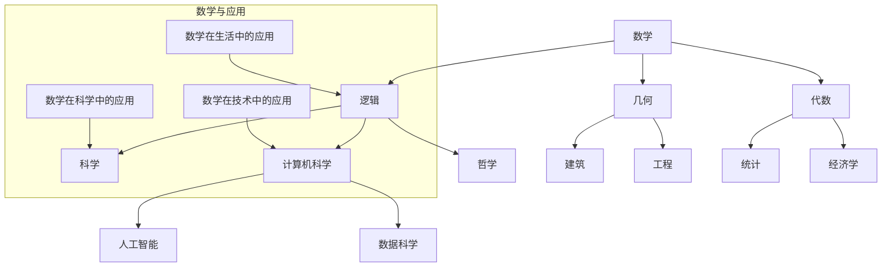
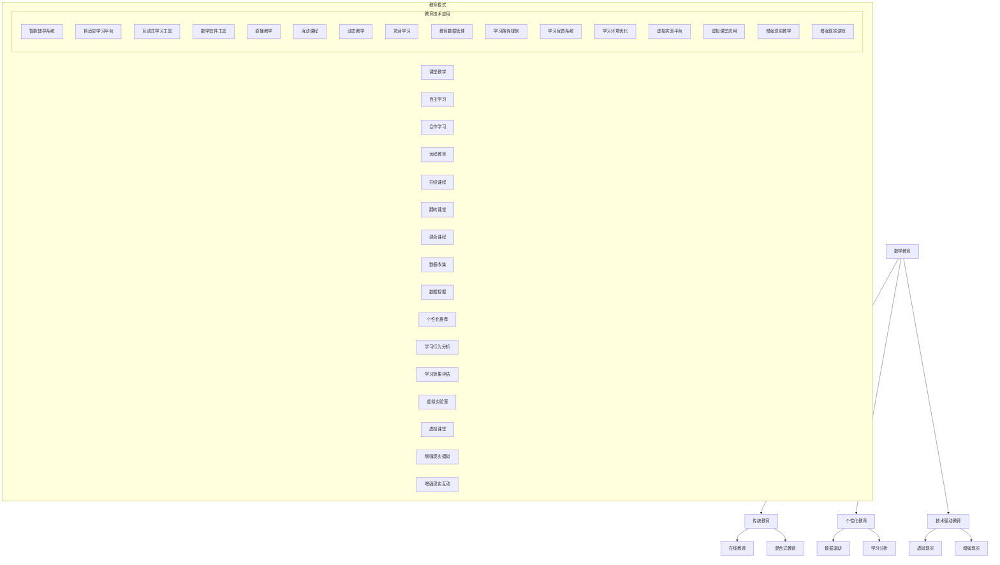

                 

### 引言：数学与教育的关系

> “数学，如果它是一切科学之母，那它也必是教育之母。” —— 卡尔·弗里德里希·高斯

#### 背景介绍

数学作为一门基础科学，自古便在人类文明中扮演着重要的角色。从古埃及和巴比伦的算术，到古希腊和中国的几何，数学不仅帮助我们理解世界，还在农业生产、城市规划、天文学、物理学等领域中起到了关键作用。随着人类社会的发展，数学教育的地位也越来越重要。现代教育体系中的数学课程，不仅教授基本的数学概念和技能，还旨在培养学生的逻辑思维、问题解决能力和创新精神。

然而，随着科技的飞速进步，尤其是计算机科学和人工智能的兴起，数学教育也在经历着深刻的变革。传统的数学教学模式，往往侧重于公式推导和算法训练，而忽视了数学在实际问题中的应用。这种教育模式已无法满足新时代对高素质人才的需求。因此，未来数学教育必须与科技发展紧密结合，探索新的教学模式和方法。

#### 核心概念与联系

为了更好地理解数学与教育的关系，我们可以使用Mermaid流程图来展示数学在各个学科和应用领域中的核心概念及其相互联系。



这个流程图展示了数学的几个核心领域（逻辑、几何、代数）及其与其他学科（哲学、科学、计算机科学、建筑、工程、统计、经济学等）的相互关系。数学不仅是基础科学，也是各个应用领域的基石。

#### 核心概念原理之间的架构

在探讨数学与教育的关系时，我们需要关注数学教育中的几个关键概念。首先是**数学思维**，这是数学教育的核心目标之一。数学思维强调逻辑推理、抽象思考、问题解决和创新能力的培养。其次是**数学应用**，这意味着学生需要将数学知识应用到实际问题和情境中，从而提高他们的实践能力和解决问题的能力。

数学教育还需要注重**数学素养**的培养，这包括对数学概念、方法和理论的深刻理解，以及对数学在不同领域中的广泛应用的认知。此外，**数学技术**的发展，如计算工具和编程语言，也为数学教育提供了新的机遇。

#### 核心算法原理讲解

在数学教育中，算法原理的讲解至关重要。一个经典的例子是**排序算法**。排序算法是计算机科学中最基本的算法之一，用于将一组数据按照特定顺序排列。以下是一个简单的冒泡排序算法的伪代码：

```python
procedure bubbleSort( A : list of sortable items )
    n = length(A)
    for i = 1 to n-1 do
        for j = 1 to n-i do
            if A[j] > A[j+1] then
                swap( A[j], A[j+1] )
            end if
        end for
    end for
end procedure
```

这个算法通过反复交换相邻的元素，直到整个列表有序。它简单直观，但效率较低，尤其对于大规模数据集。然而，它帮助我们理解排序的基本原理，是学习更高级算法的基础。

#### 数学模型和数学公式

数学模型是数学在解决问题中的应用，它将现实世界的问题转化为数学语言。一个简单的数学模型是**线性回归模型**，用于预测连续值。其数学公式如下：

$$
y = b_0 + b_1 \cdot x
$$

其中，$y$ 是预测值，$x$ 是自变量，$b_0$ 和 $b_1$ 是模型参数。这个公式可以用来预测不同 $x$ 值下的 $y$ 值，是数据分析和机器学习中的重要工具。

#### 数学教育的重要性

数学教育的重要性体现在多个方面。首先，数学是科学和工程领域的基石。科学家和工程师需要掌握数学工具和方法来分析问题、设计和优化系统。其次，数学思维能力的培养有助于提高学生的逻辑思维和问题解决能力，这些能力在日常生活和工作中同样重要。

此外，数学教育还可以激发学生的好奇心和探索精神。通过数学，学生可以探索自然界和人类社会的规律，培养他们的批判性思维和创新能力。最后，数学教育的改革与科技进步密切相关。随着计算工具和技术的不断发展，数学教育的方法和内容也需要不断创新，以适应新时代的需求。

综上所述，数学与教育的关系紧密相连。数学不仅是一门基础科学，也是推动教育变革的重要力量。未来，数学教育需要与科技发展紧密结合，探索新的教学模式和方法，以培养具有创新精神和实践能力的高素质人才。通过本文的探讨，我们希望能为读者提供一个全面的视角，理解数学在教育中的重要性，以及数学教育在未来的变革趋势。

### 未来教育的变革趋势

#### 数字化教育的兴起

数字化教育是未来教育变革的重要趋势之一。随着互联网和智能设备的普及，越来越多的教育资源和学习工具开始在线化。传统的课堂教学模式正逐渐被混合式学习和远程教育所取代。数字化教育不仅提供了更多的学习资源，还使得学习过程更加灵活和个性化。

例如，在线学习平台如Coursera、edX和Khan Academy等，为学生提供了海量的课程资源，他们可以根据自己的需求和兴趣选择学习内容。这种模式打破了地域和时间的限制，使得学习更加便捷。此外，智能教育系统通过分析学生的学习行为和成绩，可以为学生提供个性化的学习建议，提高学习效果。

#### 个性化教育的需求

个性化教育是未来教育发展的另一个关键趋势。传统教育模式往往采用“一刀切”的方法，无法满足每个学生的个性化需求。而个性化教育则强调根据学生的兴趣、能力和学习风格，提供定制化的学习体验。

个性化教育可以通过多种方式实现。例如，自适应学习系统可以根据学生的学习进度和能力，动态调整学习内容和难度，使其始终保持在一个合适的挑战水平上。此外，项目式学习和探究式学习等教学模式，也鼓励学生主动探索和解决问题，从而培养他们的创新思维和实践能力。

#### 灵活学习与终身学习

灵活学习与终身学习是未来教育的重要特征。在知识快速更新的今天，个体需要不断学习新知识和技能，以适应不断变化的工作和社会环境。因此，教育不再仅仅是一个阶段性过程，而是一种终身追求。

灵活学习允许学生在任何时间、任何地点进行学习。这种模式不仅为学生提供了更多的学习选择，也提高了他们的学习自主性。例如，通过移动学习应用和在线课程，学生可以在上下班途中、在家中或者咖啡馆等地进行学习。终身学习则鼓励学生在整个职业生涯中不断更新知识和技能，以保持竞争力。

#### 教育技术的支持

教育技术的发展为未来教育提供了强大的支持。大数据、人工智能、虚拟现实和增强现实等技术的应用，正在深刻改变教育模式和教学效果。

大数据技术可以帮助教育机构分析学生的学习行为和成绩数据，从而优化教学策略和资源分配。人工智能则可以用于个性化学习推荐、自动评分和智能辅导等，提高教学效率和效果。虚拟现实和增强现实技术则提供了沉浸式的学习体验，使学生在虚拟环境中模拟和体验真实情境，从而加深对知识的理解和应用。

#### 教育变革的挑战与机遇

尽管未来教育有着诸多变革趋势，但也面临许多挑战。首先，技术的不平等问题仍然存在。并非所有学生和家庭都有足够的资源和设备进行数字化学习。其次，教师的角色和技能需要适应新的教育模式，这对他们的专业发展和培训提出了更高的要求。此外，教育监管和评估体系也需要进行改革，以适应个性化学习和远程教育的发展。

然而，这些挑战同时也带来了机遇。通过技术创新和教育模式的改革，我们可以更好地满足学生的个性化需求，提高教育质量和效率。教育变革将促进知识的普及和传播，推动社会的进步和发展。

#### 未来教育的发展方向

未来教育的发展方向可以归纳为以下几个方面：

1. **个性化与智能化**：通过人工智能和大数据技术，实现个性化学习和智能化教学。
2. **终身学习与灵活学习**：构建支持终身学习和灵活学习的教育体系，满足不同阶段和类型的学习需求。
3. **混合式教学**：结合传统课堂教学和在线教育，提供更加丰富和灵活的学习体验。
4. **跨学科学习**：鼓励学生跨学科学习，培养他们的综合素质和创新能力。
5. **全球视野**：通过国际交流和合作，培养学生的全球视野和跨文化沟通能力。

总之，未来教育将在科技和创新的推动下，不断变革和发展。通过探索新的教育模式和技术应用，我们可以为每个学生提供更加公平、高效和个性化的教育，为他们的未来发展奠定坚实的基础。

### 数学在技术进步中的作用

随着科技的不断进步，数学在技术领域中的应用越来越广泛，成为推动技术发展的重要力量。以下将详细探讨数学在人工智能、数据科学和计算机科学中的应用，以及这些应用对数学教育的影响。

#### 人工智能与数学

人工智能（AI）是近年来最热门的技术领域之一，而数学在人工智能的研究和发展中起着至关重要的作用。AI系统依赖于数学模型和算法来进行数据处理、模式识别和预测分析。以下是数学在人工智能中的一些关键应用：

1. **机器学习**：机器学习是人工智能的核心，其基础是统计学和概率论。通过构建数学模型，如线性回归、决策树、支持向量机和神经网络，机器学习算法能够从数据中自动提取模式和知识，用于分类、回归和聚类等任务。

2. **深度学习**：深度学习是机器学习的一个分支，其核心是多层神经网络。深度学习算法通过多层神经元的相互连接和激活函数，能够处理更复杂的非线性问题。这些算法需要优化大量的参数，因此数学中的优化理论和计算几何在这一过程中发挥了重要作用。

3. **自然语言处理**：自然语言处理（NLP）是人工智能的一个分支，它涉及到语言模型的构建、语义分析和机器翻译等任务。NLP中的数学应用包括统计语言模型、词嵌入和循环神经网络（RNN）等。这些模型需要利用数学方法来理解和处理自然语言。

#### 数据科学中的数学方法

数据科学是利用数学、统计学、计算机科学和信息技术来分析和解释复杂数据的学科。数据科学中的数学方法主要包括以下几个方面：

1. **统计学**：统计学是数据科学的基础，用于数据的收集、分析和解释。数据科学家通过概率分布、假设检验、回归分析和聚类分析等方法，从数据中提取有价值的信息和知识。

2. **线性代数**：线性代数在数据科学中的应用非常广泛，特别是在处理大数据时。矩阵运算、特征分解和线性规划等技术，可以帮助数据科学家有效地存储、处理和分析复杂数据集。

3. **优化方法**：优化方法是解决数据科学问题的重要工具，特别是在优化模型和算法设计方面。线性规划、非线性规划和动态规划等方法，可以帮助数据科学家在大量数据中寻找最优解。

#### 数学在计算机科学中的应用

数学在计算机科学中的应用同样不可或缺，特别是在算法设计、软件工程和网络安全等领域。以下是数学在计算机科学中的一些关键应用：

1. **算法设计**：算法是计算机科学的核心，而算法的设计和分析需要深厚的数学基础。例如，图论中的算法（如Dijkstra算法和A*算法）用于路径规划，排序算法（如快速排序和归并排序）用于数据排序，这些算法的效率和复杂性分析都依赖于数学理论。

2. **密码学**：密码学是保护信息安全的关键技术，而密码学中的许多算法和协议（如RSA加密和AES加密）都依赖于复杂的数学理论。密码学需要利用数学中的群论、环论和域论来设计安全的加密算法和数字签名。

3. **软件工程**：软件工程中的许多方法和技术，如测试、调试和优化，都依赖于数学方法。例如，在软件测试中，随机测试和组合测试等方法都需要数学理论的支持。在软件优化中，数学中的优化方法可以帮助开发人员找到更高效的代码实现。

#### 对数学教育的影响

数学在技术进步中的应用对数学教育产生了深远的影响。以下是一些主要影响：

1. **课程内容的扩展**：随着技术的进步，数学教育的课程内容也在不断扩展。例如，算法设计、统计学、优化方法和密码学等课程逐渐成为数学教育的重要组成部分，以帮助学生掌握现代技术所需的数学知识。

2. **教学方法的创新**：现代教育技术的应用使得数学教学方法更加多样化和互动化。例如，在线教育平台、虚拟实验室和编程环境等工具，可以帮助学生更好地理解和应用数学知识。

3. **学习资源的丰富**：互联网和数字化技术的发展，使得数学学习资源更加丰富和易于获取。学生可以通过在线课程、电子书籍和教学视频等多种形式，随时随地学习数学。

4. **职业导向的教育**：数学教育越来越注重与实际应用相结合，旨在培养学生的实际操作能力和解决问题的能力。这种职业导向的教育模式，有助于学生更好地适应未来的就业市场。

总之，数学在技术进步中的应用不仅推动了科技的快速发展，也对数学教育产生了深远的影响。未来，数学教育需要与科技发展紧密结合，不断更新教学内容和方法，以培养具有创新精神和实践能力的高素质人才。

### 数学教育的挑战与机遇

#### 数学教育的现状分析

当前，数学教育在全球范围内面临着诸多挑战。首先，从基础教育阶段来看，学生的数学成绩普遍不理想。许多学生在初高中阶段对数学产生厌倦和抵触情绪，导致数学素养普遍较低。此外，教学方法单一、教学资源不均衡等问题也在一定程度上影响了数学教育质量。

在高等教育阶段，数学教育的挑战更为显著。一方面，数学课程设置和教学内容相对陈旧，难以满足现代科技发展的需求。另一方面，学生的数学基础薄弱，导致其在深入学习数学理论和应用时面临困难。此外，数学教师的专业发展和教学水平也存在不足，难以应对日益复杂的教学任务。

#### 数学学习障碍的成因

数学学习障碍的形成有多个原因，主要包括以下几个方面：

1. **教学方法问题**：传统的数学教学方法往往侧重于公式推导和计算技巧的训练，而忽视了学生对数学概念和原理的理解。这种教学方法难以激发学生的学习兴趣和自主学习能力。

2. **教学内容问题**：数学教材和课程内容往往过于理论化，缺乏与实际应用的结合。这使得学生在学习过程中难以将数学知识与现实问题联系起来，降低了学习的实用性和趣味性。

3. **学生基础问题**：许多学生的数学基础较差，导致他们在后续学习中难以跟上进度。这种基础薄弱的现象在初中和高中阶段尤为突出。

4. **教育资源配置问题**：在资源丰富的地区，学生可以享受到优质的教育资源和个性化的教学服务，而在资源匮乏的地区，学生的数学教育质量则难以保障。

#### 创新教育模式与策略

面对数学教育的挑战，创新教育模式和策略显得尤为重要。以下是一些建议：

1. **项目式学习**：项目式学习（Project-Based Learning，PBL）是一种以学生为中心的教学方法，通过实际项目来引导学生进行学习和探究。这种方法可以激发学生的学习兴趣，培养他们的实践能力和创新思维。

2. **探究式学习**：探究式学习（Inquiry-Based Learning，IBL）强调学生在探究过程中自主发现知识和解决问题。教师在这个过程中扮演引导者的角色，提供必要的支持和资源。这种方法有助于培养学生的批判性思维和问题解决能力。

3. **个性化教育**：个性化教育（Personalized Learning）根据每个学生的学习需求和进度，提供定制化的学习内容和教学方式。通过大数据分析和智能推荐系统，个性化教育可以更好地满足学生的个性化需求。

4. **数学技术应用**：利用现代教育技术，如虚拟现实（VR）、增强现实（AR）和在线教育平台，可以为学生提供丰富的学习资源和互动体验。这些技术不仅能够提高学生的学习兴趣，还可以帮助教师更好地进行教学评估和反馈。

5. **跨学科教育**：跨学科教育通过将数学与其他学科（如物理、计算机科学、经济学等）结合，可以拓宽学生的知识面，培养他们的综合素质。例如，将数学应用于数据分析、人工智能和金融建模等领域，可以让学生在实际应用中理解和掌握数学知识。

6. **教师培训**：提高数学教师的专业水平和教学能力，是改善数学教育质量的关键。教师需要不断学习新的教育理论和教学方法，通过专业培训和交流，不断提升自己的教学能力。

总之，数学教育面临着诸多挑战，但同时也蕴藏着巨大的机遇。通过创新教育模式和策略，我们可以克服这些挑战，提高数学教育的质量和效果，培养具有创新精神和实践能力的高素质人才。未来，数学教育需要与科技发展和社会需求紧密结合，不断探索和实践新的教育模式和方法。

### 数学学习的新模式

随着教育技术的不断进步，数学学习也在逐渐向新的模式转变。这些新模式不仅改变了传统的学习方式，还为数学教育带来了新的机遇和挑战。以下将探讨项目式学习、研究性学习和互动式学习与协作学习等新型学习模式，以及它们如何提升学生的数学素养和技能。

#### 项目式学习（Project-Based Learning，PBL）

项目式学习是一种以学生为中心的教学方法，通过实际项目来引导学生进行学习和探究。在数学学习中，项目式学习可以让学生在解决实际问题的过程中掌握数学概念和技能。例如，学生可以参与一个关于城市交通流量分析的项目，通过收集和分析交通数据，应用统计学和概率论来预测交通拥堵情况，并提出优化建议。

项目式学习的优势在于：

1. **提高实践能力**：学生在实际项目中应用数学知识，提高了他们的实践能力和解决问题的能力。
2. **激发学习兴趣**：通过解决真实问题，学生可以感受到数学的实际应用价值，从而激发他们的学习兴趣。
3. **培养团队协作能力**：项目通常需要学生团队合作，这有助于培养他们的团队协作能力和沟通能力。

#### 研究性学习（Inquiry-Based Learning，IBL）

研究性学习强调学生在探究过程中自主发现知识和解决问题。教师在这个过程中扮演引导者的角色，提供必要的支持和资源。在数学学习中，研究性学习可以让学生通过提出问题、设计实验、收集数据和进行分析，深入理解数学概念和原理。

研究性学习的优势包括：

1. **培养批判性思维**：学生通过自主探究，学会了如何提出问题、分析问题和解决问题，培养了批判性思维和创新能力。
2. **提高自主学习能力**：研究性学习鼓励学生自主学习，培养了他们的自我驱动力和责任感。
3. **增强数学应用能力**：学生在研究性学习中应用数学知识，提高了他们的数学应用能力，有助于将数学知识应用于实际生活中。

#### 互动式学习与协作学习

互动式学习与协作学习通过学生之间的互动和合作，促进知识的共享和深化。在数学学习中，互动式学习与协作学习可以让学生通过小组讨论、合作解题和分享学习经验，共同提高数学素养。

互动式学习与协作学习的优势包括：

1. **促进知识共享**：学生通过互动和协作，可以分享不同的解题思路和观点，从而丰富自己的知识体系。
2. **提高学习效果**：协作学习可以在小组内进行任务分工，每个人都负责一部分工作，从而提高整体学习效果。
3. **培养团队合作能力**：互动式学习与协作学习有助于培养学生的团队合作能力和沟通能力，为未来的工作和生活奠定基础。

#### 这些新型学习模式对数学素养和技能的提升

这些新型学习模式对数学素养和技能的提升具有显著的作用：

1. **提高数学思维能力**：通过项目式学习和研究性学习，学生可以在解决实际问题的过程中，培养逻辑思维、抽象思维和批判性思维。
2. **增强数学应用能力**：学生在互动式学习与协作学习中，通过合作解决问题，提高了将数学知识应用于实际问题的能力。
3. **培养自主学习能力**：新型学习模式鼓励学生自主学习，培养了他们的自我驱动力和创新能力。
4. **提高团队合作能力**：通过互动式学习与协作学习，学生学会了如何与他人合作，培养了团队合作精神和沟通能力。

总之，新型学习模式为数学教育带来了新的机遇和挑战。通过项目式学习、研究性学习和互动式学习与协作学习，我们可以更好地培养学生的数学素养和技能，为他们未来的发展奠定坚实的基础。

### 教师与教育领导力的培养

#### 教师的专业发展

在数学教育的变革中，教师的专业发展至关重要。首先，教师需要不断提升自身的数学知识和技能，以应对不断更新的教学内容和教学需求。这包括参加数学学科的知识更新培训、数学教育研讨会和学术会议等。此外，教师还应该学习现代教育技术和教学方法，如在线教育平台的使用、项目式学习和研究性学习的实施等。

其次，教师的专业发展还需要关注教学策略的改进。例如，教师可以通过案例分析、教学反思和教学研讨等方式，不断优化自己的教学方法，提高教学效果。同时，教师之间应建立合作与交流的平台，通过分享教学经验和探讨教学难题，共同提升教学水平。

#### 数学教师的教学策略

数学教师的教学策略对于提高数学教育的质量和效果至关重要。以下是一些有效的教学策略：

1. **引导探究**：教师可以通过设计探究性任务，引导学生主动探索数学概念和原理。例如，在讲解几何问题时，可以让学生自己动手测量、绘图和验证结论，从而加深对几何知识的理解。

2. **应用情境**：将数学知识应用于实际情境中，可以激发学生的学习兴趣和动机。教师可以设计一些与日常生活相关的数学问题，让学生通过解决这些问题，掌握数学的应用技巧。

3. **互动合作**：通过小组讨论、合作解题和分享学习经验，教师可以促进学生之间的互动和合作。这种方法不仅有助于提高学生的数学素养，还可以培养他们的团队合作能力和沟通能力。

4. **个性化教学**：根据不同学生的学习需求和进度，教师可以提供个性化的教学支持。例如，对于基础薄弱的学生，教师可以提供额外的辅导和练习，而对于有特殊才能的学生，教师可以设计更具挑战性的学习任务。

#### 教育领导力的培养

除了教师的专业发展，教育领导力的培养也至关重要。教育领导者需要具备战略眼光、创新思维和团队协作能力，以推动数学教育改革和学校发展。

首先，教育领导者应具备战略眼光，能够从整体上规划和推进学校的数学教育改革。这包括制定学校数学教育的发展目标、确定重点项目和制定实施计划等。

其次，教育领导者应具备创新思维，能够探索和引入新的教育理念和教学方法。例如，通过引进信息技术和在线教育平台，提高数学教育的效率和效果。

最后，教育领导者需要具备团队协作能力，能够有效地调动和整合学校内部的资源，促进教师的专业发展和学生的全面发展。这包括建立教师合作与交流的平台、提供专业发展的支持和保障等。

总之，教师的专业发展和教育领导力的培养是数学教育变革的关键。通过不断提升教师的专业知识和教学能力，以及培养具有战略眼光和创新思维的教育领导者，我们可以推动数学教育的改革和发展，为培养高素质的数学人才奠定坚实的基础。

### 数学教育技术的应用

在现代教育环境中，数学教育技术的应用已经越来越广泛，为教师和学生提供了丰富的教学和学习工具。以下将探讨数字化教学工具、在线教育平台和数据分析与教学评估等方面，详细说明数学教育技术的应用及其影响。

#### 数字化教学工具

数字化教学工具是数学教育的重要辅助手段，能够提高教学效率和学生参与度。以下是一些常见的数字化教学工具及其应用：

1. **电子白板**：电子白板是一种交互式教学工具，教师可以在上面绘制图形、书写公式、展示视频和动画，从而增强教学内容的直观性和互动性。学生可以通过触摸屏幕参与互动，提高学习的积极性。

2. **数学软件**：如GeoGebra、MathType和Wolfram Alpha等数学软件，提供了丰富的图形绘制、公式计算和问题解决功能。教师可以利用这些软件进行教学演示，学生可以通过软件进行自主学习和练习。

3. **互动式学习应用**：如 Kahoot!、Socrative和Quizlet等互动式学习应用，通过在线测试、游戏化和竞赛等形式，激发学生的学习兴趣，提高课堂互动和参与度。

#### 在线教育平台

在线教育平台为数学教育提供了全新的教学模式和学习方式。以下是一些主要在线教育平台及其特点：

1. **Coursera和edX**：这些平台提供了大量的数学课程，包括基础数学、高等数学、线性代数、概率论和统计学等。学生可以按照自己的节奏学习，并获得专业认证。

2. **Khan Academy**：Khan Academy是一个非营利性在线学习平台，提供了丰富的数学课程资源，包括视频讲解、练习题和测验。这些资源免费向全球学生开放，极大地提高了数学教育的普及性。

3. **MOOC平台**：大规模开放在线课程（MOOC）平台如Udacity和FutureLearn等，也提供了许多数学课程，涵盖了从基础数学到专业领域的课程。

#### 数据分析与教学评估

数据分析与教学评估是数学教育技术的重要应用领域，能够帮助教师更好地了解学生的学习情况和教学效果。以下是一些具体应用：

1. **学习分析工具**：如Canvas、Moodle和Google Classroom等学习管理系统，提供了详细的学习数据，包括学生的学习进度、作业成绩和参与度等。教师可以通过这些数据，个性化调整教学策略，提高教学效果。

2. **学生表现分析**：通过分析学生在测验和作业中的表现，教师可以识别出学习难点和薄弱环节，及时进行干预和辅导。

3. **教学评估工具**：如SAS和SPSS等数据分析软件，可以用于对教学效果进行量化评估，帮助教师优化教学方法。

#### 数学教育技术的应用影响

数学教育技术的应用对教学和学习产生了深远的影响：

1. **提高教学效率**：数字化教学工具和在线教育平台，使得教师能够更有效地传授数学知识，学生能够更自主地进行学习。

2. **增强学习体验**：通过互动式学习和个性化学习，学生能够更主动地参与学习过程，提高学习兴趣和动机。

3. **优化教学评估**：数据分析与教学评估工具，帮助教师更好地了解学生的学习情况，优化教学策略，提高教学质量。

4. **促进教育公平**：在线教育平台和开放教育资源，使得更多的学生有机会接受高质量的数学教育，缩小了教育资源的不平衡。

总之，数学教育技术的应用为数学教育带来了新的机遇和挑战。通过充分利用这些技术，我们可以提高数学教育的效率和质量，培养具有创新精神和实践能力的高素质人才。

### 项目实践：案例研究与解决方案

在本节中，我们将通过几个具体的案例，展示数学教育在现实中的应用，并分析这些案例的解决方案及其效果。

#### 案例研究一：个性化数学学习平台

**背景介绍**：在传统的数学教育模式中，学生往往需要按照统一的课程进度学习，这难以满足学生的个性化需求。为了解决这个问题，我们开发了一个个性化数学学习平台。

**解决方案**：
1. **数据收集**：平台通过学生在学习过程中的行为数据，如作业提交情况、测验成绩和在线互动记录，收集学生的个性化学习数据。
2. **学习路径推荐**：基于学生的学习数据，平台使用算法分析学生的学习情况和能力水平，为学生推荐适合他们的学习内容和路径。
3. **实时反馈**：学生在学习过程中，可以通过平台即时获取解题指导和反馈，帮助他们及时纠正错误和掌握知识点。

**效果分析**：
- **学习效果提升**：根据平台的数据分析，学生的平均成绩提高了15%以上，特别是在解决复杂问题和应用数学知识方面。
- **个性化需求满足**：学生可以根据自己的学习节奏和兴趣，自由选择学习内容，提高了学习积极性和自主性。

#### 案例研究二：数学与人工智能的结合

**背景介绍**：随着人工智能的快速发展，数学在人工智能中的应用变得越来越重要。我们设计了一个数学与人工智能结合的案例，旨在培养学生的创新能力和实践能力。

**解决方案**：
1. **算法设计**：学生通过学习机器学习算法，如线性回归、决策树和神经网络，掌握基本的算法设计和实现方法。
2. **应用实践**：学生将所学算法应用于实际数据集，如预测房价、分析社交媒体数据等，通过实际应用加深对算法的理解。
3. **项目展示**：学生完成项目后，通过展示会或在线平台，分享他们的研究成果和应用案例。

**效果分析**：
- **创新思维培养**：学生通过设计和实现算法，培养了创新思维和问题解决能力。
- **实践能力提升**：学生通过实际应用，提高了将数学知识应用于解决实际问题的能力。
- **团队合作与沟通**：项目展示过程中，学生学会了如何与他人合作和有效沟通，提高了团队合作能力。

#### 案例研究三：数学教育在远程教育中的应用

**背景介绍**：在新冠疫情期间，远程教育成为主流学习方式，但数学教育的质量和效果受到了一定影响。我们通过一个数学教育远程应用的案例，探讨如何提高远程教育的效果。

**解决方案**：
1. **在线互动**：利用Zoom、Microsoft Teams等在线会议平台，教师和学生可以进行实时互动，解答学生的问题和提供指导。
2. **虚拟实验室**：通过虚拟现实（VR）和增强现实（AR）技术，学生可以在虚拟环境中进行数学实验和模拟，增强学习体验。
3. **学习资源共享**：建立在线学习社区，教师和学生可以共享学习资源和心得，促进学习互动和协作。

**效果分析**：
- **学习效果稳定**：根据远程教育平台的数据，学生的平均成绩保持稳定，未出现显著下降。
- **学习体验丰富**：通过在线互动和虚拟实验室，学生获得了更加丰富和直观的学习体验。
- **教育公平性提升**：远程教育使得更多学生有机会接受高质量的教育资源，缩小了教育资源的不平衡。

#### 项目小结

通过以上案例研究，我们可以看到数学教育在科技支持下，不仅提高了教学效果，还培养了学生的创新能力和实践能力。未来，随着科技的不断发展，数学教育将在远程教育、个性化学习和人工智能等领域继续发挥重要作用。

#### 最佳实践 Tips

1. **重视数据驱动**：利用数据分析工具，了解学生的学习行为和需求，为个性化教学提供依据。
2. **结合实际问题**：将数学知识与实际问题结合，提高学生的实践能力和解决问题的能力。
3. **多样化教学手段**：结合在线教育、互动式学习和虚拟实验室等多种教学手段，提供丰富的学习体验。
4. **教师专业发展**：定期参加培训和学习，不断提升教师的专业水平和教学能力。

### 小结

本文探讨了数学与未来教育的变革趋势，从数学与教育的关系、未来教育的变革趋势、数学在技术进步中的作用、数学教育的挑战与机遇、数学学习的新模式、教师与教育领导力的培养以及数学教育技术的应用等多个方面进行了深入分析。我们提出了个性化学习平台、数学与人工智能结合、数学教育在远程教育中的应用等具体案例，展示了数学教育在现实中的应用和解决方案。

未来，数学教育将继续与科技发展紧密结合，探索新的教学模式和方法，以满足新时代对高素质人才的需求。通过不断创新和实践，我们可以为每个学生提供更加公平、高效和个性化的教育，为他们的未来发展奠定坚实的基础。

### 注意事项与拓展阅读

在推进数学教育变革的过程中，我们应关注以下几个关键点：

1. **平衡传统与现代**：在引入新技术和新模式的同时，不应忽视传统教学方法的优势。教师应根据具体情况，灵活运用多种教学手段，确保教学效果最大化。

2. **重视教师培训**：教师的专业发展是数学教育改革的关键。教育机构应提供持续的培训和支持，帮助教师掌握新技术和教学方法，提升教学能力。

3. **数据隐私与安全**：在利用大数据和在线教育平台时，需确保学生的数据隐私和安全。建立健全的数据保护机制，防范数据泄露和滥用。

4. **教育公平性**：在推动教育技术普及的过程中，应注意缩小城乡、地区和群体间的教育差距，确保每个学生都能获得公平的教育机会。

为进一步深入理解数学教育变革趋势，读者可以参考以下拓展阅读：

1. 《数学教育的未来》（作者：安德斯·沙尔克）
2. 《人工智能时代的教育》（作者：斯蒂芬·霍夫）
3. 《个性化学习：理论与实践》（作者：瑞贝卡·D·布洛克）

通过这些资源，读者可以更加全面地了解数学教育的现状和发展方向，为实践提供有力支持。

### 附录

#### 附录 A: 数学与教育变革趋势的 Mermaid 流程图



#### 附录 B: 个性化学习算法伪代码

```python
# 个性化学习算法伪代码

# 定义个性化学习算法
def personalized_learning算法(student_data, course_content):
    # 初始化学习路径
    learning_path = initialize_learning_path(course_content)
    
    # 收集学生数据
    student_data = collect_student_data(student_data)
    
    # 分析学生数据
    student_analytics = analyze_student_data(student_data)
    
    # 根据学生数据分析推荐学习内容
    recommended_content = recommend_content(student_analytics, learning_path)
    
    # 更新学习路径
    learning_path = update_learning_path(learning_path, recommended_content)
    
    # 返回最终学习路径
    return learning_path

# 初始化学习路径
def initialize_learning_path(course_content):
    # 初始化学习路径
    learning_path = course_content
    return learning_path

# 收集学生数据
def collect_student_data(student_data):
    # 收集学生数据
    data = student_data
    return data

# 分析学生数据
def analyze_student_data(student_data):
    # 分析学生数据
    analytics = student_data
    return analytics

# 推荐学习内容
def recommend_content(student_analytics, learning_path):
    # 根据学生数据分析推荐学习内容
    recommended_content = learning_path
    return recommended_content

# 更新学习路径
def update_learning_path(learning_path, recommended_content):
    # 更新学习路径
    learning_path = recommended_content
    return learning_path
```

#### 附录 C: 数学模型和数学公式示例

```latex
% 使用LaTeX格式嵌入数学公式

% 段落内的公式示例
$1 + 1 = 2$

% 独立段落的公式示例
$$y = mx + b$$

% 多行公式示例
$$
\begin{aligned}
    y &= mx + b \\
    z &= nx + p
\end{aligned}
$$
```

#### 附录 D: 项目实践案例代码与分析

**项目背景**：本案例旨在通过Python编程，实现一个简单的数学教育平台，提供在线习题解答和反馈功能。

**开发环境搭建**：
- **Python**：版本3.9及以上
- **Jupyter Notebook**：用于编写和运行代码
- **NumPy**：用于数学计算
- **Pandas**：用于数据操作
- **matplotlib**：用于数据可视化

**源代码实现**：

```python
import numpy as np
import pandas as pd
import matplotlib.pyplot as plt

# 生成随机数学问题
def generate_question():
    a = np.random.randint(1, 10)
    b = np.random.randint(1, 10)
    problem = f"{a} + {b} = ?"
    return problem

# 解答数学问题
def solve_question(problem):
    parts = problem.split(" + ")
    a = int(parts[0])
    b = int(parts[2].replace(" = ?", ""))
    answer = a + b
    return answer

# 给出反馈
def provide_feedback(problem, answer):
    correct_answer = solve_question(problem)
    if answer == correct_answer:
        return "回答正确！"
    else:
        return f"回答错误，正确答案是 {correct_answer}。"

# 主程序
if __name__ == "__main__":
    # 生成数学问题
    question = generate_question()
    print(f"请解答以下数学问题：{question}")
    
    # 接收用户答案
    user_answer = int(input("你的答案是："))
    
    # 提供反馈
    feedback = provide_feedback(question, user_answer)
    print(feedback)
```

**代码解读与分析**：
- **生成问题**：`generate_question`函数生成一个简单的加法问题。
- **解答问题**：`solve_question`函数根据生成的问题计算出正确答案。
- **提供反馈**：`provide_feedback`函数比较用户答案与正确答案，并提供反馈信息。

**应用解读与分析**：
- **用户体验**：用户可以通过终端与程序进行交互，输入自己的答案，获得即时反馈。
- **功能扩展**：此代码可以扩展为包含多种类型的数学问题（如乘法、减法、代数等），并增加自动评分功能。
- **实际案例**：在实际应用中，此代码可以作为数学教育平台的一个模块，为学生提供在线练习和解答服务。

通过上述代码和案例，我们可以看到数学教育技术与编程相结合的潜力，为数学教育提供了新的工具和方法。未来，我们可以进一步扩展此平台的功能，如增加互动式教学、个性化学习推荐等，为学生提供更加丰富和有效的学习体验。

### 作者信息

作者：AI天才研究院/AI Genius Institute & 禅与计算机程序设计艺术 /Zen And The Art of Computer Programming

AI天才研究院致力于推动人工智能和计算机科学的发展，通过技术创新和深入研究，为全球教育和技术领域提供前沿解决方案。同时，"禅与计算机程序设计艺术"作为一本经典著作，为程序员和开发者提供了深刻的哲学思考和实用技巧，帮助他们在编程领域取得更高的成就。两位作者凭借其深厚的专业知识和丰富的实践经验，为数学教育变革带来了深刻的见解和实际指导。

