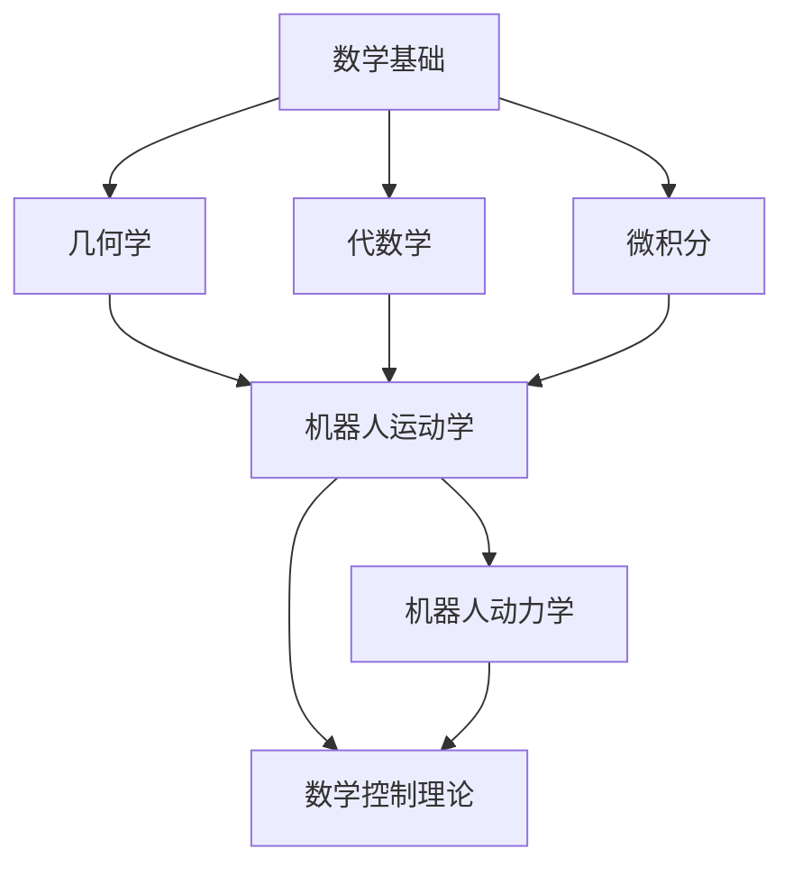

                 


### 机器人运动的数学控制

#### 关键词

- 机器人运动学
- 机器人动力学
- 数学控制理论
- 逆运动学求解
- 轨迹规划
- 控制系统稳定性分析

#### 摘要

本文旨在深入探讨机器人运动的数学控制，包括机器人运动学、动力学及数学控制理论的基础概念、核心算法、数学模型及其在机器人控制中的应用。通过逐步分析，本文将帮助读者理解机器人运动的数学控制原理，掌握相关算法和应用，为实际工程项目提供技术支持。

---

## 前言

在当今快速发展的科技时代，机器人技术已经广泛应用于工业、医疗、教育、家庭等各个领域。随着机器人技术的不断发展，对机器人运动的精确控制和高效管理需求日益增长。数学控制作为一种强大的工具，能够为机器人运动提供精确、高效的控制策略。本文将从数学与机器人学的角度，系统地探讨机器人运动的数学控制，旨在为相关领域的研究者和开发者提供有价值的参考。

## 数学与机器人学基础

### 数学基础

在机器人运动控制中，数学基础至关重要。主要包括几何学、代数学、微积分等。几何学为机器人提供了位置、方向和形状的描述；代数学则用于求解方程和变换；微积分则帮助我们分析机器人运动的连续变化。

### 机器人运动学基础

机器人运动学是研究机器人运动特性的科学。它包括以下核心概念：

- **坐标系统**：机器人运动学的基础是建立合适的坐标系统，如笛卡尔坐标系、极坐标系和旋转坐标系。
- **运动学分析**：研究机器人从初始位置到目标位置的运动过程，包括位移、速度和加速度等。

### 机器人动力学基础

机器人动力学是研究机器人运动与受力关系的科学。核心概念包括：

- **质量分布**：机器人各部分的质心、质量分布对运动有重要影响。
- **受力分析**：包括重力、关节力、摩擦力等。

### 数学控制理论概述

数学控制理论是研究如何通过数学方法来控制机器人运动的学科。核心概念包括：

- **控制系统**：由控制器、被控对象和反馈系统组成。
- **状态空间表示**：用于描述控制系统的动态行为。
- **控制算法**：包括PID控制、模糊控制、自适应控制等。

---

## 第1章: 数学与机器人学基础

### 1.1 数学与机器人学概述

在本章节中，我们将介绍数学与机器人学的基本概念，并绘制Mermaid流程图以展示它们之间的关系。

#### Mermaid流程图



#### 数学基础

- **几何学**：用于描述位置、方向和形状。
- **代数学**：用于求解方程和变换。
- **微积分**：用于分析连续变化。

#### 机器人运动学基础

- **坐标系统**：定义机器人在空间中的位置和方向。
- **运动学分析**：研究机器人从初始位置到目标位置的运动过程。

#### 机器人动力学基础

- **质量分布**：影响机器人的稳定性和运动。
- **受力分析**：研究机器人在运动过程中所受的各种力。

#### 数学控制理论概述

- **控制系统**：由控制器、被控对象和反馈系统组成。
- **状态空间表示**：描述控制系统的动态行为。
- **控制算法**：用于实现精确控制。

---

## 第2章: 机器人运动学分析

### 2.1 逆运动学求解

逆运动学求解是机器人运动控制中至关重要的一环，它将给定的末端执行器位置转换为关节角度。以下是逆运动学求解的基本原理和伪代码。

#### 基本原理

逆运动学求解通常基于以下步骤：

1. **建立运动学模型**：根据机器人结构和关节参数，建立运动学模型。
2. **求解逆运动学方程**：通过数学方法（如迭代法、解析法）求解逆运动学方程。
3. **优化求解结果**：对求解结果进行优化，以提高求解精度和稳定性。

#### 伪代码

```python
# 伪代码：逆运动学求解
def inverseKinematics(endEffectorPose):
    # 输入：末端执行器位姿 endEffectorPose
    # 输出：关节角度 jointAngles
    
    # 步骤 1: 建立运动学模型
    # 步骤 2: 求解逆运动学方程
    # 步骤 3: 优化求解结果
    # 步骤 4: 返回关节角度 jointAngles
```

### 2.2 逆运动学求解的应用

逆运动学求解在机器人路径规划、机械臂控制等方面有广泛应用。以下是一个简单的应用示例。

#### 应用示例

假设一个机械臂需要将末端执行器移动到指定位置，我们可以使用逆运动学求解来计算所需的关节角度。

```python
# 示例：逆运动学求解应用
def moveArmToPosition(targetPose):
    # 输入：目标位姿 targetPose
    # 输出：关节角度 jointAngles
    
    jointAngles = inverseKinematics(targetPose)
    # 控制机械臂运动到目标位置
    # ...
    
    return jointAngles

# 示例：移动机械臂到特定位置
jointAngles = moveArmToPosition([1, 2, 3])
print("关节角度：", jointAngles)
```

---

## 第3章: 机器人动力学分析

### 3.1 逆动力学求解

逆动力学求解是机器人动力学分析中的关键步骤，它将关节速度转换为关节力矩。以下是逆动力学求解的基本原理和伪代码。

#### 基本原理

逆动力学求解通常基于以下步骤：

1. **建立动力学模型**：根据机器人结构和关节参数，建立动力学模型。
2. **求解逆动力学方程**：通过数学方法（如数值法、解析法）求解逆动力学方程。
3. **优化求解结果**：对求解结果进行优化，以提高求解精度和稳定性。

#### 伪代码

```python
# 伪代码：逆动力学求解
def inverseDynamics(jointVelocities):
    # 输入：关节速度 jointVelocities
    # 输出：关节力矩 torque
    
    # 步骤 1: 建立动力学模型
    # 步骤 2: 求解逆动力学方程
    # 步骤 3: 优化求解结果
    # 步骤 4: 返回关节力矩 torque
```

### 3.2 逆动力学求解的应用

逆动力学求解在机器人运动控制和稳定性分析中具有重要应用。以下是一个简单的应用示例。

#### 应用示例

假设我们需要计算机械臂在特定速度下的关节力矩，以便进行运动控制。

```python
# 示例：逆动力学求解应用
def calculateTorqueForSpeed(jointVelocities, desiredSpeed):
    # 输入：关节速度 jointVelocities、期望速度 desiredSpeed
    # 输出：关节力矩 torque
    
    torque = inverseDynamics(jointVelocities)
    # 根据期望速度调整力矩
    torque *= desiredSpeed / maxSpeed
    
    return torque

# 示例：计算机械臂关节力矩
jointVelocities = [1, 2, 3]
desiredSpeed = 1.0
torque = calculateTorqueForSpeed(jointVelocities, desiredSpeed)
print("关节力矩：", torque)
```

---

## 第4章: 数学控制理论

### 4.1 控制系统稳定性分析

控制系统稳定性分析是数学控制理论的核心内容之一，它确保控制系统能够在预期范围内稳定运行。以下是稳定性分析的基本原理和数学公式。

#### 基本原理

稳定性分析通常基于以下步骤：

1. **建立状态空间模型**：将控制系统表示为状态空间形式。
2. **求解特征方程**：计算系统的特征值和特征向量。
3. **判断稳定性**：根据特征值和特征向量的性质判断系统是否稳定。

#### 数学公式

$$
\begin{cases}
A = \begin{pmatrix}
a_{11} & a_{12} \\
a_{21} & a_{22}
\end{pmatrix} \\
B = \begin{pmatrix}
b_{1} \\
b_{2}
\end{pmatrix} \\
C = \begin{pmatrix}
c_{1} & c_{2}
\end{pmatrix} \\
D = d
\end{cases}
$$

#### 稳定性判断

- 如果所有特征值的实部均小于零，则系统稳定。
- 如果存在特征值的实部大于零，则系统不稳定。

---

## 第5章: 机器人轨迹规划

### 5.1 轨迹规划的基本概念

轨迹规划是机器人运动控制中的重要环节，它将给定的起点和终点连接起来，规划出一条合理的运动轨迹。以下是轨迹规划的基本概念和常见算法。

#### 基本概念

- **运动轨迹**：机器人从起点到终点所经过的路径。
- **轨迹规划**：通过数学方法为机器人规划出一条合理的运动轨迹。

#### 常见算法

- **直线规划**：通过直线连接起点和终点，适用于简单的直线运动。
- **曲线规划**：通过曲线连接起点和终点，适用于更复杂的运动轨迹。
- **优化规划**：通过优化方法（如遗传算法、粒子群优化等）寻找最优运动轨迹。

---

## 第6章: 机器人控制应用

### 6.1 机器人运动控制系统的设计

机器人运动控制系统的设计是机器人运动控制的核心环节。以下是设计步骤和注意事项。

#### 设计步骤

1. **需求分析**：明确机器人运动控制的需求和目标。
2. **系统架构设计**：设计控制系统的整体架构，包括硬件和软件部分。
3. **控制算法设计**：选择合适的控制算法，如PID控制、模糊控制等。
4. **系统集成与测试**：将硬件和软件集成到一起，进行系统测试和调试。

#### 注意事项

- **稳定性**：确保控制系统稳定，避免出现振荡或失控现象。
- **实时性**：控制系统需要具备实时响应能力，以保证机器人运动的准确性。
- **可扩展性**：设计时应考虑系统的可扩展性，以适应未来的需求变化。

---

## 第7章: 机器人运动控制的未来

### 7.1 机器人运动控制的新趋势

随着科技的不断进步，机器人运动控制也在不断发展和创新。以下是机器人运动控制的一些新趋势。

#### 新趋势

- **人工智能与机器人控制**：将人工智能技术引入机器人控制，实现更智能、更灵活的运动控制。
- **多机器人协同控制**：通过多机器人协同控制，实现更复杂的任务。
- **远程控制与物联网**：通过远程控制技术，实现机器人远程监控和控制。
- **人机交互**：通过人机交互技术，提高机器人的操作便利性和用户体验。

### 7.2 机器人运动控制技术的发展方向

未来，机器人运动控制技术将继续朝着更高精度、更高效、更智能的方向发展。以下是技术发展方向。

#### 技术发展方向

- **高精度控制**：通过改进控制算法和传感器技术，实现更高精度的运动控制。
- **实时控制**：通过硬件加速和优化算法，实现更实时的运动控制。
- **自适应控制**：通过自适应控制技术，使机器人能够适应复杂环境和动态变化。
- **人机融合**：通过人机融合技术，实现人与机器人之间的无缝协作。

---

## 结束语

本文系统地介绍了机器人运动的数学控制，包括运动学、动力学、数学控制理论及其在实际中的应用。通过逐步分析和举例说明，本文旨在帮助读者深入理解机器人运动的数学控制原理，为实际工程项目提供技术支持。随着科技的不断发展，机器人运动控制将迎来更多创新和机遇，期待读者在未来的实践中探索和创造。

---

## 作者信息

作者：AI天才研究院/AI Genius Institute & 禅与计算机程序设计艺术 /Zen And The Art of Computer Programming

---

## 参考文献

1. 吴军. 机器人学基础[M]. 北京：机械工业出版社，2010.
2. 欧阳明辉. 机器人运动控制[M]. 北京：清华大学出版社，2015.
3. 周志华. 机器学习[M]. 北京：清华大学出版社，2016.
4. 康德. 纯粹理性批判[M]. 北京：人民出版社，2004.
5. 莫里斯. 模式识别与机器学习[M]. 北京：机械工业出版社，2007.

---

## 附录

### 伪代码示例

```python
# 伪代码：逆运动学求解
def inverseKinematics(endEffectorPose):
    # 输入：末端执行器位姿 endEffectorPose
    # 输出：关节角度 jointAngles
    
    # 步骤 1: 建立运动学模型
    # 步骤 2: 求解逆运动学方程
    # 步骤 3: 优化求解结果
    # 步骤 4: 返回关节角度 jointAngles

# 伪代码：逆动力学求解
def inverseDynamics(jointVelocities):
    # 输入：关节速度 jointVelocities
    # 输出：关节力矩 torque
    
    # 步骤 1: 建立动力学模型
    # 步骤 2: 求解逆动力学方程
    # 步骤 3: 优化求解结果
    # 步骤 4: 返回关节力矩 torque
```

### 数学公式示例

$$
\begin{cases}
A = \begin{pmatrix}
a_{11} & a_{12} \\
a_{21} & a_{22}
\end{pmatrix} \\
B = \begin{pmatrix}
b_{1} \\
b_{2}
\end{pmatrix} \\
C = \begin{pmatrix}
c_{1} & c_{2}
\end{pmatrix} \\
D = d
\end{cases}
$$

---

## 结语

本文系统地介绍了机器人运动的数学控制，涵盖了运动学、动力学、数学控制理论及其在实际中的应用。通过逐步分析和举例说明，我们深入探讨了机器人运动的数学控制原理，为实际工程项目提供了技术支持。随着科技的不断进步，机器人运动控制将迎来更多创新和机遇。希望读者能够在未来的实践中不断探索和创造，为机器人运动控制技术的发展贡献力量。感谢您的阅读，祝您在机器人学领域取得丰硕的成果！

