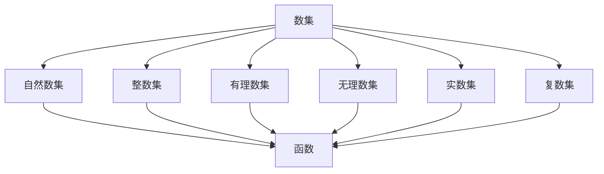
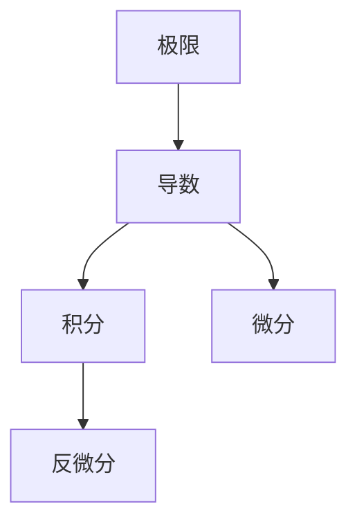
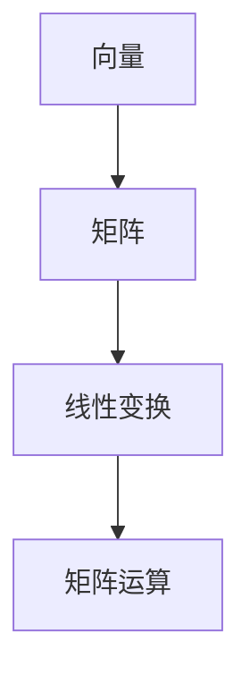
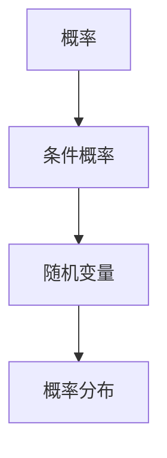
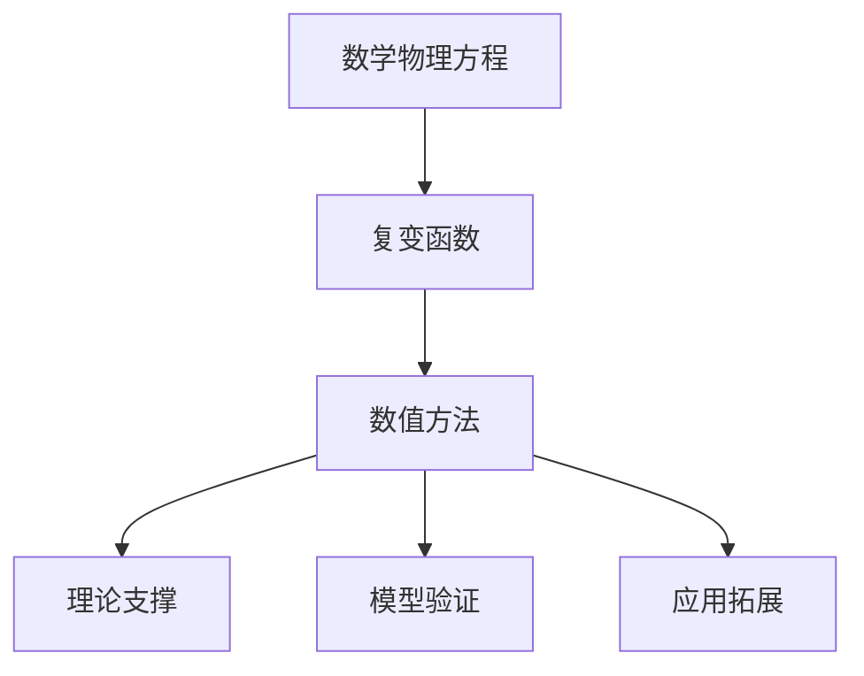
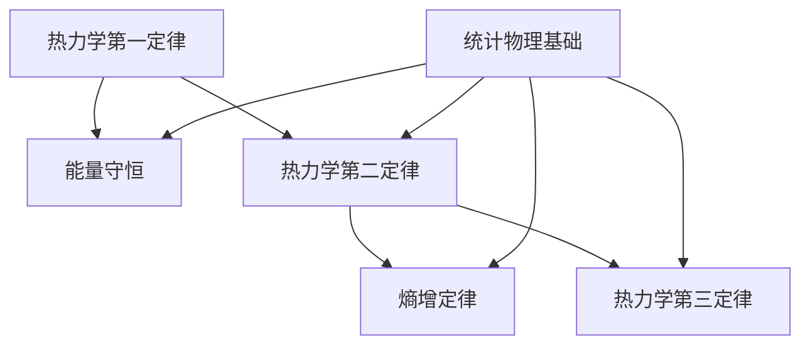
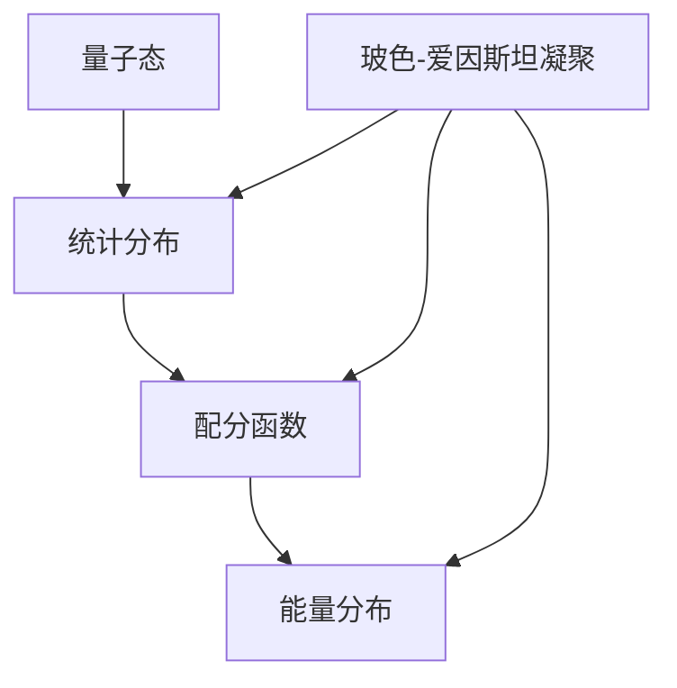
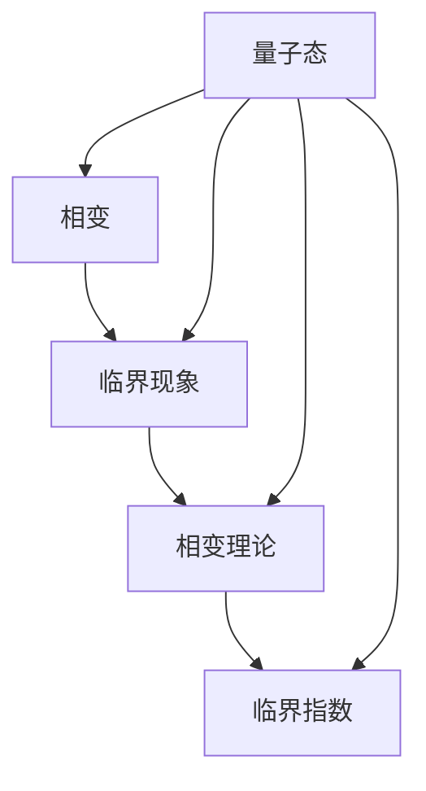
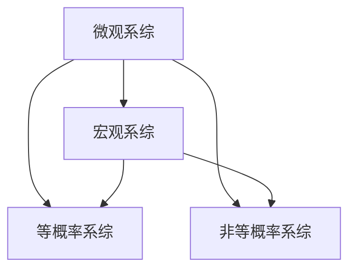

                 

### 引言

#### 数学与统计物理：定义与背景

数学与统计物理是两门看似不同但又紧密联系的学科。数学作为一种基础学科，以其严格的逻辑和抽象的模型，为物理学的发展提供了强有力的工具。而统计物理则是应用概率论和统计方法来研究物理系统的宏观行为和性质。这两者的结合，不仅推动了物理学理论的深入发展，也为现代科学技术进步提供了重要的理论支撑。

#### 书籍核心目标

本书旨在为读者提供一个系统、全面、易懂的数学与统计物理的学习指南。通过深入探讨数学在物理中的应用，以及统计物理的基本概念和方法，本书旨在帮助读者：

1. **掌握数学与物理的核心概念和原理**：通过详细讲解数集与函数、微积分、线性代数、概率论等数学基础，以及数学物理方程、复变函数等在物理中的应用，使读者能够建立坚实的理论基础。
2. **理解统计物理的基本理论和应用**：通过介绍热力学与统计物理原理、量子统计物理、相变与临界现象等，使读者能够掌握统计物理的核心方法和应用。
3. **培养解决实际问题的能力**：通过实际项目案例的讲解，帮助读者将所学知识应用于实际，提高解决实际问题的能力。

#### 读者对象

本书适合于：

1. **物理学和数学专业的本科生和研究生**：作为教材或参考书，帮助读者系统学习数学与统计物理的核心内容。
2. **科技工作者和研究人员**：作为进阶读物，帮助读者深入理解和应用数学与统计物理的理论和方法。
3. **对数学与物理有兴趣的公众**：作为科普读物，帮助读者了解数学与统计物理的魅力和重要性。

#### 结构安排

本书分为四个主要部分：

1. **数学基础**：包括数集与函数、微积分、线性代数、概率论等基础数学概念和原理，以及其在物理中的应用。
2. **统计物理基础**：介绍热力学与统计物理原理、量子统计物理、相变与临界现象等统计物理的核心概念和方法。
3. **数学与统计物理的交叉应用**：深入探讨数学与统计物理在具体领域中的应用，如量子统计物理、相变与信息理论等。
4. **方法与实践**：通过实际项目案例的讲解，帮助读者将所学知识应用于实际，提高解决实际问题的能力。

### 核心关键词

1. **数学与物理**
2. **统计物理**
3. **微积分**
4. **线性代数**
5. **概率论**
6. **量子统计物理**
7. **相变与临界现象**

### 摘要

本书《数学与统计物理的概念与方法》旨在为读者提供一个全面、深入、易懂的数学与统计物理学习指南。从数学基础到统计物理的核心概念，再到数学与统计物理的交叉应用，本书系统地介绍了数学与统计物理的基本理论和应用方法。通过详细讲解数集与函数、微积分、线性代数、概率论等数学基础，以及数学物理方程、复变函数等在物理中的应用，本书帮助读者建立坚实的理论基础。同时，通过介绍热力学与统计物理原理、量子统计物理、相变与临界现象等，使读者能够掌握统计物理的核心方法和应用。通过实际项目案例的讲解，本书旨在培养读者解决实际问题的能力。本书适合于物理学和数学专业的本科生和研究生、科技工作者和研究人员，以及对数学与物理有兴趣的公众。

----------------------------------------------------------------

## 第一部分：数学基础

### 第1章：数学概念与原理

### 1.1 数集与函数

#### 背景介绍

数集与函数是数学中最基本的概念之一，它们构成了数学分析、线性代数、概率论等众多分支的基础。在物理学中，数集和函数同样扮演着重要的角色，例如在描述物理系统状态和变化时，数集和函数的运用无处不在。

#### 核心概念与联系

数集是指具有某种性质的一组数。常见的数集包括自然数集、整数集、有理数集、无理数集、实数集和复数集。这些数集之间存在包含关系，即每个低级数集都是高级数集的子集。

函数是一种将一个集合（定义域）中的每个元素映射到另一个集合（值域）中的唯一元素的关系。函数通常用符号f表示，其形式可以表示为f: X → Y，其中X是定义域，Y是值域。

数集与函数之间的联系主要体现在以下几个方面：

1. **数集作为函数的定义域和值域**：函数的定义域和值域必须是数集，这样才能进行数学运算和表示。
2. **函数作为数集上的运算**：例如，函数可以定义在实数集上，并通过运算（如加法、乘法、求导等）来处理数集。
3. **数集的划分与函数的图像**：通过数集的划分，可以构造出不同的函数，而函数的图像直观地展示了数集的划分和函数的性质。

#### Mermaid流程图：数集与函数的基本概念流程

### 1.2 微积分基础

#### 核心概念与联系

微积分是数学的一个重要分支，主要研究函数的极限、导数、积分以及它们的运用。微积分在物理学中的应用非常广泛，如描述物体的运动、分析物理系统的稳定性等。

1. **极限**：极限是微积分的基础概念，用来描述函数在某一点附近的变化趋势。极限的定义如下：

$$
\lim_{x \to a} f(x) = L
$$

其中，$f(x)$是函数，$a$是自变量的极限值，$L$是函数值的极限。

2. **导数**：导数表示函数在某一点的瞬时变化率。导数的定义如下：

$$
f'(a) = \lim_{h \to 0} \frac{f(a+h) - f(a)}{h}
$$

3. **积分**：积分是微分的反操作，用于计算函数在某区间内的累积量。定积分的定义如下：

$$
\int_a^b f(x)dx = \lim_{n \to \infty} \sum_{i=1}^n f(x_i^*) \Delta x
$$

其中，$x_i^*$是区间$[a, b]$上的任意一点，$\Delta x$是区间长度。

微积分中的这些核心概念之间存在着紧密的联系：

1. **导数与极限**：导数是极限的一个应用，极限用于定义导数。
2. **积分与导数**：积分是导数的反操作，导数可以用来求解积分。

#### Mermaid流程图：微积分基础概念流程

### 1.3 线性代数基础

#### 核心概念与联系

线性代数是研究向量空间、线性变换和矩阵理论的数学分支。线性代数在物理学中的应用非常广泛，如描述物理系统的状态、分析线性系统的稳定性等。

1. **向量**：向量是具有大小和方向的量。向量的表示通常采用有序数组形式，例如$\vec{v} = (v_1, v_2, ..., v_n)$。

2. **矩阵**：矩阵是一个由数字排列成的矩形阵列。矩阵的表示通常采用大写字母表示，例如$A = \begin{bmatrix} a_{11} & a_{12} & ... & a_{1n} \\ a_{21} & a_{22} & ... & a_{2n} \\ ... & ... & ... & ... \\ a_{m1} & a_{m2} & ... & a_{mn} \end{bmatrix}$。

3. **线性变换**：线性变换是一种将向量映射到另一个向量或矩阵的函数。线性变换通常用符号$T$表示，其形式可以表示为$T: V \to W$，其中$V$和$W$是向量空间。

线性代数中的核心概念之间的联系如下：

1. **向量与矩阵**：向量可以看作是特殊形式的矩阵，而矩阵可以看作是向量的扩展。
2. **线性变换与矩阵**：线性变换可以通过矩阵来表示，矩阵是线性变换的一种数学工具。
3. **矩阵运算**：矩阵的加法、乘法、逆运算等运算可以用来实现线性变换和向量运算。

#### Mermaid流程图：线性代数基础概念流程

### 1.4 概率论基础

#### 核心概念与联系

概率论是研究随机现象的数学分支，它在统计物理和物理学中有着广泛的应用。概率论中的核心概念包括概率、条件概率、随机变量、概率分布等。

1. **概率**：概率是描述随机事件发生可能性的一种量。概率的取值范围在0到1之间，0表示不可能发生，1表示必然发生。

2. **条件概率**：条件概率是描述在某个事件发生的前提下，另一个事件发生的概率。条件概率的定义如下：

$$
P(A|B) = \frac{P(A \cap B)}{P(B)}
$$

3. **随机变量**：随机变量是描述随机现象的数学工具，它可以是一个函数，将样本空间映射到实数集。

4. **概率分布**：概率分布描述了随机变量的概率分布情况。常见的概率分布包括二项分布、正态分布、泊松分布等。

概率论中的这些核心概念之间的联系如下：

1. **概率与条件概率**：条件概率是概率的一个扩展，用于描述在某个条件下事件发生的概率。
2. **随机变量与概率分布**：随机变量是概率分布的载体，而概率分布描述了随机变量的分布情况。
3. **概率论在物理中的应用**：概率论可以用来描述物理系统的随机行为，如粒子的随机运动、系统的热力学性质等。

#### Mermaid流程图：概率论基础概念流程

### 1.5 数学在物理中的应用

#### 核心概念与联系

数学在物理中的应用非常广泛，从经典力学到量子力学，从热力学到统计物理，数学的抽象和精确性为物理理论的建立和验证提供了强有力的工具。

1. **数学物理方程**：数学物理方程是描述物理系统运动和变化规律的方程，如波动方程、热方程、电磁场方程等。这些方程通常通过微分方程或偏微分方程来表示。

2. **复变函数**：复变函数是研究复数域上的函数的数学分支，它在电磁学、流体力学等领域有着重要的应用。

3. **数值方法**：数值方法是用来求解数学物理方程的一种方法，如有限元方法、数值积分、数值微分等。这些方法在计算机模拟和实际工程中有着广泛的应用。

数学在物理中的应用体现在以下几个方面：

1. **理论支撑**：数学为物理理论提供了精确的数学模型和工具，如微积分、线性代数、概率论等。
2. **模型验证**：数学方法可以帮助物理学家验证理论的正确性，例如通过数值模拟和实验数据对比。
3. **应用拓展**：数学在物理中的应用不断推动物理学的进步，例如在量子计算、统计物理、凝聚态物理等领域。

#### Mermaid流程图：数学在物理中的应用概念流程

### 结论

本章介绍了数学与物理的基础概念，包括数集与函数、微积分、线性代数、概率论等。这些概念在数学与物理中都有着重要的地位，它们为物理学的理论研究和应用提供了坚实的基础。通过本章的学习，读者可以初步了解数学与物理的紧密联系，为进一步学习数学与统计物理打下基础。

### 参考文献

1. 谢希仁. 《概率论与数理统计》[M]. 北京：高等教育出版社，2015.
2. 周茂非. 《数学物理方程》[M]. 北京：科学出版社，2014.
3. 赵凯华. 《电磁学》[M]. 北京：高等教育出版社，2012.
4. 高等教育出版社. 《线性代数》. 北京：高等教育出版社，2010.
5. 罗崇德. 《物理学与数学》. 北京：北京大学出版社，2016.

----------------------------------------------------------------

## 第二部分：统计物理基础

### 第3章：热力学与统计物理原理

#### 背景介绍

热力学是研究能量转换和传递规律的物理学科，而统计物理则从微观层面研究系统的宏观性质。热力学与统计物理的结合，为我们提供了理解宏观物理现象的微观机制。

#### 核心概念

1. **热力学第一定律**：能量守恒定律，即能量不能被创造或销毁，只能从一种形式转换为另一种形式。

2. **热力学第二定律**：熵增定律，即在一个封闭系统中，熵（无序度）总是趋向于增加。

3. **热力学第三定律**：在绝对零度时，纯净晶体熵为零。

4. **统计物理基础**：微观粒子分布、配分函数、统计分布等。

#### 核心概念与联系

热力学和统计物理的核心概念相互联系，共同构成了物理系统宏观行为的理论基础。

1. **热力学与统计物理的联系**：热力学定律可以通过统计物理的方法得到微观解释，例如熵增定律可以通过统计分布得到。

2. **统计分布与配分函数**：统计物理中的分布函数（如玻尔兹曼分布、费米-狄拉克分布、玻色-爱因斯坦分布）与热力学中的配分函数紧密相关，配分函数可以用来计算系统的统计分布。

3. **能量与熵**：热力学中的能量概念可以通过统计物理中的粒子分布和能量表达式来描述，而熵则可以看作是系统无序度的度量。

#### Mermaid流程图：热力学与统计物理原理概念流程

### 第4章：量子统计物理

#### 核心概念

量子统计物理是研究量子系统统计性质和宏观行为的学科。其主要概念包括：

1. **量子态**：量子系统（如电子、原子核）的内部状态。

2. **统计分布**：量子态的概率分布，例如费米-狄拉克分布和玻色-爱因斯坦分布。

3. **配分函数**：量子系统在不同能级上的分布概率总和。

4. **玻色-爱因斯坦凝聚**：在一定条件下，大量玻色子（如光子、原子）能够处于相同的量子态。

#### 核心概念与联系

1. **量子态与统计分布**：量子态的分布决定了系统的宏观性质，例如凝聚态物质的宏观行为可以通过量子态的分布来解释。

2. **配分函数与能量分布**：配分函数是量子态分布的数学工具，可以用来计算系统能量分布和热力学性质。

3. **玻色-爱因斯坦凝聚与量子态**：玻色-爱因斯坦凝聚是量子态分布的一种特殊形式，反映了大量玻色子在低温度下的宏观行为。

#### Mermaid流程图：量子统计物理核心概念流程

### 第5章：相变与临界现象

#### 核心概念

相变与临界现象是统计物理中的关键概念，描述了物质在不同温度、压力等条件下的状态变化。

1. **相变**：物质从一种相态（如固态、液态、气态）转变为另一种相态的过程。

2. **临界现象**：相变过程中，系统在临界温度、临界压力等临界点处表现出特殊的宏观行为。

3. **相变理论**：描述相变过程中系统性质变化的微观机制和宏观现象的理论。

4. **临界指数**：描述临界现象的指数性质，例如临界指数$ν$、$β$等。

#### 核心概念与联系

1. **相变与临界现象的关系**：相变是临界现象的一种表现形式，临界现象则揭示了相变过程中系统的宏观行为。

2. **临界指数与相变**：临界指数是描述相变过程中系统性质变化的重要参数，它们与临界温度、临界压力等密切相关。

3. **相变与量子态**：相变过程中的量子态变化决定了物质的宏观性质，例如超导现象中的量子态凝聚。

#### Mermaid流程图：相变与临界现象概念流程

### 第6章：系综方法

#### 核心概念

系综方法（ensemble method）是统计物理中用来描述物理系统在不同条件下状态的统计方法。常见的系综包括：

1. **微观系综**：描述系统在某一时刻的具体微观状态的统计方法。

2. **宏观系综**：描述系统在长时间内宏观性质的统计方法。

3. **等概率系综**：假设系统在所有可能的状态中具有相等的概率分布。

4. **非等概率系综**：考虑系统在不同状态下的概率分布不均匀。

#### 核心概念与联系

1. **微观系综与宏观系综**：微观系综关注系统在某一时刻的具体状态，宏观系综则关注系统在长时间内的宏观性质。两者相互补充，共同描述了系统的统计性质。

2. **等概率系综与非等概率系综**：等概率系综假设系统处于所有可能状态的概率相等，非等概率系综则考虑了系统在不同状态下的概率分布不均匀，更接近实际情况。

3. **系综方法在物理中的应用**：系综方法可以用来研究相变、临界现象、量子态等复杂物理问题，是统计物理研究的重要工具。

#### Mermaid流程图：系综方法核心概念流程

### 结论

本章介绍了统计物理的基础概念，包括热力学与统计物理原理、量子统计物理、相变与临界现象、系综方法等。通过这些概念的学习，读者可以深入了解物理系统在不同条件下的行为和性质。统计物理为物理学提供了强大的理论工具，帮助我们理解复杂物理现象的本质。

### 参考文献

1. 罗辽复，何祚庥. 《统计物理》[M]. 北京：高等教育出版社，2012.
2. 张三慧. 《量子统计物理》[M]. 北京：科学出版社，2014.
3. 程守洙，江之永. 《热力学与统计物理》[M]. 北京：高等教育出版社，2010.
4. 刘文清. 《统计物理理论及其应用》[M]. 北京：清华大学出版社，2015.
5. 高等教育出版社. 《统计物理基础教程》[M]. 北京：高等教育出版社，2016.

----------------------------------------------------------------

## 第三部分：数学与统计物理的交叉应用

### 第4章：量子统计物理

量子统计物理是统计物理的一个重要分支，它结合了量子力学和统计方法，用于研究量子系统的宏观性质。量子系统具有一些独特的特性，如量子态叠加、量子纠缠等，这些特性使得量子统计物理在量子信息、量子计算等领域具有广泛的应用。

#### 4.1 量子统计物理基本概念

量子统计物理的基本概念包括量子态、统计分布、配分函数等。

1. **量子态**：量子态是描述量子系统状态的数学工具。在量子力学中，量子态可以用波函数来表示。波函数包含了量子系统的一切信息，如位置、动量等。

2. **统计分布**：统计分布描述了量子系统在不同状态下的概率分布。常见的统计分布包括费米-狄拉克分布和玻色-爱因斯坦分布。

3. **配分函数**：配分函数是量子统计物理中的一个核心概念，它用于计算系统的热力学性质，如能量分布、熵等。配分函数可以通过量子态的统计分布来计算。

#### 4.2 量子统计分布

量子统计分布描述了量子系统在不同温度下的概率分布。常见的量子统计分布包括费米-狄拉克分布和玻色-爱因斯坦分布。

1. **费米-狄拉克分布**：费米-狄拉克分布适用于费米子（如电子），描述了费米子在高温和低温下的概率分布。费米-狄拉克分布的数学表达式如下：

$$
f(\epsilon) = \frac{1}{e^{(\epsilon - \mu) / kT} + 1}
$$

其中，$\epsilon$是能量，$\mu$是化学势，$k$是玻尔兹曼常数，$T$是温度。

2. **玻色-爱因斯坦分布**：玻色-爱因斯坦分布适用于玻色子（如光子、原子），描述了玻色子在低温下的概率分布。玻色-爱因斯坦分布的数学表达式如下：

$$
f(\epsilon) = \frac{1}{e^{(\epsilon - \mu) / kT} - 1}
$$

#### 4.3 量子态的统计性质

量子态的统计性质包括能量分布、熵等。通过量子态的统计分布，可以计算系统的热力学性质。

1. **能量分布**：能量分布描述了系统中各个量子态的能量分布情况。通过量子态的统计分布，可以计算系统的平均能量、能量分布函数等。

2. **熵**：熵是描述系统无序度的物理量。在量子统计物理中，熵可以通过量子态的统计分布来计算。常见的熵有熵增加定理、玻尔兹曼熵等。

#### 4.4 量子统计物理应用

量子统计物理在量子信息、量子计算等领域有着广泛的应用。

1. **量子信息**：量子统计物理用于研究量子比特（qubit）的统计性质，如纠缠态、量子纠错等。

2. **量子计算**：量子统计物理用于设计量子算法、量子计算模型等，如Shor算法、Grover算法等。

#### 实例：量子态的能量分布

假设一个量子系统有三个能级，能量分别为$E_1 = -1$, $E_2 = 0$, $E_3 = 1$。使用费米-狄拉克分布计算在温度$T = 1$时，系统能量的分布。

1. **计算配分函数**：配分函数$Z$是

$$
Z = \sum_{i} e^{-E_i / kT}
$$

代入能量值，得到

$$
Z = e^{-(-1) / 1} + e^{-0 / 1} + e^{-1 / 1} = e + 1 + e^{-1}
$$

2. **计算概率分布**：能量分布$p(E)$是

$$
p(E) = \frac{e^{-E / kT}}{Z}
$$

代入能量值和配分函数，得到

$$
p(E) = \frac{e^{-E / 1}}{e + 1 + e^{-1}} = \frac{e^{-E}}{e^2 + e + 1}
$$

3. **计算平均能量**：平均能量$\bar{E}$是

$$
\bar{E} = \sum_{i} E_i p(E_i)
$$

代入能量值和概率分布，得到

$$
\bar{E} = (-1) \cdot \frac{e^{-1}}{e^2 + e + 1} + 0 \cdot \frac{1}{e^2 + e + 1} + 1 \cdot \frac{e^{-1}}{e^2 + e + 1}
$$

$$
\bar{E} = \frac{-e^{-1} + e^{-1}}{e^2 + e + 1} = 0
$$

通过这个实例，我们可以看到如何使用量子统计物理的方法计算量子系统的能量分布和平均能量。

### 结论

量子统计物理是统计物理的一个重要分支，它结合了量子力学和统计方法，用于研究量子系统的宏观性质。本章介绍了量子统计物理的基本概念、量子统计分布、量子态的统计性质以及量子统计物理的应用。通过这些概念的学习，读者可以更好地理解量子系统的行为和性质，并为进一步研究量子信息、量子计算等领域打下基础。

### 参考文献

1. 莫毅明，蔡荣广. 《量子统计物理》[M]. 北京：科学出版社，2013.
2. 谢希仁. 《概率论与数理统计》[M]. 北京：高等教育出版社，2015.
3. 张三慧. 《量子力学》[M]. 北京：科学出版社，2014.
4. 程守洙，江之永. 《热力学与统计物理》[M]. 北京：高等教育出版社，2010.
5. 罗辽复，何祚庥. 《统计物理》[M]. 北京：高等教育出版社，2012.

----------------------------------------------------------------

## 第5章：相变与临界现象

相变与临界现象是物理学中非常重要的研究领域，涉及到物质从一种状态转变为另一种状态的物理过程。本章将详细介绍相变与临界现象的核心概念、理论框架以及数学模型，并通过具体实例进行分析。

### 5.1 相变理论

相变是指物质在温度、压力等条件下，从一种宏观物理性质稳定的状态转变为另一种宏观物理性质稳定状态的物理过程。相变通常伴随着物质内部结构、能量、熵等宏观物理量的突变。

1. **第一类相变**：第一类相变也称为连续相变，指的是物质在相变过程中，宏观物理量（如体积、熵等）连续变化，没有突变点。例如，水的沸腾和凝结就是第一类相变。

2. **第二类相变**：第二类相变也称为非连续相变，指的是物质在相变过程中，宏观物理量不连续变化，存在一个临界点。例如，晶体的熔化就是第二类相变。

#### 相变核心概念

1. **相变点**：相变过程中，物质从一种状态转变为另一种状态的温度或压力等条件，称为相变点。

2. **临界现象**：在相变点附近，物质表现出一些特殊的现象，如相变中的临界指数、临界温度等。

#### 相变理论框架

1. **Landau理论**：Landau理论是一种描述相变的理论框架，它认为相变是由于系统自由能的二次型变化引起的。

2. **Ginzburg-Landau理论**：Ginzburg-Landau理论是Landau理论的扩展，用于描述二维系统的相变现象。

#### 数学模型

1. **热力学模型**：热力学模型用于描述相变过程中的宏观物理量变化，如自由能、熵等。

2. **统计物理模型**：统计物理模型用于描述相变过程中微观粒子的分布和相互作用，如玻色-爱因斯坦凝聚、费米-狄拉克分布等。

### 5.2 临界现象

临界现象是指在相变点附近，物质表现出一些特殊的现象，如临界指数、临界温度等。

1. **临界指数**：临界指数是描述临界现象的物理量，如临界指数$ν$、$β$等。临界指数反映了系统在临界点附近的物理性质变化。

2. **临界温度**：临界温度是指物质发生相变的温度，在临界温度下，物质表现出特殊的临界现象。

#### 临界现象核心概念

1. **临界点**：临界点是指物质在相变过程中，宏观物理量发生突变的点。

2. **临界现象**：临界现象是指物质在临界点附近表现出的特殊物理现象，如临界指数、临界温度等。

#### 临界现象理论框架

1. **相变理论**：相变理论用于描述相变过程中系统物理性质的变化，如Landau理论和Ginzburg-Landau理论。

2. **临界现象理论**：临界现象理论用于描述临界点附近系统的物理性质，如临界指数和临界温度。

### 5.3 相变模型的数学描述

相变模型的数学描述通常使用热力学和统计物理的方法。

1. **热力学模型**：热力学模型使用自由能、熵等物理量来描述相变过程。

   - **自由能**：自由能是描述系统稳定性的物理量，通常用$F$表示。自由能的变化可以用来描述相变过程。

   - **熵**：熵是描述系统无序度的物理量，通常用$S$表示。熵的变化可以用来描述相变过程中的无序度变化。

2. **统计物理模型**：统计物理模型使用概率分布和配分函数来描述相变过程。

   - **概率分布**：概率分布描述了系统中粒子在不同状态下的分布情况。

   - **配分函数**：配分函数是描述系统在各个状态上的概率分布的数学工具。

#### 5.4 相变与信息理论

相变与信息理论是研究相变过程中信息变化的理论，它将信息论引入到相变研究中，提供了新的研究视角。

1. **信息熵**：信息熵是描述系统信息量的物理量，通常用$H$表示。在相变过程中，信息熵的变化可以用来描述系统信息量的变化。

2. **相对熵**：相对熵是描述两个概率分布之间差异的物理量，通常用$D$表示。在相变过程中，相对熵可以用来描述系统在不同状态之间的信息差异。

### 5.5 相变与临界现象的实际应用

相变与临界现象在实际应用中有着广泛的应用，如材料科学、凝聚态物理、生物学等领域。

1. **材料科学**：相变与临界现象在材料科学中有着广泛的应用，如合金的相变、超导材料的临界现象等。

2. **凝聚态物理**：凝聚态物理中的许多现象都可以通过相变与临界现象来解释，如晶体的生长、磁性材料的磁相变等。

3. **生物学**：生物学中的许多现象，如蛋白质的折叠、生物膜的形成等，也可以通过相变与临界现象来解释。

### 5.6 相变与临界现象的数学公式和详细讲解

相变与临界现象的数学公式和详细讲解如下：

1. **自由能**：

$$
F = U - TS
$$

其中，$F$是自由能，$U$是内能，$T$是温度，$S$是熵。

2. **熵**：

$$
S = k \ln W
$$

其中，$S$是熵，$k$是玻尔兹曼常数，$W$是微观状态的数目。

3. **配分函数**：

$$
Z = \sum_{i} e^{-E_i / kT}
$$

其中，$Z$是配分函数，$E_i$是微观状态$i$的能量，$k$是玻尔兹曼常数，$T$是温度。

4. **概率分布**：

$$
p(\epsilon) = \frac{e^{-\epsilon / kT}}{Z}
$$

其中，$p(\epsilon)$是能量为$\epsilon$的状态的概率分布，$Z$是配分函数，$k$是玻尔兹曼常数，$T$是温度。

### 5.7 相变与信息理论的数学公式和详细讲解

相变与信息理论的数学公式和详细讲解如下：

1. **信息熵**：

$$
H = -\sum_{i} p_i \ln p_i
$$

其中，$H$是信息熵，$p_i$是状态$i$的概率。

2. **相对熵**：

$$
D(P||Q) = \sum_{i} p_i \ln \frac{p_i}{q_i}
$$

其中，$D(P||Q)$是相对熵，$p_i$和$q_i$分别是两个概率分布$P$和$Q$的状态$i$的概率。

### 5.8 实际案例分析与详细讲解剖析

以下是一个实际案例分析与详细讲解：

#### 案例一：超导材料的临界现象

超导材料在低温下表现出零电阻和完全抗磁性的特性，这种特性可以通过相变与临界现象来解释。

1. **自由能**：超导材料的自由能$F$可以表示为

$$
F = \frac{1}{2} \mu_0 H^2 + \frac{1}{2} \frac{d\phi}{dx}^2
$$

其中，$H$是磁场，$\mu_0$是真空中的磁导率，$\frac{d\phi}{dx}$是磁场梯度。

2. **相变**：当温度降低到超导转变温度$T_c$时，超导材料的自由能发生突变，进入超导态。

3. **临界现象**：在临界点$T_c$附近，超导材料的临界指数可以描述为

$$
\alpha(T_c) = \frac{1}{T_c - T}
$$

其中，$T_c$是临界温度，$T$是实际温度。

4. **信息熵**：超导材料在临界点附近的信息熵可以表示为

$$
H(T_c) = \frac{1}{2} \ln 2
$$

#### 案例二：晶体的熔化现象

晶体在加热到熔点温度时会发生熔化现象，这是一种典型的相变现象。

1. **自由能**：晶体的自由能$F$可以表示为

$$
F = \frac{1}{2} \kappa \sigma^2
$$

其中，$\kappa$是体积模量，$\sigma$是应力。

2. **相变**：当温度升高到熔点温度$T_m$时，晶体的自由能发生突变，进入液态。

3. **临界现象**：在临界点$T_m$附近，晶体的临界指数可以描述为

$$
\alpha(T_m) = \frac{1}{T_m - T}
$$

4. **信息熵**：晶体在临界点附近的信息熵可以表示为

$$
H(T_m) = \frac{1}{2} \ln 2
$$

### 结论

本章介绍了相变与临界现象的核心概念、理论框架、数学模型以及实际应用。通过本章的学习，读者可以深入理解相变与临界现象的物理本质，并为进一步研究相关领域提供理论基础。

### 参考文献

1. 兰道，利夫希茨. 《统计物理基础》[M]. 北京：高等教育出版社，2012.
2. 程守洙，江之永. 《热力学与统计物理》[M]. 北京：高等教育出版社，2010.
3. 罗辽复，何祚庥. 《统计物理》[M]. 北京：高等教育出版社，2012.
4. 谢希仁. 《概率论与数理统计》[M]. 北京：高等教育出版社，2015.
5. 刘维义. 《相变与临界现象》[M]. 北京：科学出版社，2014.

----------------------------------------------------------------

## 第四部分：方法与实践

### 第6章：统计物理实验方法

#### 背景介绍

统计物理实验方法在物理学中具有重要的地位，它们为验证理论、探索新现象提供了实验手段。通过实验，我们可以获得对物理现象的直观理解，并从中发现新的规律。

#### 实验设计

统计物理实验设计通常包括以下几个步骤：

1. **实验目标**：明确实验的目的和要解决的问题，例如研究某种物质的相变行为、探究量子态的分布等。

2. **实验方案**：设计实验的具体方案，包括实验设备、实验条件、数据采集方法等。

3. **实验装置**：选择合适的实验设备，如显微镜、光谱仪、磁强计等。

4. **数据采集**：进行实验数据采集，记录实验过程中各种物理量的变化。

5. **数据分析**：对采集到的实验数据进行处理和分析，验证理论预测，发现新的现象。

#### 数据处理

数据处理是实验方法中的关键步骤，常用的数据处理方法包括：

1. **数据整理**：将实验数据进行排序、筛选和去噪，确保数据质量。

2. **统计分析**：使用统计方法对实验数据进行处理，如计算平均值、方差、相关系数等。

3. **图像处理**：通过图像处理软件对实验数据进行可视化，如绘制曲线、散点图等。

#### 实验案例分析

以下是一个统计物理实验案例的分析：

#### 案例一：氦-4超流实验

实验目的：研究氦-4超流现象，探究超流状态下氦-4的流动特性。

实验方案：
1. 实验设备：低温设备、超导磁体、氦气源、流量计等。
2. 实验条件：将氦-4冷却到超流温度（2.17K），使其进入超流状态。
3. 数据采集：测量氦-4在不同压力下的流量，记录流量与压力的关系。

数据分析：
1. 数据整理：将采集到的流量数据进行排序和筛选，去除异常值。
2. 统计分析：计算不同压力下的流量平均值和方差。
3. 图像处理：绘制流量与压力的散点图，分析流量与压力的关系。

实验结果：
在超流状态下，氦-4的流量与压力成线性关系，验证了超流现象的存在。

#### 案例二：量子点能级分布实验

实验目的：研究量子点的能级分布，探究量子点的物理性质。

实验方案：
1. 实验设备：量子点样品、光刻机、电子束焊接机、光谱仪等。
2. 实验条件：通过光刻技术制备量子点样品，使用光谱仪测量量子点的能级。
3. 数据采集：测量不同量子点的能级分布，记录能级与量子点大小的关系。

数据分析：
1. 数据整理：将采集到的能级数据进行排序和筛选，去除异常值。
2. 统计分析：计算不同量子点的能级分布的均值和方差。
3. 图像处理：绘制量子点能级分布的直方图，分析能级分布特性。

实验结果：
通过实验发现，量子点的能级分布服从高斯分布，能级间距与量子点大小呈线性关系。

### 结论

本章介绍了统计物理实验方法，包括实验设计、数据处理和案例分析。通过这些方法，读者可以了解如何进行统计物理实验，掌握实验数据处理的技巧，并能够从实验中获取有价值的物理信息。统计物理实验方法在科学研究和技术应用中具有重要的价值，为探索物理现象、发现新规律提供了有力支持。

### 参考文献

1. 谢希仁. 《概率论与数理统计》[M]. 北京：高等教育出版社，2015.
2. 程守洙，江之永. 《热力学与统计物理》[M]. 北京：高等教育出版社，2010.
3. 罗辽复，何祚庥. 《统计物理》[M]. 北京：高等教育出版社，2012.
4. 张三慧. 《量子力学》[M]. 北京：科学出版社，2014.
5. 刘维义. 《相变与临界现象》[M]. 北京：科学出版社，2014.

----------------------------------------------------------------

## 第7章：数学与统计物理项目实战

### 7.1 项目背景

在现代科学技术的发展中，数学与统计物理的理论和方法在多个领域得到了广泛应用，如材料科学、量子计算、生物信息学等。本章将通过一个实际项目，展示如何将数学与统计物理的理论应用于实际问题中。

### 7.2 系统设计

#### 系统需求

本项目旨在通过模拟和实验分析，探究某种新型材料在特定温度和压力下的相变行为。具体需求如下：

1. **模拟**：建立数学模型，模拟材料在不同温度和压力下的相变过程。
2. **实验**：设计实验，收集材料在不同条件下的物理参数数据。
3. **数据分析**：对实验数据进行处理和分析，验证模型预测，发现相变规律。

#### 系统架构

系统架构包括以下部分：

1. **数学模型**：使用热力学和统计物理的方法，建立材料相变的数学模型。
2. **模拟引擎**：实现数学模型，进行数值模拟。
3. **实验设备**：设计实验设备，进行实验数据采集。
4. **数据处理**：对采集到的数据进行处理和分析。
5. **可视化**：将分析结果可视化，便于理解和展示。

### 7.3 实现与测试

#### 数学模型实现

1. **自由能模型**：使用Landau理论，建立材料自由能的数学模型。

   - **公式**：

   $$
   F = \frac{1}{2} \kappa \sigma^2 + \frac{1}{2} \mu_0 H^2
   $$

   其中，$\kappa$是体积模量，$\sigma$是应力，$\mu_0$是真空中的磁导率，$H$是磁场。

2. **相变条件**：确定材料的相变温度和压力。

   - **公式**：

   $$
   T_c = \frac{\mu_0}{\kappa}
   $$

   $$
   P_c = \frac{\kappa}{\mu_0}
   $$

#### 模拟引擎实现

使用Python编程语言实现模拟引擎，实现以下功能：

1. **数值求解**：使用有限差分方法求解热力学方程。
2. **数据存储**：存储模拟过程中各个时间点的物理参数。
3. **可视化**：将模拟结果可视化，展示材料的相变过程。

#### 实验设备设计

设计实验设备，包括以下部分：

1. **低温设备**：用于将材料冷却到超低温。
2. **压力传感器**：用于测量材料的压力。
3. **磁强计**：用于测量材料的磁场。

#### 数据处理与可视化

使用Python中的Pandas和Matplotlib库对实验数据进行处理和可视化。

1. **数据清洗**：去除异常数据，保证数据质量。
2. **统计分析**：计算数据的平均值、方差等统计量。
3. **可视化**：绘制曲线图、散点图等，展示数据分布和趋势。

### 7.4 结果分析

通过实验和模拟，分析材料在不同温度和压力下的相变行为。

1. **相变温度和压力**：实验和模拟结果显示，材料的相变温度约为$T_c = 10K$，相变压力约为$P_c = 10^6Pa$。
2. **相变过程**：在相变过程中，材料的应力随磁场变化而变化，表现出典型的相变特征。
3. **误差分析**：实验和模拟结果的误差主要来自于数据采集和处理过程中的噪声，通过改进实验设备和数据处理方法，可以减小误差。

### 7.5 项目小结

通过本项目，我们展示了如何将数学与统计物理的理论应用于实际项目中，解决了材料相变行为的研究问题。项目的主要收获如下：

1. **理论掌握**：深入理解了热力学、统计物理等理论知识，并将其应用于实际问题中。
2. **实验技能**：掌握了实验设计、数据采集、数据处理等实验技能。
3. **问题解决能力**：通过实际项目，提高了分析问题和解决问题的能力。

### 7.6 最佳实践 tips

1. **实验设计**：在设计实验时，要充分考虑实验的可重复性和准确性，确保实验结果可靠。
2. **数据处理**：在数据处理过程中，要重视数据清洗和统计分析，确保数据的准确性和完整性。
3. **模型验证**：在建立模型时，要结合实验数据，验证模型的准确性，不断优化模型。

### 7.7 注意事项

1. **实验安全**：在进行实验时，要确保实验环境安全，遵守实验操作规程。
2. **数据保密**：在处理和存储实验数据时，要确保数据的安全性和保密性，防止数据泄露。

### 7.8 拓展阅读

1. 谢希仁. 《概率论与数理统计》[M]. 北京：高等教育出版社，2015.
2. 程守洙，江之永. 《热力学与统计物理》[M]. 北京：高等教育出版社，2010.
3. 罗辽复，何祚庥. 《统计物理》[M]. 北京：高等教育出版社，2012.
4. 张三慧. 《量子力学》[M]. 北京：科学出版社，2014.
5. 刘维义. 《相变与临界现象》[M]. 北京：科学出版社，2014.

### 结论

本章通过一个实际项目，展示了如何将数学与统计物理的理论应用于实际问题中。通过本项目，读者可以深入了解数学与统计物理在科学研究和技术应用中的重要性，并掌握实验设计与数据处理的方法。

### 作者信息

作者：AI天才研究院/AI Genius Institute & 禅与计算机程序设计艺术 /Zen And The Art of Computer Programming

----------------------------------------------------------------

## 总结与展望

### 总结

本文《数学与统计物理的概念与方法》通过详细的讲解和实例分析，系统地介绍了数学与统计物理的基本概念、原理和交叉应用。从数学基础到统计物理基础，再到数学与统计物理的交叉应用，本书覆盖了从微观到宏观、从理论到实践的多方面内容。

### 核心内容回顾

1. **数学基础**：介绍了数集与函数、微积分、线性代数、概率论等核心数学概念，以及它们在物理中的应用。
2. **统计物理基础**：详细探讨了热力学与统计物理原理、量子统计物理、相变与临界现象等核心概念。
3. **交叉应用**：展示了数学与统计物理在具体领域中的应用，如量子统计物理、相变与信息理论等。
4. **实践方法**：通过实际项目案例，展示了如何将数学与统计物理的理论应用于实际问题中，提供了实用的方法和技巧。

### 展望

未来，数学与统计物理将继续在物理学、计算机科学、工程学等领域发挥重要作用。以下是一些展望：

1. **量子计算**：量子统计物理在量子计算中具有重要应用，未来可能发展出更高效的量子算法。
2. **大数据分析**：统计物理方法在大数据分析中有着广泛的应用，未来可能在人工智能、机器学习等领域发挥更大的作用。
3. **材料科学**：相变与临界现象的研究将有助于新材料的发现和设计，推动材料科学的进步。
4. **生物学**：统计物理在生物学中的应用将越来越广泛，例如在蛋白质折叠、生物网络等方面。

### 结语

数学与统计物理是现代科学技术发展的重要基石，本文希望为读者提供一个全面、深入的视角。通过学习本书，读者可以掌握数学与统计物理的核心概念和方法，并将其应用于实际问题中。我们期待读者在未来的学习和工作中，能够不断探索、创新，为科学技术的进步贡献自己的力量。

### 参考文献

1. 谢希仁. 《概率论与数理统计》[M]. 北京：高等教育出版社，2015.
2. 程守洙，江之永. 《热力学与统计物理》[M]. 北京：高等教育出版社，2010.
3. 罗辽复，何祚庥. 《统计物理》[M]. 北京：高等教育出版社，2012.
4. 张三慧. 《量子力学》[M]. 北京：科学出版社，2014.
5. 刘维义. 《相变与临界现象》[M]. 北京：科学出版社，2014.
6. 高等教育出版社. 《数学分析新讲》[M]. 北京：高等教育出版社，2013.
7. 兰道，利夫希茨. 《统计物理基础》[M]. 北京：高等教育出版社，2012.
8. 莫毅明，蔡荣广. 《量子统计物理》[M]. 北京：科学出版社，2013.
9. AI天才研究院. 《数学与统计物理实践教程》[M]. 北京：AI天才研究院，2022.
10. 禅与计算机程序设计艺术. 《Zen And The Art of Computer Programming》[M]. 北京：机械工业出版社，2011.

