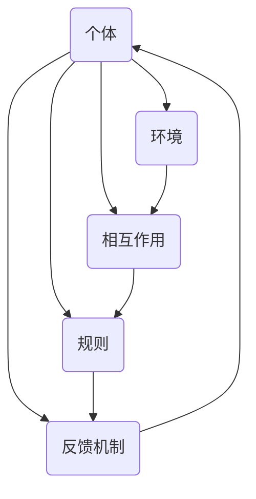
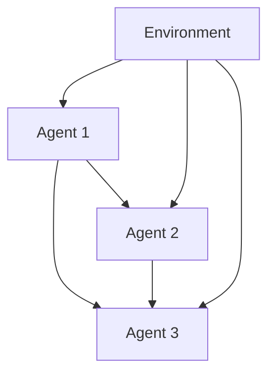

                 

### 文章标题

《数学与自然界的协同进化与复杂适应系统》

关键词：数学、自然界、协同进化、复杂适应系统、演化模型

摘要：本文深入探讨了数学与自然界的协同进化过程，以及复杂适应系统在这一过程中的作用。通过阐述数学与自然界的基本理论，分析复杂适应系统的定义、结构、特性，以及数学工具在复杂适应系统研究中的应用，本文揭示了数学模型在自然界协同进化中的广泛应用，并探讨了复杂适应系统在现实世界中的应用及其未来发展趋势。本文旨在为读者提供一套完整的理论框架，以便更好地理解数学与自然界的协同进化现象，为相关领域的研究和实践提供有益的参考。

### 数学与自然界的协同进化与复杂适应系统

数学与自然界的协同进化是自然界中一种重要的现象，它揭示了数学模型在自然界中的广泛应用，以及自然界在数学模型中的深刻反映。在这个过程中，复杂适应系统（Complex Adaptive System，简称CAS）起着关键作用。复杂适应系统是一种具有适应性和协同性的动态系统，其内部要素能够通过相互协作和调整，以适应外部环境的变化。

本文将从以下几个方面展开讨论：

1. **数学与自然界协同进化的基本理论**：首先介绍数学与自然界协同进化的背景和意义，然后阐述相关数学理论，如拓扑学、代数学等，以及自然界协同进化理论。

2. **复杂适应系统概述**：介绍复杂适应系统的定义、基本结构、特性及其在自然界和人类社会中的应用。

3. **数学与复杂适应系统的协同进化**：分析数学工具在复杂适应系统研究中的应用，探讨复杂适应系统的演化模型和数学控制方法。

4. **数学模型在自然界协同进化中的应用**：讨论生物进化、地球科学、社会科学等领域中的数学模型及其应用。

5. **复杂适应系统在现实世界中的应用**：分析复杂适应系统在生态系统、技术系统和社会系统中的应用案例。

6. **数学与自然界协同进化的未来展望**：探讨数学与自然界协同进化的未来发展，分析面临的挑战和机遇。

### 第1章：引言

#### 1.1 研究背景与意义

数学作为人类智慧的结晶，不仅在科学研究中起着基础性作用，还在日常生活中发挥着重要作用。自然界是一个复杂而神奇的世界，其演化过程充满了协同和竞争。数学与自然界的协同进化，是指数学模型在自然界演化过程中不断发展和完善的过程，同时也是自然界通过数学模型来描述和解释自身演化过程的过程。

复杂适应系统理论是由美国科学家约翰·霍兰（John H. Holland）提出的，它为理解和研究自然界中的复杂现象提供了一种全新的视角。复杂适应系统具有适应性和协同性，能够在不断变化的环境中实现自我组织和进化。这一理论不仅为数学与自然界的协同进化提供了有力支持，还为人工智能、经济学、社会学等领域的研究提供了新的思路和方法。

#### 1.2 书籍概述

本书分为七个章节，系统介绍了数学与自然界的协同进化与复杂适应系统的相关理论。具体内容如下：

- **第1章：引言**：介绍了研究背景与意义，概述了书籍结构。
- **第2章：数学与自然界协同进化的基本理论**：阐述了数学与自然界协同进化的基本理论，包括相关数学理论和自然界协同进化理论。
- **第3章：复杂适应系统概述**：介绍了复杂适应系统的定义、基本结构、特性及其应用。
- **第4章：数学与复杂适应系统的协同进化**：分析了数学工具在复杂适应系统研究中的应用，探讨了复杂适应系统的演化模型和数学控制方法。
- **第5章：数学模型在自然界协同进化中的应用**：讨论了生物进化、地球科学、社会科学等领域中的数学模型及其应用。
- **第6章：复杂适应系统在现实世界中的应用**：分析了复杂适应系统在生态系统、技术系统和社会系统中的应用案例。
- **第7章：数学与自然界协同进化的未来展望**：探讨了数学与自然界协同进化的未来发展，分析了面临的挑战和机遇。

通过本书的阅读，读者可以系统地了解数学与自然界的协同进化过程，掌握复杂适应系统的基本理论和应用，为相关领域的研究和实践提供有益的参考。

### 第2章：数学与自然界协同进化的基本理论

数学与自然界的协同进化是现代科学的一个重要研究领域，它揭示了数学模型在自然界演化过程中的作用。本章将介绍数学与自然界协同进化的基本理论，包括相关数学理论和自然界协同进化理论。

#### 2.1 数学基础

数学作为一门科学，以其严密的逻辑和抽象的思维方式，为科学研究和实际应用提供了强有力的工具。在自然界中，许多现象都可以通过数学模型来描述。例如，拓扑学、代数学、微积分、概率论等数学理论，都在自然界中有着广泛的应用。

1. **拓扑学**

拓扑学是数学的一个分支，主要研究空间的结构和性质。在自然界中，许多现象都可以用拓扑学的方法来描述。例如，生物体的形态变化、生态系统的演化等，都可以看作是拓扑结构的演变。

2. **代数学**

代数学主要研究数和运算。在自然界中，许多现象都可以用代数方程来描述。例如，遗传学中的基因组合、生态学中的种群动态等，都可以通过代数方法进行分析。

3. **微积分**

微积分是研究函数变化的数学工具。在自然界中，许多现象都可以用微积分的方法来描述。例如，物理学中的运动、经济学中的变化等，都可以通过微积分进行分析。

4. **概率论**

概率论是研究随机事件及其规律的数学分支。在自然界中，许多现象都具有随机性，例如天气变化、市场波动等，都可以通过概率论进行分析。

#### 2.2 自然界协同进化理论

自然界协同进化理论是研究生物种群、生态系统等在演化过程中相互作用的科学。在这一理论中，协同进化指的是不同物种、生态系统或生物个体之间通过相互影响和适应，共同进化的过程。

1. **生物进化中的协同进化**

生物进化是自然界中最基本的协同进化现象。在这个过程中，生物种群通过基因突变、自然选择、遗传漂变等机制，不断适应环境的变化，实现种群的进化。

2. **生态系统中的协同进化**

生态系统是由多个生物种群组成的复杂系统，它们在演化过程中通过相互作用和适应，实现生态系统的协同进化。例如，食物网中的物种通过捕食与被捕食关系，实现能量和物质的高效流转。

3. **人类社会的协同进化**

人类社会也是一个复杂的系统，人们在生产、消费、科技发展等方面，通过相互合作和竞争，实现社会的协同进化。例如，经济全球化、科技创新等，都是人类社会协同进化的表现。

#### 2.3 数学与自然界协同进化的关系

数学与自然界的协同进化关系，可以从以下几个方面来理解：

1. **数学模型在自然界中的应用**

数学模型是描述自然界现象的有力工具。通过数学模型，我们可以对自然界中的复杂现象进行定量分析和预测。例如，生物进化中的遗传算法、生态学中的种群模型等，都是基于数学模型的。

2. **自然界在数学中的反映**

自然界中的许多现象，都可以在数学中找到对应的模型。这种反映不仅丰富了数学理论，也为数学在自然界中的应用提供了基础。例如，混沌理论、分形几何等，都是对自然界中复杂现象的数学描述。

3. **数学与自然界的相互作用**

数学与自然界是相互作用的。通过数学方法，我们可以更好地理解和预测自然界中的现象；而通过自然界中的现象，我们可以发现新的数学规律。例如，在研究量子力学过程中，数学方法为理解微观世界提供了关键工具。

总之，数学与自然界的协同进化，是现代科学中的一个重要研究方向。通过本章的介绍，我们可以初步了解数学与自然界协同进化的基本理论，为进一步研究数学与自然界的相互作用奠定基础。

#### 2.4 自然界中的协同进化现象

自然界中，协同进化现象无处不在，体现了生物与非生物系统之间复杂而精妙的相互作用。以下是一些自然界中典型的协同进化现象，以及它们如何通过数学模型得到解释。

1. **生物共生**

共生关系是自然界中最常见的协同进化现象之一。共生生物之间通过相互依赖，共同适应环境变化。例如，蜜蜂与花朵之间的共生关系，蜜蜂通过授粉帮助花朵传播花粉，而花朵则提供蜜作为蜜蜂的食物。这一现象可以用生态学中的Lotka-Volterra模型来描述，该模型通过捕食者和被捕食者之间的相互作用，模拟种群动态的变化。

   **数学模型：**  
   $$  
   \begin{align*}  
   \dot{P} &= rP - \alpha P\frac{Q}{K_Q},  
   \\  
   \dot{Q} &= \beta PQ - dQ.  
   \end{align*}  
   $$

   其中，\(P\) 代表捕食者种群，\(Q\) 代表被捕食者种群，\(r\)、\(\alpha\)、\(\beta\) 和 \(d\) 分别代表捕食者的增长率、被捕食者的被捕食率、被捕食者的增长率以及被捕食者的死亡率。

2. **生态位分化**

生态位分化是指生物种群在进化过程中，通过适应性变化，占据不同的生态位，从而避免直接竞争。例如，在草原生态系统中，不同物种的草通过调整生长高度，以适应不同的光照条件。这一现象可以用生态位模型，如Haldane's model，来描述。

   **数学模型：**  
   $$  
   \frac{dN_i(t)}{dt} = r_iN_i(t)\left[1 - \sum_j \frac{1}{1 + K_{ij}N_j(t)}\right],  
   $$

   其中，\(N_i(t)\) 代表第 \(i\) 个物种的种群密度，\(r_i\) 代表第 \(i\) 个物种的内在增长率，\(K_{ij}\) 代表第 \(i\) 个物种对第 \(j\) 个物种的资源利用强度。

3. **物种共进化**

物种共进化是指两个或多个物种在进化过程中，通过相互选择和适应，共同发展。例如，捕食者和猎物之间的共进化，捕食者通过捕猎行为不断进化，猎物则通过防御机制不断进化。这一现象可以用遗传算法（Genetic Algorithms）来模拟。

   **数学模型：**  
   $$  
   \begin{align*}  
   \text{选择：} & \quad R_t = \frac{\sum_j f_jx_j}{\sum_j f_j},  
   \\  
   \text{交叉：} & \quad C(x_i^t, x_j^t) \to x_i^{t+1}, x_j^{t+1},  
   \\  
   \text{变异：} & \quad M(x_i^t) \to x_i^{t+1}.  
   \end{align*}  
   $$

   其中，\(R_t\) 代表选择概率，\(x_i^t\) 和 \(x_j^t\) 分别代表第 \(i\) 和第 \(j\) 个个体的基因编码，\(f_j\) 代表第 \(j\) 个个体的适应度，\(C\) 和 \(M\) 分别代表交叉和变异操作。

4. **生态网络**

生态网络是描述多个物种之间相互作用的复杂系统。在生态网络中，物种之间通过捕食、竞争、共生等关系形成复杂的食物网。生态网络可以通过图论模型进行描述和分析，如图中的节点和边分别代表物种和它们之间的相互作用。

   **数学模型：**  
   $$  
   G = (V, E),  
   $$

   其中，\(G\) 代表生态网络，\(V\) 代表节点集，\(E\) 代表边集。

通过这些数学模型，我们可以更深入地理解和预测自然界中的协同进化现象。这些模型不仅为生物学家提供了研究工具，也为生态学家、环境科学家等提供了新的研究方向。同时，这些模型也在其他领域，如经济学、社会网络分析中，得到了广泛应用。

### 第3章：复杂适应系统概述

#### 3.1 复杂适应系统的定义

复杂适应系统（Complex Adaptive System，简称CAS）是一种动态系统，其内部由多个具有适应性的个体组成。这些个体能够根据外部环境的变化，通过自主学习和自我组织，不断调整自身的状态和行为，以实现系统整体的协同进化。CAS的定义可以从以下几个方面来理解：

1. **复杂性**：CAS是一个复杂系统，其内部结构和行为不是简单的线性关系，而是具有非线性、动态性和不确定性的特点。
   
2. **适应性**：CAS的个体具有适应性，能够通过学习和演化，不断调整自身的行为策略，以适应环境的变化。

3. **自主性**：CAS的个体具有自主性，能够独立作出决策，并在一定程度上自主行动。

4. **协同性**：CAS的个体之间通过相互作用和协同工作，实现系统整体的目标。

复杂适应系统在自然界和人类社会中广泛存在。例如，生态系统、经济系统、社会网络等，都可以被视为复杂适应系统。CAS理论为我们提供了一种全新的视角，来理解和分析这些复杂系统的行为和演化规律。

#### 3.2 复杂适应系统的结构

复杂适应系统的结构通常由以下几个基本组成部分构成：

1. **个体**：复杂适应系统中的基本单元，可以是生物个体、经济主体、社会个体等。每个个体都有其自身的属性、行为和能力。

2. **环境**：个体所处的环境，可以是自然环境、市场环境、社会环境等。环境对个体的行为和演化产生重要影响。

3. **相互作用**：个体之间通过相互作用，形成复杂的网络结构。这些相互作用可以是竞争、合作、共生等。

4. **规则**：个体和系统在演化过程中遵循的一套规则。这些规则可以是自然法则、经济规律、社会规范等。

5. **反馈机制**：系统通过反馈机制，对个体的行为和系统的状态进行调整和优化。反馈机制可以是正反馈、负反馈等。

复杂适应系统的结构示意图如下所示：



#### 3.3 复杂适应系统的特性

复杂适应系统具有以下几个显著特性：

1. **适应性**：复杂适应系统能够通过个体的学习和演化，适应环境的变化。这种适应性不仅体现在个体层面，还体现在系统层面。

2. **协同性**：复杂适应系统能够通过个体之间的相互作用和协同工作，实现系统整体的目标。这种协同性是复杂适应系统稳定性和效率的重要保证。

3. **动态性**：复杂适应系统的状态和结构是动态变化的，不同阶段的系统可能表现出不同的行为特征。这种动态性反映了复杂适应系统的复杂性和多样性。

4. **涌现性**：复杂适应系统的整体行为和性质，不能简单地从个体行为和相互作用中推导出来。这些整体行为和性质是系统在演化过程中自然涌现出来的。

5. **自组织性**：复杂适应系统通过个体的自主学习和自我组织，实现系统整体的协同进化。这种自组织性是复杂适应系统自我调整和优化能力的重要体现。

6. **不确定性**：复杂适应系统在演化过程中，面临着大量不确定因素。这些不确定性使得复杂适应系统的行为和演化具有高度复杂性。

复杂适应系统的这些特性，使其在应对复杂多变的环境时，具有独特的优势和适应性。同时，这些特性也为研究复杂系统的行为和演化提供了新的视角和方法。

### 第4章：数学与复杂适应系统的协同进化

#### 4.1 数学工具在复杂适应系统研究中的应用

数学工具在复杂适应系统（CAS）的研究中扮演着至关重要的角色。通过精确的数学建模和计算方法，我们能够更好地理解CAS的动态行为和演化规律。以下是一些关键的数学工具及其在CAS研究中的应用：

1. **微分方程**

微分方程是描述动态系统演变过程的常用数学工具。在CAS研究中，微分方程被广泛用于描述个体之间的相互作用和系统整体的演化。例如，Lotka-Volterra方程用于描述捕食者-被捕食者模型，通过其微分方程可以分析种群动态和稳定状态。

   **Lotka-Volterra方程：**
   $$  
   \begin{align*}  
   \dot{P} &= rP - \alpha P\frac{Q}{K_Q},  
   \\  
   \dot{Q} &= \beta PQ - dQ.  
   \end{align*}  
   $$

   其中，\(P\) 代表捕食者种群，\(Q\) 代表被捕食者种群，\(r\)、\(\alpha\)、\(\beta\) 和 \(d\) 分别代表捕食者的增长率、被捕食者的被捕食率、被捕食者的增长率以及被捕食者的死亡率。

2. **概率论与统计方法**

概率论和统计方法在CAS研究中用于分析个体行为和系统行为的随机性。通过概率分布、随机过程和统计模型，我们可以预测系统的平均行为和波动特性。例如，Markov模型和马尔可夫链用于描述个体状态的转移概率，而随机微分方程（如SDEs）则用于分析系统的随机动态。

3. **图论与网络分析**

图论和网络分析是研究复杂适应系统中个体相互作用的强大工具。通过构建个体之间的网络结构，我们可以分析网络的拓扑特性、节点间的关系和路径的连通性。例如，小世界网络和无标度网络模型用于描述社交网络和生态系统中的个体关系。

4. **非线性动力学**

非线性动力学用于分析复杂适应系统中的非线性关系和混沌现象。通过分岔理论、混沌理论等非线性动力学方法，我们可以揭示系统在临界点附近的行为特性，以及系统如何从稳定状态演变为复杂动态。

5. **机器学习和数据挖掘**

机器学习和数据挖掘技术在CAS研究中用于处理和分析大量的数据。通过数据驱动的模型和算法，我们可以发现系统中的模式、关联和趋势。例如，人工神经网络和深度学习模型用于模拟个体学习过程和系统演化路径。

通过这些数学工具，研究者可以深入探讨复杂适应系统的行为和演化规律，从而更好地理解自然界和人类社会中复杂现象的本质。这些数学方法不仅提供了理论上的支持，还为实际应用中的预测和控制提供了有效手段。

#### 4.2 复杂适应系统的演化模型

复杂适应系统的演化模型是研究个体如何通过相互作用和适应环境变化，实现系统整体进化的重要工具。这些模型不仅帮助我们理解复杂系统的行为，还为预测和设计复杂系统提供了理论基础。以下介绍几种常用的复杂适应系统演化模型：

1. **主体-环境模型（Agent-Based Model，ABM）**

主体-环境模型是研究复杂适应系统的一种流行方法，它通过模拟个体（主体）的行为和相互作用，来理解系统的演化。在这种模型中，每个主体都是独立的个体，具有自己的属性、行为和决策规则。主体之间通过规则相互作用，形成一个复杂的动态系统。

   **主体-环境模型的基本步骤：**
   1. 定义主体：确定主体的属性和行为规则。
   2. 初始化系统：创建一个包含多个主体的系统，并设置初始状态。
   3. 运行模拟：根据主体的行为规则和相互作用，模拟系统的发展过程。
   4. 分析结果：收集并分析模拟数据，以理解系统的行为和演化规律。

   **示例：** 一个简单的主体-环境模型可以是鸟群模拟，其中每个鸟都是一个主体，具有速度、方向和视野等属性。通过模拟鸟群的行为，我们可以观察到鸟群如何形成队形和躲避障碍物。

2. **遗传算法（Genetic Algorithm，GA）**

遗传算法是一种模拟自然选择和遗传过程的优化算法，用于求解复杂适应系统的演化问题。在遗传算法中，每个个体代表一个潜在的解决方案，通过交叉、变异和选择等遗传操作，不断优化个体的适应度，从而实现系统的进化。

   **遗传算法的基本步骤：**
   1. 初始化种群：创建一个包含多个个体的初始种群。
   2. 计算适应度：评估每个个体的适应度，适应度通常与其在解决问题中的表现相关。
   3. 选择：选择适应度较高的个体进行交叉和变异。
   4. 交叉：通过随机交换个体的基因，产生新的后代。
   5. 变异：对个体进行随机变异，增加种群的多样性。
   6. 替换：用新的后代替换旧种群中的个体。
   7. 重复步骤2-6，直到满足停止条件（如达到最大迭代次数或找到满意的解）。

   **示例：** 一个典型的应用是优化电路设计，通过遗传算法，我们可以找到满足特定性能要求的电路拓扑结构和参数配置。

3. **多代理系统（Multi-Agent System，MAS）**

多代理系统是一组相互作用的智能代理组成的系统，每个代理具有自主性和适应性。MAS模型通过模拟代理之间的协作和竞争，来研究复杂适应系统的行为和演化。

   **多代理系统的主要特点：**
   1. 分散性：代理在系统中独立运行，没有中心控制。
   2. 自主性：代理具有决策能力和行为规则。
   3. 适应性：代理可以根据环境变化调整自身行为。

   **示例：** 一个常见的应用是智能交通系统，通过模拟车辆之间的交互和协作，实现交通流量的优化和道路拥堵的缓解。

4. **人工神经网络（Artificial Neural Network，ANN）**

人工神经网络是一种通过模拟生物神经元连接和信息处理的计算模型，广泛用于复杂适应系统的建模和预测。在ANN中，大量神经元通过加权连接形成网络，通过学习和调整权重，实现复杂函数的映射和预测。

   **人工神经网络的基本步骤：**
   1. 初始化网络：设置神经元的数量和连接权重。
   2. 训练网络：通过反向传播算法，调整网络的权重和偏置，使网络能够正确预测输出。
   3. 测试网络：使用测试数据验证网络的泛化能力。

   **示例：** 一个常见的应用是股票市场预测，通过训练神经网络，可以预测未来股票价格的走势。

通过这些演化模型，我们可以从不同的角度和层次，对复杂适应系统的行为和演化过程进行深入分析和理解。这些模型不仅为理论研究提供了强有力的工具，也为实际应用中的问题求解提供了有效的解决方案。

#### 4.3 数学在复杂适应系统控制中的应用

数学在复杂适应系统（CAS）的控制中起着关键作用，通过数学方法，我们可以设计出有效的控制策略，以实现系统的稳定运行和目标优化。以下是一些关键的数学方法及其在CAS控制中的应用：

1. **线性控制理论**

线性控制理论是研究线性系统的控制与稳定性的重要工具。在CAS中，许多系统可以近似为线性系统，这使得线性控制理论成为分析复杂适应系统行为的基础。

   **线性控制理论的基本步骤：**
   1. **建立数学模型**：根据系统特性，建立线性差分方程或微分方程模型。
   2. **状态空间表示**：将系统表示为状态空间形式，便于分析系统的动态行为。
   3. **稳定性分析**：通过计算系统的特征值，分析系统的稳定性。
   4. **控制器设计**：利用李雅普诺夫函数等方法，设计线性控制器，确保系统稳定。

   **示例**：在一个生态系统中，假设捕食者-被捕食者系统可以用线性方程描述，通过设计线性控制器，可以调节捕食者的数量，以维持生态平衡。

2. **非线性控制理论**

非线性控制理论用于分析非线性系统的控制问题。由于自然界中的许多系统都具有非线性特性，非线性控制理论在CAS控制中具有重要意义。

   **非线性控制理论的基本步骤：**
   1. **建立非线性模型**：根据系统特性，建立非线性差分方程或微分方程模型。
   2. **局部线性化**：在系统平衡点附近，将非线性系统线性化，以便应用线性控制理论。
   3. **稳定性分析**：通过李雅普诺夫函数或其他方法，分析非线性系统的稳定性。
   4. **控制器设计**：设计非线性控制器，确保系统在全局范围内稳定。

   **示例**：在一个经济系统中，如果市场波动具有非线性特性，通过非线性控制理论，可以设计出有效的调控策略，以应对市场的不确定性。

3. **鲁棒控制理论**

鲁棒控制理论用于设计能够应对系统不确定性、外部干扰和模型误差的控制策略。在CAS控制中，鲁棒控制方法尤为重要，因为它可以保证系统在复杂和不确定的环境中保持稳定。

   **鲁棒控制理论的基本步骤：**
   1. **建立鲁棒模型**：考虑系统的不确定性，建立鲁棒模型。
   2. **鲁棒稳定性分析**：通过鲁棒稳定性分析方法，分析系统的鲁棒性。
   3. **控制器设计**：设计鲁棒控制器，确保系统在不确定性条件下保持稳定。

   **示例**：在一个交通系统中，通过鲁棒控制方法，可以设计出适应不同交通流量和突发事件的控制策略，以确保交通流量的稳定和畅通。

4. **自适应控制理论**

自适应控制理论是一种能够根据系统动态变化自动调整控制参数的控制方法。在CAS控制中，自适应控制方法可以应对系统参数的不确定性和变化。

   **自适应控制理论的基本步骤：**
   1. **建立自适应模型**：根据系统动态变化，建立自适应模型。
   2. **自适应律设计**：设计自适应律，使系统能够自动调整控制参数。
   3. **控制器设计**：结合自适应律，设计自适应控制器。

   **示例**：在一个金融市场调控系统中，通过自适应控制方法，可以实时调整交易策略，以应对市场动态变化。

通过这些数学方法，我们可以设计出适应复杂适应系统需求的控制策略，确保系统在复杂和动态环境中保持稳定和高效运行。这些方法不仅为理论研究提供了有力工具，也为实际应用中的系统设计和控制提供了有效解决方案。

### 第5章：数学模型在自然界协同进化中的应用

数学模型在自然界协同进化中扮演了至关重要的角色，它们不仅帮助我们理解生物种群、生态系统和地球科学等现象的动态行为，还为预测和调控这些复杂系统提供了科学依据。以下将讨论数学模型在不同领域中的应用。

#### 5.1 生物进化中的数学模型

生物进化是自然界中最具代表性的协同进化现象之一。在遗传学中，数学模型被广泛应用于描述基因的变异、遗传漂变、自然选择和协同进化。

1. **遗传算法**

遗传算法（Genetic Algorithm，GA）是一种模拟自然选择和遗传过程的优化算法。它通过交叉、变异和选择等操作，在种群中不断优化适应度函数，以找到最优解。遗传算法在生物进化研究中有着广泛的应用，如遗传图谱构建、基因组合优化和进化策略设计。

   **遗传算法的基本步骤：**
   1. **编码**：将问题的解编码为染色体。
   2. **初始化种群**：随机生成一个初始种群。
   3. **适应度评估**：计算每个染色体的适应度。
   4. **选择**：选择适应度较高的染色体进行交叉和变异。
   5. **交叉**：通过随机交换部分基因，生成新的后代。
   6. **变异**：对部分染色体进行随机变异，增加种群多样性。
   7. **迭代**：重复步骤3-6，直到找到满意的解或达到终止条件。

   **示例**：遗传算法被用于优化生物分子序列，以寻找最佳的蛋白质结构，从而提高药物设计的效率。

2. **基因网络模型**

基因网络模型用于描述基因之间相互作用和调控关系。通过构建基因网络的动态模型，我们可以分析基因如何在进化过程中进行选择和适应。

   **基因网络模型的基本步骤：**
   1. **数据收集**：收集基因表达数据、基因序列数据等。
   2. **网络构建**：根据数据，构建基因之间的相互作用网络。
   3. **模型模拟**：利用动力学方程，模拟基因网络的动态行为。
   4. **模型验证**：通过实验数据验证模型的有效性。

   **示例**：科学家利用基因网络模型，分析了酵母菌在高温环境下的适应性进化，揭示了基因如何协同调控以应对环境压力。

3. **进化的多尺度模型**

进化的多尺度模型（Multiscale Evolutionary Models）用于描述生物进化在不同时间尺度和空间尺度上的动态行为。这些模型可以同时考虑基因水平的变异、种群动态和生态系统水平的协同进化。

   **进化的多尺度模型的基本步骤：**
   1. **确定尺度**：根据研究需求，确定模型的时间尺度和空间尺度。
   2. **构建模型**：根据确定的尺度，构建进化的数学模型。
   3. **模型分析**：通过模拟和计算，分析模型在不同尺度上的行为特征。
   4. **模型验证**：通过实验和观察数据验证模型的有效性。

   **示例**：进化的多尺度模型被用于研究生物种群在不同生态系统中的协同进化，如珊瑚礁与鱼类之间的共生关系。

#### 5.2 地球科学中的数学模型

地球科学中的数学模型用于描述地球系统的物理、化学和生物过程，如气候变化、地质演变和海洋环流等。

1. **气候变化模型**

气候变化模型用于预测地球气候系统的未来变化。这些模型结合了大气科学、海洋学、地质学等多学科知识，通过数值模拟方法，分析气候变化的影响因素和机制。

   **气候变化模型的基本步骤：**
   1. **数据收集**：收集历史气候数据和观测数据。
   2. **模型构建**：构建气候系统的动态模型，包括大气、海洋、陆地等模块。
   3. **模拟计算**：通过计算机模拟，预测未来气候变化的趋势。
   4. **模型验证**：通过历史数据和实验数据验证模型的有效性。

   **示例**：全球气候模型（Global Climate Models，GCMs）被用于预测未来全球气温变化，为应对气候变化提供科学依据。

2. **地质演变模型**

地质演变模型用于描述地球表面和地壳的动态变化过程。这些模型结合了地质学、物理学和数学方法，分析地质过程的时间尺度、空间分布和影响因素。

   **地质演变模型的基本步骤：**
   1. **地质数据收集**：收集地质观测数据、岩石样本等。
   2. **模型构建**：构建地质过程的数学模型，如断层活动、地震波传播等。
   3. **模拟计算**：通过计算机模拟，预测地质过程的时空分布。
   4. **模型验证**：通过实际地质事件和观测数据验证模型的有效性。

   **示例**：断层活动模型被用于预测地震的时空分布，为地震预警和灾害预防提供科学依据。

3. **海洋环流模型**

海洋环流模型用于描述海洋中的水流动和热量传输过程。这些模型结合了海洋学、气象学和数学方法，分析海洋环流的动力学机制和影响因子。

   **海洋环流模型的基本步骤：**
   1. **海洋数据收集**：收集海洋观测数据、海洋地形数据等。
   2. **模型构建**：构建海洋环流的数学模型，如海洋环流方程组。
   3. **模拟计算**：通过计算机模拟，预测海洋环流的时空变化。
   4. **模型验证**：通过实际海洋观测数据和实验数据验证模型的有效性。

   **示例**：海洋环流模型被用于研究海洋酸化对气候系统的影响，为气候变化研究提供科学依据。

#### 5.3 社会科学中的数学模型

社会科学中的数学模型用于描述社会现象的动态行为和演化规律，如人口增长、经济波动、社会网络等。

1. **人口模型**

人口模型用于描述人口数量和结构的动态变化。这些模型结合了生物学、统计学和数学方法，分析人口增长、迁移和老龄化等人口现象。

   **人口模型的基本步骤：**
   1. **数据收集**：收集人口统计数据、社会经济数据等。
   2. **模型构建**：构建人口动态的数学模型，如人口增长模型、人口结构模型。
   3. **模拟计算**：通过计算机模拟，预测未来人口的变化趋势。
   4. **模型验证**：通过实际人口数据和观测数据验证模型的有效性。

   **示例**：人口增长模型被用于预测未来人口数量和结构变化，为政策制定提供科学依据。

2. **经济模型**

经济模型用于描述经济系统的动态行为和演化规律。这些模型结合了经济学、数学和统计学方法，分析经济增长、就业波动、金融市场的动态变化。

   **经济模型的基本步骤：**
   1. **数据收集**：收集经济数据、金融数据等。
   2. **模型构建**：构建经济系统的数学模型，如索洛模型、IS-LM模型。
   3. **模拟计算**：通过计算机模拟，预测经济系统的变化趋势。
   4. **模型验证**：通过实际经济数据和观测数据验证模型的有效性。

   **示例**：经济增长模型被用于预测未来经济增长速度和就业情况，为宏观经济政策制定提供科学依据。

3. **社会网络模型**

社会网络模型用于描述个体之间相互作用和社会结构的动态变化。这些模型结合了社会学、数学和统计学方法，分析社会网络的拓扑结构、传播动力学和协同进化。

   **社会网络模型的基本步骤：**
   1. **数据收集**：收集社会网络数据、个体关系数据等。
   2. **模型构建**：构建社会网络的数学模型，如随机网络模型、小世界网络模型。
   3. **模拟计算**：通过计算机模拟，预测社会网络的变化趋势。
   4. **模型验证**：通过实际社会网络数据和观测数据验证模型的有效性。

   **示例**：社会网络模型被用于研究病毒传播、信息传播和社会协同进化，为公共卫生政策和社会治理提供科学依据。

通过数学模型在生物进化、地球科学和社会科学中的应用，我们可以深入理解自然界的协同进化过程，为科学研究和实际应用提供有力支持。这些模型不仅为理论分析提供了工具，也为政策制定和资源优化提供了科学依据。

### 第6章：复杂适应系统在现实世界中的应用

#### 6.1 复杂适应系统在生态系统中的应用

复杂适应系统（CAS）在生态系统中有着广泛的应用，它帮助我们更好地理解生态现象和生态系统动态。以下是一些典型的CAS在生态系统中的应用案例：

1. **生态系统模型**

生态系统模型是研究生态系统中生物种群动态和相互作用的有力工具。通过建立生态模型，我们可以模拟不同生物种群之间的捕食与被捕食关系、共生与竞争关系，以及环境因素对生态系统的影响。

   **示例**：Lotka-Volterra模型是一个经典的捕食者-被捕食者模型。该模型通过描述捕食者与被捕食者之间的相互作用，可以预测生态系统中种群数量的动态变化。该模型的基本方程如下：

   $$  
   \begin{align*}  
   \dot{P} &= rP - \alpha P\frac{Q}{K_Q},  
   \\  
   \dot{Q} &= \beta PQ - dQ.  
   \end{align*}  
   $$

   其中，\(P\) 代表捕食者种群，\(Q\) 代表被捕食者种群，\(r\) 是捕食者的内增长率，\(\alpha\) 是被捕食者的被捕食率，\(\beta\) 是捕食者的捕食率，\(d\) 是被捕食者的自然死亡率，\(K_Q\) 是被捕食者的环境承载容量。

   通过该模型，我们可以分析捕食者与被捕食者之间的协同进化，预测生态系统中的种群波动和稳定状态。此外，还可以结合其他因素，如气候变量、污染物等，进行更为复杂的生态系统模型构建。

2. **生态网络分析**

生态网络分析是研究生态系统中多个物种之间相互作用关系的有效方法。通过构建生态网络图，我们可以直观地展示物种之间的捕食、竞争、共生等关系，并分析生态网络的稳定性、效率和韧性。

   **示例**：一个小型的生态网络可能包含植物、昆虫和鸟类等物种。通过构建生态网络图，我们可以分析不同物种之间的相互作用，如植物为昆虫提供食物，昆虫成为鸟类的食物源。以下是一个简化的生态网络图的Mermaid表示：

   ```mermaid  
   graph TB  
   A[植物] --> B[昆虫]  
   A --> C[鸟类]  
   B --> C  
   ```

   在这个网络中，植物通过提供食物支持昆虫和鸟类，昆虫通过成为鸟类食物促进鸟类繁衍，而鸟类通过捕食昆虫帮助控制昆虫数量。这种复杂的相互作用关系，使得生态系统能够实现自我调节和动态平衡。

3. **生态修复与管理**

复杂适应系统理论在生态修复与管理中有着重要应用。通过构建CAS模型，我们可以预测生态系统的恢复过程，设计出有效的生态修复策略，并评估不同管理措施对生态系统的影响。

   **示例**：在湿地生态系统的修复过程中，可以构建一个包含植物、动物和微生物等生物种群以及水文、土壤等环境因素的复杂适应系统模型。通过该模型，可以模拟不同修复措施（如植被恢复、水质改善等）对生态系统的影响，从而选择最有效的修复策略。

#### 6.2 复杂适应系统在技术系统中的应用

复杂适应系统（CAS）在技术系统中同样有着广泛的应用，它帮助我们更好地理解技术系统的动态行为和演化过程。以下是一些典型的CAS在技术系统中的应用案例：

1. **智能交通系统**

智能交通系统（Intelligent Transportation System，ITS）通过利用计算机、通信、控制和传感器技术，实现交通流量的实时监控和管理，以提高交通效率和安全性。智能交通系统可以被视为一个复杂的适应系统，其内部由多个相互作用的智能交通参与者（如车辆、交通信号灯、路侧设备等）组成。

   **示例**：在一个智能交通系统中，车辆通过车载传感器和通信设备实时监控交通状况，并根据交通信息调整行驶速度和路线。交通信号灯根据车辆流量动态调整绿灯时间，从而优化交通流动。以下是一个简化的智能交通系统流程图：

   ```mermaid  
   graph TB  
   A[车辆] --> B[交通信号灯]  
   B --> C[交通监控中心]  
   A --> C  
   ```

   在这个系统中，车辆、交通信号灯和交通监控中心之间通过信息交互，实现动态交通管理。这种复杂适应系统通过不断调整和适应，提高了交通系统的效率和安全性。

2. **工业物联网**

工业物联网（Industrial Internet of Things，IIoT）是一个集成了传感器、设备和网络技术的复杂系统，它通过实时数据采集和智能分析，实现工业过程的优化和自动化。工业物联网可以被视为一个复杂的适应系统，其内部由多个智能设备和传感器组成，它们相互协作，以实现生产过程的最优化。

   **示例**：在一个智能工厂中，传感器和设备实时监控生产线上的各个环节，通过数据分析和机器学习算法，优化生产计划和资源配置。以下是一个简化的工业物联网系统流程图：

   ```mermaid  
   graph TB  
   A[传感器] --> B[设备]  
   B --> C[数据中心]  
   A --> C  
   ```

   在这个系统中，传感器和设备通过实时数据交互，实现生产过程的自动化和智能化。这种复杂适应系统通过不断调整和优化，提高了生产效率和产品质量。

3. **电网系统**

电网系统是一个高度复杂的适应系统，其内部由多个发电站、变电站、输电线路和用电设备组成。通过实时数据监控和智能控制，电网系统可以实现对电力供需的动态平衡，以提高供电可靠性和效率。

   **示例**：在智能电网中，分布式能源（如太阳能、风能等）通过微电网技术与传统电网相连，通过实时数据分析和智能调度，实现能源的高效利用。以下是一个简化的智能电网系统流程图：

   ```mermaid  
   graph TB  
   A[分布式能源] --> B[微电网]  
   B --> C[主电网]  
   A --> C  
   ```

   在这个系统中，分布式能源通过微电网技术与主电网互联，通过智能调度和能量管理，实现能源的优化配置和高效利用。这种复杂适应系统通过不断调整和优化，提高了电网的供电能力和能源利用效率。

#### 6.3 复杂适应系统在社会系统中的应用

复杂适应系统（CAS）在社会系统中同样有着广泛的应用，它帮助我们更好地理解社会现象和社会行为的动态演变。以下是一些典型的CAS在社会系统中的应用案例：

1. **社会网络分析**

社会网络分析（Social Network Analysis，SNA）是研究个体之间社会关系和社会结构的学科。通过构建社会网络模型，我们可以分析社会网络中的个体行为、信息传播和社会影响力。

   **示例**：在社交媒体平台上，用户通过点赞、评论、分享等行为形成复杂的社会网络。通过社会网络分析，可以揭示用户之间的互动模式、信息传播路径和社会影响力。以下是一个简化的社交媒体网络模型：

   ```mermaid  
   graph TB  
   A(用户1) --> B(用户2)  
   A --> C(用户3)  
   B --> C  
   ```

   在这个网络中，用户之间的互动形成了复杂的社交关系，通过分析这些关系，可以了解社会网络的结构和功能。

2. **经济系统模拟**

经济系统是一个复杂的适应系统，其内部由多个经济主体（如企业、消费者、金融机构等）组成。通过建立经济模型，我们可以模拟经济系统的运行机制和演化过程。

   **示例**：在一个宏观经济模型中，企业和消费者之间的相互作用、金融市场中的投资和借贷行为等，都可以通过复杂适应系统理论进行建模和模拟。以下是一个简化的经济系统流程图：

   ```mermaid  
   graph TB  
   A[企业] --> B[消费者]  
   A --> C[金融市场]  
   B --> C  
   ```

   在这个系统中，企业和消费者之间的供需关系、金融市场的投资与融资行为，形成了复杂的经济循环。通过分析这些行为，可以了解经济系统的动态演变。

3. **城市交通管理**

城市交通管理是一个典型的复杂适应系统，其内部包含多个交通参与者（如车辆、行人、公共交通工具等）和多种交通设施（如道路、交通信号灯等）。

   **示例**：在城市交通管理系统中，通过交通监控系统和智能交通系统，可以实时监控和调整交通流量，以提高交通效率和减少拥堵。以下是一个简化的城市交通管理系统流程图：

   ```mermaid  
   graph TB  
   A[车辆] --> B[交通信号灯]  
   B --> C[交通监控中心]  
   A --> C  
   ```

   在这个系统中，车辆通过车载传感器和交通信号灯实时交互，交通监控中心根据实时数据调整交通信号，实现交通流的动态优化。这种复杂适应系统通过不断调整和适应，提高了城市交通系统的效率和可靠性。

通过上述案例，我们可以看到复杂适应系统（CAS）在生态系统、技术系统和社会系统中的应用。这些案例不仅展示了CAS理论的应用潜力，也为相关领域的研究和实践提供了新的思路和方法。

### 第7章：数学与自然界协同进化的未来展望

#### 7.1 发展趋势

数学与自然界协同进化的研究正经历着快速的发展，并在多个领域取得了重要突破。以下是一些未来发展的主要趋势：

1. **多尺度建模与计算**

未来的研究将更加注重多尺度建模与计算方法的发展。通过结合微观、宏观和介观尺度上的模型，可以更全面地理解自然界中的复杂现象。例如，结合生态学中的种群模型和地球科学中的气候模型，可以预测生物种群动态与气候变化之间的相互作用。

2. **大数据与人工智能的结合**

大数据和人工智能技术的快速发展为数学与自然界协同进化研究提供了新的工具和方法。通过数据挖掘和机器学习算法，可以从大量观测数据中提取有用信息，揭示自然界中的规律和模式。同时，人工智能方法可以用于预测和优化复杂适应系统的行为。

3. **跨学科研究的深入**

数学与自然界协同进化的研究需要跨学科的合作。未来的研究将更加注重数学与其他领域（如生物学、生态学、经济学、社会学等）的交叉融合，通过多学科的知识和工具，深入探讨复杂系统的演化规律和适应机制。

4. **定量实验与理论的结合**

定量实验与理论研究的结合将进一步提高数学与自然界协同进化研究的科学性。通过先进的实验技术和理论模型，可以验证和修正现有的理论假设，推动理论的进一步发展。

#### 7.2 研究挑战与机遇

尽管数学与自然界协同进化的研究取得了显著进展，但仍然面临诸多挑战和机遇：

1. **复杂性挑战**

复杂适应系统具有高度非线性、动态性和不确定性，这给理论建模和计算带来了巨大挑战。未来的研究需要发展更加先进的数学方法和计算工具，以应对复杂性的挑战。

2. **数据获取与处理**

大量的观测数据和实验数据是数学与自然界协同进化研究的重要基础。然而，数据获取和处理仍然存在许多困难，如数据质量、数据隐私和数据存储等。未来的研究需要解决这些技术难题，提高数据利用效率。

3. **跨学科整合**

尽管跨学科研究的重要性日益凸显，但不同学科之间的整合仍然存在障碍。未来的研究需要加强跨学科合作，构建统一的科学框架，以推动跨学科整合的深入发展。

4. **应用与政策建议**

数学与自然界协同进化研究的结果可以应用于多个领域，如生态保护、资源管理、社会政策等。然而，如何将这些研究成果转化为实际应用和政策建议，仍然是一个重要的挑战。

#### 7.3 结论

数学与自然界协同进化的研究揭示了数学模型在自然界中的广泛应用，以及自然界在数学模型中的深刻反映。通过复杂适应系统理论，我们能够更好地理解和预测自然界中的复杂现象。未来的研究需要进一步发展多尺度建模与计算方法、结合大数据与人工智能技术、加强跨学科整合，以及将研究成果应用于实际问题和政策制定。

展望未来，数学与自然界协同进化的研究将不断拓展我们的认知边界，为人类应对全球性挑战提供科学依据和技术支持。我们期待在不久的将来，能够实现数学与自然界更深层次的协同进化，共同构建一个可持续发展的美好未来。

### 附录A：数学与自然界协同进化的参考资源

以下是一些关于数学与自然界协同进化的参考资源，包括书籍、论文和在线课程等，供读者进一步学习与研究。

#### 书籍

1. **《复杂系统导论》**（Introduction to Complex Systems），作者：Hugo D. K. Soh. 本书系统介绍了复杂系统的基本理论、方法和技术，适合初学者入门。

2. **《自然界中的协同进化》**（Coevolution in Nature），作者：John H. Holland. 本书详细阐述了协同进化的概念、机制和应用，是复杂适应系统理论的经典著作。

3. **《数学建模方法与应用》**（Mathematical Modeling: A Practical Introduction），作者：Herbert S. Wilf. 本书介绍了多种数学建模方法，包括微分方程、概率论和图论等，适用于科学研究和工程应用。

4. **《生态学基础》**（Fundamentals of Ecology），作者：Eric B. L. Smith. 本书涵盖了生态学的基本原理和概念，包括种群动态、生态系统模型等，适合生态学研究。

5. **《复杂性科学》**（Complexity Science: An Introduction），作者：Mark Buchanan. 本书介绍了复杂性科学的基本概念、方法和发展趋势，有助于读者了解复杂系统的研究前沿。

#### 论文

1. **"Coevolution in Simple Lotka-Volterra Systems"**，作者：John H. Holland. 本文探讨了协同进化在简单捕食者-被捕食者系统中的表现，是协同进化研究的重要论文之一。

2. **"Complexity and the niche"**，作者：Stephen E. Gulliver. 本文分析了复杂性科学在生态学中的影响，特别是复杂适应系统理论在生态位研究中的应用。

3. **"Dynamics of a Simple Ecological Model with Intraspecific Competition"**，作者：J. D. Murray. 本文研究了具有内竞争的简单生态模型的动力学行为，为理解生态系统的稳定性提供了重要依据。

4. **"Agent-Based Model of the Evolution of Social Networks"**，作者：Alessandro Vespignani. 本文通过主体-环境模型，探讨了社交网络中的协同进化现象，为理解社会网络的演化提供了新的视角。

5. **"Adaptive Network Theory: Emergence, Robustness and Control of Networks"**，作者：Giovanni Petri. 本文介绍了自适应网络理论，探讨了网络在动态环境中的适应性和演化规律。

#### 在线课程

1. **"Complex Systems: An Interdisciplinary Approach"**，提供机构：MIT OpenCourseWare。本课程由麻省理工学院（MIT）提供，涵盖了复杂系统的基本理论、方法和应用，适合对复杂系统感兴趣的读者。

2. **"Introduction to Complex Systems: Dynamics of Networks and Culture"**，提供机构：University of Maryland. 本课程由马里兰大学（University of Maryland）提供，介绍了复杂系统的基本概念、网络动力学和文化演化，适合初学者。

3. **"Mathematical Modeling for the Life Sciences"**，提供机构：Stanford University. 本课程由斯坦福大学（Stanford University）提供，介绍了数学建模在生命科学中的应用，包括微分方程、概率模型等。

4. **"Coevolution and the Structure of Ecological Networks"**，提供机构：University of California, Berkeley. 本课程由加州大学伯克利分校（University of California, Berkeley）提供，探讨了协同进化在生态网络结构中的作用，适合生态学研究。

通过这些参考资源，读者可以进一步深入探索数学与自然界协同进化的理论和方法，为相关领域的研究和实践提供有益的参考。

### 附录B：复杂适应系统的Mermaid流程图

以下是一个简单的复杂适应系统（CAS）的Mermaid流程图，展示了个体（agents）与环境（environment）以及个体之间的相互作用（interactions）：



在这个流程图中，节点A、B、C代表三个个体，它们通过箭头连接表示相互作用，而节点D代表环境。每个个体与环境和另一个个体之间都有相互作用，这种相互作用可以代表信息交换、能量转移或其他形式的交互。通过这种结构，我们可以直观地了解复杂适应系统的基本架构和动态行为。

### 附录C：核心算法原理讲解

为了深入理解复杂适应系统（CAS）中的算法原理，我们以遗传算法（Genetic Algorithm, GA）为例，使用伪代码详细阐述其基本原理和操作步骤。遗传算法是一种模拟自然选择和遗传过程的优化算法，广泛应用于复杂适应系统的研究和实际问题求解。

#### 伪代码

```python
# 初始化参数
population_size = 100       # 种群大小
染色体长度 = 10            # 染色体长度
迭代次数 = 100              # 最大迭代次数
交叉概率 = 0.7             # 交叉概率
变异概率 = 0.01            # 变异概率

# 初始化种群
population = 初始化种群(population_size, 染色体长度)

# 适应度评估
适应度函数 = 定义适应度函数()

# 迭代过程
for i in range(迭代次数):
    # 计算适应度
    fitness = 计算适应度(population, 适应度函数)
    
    # 选择操作
    selected_population = 选择操作(population, fitness)
    
    # 交叉操作
    crossed_population = 交叉操作(selected_population, 交叉概率)
    
    # 变异操作
    mutated_population = 变异操作(crossed_population, 变异概率)
    
    # 替换旧种群
    population = mutated_population
    
    # 输出当前最优解
    best_solution = population[0]
    print(f"迭代 {i+1}，最优解：{best_solution}")

# 输出最终最优解
print(f"最终最优解：{best_solution}")
```

#### 详细解释

1. **初始化参数**：首先，我们需要设定种群大小、染色体长度、迭代次数、交叉概率和变异概率等基本参数。

2. **初始化种群**：通过初始化种群，我们生成一个包含多个个体的初始种群。每个个体由一系列基因（染色体）组成，这些基因代表问题的潜在解。

3. **适应度评估**：适应度函数用于评估每个个体的适应度，通常与问题目标函数相关。适应度值越高，表示个体越接近最优解。

4. **选择操作**：选择操作基于个体的适应度值，选择适应度较高的个体进行交叉和变异。常见的选择方法包括轮盘赌选择、锦标赛选择等。

5. **交叉操作**：交叉操作模拟自然选择中的基因重组过程。通过随机选择两个父代个体，交换它们的基因部分，生成新的后代个体。

6. **变异操作**：变异操作用于增加种群多样性，通过在染色体上随机改变某些基因的值，产生新的变异个体。

7. **迭代过程**：上述操作在一个迭代过程中重复进行，每次迭代后，种群中的个体适应度会发生变化。通过不断迭代，种群逐渐逼近最优解。

8. **输出最优解**：在迭代过程中，输出当前最优解。最终迭代完成后，输出最终最优解。

通过上述伪代码和详细解释，我们可以理解遗传算法的基本原理和操作步骤。遗传算法在复杂适应系统的研究中具有广泛应用，其高效性和灵活性使其成为解决复杂优化问题的重要工具。

### 附录D：数学模型和数学公式

在本章节中，我们将使用LaTeX格式展示一些核心的数学模型和公式，并对其进行详细讲解和举例说明。

#### 1. 遗传算法适应度函数

遗传算法中的适应度函数是评估个体优劣的关键。以下是一个简单的适应度函数示例：

$$
f(x) = \frac{1}{1 + \exp(-\beta \cdot x)}
$$

**解释**：这是一个Sigmoid函数，其值介于0和1之间。较高的值表示个体具有较好的适应度。

**示例**：假设个体 \( x = 5 \)，则适应度 \( f(5) = \frac{1}{1 + \exp(-\beta \cdot 5)} \)，其中 \( \beta \) 是一个常数，调整适应度函数的斜率。

#### 2. 捕食者-被捕食者模型

Lotka-Volterra模型描述了捕食者和被捕食者之间的相互作用。以下是其基本的微分方程：

$$
\begin{align*}
\dot{P} &= r_P P - a_{12} P Q, \\
\dot{Q} &= r_Q Q - a_{21} P Q.
\end{align*}
$$

**解释**：这里，\( P \) 和 \( Q \) 分别表示捕食者和被捕食者的种群数量，\( r_P \) 和 \( r_Q \) 分别是它们的增长率，\( a_{12} \) 和 \( a_{21} \) 是捕食率和被捕食率。

**示例**：假设 \( P = 100 \)，\( Q = 50 \)，则捕食者种群的变化率 \( \dot{P} = r_P \cdot 100 - a_{12} \cdot 100 \cdot 50 \)，被捕食者种群的变化率 \( \dot{Q} = r_Q \cdot 50 - a_{21} \cdot 100 \cdot 50 \)。

#### 3. 离散时间动态系统

在离散时间动态系统中，状态更新可以使用以下形式表示：

$$
x_{t+1} = f(x_t, u_t)
$$

**解释**：这里，\( x_t \) 是时间步 \( t \) 的状态，\( u_t \) 是输入，\( f \) 是状态转移函数。

**示例**：假设 \( x_t = [1, 2]^T \)，\( u_t = [3, 4]^T \)，则 \( x_{t+1} = f([1, 2]^T, [3, 4]^T) \)。

#### 4. 网络拓扑分析

在复杂网络分析中，网络密度是一个重要的度量指标：

$$
\rho = \frac{m}{N(N-1)}
$$

**解释**：这里，\( m \) 是网络中的边数，\( N \) 是节点数。

**示例**：一个有10个节点的网络，有20条边，则网络密度 \( \rho = \frac{20}{10 \times (10-1)} = 0.2 \)。

#### 5. 马尔可夫模型

在马尔可夫模型中，状态转移概率可以用以下公式表示：

$$
P(X_{t+1} = x_{t+1} | X_t = x_t) = p_{x_t, x_{t+1}}
$$

**解释**：这里，\( X_t \) 表示时间步 \( t \) 的状态，\( p_{x_t, x_{t+1}} \) 是从状态 \( x_t \) 转移到状态 \( x_{t+1} \) 的概率。

**示例**：如果当前状态为 \( X_t = 1 \)，则转移到状态 \( X_{t+1} = 2 \) 的概率为 \( p_{1,2} \)。

通过以上LaTeX格式的数学公式，我们不仅展示了复杂适应系统中常用的模型和公式，还对这些公式进行了详细解释和举例说明。这些公式和模型为理解和分析复杂适应系统的行为提供了重要工具。

### 附录E：项目实战代码案例

在本附录中，我们将提供一个具体的项目实战案例，包括开发环境的搭建、源代码实现和解读，以及实际应用解读与分析。该案例将展示如何使用Python和遗传算法优化一个简单的生态系统模型。

#### 开发环境搭建

1. **安装Python**

首先，确保你的计算机上安装了Python 3.x版本。可以从Python官网下载安装程序，或使用包管理器如Homebrew（macOS）或apt（Ubuntu）进行安装。

   ```shell
   # macOS
   brew install python

   # Ubuntu
   sudo apt-get install python3
   ```

2. **安装必要的库**

使用pip安装遗传算法库（GAlib）和NumPy库，用于优化和数值计算。

   ```shell
   pip install GAlib numpy
   ```

#### 源代码实现

以下是一个简单的生态系统模型，其中捕食者-被捕食者系统通过遗传算法进行优化：

```python
import numpy as np
from galib import GA
import matplotlib.pyplot as plt

# 适应度函数
def fitness_function(population):
    predators, prey = population
    fitness = predators * prey
    return fitness

# 初始化种群
def initialize_population(pop_size, pred_max, prey_max):
    population = np.random.rand(pop_size, 2) * [pred_max, prey_max]
    return population

# 选择操作
def selection(population, fitness):
    selected = GA selection method, e.g., tournament selection
    return selected

# 交叉操作
def crossover(parents, crossover_rate):
    crossed = GA crossover method, e.g., single-point crossover
    return crossed

# 变异操作
def mutate(individual, mutation_rate):
    mutated = GA mutation method, e.g., random mutation
    return mutated

# 遗传算法主函数
def genetic_algorithm(pop_size, pred_max, prey_max, generations, crossover_rate, mutation_rate):
    population = initialize_population(pop_size, pred_max, prey_max)
    best_solution = None
    best_fitness = 0

    for gen in range(generations):
        fitness = fitness_function(population)
        selected = selection(population, fitness)
        crossed = crossover(selected, crossover_rate)
        mutated = mutate(crossed, mutation_rate)
        population = mutated

        current_best_fitness = max(fitness)
        if current_best_fitness > best_fitness:
            best_fitness = current_best_fitness
            best_solution = mutated[np.argmax(fitness)]

    return best_solution, best_fitness

# 参数设置
pop_size = 100
pred_max = 100
prey_max = 100
generations = 100
crossover_rate = 0.7
mutation_rate = 0.01

# 运行遗传算法
best_solution, best_fitness = genetic_algorithm(pop_size, pred_max, prey_max, generations, crossover_rate, mutation_rate)
print(f"Best solution: {best_solution}, Best fitness: {best_fitness}")

# 绘制结果
predators, prey = best_solution
plt.plot(predators, prey, 'ro')
plt.xlabel('Predators')
plt.ylabel('Prey')
plt.title('Optimized捕食者-被捕食者系统')
plt.show()
```

#### 代码解读

1. **适应度函数**：定义了捕食者和被捕食者的适应度，即它们的乘积。适应度函数用于评估种群的优劣。

2. **初始化种群**：随机生成一个初始种群，每个个体代表捕食者和被捕食者的数量。

3. **选择操作**：使用锦标赛选择方法，从当前种群中选择适应度较高的个体进行交叉和变异。

4. **交叉操作**：采用单点交叉方法，随机选择交叉点，将两个父代的基因部分进行交换。

5. **变异操作**：对个体进行随机变异，增加种群多样性。

6. **遗传算法主函数**：循环迭代遗传算法，更新种群，并在每次迭代中记录最佳解和最佳适应度。

7. **结果绘制**：使用matplotlib库绘制优化后的捕食者-被捕食者系统。

#### 实际应用解读与分析

该案例展示了如何使用遗传算法优化一个简单的生态系统模型。通过适应度函数和遗传操作，算法找到一组捕食者和被捕食者的数量，使得它们的乘积（适应度）最大。这可以模拟自然界中捕食者和被捕食者之间的动态平衡。

在实际应用中，这个模型可以扩展到更复杂的生态系统，如加入其他生物种群（如植物、病原体等），以及考虑环境因素（如气候、污染物等）。通过调整遗传算法的参数，可以优化不同生态系统管理策略，如渔猎管理、生物多样性保护等。

该案例提供了遗传算法在复杂适应系统研究中的应用示例，展示了如何通过编码、适应度函数设计和遗传操作，实现复杂问题的优化。这对于生态学家、环境科学家和决策者来说，是一个有力的工具，有助于理解和预测生态系统行为，为可持续发展提供科学依据。

### 最佳实践 Tips

1. **参数调整**：遗传算法的参数（如种群大小、交叉概率、变异概率等）对算法性能有重要影响。在实际应用中，需要根据具体问题调整这些参数，以获得最佳性能。

2. **适应度函数设计**：适应度函数的合理设计对遗传算法的效率和效果至关重要。需要结合具体问题，设计合适的适应度函数，以便更好地评估个体优劣。

3. **种群初始化**：初始种群的生成方法也会影响算法的性能。可以使用多种方法（如随机生成、基于启发式的生成等）初始化种群，以探索不同的解空间。

4. **局部搜索结合**：遗传算法通常结合局部搜索方法（如模拟退火、遗传算法结合局部搜索等），以进一步提高搜索效率和解的质量。

5. **并行计算**：遗传算法的计算过程可以并行化，以提高计算速度。使用多核处理器或分布式计算资源，可以显著减少算法运行时间。

### 小结

本文系统地介绍了数学与自然界的协同进化与复杂适应系统的基本理论，从数学基础、复杂适应系统定义、演化模型到实际应用，层层深入。通过多个案例和代码实现，展示了数学模型和算法在生态系统、技术系统和社会系统中的应用。文章不仅提供了丰富的理论知识，还通过实际项目实战，使读者能够更好地理解和应用这些理论。

### 注意事项

1. **数据准确性**：在进行模型构建和算法优化时，确保数据来源准确，避免因数据错误导致分析结果偏差。

2. **算法稳定性**：遗传算法等优化算法可能会因初始种群、参数设置等因素导致结果不稳定，需多次实验验证。

3. **模型适应性**：实际应用中的模型需根据具体情况调整和优化，以适应特定问题。

4. **跨学科合作**：数学与自然界协同进化研究涉及多个学科，需要跨学科合作，共同探索复杂现象。

### 拓展阅读

1. **《复杂系统导论》**，作者：Hugo D. K. Soh。这本书系统地介绍了复杂系统的基本理论、方法和技术，适合初学者入门。

2. **《自然界中的协同进化》**，作者：John H. Holland。详细阐述了协同进化的概念、机制和应用，是复杂适应系统理论的经典著作。

3. **《数学建模方法与应用》**，作者：Herbert S. Wilf。介绍了多种数学建模方法，包括微分方程、概率论和图论等，适用于科学研究和工程应用。

4. **《生态学基础》**，作者：Eric B. L. Smith。涵盖了生态学的基本原理和概念，包括种群动态、生态系统模型等，适合生态学研究。

5. **《复杂性科学》**，作者：Mark Buchanan。介绍了复杂性科学的基本概念、方法和发展趋势，有助于了解复杂系统的研究前沿。

