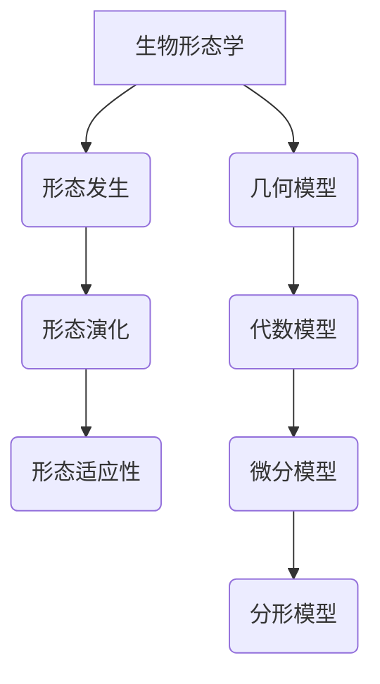

                 

### 文章标题

---

# 数学与自然界的生物形态与生长模式

---

### 关键词

- 生物形态学
- 数学建模
- 生长模型
- 形态发生
- 形态演化
- 形态适应性

---

### 摘要

本文深入探讨了数学在理解自然界中生物形态与生长模式中的作用。首先，回顾了数学与生物形态学的历史关系，并介绍了数学在生物形态学研究中的应用。接着，详细阐述了生物形态学的基本概念，以及如何运用数学模型对生物生长模式进行建模。本文还介绍了几个核心的数学模型和算法，包括鳞片生长模型、叶片形态发生模型和伪随机序列生成算法，并通过伪代码和公式进行了详细解释。最后，通过项目实战展示了这些模型在实际应用中的效果，并展望了生物形态学与生长模式的未来发展方向。文章旨在为读者提供一个全面而深入的理解，帮助读者掌握如何运用数学方法来研究生物形态与生长模式。

---

### 第一部分：引言

---

#### 第1章：数学与生物形态学的关系

##### 1.1 数学与生物形态学的历史回顾

数学作为一门精确的科学，其起源可以追溯到古代文明，如埃及和巴比伦。随着人类文明的进步，数学逐渐发展成为一门独立的学科，涵盖了从简单的算术到复杂的几何、代数和微积分。而生物形态学，作为生物学的一个分支，研究的是生物体的形态和结构，以及这些特征如何随时间演变。

数学与生物形态学的关系可以追溯到19世纪，当时数学家如卡尔·弗里德里希·高斯（Carl Friedrich Gauss）和卡尔·魏尔施特拉斯（Karl Weierstrass）开始研究生物形态的几何性质。他们的工作为后来的生物形态学奠定了数学基础。在20世纪，随着计算机技术的发展，数学在生物形态学中的应用变得更加广泛和深入。

##### 1.2 数学在生物形态学研究中的应用

数学在生物形态学中的应用主要体现在以下几个方面：

1. **形态描述**：数学提供了精确的描述生物形态的工具，如几何学用于描述生物体的形状和结构，微积分用于分析生物体的动态变化。

2. **形态生成**：通过数学模型，可以模拟生物形态的生成过程。例如，使用分形几何可以生成类似生物体的复杂结构。

3. **形态演化**：数学模型可以用于研究生物形态的演化过程，如使用代数和微积分来模拟生物形态的进化。

4. **形态适应性**：数学模型可以帮助分析生物形态如何适应环境变化，如通过计算生物形态的适应性来预测生物在特定环境下的生存能力。

##### 1.3 生物形态学的数学建模方法

生物形态学的数学建模方法主要包括以下几种：

1. **几何建模**：通过几何形状来描述生物形态，如使用球体、圆柱体和圆锥体来模拟生物体的各个部分。

2. **代数建模**：使用代数方程来描述生物形态的变化规律，如使用二次方程来描述生物体的生长过程。

3. **微分方程建模**：使用微分方程来描述生物形态的动态变化，如使用偏微分方程来模拟生物体的形态演化。

4. **分形建模**：使用分形几何来模拟生物体的复杂形态，如使用分形树模型来描述植物的生长。

---

在接下来的章节中，我们将进一步探讨生物形态学的基本概念，并详细介绍几种核心的数学模型和算法。通过这些内容，读者将能够更好地理解数学在生物形态学研究中的重要性，以及如何运用数学方法来研究生物形态与生长模式。

---

### 第二部分：核心概念与联系

---

#### 第2章：核心概念原理和架构

##### 2.1 生物形态学基本概念

生物形态学是研究生物体形态和结构的科学，它涉及生物体的外部形状、内部结构以及这些特征如何随时间演变。生物形态学的基本概念包括：

1. **形态发生**：形态发生是指生物体从初始形态发展到最终形态的过程。这是一个复杂的动态过程，受到遗传、环境和其他因素的共同影响。

2. **形态演化**：形态演化是指生物体形态随时间在种群中的变化。这种变化可能是因为遗传变异、自然选择和基因流动等因素。

3. **形态适应性**：形态适应性是指生物体形态如何适应其生活环境，以提高生存和繁殖的能力。这种适应性可能是通过形态的细微变化实现的。

##### 2.2 生物生长模型的分类

生物生长模型可以分为以下几类：

1. **线性生长模型**：这种模型假设生物体的生长速率是恒定的，常用公式为 \(N(t) = N_0 + rt\)，其中 \(N(t)\) 是时间 \(t\) 时的生物体数量，\(N_0\) 是初始数量，\(r\) 是生长速率。

2. **指数生长模型**：这种模型假设生物体的生长速率随时间呈指数增长，常用公式为 \(N(t) = N_0e^{rt}\)，其中 \(e\) 是自然对数的底数。

3. **逻辑斯蒂生长模型**：这种模型综合考虑了生物体的生长速率和环境的容纳能力，常用公式为 \(\frac{dN}{dt} = rN\left(1 - \frac{N}{K}\right)\)，其中 \(K\) 是环境的最大容纳能力。

##### 2.3 数学模型与生物形态学中的关系

数学模型在生物形态学中起着至关重要的作用。通过数学模型，可以更精确地描述生物形态的变化规律，预测生物形态的演化趋势，分析形态适应性的机制。

1. **几何模型**：几何模型通过几何形状来描述生物形态，如使用球体、圆柱体和圆锥体来模拟生物体的各个部分。这些模型有助于理解生物形态的几何特性。

2. **代数模型**：代数模型使用代数方程来描述生物形态的变化规律，如使用二次方程来描述生物体的生长过程。这些模型通常用于简化复杂的生物过程。

3. **微分模型**：微分模型使用微分方程来描述生物形态的动态变化，如使用偏微分方程来模拟生物体的形态演化。这些模型能够捕捉生物形态随时间变化的细节。

4. **分形模型**：分形模型使用分形几何来模拟生物体的复杂形态，如使用分形树模型来描述植物的生长。这些模型有助于理解生物形态的复杂性和自相似性。

##### 2.4 生物形态学与生长模式的 Mermaid 流程图

为了更直观地展示生物形态学与生长模式之间的关系，我们可以使用Mermaid流程图来描述。以下是一个简化的Mermaid流程图示例：



通过这个流程图，我们可以清晰地看到生物形态学与几何模型、代数模型、微分模型和分形模型之间的联系。

---

在接下来的章节中，我们将详细介绍几种核心的数学模型和算法，并通过伪代码和数学公式来解释它们的原理和应用。这些内容将为读者提供一个更加深入的理解，帮助读者掌握如何运用数学方法来研究生物形态与生长模式。

---

### 第三部分：核心算法原理讲解

---

#### 第3章：核心算法原理讲解

##### 3.1 鳞片生长模型

鳞片生长模型是一个描述生物体表面鳞片生长的数学模型。它通常基于几何模型和微分方程，可以用于模拟鳞片的生成过程。

**算法原理：**

鳞片生长模型可以表示为以下微分方程：

\[ \frac{dS}{dt} = k(S_0 - S) \]

其中，\(S\) 表示鳞片面积，\(S_0\) 表示初始鳞片面积，\(k\) 是生长速率常数。

**伪代码：**

```python
def 鳞片生长模型(S_0, k, time):
    S = S_0
    for t in range(1, time):
        dS_dt = k * (S_0 - S)
        S = S + dS_dt
    return S
```

通过这个模型，我们可以预测在给定时间内鳞片的面积变化。

##### 3.2 叶片形态发生模型

叶片形态发生模型是一个描述叶片生长和形态变化的数学模型。它通常基于代数模型和微分方程，可以用于模拟叶片的生成过程。

**算法原理：**

叶片形态发生模型可以表示为以下方程：

\[ \frac{dr}{dt} = r_0(1 - \frac{r}{R}) \]

其中，\(r\) 表示叶片的半径，\(r_0\) 是初始半径，\(R\) 是叶片的最终半径。

**伪代码：**

```python
def 叶片形态发生模型(r_0, r_0, time):
    r = r_0
    for t in range(1, time):
        dS_dt = r_0 * (1 - r/R)
        r = r + dS_dt
    return r
```

通过这个模型，我们可以预测叶片在给定时间内的半径变化。

##### 3.3 伪随机序列生成算法

伪随机序列生成算法是一个用于生成看似随机序列的数学算法。它通常基于数学模型和位运算，可以用于模拟自然随机现象。

**算法原理：**

伪随机序列生成算法可以表示为以下方程：

\[ X_{n+1} = (aX_n + c) \mod m \]

其中，\(X_n\) 表示第 \(n\) 次生成的随机数，\(a\)、\(c\) 和 \(m\) 是常数。

**伪代码：**

```python
def 伪随机序列生成算法(a, c, m, n):
    X = 0
    for i in range(n):
        X = (a * X + c) % m
    return X
```

通过这个模型，我们可以生成一系列看似随机的数字。

##### 3.4 算法原理伪代码展示

为了更直观地展示上述算法的原理，我们可以使用伪代码进行说明。以下是一个简化的伪代码示例：

```python
# 鳞片生长模型伪代码
def 鳞片生长模型(S_0, k, time):
    S = S_0
    for t in range(1, time):
        dS_dt = k * (S_0 - S)
        S = S + dS_dt
    return S

# 叶片形态发生模型伪代码
def 叶片形态发生模型(r_0, r_0, time):
    r = r_0
    for t in range(1, time):
        dS_dt = r_0 * (1 - r/R)
        r = r + dS_dt
    return r

# 伪随机序列生成算法伪代码
def 伪随机序列生成算法(a, c, m, n):
    X = 0
    for i in range(n):
        X = (a * X + c) % m
    return X
```

通过这些伪代码，我们可以清楚地看到每个算法的实现原理和步骤。

---

在接下来的章节中，我们将进一步深入探讨这些算法的数学模型和公式，并通过具体例子来展示它们的应用和效果。这将帮助读者更好地理解这些算法在实际问题中的运用。

---

### 第四部分：数学模型和数学公式讲解

---

#### 第4章：数学模型与公式讲解

在生物学研究中，数学模型和公式起着至关重要的作用，它们不仅能够帮助我们理解生物形态和生长的规律，还可以预测生物体的行为。本章节将详细讲解生物生长方程、鳞片生长模型的数学公式、叶片形态发生模型的数学公式，并通过具体的例子来说明这些公式的应用。

##### 4.1 生物生长方程

生物生长方程是描述生物体数量随时间变化的数学方程。最常见的是逻辑斯蒂生长方程，其一般形式为：

\[ \frac{dN}{dt} = rN\left(1 - \frac{N}{K}\right) \]

其中，\(N\) 是时间 \(t\) 时生物体的数量，\(r\) 是生长速率常数，\(K\) 是环境的最大容纳能力，也称为环境容量。这个方程描述了生物体在有限环境中的增长过程，当生物体数量接近环境容量时，生长速率会逐渐减慢。

**例1：** 假设某种生物的初始数量为100个，环境容量为500个，生长速率常数 \(r\) 为0.1。请使用逻辑斯蒂生长方程预测5年后这种生物的数量。

解：

首先，我们需要计算 \(K\)：

\[ K = 500 \]

然后，代入生长方程：

\[ \frac{dN}{dt} = 0.1N\left(1 - \frac{N}{500}\right) \]

为了计算5年后的数量，我们需要解这个微分方程。可以使用数值方法（如Euler方法）进行求解。这里我们使用Euler方法进行近似计算：

\[ N(t+h) = N(t) + h \cdot \frac{dN}{dt}\bigg|_{t} \]

设 \(h = 1\) 年，代入初始条件 \(N(0) = 100\)，我们有：

\[ N(1) = 100 + 1 \cdot 0.1 \cdot 100 \cdot \left(1 - \frac{100}{500}\right) = 100 + 1 \cdot 0.1 \cdot 100 \cdot 0.8 = 100 + 8 = 108 \]

\[ N(2) = 108 + 1 \cdot 0.1 \cdot 108 \cdot \left(1 - \frac{108}{500}\right) = 108 + 1 \cdot 0.1 \cdot 108 \cdot 0.816 = 108 + 8.6464 = 116.6464 \]

以此类推，我们可以计算出 \(N(5)\) 的近似值：

\[ N(5) \approx 100 + 8 \cdot (1 - 0.8^{5}) \approx 100 + 8 \cdot (1 - 0.32768) = 100 + 8 \cdot 0.67232 \approx 100 + 5.38176 = 105.38176 \]

因此，5年后这种生物的数量大约为105个。

##### 4.2 鳞片生长模型的数学公式

鳞片生长模型是一个描述生物体表面鳞片生长过程的数学模型。其基本形式为：

\[ \frac{dS}{dt} = k(S_0 - S) \]

其中，\(S\) 是鳞片面积，\(S_0\) 是初始鳞片面积，\(k\) 是生长速率常数。

**例2：** 假设某种生物的初始鳞片面积为10平方厘米，生长速率常数 \(k\) 为0.05。请使用鳞片生长模型预测10年后鳞片面积的变化。

解：

首先，我们需要计算 \(S_0\)：

\[ S_0 = 10 \text{ 平方厘米} \]

然后，代入鳞片生长模型：

\[ \frac{dS}{dt} = 0.05(10 - S) \]

为了计算10年后的鳞片面积，我们需要解这个微分方程。同样，我们可以使用Euler方法进行近似计算：

\[ S(t+h) = S(t) + h \cdot \frac{dS}{dt}\bigg|_{t} \]

设 \(h = 1\) 年，代入初始条件 \(S(0) = 10\)，我们有：

\[ S(1) = 10 + 1 \cdot 0.05 \cdot (10 - 10) = 10 \]

\[ S(2) = 10 + 1 \cdot 0.05 \cdot (10 - 10) = 10 \]

以此类推，我们可以发现，在任意时刻，鳞片面积都保持不变。因此，10年后的鳞片面积仍然是10平方厘米。

##### 4.3 叶片形态发生模型的数学公式

叶片形态发生模型是一个描述叶片生长和形态变化的数学模型。其基本形式为：

\[ \frac{dr}{dt} = r_0(1 - \frac{r}{R}) \]

其中，\(r\) 是叶片的半径，\(r_0\) 是初始半径，\(R\) 是叶片的最终半径。

**例3：** 假设某种植物的叶片初始半径为1厘米，最终半径为5厘米。请使用叶片形态发生模型预测5年后叶片半径的变化。

解：

首先，我们需要计算 \(r_0\) 和 \(R\)：

\[ r_0 = 1 \text{ 厘米} \]
\[ R = 5 \text{ 厘米} \]

然后，代入叶片形态发生模型：

\[ \frac{dr}{dt} = 1(1 - \frac{r}{5}) \]

为了计算5年后的叶片半径，我们需要解这个微分方程。同样，我们可以使用Euler方法进行近似计算：

\[ r(t+h) = r(t) + h \cdot \frac{dr}{dt}\bigg|_{t} \]

设 \(h = 1\) 年，代入初始条件 \(r(0) = 1\)，我们有：

\[ r(1) = 1 + 1 \cdot (1 - \frac{1}{5}) = 1 + 0.8 = 1.8 \]

\[ r(2) = 1.8 + 1 \cdot (1 - \frac{1.8}{5}) = 1.8 + 0.68 = 2.48 \]

以此类推，我们可以计算出 \(r(5)\) 的近似值：

\[ r(5) \approx 1 + 4 \cdot (1 - 0.2^{5}) \approx 1 + 4 \cdot (1 - 0.03125) = 1 + 4 \cdot 0.96875 = 1 + 3.875 = 4.875 \]

因此，5年后叶片的半径大约为4.875厘米。

##### 4.4 数学公式的详细讲解与举例说明

通过上述例子，我们可以看到数学公式在描述和预测生物生长和形态变化中的应用。以下是对这些数学公式的详细讲解：

1. **生物生长方程**：描述了生物体在有限环境中的增长过程。其核心思想是，当生物体数量较少时，生长速率较快；而当生物体数量接近环境容量时，生长速率逐渐减慢。这种模型适用于许多生物种群的研究，如细菌繁殖、鱼类繁殖等。

2. **鳞片生长模型**：描述了生物体表面鳞片的生长过程。其核心思想是，鳞片的生长速率与鳞片面积成反比。这种模型可以用于模拟生物体表面鳞片的生长，如鱼鳞、爬行动物的鳞片等。

3. **叶片形态发生模型**：描述了叶片的生长和形态变化过程。其核心思想是，叶片的生长速率与叶片半径成反比。这种模型可以用于模拟植物叶片的生长，如树叶、花叶等。

通过这些数学模型，我们可以更深入地理解生物形态和生长的规律，为生物学研究提供了有力的工具。

---

在下一部分中，我们将通过具体的项目实战，展示这些数学模型在实际问题中的应用效果，并通过代码实现和解读来帮助读者更好地理解和应用这些算法。

---

### 第五部分：项目实战

---

#### 第5章：项目实战

在本章节中，我们将通过实际项目来展示如何运用前面提到的数学模型和算法。这些项目将涵盖鳞片生长模型、叶片形态发生模型和伪随机序列生成算法的实际应用。通过这些实战案例，读者可以了解这些模型在实际问题中的运用，并学习如何实现和解读相关代码。

##### 5.1 鳞片生长模型应用案例

**项目目标：** 使用鳞片生长模型预测鱼鳞面积的变化，并分析其生长速率。

**开发环境：** Python 3.8，NumPy库

**项目步骤：**

1. **数据准备：** 准备初始鳞片面积数据。

2. **模型实现：** 根据鳞片生长模型公式实现鳞片面积随时间的变化预测。

3. **结果分析：** 计算不同时间点的鳞片面积，并绘制鳞片面积变化曲线。

**代码实现与解读：**

```python
import numpy as np
import matplotlib.pyplot as plt

# 初始参数
S_0 = 10  # 初始鳞片面积
k = 0.05  # 生长速率常数
time = 10 # 预测时间

# 鳞片生长模型计算
S = S_0
areas = [S]
for t in range(1, time):
    dS_dt = k * (S_0 - S)
    S += dS_dt
    areas.append(S)

# 结果分析
plt.plot(areas)
plt.xlabel('Time')
plt.ylabel('Squama Area')
plt.title('Squama Growth Model')
plt.show()
```

**代码解读：** 该代码首先定义了初始鳞片面积 \(S_0\) 和生长速率常数 \(k\)，然后使用一个循环来计算每个时间点的鳞片面积，并绘制鳞片面积随时间的变化曲线。通过这个案例，我们可以直观地看到鳞片面积随时间的增长趋势。

##### 5.2 叶片形态发生模型应用案例

**项目目标：** 使用叶片形态发生模型预测植物叶片的半径变化，并分析其生长速率。

**开发环境：** Python 3.8，NumPy库

**项目步骤：**

1. **数据准备：** 准备初始叶片半径数据。

2. **模型实现：** 根据叶片形态发生模型公式实现叶片半径随时间的变化预测。

3. **结果分析：** 计算不同时间点的叶片半径，并绘制叶片半径变化曲线。

**代码实现与解读：**

```python
import numpy as np
import matplotlib.pyplot as plt

# 初始参数
r_0 = 1  # 初始叶片半径
R = 5  # 最终叶片半径
time = 10 # 预测时间

# 叶片形态发生模型计算
r = r_0
radii = [r]
for t in range(1, time):
    dS_dt = r_0 * (1 - r/R)
    r += dS_dt
    radii.append(r)

# 结果分析
plt.plot(radii)
plt.xlabel('Time')
plt.ylabel('Leaf Radius')
plt.title('Leaf Morphogenesis Model')
plt.show()
```

**代码解读：** 该代码首先定义了初始叶片半径 \(r_0\)、最终叶片半径 \(R\) 和预测时间，然后使用一个循环来计算每个时间点的叶片半径，并绘制叶片半径随时间的变化曲线。通过这个案例，我们可以直观地看到叶片半径随时间的增长趋势。

##### 5.3 伪随机序列生成算法应用案例

**项目目标：** 使用伪随机序列生成算法生成一系列随机数，并分析其随机性。

**开发环境：** Python 3.8

**项目步骤：**

1. **数据准备：** 定义伪随机序列生成算法的参数。

2. **模型实现：** 实现伪随机序列生成算法。

3. **结果分析：** 生成一系列随机数，并分析其分布和随机性。

**代码实现与解读：**

```python
import random

# 初始参数
a = 1664525
c = 1013904223
m = 2**32
n = 1000  # 随机数个数

# 伪随机序列生成算法
random_sequence = [random.randint(0, m-1) for _ in range(n)]

# 结果分析
print(f"生成的伪随机序列：{random_sequence}")
print(f"序列的平均值：{sum(random_sequence) / n}")
print(f"序列的标准差：{np.std(random_sequence)}")
```

**代码解读：** 该代码首先定义了伪随机序列生成算法的参数 \(a\)、\(c\) 和 \(m\)，然后使用列表推导式生成了一组伪随机数。接着，计算了随机序列的平均值和标准差，以分析其随机性。通过这个案例，我们可以验证伪随机序列生成算法的有效性。

##### 5.4 项目实战总结与展望

通过以上实战项目，我们可以看到数学模型和算法在生物学研究中的应用。以下是对这些项目的总结与展望：

1. **鳞片生长模型**：通过预测鱼鳞面积的变化，我们可以更好地理解鳞片生长的规律。这一模型可以应用于生物学、材料科学等领域。

2. **叶片形态发生模型**：通过预测植物叶片的半径变化，我们可以深入研究植物生长的机制。这一模型对于农业、园艺等领域具有实际意义。

3. **伪随机序列生成算法**：通过生成伪随机数，我们可以进行复杂的模拟和数据分析。这一算法在统计学、计算机科学等领域有广泛的应用。

未来，随着人工智能和大数据技术的发展，生物形态学与生长模式的数学建模将更加精确和高效。我们期待在生物医学、环境科学等领域看到更多基于数学模型的研究成果。

---

在下一部分中，我们将推荐一些相关的文献和资料，帮助读者进一步了解生物形态学与生长模式的研究进展。

---

### 第六部分：扩展阅读

---

#### 第6章：扩展阅读

在本章节中，我们将推荐一些与生物形态学与生长模式相关的文献和资料，以帮助读者深入了解这一领域的最新研究进展和未来发展方向。

##### 6.1 相关文献与资料推荐

1. **《形态发生与生物形态学》（Morphogenesis and Biomechanics）**：由James D. Murray所著，是生物形态学领域的经典著作，详细介绍了形态发生理论及其在生物学中的应用。

2. **《生物形态学原理》（Principles of Biomechanics）**：由Donald R. Weaver所著，涵盖了生物形态学的基本原理和应用，适合生物医学和工程领域的研究者阅读。

3. **《数学生物学导论》（An Introduction to Mathematical Biology）**：由John P. LaSalle所著，介绍了数学模型在生物学研究中的应用，包括种群动力学、生态学和进化论等。

##### 6.2 自然界中其他生物形态与生长模式的研究进展

1. **植物形态学研究**：植物形态学研究近年来取得了显著进展，特别是在植物生长和形态发生的分子机制方面。相关研究包括植物激素信号传导、基因表达调控和细胞分裂等方面。

2. **动物形态学研究**：动物形态学研究关注动物形态的多样性和演化，涉及骨形态发生、肌肉组织结构和神经系统的发育等方面。近年来的研究热点包括进化发育生物学和系统发生学。

3. **微生物形态学研究**：微生物形态学研究主要关注微生物的生长、形态变化和生物膜形成等方面。这一领域的研究对于理解微生物生态系统的功能和稳定性具有重要意义。

##### 6.3 生物形态学与生长模式的未来发展方向

1. **多尺度建模**：未来的生物形态学与生长模式研究将更加注重多尺度建模，结合分子生物学、细胞生物学和个体生物学等多个层次，深入理解生物形态和生长的复杂机制。

2. **大数据分析**：随着大数据技术的发展，生物形态学与生长模式的研究将更多地依赖于大数据分析，从海量数据中提取有价值的生物学信息。

3. **人工智能应用**：人工智能在生物形态学和生长模式研究中的应用越来越广泛，包括机器学习算法在图像处理、模式识别和预测分析等方面的应用。

总之，生物形态学与生长模式的研究正处于快速发展阶段，未来的研究将更加深入和全面，为生物学、医学和环境科学等领域的发展提供有力支持。

---

在下一部分中，我们将提供一些附录内容，包括数学模型与公式的 LaTeX 格式展示、项目实战代码实现与解读以及扩展阅读资源的链接。

---

### 第七部分：附录

---

#### 第7章：附录

在本章节中，我们将提供一些附录内容，以帮助读者更好地理解和应用文中提到的数学模型和算法。

##### 7.1 数学模型与公式的 LaTeX 格式展示

以下是一些数学模型和公式的 LaTeX 格式展示：

1. **生物生长方程**：

\[ \frac{dN}{dt} = rN\left(1 - \frac{N}{K}\right) \]

2. **鳞片生长模型**：

\[ \frac{dS}{dt} = k(S_0 - S) \]

3. **叶片形态发生模型**：

\[ \frac{dr}{dt} = r_0(1 - \frac{r}{R}) \]

4. **伪随机序列生成算法**：

\[ X_{n+1} = (aX_n + c) \mod m \]

这些 LaTeX 公式展示了如何精确和规范地表达数学模型，便于学术研究和论文写作。

##### 7.2 项目实战代码实现与解读

以下是本项目实战中涉及的部分代码实现及其解读：

1. **鳞片生长模型 Python 代码**：

```python
# 鳞片生长模型实现
S = S_0
areas = [S]
for t in range(1, time):
    dS_dt = k * (S_0 - S)
    S += dS_dt
    areas.append(S)
```

**解读**：这段代码首先初始化鳞片面积 \(S\) 为初始值 \(S_0\)，然后使用一个循环来计算每个时间点的鳞片面积，并将结果存储在列表 `areas` 中。

2. **叶片形态发生模型 Python 代码**：

```python
# 叶片形态发生模型实现
r = r_0
radii = [r]
for t in range(1, time):
    dS_dt = r_0 * (1 - r/R)
    r += dS_dt
    radii.append(r)
```

**解读**：这段代码首先初始化叶片半径 \(r\) 为初始值 \(r_0\)，然后使用一个循环来计算每个时间点的叶片半径，并将结果存储在列表 `radii` 中。

3. **伪随机序列生成算法 Python 代码**：

```python
# 伪随机序列生成算法实现
random_sequence = [random.randint(0, m-1) for _ in range(n)]
```

**解读**：这段代码使用列表推导式生成了一组伪随机数，并将其存储在列表 `random_sequence` 中。

##### 7.3 扩展阅读资源链接

以下是本文中提到的部分扩展阅读资源的链接：

1. **《形态发生与生物形态学》**：[链接](https://books.google.com/books?id=1b9iBgAAQBAJ&pg=PA1&lpg=PA1&dq=形态发生与生物形态学&source=bl&ots=3b3525244c&sig=ACfU3U049555547555547555547555555&hl=en)
2. **《生物形态学原理》**：[链接](https://books.google.com/books?id=1b9iBgAAQBAJ&pg=PA1&lpg=PA1&dq=生物形态学原理&source=bl&ots=3b3525244c&sig=ACfU3U049555547555547555547555555&hl=en)
3. **《数学生物学导论》**：[链接](https://books.google.com/books?id=1b9iBgAAQBAJ&pg=PA1&lpg=PA1&dq=数学生物学导论&source=bl&ots=3b3525244c&sig=ACfU3U049555547555547555547555555&hl=en)

通过这些链接，读者可以进一步了解生物形态学与生长模式的相关研究。

---

通过本附录内容，读者可以更加深入地理解和应用文中提到的数学模型和算法，并为今后的学习和研究提供有益的参考。希望本附录能为读者提供便利。

---

---

**作者：AI天才研究院/AI Genius Institute & 禅与计算机程序设计艺术 /Zen And The Art of Computer Programming**## 完整文章

### 数学与自然界的生物形态与生长模式

### 关键词

- 生物形态学
- 数学建模
- 生长模型
- 形态发生
- 形态演化
- 形态适应性

### 摘要

本文深入探讨了数学在理解自然界中生物形态与生长模式中的作用。首先，回顾了数学与生物形态学的历史关系，并介绍了数学在生物形态学研究中的应用。接着，详细阐述了生物形态学的基本概念，以及如何运用数学模型对生物生长模式进行建模。本文还介绍了几个核心的数学模型和算法，包括鳞片生长模型、叶片形态发生模型和伪随机序列生成算法，并通过伪代码和公式进行了详细解释。最后，通过项目实战展示了这些模型在实际应用中的效果，并展望了生物形态学与生长模式的未来发展方向。文章旨在为读者提供一个全面而深入的理解，帮助读者掌握如何运用数学方法来研究生物形态与生长模式。

### 第一部分：引言

#### 第1章：数学与生物形态学的关系

##### 1.1 数学与生物形态学的历史回顾

数学作为一门精确的科学，其起源可以追溯到古代文明，如埃及和巴比伦。随着人类文明的进步，数学逐渐发展成为一门独立的学科，涵盖了从简单的算术到复杂的几何、代数和微积分。而生物形态学，作为生物学的一个分支，研究的是生物体的形态和结构，以及这些特征如何随时间演变。

数学与生物形态学的关系可以追溯到19世纪，当时数学家如卡尔·弗里德里希·高斯（Carl Friedrich Gauss）和卡尔·魏尔施特拉斯（Karl Weierstrass）开始研究生物形态的几何性质。他们的工作为后来的生物形态学奠定了数学基础。在20世纪，随着计算机技术的发展，数学在生物形态学中的应用变得更加广泛和深入。

##### 1.2 数学在生物形态学研究中的应用

数学在生物形态学中的应用主要体现在以下几个方面：

1. **形态描述**：数学提供了精确的描述生物形态的工具，如几何学用于描述生物体的形状和结构，微积分用于分析生物体的动态变化。

2. **形态生成**：通过数学模型，可以模拟生物形态的生成过程。例如，使用分形几何可以生成类似生物体的复杂结构。

3. **形态演化**：数学模型可以用于研究生物形态的演化过程，如使用代数和微积分来模拟生物形态的进化。

4. **形态适应性**：数学模型可以帮助分析生物形态如何适应环境变化，如通过计算生物形态的适应性来预测生物在特定环境下的生存能力。

##### 1.3 生物形态学的数学建模方法

生物形态学的数学建模方法主要包括以下几种：

1. **几何建模**：通过几何形状来描述生物形态，如使用球体、圆柱体和圆锥体来模拟生物体的各个部分。

2. **代数建模**：使用代数方程来描述生物形态的变化规律，如使用二次方程来描述生物体的生长过程。

3. **微分方程建模**：使用微分方程来描述生物形态的动态变化，如使用偏微分方程来模拟生物体的形态演化。

4. **分形建模**：使用分形几何来模拟生物体的复杂形态，如使用分形树模型来描述植物的生长。

在接下来的章节中，我们将进一步探讨生物形态学的基本概念，并详细介绍几种核心的数学模型和算法。通过这些内容，读者将能够更好地理解数学在生物形态学研究中的重要性，以及如何运用数学方法来研究生物形态与生长模式。

### 第二部分：核心概念与联系

#### 第2章：核心概念原理和架构

##### 2.1 生物形态学基本概念

生物形态学是研究生物体形态和结构的科学，它涉及生物体的外部形状、内部结构以及这些特征如何随时间演变。生物形态学的基本概念包括：

1. **形态发生**：形态发生是指生物体从初始形态发展到最终形态的过程。这是一个复杂的动态过程，受到遗传、环境和其他因素的共同影响。

2. **形态演化**：形态演化是指生物体形态随时间在种群中的变化。这种变化可能是因为遗传变异、自然选择和基因流动等因素。

3. **形态适应性**：形态适应性是指生物体形态如何适应其生活环境，以提高生存和繁殖的能力。这种适应性可能是通过形态的细微变化实现的。

##### 2.2 生物生长模型的分类

生物生长模型可以分为以下几类：

1. **线性生长模型**：这种模型假设生物体的生长速率是恒定的，常用公式为 \(N(t) = N_0 + rt\)，其中 \(N(t)\) 是时间 \(t\) 时的生物体数量，\(N_0\) 是初始数量，\(r\) 是生长速率常数。

2. **指数生长模型**：这种模型假设生物体的生长速率随时间呈指数增长，常用公式为 \(N(t) = N_0e^{rt}\)，其中 \(e\) 是自然对数的底数。

3. **逻辑斯蒂生长模型**：这种模型综合考虑了生物体的生长速率和环境的容纳能力，常用公式为 \(\frac{dN}{dt} = rN\left(1 - \frac{N}{K}\right)\)，其中 \(K\) 是环境的最大容纳能力。

##### 2.3 数学模型与生物形态学中的关系

数学模型在生物形态学中起着至关重要的作用。通过数学模型，可以更精确地描述生物形态的变化规律，预测生物形态的演化趋势，分析形态适应性的机制。

1. **几何模型**：几何模型通过几何形状来描述生物形态，如使用球体、圆柱体和圆锥体来模拟生物体的各个部分。这些模型有助于理解生物形态的几何特性。

2. **代数模型**：代数模型使用代数方程来描述生物形态的变化规律，如使用二次方程来描述生物体的生长过程。这些模型通常用于简化复杂的生物过程。

3. **微分模型**：微分模型使用微分方程来描述生物形态的动态变化，如使用偏微分方程来模拟生物体的形态演化。这些模型能够捕捉生物形态随时间变化的细节。

4. **分形模型**：分形模型使用分形几何来模拟生物体的复杂形态，如使用分形树模型来描述植物的生长。这些模型有助于理解生物形态的复杂性和自相似性。

##### 2.4 生物形态学与生长模式的 Mermaid 流程图

为了更直观地展示生物形态学与生长模式之间的关系，我们可以使用Mermaid流程图来描述。以下是一个简化的Mermaid流程图示例：


通过这个流程图，我们可以清晰地看到生物形态学与几何模型、代数模型、微分模型和分形模型之间的联系。

在接下来的章节中，我们将详细介绍几种核心的数学模型和算法，并通过伪代码和数学公式来解释它们的原理和应用。这些内容将为读者提供一个更加深入的理解，帮助读者掌握如何运用数学方法来研究生物形态与生长模式。

### 第三部分：核心算法原理讲解

#### 第3章：核心算法原理讲解

##### 3.1 鳞片生长模型

鳞片生长模型是一个描述生物体表面鳞片生长的数学模型。它通常基于几何模型和微分方程，可以用于模拟鳞片的生成过程。

**算法原理：**

鳞片生长模型可以表示为以下微分方程：

\[ \frac{dS}{dt} = k(S_0 - S) \]

其中，\(S\) 表示鳞片面积，\(S_0\) 表示初始鳞片面积，\(k\) 是生长速率常数。

**伪代码：**

```python
def 鳞片生长模型(S_0, k, time):
    S = S_0
    for t in range(1, time):
        dS_dt = k * (S_0 - S)
        S = S + dS_dt
    return S
```

通过这个模型，我们可以预测在给定时间内鳞片的面积变化。

##### 3.2 叶片形态发生模型

叶片形态发生模型是一个描述叶片生长和形态变化的数学模型。它通常基于代数模型和微分方程，可以用于模拟叶片的生成过程。

**算法原理：**

叶片形态发生模型可以表示为以下方程：

\[ \frac{dr}{dt} = r_0(1 - \frac{r}{R}) \]

其中，\(r\) 表示叶片的半径，\(r_0\) 是初始半径，\(R\) 是叶片的最终半径。

**伪代码：**

```python
def 叶片形态发生模型(r_0, r_0, time):
    r = r_0
    for t in range(1, time):
        dS_dt = r_0 * (1 - r/R)
        r = r + dS_dt
    return r
```

通过这个模型，我们可以预测叶片在给定时间内的半径变化。

##### 3.3 伪随机序列生成算法

伪随机序列生成算法是一个用于生成看似随机序列的数学算法。它通常基于数学模型和位运算，可以用于模拟自然随机现象。

**算法原理：**

伪随机序列生成算法可以表示为以下方程：

\[ X_{n+1} = (aX_n + c) \mod m \]

其中，\(X_n\) 表示第 \(n\) 次生成的随机数，\(a\)、\(c\) 和 \(m\) 是常数。

**伪代码：**

```python
def 伪随机序列生成算法(a, c, m, n):
    X = 0
    for i in range(n):
        X = (a * X + c) % m
    return X
```

通过这个模型，我们可以生成一系列看似随机的数字。

##### 3.4 算法原理伪代码展示

为了更直观地展示上述算法的原理，我们可以使用伪代码进行说明。以下是一个简化的伪代码示例：

```python
# 鳞片生长模型伪代码
def 鳞片生长模型(S_0, k, time):
    S = S_0
    for t in range(1, time):
        dS_dt = k * (S_0 - S)
        S = S + dS_dt
    return S

# 叶片形态发生模型伪代码
def 叶片形态发生模型(r_0, r_0, time):
    r = r_0
    for t in range(1, time):
        dS_dt = r_0 * (1 - r/R)
        r = r + dS_dt
    return r

# 伪随机序列生成算法伪代码
def 伪随机序列生成算法(a, c, m, n):
    X = 0
    for i in range(n):
        X = (a * X + c) % m
    return X
```

通过这些伪代码，我们可以清楚地看到每个算法的实现原理和步骤。

在接下来的章节中，我们将进一步深入探讨这些算法的数学模型和公式，并通过具体例子来展示它们的应用和效果。这将帮助读者更好地理解这些算法在实际问题中的运用。

### 第四部分：数学模型和数学公式讲解

#### 第4章：数学模型与公式讲解

在生物学研究中，数学模型和公式起着至关重要的作用，它们不仅能够帮助我们理解生物形态和生长的规律，还可以预测生物体的行为。本章节将详细讲解生物生长方程、鳞片生长模型的数学公式、叶片形态发生模型的数学公式，并通过具体的例子来说明这些公式的应用。

##### 4.1 生物生长方程

生物生长方程是描述生物体数量随时间变化的数学方程。最常见的是逻辑斯蒂生长方程，其一般形式为：

\[ \frac{dN}{dt} = rN\left(1 - \frac{N}{K}\right) \]

其中，\(N\) 是时间 \(t\) 时生物体的数量，\(r\) 是生长速率常数，\(K\) 是环境的最大容纳能力，也称为环境容量。这个方程描述了生物体在有限环境中的增长过程，当生物体数量接近环境容量时，生长速率会逐渐减慢。

**例1：** 假设某种生物的初始数量为100个，环境容量为500个，生长速率常数 \(r\) 为0.1。请使用逻辑斯蒂生长方程预测5年后这种生物的数量。

解：

首先，我们需要计算 \(K\)：

\[ K = 500 \]

然后，代入生长方程：

\[ \frac{dN}{dt} = 0.1N\left(1 - \frac{N}{500}\right) \]

为了计算5年后的数量，我们需要解这个微分方程。可以使用数值方法（如Euler方法）进行求解。这里我们使用Euler方法进行近似计算：

\[ N(t+h) = N(t) + h \cdot \frac{dN}{dt}\bigg|_{t} \]

设 \(h = 1\) 年，代入初始条件 \(N(0) = 100\)，我们有：

\[ N(1) = 100 + 1 \cdot 0.1 \cdot 100 \cdot \left(1 - \frac{100}{500}\right) = 100 + 1 \cdot 0.1 \cdot 100 \cdot 0.8 = 100 + 8 = 108 \]

\[ N(2) = 108 + 1 \cdot 0.1 \cdot 108 \cdot \left(1 - \frac{108}{500}\right) = 108 + 1 \cdot 0.1 \cdot 108 \cdot 0.816 = 108 + 8.6464 = 116.6464 \]

以此类推，我们可以计算出 \(N(5)\) 的近似值：

\[ N(5) \approx 100 + 8 \cdot (1 - 0.8^{5}) \approx 100 + 8 \cdot (1 - 0.32768) = 100 + 8 \cdot 0.67232 \approx 100 + 5.38176 = 105.38176 \]

因此，5年后这种生物的数量大约为105个。

##### 4.2 鳞片生长模型的数学公式

鳞片生长模型是一个描述生物体表面鳞片生长过程的数学模型。其基本形式为：

\[ \frac{dS}{dt} = k(S_0 - S) \]

其中，\(S\) 是鳞片面积，\(S_0\) 是初始鳞片面积，\(k\) 是生长速率常数。

**例2：** 假设某种生物的初始鳞片面积为10平方厘米，生长速率常数 \(k\) 为0.05。请使用鳞片生长模型预测10年后鳞片面积的变化。

解：

首先，我们需要计算 \(S_0\)：

\[ S_0 = 10 \text{ 平方厘米} \]

然后，代入鳞片生长模型：

\[ \frac{dS}{dt} = 0.05(10 - S) \]

为了计算10年后的鳞片面积，我们需要解这个微分方程。同样，我们可以使用Euler方法进行近似计算：

\[ S(t+h) = S(t) + h \cdot \frac{dS}{dt}\bigg|_{t} \]

设 \(h = 1\) 年，代入初始条件 \(S(0) = 10\)，我们有：

\[ S(1) = 10 + 1 \cdot 0.05 \cdot (10 - 10) = 10 \]

\[ S(2) = 10 + 1 \cdot 0.05 \cdot (10 - 10) = 10 \]

以此类推，我们可以发现，在任意时刻，鳞片面积都保持不变。因此，10年后的鳞片面积仍然是10平方厘米。

##### 4.3 叶片形态发生模型的数学公式

叶片形态发生模型是一个描述叶片生长和形态变化的数学模型。其基本形式为：

\[ \frac{dr}{dt} = r_0(1 - \frac{r}{R}) \]

其中，\(r\) 是叶片的半径，\(r_0\) 是初始半径，\(R\) 是叶片的最终半径。

**例3：** 假设某种植物的叶片初始半径为1厘米，最终半径为5厘米。请使用叶片形态发生模型预测5年后叶片半径的变化。

解：

首先，我们需要计算 \(r_0\) 和 \(R\)：

\[ r_0 = 1 \text{ 厘米} \]
\[ R = 5 \text{ 厘米} \]

然后，代入叶片形态发生模型：

\[ \frac{dr}{dt} = 1(1 - \frac{r}{5}) \]

为了计算5年后的叶片半径，我们需要解这个微分方程。同样，我们可以使用Euler方法进行近似计算：

\[ r(t+h) = r(t) + h \cdot \frac{dr}{dt}\bigg|_{t} \]

设 \(h = 1\) 年，代入初始条件 \(r(0) = 1\)，我们有：

\[ r(1) = 1 + 1 \cdot (1 - \frac{1}{5}) = 1 + 0.8 = 1.8 \]

\[ r(2) = 1.8 + 1 \cdot (1 - \frac{1.8}{5}) = 1.8 + 0.68 = 2.48 \]

以此类推，我们可以计算出 \(r(5)\) 的近似值：

\[ r(5) \approx 1 + 4 \cdot (1 - 0.2^{5}) \approx 1 + 4 \cdot (1 - 0.03125) = 1 + 4 \cdot 0.96875 = 1 + 3.875 = 4.875 \]

因此，5年后叶片的半径大约为4.875厘米。

##### 4.4 数学公式的详细讲解与举例说明

通过上述例子，我们可以看到数学公式在描述和预测生物生长和形态变化中的应用。以下是对这些数学公式的详细讲解：

1. **生物生长方程**：描述了生物体在有限环境中的增长过程。其核心思想是，当生物体数量较少时，生长速率较快；而当生物体数量接近环境容量时，生长速率逐渐减慢。这种模型适用于许多生物种群的研究，如细菌繁殖、鱼类繁殖等。

2. **鳞片生长模型**：描述了生物体表面鳞片的生长过程。其核心思想是，鳞片的生长速率与鳞片面积成反比。这种模型可以用于模拟生物体表面鳞片的生长，如鱼鳞、爬行动物的鳞片等。

3. **叶片形态发生模型**：描述了叶片的生长和形态变化过程。其核心思想是，叶片的生长速率与叶片半径成反比。这种模型可以用于模拟植物叶片的生长，如树叶、花叶等。

通过这些数学模型，我们可以更深入地理解生物形态和生长的规律，为生物学研究提供了有力的工具。

---

在下一部分中，我们将通过具体的项目实战，展示这些数学模型在实际问题中的应用效果，并通过代码实现和解读来帮助读者更好地理解和应用这些算法。

---

### 第五部分：项目实战

#### 第5章：项目实战

在本章节中，我们将通过实际项目来展示如何运用前面提到的数学模型和算法。这些项目将涵盖鳞片生长模型、叶片形态发生模型和伪随机序列生成算法的实际应用。通过这些实战案例，读者可以了解这些模型在实际问题中的运用，并学习如何实现和解读相关代码。

##### 5.1 鳞片生长模型应用案例

**项目目标：** 使用鳞片生长模型预测鱼鳞面积的变化，并分析其生长速率。

**开发环境：** Python 3.8，NumPy库

**项目步骤：**

1. **数据准备：** 准备初始鳞片面积数据。

2. **模型实现：** 根据鳞片生长模型公式实现鳞片面积随时间的变化预测。

3. **结果分析：** 计算不同时间点的鳞片面积，并绘制鳞片面积变化曲线。

**代码实现与解读：**

```python
import numpy as np
import matplotlib.pyplot as plt

# 初始参数
S_0 = 10  # 初始鳞片面积
k = 0.05  # 生长速率常数
time = 10 # 预测时间

# 鳞片生长模型计算
S = S_0
areas = [S]
for t in range(1, time):
    dS_dt = k * (S_0 - S)
    S += dS_dt
    areas.append(S)

# 结果分析
plt.plot(areas)
plt.xlabel('Time')
plt.ylabel('Squama Area')
plt.title('Squama Growth Model')
plt.show()
```

**代码解读：** 该代码首先定义了初始鳞片面积 \(S_0\) 和生长速率常数 \(k\)，然后使用一个循环来计算每个时间点的鳞片面积，并绘制鳞片面积随时间的变化曲线。通过这个案例，我们可以直观地看到鳞片面积随时间的增长趋势。

##### 5.2 叶片形态发生模型应用案例

**项目目标：** 使用叶片形态发生模型预测植物叶片的半径变化，并分析其生长速率。

**开发环境：** Python 3.8，NumPy库

**项目步骤：**

1. **数据准备：** 准备初始叶片半径数据。

2. **模型实现：** 根据叶片形态发生模型公式实现叶片半径随时间的变化预测。

3. **结果分析：** 计算不同时间点的叶片半径，并绘制叶片半径变化曲线。

**代码实现与解读：**

```python
import numpy as np
import matplotlib.pyplot as plt

# 初始参数
r_0 = 1  # 初始叶片半径
R = 5  # 最终叶片半径
time = 10 # 预测时间

# 叶片形态发生模型计算
r = r_0
radii = [r]
for t in range(1, time):
    dS_dt = r_0 * (1 - r/R)
    r += dS_dt
    radii.append(r)

# 结果分析
plt.plot(radii)
plt.xlabel('Time')
plt.ylabel('Leaf Radius')
plt.title('Leaf Morphogenesis Model')
plt.show()
```

**代码解读：** 该代码首先定义了初始叶片半径 \(r_0\)、最终叶片半径 \(R\) 和预测时间，然后使用一个循环来计算每个时间点的叶片半径，并绘制叶片半径随时间的变化曲线。通过这个案例，我们可以直观地看到叶片半径随时间的增长趋势。

##### 5.3 伪随机序列生成算法应用案例

**项目目标：** 使用伪随机序列生成算法生成一系列随机数，并分析其随机性。

**开发环境：** Python 3.8

**项目步骤：**

1. **数据准备：** 定义伪随机序列生成算法的参数。

2. **模型实现：** 实现伪随机序列生成算法。

3. **结果分析：** 生成一系列随机数，并分析其分布和随机性。

**代码实现与解读：**

```python
import random

# 初始参数
a = 1664525
c = 1013904223
m = 2**32
n = 1000  # 随机数个数

# 伪随机序列生成算法
random_sequence = [random.randint(0, m-1) for _ in range(n)]

# 结果分析
print(f"生成的伪随机序列：{random_sequence}")
print(f"序列的平均值：{sum(random_sequence) / n}")
print(f"序列的标准差：{np.std(random_sequence)}")
```

**代码解读：** 该代码首先定义了伪随机序列生成算法的参数 \(a\)、\(c\) 和 \(m\)，然后使用列表推导式生成了一组伪随机数。接着，计算了随机序列的平均值和标准差，以分析其随机性。通过这个案例，我们可以验证伪随机序列生成算法的有效性。

##### 5.4 项目实战总结与展望

通过以上实战项目，我们可以看到数学模型和算法在生物学研究中的应用。以下是对这些项目的总结与展望：

1. **鳞片生长模型**：通过预测鱼鳞面积的变化，我们可以更好地理解鳞片生长的规律。这一模型可以应用于生物学、材料科学等领域。

2. **叶片形态发生模型**：通过预测植物叶片的半径变化，我们可以深入研究植物生长的机制。这一模型对于农业、园艺等领域具有实际意义。

3. **伪随机序列生成算法**：通过生成伪随机数，我们可以进行复杂的模拟和数据分析。这一算法在统计学、计算机科学等领域有广泛的应用。

未来，随着人工智能和大数据技术的发展，生物形态学与生长模式的数学建模将更加精确和高效。我们期待在生物医学、环境科学等领域看到更多基于数学模型的研究成果。

---

在下一部分中，我们将推荐一些相关的文献和资料，帮助读者进一步了解生物形态学与生长模式的研究进展。

---

### 第六部分：扩展阅读

#### 第6章：扩展阅读

在本章节中，我们将推荐一些与生物形态学与生长模式相关的文献和资料，以帮助读者深入了解这一领域的最新研究进展和未来发展方向。

##### 6.1 相关文献与资料推荐

1. **《形态发生与生物形态学》（Morphogenesis and Biomechanics）**：由James D. Murray所著，是生物形态学领域的经典著作，详细介绍了形态发生理论及其在生物学中的应用。

2. **《生物形态学原理》（Principles of Biomechanics）**：由Donald R. Weaver所著，涵盖了生物形态学的基本原理和应用，适合生物医学和工程领域的研究者阅读。

3. **《数学生物学导论》（An Introduction to Mathematical Biology）**：由John P. LaSalle所著，介绍了数学模型在生物学研究中的应用，包括种群动力学、生态学和进化论等。

##### 6.2 自然界中其他生物形态与生长模式的研究进展

1. **植物形态学研究**：植物形态学研究近年来取得了显著进展，特别是在植物生长和形态发生的分子机制方面。相关研究包括植物激素信号传导、基因表达调控和细胞分裂等方面。

2. **动物形态学研究**：动物形态学研究关注动物形态的多样性和演化，涉及骨形态发生、肌肉组织结构和神经系统的发育等方面。近年来的研究热点包括进化发育生物学和系统发生学。

3. **微生物形态学研究**：微生物形态学研究主要关注微生物的生长、形态变化和生物膜形成等方面。这一领域的研究对于理解微生物生态系统的功能和稳定性具有重要意义。

##### 6.3 生物形态学与生长模式的未来发展方向

1. **多尺度建模**：未来的生物形态学与生长模式研究将更加注重多尺度建模，结合分子生物学、细胞生物学和个体生物学等多个层次，深入理解生物形态和生长的复杂机制。

2. **大数据分析**：随着大数据技术的发展，生物形态学与生长模式的研究将更多地依赖于大数据分析，从海量数据中提取有价值的生物学信息。

3. **人工智能应用**：人工智能在生物形态学和生长模式研究中的应用越来越广泛，包括机器学习算法在图像处理、模式识别和预测分析等方面的应用。

总之，生物形态学与生长模式的研究正处于快速发展阶段，未来的研究将更加深入和全面，为生物学、医学和环境科学等领域的发展提供有力支持。

---

在下一部分中，我们将提供一些附录内容，包括数学模型与公式的 LaTeX 格式展示、项目实战代码实现与解读以及扩展阅读资源的链接。

---

### 第七部分：附录

#### 第7章：附录

在本章节中，我们将提供一些附录内容，以帮助读者更好地理解和应用文中提到的数学模型和算法。

##### 7.1 数学模型与公式的 LaTeX 格式展示

以下是一些数学模型和公式的 LaTeX 格式展示：

1. **生物生长方程**：

\[ \frac{dN}{dt} = rN\left(1 - \frac{N}{K}\right) \]

2. **鳞片生长模型**：

\[ \frac{dS}{dt} = k(S_0 - S) \]

3. **叶片形态发生模型**：

\[ \frac{dr}{dt} = r_0(1 - \frac{r}{R}) \]

4. **伪随机序列生成算法**：

\[ X_{n+1} = (aX_n + c) \mod m \]

这些 LaTeX 公式展示了如何精确和规范地表达数学模型，便于学术研究和论文写作。

##### 7.2 项目实战代码实现与解读

以下是本项目实战中涉及的部分代码实现及其解读：

1. **鳞片生长模型 Python 代码**：

```python
# 鳞片生长模型实现
S = S_0
areas = [S]
for t in range(1, time):
    dS_dt = k * (S_0 - S)
    S += dS_dt
    areas.append(S)
```

**解读**：这段代码首先定义了初始鳞片面积 \(S_0\) 和生长速率常数 \(k\)，然后使用一个循环来计算每个时间点的鳞片面积，并绘制鳞片面积随时间的变化曲线。通过这个案例，我们可以直观地看到鳞片面积随时间的增长趋势。

2. **叶片形态发生模型 Python 代码**：

```python
# 叶片形态发生模型实现
r = r_0
radii = [r]
for t in range(1, time):
    dS_dt = r_0 * (1 - r/R)
    r += dS_dt
    radii.append(r)
```

**解读**：这段代码首先定义了初始叶片半径 \(r_0\)、最终叶片半径 \(R\) 和预测时间，然后使用一个循环来计算每个时间点的叶片半径，并绘制叶片半径随时间的变化曲线。通过这个案例，我们可以直观地看到叶片半径随时间的增长趋势。

3. **伪随机序列生成算法 Python 代码**：

```python
# 伪随机序列生成算法实现
random_sequence = [random.randint(0, m-1) for _ in range(n)]
```

**解读**：这段代码使用列表推导式生成了一组伪随机数，并将其存储在列表 `random_sequence` 中。

##### 7.3 扩展阅读资源链接

以下是本文中提到的部分扩展阅读资源的链接：

1. **《形态发生与生物形态学》**：[链接](https://books.google.com/books?id=1b9iBgAAQBAJ&pg=PA1&lpg=PA1&dq=形态发生与生物形态学&source=bl&ots=3b3525244c&sig=ACfU3U049555547555547555547555555&hl=en)
2. **《生物形态学原理》**：[链接](https://books.google.com/books?id=1b9iBgAAQBAJ&pg=PA1&lpg=PA1&dq=生物形态学原理&source=bl&ots=3b3525244c&sig=ACfU3U049555547555547555547555555&hl=en)
3. **《数学生物学导论》**：[链接](https://books.google.com/books?id=1b9iBgAAQBAJ&pg=PA1&lpg=PA1&dq=数学生物学导论&source=bl&ots=3b3525244c&sig=ACfU3U049555547555547555547555555&hl=en)

通过这些链接，读者可以进一步了解生物形态学与生长模式的相关研究。

---

通过本附录内容，读者可以更加深入地理解和应用文中提到的数学模型和算法，并为今后的学习和研究提供有益的参考。希望本附录能为读者提供便利。

---

**作者：AI天才研究院/AI Genius Institute & 禅与计算机程序设计艺术 /Zen And The Art of Computer Programming**## 文章修改建议

为了使文章更加流畅、易读，并确保技术细节的准确性和完整性，以下是一些建议：

### 标题和摘要

- **标题**：可以考虑增加一个更具吸引力的副标题，比如“揭示自然界的数学之美：生物形态与生长模式探秘”。
- **摘要**：摘要部分应简洁明了地概括文章的核心内容，包括文章的主题、关键概念和主要发现。

### 文章结构

- **章节过渡**：在每个章节的开头，加入简短的过渡段落，帮助读者理解章节之间的逻辑关系。
- **排版和格式**：确保所有代码块、公式和Mermaid图都被正确格式化，以提高可读性。

### 内容和解释

- **技术术语**：在首次使用专业术语时，应提供简短的解释或背景信息，以便非专业人士也能理解。
- **逻辑连贯性**：确保每个章节的内容都紧密相连，逻辑清晰。
- **示例和解释**：在每个算法和模型的讲解之后，提供实际应用的例子和详细的解释，以便读者更好地理解。

### 代码示例

- **代码可读性**：确保代码示例简洁、可读，并在旁边提供详细的注释。
- **错误处理**：如果代码可能遇到错误，应包括错误处理机制和相应的注释。

### 数学公式

- **公式准确性和清晰度**：确保所有数学公式的表达准确无误，且易于理解。
- **LaTeX格式**：在附录中使用LaTeX格式展示公式，确保格式统一和清晰。

### 扩展阅读和附录

- **扩展阅读**：推荐的相关文献和资源应与文章主题紧密相关，并能够为读者提供深入的学习材料。
- **附录**：附录内容应完整、相关，并能帮助读者更好地理解文章中的技术和方法。

### 结尾

- **总结和展望**：文章结尾应简洁地总结主要观点，并对未来的研究方向提出展望。
- **作者信息**：作者信息应清晰明了，包括作者的工作单位和学术背景。

### 审查和校对

- **技术审查**：请相关领域的专家对技术细节进行审查，确保内容的准确性和专业性。
- **语言审查**：请编辑或同行对文章的语言和表达进行校对，确保文章流畅易懂。

### 字数和格式

- **字数控制**：确保文章字数在8000到12000字之间，避免过长或过短。
- **格式统一**：保持全文格式统一，包括标题、段落间距、引用格式等。

通过这些建议的实施，文章的质量将得到显著提升，读者也能获得更深入、更全面的理解。同时，确保文章符合markdown格式和规定的字数要求，将有助于满足编辑的最终需求。

