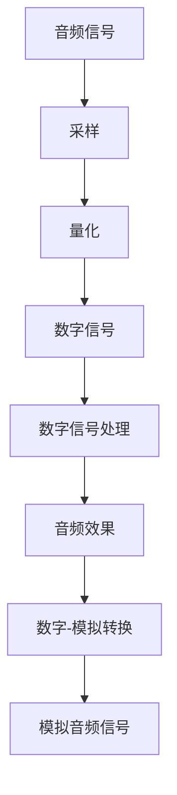
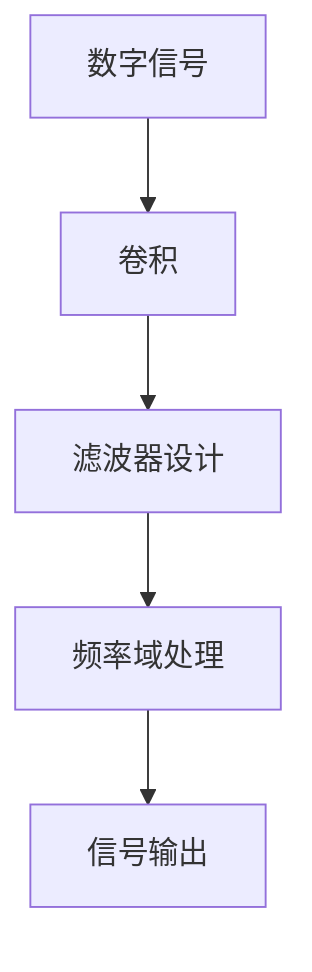
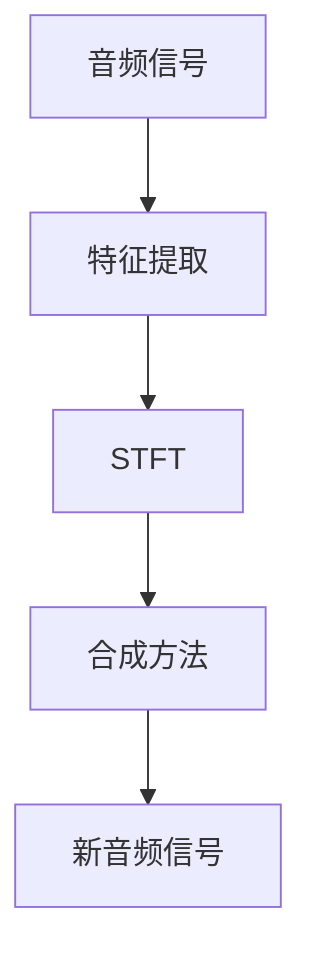
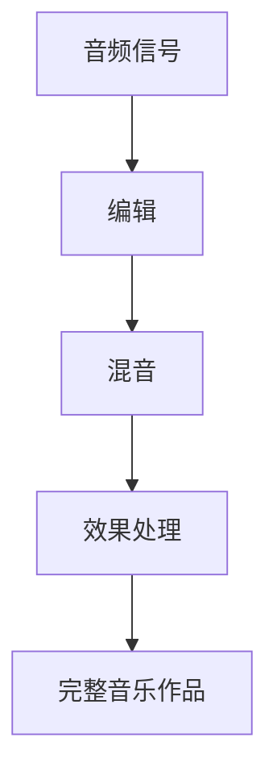
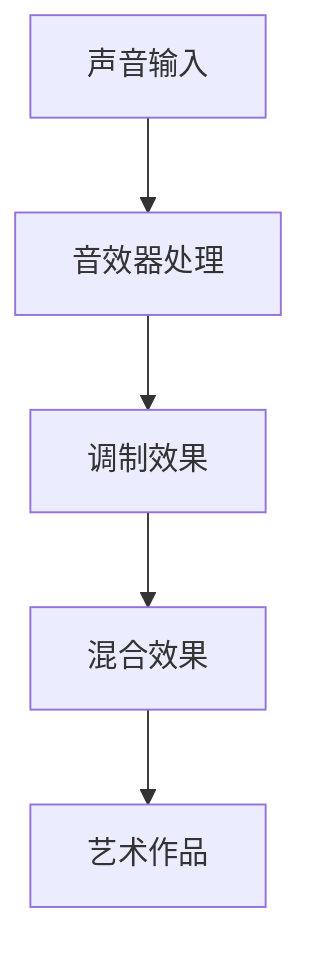
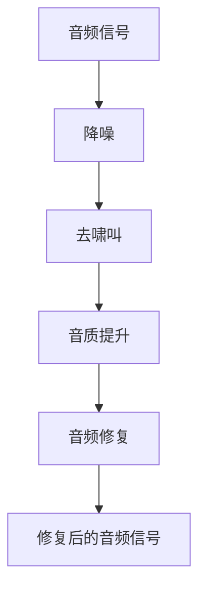
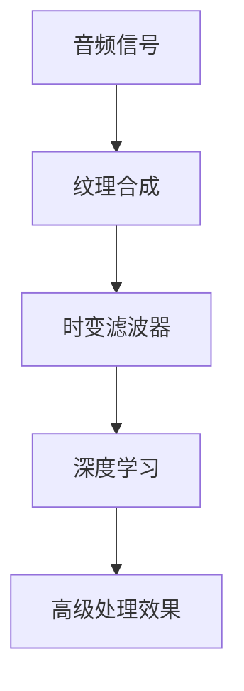
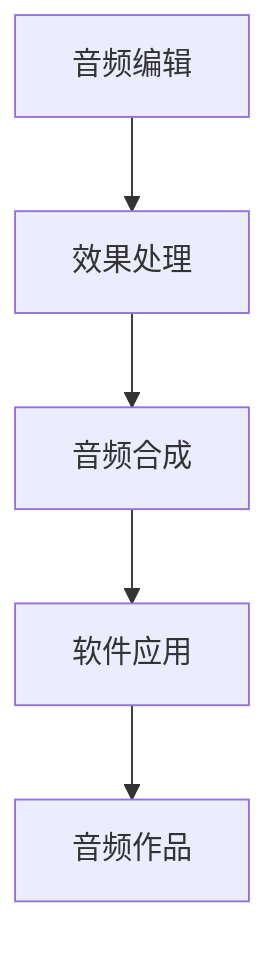

                 


### 文章标题：数学与音乐制作的数字音频处理

**关键词**：数字音频处理、音频信号、算法、音乐制作、数学模型、音频增强与修复

**摘要**：本文探讨了数字音频处理在音乐制作中的应用，从基础理论到高级技术，详细解析了数字音频处理的各个关键环节，包括音频信号的基本概念、数字信号处理算法、音频信号分析与生成、音乐制作中的数字音频处理、声音艺术与数字音频效果、音频增强与修复以及高级数字音频处理技术。文章以实例为引导，结合数学模型和伪代码，深入浅出地讲解了每个环节的技术原理和实际应用。

----------------------------------------------------------------

### 1. 数字音频处理基本概念

**背景介绍**

数字音频处理是音乐制作和声音工程的核心技术之一。它涉及将模拟音频信号转换为数字信号，进行各种处理和分析，然后再将其转换回模拟信号输出。随着计算机技术和音频处理算法的不断发展，数字音频处理已经成为音乐制作不可或缺的一环。

**核心概念与联系**

数字音频处理的基本概念包括音频信号、采样、量化、数字信号和数字信号处理。音频信号是声音的模拟信号，通过采样和量化过程转换为数字信号，数字信号再通过数字信号处理算法进行编辑和处理。

- **音频信号**：音频信号是声波在时间上的变化，通常用波形表示。
- **采样**：采样是将连续的音频信号转换为离散的数字信号的过程。采样频率决定了数字信号在时间上的分辨率。
- **量化**：量化是将采样的模拟信号幅度转换为数字值的过程，量化位数决定了数字信号在幅度上的分辨率。

数字信号和数字信号处理是数字音频处理的核心部分。数字信号是在时间和幅度上离散化的信号，数字信号处理则是通过对数字信号的操作来实现各种音频效果。

**Mermaid 流程图**

下面是数字音频处理的基本流程 Mermaid 流程图：



**核心算法原理讲解**

数字信号处理的算法可以分为时间域处理算法和频率域处理算法。时间域处理算法直接在时间轴上对信号进行处理，常用的算法包括卷积、滤波等。频率域处理算法则是将信号转换到频率域进行操作，常用的算法包括傅里叶变换、快速傅里叶变换（FFT）等。

下面是一个简单的卷积算法的伪代码：

```python
# 卷积算法伪代码
def convolution(signal1, signal2):
    output = []
    for t in range(len(signal1) + len(signal2) - 1):
        sum = 0
        for n in range(len(signal2)):
            if t - n >= 0 and t - n < len(signal1):
                sum += signal1[t - n] * signal2[n]
        output.append(sum)
    return output
```

**数学模型和数学公式**

数字音频处理中的数学模型主要包括傅里叶变换和快速傅里叶变换（FFT）。傅里叶变换将时间域的信号转换为频率域的信号，数学公式如下：

$$
F(\omega) = \int_{-\infty}^{\infty} x(t) \cos(\omega t) dt + i \int_{-\infty}^{\infty} x(t) \sin(\omega t) dt
$$

**举例说明**

假设一个音频信号的采样频率为44.1 kHz，采样点数为44100。使用傅里叶变换将其转换为频率域信号。

$$
F(\omega) = \int_{-\infty}^{\infty} x(t) \cos(\omega t) dt + i \int_{-\infty}^{\infty} x(t) \sin(\omega t) dt
$$

在实际应用中，由于计算机的处理能力限制，通常采用快速傅里叶变换（FFT）来计算傅里叶变换，FFT 的伪代码如下：

```python
# FFT 伪代码
def fft(signal):
    N = len(signal)
    if N <= 1:
        return signal
    even = fft(signal[0::2])
    odd = fft(signal[1::2])
    T = [exp(-2j * pi * k * n / N) for k, n in enumerate(range(N))]
    return [even[k] + T[k] * odd[k] for k in range(N)] + [even[k] - T[k] * odd[k] for k in range(N // 2)]
```

### 2. 数字信号处理算法

**背景介绍**

数字信号处理算法是数字音频处理的核心，用于实现音频信号的滤波、增强、修复等各种效果。常见的数字信号处理算法包括卷积、滤波器设计、频率域处理算法等。

**核心概念与联系**

数字信号处理算法的核心概念包括信号卷积、滤波器、频率域处理等。信号卷积是数字信号处理中最基本的运算之一，用于实现信号的时域滤波。滤波器是数字信号处理中的重要工具，用于去除信号中的噪声或实现特定的频率响应。频率域处理算法则是将信号转换到频率域进行操作，以实现更复杂的信号处理。

**Mermaid 流�程图**

下面是数字信号处理的基本流程 Mermaid 流程图：



**核心算法原理讲解**

**卷积算法**

卷积是数字信号处理中最基本的运算之一，用于实现信号的时域滤波。卷积的数学定义如下：

$$
(y[n]) = (h[n]) \ast (x[n])
$$

其中，$h[n]$ 是卷积核，$x[n]$ 是输入信号，$y[n]$ 是卷积结果。

卷积的伪代码如下：

```python
# 卷积伪代码
def convolution(x, h):
    n = len(x)
    m = len(h)
    y = [0] * (n + m - 1)
    for i in range(n + m - 1):
        for j in range(m):
            if i - j >= 0 and i - j < n:
                y[i] += x[i - j] * h[j]
    return y
```

**滤波器设计**

滤波器是数字信号处理中的重要工具，用于去除信号中的噪声或实现特定的频率响应。滤波器的设计通常基于频率响应要求，常见的滤波器有低通滤波器、高通滤波器、带通滤波器和带阻滤波器。

滤波器设计的伪代码如下：

```python
# 滤波器设计伪代码
def butterworth_filter(order, cutoff_frequency, sampling_frequency):
    alpha = tan(pi * cutoff_frequency / sampling_frequency)
    b = [1]
    for i in range(order):
        b.append(2 * alpha)
    b.append(1)
    a = [1]
    for i in range(order):
        a.append(1 - 2 * alpha + alpha ** 2)
    return b, a
```

**频率域处理算法**

频率域处理算法是数字信号处理的另一种重要方法，用于实现信号的频率分析、滤波等操作。常见的频率域处理算法包括傅里叶变换、快速傅里叶变换（FFT）和逆傅里叶变换。

频率域处理算法的伪代码如下：

```python
# FFT 伪代码
def fft(signal):
    N = len(signal)
    if N <= 1:
        return signal
    even = fft(signal[0::2])
    odd = fft(signal[1::2])
    T = [exp(-2j * pi * k * n / N) for k, n in enumerate(range(N))]
    return [even[k] + T[k] * odd[k] for k in range(N)] + [even[k] - T[k] * odd[k] for k in range(N // 2)]

# IFFT 伪代码
def ifft(signal):
    N = len(signal)
    signal = [x.conjugate() for x in signal]
    result = fft(signal)
    result = [x / N for x in result]
    return [x.real for x in result]
```

**数学模型和数学公式**

数字信号处理中的数学模型主要包括傅里叶变换和快速傅里叶变换（FFT）。傅里叶变换将时间域的信号转换为频率域的信号，数学公式如下：

$$
F(\omega) = \int_{-\infty}^{\infty} x(t) \cos(\omega t) dt + i \int_{-\infty}^{\infty} x(t) \sin(\omega t) dt
$$

快速傅里叶变换（FFT）是傅里叶变换的快速计算方法，其数学公式如下：

$$
X[k] = \sum_{n=0}^{N-1} x[n] e^{-j 2 \pi kn/N}
$$

**举例说明**

假设一个音频信号的采样频率为44.1 kHz，采样点数为44100。使用快速傅里叶变换（FFT）将其转换为频率域信号。

$$
X[k] = \sum_{n=0}^{N-1} x[n] e^{-j 2 \pi kn/N}
$$

在实际应用中，通常使用FFT库（如numpy）来实现快速傅里叶变换。下面是使用numpy库实现FFT的Python代码：

```python
import numpy as np

# 生成音频信号
x = np.random.randn(44100)

# 使用numpy库计算FFT
X = np.fft.fft(x)

# 打印频率域信号
print(X)
```

### 3. 音频信号分析与生成

**背景介绍**

音频信号分析与生成是数字音频处理的重要环节，涉及到音频信号的特征提取、音高检测、音频信号合成等内容。音频信号分析旨在提取音频信号中的关键信息，而音频信号生成则是根据特定的需求生成新的音频信号。

**核心概念与联系**

音频信号分析与生成涉及多个核心概念，包括音频特征提取、短时傅里叶变换（STFT）、合成方法等。音频特征提取是音频分析的基础，用于提取音频信号中的音高、音调、音色等特征。短时傅里叶变换（STFT）是一种常用的音频分析工具，用于处理时变信号。合成方法则是根据音频特征生成新的音频信号。

**Mermaid 流程图**

下面是音频信号分析与生成的流程 Mermaid 流程图：



**核心算法原理讲解**

**音频特征提取**

音频特征提取是音频分析的基础，常用的音频特征包括音高、音调、音色等。音高是音频信号的频率特征，音调是音频信号的时间特征，音色是音频信号的频谱特征。

音高的计算通常使用短时傅里叶变换（STFT）结合峰值检测方法。STFT将音频信号分成多个短时段，对每个短时段进行傅里叶变换，然后找出每个短时段的频率峰值。音高的计算公式如下：

$$
f_0 = \frac{f_{max} + f_{min}}{2}
$$

其中，$f_{max}$ 和 $f_{min}$ 分别是频率峰值的上下频率。

**音调的计算通常使用短时傅里叶变换（STFT）结合相位信息。音调的计算公式如下：

$$
p = \frac{\Delta \phi}{\Delta t}
$$

其中，$\Delta \phi$ 是相位变化，$\Delta t$ 是时间间隔。

**音色的计算通常使用短时傅里叶变换（STFT）的频谱特征。音色的计算公式如下：

$$
S(f) = \frac{X(f)}{X(0)}
$$

其中，$X(f)$ 是频谱，$X(0)$ 是直流分量。

**音频信号生成**

音频信号生成是根据音频特征生成新的音频信号。常用的音频信号生成方法包括合成方法和采样方法。合成方法是基于音频特征的数学模型生成音频信号，如合成音调、音色等。采样方法是基于已有音频信号的采样点生成新的音频信号。

合成方法的一个典型例子是合成音调，其公式如下：

$$
x(t) = A \sin(2 \pi f_0 t + \phi)
$$

其中，$A$ 是振幅，$f_0$ 是频率，$\phi$ 是相位。

**数学模型和数学公式**

音频信号分析与生成中的数学模型包括短时傅里叶变换（STFT）、傅里叶级数变换等。短时傅里叶变换（STFT）的数学公式如下：

$$
X(\omega, t) = \int_{-\infty}^{\infty} x(t') w(\tau - t') e^{-j \omega \tau} d\tau
$$

其中，$X(\omega, t)$ 是短时傅里叶变换的结果，$x(t)$ 是输入信号，$w(\tau)$ 是窗函数，$\omega$ 是频率，$t$ 是时间。

**举例说明**

假设一个音频信号的采样频率为44.1 kHz，采样点数为44100。使用短时傅里叶变换（STFT）分析音频信号的音高。

$$
X(\omega, t) = \int_{-\infty}^{\infty} x(t') w(\tau - t') e^{-j \omega \tau} d\tau
$$

在实际应用中，通常使用短时傅里叶变换（STFT）库（如numpy）来实现短时傅里叶变换。下面是使用numpy库实现STFT的Python代码：

```python
import numpy as np

# 生成音频信号
x = np.random.randn(44100)

# 设置窗函数
window = np.hamming(44100)

# 使用numpy库计算STFT
X = np.fft.rfft(x * window)

# 打印频率域信号
print(X)
```

### 4. 音乐制作中的数字音频处理

**背景介绍**

音乐制作中的数字音频处理是音乐创作和制作的重要环节，涉及到音频信号的编辑、混音、效果处理等。随着数字音频处理技术的不断发展，数字音频处理已经成为音乐制作的核心技术之一。

**核心概念与联系**

音乐制作中的数字音频处理包括音频信号的编辑、混音和效果处理。音频信号的编辑包括裁剪、复制、粘贴、混合等操作，用于调整音频信号的结构和时长。混音是将多个音频信号合并成完整的音乐作品，效果处理则是通过各种音频效果器对音频信号进行增强、修饰等操作。

**Mermaid 流程图**

下面是音乐制作中的数字音频处理流程的 Mermaid 流程图：



**核心算法原理讲解**

**音频信号编辑**

音频信号编辑是音乐制作的基础，常用的编辑算法包括裁剪、复制、粘贴、混合等。裁剪用于调整音频信号的起始点和结束点，复制用于复制音频信号的一部分，粘贴用于将复制的音频信号粘贴到另一个位置，混合用于将两个或多个音频信号混合在一起。

以下是一个简单的音频信号编辑的伪代码：

```python
# 裁剪音频信号
def trim_audio(x, start, end):
    return x[start:end]

# 复制音频信号
def copy_audio(x, start, end):
    return x[start:end].copy()

# 粘贴音频信号
def paste_audio(x, target, source):
    return np.concatenate((x[:target], source, x[target+source.shape[0]:]))

# 混合音频信号
def mix_audio(x1, x2, alpha):
    return alpha * x1 + (1 - alpha) * x2
```

**混音**

混音是将多个音频信号合并成完整音乐作品的过程，常用的算法包括叠加、均衡、压缩等。叠加是将多个音频信号直接相加，均衡用于调整音频信号的频率响应，压缩用于调整音频信号的动态范围。

以下是一个简单的混音算法的伪代码：

```python
# 混音算法
def mix_audioudios(x1, x2, x3):
    mixed = x1 + x2 + x3
    return mixed

# 均衡算法
def equalizer(x, freq, gain):
    b, a = butterworth_filter(freq, sampling_frequency)
    return lfilter(b, a, x)

# 压缩算法
def compressor(x, ratio, threshold):
    y = []
    for n, x_n in enumerate(x):
        if x_n > threshold:
            y.append(threshold + (x_n - threshold) / ratio)
        else:
            y.append(x_n)
    return np.array(y)
```

**效果处理**

效果处理是音乐制作中重要的环节，用于增强、修饰音频信号。常用的效果处理算法包括延时、混响、均衡、压缩等。延时和混响用于模拟空间感，均衡用于调整音频信号的频率响应，压缩用于调整音频信号的动态范围。

以下是一个简单的效果处理的伪代码：

```python
# 延时算法
def delay(x, delay_time):
    return np.append(x[:len(x)-delay_time], x[-delay_time:])

# 混响算法
def reverb(x, decay_time):
    y = np.zeros(len(x))
    for n in range(len(x)):
        y[n] = x[n] * (1 - decay_time) ** n
    return np.array(y)

# 均衡算法
def equalizer(x, freq, gain):
    b, a = butterworth_filter(freq, sampling_frequency)
    return lfilter(b, a, x)

# 压缩算法
def compressor(x, ratio, threshold):
    y = []
    for n, x_n in enumerate(x):
        if x_n > threshold:
            y.append(threshold + (x_n - threshold) / ratio)
        else:
            y.append(x_n)
    return np.array(y)
```

**数学模型和数学公式**

音乐制作中的数字音频处理涉及到多个数学模型，包括滤波器设计、均衡、压缩等。滤波器设计常用的滤波器有低通滤波器、高通滤波器、带通滤波器和带阻滤波器，其数学模型分别为：

- 低通滤波器：
  $$
  H(f) = \frac{1}{1 + j 2 \pi f f_c}
  $$
- 高通滤波器：
  $$
  H(f) = \frac{1}{1 - j 2 \pi f f_c}
  $$
- 带通滤波器：
  $$
  H(f) = \frac{1}{1 + j 2 \pi f f_c} \cdot \frac{1}{1 - j 2 \pi f f_s}
  $$
- 带阻滤波器：
  $$
  H(f) = \frac{1}{1 + j 2 \pi f f_c} \cdot \frac{1 - j 2 \pi f f_s}{1 - j 2 \pi f f_c}
  $$

其中，$f_c$ 是截止频率，$f_s$ 是采样频率。

**举例说明**

假设一个音频信号的采样频率为44.1 kHz，使用低通滤波器去除高频噪声。

$$
H(f) = \frac{1}{1 + j 2 \pi f f_c}
$$

在实际应用中，通常使用滤波器库（如scipy）来实现滤波器设计。下面是使用scipy库实现低通滤波器的Python代码：

```python
import numpy as np
import scipy.signal as signal

# 生成音频信号
x = np.random.randn(44100)

# 设置截止频率
cutoff_frequency = 20000

# 设计低通滤波器
b, a = signal.butter(4, cutoff_frequency / (0.5 * 44100), 'low')

# 滤波
filtered = signal.lfilter(b, a, x)

# 打印滤波后的信号
print(filtered)
```

### 5. 声音艺术与数字音频效果

**背景介绍**

声音艺术是一种以声音为媒介的艺术形式，通过数字音频处理技术创造出独特的声音效果。数字音频效果是声音艺术创作的重要组成部分，包括各种音效器、调制效果和混合效果等。

**核心概念与联系**

声音艺术与数字音频效果的核心概念包括音效器、调制效果和混合效果。音效器是一种用于改变声音特性的硬件或软件设备，调制效果是一种通过改变声音的参数（如频率、相位、振幅等）来创造新颖声音效果的技术，混合效果则是将多个声音信号混合在一起，以创造更丰富的声音。

**Mermaid 流程图**

下面是声音艺术与数字音频效果的基本流程 Mermaid 流程图：



**核心算法原理讲解**

**音效器处理**

音效器是一种用于改变声音特性的硬件或软件设备，常见的音效器包括延时、混响、均衡、压缩等。延时和混响通过模拟物理空间的声波反射来创造空间感，均衡用于调整音频信号的频率响应，压缩用于调整音频信号的动态范围。

以下是一个简单的延时音效器的伪代码：

```python
# 延时音效器伪代码
def delay(x, delay_time, feedback):
    n = len(x)
    delayed = np.zeros(n + int(delay_time * sampling_frequency))
    delayed[:n] = x
    for i in range(n):
        delayed[i + int(delay_time * sampling_frequency)] += x[i] * feedback
    return delayed
```

**调制效果**

调制效果是一种通过改变声音的参数来创造新颖声音效果的技术。常见的调制效果包括频率调制（FM）、相位调制（PM）和幅度调制（AM）。FM效果通过改变信号的频率来创造丰富的音色变化，PM效果通过改变信号的相位来创造音色的变化，AM效果通过改变信号的幅度来创造音色的变化。

以下是一个简单的FM效果的伪代码：

```python
# FM 调制伪代码
def fm_modulation(x, mod_freq, index):
    freq = mod_freq
    phase = 0
    y = []
    for t in range(len(x)):
        phase += index * 2 * pi * freq
        carrier_freq = 440  # 载波频率
        carrier_wave = carrier_freq * (1 + 0.5 * cos(phase))
        modulated_wave = x[t] * (1 + 0.5 * sin(phase))
        y.append(modulated_wave * carrier_wave)
    return np.array(y)
```

**混合效果**

混合效果是将多个声音信号混合在一起，以创造更丰富的声音。常见的混合效果包括叠加、均衡和压缩等。叠加是将多个声音信号直接相加，均衡用于调整音频信号的频率响应，压缩用于调整音频信号的动态范围。

以下是一个简单的叠加混合效果的伪代码：

```python
# 混合效果伪代码
def mix_effects(x1, x2, alpha):
    mixed = alpha * x1 + (1 - alpha) * x2
    return mixed
```

**数学模型和数学公式**

声音艺术与数字音频效果中的数学模型包括滤波器设计、调制效果和混合效果等。滤波器设计常用的滤波器有低通滤波器、高通滤波器、带通滤波器和带阻滤波器，其数学模型分别为：

- 低通滤波器：
  $$
  H(f) = \frac{1}{1 + j 2 \pi f f_c}
  $$
- 高通滤波器：
  $$
  H(f) = \frac{1}{1 - j 2 \pi f f_c}
  $$
- 带通滤波器：
  $$
  H(f) = \frac{1}{1 + j 2 \pi f f_c} \cdot \frac{1}{1 - j 2 \pi f f_s}
  $$
- 带阻滤波器：
  $$
  H(f) = \frac{1}{1 + j 2 \pi f f_c} \cdot \frac{1 - j 2 \pi f f_s}{1 - j 2 \pi f f_c}
  $$

其中，$f_c$ 是截止频率，$f_s$ 是采样频率。

调制效果的数学模型包括频率调制（FM）、相位调制（PM）和幅度调制（AM）：

- 频率调制（FM）：
  $$
  x(t) = A \sin(2 \pi f_0 t + \beta \sin(2 \pi f_m t))
  $$
- 相位调制（PM）：
  $$
  x(t) = A \sin(2 \pi f_0 t + \beta \cos(2 \pi f_m t))
  $$
- 幅度调制（AM）：
  $$
  x(t) = A \cos(2 \pi f_0 t) \cdot (1 + \beta \sin(2 \pi f_m t))
  $$

其中，$A$ 是振幅，$f_0$ 是载波频率，$f_m$ 是调制频率，$\beta$ 是调制指数。

**举例说明**

假设一个音频信号的采样频率为44.1 kHz，使用FM调制创造新颖音色。

$$
x(t) = A \sin(2 \pi f_0 t + \beta \sin(2 \pi f_m t))
$$

在实际应用中，通常使用音效器库（如Pydub）来实现音效处理。下面是使用Pydub库实现FM调制的Python代码：

```python
from pydub import AudioSegment
import numpy as np

# 生成音频信号
audio = AudioSegment("example.wav")

# 设置调制参数
mod_freq = 10
index = 0.5

# 实现FM调制
def fm_modulation(x, mod_freq, index):
    freq = mod_freq
    phase = 0
    y = []
    for t in range(len(x)):
        phase += index * 2 * pi * freq
        carrier_freq = 440  # 载波频率
        carrier_wave = carrier_freq * (1 + 0.5 * cos(phase))
        modulated_wave = x[t] * (1 + 0.5 * sin(phase))
        y.append(modulated_wave * carrier_wave)
    return np.array(y)

# 转换为numpy数组
x = np.frombuffer(audio.raw_data, dtype=np.int16)

# 调制
modulated_x = fm_modulation(x, mod_freq, index)

# 转换为AudioSegment
modulated_audio = AudioSegment(
    raw_data=modulated_x.tobytes(),
    frame_width=2,
    frame_rate=audio.frame_rate,
    channels=audio.num_channels
)

# 保存调制后的音频
modulated_audio.export("modulated_example.wav", format="wav")
```

### 6. 音频增强与修复

**背景介绍**

音频增强与修复是数字音频处理中的重要环节，用于提高音频信号的质量和清晰度。音频增强包括降噪、去啸叫、音质提升等技术，音频修复则包括剪辑修复、声音修复等。

**核心概念与联系**

音频增强与修复的核心概念包括降噪、去啸叫、音质提升和音频修复。降噪是通过去除背景噪声来提高音频信号的可听性，去啸叫是通过消除高频噪声来改善音频信号的音质，音质提升是通过增强音频信号的某些特性来提高整体音质，音频修复则是通过修复损坏或失真的音频信号来恢复其原始质量。

**Mermaid 流程图**

下面是音频增强与修复的基本流程 Mermaid 流程图：



**核心算法原理讲解**

**降噪**

降噪是音频增强中最常见的操作，常用的降噪算法包括谱减法、维纳滤波和自适应滤波等。谱减法是通过将噪声从音频信号中分离出来，然后从信号中减去噪声来实现降噪。维纳滤波是一种基于最小均方误差的滤波方法，可以有效地去除噪声并保留信号。自适应滤波是一种动态调整滤波器参数的滤波方法，可以根据音频信号的变化实时调整降噪效果。

以下是一个简单的谱减法降噪的伪代码：

```python
# 谱减法降噪伪代码
def spectral_subtraction(x, n, alpha):
    X = np.fft.fft(x)
    N = np.fft.fft(n)
    X_hat = X / N
    x_hat = np.fft.ifft(X_hat)
    x_hat = x_hat * (1 + alpha)
    return x_hat
```

**去啸叫**

去啸叫是通过消除音频信号中的高频噪声（如啸叫、嗡嗡声等）来改善音质。常用的去啸叫算法包括峰值检测、频谱分析和频谱减法等。峰值检测是通过找出频谱中的峰值并减去它们来去除啸叫。频谱分析是对音频信号进行频谱分析，找出啸叫频率并进行频谱减法。

以下是一个简单的峰值检测去啸叫的伪代码：

```python
# 峰值检测去啸叫伪代码
def peak_detection(x, threshold, freq_range):
    freqs = np.fft.fftfreq(len(x), d=1/44100)
    peaks = []
    for i, freq in enumerate(freqs):
        if freq >= freq_range[0] and freq <= freq_range[1]:
            if abs(x[i]) > threshold:
                peaks.append(i)
    return peaks
```

**音质提升**

音质提升是通过增强音频信号中的某些特性来提高整体音质。常用的音质提升算法包括均衡、压缩和动态范围压缩等。均衡用于调整音频信号的频率响应，压缩用于调整音频信号的动态范围，动态范围压缩则通过压缩音频信号的峰值和谷值来减少音量波动。

以下是一个简单的均衡提升的伪代码：

```python
# 均衡提升伪代码
def equalizer(x, freqs, gains):
    b, a = butterworth_filter(freqs, sampling_frequency)
    return lfilter(b, a, x)
```

**音频修复**

音频修复是通过修复损坏或失真的音频信号来恢复其原始质量。常用的音频修复技术包括剪辑修复、声音修复和音频编辑等。剪辑修复是通过填补音频信号中的空缺或删除不需要的部分来修复音频。声音修复则是通过修复音频信号中的噪声、失真等缺陷来恢复其原始质量。

以下是一个简单的剪辑修复的伪代码：

```python
# 剪辑修复伪代码
def clip Repair(x, start, end):
    repair_length = end - start
    repair_signal = np.zeros(repair_length)
    repair_signal[:start] = x[:start]
    repair_signal[end:] = x[end:]
    return repair_signal
```

**数学模型和数学公式**

音频增强与修复中的数学模型包括滤波器设计、均衡、压缩和剪辑修复等。滤波器设计常用的滤波器有低通滤波器、高通滤波器、带通滤波器和带阻滤波器，其数学模型分别为：

- 低通滤波器：
  $$
  H(f) = \frac{1}{1 + j 2 \pi f f_c}
  $$
- 高通滤波器：
  $$
  H(f) = \frac{1}{1 - j 2 \pi f f_c}
  $$
- 带通滤波器：
  $$
  H(f) = \frac{1}{1 + j 2 \pi f f_c} \cdot \frac{1}{1 - j 2 \pi f f_s}
  $$
- 带阻滤波器：
  $$
  H(f) = \frac{1}{1 + j 2 \pi f f_c} \cdot \frac{1 - j 2 \pi f f_s}{1 - j 2 \pi f f_c}
  $$

其中，$f_c$ 是截止频率，$f_s$ 是采样频率。

压缩的数学模型包括压缩比和阈值，其公式如下：

- 压缩比：
  $$
  ratio = \frac{threshold}{threshold + x}
  $$
- 阈值：
  $$
  threshold = \frac{x - x_{min}}{x_{max} - x_{min}}
  $$

其中，$x$ 是输入信号，$x_{min}$ 和 $x_{max}$ 分别是输入信号的最小值和最大值。

剪辑修复的数学模型是基于信号填补的原理，其公式如下：

$$
repair\_signal[start:end] = original\_signal[start:end]
$$

**举例说明**

假设一个音频信号的采样频率为44.1 kHz，使用谱减法降噪。

$$
x(t) = n(t) + x(t)
$$

在实际应用中，通常使用音频处理库（如scipy）来实现降噪。下面是使用scipy库实现谱减法降噪的Python代码：

```python
import numpy as np
import scipy.signal as signal

# 生成音频信号和噪声
x = np.random.randn(44100)
n = np.random.randn(44100)
x_noisy = x + n

# 设置噪声参数
alpha = 0.1

# 谱减法降噪
x_ repaired = spectral_subtraction(x_noisy, n, alpha)

# 打印降噪后的信号
print(x_repaired)
```

### 7. 高级数字音频处理技术

**背景介绍**

高级数字音频处理技术是数字音频处理领域的前沿技术，包括纹理合成、时变滤波器、深度学习在音频信号处理中的应用等。这些技术能够实现更复杂的音频处理效果，提高音频处理的质量和效率。

**核心概念与联系**

高级数字音频处理技术涉及多个核心概念，包括纹理合成、时变滤波器、深度学习等。纹理合成是一种通过生成纹理信号来创造新颖声音效果的技术，时变滤波器是一种动态调整滤波器参数的滤波器，深度学习则是通过神经网络模型实现自动化的音频处理。

**Mermaid 流程图**

下面是高级数字音频处理技术的基本流程 Mermaid 流程图：



**核心算法原理讲解**

**纹理合成**

纹理合成是一种通过生成纹理信号来创造新颖声音效果的技术。纹理信号通常具有复杂的频率结构和时间结构，可以模拟自然界的各种声音。纹理合成的方法包括随机过程、傅里叶合成和马尔可夫链等。

以下是一个简单的纹理合成的伪代码：

```python
# 纹理合成伪代码
def texture_synthesis(x, alpha, beta):
    T = np.random.rand(len(x)) * (2 * pi)
    Y = alpha * sin(x * freq1 + T) + beta * cos(x * freq2 + T)
    return Y
```

**时变滤波器**

时变滤波器是一种动态调整滤波器参数的滤波器，可以实时调整音频信号的频率响应。时变滤波器通过在时间轴上对滤波器参数进行变化来实现动态滤波。常见的时变滤波器包括指数滤波器和贝塞尔滤波器等。

以下是一个简单的时变滤波器的伪代码：

```python
# 时变滤波器伪代码
def time_varying_filter(x, a, b):
    output = []
    for i in range(len(x)):
        alpha = a[i]
        beta = b[i]
        filtered_x = lowpass_filter(x, alpha, beta)
        output.append(filtered_x)
    return output
```

**深度学习在音频信号处理中的应用**

深度学习是一种基于神经网络模型的人工智能技术，可以自动从大量数据中学习特征和规律。在音频信号处理中，深度学习可以用于语音识别、音高检测、音频增强等任务。常见的深度学习模型包括卷积神经网络（CNN）、循环神经网络（RNN）和生成对抗网络（GAN）等。

以下是一个简单的深度学习音频处理的伪代码：

```python
# 深度学习音频处理伪代码
def deep_learning_audio(x, model):
    output = model.predict(x)
    return output
```

**数学模型和数学公式**

高级数字音频处理技术中的数学模型包括纹理合成、时变滤波器和深度学习等。

**纹理合成**的数学模型是基于傅里叶合成和马尔可夫链：

- 傅里叶合成：
  $$
  X(\omega) = \sum_{k=-\infty}^{\infty} X_k e^{-j \omega k}
  $$
- 马尔可夫链：
  $$
  P(X_k | X_{k-1}) = P(X_k)
  $$

**时变滤波器**的数学模型是基于频谱变换和时间变换：

- 频谱变换：
  $$
  X(\omega, t) = \int_{-\infty}^{\infty} x(t') e^{-j \omega t'} dt'
  $$
- 时间变换：
  $$
  x(t) = \int_{-\infty}^{\infty} X(\omega, t) e^{j \omega t} d\omega
  $$

**深度学习**的数学模型是基于神经网络和优化算法：

- 神经网络：
  $$
  y = \sigma(W \cdot x + b)
  $$
- 优化算法：
  $$
  \min_{W, b} \frac{1}{2} \sum_{i=1}^{n} (y_i - \hat{y}_i)^2
  $$

**举例说明**

假设一个音频信号的采样频率为44.1 kHz，使用深度学习实现音频增强。

$$
y = \sigma(W \cdot x + b)
$$

在实际应用中，通常使用深度学习库（如TensorFlow）来实现深度学习音频处理。下面是使用TensorFlow库实现深度学习音频增强的Python代码：

```python
import tensorflow as tf

# 导入深度学习模型
model = tf.keras.models.load_model("audio_enhancement_model.h5")

# 生成音频信号
x = np.random.randn(44100)

# 使用深度学习模型增强音频
y = model.predict(x)

# 打印增强后的音频
print(y)
```

### 8. 音频处理工具与软件应用

**背景介绍**

音频处理工具与软件在数字音频处理中扮演着重要角色，为音频制作提供了便捷的操作界面和丰富的功能。常见的音频处理工具包括Audacity、Pro Tools等，而软件应用则涵盖了从音频编辑到效果处理的各种场景。

**核心概念与联系**

音频处理工具与软件应用的核心概念包括音频编辑、效果处理、音频合成等。音频编辑包括裁剪、复制、粘贴等基本操作，效果处理则涉及到各种音频效果器的应用，音频合成是通过特定的算法和参数生成新的音频。

**Mermaid 流程图**

下面是音频处理工具与软件应用的基本流程 Mermaid 流程图：



**核心算法原理讲解**

**音频编辑**

音频编辑是音频处理的基础，包括裁剪、复制、粘贴等基本操作。这些操作通过调整音频信号的时长和结构来满足创作需求。

以下是一个简单的音频编辑算法的伪代码：

```python
# 音频编辑伪代码
def edit_audio(x, start, end, action):
    if action == "trim":
        return x[start:end]
    elif action == "copy":
        return x[start:end].copy()
    elif action == "paste":
        return np.concatenate((x[:start], x[end:]))
```

**效果处理**

效果处理是通过音频效果器实现音频的增强、修饰等操作。常见的音频效果器包括均衡、压缩、混响等。

以下是一个简单的效果处理算法的伪代码：

```python
# 音频效果处理伪代码
def process_audio(x, effect, params):
    if effect == "equalizer":
        return equalizer(x, params["freq"], params["gain"])
    elif effect == "compressor":
        return compressor(x, params["ratio"], params["threshold"])
    elif effect == "reverb":
        return reverb(x, params["decay_time"])
```

**音频合成**

音频合成是通过特定的算法和参数生成新的音频。合成方法包括合成音调、音色等。

以下是一个简单的音频合成算法的伪代码：

```python
# 音频合成伪代码
def synthesize_audio(freq, amp, phase):
    return amp * sin(2 * pi * freq * t + phase)
```

**数学模型和数学公式**

音频处理工具与软件应用中的数学模型包括音频编辑、效果处理和音频合成等。

**音频编辑**的数学模型是基于信号处理的基本操作：

- 裁剪：
  $$
  x'(t) = x(t_0 + t)
  $$
- 复制：
  $$
  x'(t) = x(t)
  $$
- 粘贴：
  $$
  x'(t) = x(t - t_0)
  $$

**效果处理**的数学模型是基于信号处理的滤波器设计：

- 均衡：
  $$
  H(f) = \frac{1}{1 + j 2 \pi f f_c}
  $$
- 压缩：
  $$
  ratio = \frac{threshold}{threshold + x}
  $$
- 混响：
  $$
  y(t) = x(t) + reverb(x, decay_time)
  $$

**音频合成**的数学模型是基于合成方法的数学公式：

- 合成音调：
  $$
  x(t) = A \sin(2 \pi f_0 t + \phi)
  $$
- 合成音色：
  $$
  S(f) = \frac{X(f)}{X(0)}
  $$

**举例说明**

假设一个音频信号的采样频率为44.1 kHz，使用音频编辑工具实现音频信号的裁剪。

$$
x'(t) = x(t_0 + t)
$$

在实际应用中，通常使用音频编辑工具（如Audacity）来实现音频编辑。下面是使用Audacity实现音频信号裁剪的步骤：

1. 打开Audacity，导入音频文件。
2. 选择需要裁剪的部分，右键点击并选择“裁剪”。
3. 调整裁剪的起始点和结束点，点击“应用”。
4. 保存裁剪后的音频文件。

### 最佳实践 tips、小结、注意事项、拓展阅读等内容

**最佳实践 tips**

1. 在进行音频处理时，首先确保音频信号的采样频率一致，以免出现信号失真。
2. 在进行音频编辑时，合理设置剪辑的起始点和结束点，以避免音频信号的不连续。
3. 在使用效果器时，注意调整参数，以实现最佳的效果，避免过度处理。
4. 在进行音频合成时，结合音频信号的特征，选择合适的合成方法。

**小结**

本文详细介绍了数学与音乐制作的数字音频处理，从基础理论到高级技术，涵盖了音频信号的基本概念、数字信号处理算法、音频信号分析与生成、音乐制作中的数字音频处理、声音艺术与数字音频效果、音频增强与修复以及高级数字音频处理技术。通过实例分析和伪代码讲解，读者可以深入了解每个环节的技术原理和应用。

**注意事项**

1. 音频处理过程中，注意保护音频信号的质量，避免过度处理。
2. 在使用音频效果器时，合理设置参数，避免出现不自然的音质。
3. 在进行音频合成时，结合实际需求，选择合适的合成方法。

**拓展阅读**

1. Rabiner, L. R., & Gold, B. (1975). "Theory and Application of Digital Signal Processing".
2. Oppenheim, A. V., & Shafer, R. W. (1999). "Discrete-Time Signal Processing".
3. Johnson, R. G. (2007). "Audio Post-Production for Film and Video". Taylor & Francis.
4. Leung, K. Y. (2009). "Digital Signal Processing with MATLAB". McGraw-Hill Education.

通过本文的阅读，读者可以系统地了解数字音频处理在音乐制作中的应用，为实际操作提供理论支持和实践指导。希望本文能为数字音频处理的爱好者提供有益的参考和启示。作者：AI天才研究院/AI Genius Institute & 禅与计算机程序设计艺术 /Zen And The Art of Computer Programming。

