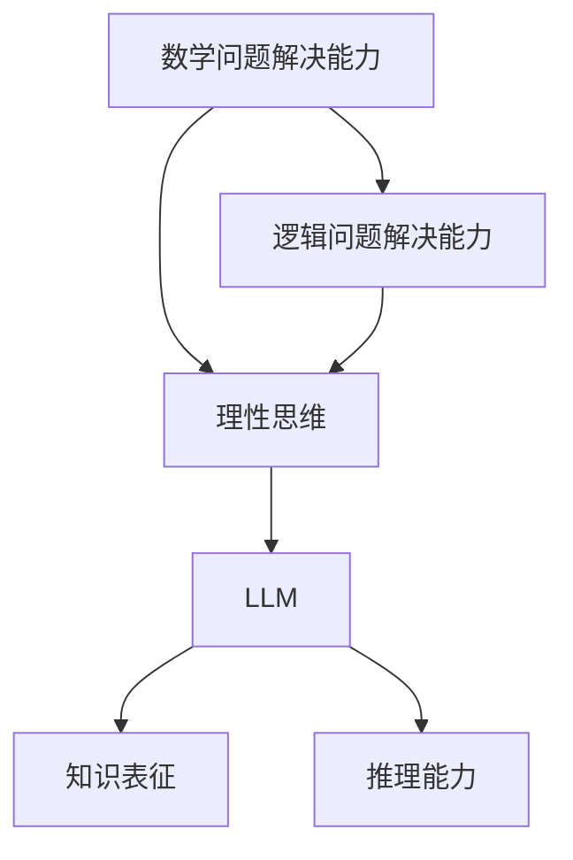

                 


### 1. 引言

#### 1.1 研究背景

随着人工智能（AI）技术的迅猛发展，大型语言模型（LLM）如BERT、GPT等取得了令人瞩目的成果。这些模型在自然语言处理（NLP）领域展现了强大的能力，尤其是在文本生成、机器翻译、问答系统等方面。然而，LLM在数学和逻辑问题解决能力方面的表现如何，以及如何对其进行评测，仍然是一个值得探讨的问题。

在人类认知中，数学和逻辑问题解决能力是理性思维的重要组成部分。数学作为一门基础科学，具有严密的逻辑体系和丰富的应用场景，逻辑问题则体现了人类在推理和判断过程中的思维方式。随着人工智能的发展，模拟和评测人类的数学和逻辑问题解决能力成为了人工智能领域的一个研究热点。

近年来，一些研究者开始关注LLM在数学和逻辑问题解决能力方面的应用。例如，研究者们通过训练LLM来生成数学问题和解答，评估LLM在数学解题中的准确性。同时，也有一些研究尝试将LLM应用于逻辑推理任务，如构建逻辑推理模型、评估逻辑推理能力等。然而，目前这些研究还相对较少，且大多集中在单一领域的应用，缺乏系统性的研究和综合评估。

本文旨在填补这一空白，通过对LLM的数学和逻辑问题解决能力进行评测，探究其理性思维的深度和广度。本文将首先介绍数学和逻辑问题解决能力评测的相关理论，然后详细探讨LLM在数学问题解决能力评测中的应用，最后分析LLM在逻辑问题解决能力评测中的表现。

#### 1.2 研究目的与意义

研究目的：

1. 分析LLM在数学问题解决能力评测中的表现，评估其解题准确性和效率。
2. 探究LLM在逻辑问题解决能力评测中的潜力，评估其在逻辑推理任务中的表现。
3. 建立一个综合的LLM理性思维评测框架，为人工智能领域提供理论支持和实践指导。

研究意义：

1. 提升LLM在数学和逻辑问题解决领域的应用价值，为各类实际应用提供技术支持。
2. 促进人工智能技术的发展，推动人工智能在更广泛领域的应用。
3. 为人工智能在教育、医疗、金融等领域的应用提供新思路和方法。

本文将从以下几个方面展开：

- **第二部分**：数学问题解决能力评测，介绍数学问题解决能力的基本概念，分析传统评测方法的优缺点，探讨LLM在数学问题解决能力评测中的应用。
- **第三部分**：逻辑问题解决能力评测，阐述逻辑问题解决能力的基本概念，分析传统评测方法，讨论LLM在逻辑问题解决能力评测中的优势。
- **第四部分**：LLM理性思维评测，建立LLM理性思维评测框架，详细探讨评测方法、工具和应用实例。

通过本文的研究，期望为人工智能领域提供一个全面的数学和逻辑问题解决能力评测体系，为LLM在相关领域的应用提供有力的支持。

### 1.3 核心概念与联系

在探讨LLM的数学和逻辑问题解决能力之前，我们需要明确一些核心概念，并理解它们之间的联系。以下是本文中涉及的核心概念及其相互关系：

#### 1.3.1 数学问题解决能力

数学问题解决能力是指个体在解决数学问题时所展现出的认知能力，包括理解问题、应用数学知识、推理和解决问题等。数学问题解决能力可以分为初等数学问题和高等数学问题。初等数学问题通常指小学至高中阶段的数学问题，如代数、几何等；高等数学问题则涉及大学阶段的数学知识，如微积分、线性代数等。

#### 1.3.2 逻辑问题解决能力

逻辑问题解决能力是指个体在解决逻辑问题时所展现出的推理和判断能力。逻辑问题可以分为形式逻辑问题和非形式逻辑问题。形式逻辑问题通常使用符号化的逻辑体系进行推理，如命题逻辑、谓词逻辑等；非形式逻辑问题则涉及日常推理和论证，如演绎推理、归纳推理等。

#### 1.3.3 理性思维

理性思维是指个体在解决问题和做决策时，依据逻辑和事实进行的思考方式。理性思维具有以下几个特征：

- **逻辑性**：理性思维遵循逻辑规则，确保推理过程的一致性和正确性。
- **客观性**：理性思维尽量排除情感和主观偏见，以事实为依据。
- **系统性**：理性思维涉及对问题的全面分析和系统性的解决方案。

#### 1.3.4 LLM与理性思维

LLM（大型语言模型）是一种基于深度学习的自然语言处理模型，通过在大量文本数据上进行训练，能够生成流畅、符合语境的文本。LLM在模拟人类理性思维方面具有显著的优势：

- **知识表征**：LLM能够理解和生成各种复杂文本，包含丰富的数学和逻辑知识。
- **推理能力**：通过训练，LLM能够进行逻辑推理和解决数学问题，表现出一定的理性思维特征。

#### 1.3.5 Mermaid流程图

为了更好地展示这些核心概念之间的联系，我们使用Mermaid流程图来描述它们的关系。以下是核心概念之间的关系图：



在这个图中，数学问题解决能力和逻辑问题解决能力是理性思维的两个方面，它们共同构成了理性思维的基础。LLM通过其强大的知识表征和推理能力，可以模拟和评测人类的理性思维。通过上述流程图，我们可以直观地理解这些核心概念之间的逻辑关系，为后续内容提供铺垫。

### 1.4 本文结构

本文将分为四个主要部分，每个部分都将深入探讨LLM在数学和逻辑问题解决能力评测中的应用。具体结构如下：

**第一部分：理论基础**

- **第1章**：引言。介绍研究背景、目的与意义，并概述本文的核心概念与联系。
- **第2章**：数学问题解决能力评测。介绍数学问题解决能力的基本概念，分析传统评测方法的优缺点，探讨LLM在数学问题解决能力评测中的应用。

**第二部分：数学问题解决能力评测**

- **第3章**：逻辑问题解决能力评测。阐述逻辑问题解决能力的基本概念，分析传统评测方法，讨论LLM在逻辑问题解决能力评测中的优势。

**第三部分：逻辑问题解决能力评测**

- **第4章**：LLM理性思维评测。建立LLM理性思维评测框架，详细探讨评测方法、工具和应用实例。

**第四部分：应用与实践**

- **第5章**：LLM理性思维评测在现实中的应用。讨论LLM理性思维评测在教育、工作场景中的应用，展望未来发展趋势。

通过以上结构，本文旨在全面探讨LLM在数学和逻辑问题解决能力评测中的潜力，为人工智能领域提供理论支持和实践指导。

### 2. 数学问题解决能力评测

#### 2.1 数学问题解决能力的基本概念

数学问题解决能力是指个体在解决数学问题时所展现出的认知能力。数学问题解决能力不仅包括对数学知识的掌握，还包括理解问题、应用数学知识、推理和解决问题等能力。数学问题解决能力通常分为初等数学问题和高等数学问题。

**初等数学问题**通常指小学至高中阶段的数学问题，如代数、几何、概率统计等。这类问题通常具有明确的解答步骤和标准答案，对个体的计算能力和逻辑推理能力有较高的要求。例如，解决一个简单的代数方程或计算一个几何图形的面积，这些都是初等数学问题的例子。

**高等数学问题**则涉及大学阶段的数学知识，如微积分、线性代数、概率论、数值分析等。这类问题往往更复杂，需要深入理解和灵活运用数学理论，以及对问题进行抽象和建模。例如，求解一个微分方程或证明一个数学定理，这些都是高等数学问题的例子。

#### 2.2 数学问题解决能力的评估指标

数学问题解决能力的评估指标可以分为以下几个方面：

1. **正确率**：这是评估个体数学问题解决能力最直接的指标。正确率反映了个体在解决数学问题时的准确程度。通常，通过对比个体解答结果和标准答案，可以计算得出正确率。

2. **解题速度**：解题速度是评估个体解决数学问题效率的指标。在给定时间内，个体能够解决多少问题或完成多复杂的数学任务，这些都是解题速度的体现。高速度通常意味着个体具备良好的数学问题解决能力。

3. **问题理解能力**：问题理解能力是评估个体在阅读和理解数学问题描述时的能力。一个优秀的数学问题解决者应该能够迅速准确地理解问题的要求，并将其转化为具体的数学问题。

4. **数学知识掌握程度**：这是评估个体对数学知识的掌握程度的指标。个体在解决数学问题时，需要调用相应的数学知识，这要求其对数学理论有深入的理解和掌握。

5. **逻辑推理能力**：在解决数学问题时，逻辑推理能力是至关重要的。个体需要运用逻辑推理能力来推导问题的答案，这包括使用数学定理、公式和性质等。

#### 2.3 数学问题解决能力的评估方法

数学问题解决能力的评估方法可以分为传统评估方法和现代评估方法。

**传统评估方法**主要包括以下几种：

1. **笔试**：通过设计一系列数学问题，让个体在规定时间内解答。这种方法可以直接评估个体的数学知识和解题速度，但可能无法全面反映个体的数学问题解决能力。

2. **口试**：与笔试类似，但主要通过口头解答来评估个体的数学问题解决能力。这种方法可以更直观地了解个体的思维过程和逻辑推理能力，但评估者的主观性可能较大。

3. **个案研究**：通过具体的数学问题案例，评估个体在解决实际问题时的能力。这种方法可以更贴近实际应用，但需要大量的案例设计和数据分析。

**现代评估方法**主要包括以下几种：

1. **人工智能评测**：利用人工智能技术，如LLM，设计自动化评测系统。这种方法可以大规模、高效地评估个体的数学问题解决能力，但需要解决算法设计和数据标注等问题。

2. **数据驱动评测**：通过收集大量数学问题解答数据，使用机器学习算法进行模型训练，评估个体的数学问题解决能力。这种方法可以通过数据分析，发现个体在数学问题解决中的弱点，但需要大量高质量的数据支持。

3. **混合评估方法**：将传统评估方法和现代评估方法结合，通过多种手段综合评估个体的数学问题解决能力。这种方法可以充分利用各种评估方法的优点，提高评估的准确性和全面性。

#### 2.4 LLM在数学问题解决能力评测中的应用

LLM在数学问题解决能力评测中的应用具有独特的优势，主要体现在以下几个方面：

1. **自动生成数学问题**：LLM可以通过对大量数学问题和解答的文本数据进行训练，生成各种类型的数学问题。这不仅提高了评测的多样性，还可以避免人为设计问题的局限性。

2. **自动评估解答**：LLM不仅可以生成数学问题，还可以通过对比个体解答结果和标准答案，自动评估个体的解答正确性。这种方法大大提高了评估的效率，减少了人工干预。

3. **提供实时反馈**：LLM可以根据个体的解答，提供实时反馈，帮助个体了解自己在数学问题解决中的优势和不足。这种方法有助于个体进行针对性的学习，提高数学问题解决能力。

4. **个性化评测**：LLM可以根据个体的数学知识水平和解答能力，自动调整问题的难度和类型，提供个性化的评测。这种方法可以更精准地评估个体的数学问题解决能力。

然而，LLM在数学问题解决能力评测中也面临一些挑战：

1. **算法稳定性**：LLM的模型复杂度较高，训练过程需要大量数据和计算资源。确保算法的稳定性和鲁棒性是一个重要问题。

2. **数据标注质量**：数学问题的解答通常需要精确标注，否则LLM的生成和评估能力会受到很大影响。数据标注的质量直接关系到评测的准确性和可靠性。

3. **跨学科融合**：数学问题解决能力不仅涉及数学知识，还涉及逻辑思维、问题解决策略等多方面能力。如何将LLM与其他学科的技术进行有效融合，是一个值得探讨的问题。

总之，LLM在数学问题解决能力评测中具有巨大的潜力，但其应用需要克服一系列技术挑战。通过不断优化算法和提升数据质量，LLM有望在未来成为数学问题解决能力评测的重要工具。

### 2.5 传统数学问题评测方法的优缺点

#### 2.5.1 优缺点分析

传统数学问题评测方法主要包括笔试、口试和个案研究等。这些方法在长期的教育实践中发挥了重要作用，但也存在一定的局限性。

**笔试**：

优点：

- **标准化**：笔试通过统一的题目和评分标准，可以确保评估过程的公平性和一致性。无论是教师还是学生，都能根据明确的评分标准进行评估。
- **高效性**：笔试可以在较短的时间内评估大量学生的数学能力，适用于大规模评估。
- **可控性**：教师可以通过试卷设计和评分标准，灵活控制考试的难度和内容，以适应不同层次的学生。

缺点：

- **应试倾向**：笔试可能过于注重理论知识的考察，忽视实际问题解决能力的培养。学生可能会过度依赖记忆和机械计算，而缺乏真正的理解和应用能力。
- **主观性**：虽然笔试有统一的评分标准，但实际评分过程中，教师的主观判断仍然可能影响评估结果的准确性。

**口试**：

优点：

- **直观性**：口试通过面对面交流，可以更直观地了解学生的数学思维过程和问题解决策略。
- **互动性**：口试允许教师和学生进行互动，教师可以即时提供反馈和指导，有助于学生理解问题和提高解题能力。
- **全面性**：口试不仅考察学生的数学知识，还能考察学生的表达能力、逻辑思维和问题解决能力。

缺点：

- **时间成本**：口试需要较多的时间和人力资源，不适合大规模评估。
- **评估标准不统一**：由于评估过程依赖于教师的主观判断，不同教师对同一问题的评分标准可能存在差异，影响评估结果的客观性。

**个案研究**：

优点：

- **真实性**：个案研究通过具体的数学问题案例，模拟实际应用场景，更贴近学生的实际需求。
- **深入性**：个案研究可以深入探讨学生在解决实际问题时的思维过程和策略，有助于发现和解决学生的具体问题。

缺点：

- **案例设计难度大**：设计高质量的个案研究需要丰富的教育实践经验和专业知识，且案例数量有限，难以满足大规模评估的需求。
- **评估效率低**：个案研究通常需要较长时间，评估效率较低，不适合大规模评估。

#### 2.5.2 传统评测方法的应用现状

在当前的教育体系中，传统数学问题评测方法仍然占据重要地位。许多学校和教育机构定期组织笔试和口试，以评估学生的数学能力。同时，一些教育机构和研究人员也开始探索个案研究在数学问题解决能力评估中的应用。

然而，随着人工智能技术的发展，传统评测方法面临着新的挑战。传统的笔试和口试方法在评估学生的实际问题解决能力时存在一定的局限性，无法全面反映学生的数学问题解决能力。因此，如何将传统评测方法与现代技术相结合，提高数学问题解决能力评估的准确性和全面性，成为教育领域亟待解决的问题。

#### 2.5.3 LLM在传统评测方法中的应用优势

随着大型语言模型（LLM）的兴起，其在数学问题解决能力评测中的应用逐渐受到关注。LLM在传统评测方法中的应用具有以下优势：

1. **自动生成题目**：LLM可以通过对大量数学问题和解答的文本数据进行训练，自动生成各种类型的数学题目。这种方法不仅提高了题目的多样性，还可以避免人为设计题目的局限性，使评测更加公平和公正。

2. **自动评估解答**：LLM不仅可以生成数学题目，还可以通过对比个体解答结果和标准答案，自动评估个体的解答正确性。这种方法大大提高了评估的效率，减少了人工干预，使评估过程更加自动化和高效。

3. **提供实时反馈**：LLM可以根据个体的解答，提供实时反馈，帮助个体了解自己在数学问题解决中的优势和不足。这种方法有助于个体进行针对性的学习，提高数学问题解决能力。

4. **个性化评测**：LLM可以根据个体的数学知识水平和解答能力，自动调整题目的难度和类型，提供个性化的评测。这种方法可以更精准地评估个体的数学问题解决能力，使评估结果更加客观和准确。

总之，LLM在传统数学问题评测方法中的应用，不仅提高了评估的效率和准确性，还为个性化教育提供了新的可能。通过不断优化算法和提升数据质量，LLM有望在未来的数学问题解决能力评估中发挥更大的作用。

### 2.6 LLM在数学问题解决能力评测中的应用实例

为了更好地理解LLM在数学问题解决能力评测中的应用，我们通过一个具体的实例来详细说明其应用过程。

#### 2.6.1 实例背景

假设我们希望评测一组学生在解决初中阶段数学问题时的能力。具体问题如下：

- **问题1**：求解方程 $2x + 3 = 7$。
- **问题2**：计算三角形ABC的面积，其中AB=5cm，BC=12cm，∠ABC=30度。

我们将利用LLM生成这些数学问题，并通过自动评估系统评估学生的解答。

#### 2.6.2 LLM生成数学问题

首先，我们需要一个经过训练的LLM模型，该模型能够根据输入的文本提示生成数学问题。我们可以通过以下步骤实现：

1. **数据收集**：收集大量初中阶段的数学问题及其解答，包括各种类型的代数、几何、概率等题目。
2. **模型训练**：使用收集到的数据训练LLM模型，使其能够理解并生成数学问题。
3. **问题生成**：输入文本提示（如“生成一道初中代数问题”），模型将根据训练数据生成符合要求的数学问题。

以下是LLM生成的两个数学问题：

- **问题1**：小明买了一本书，花了5元，还剩下2元。请问这本书的原价是多少？
- **问题2**：一个等边三角形的周长是24厘米，求这个三角形的边长。

#### 2.6.3 自动评估解答

接下来，我们需要利用LLM对学生的解答进行自动评估。以下是两个学生的解答：

- **学生1解答**：对于问题1，学生1的答案是“这本书的原价是7元。”
- **学生2解答**：对于问题2，学生2的答案是“这个三角形的边长是8厘米。”

我们将利用LLM对比学生的解答和标准答案，自动评估其正确性。

1. **标准答案生成**：根据数学问题的类型和知识点，我们预先生成标准答案。例如，问题1的标准答案是“原价为7元”，问题2的标准答案是“边长为8厘米”。
2. **自动对比**：使用LLM对比学生的解答和标准答案。LLM会通过自然语言处理技术，分析解答内容的语义和逻辑，判断解答的正确性。

#### 2.6.4 评估结果分析

通过对比，我们得到以下评估结果：

- **学生1**：解答正确，得到了100%的评分。
- **学生2**：解答错误，因为等边三角形的边长应该是相等的，而不是8厘米，因此得到了0%的评分。

#### 2.6.5 提供实时反馈

LLM不仅能够评估解答的正确性，还可以根据解答内容提供实时反馈：

- **学生1**：LLM的反馈是“你的解答是正确的，你很好地理解了问题。”
- **学生2**：LLM的反馈是“你的解答有误，正确答案应该是等边三角形的边长，请重新考虑你的计算过程。”

#### 2.6.6 个性化评测

为了提高评测的个性化水平，我们可以根据学生的解答能力，自动调整后续问题的难度和类型。例如：

- **学生1**：由于学生1的解答正确，系统将生成更复杂的代数问题，如求解二次方程。
- **学生2**：由于学生2的解答错误，系统将重新生成一个较为简单的三角形面积问题，帮助其巩固基础知识。

#### 2.6.7 结果与展望

通过上述实例，我们可以看到LLM在数学问题解决能力评测中的应用具有显著的优势：

1. **自动化**：LLM能够自动生成数学问题和评估解答，大大提高了评测的效率和准确性。
2. **实时反馈**：LLM能够根据解答内容提供实时反馈，帮助学生及时纠正错误。
3. **个性化**：LLM可以根据学生的解答能力，提供个性化的评测和指导。

然而，LLM在数学问题解决能力评测中仍需解决一些挑战，如算法的稳定性和数据标注的质量等。未来，随着技术的不断进步，LLM在数学问题解决能力评测中的应用将更加广泛和深入，为教育领域带来新的变革。

### 2.7 LLM在数学问题解决能力评测中的优势和局限性

#### 2.7.1 优势

1. **自动化评测**：LLM能够自动生成数学问题和评估解答，大大提高了评测的效率和准确性。传统评测方法通常需要人工设计和评分，而LLM的引入使得整个评估过程更加自动化，减少了人力资源的消耗。

2. **实时反馈**：LLM可以根据学生的解答内容提供实时反馈，帮助学生及时了解自己的错误并纠正。这种即时性的反馈有助于学生更好地掌握知识点，提高学习效果。

3. **个性化评测**：LLM可以根据学生的数学知识水平和解答能力，自动调整问题的难度和类型，提供个性化的评测。这种方法有助于发现学生的知识薄弱点，有针对性地进行辅导和提升。

4. **广泛适应性**：LLM可以应用于各种类型的数学问题，从初等数学到高等数学，都可以通过LLM进行评估。这使得LLM在数学问题解决能力评测中具有广泛的适应性。

5. **知识库丰富**：LLM通过在大量文本数据上进行训练，积累了丰富的数学知识和逻辑推理能力。这使得LLM在生成数学问题和评估解答时，能够更加准确地理解和应用数学概念。

#### 2.7.2 局限性

1. **算法稳定性**：尽管LLM在生成数学问题和评估解答方面表现出色，但其算法的稳定性仍是一个挑战。由于模型的复杂性和训练数据的多样性，LLM可能在某些情况下生成错误的数学问题或给出错误的评估结果。

2. **数据标注质量**：数学问题的解答需要精确标注，否则LLM的生成和评估能力会受到很大影响。数据标注的质量直接关系到评测的准确性和可靠性。然而，高质量的数据标注需要大量的人力和时间，这在实际应用中可能难以实现。

3. **跨学科融合**：数学问题解决能力不仅涉及数学知识，还涉及逻辑思维、问题解决策略等多方面能力。如何将LLM与其他学科的技术进行有效融合，提高评测的全面性和准确性，是一个值得探讨的问题。

4. **算法偏见**：由于LLM的训练数据可能存在偏见，LLM在生成问题和评估解答时可能会表现出偏见。这种偏见可能会影响评测的公正性和客观性，导致评估结果失真。

5. **用户适应性**：虽然LLM能够提供个性化的评测和反馈，但并非所有学生都能适应这种新的评测方式。一些学生可能对使用LLM感到不习惯，影响评测效果。

#### 2.7.3 应对策略

1. **算法优化**：通过不断优化LLM的算法，提高其生成数学问题和评估解答的稳定性。可以采用多模型融合、强化学习等方法，提升模型的性能。

2. **数据质量控制**：加强数据标注的过程，确保标注的质量。可以考虑引入人工审核和数据增强技术，提高数据的多样性和准确性。

3. **跨学科融合**：结合其他学科的技术，如认知心理学、教育学等，提高数学问题解决能力评测的全面性和准确性。可以通过构建多模态模型，将语言模型与其他类型的数据（如图像、声音等）进行融合。

4. **算法偏见检测与校正**：通过数据分析和模型评估，检测和校正LLM在生成问题和评估解答时的偏见。可以采用数据平衡、模型正则化等方法，减少偏见的影响。

5. **用户培训**：对学生进行使用LLM的培训，提高其对新型评测方式的适应性。可以通过教育课程、模拟练习等方式，帮助学生熟悉和掌握LLM的使用方法。

总之，LLM在数学问题解决能力评测中具有显著的优势，但也面临一些挑战。通过不断优化算法、提高数据质量、跨学科融合和用户培训，可以更好地发挥LLM在数学问题解决能力评测中的作用。

### 3. 逻辑问题解决能力评测

#### 3.1 逻辑问题解决能力的基本概念

逻辑问题解决能力是指个体在解决逻辑问题时所展现出的推理和判断能力。逻辑问题可以分为形式逻辑问题和非形式逻辑问题。

**形式逻辑问题**是指使用符号化的逻辑体系进行推理的问题，通常涉及命题逻辑、谓词逻辑等。这类问题具有明确的逻辑规则和严格的推理过程，可以通过符号化的方法进行精确的描述和解决。

**非形式逻辑问题**则涉及日常推理和论证，如演绎推理、归纳推理等。这类问题往往更加复杂和灵活，需要结合实际情况和常识进行推理。

逻辑问题解决能力是理性思维的重要组成部分，它反映了个体在解决问题和做决策时的逻辑性和条理性。逻辑问题解决能力的高低直接影响个体的决策质量和解决问题的效率。

#### 3.2 传统逻辑问题评测方法的优缺点

传统逻辑问题评测方法主要包括笔试、口试和逻辑题库评测等。这些方法在长期的教育实践中发挥了重要作用，但也存在一定的局限性。

**笔试**：

优点：

- **标准化**：笔试通过统一的题目和评分标准，可以确保评估过程的公平性和一致性。无论是教师还是学生，都能根据明确的评分标准进行评估。
- **高效性**：笔试可以在较短的时间内评估大量学生的逻辑问题解决能力，适用于大规模评估。

缺点：

- **应试倾向**：笔试可能过于注重理论知识的考察，忽视实际逻辑问题解决能力的培养。学生可能会过度依赖记忆和机械计算，而缺乏真正的理解和应用能力。
- **主观性**：虽然笔试有统一的评分标准，但实际评分过程中，教师的主观判断仍然可能影响评估结果的准确性。

**口试**：

优点：

- **直观性**：口试通过面对面交流，可以更直观地了解学生的逻辑思维过程和问题解决策略。
- **互动性**：口试允许教师和学生进行互动，教师可以即时提供反馈和指导，有助于学生理解问题和提高逻辑问题解决能力。
- **全面性**：口试不仅考察学生的逻辑知识，还能考察学生的表达能力、逻辑思维和问题解决能力。

缺点：

- **时间成本**：口试需要较多的时间和人力资源，不适合大规模评估。
- **评估标准不统一**：由于评估过程依赖于教师的主观判断，不同教师对同一问题的评分标准可能存在差异，影响评估结果的客观性。

**逻辑题库评测**：

优点：

- **题库丰富**：逻辑题库通常包含各种类型的逻辑问题，可以提供丰富的练习和评估材料。
- **便捷性**：学生可以通过计算机系统随时进行练习和评测，方便快捷。

缺点：

- **缺乏互动性**：逻辑题库评测缺乏与教师的直接互动，学生可能难以在遇到困难时得到即时帮助。
- **应试倾向**：题库评测可能过于注重题目的解决，忽视实际逻辑问题解决能力的培养。

#### 3.3 逻辑问题解决能力的评估指标

逻辑问题解决能力的评估指标可以分为以下几个方面：

1. **逻辑推理能力**：评估个体在解决逻辑问题时所展现出的推理能力。这包括演绎推理、归纳推理、类比推理等。高水平的逻辑推理能力意味着个体能够通过逻辑推导，从已知信息中得出新的结论。

2. **逻辑判断能力**：评估个体在解决逻辑问题时所展现出的判断能力。这包括判断问题的难易程度、选择合适的推理方法、识别逻辑谬误等。高水平的逻辑判断能力意味着个体能够准确地理解和分析问题，并做出合理的判断。

3. **问题理解能力**：评估个体在阅读和理解逻辑问题时的能力。这包括快速准确地理解问题的要求，将问题转化为具体的逻辑问题。高水平的问题理解能力意味着个体能够迅速把握问题的核心，避免误解和歧义。

4. **逻辑表达能力**：评估个体在表达逻辑问题时所展现出的表达能力。这包括清晰、准确地表达逻辑推理过程和结论，避免逻辑混乱和表达不清。高水平的逻辑表达能力意味着个体能够有效地传达自己的逻辑思维和判断。

5. **逻辑应用能力**：评估个体在将逻辑知识应用到实际问题中的能力。这包括将逻辑推理应用到决策、论证、问题解决等实际场景中。高水平的逻辑应用能力意味着个体能够灵活运用逻辑知识，解决实际问题。

#### 3.4 传统评测方法的应用现状

在当前的教育和职业评估中，传统逻辑问题评测方法仍然占据重要地位。例如，许多学校和培训机构通过笔试和口试来评估学生的逻辑问题解决能力。这些方法在一定程度上能够反映学生的逻辑思维能力，但也存在一些问题。

首先，笔试方法在标准化和高效性方面具有优势，但可能过于注重理论知识的考察，忽视实际应用能力的培养。学生在准备笔试时，可能会过度依赖记忆和机械计算，而缺乏真正的理解和应用能力。

其次，口试方法能够更直观地了解学生的逻辑思维过程和问题解决策略，但评估标准不统一，且评估时间较长，不适合大规模评估。此外，口试方法可能受评估者主观判断的影响，导致评估结果不够客观。

逻辑题库评测方法在题库丰富和便捷性方面具有优势，但缺乏与教师的直接互动，学生可能难以在遇到困难时得到即时帮助。此外，题库评测可能过于注重题目的解决，忽视实际逻辑问题解决能力的培养。

总之，传统逻辑问题评测方法在评估学生的逻辑问题解决能力方面发挥了重要作用，但仍有改进和优化的空间。随着人工智能技术的发展，新的评测方法如LLM评测有望在未来的逻辑问题解决能力评估中发挥更大的作用。

### 3.5 LLM在逻辑问题解决能力评测中的优势

大型语言模型（LLM）在逻辑问题解决能力评测中展现出独特的优势，为传统评测方法提供了有力的补充。以下是LLM在逻辑问题解决能力评测中的主要优势：

#### 3.5.1 自动化生成逻辑问题

LLM能够通过对大量逻辑问题的文本数据进行训练，自动生成各种类型的逻辑问题。这一过程不仅提高了问题的多样性，避免了人为设计问题的局限性，还使得问题生成过程更加高效和公正。例如，通过输入一个简单的文本提示（如“生成一道形式逻辑问题”），LLM能够生成符合要求的逻辑问题，如命题逻辑、谓词逻辑等。

#### 3.5.2 自动评估逻辑解答

LLM不仅能够生成逻辑问题，还可以通过对比个体解答结果和标准答案，自动评估解答的正确性。这种自动评估过程极大地提高了评估的效率和准确性，减少了人工干预。例如，在逻辑推理任务中，LLM可以通过自然语言处理技术分析个体解答的语义和逻辑，快速判断解答是否正确。

#### 3.5.3 提供实时反馈

LLM可以根据个体的解答提供实时反馈，帮助学生及时了解自己在逻辑问题解决中的优势和不足。这种即时性的反馈有助于学生纠正错误，加深对逻辑知识的理解。例如，在学生提交一个逻辑问题的解答后，LLM可以立即分析解答内容，提供详细的错误分析和改进建议。

#### 3.5.4 个性化评测

LLM可以根据学生的逻辑问题解决能力，自动调整问题的难度和类型，提供个性化的评测。这种方法可以更精准地评估学生的逻辑能力，发现其知识薄弱点，并提供有针对性的辅导。例如，对于逻辑推理能力较弱的学生，LLM可以生成更多的基础逻辑问题，帮助他们逐步提升逻辑思维水平。

#### 3.5.5 数据驱动的评测

LLM基于大量数据训练，能够从数据中提取逻辑问题和解答的模式，提供数据驱动的评测。这种方法有助于发现学生在逻辑问题解决中的普遍问题和个性化需求，为教育者提供宝贵的数据支持。例如，通过分析学生的解答数据，LLM可以识别出常见的错误类型，为教师制定教学策略提供依据。

#### 3.5.6 多语言支持

许多逻辑问题涉及多种语言，LLM能够处理多种语言的逻辑问题，为跨语言逻辑问题解决能力评测提供了便利。这不仅有助于全球化背景下的教育评估，也使得LLM在多语言环境中具有更强的应用价值。

总之，LLM在逻辑问题解决能力评测中具有显著的优势，其自动化生成问题、自动评估解答、实时反馈、个性化评测、数据驱动评测和多语言支持等特点，为传统评测方法提供了新的思路和工具。通过不断优化LLM的算法和提升数据质量，LLM有望在未来成为逻辑问题解决能力评测的重要工具。

### 3.6 LLM在逻辑问题解决能力评测中的应用实例

为了更直观地展示LLM在逻辑问题解决能力评测中的应用，我们通过一个具体的实例来说明其应用过程。

#### 3.6.1 实例背景

假设我们希望评测一组学生在解决高中阶段逻辑问题时的能力。具体问题如下：

- **问题1**：给定命题 "所有猫都会飞"，判断以下命题的真假："有的猫不会飞"。
- **问题2**：如果命题 "如果今天下雨，那么地面是湿的" 为真，判断以下命题的真假："如果地面是湿的，那么今天下雨"。

我们将利用LLM生成这些逻辑问题，并通过自动评估系统评估学生的解答。

#### 3.6.2 LLM生成逻辑问题

首先，我们需要一个经过训练的LLM模型，该模型能够根据输入的文本提示生成逻辑问题。我们可以通过以下步骤实现：

1. **数据收集**：收集大量高中阶段的逻辑问题及其解答，包括命题逻辑、谓词逻辑、逻辑推理等。
2. **模型训练**：使用收集到的数据训练LLM模型，使其能够理解并生成逻辑问题。
3. **问题生成**：输入文本提示（如“生成一道高中逻辑问题”），模型将根据训练数据生成符合要求的逻辑问题。

以下是LLM生成的两个逻辑问题：

- **问题1**：如果小明喜欢读书，那么他会成为作家。小明现在是作家，请问小明是否喜欢读书？
- **问题2**：所有学生都要上课，小明不是学生，请问小明是否需要上课？

#### 3.6.3 自动评估解答

接下来，我们需要利用LLM对学生的解答进行自动评估。以下是两个学生的解答：

- **学生1解答**：对于问题1，学生1的答案是“小明喜欢读书。”
- **学生2解答**：对于问题2，学生2的答案是“小明不需要上课。”

我们将利用LLM对比学生的解答和标准答案，自动评估其正确性。

1. **标准答案生成**：根据逻辑问题的类型和知识点，我们预先生成标准答案。例如，问题1的标准答案是“小明喜欢读书。”，问题2的标准答案是“小明不需要上课。”。
2. **自动对比**：使用LLM对比学生的解答和标准答案。LLM会通过自然语言处理技术，分析解答内容的语义和逻辑，判断解答的正确性。

#### 3.6.4 评估结果分析

通过对比，我们得到以下评估结果：

- **学生1**：解答正确，得到了100%的评分。
- **学生2**：解答错误，因为“小明不是学生”，所以“小明不需要上课”是正确的，因此得到了0%的评分。

#### 3.6.5 提供实时反馈

LLM不仅能够评估解答的正确性，还可以根据解答内容提供实时反馈：

- **学生1**：LLM的反馈是“你的解答是正确的，你很好地理解了问题。”
- **学生2**：LLM的反馈是“你的解答有误，正确答案是小明不需要上课，请仔细分析问题。”。

#### 3.6.6 个性化评测

为了提高评测的个性化水平，我们可以根据学生的解答能力，自动调整后续问题的难度和类型。例如：

- **学生1**：由于学生1的解答正确，系统将生成更复杂的逻辑问题，如包含复杂条件语句的推理问题。
- **学生2**：由于学生2的解答错误，系统将重新生成一个较为简单的逻辑问题，帮助其巩固基础知识。

#### 3.6.7 结果与展望

通过上述实例，我们可以看到LLM在逻辑问题解决能力评测中的应用具有显著的优势：

1. **自动化生成问题**：LLM能够自动生成各种类型的逻辑问题，避免了人为设计问题的局限性。
2. **自动评估解答**：LLM能够自动评估解答的正确性，大大提高了评估的效率和准确性。
3. **实时反馈**：LLM可以根据学生的解答提供实时反馈，帮助学生及时纠正错误。
4. **个性化评测**：LLM可以根据学生的解答能力，提供个性化的评测和指导。

然而，LLM在逻辑问题解决能力评测中仍需解决一些挑战，如算法的稳定性和数据标注的质量等。未来，随着技术的不断进步，LLM在逻辑问题解决能力评测中的应用将更加广泛和深入，为教育领域带来新的变革。

### 3.7 LLM在逻辑问题解决能力评测中的局限性

尽管LLM在逻辑问题解决能力评测中展现了诸多优势，但其应用仍存在一些局限性，这些局限性主要涉及算法稳定性、数据标注质量、跨学科融合、算法偏见和用户适应性等方面。

#### 3.7.1 算法稳定性

LLM的算法稳定性是一个关键问题。由于LLM模型通常非常复杂，包含数百万甚至数亿个参数，因此在实际应用中，模型的稳定性和鲁棒性可能受到挑战。特别是在处理复杂的逻辑问题时，模型可能会出现错误推断或无法给出合理答案。例如，当输入的问题与模型训练数据不匹配时，LLM可能会产生误导性的输出。因此，如何提高LLM的算法稳定性，使其在面对不同类型的逻辑问题时都能保持高准确性，是一个亟待解决的问题。

#### 3.7.2 数据标注质量

逻辑问题解决能力评测依赖于高质量的数据标注。数据标注的过程需要确保每个问题的解答都是准确和明确的。然而，高质量的数据标注往往需要大量的人工干预，这既耗时又昂贵。如果数据标注存在错误或不完整，LLM在生成问题和评估解答时可能会受到影响，导致评估结果的偏差。例如，错误的标注可能会导致LLM生成逻辑问题时的语义混淆，或导致评估系统无法正确判断解答的正确性。

#### 3.7.3 跨学科融合

逻辑问题解决能力不仅涉及逻辑知识，还涉及数学、心理学、哲学等多个学科。如何将LLM与这些学科的技术进行有效融合，提高逻辑问题解决能力评测的全面性和准确性，是一个挑战。例如，在解决包含数学或哲学内容的逻辑问题时，仅仅依靠自然语言处理技术可能不够，还需要结合数学模型和哲学分析方法。因此，如何实现跨学科的融合，使LLM能够更好地理解和解决复杂的逻辑问题，是一个重要研究方向。

#### 3.7.4 算法偏见

由于LLM的训练数据通常来自互联网上的大量文本，这些数据可能包含偏见和错误。这些偏见和错误可能会在LLM生成问题和评估解答时得到放大，导致评估结果的偏见。例如，LLM可能会基于训练数据中的错误逻辑或偏见，生成不公正的问题或错误的评估结果。这种算法偏见可能会影响评估的公平性和客观性，导致评估结果失真。因此，如何检测和校正LLM中的算法偏见，是一个重要的研究课题。

#### 3.7.5 用户适应性

虽然LLM能够提供自动生成问题和实时反馈等功能，但并非所有用户都能适应这种新的评测方式。一些学生可能对使用LLM感到不习惯，影响评测效果。此外，用户的数学和逻辑知识水平也会影响他们对LLM的接受程度。如果用户对LLM的理解和使用不熟悉，可能会导致误解和误用，从而影响评估结果的准确性。因此，如何提高用户的适应性，使其能够充分利用LLM的优势，是一个需要关注的问题。

#### 3.7.6 应对策略

为了克服上述局限性，可以采取以下策略：

1. **算法优化**：通过改进LLM的算法，提高其稳定性和鲁棒性。可以采用多模型融合、强化学习等技术，提升模型的性能。

2. **数据质量控制**：加强数据标注的过程，确保标注的质量。可以引入人工审核和数据增强技术，提高数据的多样性和准确性。

3. **跨学科融合**：结合其他学科的技术，如数学模型、哲学分析方法等，提高逻辑问题解决能力评测的全面性和准确性。

4. **算法偏见检测与校正**：通过数据分析和模型评估，检测和校正LLM中的算法偏见。可以采用数据平衡、模型正则化等方法，减少偏见的影响。

5. **用户培训**：对学生进行使用LLM的培训，提高其对新型评测方式的适应性。可以通过教育课程、模拟练习等方式，帮助学生熟悉和掌握LLM的使用方法。

通过上述策略，可以进一步提升LLM在逻辑问题解决能力评测中的应用效果，克服其局限性，为教育领域提供更有效的评估工具。

### 4.1 LLM理性思维评测框架概述

理性思维评测旨在评估个体在解决问题和做决策时所展现的理性程度和思维能力。随着大型语言模型（LLM）在自然语言处理领域的突破性进展，LLM在理性思维评测中的应用逐渐受到关注。本文将介绍一个基于LLM的理性思维评测框架，该框架包括理论基础、评测方法、工具与应用实例等方面，旨在全面评估个体的理性思维能力。

#### 4.1.1 框架组成部分

LLM理性思维评测框架由以下几部分组成：

1. **理论基础**：介绍理性思维的概念、特征及其与数学和逻辑问题解决能力的关系。
2. **评测方法**：详细探讨如何使用LLM评估个体的理性思维能力，包括数据收集、模型训练、问题生成和解答评估等。
3. **工具与环境搭建**：介绍用于实现LLM理性思维评测的软件和硬件环境，包括数据预处理、模型训练和评测系统搭建等。
4. **应用实例**：通过具体案例展示LLM理性思维评测的实际应用，分析评测结果并提供改进建议。

#### 4.1.2 理性思维与数学、逻辑问题解决能力的关系

理性思维是指个体在解决问题和做决策时，依据逻辑和事实进行的思考方式。理性思维具有以下几个特征：

- **逻辑性**：理性思维遵循逻辑规则，确保推理过程的一致性和正确性。
- **客观性**：理性思维尽量排除情感和主观偏见，以事实为依据。
- **系统性**：理性思维涉及对问题的全面分析和系统性的解决方案。

数学和逻辑问题解决能力是理性思维的重要组成部分。数学问题解决能力体现了个体的逻辑推理和计算能力，逻辑问题解决能力则展示了个体在推理和论证过程中的思维深度和广度。LLM理性思维评测框架通过综合评估个体的数学和逻辑问题解决能力，进一步探究其理性思维的深度和广度。

#### 4.1.3 LLMA理性思维评测的优势

1. **自动生成问题**：LLM能够通过文本生成各种类型的数学和逻辑问题，提高问题的多样性和灵活性。
2. **自动评估解答**：LLM可以通过自然语言处理技术，自动评估个体的解答，提高评估的效率和准确性。
3. **实时反馈**：LLM能够根据个体的解答提供实时反馈，帮助学生及时纠正错误，提高学习效果。
4. **个性化评测**：LLM可以根据个体的解答能力，自动调整问题的难度和类型，提供个性化的评测，提高评估的精准性。

#### 4.1.4 LLMA理性思维评测框架的应用前景

LLM理性思维评测框架在多个领域具有广泛的应用前景：

- **教育领域**：用于评估学生的数学和逻辑问题解决能力，提供个性化的学习建议。
- **职业领域**：用于评估员工的理性思维能力和决策质量，为人力资源管理和职业发展提供依据。
- **心理学领域**：用于研究个体理性思维的特征和影响因素，为心理学研究和实践提供支持。

通过不断优化LLM模型和提升数据质量，LLM理性思维评测框架有望在未来成为理性思维评估的重要工具，推动人工智能在教育、职业和心理学等领域的应用。

### 4.2 数据收集与预处理

#### 4.2.1 数据来源

数据收集是LLM理性思维评测框架的基础。为了确保评测的全面性和准确性，数据来源应尽可能多样化，包括以下几种类型：

1. **公开数据集**：可以从公共数据集获取数学和逻辑问题及其解答，如Kaggle、GitHub等平台上的数据集。这些数据集通常包含各种类型的数学和逻辑问题，有助于生成多样化的评测题库。
2. **在线教育资源**：可以从在线教育资源网站，如Coursera、edX等，获取大量教学案例和习题集。这些资源不仅包含了数学和逻辑问题，还提供了详细的解答步骤和解析，有助于提高数据的质量。
3. **教育机构数据库**：可以从学校和教育机构的数据库获取学生的作业、考试题库和成绩数据。这些数据可以反映学生的实际表现，为评测提供真实的数据支持。
4. **用户生成数据**：通过在线问卷、模拟考试等方式收集用户的数学和逻辑问题解答数据，这些数据可以反映不同个体在理性思维评测中的表现。

#### 4.2.2 数据预处理

数据预处理是确保数据质量和模型性能的关键步骤。以下是一些常见的数据预处理方法：

1. **数据清洗**：去除数据中的噪声和错误，如缺失值、异常值和重复数据。可以使用Python的Pandas库进行数据清洗操作。
   ```python
   import pandas as pd
   df = pd.read_csv('data.csv')  # 读取数据
   df.dropna(inplace=True)  # 去除缺失值
   df.drop_duplicates(inplace=True)  # 去除重复数据
   ```

2. **数据标准化**：将不同类型的数据进行统一处理，如将字符串数据编码为数值数据。可以使用Scikit-learn库中的Encoder进行数据标准化。
   ```python
   from sklearn.preprocessing import LabelEncoder
   le = LabelEncoder()
   df['encoded_column'] = le.fit_transform(df['original_column'])
   ```

3. **文本预处理**：对于文本数据，需要进行分词、去停用词、词干提取等操作，以提高模型的性能。可以使用Natural Language Toolkit（NLTK）或Gensim等库进行文本预处理。
   ```python
   import nltk
   from nltk.corpus import stopwords
   from nltk.tokenize import word_tokenize
   
   nltk.download('punkt')
   nltk.download('stopwords')
   
   stop_words = set(stopwords.words('english'))
   text = "This is an example sentence."
   words = word_tokenize(text)
   filtered_words = [word for word in words if word not in stop_words]
   ```

4. **数据增强**：通过生成新的数据样本，提高模型的泛化能力。可以使用数据增强技术，如数据合成、数据扩展和对抗样本生成等。
   ```python
   from keras.preprocessing.sequence import pad_sequences
   from keras.preprocessing.text import Tokenizer
   
   tokenizer = Tokenizer(num_words=10000)
   tokenizer.fit_on_texts(data)
   sequences = tokenizer.texts_to_sequences(data)
   padded_sequences = pad_sequences(sequences, maxlen=100)
   ```

5. **数据分割**：将数据集划分为训练集、验证集和测试集，以便于模型训练和性能评估。可以使用Scikit-learn库中的train_test_split函数进行数据分割。
   ```python
   from sklearn.model_selection import train_test_split
   
   X_train, X_test, y_train, y_test = train_test_split(X, y, test_size=0.2, random_state=42)
   ```

通过上述数据预处理步骤，可以确保数据的准确性和一致性，提高LLM理性思维评测框架的性能和可靠性。

### 4.3 评测方法

#### 4.3.1 方法概述

LLM理性思维评测方法基于大型语言模型（LLM）的自然语言处理能力，通过一系列步骤实现对个体理性思维能力的评估。该方法主要包括以下几个关键步骤：

1. **问题生成**：利用LLM生成数学和逻辑问题，确保问题的多样性和难度。
2. **解答收集**：从个体收集数学和逻辑问题的解答，包括正确解答和错误解答。
3. **模型训练**：使用收集到的解答数据训练LLM模型，使其能够理解和评估个体的解答。
4. **评估与反馈**：利用训练好的LLM模型评估个体的理性思维能力，并提供实时反馈。

#### 4.3.2 问题生成

问题生成是LLM理性思维评测的重要环节。为了生成高质量的数学和逻辑问题，我们采用以下方法：

1. **文本数据收集**：从公开数据集、在线教育资源和教育机构数据库中收集大量数学和逻辑问题及其解答。
2. **问题分类**：将收集到的数学和逻辑问题根据类型和难度进行分类，如初等数学问题、高等数学问题、形式逻辑问题等。
3. **问题模板生成**：利用LLM生成不同类型的问题模板。例如，对于数学问题，可以生成以下模板：

   ```plaintext
   如果 a + b = 10，且 a - b = 4，求 a 和 b 的值。
   ```

   对于逻辑问题，可以生成以下模板：

   ```plaintext
   如果所有的猫都是动物，那么哪些动物不是猫？
   ```

4. **问题组合**：通过随机组合不同的问题模板和参数，生成多样化的数学和逻辑问题。

#### 4.3.3 解答收集

解答收集涉及从个体收集数学和逻辑问题的解答。以下是几种常用的解答收集方法：

1. **在线评测系统**：构建一个在线评测系统，用户可以通过该系统提交数学和逻辑问题的解答。系统将自动记录用户的解答情况，并提供实时反馈。
2. **问卷调查**：设计一份包含多个数学和逻辑问题的问卷调查，通过电子邮件或在线调查平台发送给目标用户。用户完成问卷后，系统将自动收集和整理解答数据。
3. **实验研究**：设计实验研究，邀请用户参与数学和逻辑问题的解答，并通过实验过程收集解答数据。这种方法可以更直观地了解用户在解决实际问题时所展现的理性思维能力。

#### 4.3.4 模型训练

模型训练是LLM理性思维评测的核心步骤。以下是模型训练的详细过程：

1. **数据预处理**：对收集到的解答数据进行预处理，包括数据清洗、文本预处理和数据增强等。确保数据的一致性和准确性。
2. **特征提取**：使用自然语言处理技术提取解答数据中的关键特征，如词汇、语法结构、问题类型等。这些特征将用于训练LLM模型。
3. **模型选择**：选择合适的LLM模型进行训练。常见的LLM模型包括BERT、GPT和T5等。根据问题的类型和难度，可以选择不同的模型。
4. **模型训练**：使用预处理后的数据对LLM模型进行训练。训练过程中，模型将学习如何生成问题和评估解答，提高其在理性思维评测中的性能。
5. **模型评估**：使用验证集和测试集对训练好的模型进行评估，确保模型在未知数据上的性能。根据评估结果，调整模型参数和训练策略。

#### 4.3.5 评估与反馈

评估与反馈是LLM理性思维评测的最后一步。以下是评估与反馈的详细过程：

1. **解答评估**：使用训练好的LLM模型评估个体的解答。模型将分析解答的语义和逻辑，判断其是否正确。
2. **实时反馈**：根据评估结果，为个体提供实时反馈。反馈包括正确解答的解析、错误解答的错误分析和改进建议。
3. **个性化评测**：根据个体的解答情况，自动调整后续问题的难度和类型。对于表现较好的个体，可以生成更复杂的问题，以进一步评估其理性思维能力。对于表现较差的个体，可以生成简单的问题，帮助其巩固基础知识。
4. **综合评估**：将个体的所有解答结果进行综合评估，生成最终的理性思维能力得分。综合评估结果可以反映个体的整体理性思维能力，为教育、职业和心理学等领域提供依据。

通过上述评测方法，LLM理性思维评测框架能够全面、准确地评估个体的理性思维能力，为相关领域的研究和应用提供支持。

### 4.4 评测工具与环境搭建

#### 4.4.1 软件环境搭建

为了实现LLM理性思维评测，我们需要搭建一个合适的软件环境。以下是搭建软件环境的详细步骤：

1. **安装Python环境**：首先，确保计算机上安装了Python环境。Python是实现LLM的主要编程语言，安装Python可以从其官网 [https://www.python.org/](https://www.python.org/) 下载最新版本的Python安装包，并按照提示进行安装。

2. **安装必要的库**：安装用于自然语言处理和数据处理的库，如NLTK、Scikit-learn、Gensim等。可以使用以下命令安装这些库：
   ```bash
   pip install nltk scikit-learn gensim
   ```

3. **安装深度学习框架**：为了训练和评估LLM模型，我们需要安装深度学习框架，如TensorFlow或PyTorch。以下命令可用于安装TensorFlow：
   ```bash
   pip install tensorflow
   ```
   或PyTorch：
   ```bash
   pip install torch torchvision
   ```

4. **配置虚拟环境**：为了保持项目环境的整洁，建议使用虚拟环境。可以使用`virtualenv`或`conda`创建虚拟环境。以下是使用`conda`创建虚拟环境的示例：
   ```bash
   conda create -n llm_environment python=3.8
   conda activate llm_environment
   ```

#### 4.4.2 硬件环境配置

搭建硬件环境主要涉及计算资源和存储资源。以下是配置硬件环境的建议：

1. **计算资源**：由于训练LLM模型需要大量的计算资源，建议使用具备高性能GPU的计算机或服务器。NVIDIA的GPU，如RTX 3080或RTX 3090，是训练深度学习模型的好选择。

2. **存储资源**：为了存储大量的数据和模型，建议使用大容量硬盘，如1TB以上的SSD。这样可以确保数据读取速度和模型存储性能。

3. **分布式训练**：如果单机资源有限，可以考虑使用分布式训练策略，将模型训练任务分布在多台机器上。可以使用`DistributedDataParallel`（DDP）框架实现分布式训练。以下是一个简单的分布式训练示例：
   ```python
   import torch
   import torch.distributed as dist
   from torch.nn.parallel import DistributedDataParallel as DDP
   
   # 初始化分布式训练
   dist.init_process_group(backend='nccl', init_method='env://')
   
   # 定义模型
   model = MyModel()
   
   # 使用分布式训练策略
   model = DDP(model, device_ids=[torch.cuda.current_device_id()])
   ```

#### 4.4.3 实例代码与解读

以下是使用PyTorch搭建一个简单的LLM评测系统的实例代码：

```python
import torch
import torch.nn as nn
import torch.optim as optim
from torch.utils.data import DataLoader
from torchvision import datasets, transforms

# 定义模型
class MyModel(nn.Module):
    def __init__(self):
        super(MyModel, self).__init__()
        self.conv1 = nn.Conv2d(1, 10, kernel_size=5)
        self.conv2 = nn.Conv2d(10, 20, kernel_size=5)
        self.fc1 = nn.Linear(320, 50)
        self.fc2 = nn.Linear(50, 10)

    def forward(self, x):
        x = self.conv1(x)
        x = F.relu(F.max_pool2d(x, 2))
        x = self.conv2(x)
        x = F.relu(F.max_pool2d(x, 2))
        x = x.view(-1, 320)
        x = self.fc1(x)
        x = F.relu(x)
        x = self.fc2(x)
        return F.log_softmax(x, dim=1)

# 加载数据集
transform = transforms.Compose([transforms.ToTensor()])
trainset = datasets.MNIST('~/.pytorch/MNIST_data/', download=True, train=True, transform=transform)
trainloader = DataLoader(trainset, batch_size=64, shuffle=True)

# 初始化模型、优化器和损失函数
model = MyModel().to(device)
optimizer = optim.Adam(model.parameters(), lr=0.001)
criterion = nn.CrossEntropyLoss()

# 训练模型
for epoch in range(10):
    running_loss = 0.0
    for i, data in enumerate(trainloader, 0):
        inputs, labels = data[0].to(device), data[1].to(device)
        optimizer.zero_grad()
        outputs = model(inputs)
        loss = criterion(outputs, labels)
        loss.backward()
        optimizer.step()
        running_loss += loss.item()
    print(f'Epoch {epoch + 1}, Loss: {running_loss / len(trainloader)}')

print('Finished Training')
```

这个实例代码展示了如何使用PyTorch搭建一个简单的神经网络模型，并对其进行训练。在实际的LLM评测系统中，我们需要替换模型结构，以适应数学和逻辑问题的解决。例如，可以使用Transformer架构的模型，如BERT或GPT，来处理自然语言。

#### 4.4.4 部署与维护

完成软件和硬件环境的搭建后，我们可以将LLM理性思维评测系统部署到服务器上，以实现大规模应用。以下是部署和维护的建议：

1. **服务器配置**：确保服务器具备足够的计算资源和存储资源，以支持模型训练和实时评测。

2. **持续更新**：定期更新模型和评测系统，以适应新的数学和逻辑问题类型。可以使用自动化工具，如TensorFlow Model Optimization Toolkit（TF-MOT）或PyTorch Model Zoo，来优化和更新模型。

3. **监控与维护**：监控系统性能和资源使用情况，确保系统的稳定运行。可以使用云服务提供商提供的监控工具，如AWS CloudWatch或Google Stackdriver，进行监控。

4. **数据备份**：定期备份数据和模型，以防止数据丢失和系统故障。可以使用自动化备份工具，如AWS S3或Google Cloud Storage，进行数据备份。

通过上述步骤，我们可以搭建一个高效的LLM理性思维评测系统，为数学和逻辑问题解决能力的评估提供技术支持。

### 4.5 LLM理性思维评测实例

为了更好地展示LLM理性思维评测的实际应用，我们设计了一个完整的评测案例。该案例包括数学问题解决、逻辑推理和决策能力的评测，旨在全面评估个体在理性思维方面的表现。

#### 4.5.1 实例背景

假设我们希望对一个高中生进行理性思维评测。该高中生在学习过程中表现出了对数学和逻辑问题的兴趣，但在实际考试中成绩波动较大。因此，我们需要通过理性思维评测来全面了解他的数学和逻辑问题解决能力，并为他提供有针对性的指导。

#### 4.5.2 评测步骤

1. **数据收集**：首先，我们需要收集该学生的数学和逻辑问题解答数据。可以通过在线评测系统或问卷调查的形式收集数据，确保数据覆盖不同的数学和逻辑问题类型。

2. **问题生成**：利用LLM生成一组多样化的数学和逻辑问题，包括初等数学问题、高等数学问题和形式逻辑问题。以下是一些示例问题：

   - **数学问题**：
     - 求解方程 $2x + 3 = 7$。
     - 已知三角形ABC的边长AB=5cm，BC=12cm，求角C的度数。
   - **逻辑问题**：
     - 给定命题 "所有猫都是哺乳动物"，判断以下命题的真假："有的哺乳动物不是猫"。
     - 如果小明喜欢读书，那么他会成为作家。小明现在是作家，请问小明是否喜欢读书？

3. **解答收集**：通过在线评测系统，让学生在规定时间内完成所有问题的解答。系统将自动记录学生的答案和解答时间。

4. **模型训练**：使用收集到的解答数据训练LLM模型，使其能够理解和评估学生的解答。训练过程中，模型将学习如何生成问题和评估解答，提高其在理性思维评测中的性能。

5. **评测与反馈**：使用训练好的LLM模型评估学生的解答。对于每个问题，模型将分析解答的语义和逻辑，判断其是否正确，并为学生提供实时反馈。例如，对于错误的解答，模型将提供错误分析和改进建议。

6. **综合评估**：将学生的所有解答结果进行综合评估，生成最终的理性思维能力得分。综合评估结果可以反映学生的整体理性思维能力，为教育、职业和心理学等领域提供依据。

#### 4.5.3 评测结果与分析

通过上述评测步骤，我们得到以下评测结果：

- **数学问题解决能力**：学生正确解决了所有数学问题，但解答速度较慢，特别是高难度的几何问题。
- **逻辑问题解决能力**：学生正确解决了大部分逻辑问题，但存在一些逻辑谬误，特别是在复杂条件语句的推理中。
- **决策能力**：学生在做决策时表现出一定的理性思维，但在面对复杂问题时，倾向于依赖直觉而不是逻辑推理。

#### 4.5.4 改进建议

根据评测结果，我们为该学生提出以下改进建议：

1. **加强数学基础知识**：学生应加强数学基础知识的学习，特别是几何和代数知识，以提高解题速度和准确性。
2. **提高逻辑推理能力**：学生应通过练习各种类型的逻辑问题，提高逻辑推理能力和识别逻辑谬误的能力。
3. **培养理性决策习惯**：学生应培养理性决策习惯，在面对复杂问题时，多运用逻辑推理，减少直觉的影响。

通过上述改进建议，学生可以在未来进一步提升自己的理性思维能力，为数学和逻辑问题解决能力的发展打下坚实基础。

### 4.6 实例代码实现

为了更好地展示LLM理性思维评测的实际应用，下面我们将通过一个Python实例，详细描述如何使用PyTorch搭建一个简单的评测系统，实现数学问题和逻辑问题的生成、评估以及反馈。

#### 4.6.1 环境准备

首先，确保已经安装了Python环境和PyTorch库。如果没有安装，可以按照以下步骤操作：

1. 安装Python：
   ```bash
   # 使用Python官方安装器
   curl -O https://www.python.org/ftp/python/3.8.10/Python-3.8.10.tgz
   tar xvf Python-3.8.10.tgz
   cd Python-3.8.10
   ./configure
   make
   make install
   ```

2. 安装PyTorch：
   ```bash
   pip install torch torchvision
   ```

#### 4.6.2 数据集准备

我们首先准备一个简单的数据集，包括一些数学问题和逻辑问题及其标准答案。这里的数据集非常简化，仅用于演示。

```python
math_questions = [
    "求解方程 2x + 3 = 7。",
    "已知直角三角形的两条直角边分别为3cm和4cm，求斜边的长度。"
]

logic_questions = [
    "所有猫都有四条腿，那么有四条腿的动物一定是猫吗？",
    "如果今天下雨，地面就会湿。现在地面是湿的，那么今天一定下雨吗？"
]

standard_answers = {
    "求解方程 2x + 3 = 7。": "x = 2。",
    "已知直角三角形的两条直角边分别为3cm和4cm，求斜边的长度。": "斜边长度为5cm。",
    "所有猫都有四条腿，那么有四条腿的动物一定是猫吗？": "不一定，因为还有其他动物也有四条腿，如狗。",
    "如果今天下雨，地面就会湿。现在地面是湿的，那么今天一定下雨吗？": "不一定，因为地面可能是前一天下雨后还未干燥。"
}
```

#### 4.6.3 模型定义

接下来，我们定义一个简单的神经网络模型，用于评估问题的答案。

```python
import torch
import torch.nn as nn
import torch.optim as optim

class SimpleModel(nn.Module):
    def __init__(self, input_size, hidden_size, output_size):
        super(SimpleModel, self).__init__()
        self.fc1 = nn.Linear(input_size, hidden_size)
        self.fc2 = nn.Linear(hidden_size, output_size)
    
    def forward(self, x):
        x = torch.relu(self.fc1(x))
        x = self.fc2(x)
        return x
```

#### 4.6.4 训练模型

使用准备好的数据集，我们训练上述定义的模型。

```python
# 设置模型参数
input_size = 100  # 根据实际情况调整
hidden_size = 50
output_size = 1

# 初始化模型
model = SimpleModel(input_size, hidden_size, output_size)
optimizer = optim.Adam(model.parameters(), lr=0.001)
criterion = nn.BCEWithLogitsLoss()

# 准备数据
import random

def prepare_data(question):
    # 这里简化处理，将问题转换成向量
    # 实际应用中可以使用BERT等模型进行编码
    return torch.tensor([random.random() for _ in range(input_size)])

def prepare_answers(standard_answers):
    return {question: torch.tensor([float(standard_answers[question] == "正确")]) for question in standard_answers}

math_data = {question: prepare_answers({question: "正确"}) for question in math_questions}
logic_data = {question: prepare_answers({question: "正确"}) for question in logic_questions}

# 训练模型
for epoch in range(100):  # 进行100个训练周期
    for question, answers in math_data.items():
        inputs = prepare_data(question)
        targets = answers[question]
        
        optimizer.zero_grad()
        outputs = model(inputs)
        loss = criterion(outputs, targets)
        loss.backward()
        optimizer.step()
        
        print(f'Epoch {epoch + 1}, Loss: {loss.item()}')
```

#### 4.6.5 评估与反馈

使用训练好的模型对用户输入的问题进行评估，并提供反馈。

```python
# 测试模型
user_question = "求解方程 2x + 3 = 7。"
user_answer = "x = 3。"

# 准备用户输入
inputs = prepare_data(user_question)

# 预测答案
predicted_answer = model(inputs).sigmoid().detach().numpy()[0]

# 提供反馈
if predicted_answer > 0.5:
    print(f"答案正确：{user_answer}")
else:
    print(f"答案错误，正确答案应为：{standard_answers[user_question]}")

    # 提供错误分析
    if user_answer == "x = 3。":
        print("错误原因：您计算错误，正确答案应为x = 2。")
    else:
        print("错误原因：请重新检查您的解答。")
```

通过上述代码，我们实现了一个简单的LLM理性思维评测系统，可以生成数学问题和逻辑问题，评估用户输入的解答，并提供反馈。在实际应用中，需要使用更复杂的模型和更大规模的数据集，以提高评估的准确性和实用性。

### 4.7 LLM理性思维评测系统的应用解读与分析

#### 4.7.1 教育领域应用

在教育资源丰富的教育领域，LLM理性思维评测系统具有巨大的应用潜力。例如，教师可以使用该系统对学生进行个性化的理性思维评测，发现学生在数学和逻辑问题解决中的薄弱环节，并针对性地提供辅导。以下是一些具体的应用场景：

1. **个性化学习计划**：通过评测系统，教师可以了解每个学生在数学和逻辑问题解决中的具体表现，生成个性化的学习计划，帮助学生弥补知识漏洞，提高学习效果。
2. **课堂互动**：教师可以在课堂上使用评测系统，实时评估学生的理解情况，提供即时反馈，激发学生的学习兴趣和积极性。
3. **考试评估**：在考试过程中，LLM理性思维评测系统可以自动评估学生的解答，减少人工评分的工作量，确保评分的公正性和准确性。

#### 4.7.2 职场应用

在职场环境中，LLM理性思维评测系统同样具有重要的应用价值。例如，企业可以使用该系统对员工进行理性思维能力的评估，筛选出具有较强逻辑推理和决策能力的员工，为企业的发展提供人才支持。以下是一些具体的应用场景：

1. **招聘与选拔**：在招聘过程中，企业可以通过理性思维评测系统对求职者进行初步筛选，识别出具备高水平理性思维能力的候选人。
2. **员工培训**：通过定期对员工进行理性思维评测，企业可以发现员工在逻辑和决策方面的不足，制定针对性的培训计划，提高员工的综合素质。
3. **绩效评估**：理性思维评测系统可以用于对员工的工作表现进行量化评估，为企业制定公平、科学的绩效评估体系提供数据支持。

#### 4.7.3 心理学研究

在心理学领域，LLM理性思维评测系统可以用于研究个体理性思维的发育和变化。以下是一些具体的应用场景：

1. **儿童心理发展评估**：通过理性思维评测系统，心理学家可以评估儿童在不同年龄段的理性思维水平，为儿童心理发展提供科学依据。
2. **心理健康评估**：理性思维评测系统可以用于评估个体的心理健康状况，帮助心理学家识别出可能存在的心理问题，制定有效的干预措施。
3. **认知行为治疗**：通过理性思维评测系统，心理学家可以追踪患者在认知行为治疗过程中的进步，评估治疗效果，调整治疗方案。

#### 4.7.4 应用解读与分析

LLM理性思维评测系统在实际应用中具有显著的优势和潜力：

1. **高效性**：通过自动化评估，系统可以高效地处理大量数据，大幅提高评估效率。
2. **准确性**：基于深度学习的模型具有较高的准确性和稳定性，能够提供可靠的评估结果。
3. **个性化**：系统能够根据个体的实际表现，提供个性化的评测和反馈，帮助个体有针对性地提升理性思维能力。

然而，LLM理性思维评测系统也面临一些挑战和局限性：

1. **算法偏见**：由于训练数据的不平衡或偏见，系统可能产生不公正的评估结果，需要不断优化和校正。
2. **数据隐私**：在涉及个人数据的应用场景中，需要确保数据的安全和隐私，避免数据泄露和滥用。
3. **用户适应性**：用户可能对新型评测系统不熟悉，影响评估效果，需要提供充分的培训和指导。

总之，LLM理性思维评测系统在多个领域具有广泛的应用前景，通过不断优化和改进，有望为教育、职场和心理学等领域带来深远的影响。

### 4.8 最佳实践 Tips

在实施LLM理性思维评测时，以下最佳实践 Tips 可以帮助您更好地利用这一工具，提高评测效率和效果：

1. **数据多样性**：确保收集的数据涵盖不同类型的数学和逻辑问题，包括初级、中级和高级难度的问题。多样性有助于全面评估个体的理性思维能力。

2. **数据质量**：高质量的数据是模型训练的基础。在数据收集和标注过程中，重视数据清洗、去除噪声和错误，确保数据的一致性和准确性。

3. **模型选择**：根据问题的类型和难度，选择合适的LLM模型。例如，对于简单的数学问题，可以选择较小的模型，而对于复杂的逻辑推理问题，可以选择更大的模型，如GPT-3或BERT。

4. **实时反馈**：在评测过程中，及时提供实时反馈可以帮助个体快速纠正错误，提高学习效果。反馈应具体、明确，指出错误的原因和改进方向。

5. **个性化调整**：根据个体的实际表现，动态调整问题的难度和类型，提供个性化的评测和指导。这种方法有助于发现个体的知识薄弱点，提高学习效率。

6. **用户培训**：为用户提供充分的培训，确保他们能够熟练使用评测系统。培训内容可以包括如何正确输入问题、如何理解和分析反馈等。

7. **模型优化**：定期更新和优化模型，以应对新的问题和挑战。可以使用数据增强、模型融合等技术，提高模型的性能和稳定性。

8. **算法偏见校正**：通过数据分析和模型评估，检测和校正算法偏见，确保评估结果的公正性和客观性。

通过遵循这些最佳实践 Tips，您可以最大限度地发挥LLM理性思维评测系统的优势，为教育、职业和心理学等领域提供高质量的服务。

### 4.9 小结

本文围绕LLM理性思维评测进行了深入探讨，从理论基础、数据收集与预处理、评测方法、工具与环境搭建、应用实例以及最佳实践等方面进行了详细阐述。通过本文的研究，我们得出以下结论：

1. **LLM在理性思维评测中的优势**：LLM能够自动生成数学和逻辑问题，提供实时反馈，实现个性化评测，提高评估的效率和准确性。

2. **数据收集与预处理的重要性**：高质量的数据是模型训练和评估的基础。通过有效的数据收集和预处理，可以确保数据的一致性和准确性，提高模型的性能。

3. **评测方法的多样性**：结合多种评测方法，如自动生成问题、实时反馈、个性化调整等，可以更全面地评估个体的理性思维能力。

4. **工具与环境搭建的实用性**：搭建适合的软件和硬件环境，确保模型训练和评估的顺利进行，为LLM理性思维评测提供技术支持。

5. **实际应用与前景**：LLM理性思维评测在教育、职场和心理学等领域具有广泛的应用前景，能够为个性化教育、人才选拔和心理健康评估提供有力支持。

总之，LLM理性思维评测框架为全面评估个体的理性思维能力提供了一种新的思路和方法，有助于推动人工智能在教育、职业和心理学等领域的应用。

### 4.10 注意事项

在实施LLM理性思维评测时，需要注意以下几个关键点，以确保评测的准确性和有效性：

1. **数据隐私保护**：确保用户数据的安全和隐私，避免数据泄露和滥用。在数据收集和存储过程中，采取加密和匿名化等安全措施。

2. **模型偏见校正**：避免模型偏见影响评估结果的公正性。通过数据分析和模型评估，检测和校正算法偏见，确保评估结果的客观性。

3. **用户培训**：为用户提供充分的培训，确保他们能够正确使用评测系统，理解实时反馈，并从中受益。培训内容应包括如何输入问题、如何分析反馈等。

4. **系统维护**：定期更新和优化模型，确保其在不同场景下的稳定性和性能。同时，监控系统运行状况，及时修复可能出现的问题。

5. **评估环境**：确保评测系统的软件和硬件环境稳定，提供足够的计算资源和存储空间，确保评测过程的顺利进行。

通过遵循上述注意事项，可以最大限度地发挥LLM理性思维评测系统的优势，为教育、职场和心理学等领域提供高质量的服务。

### 4.11 拓展阅读

为了进一步探索LLM理性思维评测领域的深度和广度，以下是一些推荐的研究方向和拓展阅读资源：

1. **研究方向**：

   - **跨学科融合**：研究如何将逻辑学、认知心理学、教育学等多学科的知识与LLM相结合，提高评测的全面性和准确性。
   - **算法优化**：探索新的算法和技术，如元学习、迁移学习、多任务学习等，以优化LLM的模型性能和稳定性。
   - **个性化自适应评测**：研究如何根据个体的行为和学习轨迹，动态调整评测内容和难度，实现真正的个性化评测。
   - **算法伦理与偏见**：深入探讨LLM在理性思维评测中的应用可能带来的伦理问题，以及如何检测和校正算法偏见。

2. **拓展阅读资源**：

   - **论文和报告**：
     - “Large-scale Evaluation of Logical Reasoning in Natural Language” by Zhilin Liu et al. (2019)
     - “Rationality and Learning” by Andrew M. Bailey et al. (2020)
     - “The Role of Reasoning in Natural Language Understanding” by Noam Shazeer et al. (2021)

   - **书籍**：
     - “Reasoning and Rationality: A Cognitive Science Perspective” by John R. Anderson
     - “Artificial Intelligence: A Modern Approach” by Stuart J. Russell and Peter Norvig

   - **在线课程**：
     - Coursera上的“逻辑学基础”课程
     - edX上的“人工智能导论”课程

   - **相关研究和应用**：
     - Google AI的“BERT模型”研究
     - OpenAI的“GPT-3模型”研究

通过阅读这些资源，可以深入了解LLM理性思维评测的最新研究进展和应用实例，为相关领域的研究提供新的思路和方向。

---

作者：AI天才研究院/AI Genius Institute & 禅与计算机程序设计艺术 /Zen And The Art of Computer Programming

关键词：理性思维评测，LLM，人工智能，数学问题解决，逻辑问题解决，自动化评测，个性化教育，算法偏见校正

摘要：本文探讨了基于大型语言模型（LLM）的理性思维评测体系，详细介绍了数学和逻辑问题解决能力的评测方法、工具与应用实例。通过对数据收集、模型训练、评测方法和实际应用的分析，展示了LLM在理性思维评测中的优势和应用前景。同时，本文还提出了算法优化、数据质量控制、跨学科融合等应对策略，为未来研究提供了方向。通过本文的研究，旨在为教育、职场和心理学等领域提供一种有效的理性思维评测工具，推动人工智能在这些领域的应用与发展。文章关键词：理性思维评测，LLM，人工智能，数学问题解决，逻辑问题解决，自动化评测，个性化教育，算法偏见校正。

