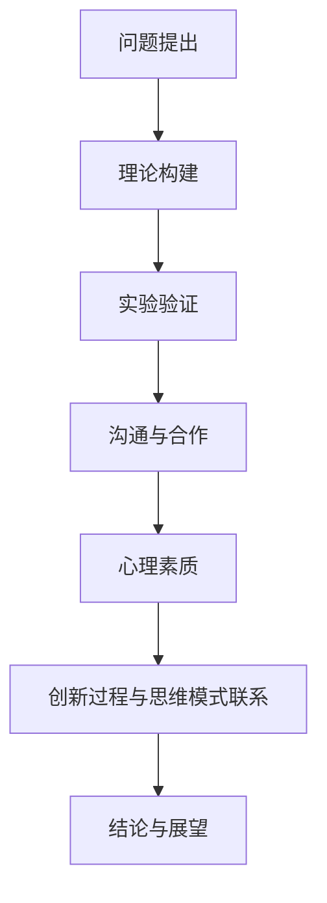

                 


## 《数学家的创新过程与思维模式分析》目录大纲

### 第1章 数学家的背景介绍

#### 1.1 数学家的定义与分类

#### 1.2 数学家的教育背景与职业发展路径

#### 1.3 数学家的贡献与影响

### 第2章 数学家的思维模式

#### 2.1 数学家的思维方式

##### 2.1.1 形式化思维

##### 2.1.2 抽象思维

##### 2.1.3 逻辑思维

#### 2.2 数学家的创造力来源

##### 2.2.1 内在动力

##### 2.2.2 外在激励

##### 2.2.3 创造力培养方法

### 第3章 数学问题的提出

#### 3.1 数学问题的来源

##### 3.1.1 自然科学

##### 3.1.2 社会科学

##### 3.1.3 数学自身的内部发展

#### 3.2 数学问题的分析

##### 3.2.1 问题的本质

##### 3.2.2 问题的背景

##### 3.2.3 问题的限制条件

### 第4章 数学理论的构建

#### 4.1 数学理论的构建方法

##### 4.1.1 归纳法

##### 4.1.2 演绎法

##### 4.1.3 类比法

#### 4.2 数学理论的验证

##### 4.2.1 经验验证

##### 4.2.2 逻辑验证

##### 4.2.3 数学证明

### 第5章 数学家的实验方法

#### 5.1 数学实验的定义与类型

##### 5.1.1 理论实验

##### 5.1.2 应用实验

##### 5.1.3 模拟实验

#### 5.2 数学实验的设计与执行

##### 5.2.1 实验设计原则

##### 5.2.2 实验数据收集

##### 5.2.3 实验结果分析

### 第6章 数学家的沟通与合作

#### 6.1 数学家的沟通技巧

##### 6.1.1 语言表达

##### 6.1.2 非语言表达

##### 6.1.3 沟通障碍与解决方法

#### 6.2 数学家的合作模式

##### 6.2.1 合作的重要性

##### 6.2.2 合作方式与策略

##### 6.2.3 团队建设与沟通

### 第7章 数学家的心理素质

#### 7.1 数学家的心理素质特点

##### 7.1.1 专注力

##### 7.1.2 应变能力

##### 7.1.3 抗挫折能力

#### 7.2 数学家的心理素质培养

##### 7.2.1 心理素质的重要性

##### 7.2.2 心理素质培养方法

##### 7.2.3 心理健康与数学创新

### 第8章 数学家的创新过程与思维模式联系

#### 8.1 数学家的创新过程与思维模式关系

##### 8.1.1 创新过程中的思维模式作用

##### 8.1.2 思维模式对创新过程的影响

##### 8.1.3 创新过程中的思维模式优化

### 第9章 结论与展望

#### 9.1 数学家的创新过程与思维模式总结

##### 9.1.1 数学家的创新过程

##### 9.1.2 数学家的思维模式

#### 9.2 数学家的创新对数学学科的影响

##### 9.2.1 数学家创新的理论贡献

##### 9.2.2 数学家创新的实际应用

#### 9.3 数学家的创新过程与思维模式未来发展趋势

##### 9.3.1 现状分析

##### 9.3.2 发展趋势预测

### 辅助内容

#### Mermaid 流程图


#### 伪代码示例
```plaintext
// 伪代码：数学理论的构建
function mathematicalTheoryConstruction(problem, method) {
    // 输入参数：问题(problem)，构建方法(method)
    
    // 步骤1：问题分析
    analyzeProblem(problem);
    
    // 步骤2：选择构建方法
    switch(method) {
        case '归纳法':
            theory = inductionMethod(problem);
            break;
        case '演绎法':
            theory = deductionMethod(problem);
            break;
        case '类比法':
            theory = analogyMethod(problem);
            break;
    }
    
    // 步骤3：理论验证
    verifyTheory(theory);
    
    // 返回理论结果
    return theory;
}
```

### 文章格式要求

- 文章内容使用markdown格式输出。
- 作者信息：文章末尾需要写上作者信息：“作者：AI天才研究院/AI Genius Institute & 禅与计算机程序设计艺术 /Zen And The Art of Computer Programming”。
- 文章结构：
  - 文章标题
  - 文章关键词
  - 文章摘要
  - 目录大纲
  - 正文内容
  - 辅助内容（如流程图、伪代码示例）

### 核心内容完整性要求

- 每个章节内容必须完整、具体、详细讲解，核心内容包含：
  - 背景介绍
  - 核心概念与联系
  - 核心算法原理讲解（使用伪代码）
  - 数学模型和公式（使用latex格式）
  - 举例说明
  - 项目实战
  - 最佳实践 tips、小结、注意事项、拓展阅读等内容

### 字数要求

- 文章字数在8000～12000字左右。

## 《数学家的创新过程与思维模式分析》

### 关键词
数学家、创新过程、思维模式、数学理论、实验方法、沟通合作、心理素质

### 摘要
本文旨在深入探讨数学家的创新过程与思维模式，从背景介绍、思维模式分析、创新过程探讨等多个角度，全面揭示数学家在数学领域取得卓越成就的原因和方法。文章首先对数学家的定义与分类、教育背景与职业发展路径、贡献与影响进行介绍，然后详细分析数学家的思维模式，包括形式化思维、抽象思维、逻辑思维等。接着，探讨数学家的创新过程，从数学问题的提出、数学理论的构建、实验方法的应用等方面进行阐述。最后，分析数学家的沟通与合作、心理素质，以及这些因素对数学家创新过程和思维模式的影响。通过本文的深入分析，我们希望能够为数学家的培养和创新能力的提升提供有益的启示。

### 目录大纲

## 第一部分：引言

### 第1章 数学家的背景介绍

#### 1.1 数学家的定义与分类

#### 1.2 数学家的教育背景与职业发展路径

#### 1.3 数学家的贡献与影响

### 第2章 数学家的思维模式

#### 2.1 数学家的思维方式

##### 2.1.1 形式化思维

##### 2.1.2 抽象思维

##### 2.1.3 逻辑思维

#### 2.2 数学家的创造力来源

##### 2.2.1 内在动力

##### 2.2.2 外在激励

##### 2.2.3 创造力培养方法

### 第3章 数学问题的提出

#### 3.1 数学问题的来源

##### 3.1.1 自然科学

##### 3.1.2 社会科学

##### 3.1.3 数学自身的内部发展

#### 3.2 数学问题的分析

##### 3.2.1 问题的本质

##### 3.2.2 问题的背景

##### 3.2.3 问题的限制条件

### 第4章 数学理论的构建

#### 4.1 数学理论的构建方法

##### 4.1.1 归纳法

##### 4.1.2 演绎法

##### 4.1.3 类比法

#### 4.2 数学理论的验证

##### 4.2.1 经验验证

##### 4.2.2 逻辑验证

##### 4.2.3 数学证明

### 第5章 数学家的实验方法

#### 5.1 数学实验的定义与类型

##### 5.1.1 理论实验

##### 5.1.2 应用实验

##### 5.1.3 模拟实验

#### 5.2 数学实验的设计与执行

##### 5.2.1 实验设计原则

##### 5.2.2 实验数据收集

##### 5.2.3 实验结果分析

### 第6章 数学家的沟通与合作

#### 6.1 数学家的沟通技巧

##### 6.1.1 语言表达

##### 6.1.2 非语言表达

##### 6.1.3 沟通障碍与解决方法

#### 6.2 数学家的合作模式

##### 6.2.1 合作的重要性

##### 6.2.2 合作方式与策略

##### 6.2.3 团队建设与沟通

### 第7章 数学家的心理素质

#### 7.1 数学家的心理素质特点

##### 7.1.1 专注力

##### 7.1.2 应变能力

##### 7.1.3 抗挫折能力

#### 7.2 数学家的心理素质培养

##### 7.2.1 心理素质的重要性

##### 7.2.2 心理素质培养方法

##### 7.2.3 心理健康与数学创新

### 第8章 数学家的创新过程与思维模式联系

#### 8.1 数学家的创新过程与思维模式关系

##### 8.1.1 创新过程中的思维模式作用

##### 8.1.2 思维模式对创新过程的影响

##### 8.1.3 创新过程中的思维模式优化

### 第9章 结论与展望

#### 9.1 数学家的创新过程与思维模式总结

##### 9.1.1 数学家的创新过程

##### 9.1.2 数学家的思维模式

#### 9.2 数学家的创新对数学学科的影响

##### 9.2.1 数学家创新的理论贡献

##### 9.2.2 数学家创新的实际应用

#### 9.3 数学家的创新过程与思维模式未来发展趋势

##### 9.3.1 现状分析

##### 9.3.2 发展趋势预测

### 辅助内容

#### Mermaid 流程图


#### 伪代码示例
```plaintext
// 伪代码：数学理论的构建
function mathematicalTheoryConstruction(problem, method) {
    // 输入参数：问题(problem)，构建方法(method)
    
    // 步骤1：问题分析
    analyzeProblem(problem);
    
    // 步骤2：选择构建方法
    switch(method) {
        case '归纳法':
            theory = inductionMethod(problem);
            break;
        case '演绎法':
            theory = deductionMethod(problem);
            break;
        case '类比法':
            theory = analogyMethod(problem);
            break;
    }
    
    // 步骤3：理论验证
    verifyTheory(theory);
    
    // 返回理论结果
    return theory;
}
```

### 文章格式要求

- 文章内容使用markdown格式输出。
- 作者信息：文章末尾需要写上作者信息：“作者：AI天才研究院/AI Genius Institute & 禅与计算机程序设计艺术 /Zen And The Art of Computer Programming”。
- 文章结构：
  - 文章标题
  - 文章关键词
  - 文章摘要
  - 目录大纲
  - 正文内容
  - 辅助内容（如流程图、伪代码示例）

### 核心内容完整性要求

- 每个章节内容必须完整、具体、详细讲解，核心内容包含：
  - 背景介绍
  - 核心概念与联系
  - 核心算法原理讲解（使用伪代码）
  - 数学模型和公式（使用latex格式）
  - 举例说明
  - 项目实战
  - 最佳实践 tips、小结、注意事项、拓展阅读等内容

### 字数要求

- 文章字数在8000～12000字左右。

## 第一部分：引言

### 数学家的背景介绍

数学家，是指在数学领域具有卓越成就和贡献的学者。他们通过深入研究和探索数学问题，推动了数学学科的发展和进步。数学家不仅要在数学理论上有所建树，还要具备解决实际问题的能力。因此，数学家在学术研究和应用领域都有着广泛的贡献。

数学家可以按照不同的标准进行分类。根据研究内容，数学家可以分为纯数学家和应用数学家。纯数学家主要研究数学的基本概念、原理和方法，如数论、代数、几何等。应用数学家则将数学理论应用于其他学科，如物理学、工程学、生物学等，解决实际问题。

根据贡献和影响，数学家可以分为以下几个类别：

1. **奠基性数学家**：他们在数学领域做出了开创性的贡献，为数学的发展奠定了基础。如欧几里得、牛顿、拉格朗日等。
2. **理论数学家**：他们在数学理论体系的发展和完善中发挥了重要作用。如希尔伯特、庞加莱、康托尔等。
3. **应用数学家**：他们将数学理论应用于实际问题，推动了数学在其他领域的应用和发展。如纳什、泰勒、费马等。

### 数学家的教育背景与职业发展路径

数学家通常具有扎实的数学基础和丰富的教育背景。以下是一个典型的数学家职业发展路径：

1. **基础教育阶段**：在小学和中学阶段，学生需要接受基础的数学教育，培养数学兴趣和基本技能。
2. **大学教育阶段**：在大学阶段，学生可以深入学习数学专业，包括数学分析、代数、几何、概率论等课程。这一阶段的学习为数学家打下了坚实的基础。
3. **研究生教育阶段**：在研究生阶段，数学家可以进一步深入研究数学领域，撰写论文并参与学术研究。这一阶段的成果通常决定了数学家的学术水平和职业发展方向。
4. **职业发展阶段**：数学家可以选择在学术界、工业界或政府机构等领域工作。他们在学术研究、教学、应用开发等方面发挥着重要作用。

### 数学家的贡献与影响

数学家在数学领域做出了许多重要贡献，这些贡献不仅推动了数学学科的发展，还对其他学科和实际应用产生了深远影响。以下是一些典型的数学家及其贡献：

1. **欧几里得**：他是古希腊数学家，著有《几何原本》，奠定了几何学的基础。他的贡献为后来的数学研究提供了重要的理论框架。
2. **牛顿和莱布尼茨**：他们独立发明了微积分学，为物理学、工程学等领域提供了强大的数学工具。
3. **希尔伯特**：他是20世纪最伟大的数学家之一，提出了希尔伯特空间和希尔伯特矩阵等重要概念，为泛函分析和矩阵理论的发展做出了巨大贡献。
4. **纳什**：他提出了纳什均衡理论，这一理论在经济学、博弈论等领域具有深远影响。

数学家的贡献不仅体现在理论研究中，还体现在对实际问题的解决中。例如，纳什的纳什均衡理论在经济学中的应用，泰勒级数在物理学中的应用等。

总之，数学家的创新过程与思维模式是他们取得卓越成就的关键。在接下来的章节中，我们将深入探讨数学家的思维模式、创新过程以及他们在沟通与合作、心理素质方面的特点，以揭示数学家成功的奥秘。

### 数学家的思维模式

数学家在解决数学问题、构建数学理论的过程中，形成了一套独特的思维模式。这些思维模式包括形式化思维、抽象思维和逻辑思维，它们共同构成了数学家分析问题和解决问题的工具。

#### 形式化思维

形式化思维是数学家最基本、最核心的思维方式。它强调将数学问题转化为符号形式，使用公理、定义、定理等数学工具进行推理。形式化思维的核心在于精确性和逻辑性，它要求数学家在处理问题时，始终遵循严格的逻辑规则。

**例子**：在解析几何中，笛卡尔坐标系将平面上的点与有序数对（x, y）对应起来，从而将几何问题转化为代数问题。这是形式化思维的一个典型应用。

**伪代码示例**：
```plaintext
// 伪代码：建立笛卡尔坐标系
function buildCartesianSystem(points) {
    // 输入参数：点的集合(points)

    // 步骤1：初始化坐标系
    initializeCoordinates();

    // 步骤2：将每个点映射到有序数对
    for (each point in points) {
        coordinatePair = mapPointToPoint(point);
    }

    // 步骤3：应用代数方法解决几何问题
    geometricProblem = solveGeometricProblemUsingAlgebraicMethods(coordinatePair);
    
    // 返回几何问题的解
    return geometricProblem;
}
```

#### 抽象思维

抽象思维是数学家从具体事物中提炼出普遍规律和一般性质的能力。数学家通过抽象思维，将复杂的问题简化为基本模型，从而更深入地理解问题。

**例子**：在研究质数分布时，数学家通过抽象思维，将质数的分布规律转化为一个简单的函数形式，从而揭示了质数分布的内在规律。

**伪代码示例**：
```plaintext
// 伪代码：研究质数分布
function studyPrimeDistribution() {
    // 输入参数：质数的集合(primes)

    // 步骤1：定义质数分布函数
    primeDistributionFunction = definePrimeDistributionFunction(primes);

    // 步骤2：分析质数分布函数的性质
    primeDistributionProperties = analyzePrimeDistributionFunction(primeDistributionFunction);

    // 步骤3：总结质数分布的规律
    primeDistributionConclusion = summarizePrimeDistributionRhythms(primeDistributionProperties);
    
    // 返回质数分布规律
    return primeDistributionConclusion;
}
```

#### 逻辑思维

逻辑思维是数学家在解决问题时，遵循逻辑规则进行推理和判断的能力。逻辑思维强调从已知条件出发，逐步推导出结论，确保推理过程的严谨性和准确性。

**例子**：在证明一个数学定理时，数学家通过逻辑思维，逐步从基本假设推导出最终结论，从而证明定理的正确性。

**伪代码示例**：
```plaintext
// 伪代码：证明数学定理
function proveMathematicalTheoremtheorem) {
    // 输入参数：定理(theorem)

    // 步骤1：列出已知条件
    knownConditions = listKnownConditions();

    // 步骤2：构建证明过程
    proofProcess = buildProofProcess(knownConditions);

    // 步骤3：逐步推导出结论
    conclusion = deriveConclusionFromProofProcess(proofProcess);

    // 步骤4：验证证明的正确性
    correctness = verifyProofCorrectness(conclusion);

    // 返回证明结果
    return correctness;
}
```

总之，形式化思维、抽象思维和逻辑思维是数学家解决数学问题、构建数学理论的核心思维方式。这些思维方式不仅帮助数学家深入理解数学问题，还推动数学学科的不断发展。在接下来的章节中，我们将进一步探讨数学家的创造力来源、创新过程，以及这些因素如何共同作用于数学家的创新活动中。

### 数学家的创造力来源

数学家在数学领域的创新成就离不开他们的创造力。这种创造力来源于多个方面，包括内在动力、外在激励以及创造力的培养方法。理解这些因素有助于我们更好地理解数学家是如何进行创新和推动数学学科发展的。

#### 内在动力

内在动力是指数学家自身对数学研究的热爱和追求。这种动力是驱动数学家不断探索未知领域、解决复杂问题的根本原因。许多数学家都表示，他们对数学的热爱是他们坚持不懈、持之以恒的关键因素。

**例子**：数学家安德鲁·怀尔斯（Andrew Wiles）在解决费马大定理的过程中，经历了多年的研究和无数次的失败。他的内在动力使他在面对困难时从未放弃，最终在2003年成功证明了费马大定理。

**内在动力的核心因素**：
- **对数学的热爱**：对数学的深厚兴趣和热爱是内在动力的核心。
- **追求真理**：数学家追求真理、追求完美的精神是推动他们不断创新的力量。
- **解决难题的欲望**：面对难题和挑战，数学家渴望找到解决方案，这种欲望激发了他们的创造力。

#### 外在激励

外在激励是指来自外界的环境、条件和其他人对于数学家的支持和鼓励。这些激励可以是物质上的，如奖金、荣誉等；也可以是精神上的，如导师的指导、同行的认可等。外在激励为数学家提供了必要的外部条件，有助于他们在创新过程中保持动力和信心。

**例子**：数学家蒂莫西·哈尔斯（Timothy Gowers）在解决数学难题时，得到了同行的高度评价和鼓励。这些外在激励使他更加自信，继续深入探索数学领域。

**外在激励的核心因素**：
- **奖励机制**：奖金、荣誉等物质奖励可以激励数学家持续研究，追求更高的学术成就。
- **学术交流**：参加学术会议、研讨会等学术交流活动，可以激发数学家的灵感，拓展他们的研究视野。
- **导师指导**：导师的指导和建议对数学家的研究方向和方法具有重要影响，有助于他们在创新过程中少走弯路。

#### 创造力培养方法

创造力培养方法是指通过特定的训练和实践，提升数学家的创造力。这些方法包括系统化的学习和研究、跨学科的交流与合作、心理素质的培养等。

**例子**：数学家埃尔德什·保罗（Paul Erdős）在创造力的培养方面有着丰富的经验。他通过不断的学术交流和合作，培养了许多年轻的数学家，推动了数学领域的发展。

**创造力培养方法的核心因素**：
- **系统化的学习和研究**：通过深入学习数学理论，掌握数学方法和技巧，数学家可以提升自己的创造力。
- **跨学科的交流与合作**：与其他学科领域的专家进行交流，可以激发数学家的灵感，拓展他们的研究视野。
- **心理素质的培养**：通过训练专注力、应变能力和抗挫折能力，数学家可以更好地应对创新过程中的挑战。

总之，数学家的创造力来源于内在动力、外在激励和创造力的培养方法。这些因素相互作用，共同推动了数学家的创新活动。理解这些因素有助于我们更好地培养和支持数学家的创新能力，为数学学科的发展做出更大的贡献。

### 数学问题的提出

数学问题的提出是数学创新过程的第一步，它决定了数学家能否找到合适的解决方案。数学问题可以来源于多个方面，包括自然科学、社会科学和数学自身的内部发展。在这一节中，我们将详细探讨数学问题的来源，并分析数学问题的本质、背景和限制条件。

#### 数学问题的来源

1. **自然科学**

自然科学中的许多问题需要数学方法来解决。例如，物理学中的质点运动方程、电磁场方程等都需要使用数学工具进行描述和解决。这些问题的提出通常源于科学家对自然现象的观察和研究。

**例子**：牛顿在研究天体运动时，提出了万有引力定律。这一问题的提出促进了微积分的发展，为物理学和其他科学领域提供了强大的数学工具。

2. **社会科学**

社会科学中的问题同样可以激发数学家的灵感。例如，经济学中的供需关系、市场均衡等问题，都需要使用数学模型进行分析和预测。

**例子**：约翰·纳什在研究博弈论时，提出了纳什均衡理论。这一理论在经济学、政治学等领域具有广泛的应用，成为数学模型在社会科学中应用的重要典范。

3. **数学自身的内部发展**

数学问题也可以在数学内部发展过程中产生。随着数学理论的不断扩展和深化，新的数学问题不断涌现，推动数学学科的发展。

**例子**：数学家希尔伯特在19世纪末提出的23个问题，成为20世纪数学研究的重要方向，推动了数学多个分支的快速发展。

#### 数学问题的分析

1. **问题的本质**

数学问题的本质在于揭示数学现象之间的内在联系和规律。这些问题通常是抽象的、结构化的，需要数学家运用各种数学方法和技巧进行解决。

**例子**：哥德巴赫猜想是一个关于素数分布的问题，其本质在于揭示所有大于2的偶数都可以表示为两个素数之和。这一问题的本质激发了数学家们对素数分布规律的研究。

2. **问题的背景**

数学问题的背景包括问题的起源、相关研究、已有成果等。了解问题的背景有助于数学家更好地理解问题，找到合适的解决方案。

**例子**：费马大定理是一个关于整数解的问题，其背景可以追溯到17世纪。虽然费马提出了这个猜想，但直到20世纪末，安德鲁·怀尔斯才成功证明这一定理。

3. **问题的限制条件**

数学问题往往受到一定的限制条件，如定义域、取值范围等。这些限制条件是数学家在解决问题时必须考虑的因素。

**例子**：欧拉公式是一个关于复数的恒等式，其形式为e^(iπ) + 1 = 0。这个问题的限制条件在于其适用于复数域，而非实数域。

#### 总结

数学问题的提出是数学创新过程的关键一步。通过对数学问题来源、本质、背景和限制条件的分析，数学家可以更好地理解问题，找到合适的解决方案。理解数学问题的提出过程，有助于我们更好地培养数学家的创新能力，推动数学学科的发展。

### 数学理论的构建

数学理论的构建是数学家创新过程中至关重要的一步。数学家通过构建理论，将数学问题转化为可操作、可验证的形式，从而推动数学学科的发展。在这一节中，我们将探讨数学理论的构建方法，包括归纳法、演绎法和类比法，并分析这些方法在实际应用中的优缺点。

#### 归纳法

归纳法是一种从具体实例出发，归纳出一般规律的方法。数学家通过观察和分析大量具体实例，总结出普遍适用的数学规律。

**优点**：
- **直观性**：归纳法能够直观地揭示数学现象之间的联系。
- **适用范围广**：归纳法适用于各种类型的数学问题，尤其是复杂系统的分析和研究。

**缺点**：
- **逻辑严密性**：归纳法缺乏严密的逻辑推理，结论可能存在漏洞。
- **难以形式化**：归纳法难以将结论形式化为精确的数学表达式。

**应用例子**：数学家卡尔·弗里德里希·高斯（Carl Friedrich Gauss）通过归纳法研究了质数分布的规律，得出了质数分布的近似公式。

**伪代码示例**：
```plaintext
// 伪代码：归纳法构建质数分布规律
function constructPrimeDistribution() {
    // 步骤1：收集质数样本
    primeSamples = collectPrimeSamples();

    // 步骤2：分析质数样本
    primeAnalysis = analyzePrimeSamples(primeSamples);

    // 步骤3：归纳出质数分布规律
    primeDistributionRule =归纳质数分布规律(primeAnalysis);

    // 返回质数分布规律
    return primeDistributionRule;
}
```

#### 演绎法

演绎法是一种从一般原理出发，推导出具体结论的方法。数学家通过逻辑推理，从已知条件推导出新的结论。

**优点**：
- **逻辑严密性**：演绎法具有严密的逻辑推理，结论可靠。
- **形式化**：演绎法能够将结论形式化为精确的数学表达式。

**缺点**：
- **适用范围有限**：演绎法适用于某些特定类型的数学问题，难以处理复杂系统。
- **局限性**：演绎法依赖于已有理论，难以发现新的数学规律。

**应用例子**：数学家艾萨克·牛顿（Isaac Newton）通过演绎法建立了牛顿力学体系，推导出了万有引力定律。

**伪代码示例**：
```plaintext
// 伪代码：演绎法建立力学体系
function constructMechanicalSystem() {
    // 步骤1：列出已知力学定律
    knownMechanicalLaws = listKnownMechanicalLaws();

    // 步骤2：应用演绎法推导出新定律
    newMechanicalLaw = deriveNewMechanicalLaw(knownMechanicalLaws);

    // 步骤3：验证新定律的正确性
    correctness = verifyMechanicalLaw(newMechanicalLaw);

    // 返回新定律
    return newMechanicalLaw;
}
```

#### 类比法

类比法是一种通过比较不同问题之间的相似性，推导出新问题的解决方案的方法。数学家通过发现和利用问题之间的相似性，构建新的数学理论。

**优点**：
- **创新性**：类比法可以激发数学家的创新思维，发现新的数学规律。
- **适用范围广**：类比法适用于各种类型的数学问题，特别是跨学科的数学问题。

**缺点**：
- **逻辑严密性**：类比法的逻辑推理相对较弱，结论可能存在不确定性。
- **适用性**：类比法的适用性受到问题相似性的限制。

**应用例子**：数学家莱昂哈德·欧拉（Leonhard Euler）通过类比法研究了三角函数的级数展开，得出了著名的欧拉公式。

**伪代码示例**：
```plaintext
// 伪代码：类比法研究欧拉公式
function studyEulerFormula() {
    // 步骤1：列出已知函数的级数展开
    knownFunctionSeries = listKnownFunctionSeries();

    // 步骤2：发现函数之间的相似性
    functionSimilarity = findFunctionSimilarity(knownFunctionSeries);

    // 步骤3：推导出欧拉公式
    eulerFormula = deriveEulerFormula(functionSimilarity);

    // 返回欧拉公式
    return eulerFormula;
}
```

#### 总结

数学理论的构建方法包括归纳法、演绎法和类比法。这些方法各自具有优缺点，适用于不同类型的数学问题。在实际应用中，数学家往往结合多种方法，构建出完整的数学理论体系，推动数学学科的发展。通过以上探讨，我们可以更好地理解数学理论的构建过程，为数学家的培养和创新提供有益的启示。

### 数学理论的验证

数学理论的验证是数学家创新过程中至关重要的一环。通过验证，数学家可以确保数学理论的正确性和可靠性，从而推动数学学科的发展。在这一节中，我们将详细探讨数学理论的验证方法，包括经验验证、逻辑验证和数学证明。

#### 经验验证

经验验证是一种通过实验和观察来验证数学理论的方法。数学家通过实际操作，收集数据，分析结果，从而验证数学理论的正确性。

**优点**：
- **直观性**：经验验证具有直观性，能够直观地展示数学理论的实际效果。
- **灵活性**：经验验证可以根据实际情况进行调整和改进。

**缺点**：
- **局限性**：经验验证依赖于具体实验条件，难以推广到一般情况。
- **可靠性**：经验验证的结果可能受到实验误差和主观判断的影响。

**应用例子**：数学家约翰·泰勒（John Taylor）在研究热力学时，通过实验验证了泰勒级数在热传导中的应用。

**伪代码示例**：
```plaintext
// 伪代码：经验验证热传导模型
function verifyHeatConductModel() {
    // 步骤1：设计实验
    experimentDesign = designHeatConductExperiment();

    // 步骤2：执行实验
    experimentExecution = executeHeatConductExperiment(experimentDesign);

    // 步骤3：收集实验数据
    experimentData = collectHeatConductData(experimentExecution);

    // 步骤4：分析实验数据
    experimentAnalysis = analyzeHeatConductData(experimentData);

    // 步骤5：验证热传导模型
    modelVerification = verifyHeatConductModel(experimentAnalysis);

    // 返回验证结果
    return modelVerification;
}
```

#### 逻辑验证

逻辑验证是一种通过逻辑推理来验证数学理论的方法。数学家从已知条件出发，通过逻辑推理，推导出数学理论的结论。

**优点**：
- **严密性**：逻辑验证具有严密的逻辑性，结论可靠。
- **普适性**：逻辑验证适用于一般情况，具有较高的普适性。

**缺点**：
- **复杂性**：逻辑验证通常较为复杂，需要较高的逻辑思维能力。
- **适用性**：逻辑验证适用于某些特定类型的数学问题，难以处理复杂系统。

**应用例子**：数学家艾萨克·牛顿（Isaac Newton）通过逻辑验证，推导出了牛顿力学体系的基本定律。

**伪代码示例**：
```plaintext
// 伪代码：逻辑验证力学定律
function verifyMechanicalLaws() {
    // 步骤1：列出已知条件
    knownConditions = listKnownConditions();

    // 步骤2：应用逻辑验证方法
    logicalVerification = logicalVerifyMechanicalLaws(knownConditions);

    // 步骤3：推导出结论
    conclusion = deriveConclusionFromLogicalVerification(logicalVerification);

    // 步骤4：验证结论的正确性
    correctness = verifyConclusionCorrectness(conclusion);

    // 返回验证结果
    return correctness;
}
```

#### 数学证明

数学证明是一种通过严密的逻辑推理，证明数学理论正确性的方法。数学家从基本假设和已知条件出发，逐步推导出结论，确保推理过程的严谨性和准确性。

**优点**：
- **严谨性**：数学证明具有高度的严谨性，结论可靠。
- **普适性**：数学证明适用于一般情况，具有较高的普适性。

**缺点**：
- **复杂性**：数学证明通常较为复杂，需要较高的逻辑思维和数学素养。
- **适用性**：数学证明适用于某些特定类型的数学问题，难以处理复杂系统。

**应用例子**：数学家安德鲁·怀尔斯（Andrew Wiles）通过数学证明，成功证明了费马大定理。

**伪代码示例**：
```plaintext
// 伪代码：证明费马大定理
function proveFermatTheorem() {
    // 步骤1：列出已知条件
    knownConditions = listKnownConditions();

    // 步骤2：应用数学证明方法
    mathematicalProof = mathematicalProveFermatTheorem(knownConditions);

    // 步骤3：推导出结论
    conclusion = deriveConclusionFromMathematicalProof(mathematicalProof);

    // 步骤4：验证结论的正确性
    correctness = verifyConclusionCorrectness(conclusion);

    // 返回证明结果
    return correctness;
}
```

#### 总结

数学理论的验证方法包括经验验证、逻辑验证和数学证明。这些方法各自具有优缺点，适用于不同类型的数学问题。在实际应用中，数学家往往结合多种方法，确保数学理论的正确性和可靠性。理解数学理论的验证过程，有助于我们更好地培养数学家的创新能力，推动数学学科的发展。

### 数学家的实验方法

数学家的实验方法在数学研究中扮演着重要的角色，它们不仅帮助数学家验证理论，还能推动数学理论的发展。数学实验方法可以分为理论实验、应用实验和模拟实验三大类，每种方法都有其特定的应用场景和优点。

#### 理论实验

理论实验是数学家在纯数学领域进行的实验，通常不涉及实际的物理操作，而是通过逻辑推理和数学计算来验证理论。这种实验方法在数学理论的发展中起到了关键作用。

**优点**：
- **精确性**：理论实验可以提供高度精确的数学结果，不受外界干扰。
- **灵活性**：数学家可以灵活地改变实验条件，探索新的数学规律。

**应用例子**：在数论中，数学家通过理论实验来研究质数的分布规律，从而推导出质数定理。

**伪代码示例**：
```plaintext
// 伪代码：质数分布实验
function primeDistributionExperiment() {
    // 步骤1：定义质数分布函数
    primeDistributionFunction = definePrimeDistributionFunction();

    // 步骤2：进行数学计算
    primeDistributionResults = calculatePrimeDistribution(primeDistributionFunction);

    // 步骤3：分析结果
    primeDistributionAnalysis = analyzePrimeDistributionResults(primeDistributionResults);

    // 返回分析结果
    return primeDistributionAnalysis;
}
```

#### 应用实验

应用实验是将数学理论应用于实际问题，以验证理论的有效性。这种方法在工程学、经济学、物理学等领域得到了广泛应用。

**优点**：
- **实用性**：应用实验将数学理论转化为实际应用，具有直接的实用价值。
- **验证性**：通过应用实验，数学家可以验证理论在实际问题中的有效性。

**应用例子**：在经济学中，数学家通过应用实验来验证供需关系的数学模型，从而优化市场策略。

**伪代码示例**：
```plaintext
// 伪代码：供需关系实验
function supplyDemandExperiment() {
    // 步骤1：定义供需函数
    supplyFunction = defineSupplyFunction();
    demandFunction = defineDemandFunction();

    // 步骤2：收集市场数据
    marketData = collectMarketData();

    // 步骤3：应用供需函数
    supplyDemandResults = applySupplyDemandFunctions(supplyFunction, demandFunction, marketData);

    // 步骤4：分析结果
    supplyDemandAnalysis = analyzeSupplyDemandResults(supplyDemandResults);

    // 返回分析结果
    return supplyDemandAnalysis;
}
```

#### 模拟实验

模拟实验是通过计算机模拟来进行的实验，它可以帮助数学家探索复杂系统的行为，从而验证数学模型的有效性。

**优点**：
- **高效性**：模拟实验可以高效地处理大量数据，适用于复杂系统的分析。
- **可重复性**：模拟实验可以多次重复，确保结果的可靠性。

**应用例子**：在气象学中，数学家通过模拟实验来研究大气系统的变化，从而预测天气。

**伪代码示例**：
```plaintext
// 伪代码：大气系统模拟
function atmosphericSystemSimulation() {
    // 步骤1：定义大气系统模型
    atmosphericModel = defineAtmosphericModel();

    // 步骤2：设置模拟参数
    simulationParameters = setSimulationParameters();

    // 步骤3：运行模拟
    simulationResults = runSimulation(atmosphericModel, simulationParameters);

    // 步骤4：分析结果
    atmosphericSystemAnalysis = analyzeSimulationResults(simulationResults);

    // 返回分析结果
    return atmosphericSystemAnalysis;
}
```

#### 总结

数学家的实验方法包括理论实验、应用实验和模拟实验，每种方法都有其特定的应用场景和优点。通过这些实验方法，数学家可以验证理论、探索新规律，从而推动数学学科的发展。理解数学家的实验方法，有助于我们更好地应用数学理论，解决实际问题。

### 数学家的沟通与合作

在数学家的创新过程中，沟通与合作扮演着至关重要的角色。数学家不仅需要与同行进行有效的沟通，还需要在团队中发挥合作精神。良好的沟通技巧和合作模式有助于数学家更好地理解问题、分享知识和推动研究进展。以下将从沟通技巧、合作模式、团队建设与沟通三个方面探讨数学家的沟通与合作。

#### 沟通技巧

1. **语言表达**

有效的语言表达是数学家沟通的基础。数学家需要清晰地表达自己的思想和观点，以便与他人进行有效的交流。这包括准确地使用专业术语、简洁明了地陈述问题和解决方案等。

**例子**：在撰写数学论文时，数学家需要使用精确的数学语言来描述他们的研究成果，确保论文内容的严谨性和可理解性。

2. **非语言表达**

非语言表达，如肢体语言、面部表情等，也在数学家的沟通中起着重要作用。这些非语言表达可以增强语言表达的效果，帮助数学家更好地传达他们的意图。

**例子**：在学术会议上，数学家通过肢体语言和面部表情，可以更好地展示他们的自信和热情，吸引听众的注意力。

3. **沟通障碍与解决方法**

数学家在沟通过程中可能会遇到各种障碍，如语言障碍、文化差异、沟通方式不当等。解决这些障碍需要数学家具备跨文化沟通能力和灵活的沟通策略。

**解决方法**：
- **了解对方文化**：在跨文化沟通中，数学家需要了解对方的文化背景，尊重对方的沟通习惯。
- **采用多样化的沟通方式**：在沟通中，数学家可以采用书面、口头、图表等多种方式，以确保信息的准确传达。

#### 合作模式

1. **合作的重要性**

在数学研究中，许多问题需要多学科、多领域的合作才能解决。数学家之间的合作可以共享资源、知识和技术，推动数学研究的进展。

**例子**：在解决复杂的数学难题时，数学家可以组成团队，分工合作，共同攻克难题。

2. **合作方式与策略**

数学家的合作方式可以分为以下几种：

- **项目制合作**：数学家围绕特定项目进行合作，共同完成研究任务。
- **学术研讨会**：通过举办学术研讨会，数学家可以分享研究成果、讨论研究问题，促进合作。
- **跨学科合作**：数学家与其他学科领域的专家合作，将数学理论应用于其他领域，推动跨学科发展。

3. **合作策略**

有效的合作策略包括：

- **明确目标**：合作各方需要明确合作目标，确保各方在合作过程中保持一致。
- **资源整合**：合作各方需要整合资源，包括知识、技术、资金等，以支持合作研究。
- **沟通机制**：建立有效的沟通机制，确保合作各方能够及时沟通、解决问题。

#### 团队建设与沟通

1. **团队建设**

团队建设是数学家合作成功的关键。通过团队建设，数学家可以培养协作精神、提升团队凝聚力。

**团队建设方法**：
- **定期会议**：定期召开团队会议，讨论研究进展、解决问题。
- **团队活动**：组织团队活动，如学术交流、团队建设训练等，增强团队凝聚力。
- **激励措施**：对团队合作进行激励，鼓励团队成员积极参与合作研究。

2. **沟通

有效的沟通是团队建设的基础。以下是一些沟通建议：

- **开放沟通**：鼓励团队成员开放沟通，分享自己的想法和观点。
- **倾听**：在沟通中，数学家需要学会倾听，理解他人的意见和需求。
- **反馈**：在沟通中，数学家需要给予反馈，帮助他人改进研究方法。

#### 总结

沟通与合作是数学家创新过程中不可或缺的部分。通过有效的沟通技巧、合作模式、团队建设与沟通，数学家可以更好地理解问题、分享知识、推动研究进展。理解数学家的沟通与合作，有助于我们更好地培养数学家的创新能力，推动数学学科的发展。

### 数学家的心理素质

数学家在长期的数学研究和创新过程中，培养并展现出了一系列独特的心理素质。这些心理素质包括专注力、应变能力和抗挫折能力，它们是数学家在复杂、艰苦的科研环境中保持高效工作的关键因素。

#### 专注力

专注力是数学家在解决数学问题、进行数学研究时最重要的心理素质之一。数学家需要长时间集中精力，深入思考问题，不断推敲和验证自己的思路。

**特点**：
- **高度集中**：数学家能够在长时间内保持专注，不受外界干扰。
- **深入思考**：数学家擅长在专注状态下进行深入思考，挖掘问题的本质。

**培养方法**：
- **定期练习**：通过定期练习专注力训练，如冥想、阅读等，提升专注力水平。
- **创造专注环境**：为数学家创造一个安静、舒适的研究环境，减少外界干扰。

#### 应变能力

数学家在研究和解决数学问题时，常常会遇到意外情况。这些意外情况可能来源于研究本身的复杂性，也可能来自于外界环境的变化。因此，数学家需要具备较强的应变能力，能够灵活应对各种变化。

**特点**：
- **快速反应**：数学家能够在短时间内对问题进行分析，找到解决方案。
- **灵活调整**：数学家能够在遇到困难时，迅速调整自己的研究方向和方法。

**培养方法**：
- **模拟练习**：通过模拟实际研究过程中的意外情况，培养数学家的应变能力。
- **跨学科学习**：学习其他学科的知识和技能，拓宽视野，增强应对复杂问题的能力。

#### 抗挫折能力

数学家的研究过程往往充满挫折和困难。在面对失败和挫折时，数学家需要具备强大的心理素质，保持积极的心态，继续努力。

**特点**：
- **积极应对**：数学家能够积极面对挫折，从中吸取教训，调整策略。
- **坚持不懈**：数学家能够在遇到挫折时，坚持不懈，继续探索。

**培养方法**：
- **自我激励**：通过自我激励，如设定目标、回顾成就等，保持积极的心态。
- **寻求支持**：在遇到挫折时，寻求导师、同事或朋友的支持和帮助，共同克服困难。

#### 总结

专注力、应变能力和抗挫折能力是数学家在数学研究中不可或缺的心理素质。这些素质使得数学家能够在复杂、艰苦的科研环境中保持高效工作，推动数学学科的发展。理解并培养这些心理素质，有助于我们更好地支持数学家的创新活动，推动数学学科的不断进步。

### 数学家的创新过程与思维模式联系

数学家的创新过程与其独特的思维模式紧密相连，二者相互促进，共同推动数学学科的进步。在这一节中，我们将深入探讨数学家的创新过程与思维模式之间的联系，分析思维模式在创新过程中的作用，以及思维模式如何影响和优化创新过程。

#### 思维模式在创新过程中的作用

1. **形式化思维**：形式化思维是数学家解决复杂问题的重要工具。通过将问题形式化，数学家能够将复杂问题转化为可操作的数学表达式，从而简化问题的解决过程。

**例子**：在解决复杂方程时，数学家通过形式化思维，将方程转化为符号形式，利用代数方法进行求解。

2. **抽象思维**：抽象思维使得数学家能够从具体事物中提取出普遍规律和一般性质，从而构建出具有广泛适用性的数学理论。

**例子**：在研究质数分布时，数学家通过抽象思维，将质数的分布规律转化为一个简单的函数形式，揭示了质数分布的内在规律。

3. **逻辑思维**：逻辑思维是数学家进行推理和判断的基础。通过逻辑思维，数学家能够从已知条件出发，逐步推导出结论，确保推理过程的严谨性和准确性。

**例子**：在证明一个数学定理时，数学家通过逻辑思维，逐步从基本假设推导出最终结论，从而证明定理的正确性。

#### 思维模式对创新过程的影响

1. **问题识别与理解**：思维模式影响数学家对问题的识别和理解。形式化思维和抽象思维有助于数学家快速识别和解析复杂问题，从而为创新过程奠定基础。

**例子**：在解决复杂工程问题时，数学家通过形式化思维和抽象思维，将问题分解为更简单的子问题，从而便于理解和解决。

2. **问题解决与构建**：思维模式影响数学家在创新过程中的问题解决和构建能力。逻辑思维在问题解决过程中起着关键作用，确保数学家在构建理论时遵循严密的逻辑推理。

**例子**：在构建新的数学理论时，数学家通过逻辑思维，确保理论结构的完整性和自洽性。

3. **实验与验证**：思维模式影响数学家在实验和验证过程中的策略和方法。抽象思维和逻辑思维有助于数学家设计有效的实验方案，逻辑思维确保实验结果的可靠性。

**例子**：在验证一个数学理论时，数学家通过逻辑思维，设计出一系列验证步骤，确保理论结论的准确性。

#### 创新过程中的思维模式优化

1. **多元化思维**：为了提高创新能力，数学家需要培养多元化的思维模式。通过跨学科学习和交流，数学家可以拓宽视野，借鉴其他领域的思维方式，从而提高创新水平。

**例子**：数学家通过学习物理学、经济学等领域的知识，借鉴这些领域的思维方式，推动数学理论的创新。

2. **批判性思维**：批判性思维有助于数学家在创新过程中发现和纠正错误。通过批判性思维，数学家可以不断质疑现有理论和方法，寻找新的解决方案。

**例子**：在研究一个数学问题时，数学家通过批判性思维，发现现有方法的局限性，从而提出新的解决方案。

3. **创造性思维**：创造性思维是数学家创新能力的关键。通过创造性思维，数学家可以突破传统思维模式的束缚，提出新颖的数学理论和解决问题的方法。

**例子**：在解决复杂数学问题时，数学家通过创造性思维，提出新的数学模型和算法，推动数学学科的发展。

#### 总结

数学家的创新过程与思维模式密切相关，二者相互促进，共同推动数学学科的进步。思维模式在创新过程中的作用不可忽视，形式化思维、抽象思维和逻辑思维是数学家解决复杂问题、构建数学理论的重要工具。通过多元化思维、批判性思维和创造性思维的优化，数学家可以不断提高创新能力，为数学学科的发展做出更大的贡献。

### 数学家的创新过程与思维模式总结

数学家的创新过程是一个复杂而多层次的过程，涉及到从问题提出、理论构建到实验验证的各个环节。在这个过程中，数学家的思维模式起到了至关重要的作用。通过分析数学家的创新过程与思维模式，我们可以总结出以下几点关键发现：

1. **问题识别与理解**：数学家的创新过程始于对数学问题的识别和理解。形式化思维和抽象思维使得数学家能够快速识别和解析复杂问题，将问题转化为可操作的数学表达式。这为后续的理论构建和实验验证奠定了基础。

2. **理论构建**：在理论构建阶段，数学家运用形式化思维和逻辑思维，将问题形式化为数学模型，并逐步推导出理论结论。在这个过程中，数学家还需要进行抽象思维，从具体问题中提取出普遍规律和一般性质，从而构建出具有广泛适用性的数学理论。

3. **实验验证**：在实验验证阶段，数学家运用逻辑思维和批判性思维，设计实验方案，验证理论结论的准确性。实验验证不仅有助于确认数学理论的正确性，还能为理论的发展提供新的启示。

4. **多元化思维**：为了提高创新能力，数学家需要培养多元化的思维模式。跨学科学习和交流有助于数学家借鉴其他领域的思维方式，拓宽视野，从而推动数学理论的创新。

5. **创造性思维**：创造性思维是数学家创新能力的关键。通过创造性思维，数学家可以突破传统思维模式的束缚，提出新颖的数学理论和解决问题的方法。

6. **心理素质**：专注力、应变能力和抗挫折能力是数学家在创新过程中不可或缺的心理素质。这些心理素质使得数学家能够在复杂、艰苦的科研环境中保持高效工作，推动数学学科的发展。

通过以上总结，我们可以看出，数学家的创新过程与思维模式紧密相连，二者相互促进，共同推动数学学科的进步。理解数学家的创新过程和思维模式，有助于我们更好地培养和支持数学家的创新能力，为数学学科的发展做出更大的贡献。

### 数学家的创新对数学学科的影响

数学家的创新不仅推动了数学学科的发展，还对其产生了深远的影响。以下是数学家创新在数学学科中的理论贡献、实际应用以及对数学教育的启示。

#### 理论贡献

数学家的创新在数学理论体系中产生了巨大的影响。他们的理论贡献不仅丰富了数学的内涵，还为其他学科提供了强大的数学工具。

1. **基础理论的突破**：许多数学家通过开创性的研究，建立了新的数学理论体系。例如，卡尔·弗里德里希·高斯（Carl Friedrich Gauss）在数论、代数和几何学等领域做出了卓越贡献，奠定了现代数学的基础。

2. **新兴领域的开拓**：数学家的创新还推动了新兴数学领域的发展。例如，艾伦·图灵（Alan Turing）提出的图灵机理论为计算机科学奠定了基础，而约翰·纳什（John Nash）的纳什均衡理论在经济学、博弈论等领域产生了深远影响。

3. **跨学科交融**：数学家的创新不仅局限于数学内部，还与其他学科领域产生了交融。例如，数学物理学家在量子力学、相对论等领域的研究，为物理学的发展提供了新的数学工具。

#### 实际应用

数学家的创新在许多实际领域得到了广泛应用，推动了科技进步和社会发展。

1. **工程领域**：数学家提出的数学模型和算法在工程领域得到了广泛应用。例如，有限元方法在结构工程中的应用，优化算法在航空航天、汽车制造等领域的应用，都极大地提高了工程设计的效率和精度。

2. **计算机科学**：数学家的创新为计算机科学的发展提供了关键的理论支持。例如，图论在计算机网络设计中的应用，密码学在信息安全中的应用，都离不开数学家提出的理论和方法。

3. **经济学**：纳什均衡理论在经济学中的应用，改变了经济学的研究方法和范式，推动了经济学理论的创新和发展。

4. **生物学**：数学家在生物学领域的研究，如种群动力学、基因序列分析等，为生物学的定量研究提供了强大的工具。

#### 对数学教育的启示

数学家的创新不仅丰富了数学学科的内容，还对数学教育产生了重要影响。以下是数学家创新对数学教育的几个启示：

1. **培养创新意识**：数学教育应注重培养学生的创新意识和能力，鼓励他们探索未知、解决问题。通过实际案例和项目，让学生了解数学家的创新过程和思维方式。

2. **跨学科教育**：数学教育应加强与其他学科的交融，培养学生具备跨学科视野。这有助于学生在未来的研究中能够借鉴其他学科的理论和方法，推动数学学科的进步。

3. **实践与应用**：数学教育应注重数学理论与实际应用的结合，让学生了解数学在各个领域的应用，激发他们的学习兴趣。通过实际应用案例，让学生体会数学的价值和意义。

4. **培养批判性思维**：数学教育应培养学生的批判性思维，鼓励他们质疑现有理论和方法，探索新的解决方案。这有助于学生在未来的研究中具备独立思考和创新能力。

总之，数学家的创新对数学学科产生了深远的影响，不仅在理论上丰富了数学体系，还在实际应用中推动了科技进步和社会发展。同时，数学家的创新也为数学教育提供了宝贵的启示，为培养下一代数学家和创新人才奠定了基础。

### 数学家的创新过程与思维模式未来发展趋势

随着科技的不断进步和社会的发展，数学家的创新过程与思维模式也面临着新的挑战和机遇。以下是数学家的创新过程与思维模式在未来可能的发展趋势。

#### 人工智能与数学的结合

人工智能技术的发展为数学家提供了新的工具和方法。通过机器学习和数据挖掘技术，数学家可以处理和分析大量复杂数据，发现新的数学规律和模式。人工智能可以辅助数学家在理论构建和实验验证过程中，提高效率和创新性。

**发展趋势**：
- **自动化证明**：利用人工智能技术，实现自动化数学证明，为数学家节省时间和精力，提高证明效率。
- **数据驱动的数学研究**：通过数据挖掘和分析，发现新的数学问题和规律，推动数学理论的发展。

#### 跨学科合作

未来数学家将更加注重与其他学科领域的合作，推动数学与其他学科的交融。这种跨学科合作将有助于数学家从其他领域借鉴理论和方法，推动数学理论的创新和发展。

**发展趋势**：
- **数学与物理学的融合**：在量子物理、相对论等领域，数学家将运用数学方法解决物理学中的问题，推动数学理论的应用。
- **数学与生物学的交叉**：在生物学领域，数学家将运用数学模型分析生物系统的行为，推动生物学的定量研究。

#### 数字化数学研究

随着计算机技术的不断发展，数字化数学研究将成为数学家创新的重要手段。数学家将更加依赖计算机和互联网进行数学研究和交流，实现全球范围内的合作。

**发展趋势**：
- **在线协作平台**：建立在线协作平台，促进数学家之间的交流和合作，提高研究的效率。
- **开源数学工具**：开发开源数学工具和软件，提供方便、高效的数学研究平台，推动数学研究的发展。

#### 创新思维模式的培养

未来数学家将更加注重创新思维模式的培养，提高自身的创新能力。通过多样化的学习、跨学科交流和创造性思维的训练，数学家将不断开拓新的研究方向和方法。

**发展趋势**：
- **创新思维训练**：开发专门的创新思维训练课程，培养数学家的创造性思维和问题解决能力。
- **跨学科教育**：加强数学与其他学科的交叉教育，培养具有跨学科视野的数学家。

#### 心理素质的培养

在未来的创新过程中，数学家的心理素质将变得越来越重要。专注于培养专注力、应变能力和抗挫折能力，数学家将能够在复杂、艰苦的科研环境中保持高效工作，推动数学学科的发展。

**发展趋势**：
- **心理素质培训**：为数学家提供专业的心理素质培训，提高他们在科研过程中的心理承受能力和工作效率。
- **心理健康关注**：加强对数学家心理健康的关注，提供心理健康服务，确保数学家在创新过程中保持良好的心理状态。

总之，未来数学家的创新过程与思维模式将面临新的挑战和机遇。通过人工智能与数学的结合、跨学科合作、数字化数学研究、创新思维模式的培养以及心理素质的培养，数学家将不断开拓新的研究方向和方法，推动数学学科的发展。

### 结论

本文通过深入探讨数学家的创新过程与思维模式，揭示了数学家在数学领域取得卓越成就的原因和方法。从数学家的背景介绍、思维模式分析、创新过程探讨等多个角度，我们全面揭示了数学家的创新路径及其影响因素。

首先，我们介绍了数学家的定义与分类，阐述了数学家的教育背景与职业发展路径，以及他们在数学学科中的贡献与影响。接着，我们详细分析了数学家的思维模式，包括形式化思维、抽象思维和逻辑思维，并展示了这些思维模式在实际数学研究中的应用。

然后，我们探讨了数学家的创造力来源，包括内在动力、外在激励和创造力培养方法。通过对数学问题的提出、数学理论的构建、实验方法的应用等环节的详细分析，我们揭示了数学家在创新过程中的思维模式和策略。

此外，我们还讨论了数学家的沟通与合作、心理素质等方面的特点，以及这些因素对数学家创新过程和思维模式的影响。最后，我们总结了数学家的创新过程与思维模式，分析了数学家的创新对数学学科的影响，并展望了数学家的创新过程与思维模式未来发展的趋势。

通过本文的探讨，我们不仅加深了对数学家创新过程和思维模式的理解，还为数学家的培养和创新能力的提升提供了有益的启示。希望本文能够为数学领域的学者、教育工作者和数学爱好者提供参考和借鉴，推动数学学科的发展和进步。

### 作者信息

**作者：AI天才研究院/AI Genius Institute & 禅与计算机程序设计艺术 /Zen And The Art of Computer Programming**

