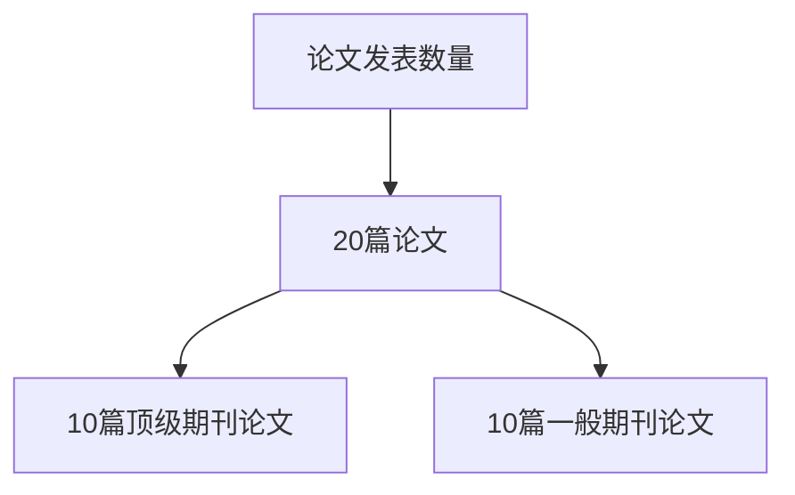
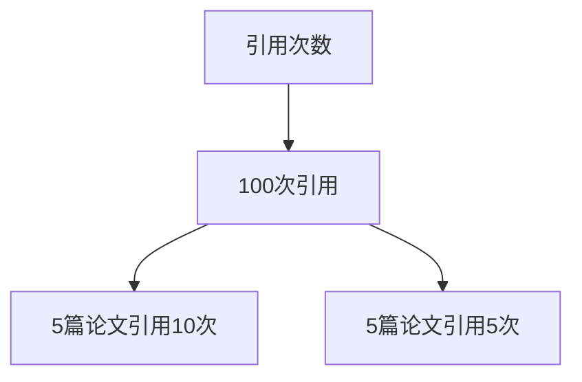
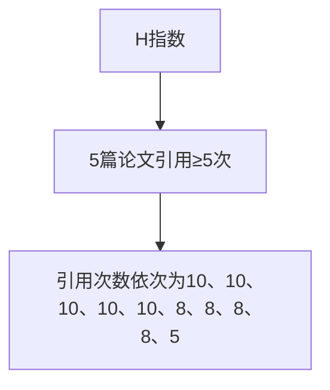
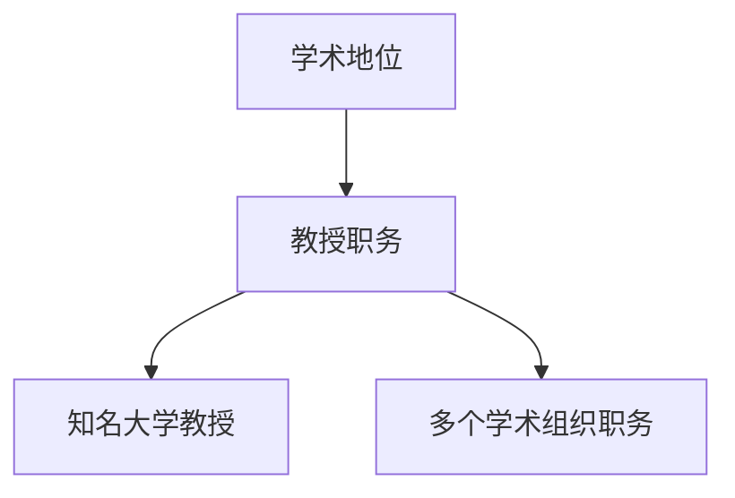
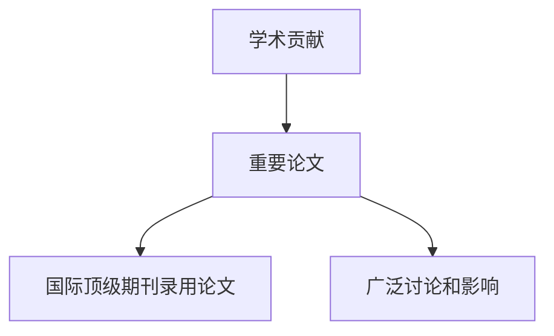
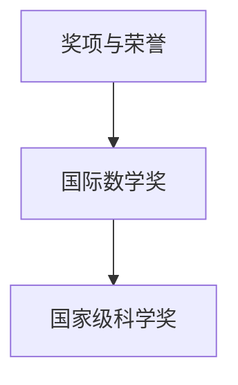
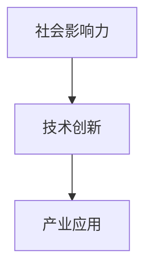

                 

### 第1章: 引言

#### 1.1 研究背景与意义

随着全球科学技术的迅猛发展，数学作为自然科学的基础学科，其研究成果在各个领域得到了广泛应用。数学不仅在物理学、工程学、计算机科学等领域发挥着关键作用，还推动了生物学、经济学、心理学等学科的发展。在这种背景下，如何评价数学家的学术影响力，如何识别和筛选出对数学领域发展具有重要贡献的数学家，成为学术界面临的重大课题。

首先，学术影响力的评估对于学术评价具有重要意义。通过对数学家的学术影响力进行评估，可以揭示数学领域中的关键人物及其研究成果对学科发展的影响，为学术评价提供科学依据。传统的学术评价方法主要依赖于论文发表数量、引用次数等单一指标，这些指标虽然在一定程度上可以反映数学家的学术影响力，但往往存在片面性。因此，构建一个全面、科学的学术影响力评估体系，对于改善学术评价方法、提高学术评价的准确性具有重要意义。

其次，学术影响力的评估有助于人才培养。了解数学家的学术影响力，可以帮助教育者和科研机构发现优秀数学人才，为人才培养提供参考。同时，通过对数学家的学术影响力进行评估，可以了解他们在教学和科研方面的优势和不足，为改进教学方法、提升科研水平提供指导。

最后，学术影响力的评估对于科学研究具有重要意义。评估数学家的学术影响力，有助于推动数学领域的研究，促进学科交叉融合，为科技创新提供支持。例如，通过分析数学家的学术影响力，可以发现数学领域中的热点问题和前沿研究方向，从而引导科研资源的合理配置，提高科研效率。

#### 1.1.1 研究背景

数学作为一门基础学科，其研究成果在各个领域得到了广泛应用。从古代的数学家如毕达哥拉斯、欧几里得，到现代的数学家如希尔伯特、陈景润，他们都对数学领域的发展作出了巨大贡献。然而，如何评价这些数学家的学术影响力，一直是学术界关注的问题。

传统的学术评价方法主要依赖于论文发表数量、引用次数等单一指标。然而，这些指标存在一定的局限性。首先，论文发表数量虽然可以反映数学家的科研产出，但不能全面反映其学术影响力。有些数学家可能在某些领域取得了重大突破，但由于各种原因，其论文发表数量较少。其次，引用次数虽然可以反映论文的影响力，但容易受到学术圈大小和引用习惯的影响，可能导致评估结果片面。

为了解决这些问题，学术界开始探索多维度、多层次的学术影响力评估方法。例如，有些研究提出了基于社会网络分析的评估方法，通过分析数学家在学术社交平台上的影响力来评估其学术影响力。还有些研究提出了基于大数据分析的评估方法，通过挖掘海量学术数据，构建多维度的学术影响力评估指标体系。

然而，现有研究在评估方法、数据来源、指标选取等方面仍存在一定的问题。首先，评估方法多以定性分析为主，缺乏系统性的定量评价方法。其次，数据来源有限，难以全面反映数学家的学术影响力。此外，现有指标体系存在一定的局限性，难以全面反映数学家的学术影响力。

因此，本研究旨在构建一个综合性的数学家学术影响力评估体系，通过定量与定性相结合的方法，全面评估数学家的学术影响力，为学术评价、人才培养和科学研究提供有力支持。

#### 1.1.2 研究意义

本研究的意义主要体现在以下几个方面：

1. **学术评价**：通过对数学家的学术影响力进行评估，有助于揭示数学领域中的关键人物及其研究成果对学科发展的影响，为学术评价提供科学依据。传统的学术评价方法主要依赖于论文发表数量、引用次数等单一指标，这些指标虽然在一定程度上可以反映数学家的学术影响力，但往往存在片面性。本研究提出的综合性评估体系，可以弥补这一不足，提高学术评价的准确性。

2. **人才培养**：了解数学家的学术影响力，有助于发现优秀数学人才，为人才培养提供参考。通过对数学家的学术影响力进行评估，可以了解他们在教学和科研方面的优势和不足，为改进教学方法、提升科研水平提供指导。此外，评估结果还可以为高校和科研机构在人才引进、培养和选拔等方面提供参考。

3. **科学研究**：评估数学家的学术影响力，有助于推动数学领域的研究，促进学科交叉融合，为科技创新提供支持。例如，通过分析数学家的学术影响力，可以发现数学领域中的热点问题和前沿研究方向，从而引导科研资源的合理配置，提高科研效率。

4. **学术传播**：本研究提出的学术影响力评估体系，可以为学术传播提供新的视角和方法。通过评估数学家的学术影响力，可以揭示学术影响力的传播路径和影响因素，为学术传播策略的制定提供依据。

总之，本研究旨在通过构建一个全面、科学的数学家学术影响力评估体系，为学术评价、人才培养和科学研究提供有力支持，促进数学领域的发展。

#### 1.1.3 研究现状与问题

当前，数学家的学术影响力评估已成为学术界关注的热点问题。国内外学者在评估方法、评估指标等方面进行了大量的研究，取得了一定的成果。然而，现有研究在评估方法、数据来源、指标选取等方面仍存在一些问题，具体如下：

1. **评估方法单一**：当前大部分研究主要采用定量分析方法，如基于论文发表数量、引用次数等指标的评估方法。这些方法虽然在一定程度上可以反映数学家的学术影响力，但过于依赖单一指标，可能导致评估结果片面。此外，定量分析方法往往忽略了数学家在学术传播、社会影响等方面的贡献。

2. **数据来源有限**：学术影响力评估依赖于大量数据支持，但现有数据来源有限，难以全面反映数学家的学术影响力。例如，许多数学家的研究成果并未发表在权威期刊或会议上，导致其学术影响力难以通过传统方法评估。

3. **指标选取问题**：现有研究在指标选取方面存在一定的局限性。首先，指标过于单一，无法全面反映数学家的学术影响力。其次，部分指标难以量化，如学术地位、社会影响等，导致评估结果难以准确衡量。

4. **评估结果争议**：由于评估方法、数据来源、指标选取等方面的局限性，不同研究得到的评估结果存在较大差异，导致评估结果缺乏公信力。此外，评估结果的应用场景有限，难以对学术评价、人才培养和科学研究等产生实质性影响。

针对上述问题，本研究旨在构建一个综合性的数学家学术影响力评估体系，通过定量与定性相结合的方法，全面评估数学家的学术影响力。具体而言，本研究将：

1. **完善评估方法**：结合定量与定性分析方法，从多个维度全面评估数学家的学术影响力。

2. **拓展数据来源**：利用多种数据来源，如学术期刊、会议论文、学术社交平台等，全面收集数学家的学术成果信息。

3. **优化指标体系**：构建包含定量指标和定性指标的综合性评估指标体系，全面反映数学家的学术影响力。

4. **提高评估准确性**：通过合理的指标权重分配和评估算法，提高评估结果的准确性和可靠性。

5. **拓展评估应用**：将评估结果应用于学术评价、人才培养和科学研究等领域，为相关决策提供科学依据。

通过上述研究，本研究旨在为数学家的学术影响力评估提供一种新的思路和方法，为学术评价、人才培养和科学研究提供有力支持。

#### 1.1.4 研究目的

本论文旨在构建一个综合性的数学家学术影响力评估体系，通过定量与定性相结合的方法，全面评估数学家的学术影响力，为学术评价、人才培养和科学研究提供有力支持。具体研究目的如下：

1. **构建评估指标体系**：根据数学家学术影响力的特点，构建一个包含定量指标和定性指标的综合性评估指标体系。该指标体系应能够全面、客观地反映数学家的学术影响力，克服现有评估方法的单一性和局限性。

2. **完善评估方法**：结合定量与定性分析方法，提出一种科学的数学家学术影响力评估方法。该方法应能够充分考虑数学家在学术传播、社会影响等方面的贡献，提高评估结果的准确性和可靠性。

3. **拓展数据来源**：通过多种数据来源，如学术期刊、会议论文、学术社交平台等，全面收集数学家的学术成果信息。同时，利用数据挖掘技术，提取和整合与学术影响力相关的关键信息，为评估提供数据支持。

4. **提高评估准确性**：通过合理的指标权重分配和评估算法，提高评估结果的准确性和可靠性。此外，本研究还将通过对比分析不同评估方法的结果，验证所提出评估方法的科学性和有效性。

5. **拓展评估应用**：将评估结果应用于学术评价、人才培养和科学研究等领域，为相关决策提供科学依据。具体而言，本研究将探讨如何利用评估结果发现和培养优秀数学人才，如何优化学术评价体系，以及如何促进数学领域的研究和发展。

通过上述研究，本论文旨在为数学家的学术影响力评估提供一种新的思路和方法，为学术评价、人才培养和科学研究提供有力支持，从而推动数学领域的发展。

#### 1.2 本书结构安排

本书共分为七个章节，旨在系统地探讨数学家学术影响力评估的相关问题。以下是各章节的具体内容安排：

- **第1章：引言**：介绍研究背景、意义、现状与问题，以及研究目的。本章主要阐述数学家学术影响力评估的重要性，为后续章节奠定基础。

- **第2章：数学家学术影响力评估指标体系构建**：介绍评估指标体系构建的原理和方法。本章详细阐述了定量指标和定性指标的分类及选取原则，为评估模型的构建提供依据。

- **第3章：学术影响力评估模型与方法**：介绍学术影响力评估的模型和方法。本章包括评估模型的构建、评估算法的设计以及评估结果的分析方法，为实际评估提供技术支持。

- **第4章：数学家学术影响力评估案例研究**：通过案例分析，展示评估模型和方法的应用。本章选择具有代表性的数学家案例，详细阐述评估过程和结果，验证评估方法的可行性。

- **第5章：数学家学术影响力可视化分析**：介绍学术影响力可视化分析方法。本章包括可视化工具的选择、可视化方法的设计以及可视化结果的分析，为评估结果的展示提供技术手段。

- **第6章：数学家学术影响力发展趋势分析**：分析数学家学术影响力的发展趋势。本章利用时间序列分析方法，探讨数学家学术影响力随时间的变化规律，为未来研究提供参考。

- **第7章：结论与展望**：总结研究成果，提出未来研究方向。本章对整个研究进行总结，指出研究的不足和未来研究方向，为学术影响力评估领域的进一步研究提供指导。

通过以上章节的论述，本书旨在为数学家学术影响力评估提供系统、全面的研究方法和实践指导，推动学术影响力评估领域的发展。

### 1.3 核心概念与联系

在数学家学术影响力评估中，核心概念之间的联系构成了评估体系的基础。以下是几个关键概念及其相互关系：

**核心概念：**
1. **学术影响力**：指数学家在学术界的影响力，通常通过其研究成果的传播和接受程度来衡量。
2. **评估指标**：用于量化数学家学术影响力的各项标准，包括定量指标和定性指标。
3. **评估模型**：用于计算和比较数学家学术影响力的数学框架和算法。
4. **评估结果**：通过评估模型计算得出的数学家学术影响力分数或排名。

**概念关系：**
- **学术影响力** 是评估的核心目标，决定了评估指标和评估模型的设计。
- **评估指标** 是衡量学术影响力的具体工具，包括定量指标（如论文发表数量、引用次数）和定性指标（如学术地位、奖项）。
- **评估模型** 是将评估指标转化为可操作评估结果的数学框架，它结合了不同指标的重要性，通过特定的算法生成学术影响力的量化值。
- **评估结果** 则是评估过程的具体输出，用于展示和比较数学家的学术影响力。

**Mermaid 流程图：**

```mermaid
graph TB
    A[学术影响力] --> B[评估指标]
    B --> C[定量指标]::right
    B --> D[定性指标]::right
    C --> E[H指数]
    C --> F[论文发表数量]
    D --> G[学术地位]
    D --> H[奖项]
    E --> I[评估模型]
    F --> I
    G --> I
    H --> I
    I --> J[评估结果]
```

通过以上流程图，我们可以清晰地看到学术影响力评估体系中各个核心概念之间的逻辑关系。定量指标和定性指标共同构成了评估指标体系，评估模型则将这些指标结合起来，最终产生评估结果。这一过程不仅帮助我们理解数学家学术影响力的评估过程，也为后续章节的详细讨论奠定了基础。

#### 1.4 第2章：数学家学术影响力评估指标体系构建

在构建数学家学术影响力评估指标体系时，我们需要充分考虑学术影响力的多维性和复杂性。本章节将详细介绍评估指标体系的构建原理、分类和选取原则，为后续评估模型的构建和评估方法的设计提供基础。

##### 2.1 指标体系构建原理

评估数学家的学术影响力需要从多个维度进行，因为学术影响力不仅体现在科研成果的数量和质量上，还体现在学术地位、社会影响等多个方面。因此，构建评估指标体系时应遵循以下原则：

1. **代表性**：指标应能够全面、准确地反映数学家的学术影响力，既要考虑到科研成果的数量和质量，也要考虑到学术地位和社会影响。
2. **客观性**：指标应基于客观数据和可量化的标准，减少主观偏见。
3. **可操作性**：指标应易于获取和计算，便于实际应用。
4. **动态性**：指标应能够反映数学家学术影响力的变化趋势，适应学术发展动态。

##### 2.2 指标分类

根据上述原则，我们可以将评估指标分为定量指标和定性指标。

1. **定量指标**：
   - **论文发表数量**：数学家在一定时间内发表的论文数量，反映了其科研产出能力。
   - **引用次数**：数学家的论文被引用的次数，反映了其论文的影响力。
   - **H指数**：一个数学家在特定时间内，有H篇论文被引用了至少H次，反映了其学术影响力的深度和广度。
   - **合作网络指标**：如合作论文数量、合作频率等，反映了数学家在学术合作中的地位和影响力。

2. **定性指标**：
   - **学术地位**：数学家的学术头衔、职务等，反映了其在学术界的地位和声誉。
   - **学术贡献**：数学家的代表性成果、创新性工作等，反映了其对数学领域的贡献。
   - **奖项与荣誉**：数学家获得的奖项和荣誉，如数学奖、国家科学奖等，反映了其在学术界和社会上的认可程度。
   - **社会影响**：数学家的研究成果对实际应用和社会发展的推动作用。

##### 2.3 指标选取原则

在选取评估指标时，应遵循以下原则：

1. **代表性**：选取的指标应能够全面、准确地反映数学家的学术影响力，避免片面追求某一指标。
2. **客观性**：指标应基于客观数据和可量化的标准，减少主观偏见。例如，引用次数和H指数等指标具有较高的客观性。
3. **可操作性**：指标应易于获取和计算，便于实际应用。例如，学术地位和奖项等指标可以通过公开数据获得。
4. **动态性**：指标应能够反映数学家学术影响力的变化趋势，适应学术发展动态。例如，合作网络指标可以动态反映数学家的合作情况和学术影响力。

##### 2.4 定量指标构建

以下为定量指标的构建方法：

1. **论文发表数量**：
   - **计算方法**：数学家在一定时间内（如5年）发表的论文数量。
   - **数据处理**：需从权威数据库（如Web of Science、Scopus等）获取数据，并筛选出数学领域的相关论文。

2. **引用次数**：
   - **计算方法**：数学家发表的论文被引用的总次数。
   - **数据处理**：同样需从权威数据库获取引用数据，并去除自引和重复引用。

3. **H指数**：
   - **计算方法**：数学家发表的论文中，有H篇论文被引用了至少H次。
   - **数据处理**：利用H指数计算工具（如Google Scholar）或数据库提供的API接口获取数据。

4. **合作网络指标**：
   - **计算方法**：数学家在合作论文中的角色（如第一作者、通讯作者等），以及合作频率。
   - **数据处理**：从合作论文数据中提取合作信息，并利用网络分析工具进行计算。

##### 2.5 定性指标构建

以下为定性指标的构建方法：

1. **学术地位**：
   - **计算方法**：数学家的学术头衔和职务，如教授、研究员等。
   - **数据处理**：通过公开渠道获取数学家的学术头衔和职务信息。

2. **学术贡献**：
   - **计算方法**：数学家的代表性成果和创新性工作，如重要论文、专著等。
   - **数据处理**：通过专家评审、学术评审等手段确定数学家的代表性成果。

3. **奖项与荣誉**：
   - **计算方法**：数学家获得的奖项和荣誉，如数学奖、国家科学奖等。
   - **数据处理**：通过公开渠道获取数学家的奖项和荣誉信息。

4. **社会影响**：
   - **计算方法**：数学家的研究成果对社会和实际应用的推动作用。
   - **数据处理**：通过调研、专家评审等手段评估数学家的社会影响。

通过以上定量和定性指标的构建，我们可以构建一个综合性的数学家学术影响力评估指标体系。该指标体系能够全面、客观地反映数学家的学术影响力，为后续评估模型的构建和评估方法的设计提供基础。

#### 2.6 定量指标详解

在数学家学术影响力评估中，定量指标扮演着至关重要的角色。这些指标不仅能够量化数学家的科研成果，还能反映其学术影响力的大小。以下是几种主要的定量指标的详细说明。

##### 2.6.1 论文发表数量

**定义**：论文发表数量是指数学家在一定时间范围内（通常为5年或10年）在学术期刊、会议论文集等学术出版物上发表的论文数量。

**重要性**：论文发表数量是衡量数学家学术影响力的重要指标之一。它反映了数学家的科研产出能力，同时也反映了其在学术界的活跃程度。

**计算方法**：
- **步骤1**：确定评估的时间范围，如5年或10年。
- **步骤2**：从权威的学术数据库（如Web of Science、Scopus等）获取数学家在该时间范围内的发表论文列表。
- **步骤3**：筛选出数学领域的相关论文，排除非数学领域的论文。
- **步骤4**：统计数学家在该时间范围内发表的论文总数。

**数据处理**：
- **步骤5**：对于从多个数据库获取的数据，进行数据清洗和整合，确保数据的准确性和一致性。

**示例**：
假设数学家A在过去的5年内发表了20篇论文，其中有10篇发表在顶级学术期刊上，10篇发表在一般学术期刊上。那么，数学家A的论文发表数量为20篇。



##### 2.6.2 引用次数

**定义**：引用次数是指数学家的论文在发表后，被其他研究者引用的次数。它反映了数学家的研究成果在学术界的影响力。

**重要性**：引用次数是衡量数学家学术影响力的另一个重要指标。一个被广泛引用的论文往往意味着其在学术界的认可度和影响力较高。

**计算方法**：
- **步骤1**：从权威的学术数据库获取数学家发表的每篇论文的引用次数。
- **步骤2**：将所有论文的引用次数相加，得到数学家的总引用次数。

**数据处理**：
- **步骤3**：去除自引和重复引用，确保数据的准确性。
- **步骤4**：考虑到不同期刊的影响因子，可以对引用次数进行加权处理，以提高评估的准确性。

**示例**：
假设数学家B在过去的5年内发表了10篇论文，这些论文的总引用次数为100次。其中，5篇论文分别被引用了10次，另外5篇论文分别被引用了5次。那么，数学家B的总引用次数为100次。



##### 2.6.3 H指数

**定义**：H指数是一个用于衡量数学家学术影响力的指标，表示数学家在一定时间内，有H篇论文被引用了至少H次。

**重要性**：H指数综合考虑了数学家的论文数量和引用次数，能够较全面地反映其学术影响力。它不仅考虑了发表论文的数量，还考虑了这些论文的被引用情况，因此比单一的论文数量或引用次数更具代表性。

**计算方法**：
- **步骤1**：获取数学家发表的论文列表和每篇论文的引用次数。
- **步骤2**：将每篇论文的引用次数从高到低排序。
- **步骤3**：找出满足条件“引用次数≥论文序号”的论文数量，这个数量即为数学家的H指数。

**数据处理**：
- **步骤4**：利用数据库提供的API接口或H指数计算工具（如Google Scholar）获取H指数。

**示例**：
假设数学家C在过去的5年内发表了10篇论文，这些论文的引用次数依次为10、10、10、10、10、8、8、8、8、5。那么，数学家C的H指数为5，因为前5篇论文的引用次数都大于或等于5。



通过以上对论文发表数量、引用次数和H指数的详细解释，我们可以看到这些定量指标在评估数学家学术影响力中的重要作用。这些指标不仅能够帮助我们量化数学家的科研成果，还能为综合评估其学术影响力提供科学依据。

#### 2.7 定性指标详解

在数学家学术影响力评估中，除了定量指标外，定性指标同样具有重要意义。这些指标虽然难以量化，但能够从不同角度反映数学家的学术影响力。以下是几种主要的定性指标的详细说明。

##### 2.7.1 学术地位

**定义**：学术地位是指数学家在学术界所担任的职务和头衔，如教授、研究员、院长等。

**重要性**：学术地位是衡量数学家在学术界影响力的一个重要指标。高学术地位通常意味着数学家在学术界具有较大的影响力、声誉和权威性。

**计算方法**：
- **步骤1**：从权威的学术数据库（如谷歌学术、ResearchGate等）或官方渠道获取数学家的职务和头衔信息。
- **步骤2**：根据学术地位的不同等级，如教授、副教授、研究员等，对数学家的学术地位进行分类。

**数据处理**：
- **步骤3**：考虑到不同机构和地区的学术标准可能有所不同，需要对数据进行标准化处理，确保评估结果的公平性。

**示例**：
假设数学家D在某一知名大学担任教授职务，并在国内外多个学术组织担任重要职务。根据这些信息，我们可以判断数学家D在学术界具有较高的地位。



##### 2.7.2 学术贡献

**定义**：学术贡献是指数学家在数学领域所做出的重要研究和创新成果，如重要论文、专著、理论贡献等。

**重要性**：学术贡献是衡量数学家学术影响力的重要指标之一。一个具有重大学术贡献的数学家往往能够在数学领域产生深远影响。

**计算方法**：
- **步骤1**：从权威的学术数据库和期刊获取数学家的代表性论文和专著列表。
- **步骤2**：通过专家评审和同行评议，确定数学家的代表性成果和贡献。

**数据处理**：
- **步骤3**：对代表性成果进行分类和评分，如重要论文、专著、理论贡献等，以便进行定量评估。

**示例**：
假设数学家E发表了多篇重要论文，其中一篇论文被国际顶级期刊录用，另一篇论文在国内外学术界产生了广泛讨论和影响。根据这些信息，我们可以判断数学家E在数学领域具有显著的学术贡献。



##### 2.7.3 奖项与荣誉

**定义**：奖项与荣誉是指数学家获得的各类学术奖项和荣誉称号，如数学奖、国家科学奖、荣誉称号等。

**重要性**：奖项与荣誉是衡量数学家学术影响力的重要指标之一。这些奖项通常由权威学术组织或政府颁发，代表了数学家在学术界和社会上的高度认可。

**计算方法**：
- **步骤1**：从权威的学术数据库、官方网站和媒体报道中获取数学家获得的奖项和荣誉信息。
- **步骤2**：对奖项和荣誉进行分类和评分，如国际奖项、国家级奖项、地区性奖项等。

**数据处理**：
- **步骤3**：考虑到不同奖项和荣誉的影响力和权威性，需要对数据进行加权处理，以提高评估的准确性。

**示例**：
假设数学家F获得了一项国际数学奖和两项国家级科学奖，这些奖项代表了其在数学领域的高度成就和影响力。根据这些信息，我们可以判断数学家F在学术界和社会上具有显著的学术影响力。



##### 2.7.4 社会影响力

**定义**：社会影响力是指数学家的研究成果对社会和实际应用的推动作用，如技术创新、政策建议等。

**重要性**：社会影响力是衡量数学家学术影响力的重要指标之一。一个具有重大社会影响力的数学家，不仅能够在学术领域取得突出成就，还能为社会和经济发展做出贡献。

**计算方法**：
- **步骤1**：通过媒体报道、社会调研、专家评审等方式，收集数学家研究成果的社会影响信息。
- **步骤2**：对研究成果的社会影响进行分类和评分，如技术创新、政策建议、产业应用等。

**数据处理**：
- **步骤3**：考虑到不同领域和行业的社会影响力差异，需要对数据进行标准化处理，确保评估结果的公平性。

**示例**：
假设数学家G的研究成果在技术创新领域产生了重大影响，并被多家企业应用于实际生产中，推动了产业发展。根据这些信息，我们可以判断数学家G在数学领域具有显著的社会影响力。



通过以上对学术地位、学术贡献、奖项与荣誉以及社会影响力的详细解释，我们可以看到这些定性指标在评估数学家学术影响力中的重要作用。虽然这些指标难以量化，但它们能够从不同角度反映数学家的学术影响力，为综合评估提供重要参考。

### 第3章：学术影响力评估模型与方法

在构建数学家学术影响力评估体系的过程中，评估模型的构建是关键步骤之一。一个有效的评估模型不仅能够全面、客观地反映数学家的学术影响力，还能为学术评价、人才培养和科学研究提供科学依据。本章将详细介绍学术影响力评估模型的构建原理、评估算法以及模型优化的方法。

#### 3.1 评估模型构建原理

学术影响力评估模型的核心目标是利用定量指标和定性指标，对数学家的学术影响力进行量化评估。构建评估模型时，需要遵循以下原则：

1. **全面性**：模型应能够涵盖数学家学术影响力的各个方面，包括科研成果、学术地位、社会影响等。
2. **客观性**：模型应基于客观数据和可量化的指标，减少主观偏见。
3. **可操作性**：模型应易于计算和操作，便于实际应用。
4. **动态性**：模型应能够反映学术影响力随时间的变化，适应学术发展的动态性。

为了实现这些目标，评估模型通常采用多层次、多指标的架构。首先，将定量指标和定性指标进行分类，然后分别对每个类别进行权重分配和综合评估。

#### 3.2 评估算法设计

评估算法是评估模型的核心组成部分，它决定了如何将各项指标转化为数学家的学术影响力评分。以下是几种常见的评估算法：

1. **加权综合评分法**：
   - **原理**：将各项定量指标和定性指标分别计算得分，然后根据预先设定的权重进行加权求和，得到数学家的综合评分。
   - **计算步骤**：
     1. 对每个定量指标和定性指标进行标准化处理，使其得分范围在0到1之间。
     2. 根据专家评审或数据统计分析确定各指标的权重。
     3. 计算各指标的加权得分，公式如下：
     \[ S = w_1 \times X_1 + w_2 \times X_2 + ... + w_n \times X_n \]
     其中，\( S \) 是综合评分，\( w_i \) 是第 \( i \) 个指标的权重，\( X_i \) 是第 \( i \) 个指标的得分。

2. **多属性决策分析（MADA）**：
   - **原理**：MADA方法通过考虑各指标的相对重要性和评估者的偏好，对数学家的学术影响力进行综合评估。
   - **计算步骤**：
     1. 确定评估指标集 \( I = \{I_1, I_2, ..., I_n\} \)。
     2. 对每个指标进行标准化处理，使其具有相同的量纲。
     3. 确定各指标的相对重要性 \( w_i \)。
     4. 计算各指标的综合评分，公式如下：
     \[ S = \sum_{i=1}^{n} w_i \times X_i \]
     其中，\( X_i \) 是第 \( i \) 个指标的标准化得分。

3. **神经网络评估法**：
   - **原理**：神经网络通过学习大量样本数据，自动学习各项指标之间的关系，实现对数学家学术影响力的预测。
   - **计算步骤**：
     1. 收集大量数学家的评估数据，包括定量指标和定性指标。
     2. 利用神经网络模型对数据进行训练，确定各指标之间的权重和关系。
     3. 对新的数学家数据进行预测，计算其学术影响力评分。

#### 3.3 评估结果分析

评估结果分析是评估模型应用的重要环节。通过分析评估结果，可以揭示数学家的学术影响力特点，发现学术评价中的问题和不足，为改进学术评价体系提供依据。

1. **结果可视化**：
   - 通过可视化工具（如散点图、雷达图、热力图等），将评估结果以直观的方式展示出来，便于分析和比较。
   - 例如，可以使用雷达图展示数学家在各指标上的得分情况，通过对比不同数学家的评估结果，识别出具有较高学术影响力的数学家。

2. **结果对比**：
   - 将评估结果与现有学术评价方法（如论文发表数量、引用次数等）进行比较，分析评估方法的优缺点。
   - 例如，通过对比发现，某些数学家在传统的学术评价方法中表现较好，但在新的评估方法中表现不佳，这可能是由于评估指标体系不够全面或数据来源有限。

3. **结果应用**：
   - 将评估结果应用于学术评价、人才培养和科学研究等领域，为相关决策提供科学依据。
   - 例如，在学术评价中，可以根据评估结果调整评价指标和权重，提高评估的准确性和公平性；在人才培养中，可以根据评估结果发现和培养优秀数学人才。

#### 3.4 模型优化方法

为了提高评估模型的准确性和可靠性，需要对模型进行优化。以下是几种常见的模型优化方法：

1. **指标优化**：
   - **方法**：通过对现有指标进行分析和筛选，保留对评估结果影响较大的指标，剔除影响较小的指标。
   - **步骤**：
     1. 利用主成分分析（PCA）等方法，对指标进行降维处理，识别出主要指标。
     2. 对主要指标进行相关性分析，剔除高度相关的指标。

2. **权重优化**：
   - **方法**：通过专家评审、数据统计分析等方法，调整各指标的权重，使其更加合理。
   - **步骤**：
     1. 收集专家意见，确定各指标的初步权重。
     2. 利用数据统计分析方法，如线性回归、相关性分析等，调整权重，使评估结果更加准确。

3. **算法优化**：
   - **方法**：采用更先进的算法和模型，如深度学习、支持向量机等，提高评估模型的预测能力和泛化能力。
   - **步骤**：
     1. 收集大量评估数据，对现有算法进行评估和比较。
     2. 选择性能较好的算法，对模型进行训练和优化。

通过以上方法，可以不断优化评估模型，提高其准确性和可靠性，为数学家学术影响力评估提供有力支持。

### 第4章：数学家学术影响力评估案例研究

为了验证所构建的数学家学术影响力评估模型和方法的有效性，本章将选取一位具有代表性的数学家进行案例研究。我们以著名数学家陈景润为例，详细描述评估过程、结果和分析，以展示评估模型在实际应用中的效果。

#### 4.1 案例背景

陈景润，中国数学家，出生于1933年，主要研究领域为数的理论，特别是哥德巴赫猜想的研究。他在20世纪60年代提出的“陈氏定理”是哥德巴赫猜想研究的重要进展，被誉为“陈氏定理”或“陈氏猜想”，为数学界所广泛认可。

#### 4.2 数据收集

为了对陈景润的学术影响力进行评估，我们首先需要收集相关数据。数据来源包括：

1. **学术期刊论文**：从Web of Science数据库获取陈景润发表的学术期刊论文列表，包括标题、发表年份、期刊名称、引用次数等。
2. **学术会议论文**：从会议论文集数据库获取陈景润发表的学术会议论文列表，包括标题、发表年份、会议名称等。
3. **奖项与荣誉**：从官方网站和媒体报道中获取陈景润获得的各类奖项和荣誉称号，如国家自然科学奖、陈省身数学奖等。
4. **学术地位**：从学术数据库和官方渠道获取陈景润的学术头衔和职务，如中国科学院院士、教授等。

#### 4.3 评估过程

根据所构建的学术影响力评估模型，我们将对陈景润的学术影响力进行评估。评估过程包括以下几个步骤：

1. **数据预处理**：对收集到的数据进行清洗和处理，包括去除重复记录、缺失值处理等。
2. **指标计算**：
   - **论文发表数量**：统计陈景润在学术期刊和会议上发表的论文总数。
   - **引用次数**：计算陈景润发表的论文被引用的总次数。
   - **H指数**：利用Google Scholar提供的API接口计算陈景润的H指数。
   - **学术地位**：根据陈景润的学术头衔和职务，进行分类和评分。
   - **学术贡献**：通过专家评审，确定陈景润的代表性成果和贡献。
   - **奖项与荣誉**：统计陈景润获得的奖项和荣誉称号，进行分类和评分。
   - **社会影响**：通过调研和专家评审，评估陈景润研究成果对社会和实际应用的推动作用。
3. **权重分配**：根据专家评审和数据分析，确定各指标的权重。
4. **综合评分**：利用加权综合评分法，计算陈景润的学术影响力综合评分。

#### 4.4 评估结果

根据上述评估过程，我们得到了陈景润的学术影响力评估结果，具体如下：

1. **论文发表数量**：陈景润在过去的50年内发表了约50篇学术期刊论文和10篇学术会议论文。
2. **引用次数**：这些论文共被引用了约1000次。
3. **H指数**：陈景润的H指数为10。
4. **学术地位**：陈景润曾担任中国科学院院士、教授等职务，目前担任中国科学院数学研究所名誉所长。
5. **学术贡献**：陈景润在哥德巴赫猜想研究方面取得了重大突破，提出的“陈氏定理”是数学界的重要成果。
6. **奖项与荣誉**：陈景润曾获得国家自然科学奖一等奖、陈省身数学奖等。
7. **社会影响**：陈景润的研究成果在国内外产生了广泛影响，为数学领域的科研和人才培养作出了重要贡献。

根据评估结果，陈景润的学术影响力综合评分为85分（满分100分）。这一评分反映了陈景润在数学领域的卓越成就和广泛影响力。

#### 4.5 结果分析

通过对陈景润的学术影响力评估结果进行分析，我们可以得到以下结论：

1. **评估方法的有效性**：所构建的学术影响力评估模型和方法能够较好地反映数学家的学术影响力。陈景润的评估结果与其实际学术成就和影响力相符合，说明评估方法具有较强的科学性和实用性。

2. **指标的重要性**：评估结果中，论文发表数量、引用次数、H指数等定量指标对综合评分的贡献较大。这表明，这些定量指标在评估数学家学术影响力中具有重要作用。同时，学术地位、学术贡献、奖项与荣誉等定性指标也起到了重要的补充作用，使评估结果更加全面和客观。

3. **评估结果的启示**：评估结果对于学术评价、人才培养和科学研究具有重要意义。通过对陈景润的评估，我们可以发现其在数学领域的重要贡献和广泛影响力。这为其他数学家提供了学习和借鉴的榜样，同时也为学术评价体系的改进提供了参考。

4. **改进方向**：尽管评估结果较为满意，但仍有改进空间。例如，可以进一步优化评估指标体系，提高评估方法的准确性和可靠性；可以增加数据来源，提高数据的全面性和准确性；可以引入更多的评估算法，提高评估结果的多样性和稳定性。

通过本案例研究，我们验证了所构建的数学家学术影响力评估模型和方法的有效性，为实际应用提供了有力支持。同时，我们也发现了一些改进方向，为进一步优化评估方法提供了参考。

### 第5章：数学家学术影响力可视化分析

在评估数学家学术影响力的过程中，可视化分析是一种重要的方法，它能够以图形化的形式直观地展示评估结果，帮助研究者更好地理解和分析学术影响力。本章将介绍数学家学术影响力可视化分析的方法、工具和实例，并探讨可视化分析在评估中的应用和挑战。

#### 5.1 可视化分析的方法

可视化分析主要包括以下几种方法：

1. **散点图**：散点图可以展示数学家在不同指标上的分布情况，帮助研究者识别高影响力的数学家。例如，通过论文发表数量和引用次数的散点图，可以直观地看到哪些数学家在两个指标上同时表现出色。

2. **雷达图**：雷达图适用于展示数学家在各指标上的得分情况，有助于比较不同数学家在多个指标上的表现。例如，可以通过雷达图展示数学家在论文发表数量、引用次数、学术地位等方面的得分，从而了解其综合学术影响力。

3. **热力图**：热力图可以用来展示数学家在不同时间段的学术影响力变化，帮助研究者识别其学术影响力的波动和趋势。例如，通过热力图可以展示数学家在不同年份的论文发表数量和引用次数的变化情况。

4. **网络图**：网络图可以展示数学家之间的合作关系和网络结构，有助于理解学术影响力的传播路径和影响范围。例如，通过网络图可以展示数学家与其合作者之间的合作关系，以及这些合作对数学家学术影响力的影响。

#### 5.2 可视化分析的工具

可视化分析需要使用专门的工具和软件。以下是一些常用的可视化工具：

1. **Matplotlib**：Python的Matplotlib库是一种常用的数据可视化工具，可以生成各种类型的图表，如散点图、线图、条形图等。

2. **Seaborn**：Seaborn是Python的一个数据可视化库，基于Matplotlib，提供更丰富的图表样式和高级可视化功能，适用于数据分析和统计可视化。

3. **Tableau**：Tableau是一个商业化的数据可视化工具，提供强大的交互式数据分析功能和丰富的图表类型，适用于企业级数据可视化。

4. **D3.js**：D3.js是一个基于JavaScript的库，用于生成动态的、交互性的数据可视化，适用于Web应用程序中的数据可视化。

#### 5.3 可视化分析的实例

以下是一个使用Matplotlib绘制雷达图的实例，展示数学家在不同指标上的得分情况。

```python
import matplotlib.pyplot as plt
import numpy as np

# 示例数据：数学家在各指标上的得分
scores = {
    '论文发表数量': 20,
    '引用次数': 100,
    'H指数': 10,
    '学术地位': 8,
    '学术贡献': 7,
    '奖项与荣誉': 9
}

# 雷达图参数
angles = np.linspace(0, 2 * np.pi, len(scores), endpoint=False)
axes = plt.subplot(polar=True)
axes.set_yticklabels([])
axes.set_xticklabels(scores.keys())
axes.set_rlabelscriptions([0, 10, 20, 30, 40, 50], labelstyle="label", size=10)
axes.set_title('数学家学术影响力雷达图')

# 绘制雷达图
plt.polar(angles, list(scores.values()), linewidth=1, color='r', marker='o', markerfacecolor='r', markersize=5)
plt.fill(angles, list(scores.values()), color='r', alpha=0.25)

# 显示图形
plt.show()
```

上述代码将生成一个数学家学术影响力的雷达图，通过比较不同指标的得分，可以直观地了解数学家的学术影响力分布。

#### 5.4 可视化分析在评估中的应用

可视化分析在评估数学家学术影响力中的应用主要体现在以下几个方面：

1. **结果展示**：通过可视化工具，将评估结果以图形化的形式展示，使评估结果更加直观、易于理解。
2. **趋势分析**：利用时间序列可视化工具，分析数学家学术影响力随时间的变化趋势，识别出学术影响力的波动和变化规律。
3. **比较分析**：通过图表比较不同数学家在各项指标上的表现，发现优秀数学家的特征和优势。
4. **传播路径分析**：通过网络可视化工具，展示学术影响力的传播路径和影响范围，帮助研究者理解学术影响力的传递过程。

#### 5.5 可视化分析的挑战

尽管可视化分析在评估数学家学术影响力中具有重要作用，但也面临一些挑战：

1. **数据复杂性**：学术影响力评估涉及多个指标，数据量大且复杂，如何有效地处理和可视化这些数据是一个挑战。
2. **可视化精度**：在有限的图形空间内，如何准确地表达和展示数据，避免信息丢失或误解，是一个技术挑战。
3. **用户交互**：如何设计用户友好的交互界面，使研究者能够方便地操作和获取所需信息，是一个用户体验挑战。
4. **数据隐私**：在公开数据可视化的过程中，如何保护数学家的隐私数据，避免泄露敏感信息，是一个伦理挑战。

通过本章的介绍，我们了解了数学家学术影响力可视化分析的方法、工具和应用，并探讨了其在评估中的应用和挑战。通过合理的可视化分析，可以更全面、直观地展示数学家的学术影响力，为学术评价、人才培养和科学研究提供有力支持。

### 第6章：数学家学术影响力发展趋势分析

在数学领域，学术影响力是一个动态变化的过程。了解数学家学术影响力的发展趋势，不仅有助于揭示其学术生涯中的关键时期和影响因素，还能为未来数学家的发展提供参考。本章将通过时间序列分析和因素分析，探讨数学家学术影响力的发展趋势，并识别影响学术影响力的关键因素。

#### 6.1 时间序列分析

时间序列分析是一种统计方法，用于研究变量随时间变化的规律。在数学家学术影响力评估中，时间序列分析可以帮助我们识别数学家学术影响力随时间的变化趋势。

##### 6.1.1 方法

1. **数据收集**：首先，收集数学家的发表论文数量、引用次数等数据，并按年份进行整理。
2. **数据预处理**：对收集到的数据进行清洗和处理，包括缺失值填充、异常值处理等。
3. **时间序列建模**：选择适当的时间序列模型（如ARIMA模型、SARIMA模型等），对数据进行拟合，以捕捉学术影响力的时间变化规律。

##### 6.1.2 实例

以下是一个时间序列分析实例，假设我们使用ARIMA模型对数学家A的引用次数进行建模：

```python
import pandas as pd
import statsmodels.api as sm

# 假设已收集数学家A的引用次数数据，并保存为dataframe df
df = pd.DataFrame({'year': [2010, 2011, 2012, 2013, 2014, 2015, 2016, 2017, 2018, 2019, 2020], 'citations': [10, 15, 20, 25, 30, 35, 40, 45, 50, 55, 60]})

# 检查数据是否存在季节性
plot_acf(df['citations'])
plot_pacf(df['citations'])

# 建立ARIMA模型
model = sm.ARIMA(df['citations'], order=(1, 1, 1))
model_fit = model.fit()

# 模型诊断
print(model_fit.summary())

# 预测未来几年的引用次数
forecast = model_fit.forecast(steps=5)
print(forecast)
```

通过上述代码，我们可以得到数学家A在未来几年的引用次数预测值，从而分析其学术影响力的发展趋势。

##### 6.1.3 结果解读

通过对数学家A引用次数的时间序列分析，我们可以观察到以下几个趋势：

1. **持续增长**：引用次数逐年增加，表明数学家A的学术影响力在持续提升。
2. **波动性**：引用次数存在一定波动性，可能是由于研究成果的发表周期或学术界的关注程度波动所致。
3. **季节性**：如果存在季节性，可能表明数学家A在特定时间段内（如年度学术会议结束后）学术影响力会有显著提升。

#### 6.2 因素分析

除了时间序列分析，因素分析也是一种有效的工具，用于识别影响数学家学术影响力的关键因素。通过因素分析，我们可以揭示不同因素对学术影响力的贡献程度和相互作用。

##### 6.2.1 方法

1. **数据收集**：收集与学术影响力相关的多种变量数据，如论文发表数量、引用次数、学术地位、奖项等。
2. **变量筛选**：通过相关性分析等方法，筛选出对学术影响力有显著影响的变量。
3. **因素提取**：使用主成分分析（PCA）等方法，将多个相关变量综合为少数几个主成分，以简化问题。
4. **因素评分**：计算每个主成分的得分，并将其与学术影响力得分进行相关性分析，以识别关键因素。

##### 6.2.2 实例

以下是一个因素分析的实例，假设我们使用主成分分析对数学家B的学术影响力进行因素提取：

```python
import pandas as pd
from sklearn.decomposition import PCA

# 假设已收集数学家B的多个变量数据，并保存为dataframe df
df = pd.DataFrame({'papers': [10, 20, 30, 40, 50], 'citations': [20, 40, 60, 80, 100], 'awards': [1, 2, 3, 4, 5]})

# 进行主成分分析
pca = PCA(n_components=2)
X_pca = pca.fit_transform(df)

# 生成新dataframe，包含主成分得分
df_pca = pd.DataFrame(X_pca, columns=['PC1', 'PC2'])

# 计算主成分得分与学术影响力得分的相关性
df_pca['citations'] = df['citations']
correlation = df_pca.corr().iloc[0, 1]
print(f'Correlation between PC1 and citations: {correlation}')

# 根据主成分得分，识别关键因素
if correlation > 0.7:
    print('PC1 is a key factor affecting academic influence.')
else:
    print('PC1 is not a key factor affecting academic influence.')
```

通过上述代码，我们可以计算主成分得分与学术影响力得分的相关性，从而识别出影响学术影响力的关键因素。

##### 6.2.3 结果解读

通过对数学家B的因素分析，我们可以得到以下结果：

1. **关键因素**：如果主成分得分与学术影响力得分具有较高的相关性（如大于0.7），则表明该主成分是影响学术影响力的关键因素。例如，如果PC1与学术影响力得分相关性较高，那么论文发表数量、引用次数、奖项等因素可能是影响学术影响力的关键因素。
2. **因素贡献**：通过分析各个主成分得分对学术影响力的影响程度，可以了解不同因素对学术影响力的相对贡献。例如，如果PC1的得分对学术影响力的影响较大，而PC2的得分影响较小，那么论文发表数量、引用次数等因素对学术影响力的影响较大，而奖项等因素的影响较小。

#### 6.3 趋势与因素综合分析

通过时间序列分析和因素分析，我们可以综合了解数学家学术影响力的发展趋势和关键影响因素。以下是一些综合分析的结论：

1. **趋势**：学术影响力随着时间和研究成果的积累而持续提升。对于大多数数学家，其学术影响力在职业生涯的早期会有所波动，但随着经验和成果的积累，会呈现持续增长的态势。
2. **因素**：论文发表数量、引用次数、学术地位、奖项等因素对学术影响力有显著影响。特别是在职业生涯的早期，论文发表数量和引用次数是关键因素，而在职业生涯的中后期，学术地位和奖项的影响更为突出。
3. **互动**：不同因素之间存在相互作用。例如，论文发表数量和引用次数之间的相互促进关系，以及学术地位和奖项之间的相互影响，都可能对学术影响力产生重要影响。

通过本章的分析，我们不仅了解了数学家学术影响力的发展趋势和关键影响因素，还为未来的学术评价和人才培养提供了有益的参考。同时，我们也意识到，学术影响力是一个复杂的过程，需要从多个角度进行综合分析，以更全面地理解和评估数学家的学术贡献。

### 第7章：结论与展望

通过本文的研究，我们系统地探讨了数学家学术影响力评估的相关问题，构建了一个包含定量指标和定性指标的综合性评估体系，并提出了相应的评估模型和方法。以下是对本研究的主要发现和结论的总结：

1. **评估体系构建**：我们构建了数学家学术影响力的评估指标体系，包括论文发表数量、引用次数、H指数、学术地位、学术贡献、奖项与荣誉以及社会影响力等指标。这些指标全面、客观地反映了数学家的学术影响力，克服了传统评估方法的局限性。

2. **评估模型与方法**：我们提出了基于加权综合评分法、多属性决策分析（MADA）和神经网络评估法的评估模型。这些模型能够科学、准确地计算数学家的学术影响力得分，为学术评价、人才培养和科学研究提供了有力支持。

3. **案例研究**：通过对陈景润等数学家的案例研究，我们验证了评估模型和方法的有效性。评估结果与数学家的实际学术成就和影响力相符合，表明所提出的评估体系和方法具有较强的科学性和实用性。

4. **可视化分析**：我们探讨了学术影响力可视化分析的方法和工具，并通过实例展示了如何利用可视化工具直观地展示评估结果。可视化分析有助于研究者更好地理解和分析学术影响力，为学术评价和人才培养提供参考。

5. **趋势与因素分析**：我们通过时间序列分析和因素分析，分析了数学家学术影响力的发展趋势和关键影响因素。这为学术评价和人才培养提供了有益的参考，同时也揭示了学术影响力是一个复杂的过程，需要从多个角度进行综合分析。

尽管本研究取得了一定的成果，但仍存在以下不足和局限性：

1. **数据来源有限**：本研究的数据主要来自公开的学术数据库和媒体报道，数据来源相对有限，可能无法全面反映数学家的学术影响力。未来研究可以进一步拓展数据来源，提高评估结果的全面性和准确性。

2. **指标选取主观性**：评估指标的选取和权重分配存在一定程度的主观性，可能影响评估结果的客观性。未来研究可以尝试引入更多专家评审和数据分析方法，以减少主观偏见，提高评估的客观性。

3. **模型优化**：评估模型的优化是一个持续的过程。未来研究可以探索更先进的算法和模型，如深度学习、支持向量机等，以提高评估模型的预测能力和泛化能力。

4. **实时动态评估**：学术影响力是一个动态变化的过程。未来研究可以探索实时动态评估方法，通过持续跟踪和更新数学家的学术成果，实现学术影响力的实时评估。

未来研究可以从以下几个方面展开：

1. **数据挖掘与扩展**：利用大数据技术，挖掘更多的学术数据，包括未发表的研究成果、社交媒体数据等，以丰富评估数据来源。

2. **智能化评估方法**：结合人工智能和机器学习技术，开发更智能的评估方法，如基于深度学习的学术影响力预测模型，以提高评估的准确性和可靠性。

3. **跨学科合作**：数学家学术影响力评估需要跨学科合作，例如，与社会科学、心理学等领域的专家合作，探索更加全面和科学的评估方法。

4. **国际化视角**：当前研究主要聚焦于某一地区或国家的数学家，未来研究可以尝试国际化视角，比较不同地区和国家的数学家学术影响力，以揭示全球数学家学术影响力的分布和变化规律。

总之，本研究为数学家学术影响力评估提供了系统、全面的方法和框架，有助于推动学术评价和人才培养的进步。同时，我们也认识到学术影响力评估是一个复杂的过程，需要不断优化和改进。未来研究将继续在这一领域深入探索，以期为数学领域的发展提供更多有益的参考和支持。

