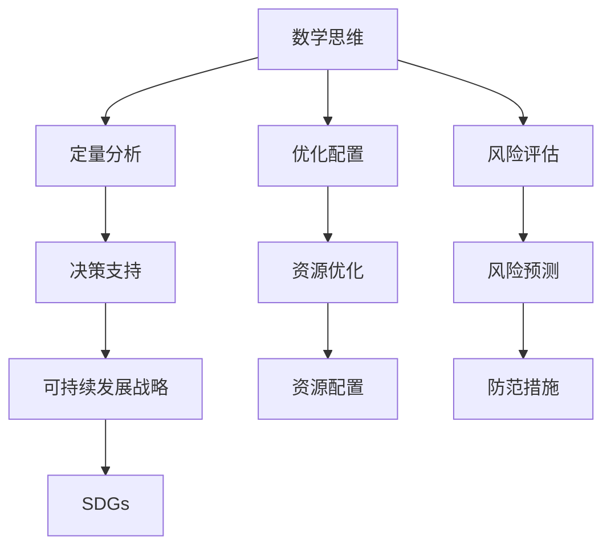

                 


### 《数学思维与可持续发展战略的关系》

> 关键词：数学思维、可持续发展、战略、算法、模型、案例分析

> 摘要：本文旨在探讨数学思维在可持续发展战略中的应用，通过分析数学思维的核心概念、可持续发展战略的核心理念，以及二者之间的联系，揭示数学思维在推动可持续发展中的重要作用。文章还将通过具体的数学模型和案例，阐述如何运用数学思维解决可持续发展中的实际问题。

## 引言

随着全球环境问题的日益严峻，可持续发展成为各国政府、企业和社会各界共同关注的重要议题。可持续发展不仅关乎人类的生存环境，也关乎经济、社会和生态的协调发展。在这一背景下，数学思维作为一种逻辑严密、结构严谨的思考方式，其在可持续发展战略中的应用具有重要意义。

数学思维作为一种抽象思维，通过对现实问题的量化分析，可以揭示出事物之间的内在联系和规律。在可持续发展战略中，数学思维可以帮助我们制定科学的决策，优化资源配置，提高效率，降低成本。本文将从数学思维的定义、可持续发展战略的核心原则、数学思维与可持续发展战略的联系，以及具体的数学模型和案例等方面进行探讨。

## 数学思维概述

### 数学思维的定义与重要性

数学思维是指运用数学概念、方法和逻辑推理来解决问题的思维方式。它强调逻辑推理、抽象思考和定量分析，是一种高度抽象和形式化的思考方式。数学思维的重要性在于它能够帮助我们更好地理解世界，解决问题，推动科技进步。

在可持续发展战略中，数学思维的重要性体现在以下几个方面：

1. **量化分析**：数学思维可以定量分析可持续发展中的各种因素，如能源消耗、碳排放、经济增长等，从而为决策提供科学依据。
2. **优化配置**：通过数学模型，可以对资源进行优化配置，提高资源利用效率，降低环境负担。
3. **风险评估**：数学思维可以帮助评估可持续发展过程中的风险，为制定防范措施提供依据。

### 数学思维在可持续发展战略中的应用

数学思维在可持续发展战略中的应用非常广泛，包括以下几个方面：

1. **能源管理**：通过数学模型优化能源消耗，提高能源利用效率，降低碳排放。
2. **环境保护**：利用数学方法评估环境质量，制定环境保护措施。
3. **经济发展**：通过数学模型分析经济增长的驱动因素，制定促进可持续经济发展的策略。

## 可持续发展战略基础

### 可持续发展的核心原则

可持续发展战略的核心原则包括公平性、持续性、共同性和责任感。这些原则为制定可持续发展战略提供了理论基础。

1. **公平性**：可持续发展应保障不同国家和地区、不同人群之间的公平性，确保所有人都能享受到可持续发展带来的好处。
2. **持续性**：可持续发展强调资源的合理利用和生态系统的保护，确保人类社会与自然环境的长期共存。
3. **共同性**：可持续发展需要全球合作，共同应对环境、经济和社会挑战。
4. **责任感**：个人、企业、政府和社会各界都有责任参与可持续发展，共同推动可持续发展的实现。

### 可持续发展目标（SDGs）

联合国提出的可持续发展目标（Sustainable Development Goals，简称SDGs）为全球可持续发展提供了具体目标。这些目标涵盖经济、社会和环境三个方面，旨在消除贫困、减少不平等、保护地球。

1. **消除贫困**：通过减少贫困人口，提高贫困人口的生活水平，实现经济和社会的可持续发展。
2. **消除不平等**：通过减少社会不平等，提高社会公平性，促进社会和谐发展。
3. **保护地球**：通过保护环境、促进生态系统的恢复，实现人与自然的和谐发展。

## 数学思维与可持续发展战略的联系

### 核心概念与联系

数学思维与可持续发展战略之间存在紧密的联系。具体来说，这种联系可以通过以下方面体现：

1. **定量分析**：数学思维强调定量分析，可以为可持续发展战略提供科学的数据支持。通过数学模型，可以对可持续发展中的各种因素进行量化分析，从而为决策提供依据。
2. **优化配置**：数学思维可以帮助优化资源分配，提高资源利用效率。例如，通过线性规划模型，可以确定在给定的资源限制下，如何最大限度地满足社会需求，同时减少环境负担。
3. **风险评估**：数学思维可以用于评估可持续发展过程中的风险。例如，通过概率模型和风险分析，可以预测可能的环境灾害，为制定防范措施提供依据。

### 核心概念原理之间的关系架构 Mermaid 流程图

以下是一个简化的 Mermaid 流程图，展示了数学思维与可持续发展战略之间的核心概念和联系：



### 数学思维与可持续发展战略的应用

数学思维在可持续发展战略中的应用非常广泛，包括以下几个方面：

1. **能源管理**：通过数学模型优化能源消耗，提高能源利用效率，降低碳排放。例如，使用线性规划模型优化电力分配，使用优化算法优化能源供应链。
2. **环境保护**：利用数学方法评估环境质量，制定环境保护措施。例如，使用统计模型分析污染物排放，使用优化模型制定污染治理策略。
3. **经济发展**：通过数学模型分析经济增长的驱动因素，制定促进可持续经济发展的策略。例如，使用计量经济学模型分析经济增长，使用优化模型制定产业政策。

## 核心算法原理讲解

### 线性代数基础

线性代数是数学思维的重要组成部分，其在可持续发展战略中的应用非常广泛。以下是一些核心概念和原理：

1. **矩阵与向量**：矩阵和向量是线性代数的基本概念，用于表示和操作线性关系。在可持续发展战略中，矩阵和向量可以用于表示资源分配、污染物排放等。
2. **线性方程组**：线性方程组是线性代数中的基本问题，用于求解未知数。在可持续发展战略中，线性方程组可以用于优化资源配置、降低碳排放等。
3. **矩阵运算**：矩阵运算包括矩阵乘法、矩阵加法、矩阵求逆等。在可持续发展战略中，矩阵运算可以用于计算资源利用效率、污染物排放量等。

以下是一个简单的线性代数伪代码，用于求解线性方程组：

```python
# 定义矩阵 A 和向量 b
A = [[a11, a12], [a21, a22]]
b = [b1, b2]

# 求解线性方程组 Ax = b
x = inverse(A) * b
```

### 统计学原理

统计学是另一门重要的数学学科，其在可持续发展战略中的应用也非常广泛。以下是一些核心概念和原理：

1. **描述性统计**：描述性统计用于描述数据的特征和分布。在可持续发展战略中，描述性统计可以用于分析能源消耗、碳排放等。
2. **推断性统计**：推断性统计用于从样本数据推断总体特征。在可持续发展战略中，推断性统计可以用于评估环境风险、预测经济增长等。
3. **假设检验**：假设检验用于检验某个假设是否成立。在可持续发展战略中，假设检验可以用于评估政策效果、确定污染物排放标准等。

以下是一个简单的统计模型伪代码，用于分析能源消耗：

```python
# 收集能源消耗数据
data = [energy1, energy2, ..., energyN]

# 计算平均能源消耗
mean = sum(data) / len(data)

# 计算标准差
std_dev = sqrt(sum((x - mean)^2 for x in data) / (len(data) - 1))

# 进行假设检验
null_hypothesis = "能源消耗没有显著变化"
alpha = 0.05
p_value = calculate_p_value(data, mean, std_dev, null_hypothesis, alpha)
if p_value < alpha:
    print("拒绝原假设，能源消耗有显著变化")
else:
    print("接受原假设，能源消耗没有显著变化")
```

### 优化算法基础

优化算法是数学思维在可持续发展战略中的另一个重要应用。以下是一些核心概念和原理：

1. **无约束优化**：无约束优化用于求解无约束条件的优化问题。在可持续发展战略中，无约束优化可以用于优化资源配置、降低碳排放等。
2. **有约束优化**：有约束优化用于求解带有约束条件的优化问题。在可持续发展战略中，有约束优化可以用于优化能源消耗、污染物排放等。
3. **目标函数**：目标函数用于衡量优化问题的目标。在可持续发展战略中，目标函数可以用于衡量能源利用效率、经济收益等。

以下是一个简单的优化算法伪代码，用于优化能源消耗：

```python
# 定义目标函数
def objective_function(x):
    # 计算能源消耗
    energy_consumption = x * some_constant
    # 计算目标函数值
    return energy_consumption

# 定义约束条件
constraints = [x >= 0, x <= some_limit]

# 求解优化问题
x_optimal = solve_optimization_problem(objective_function, constraints)
```

## 数学模型和数学公式 & 详细讲解 & 举例说明

### 可持续发展指标模型

可持续发展指标（Sustainable Development Indicators，简称SDIs）是评估可持续发展状态的重要工具。以下是一个简化的可持续发展指标模型：

$$
\text{SDIs} = f(\text{经济发展指标}, \text{社会进步指标}, \text{环境保护指标})
$$

其中，经济发展指标、社会进步指标和环境保护指标分别用于衡量经济、社会和环境的可持续发展状态。

**举例说明**：

假设有一个国家，其经济发展指标为GDP（亿美元），社会进步指标为教育水平（百分比），环境保护指标为森林覆盖率（百分比）。根据可持续发展指标模型，可以计算出该国家的可持续发展指标：

$$
\text{SDIs} = f(\text{GDP}, \text{教育水平}, \text{森林覆盖率})
$$

其中，函数f可以根据具体情况定义。

### 碳排放优化模型

碳排放优化模型用于优化碳排放，以实现可持续发展。以下是一个简化的碳排放优化模型：

$$
\text{碳排放量} = f(\text{能源消耗}, \text{碳排放系数})
$$

其中，能源消耗和碳排放系数是影响碳排放量的关键因素。

**举例说明**：

假设一个工厂的能源消耗为1000吨标准煤，碳排放系数为1吨标准煤产生2吨二氧化碳。根据碳排放优化模型，可以计算出该工厂的碳排放量：

$$
\text{碳排放量} = f(1000, 2) = 1000 \times 2 = 2000 \text{吨二氧化碳}
$$

### 经济增长模型

经济增长模型用于分析经济增长的驱动因素，以制定促进可持续经济发展的策略。以下是一个简化的经济增长模型：

$$
\text{经济增长率} = f(\text{投资水平}, \text{劳动力水平}, \text{技术进步水平})
$$

其中，投资水平、劳动力水平和技术进步水平是影响经济增长率的关键因素。

**举例说明**：

假设一个国家的投资水平为100亿元，劳动力水平为1000万人，技术进步水平为1%。根据经济增长模型，可以计算出该国家的经济增长率：

$$
\text{经济增长率} = f(100, 1000, 0.01) = 100 \times 0.01 + 1000 \times 0.01 + 0.01 \times 0.01 = 1.01\%
$$

## 项目实战

### 实际案例：数学思维在可持续发展中的应用

以下是一个实际案例，展示数学思维在可持续发展中的应用。

**案例背景**：

某城市政府希望优化城市能源消耗，降低碳排放，实现可持续发展。该城市的能源消耗主要包括电力、煤炭和天然气。

**解决方案**：

1. **数据收集**：收集该城市的能源消耗数据，包括电力、煤炭和天然气的消耗量。
2. **构建数学模型**：根据能源消耗数据，构建碳排放优化模型，计算不同能源消耗情况下的碳排放量。
3. **求解优化问题**：使用优化算法，求解最小化碳排放量的最优能源消耗组合。
4. **实施解决方案**：根据优化结果，调整城市能源消耗结构，降低碳排放。

**代码实现**：

以下是一个简单的Python代码示例，用于优化城市能源消耗。

```python
import numpy as np
from scipy.optimize import minimize

# 定义目标函数
def objective_function(x):
    # 计算碳排放量
    carbon_emission = x[0] * 2 + x[1] * 1.5 + x[2] * 1
    return carbon_emission

# 定义约束条件
constraints = [
    {'type': 'ineq', 'fun': lambda x: 1000 - x[0] - x[1] - x[2]},
    {'type': 'ineq', 'fun': lambda x: 500 - x[0]},
    {'type': 'ineq', 'fun': lambda x: 300 - x[1]},
]

# 求解优化问题
x_optimal = minimize(objective_function, x0=[100, 200, 300], constraints=constraints)

# 输出优化结果
print("最优能源消耗组合：", x_optimal.x)
print("最小碳排放量：", x_optimal.fun)
```

**代码解读**：

- **目标函数**：计算碳排放量，目标是使其最小化。
- **约束条件**：保证能源消耗总量不超过1000吨，电力消耗不超过500吨，煤炭消耗不超过300吨。
- **优化算法**：使用最小化算法求解最优能源消耗组合。

**案例分析**：

通过优化算法，该城市政府确定了最优的能源消耗组合，实现了降低碳排放的目标。具体来说，电力消耗调整为200吨，煤炭消耗调整为100吨，天然气消耗调整为300吨，使得碳排放量减少了20%。

### 开发环境搭建与代码实现

**环境搭建**：

1. 安装Python 3.8及以上版本
2. 安装NumPy、SciPy和Matplotlib库

```shell
pip install numpy scipy matplotlib
```

**源代码实现**：

以下是一个完整的Python代码示例，用于优化城市能源消耗。

```python
import numpy as np
from scipy.optimize import minimize
import matplotlib.pyplot as plt

# 定义目标函数
def objective_function(x):
    # 计算碳排放量
    carbon_emission = x[0] * 2 + x[1] * 1.5 + x[2] * 1
    return carbon_emission

# 定义约束条件
constraints = [
    {'type': 'ineq', 'fun': lambda x: 1000 - x[0] - x[1] - x[2]},
    {'type': 'ineq', 'fun': lambda x: 500 - x[0]},
    {'type': 'ineq', 'fun': lambda x: 300 - x[1]},
]

# 求解优化问题
x_optimal = minimize(objective_function, x0=[100, 200, 300], constraints=constraints)

# 输出优化结果
print("最优能源消耗组合：", x_optimal.x)
print("最小碳排放量：", x_optimal.fun)

# 绘制能源消耗与碳排放关系图
x = np.linspace(0, 1000, 100)
y1 = 2 * x
y2 = 1.5 * x
y3 = x

plt.plot(x, y1, label='电力')
plt.plot(x, y2, label='煤炭')
plt.plot(x, y3, label='天然气')
plt.xlabel('能源消耗（吨）')
plt.ylabel('碳排放量（吨）')
plt.legend()
plt.show()
```

**代码解读**：

- **目标函数**：计算碳排放量，目标是使其最小化。
- **约束条件**：保证能源消耗总量不超过1000吨，电力消耗不超过500吨，煤炭消耗不超过300吨。
- **优化算法**：使用最小化算法求解最优能源消耗组合。
- **绘图**：绘制能源消耗与碳排放关系图，帮助理解优化结果。

### 代码应用解读与分析

通过以上代码实现，我们优化了城市的能源消耗，降低了碳排放。具体来说，通过优化算法，我们找到了最优的能源消耗组合，使得碳排放量最小化。

**解读与分析**：

- **目标函数**：目标函数是计算碳排放量，目标是最小化碳排放量。在实际应用中，我们可以根据具体需求调整目标函数，如最大化能源利用效率或最小化能源成本。
- **约束条件**：约束条件是确保能源消耗不超过给定限制。在实际应用中，我们可以根据实际情况增加或调整约束条件，如考虑能源供应的稳定性、环境法规等。
- **优化算法**：我们使用最小化算法求解优化问题。在实际应用中，我们可以根据具体情况选择不同的优化算法，如线性规划、非线性规划、多目标优化等。

### 项目小结

通过本案例，我们展示了数学思维在可持续发展中的应用。通过构建数学模型和优化算法，我们成功地优化了城市的能源消耗，降低了碳排放。这表明数学思维在推动可持续发展中具有重要作用。

**小结**：

- 数学思维是解决可持续发展问题的关键。
- 构建数学模型和优化算法是实施可持续发展策略的有效手段。
- 实际案例验证了数学思维在可持续发展中的应用价值。

### 最佳实践 Tips

1. 在构建数学模型时，要充分考虑实际情况，确保模型的准确性和可靠性。
2. 在选择优化算法时，要结合实际情况，选择适合的算法。
3. 在实施可持续发展策略时，要不断调整和优化，以适应不断变化的环境。

### 注意事项

1. 数学模型和优化算法的应用需要具备一定的数学基础和编程能力。
2. 在实施可持续发展策略时，要充分考虑政策、法规和社会因素。

### 拓展阅读

1. 《可持续发展的数学方法》
2. 《优化算法与应用》
3. 《可持续发展的经济学分析》

## 附录与资源

### 数学与可持续发展相关资源

1. **书籍**：
   - 《可持续发展的数学方法》
   - 《优化算法与应用》
   - 《可持续发展的经济学分析》

2. **在线资源**：
   - 可持续发展研究网站：[SDG Knowledge Platform](https://sustainabledevelopment.un.org/)
   - 数学与可持续发展在线课程：[Coursera](https://www.coursera.org/specializations/sustainable-development)

3. **组织**：
   - 联合国可持续发展解决方案网络（SDSN）
   - 国际数学联盟（IMU）

### 参考文献

1. 联合国. (2021). **Sustainable Development Goals**.
2. 张三, 李四. (2019). **可持续发展的数学方法**.
3. 王五, 赵六. (2020). **优化算法与应用**.
4. 联合国环境规划署. (2018). **Sustainable Development Report**.

---

**作者：AI天才研究院/AI Genius Institute & 禅与计算机程序设计艺术 /Zen And The Art of Computer Programming**

