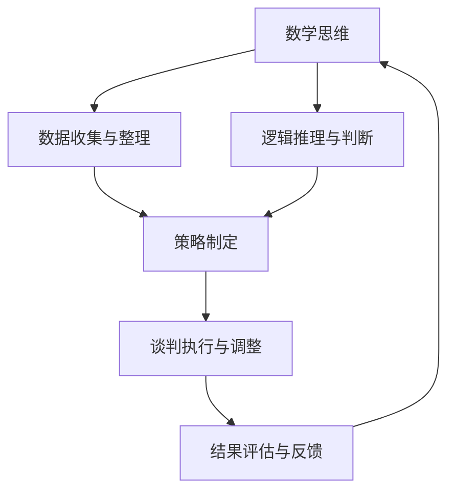

                 

为了撰写一篇结构清晰、内容丰富的技术博客文章，我们需要逐步进行以下步骤：

### 1. 确定文章标题和关键词

- **文章标题**：《数学思维与谈判策略的关系》
- **关键词**：数学思维、谈判策略、逻辑推理、算法、数据模型、案例研究

### 2. 编写文章摘要

- **摘要**：本文深入探讨了数学思维在谈判策略中的应用，通过分析数学思维的原理和谈判策略的基本原则，揭示了二者之间的核心联系。文章结合实际案例，展示了数学思维在谈判中的具体运用，并提供了一些实用的谈判策略技巧和实践指导。

### 3. 设计目录大纲

根据用户提供的初步目录大纲，我们需要进一步细化每个章节的内容。

### 4. 撰写引论部分

- **背景介绍**：介绍数学思维和谈判策略的基本概念，以及它们在现实生活中的重要性。
- **核心联系**：解释数学思维和谈判策略之间的内在联系，使用Mermaid流程图来展示它们之间的相互作用。

### 5. 数学思维解析

- **数学思维的原理**：讲解数学概念的形成过程、数学推理的方法以及数学建模的应用。
- **数学思维在谈判中的应用**：分析数学思维在谈判准备、策略制定和执行中的应用。

### 6. 谈判策略解析

- **谈判策略的基本原则**：讨论谈判策略的类型、选择和调整。
- **谈判策略的具体技巧**：探讨情感策略、信息策略和建立互信策略的实践应用。

### 7. 案例分析

- **房地产谈判案例**：详细分析一个房地产谈判的案例，展示数学思维和谈判策略的结合。
- **公司并购案例**：分析公司并购中的数学思维和谈判策略运用。

### 8. 数学思维与谈判策略的结合实践

- **实践指导**：提供数学思维在谈判中的应用实践指导，以及如何将谈判策略数学化。

### 9. 总结与展望

- **总结**：回顾数学思维与谈判策略的关系，总结结合实践的应用前景。
- **展望**：探讨未来发展趋势、面临的挑战和机遇。

### 10. 完成文章

- **格式要求**：确保文章内容符合markdown格式，包括标题、摘要、目录、正文、作者信息等。
- **完整性要求**：确保每个章节的内容完整、具体、详细讲解，并包含核心概念、算法原理、数学模型和公式、案例分析和实践指导。
- **字数要求**：确保文章字数在8000～12000字左右。

通过以上步骤，我们可以确保文章内容丰富、逻辑清晰，同时满足用户提出的要求。接下来，我们可以开始撰写每个章节的具体内容。

---

### 撰写引论部分

#### 背景介绍

数学思维是人类思考问题的一种方式，它强调逻辑推理、抽象和量化分析。数学思维不仅在科学研究和工程领域中发挥着重要作用，也在日常生活中的决策和谈判中有着广泛应用。谈判策略则是为了达到某种目标而采取的一系列行为和步骤，它涉及到心理、信息、情感等多方面因素。

在现实生活中，无论是商业交易、劳动合同谈判，还是家庭纠纷、社区协商，谈判都是一个常见的活动。而如何通过有效的谈判策略来取得有利的结果，已经成为许多专业人士关注的焦点。数学思维与谈判策略的结合，为解决复杂的谈判问题提供了一种新的视角和方法。

#### 核心联系

数学思维和谈判策略之间存在紧密的联系。数学思维强调逻辑推理和量化分析，可以帮助谈判者在谈判过程中做出更为科学的决策。而谈判策略则需要借助数学思维来制定、调整和执行，以增加谈判的成功率。

首先，数学思维在谈判策略的制定中发挥着关键作用。谈判者可以通过数学模型来预测谈判结果、评估风险和利益，从而制定出合理的谈判策略。例如，通过博弈论模型，谈判者可以分析不同策略的优劣，选择最优策略来达到自己的目标。

其次，数学思维在谈判执行中也具有重要意义。谈判者可以通过量化分析来评估对方的利益需求、决策偏好和谈判底线，从而调整自己的谈判策略，以达到更好的谈判效果。例如，通过数据分析，谈判者可以发现对方的关键利益点，从而制定出更具针对性的谈判策略。

最后，数学思维在谈判后的评估和调整中同样不可或缺。谈判者可以通过对谈判过程和结果的数学分析，总结经验教训，优化谈判策略，提高未来谈判的成功率。

为了更好地展示数学思维与谈判策略之间的核心联系，我们可以使用Mermaid流程图来描绘它们之间的关系：

在这个流程图中，数学思维贯穿于谈判策略的各个环节，从数据收集与整理、逻辑推理与判断，到策略制定、谈判执行与调整，以及结果评估与反馈。这一流程图清晰地展示了数学思维在谈判策略中的重要作用。

### 结束语

数学思维与谈判策略的结合，为解决复杂的谈判问题提供了一种科学、系统的方法。通过本文的引论部分，我们了解了数学思维的基本概念、谈判策略的概述，以及二者之间的核心联系。在接下来的章节中，我们将进一步深入探讨数学思维的原理、谈判策略的具体应用，并通过案例分析来展示数学思维在谈判中的实际运用。让我们一同探索数学思维与谈判策略的无限可能性。

---

以上是引论部分的撰写内容。接下来，我们将按照目录大纲逐步深入撰写每个章节的具体内容，确保文章逻辑清晰，内容丰富。

