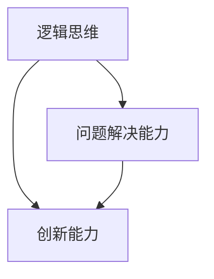

                 


### 引言

在现代社会的快速发展中，数学教育与创新人才培养的关系日益受到广泛关注。数学教育不仅是对学生逻辑思维和问题解决能力的培养，更是创新人才成长的重要基础。本文旨在深入探讨数学教育与创新人才培养之间的关系，分析数学教育在培养创新人才过程中的作用，以及如何通过优化数学教育方法和政策支持，促进创新人才的培养。

首先，本文将回顾数学教育的发展历程，从传统数学教育到现代数学教育，探讨其定义与目标。接着，我们将分析数学教育的教学方法，包括传统方法和现代新方法，以及如何将不同教学方法进行优化与融合。随后，我们将聚焦于创新人才的培养，探讨创新人才的特征、培养路径和面临的挑战。

在此基础上，本文将详细论述数学教育如何促进创新人才的培养，包括数学教育对创新思维、创新能力以及团队合作的影响。接着，我们将探讨数学教育与创新创业教育的结合，通过具体案例来说明数学模型和数学方法在创新创业中的应用。

此外，本文还将探讨数学教育与创新人才培养的政策与支持，包括教育政策改革、创新人才培养政策的支持以及政府与企业合作的创新人才培养模式。最后，我们将展望数学教育与创新人才培养的未来发展趋势，提出挑战与机遇，并给出相应的建议。

通过这篇文章，我们希望能够为教育工作者、政策制定者和学生提供有价值的参考，促进数学教育与创新人才培养的有机结合，培养出更多具有创新精神和实践能力的人才。

### 第一部分：数学教育的基础

#### 第1章：数学教育的定义与目标

##### 1.1 数学教育的定义

数学教育是指通过数学知识和技能的传授，培养学生的逻辑思维能力、抽象思维能力和问题解决能力的教育活动。传统数学教育主要侧重于知识的传授和技能的培养，强调基础知识的扎实和计算能力的提高。而现代数学教育则更加注重数学思想和方法的应用，强调培养学生的创新精神和实践能力。

传统数学教育与现代数学教育的区别主要体现在以下几个方面：

1. **教育目标**：传统数学教育主要注重基础知识的掌握和计算能力的培养，而现代数学教育则更加注重学生的创新能力和实际应用能力的培养。
2. **教育内容**：传统数学教育侧重于数学理论的讲解和数学公式的推导，而现代数学教育则更加注重数学模型的应用和实践。
3. **教学方法**：传统数学教育以教师为中心，采用讲解式教学法，而现代数学教育则更加注重学生的主动参与和合作学习，采用探究式教学法和项目驱动教学法。

##### 1.2 数学教育的目标

数学教育的目标主要包括以下几个方面：

1. **培养逻辑思维能力**：逻辑思维是数学教育的核心目标之一。通过数学教育，学生能够学会运用逻辑思维方法，分析和解决实际问题。
2. **培养解决问题的能力**：数学教育能够培养学生的解决问题的能力，使他们能够运用数学知识和方法，解决各种实际问题，提高问题解决的效率和质量。
3. **培养创新能力**：数学教育能够激发学生的创新能力，培养他们运用数学知识和方法进行创新思维和实践的能力。

以下是具体的举例说明：

1. **培养逻辑思维能力**：例如，在解决数学问题时，学生需要运用逻辑推理的方法，从已知条件出发，逐步推导出问题的解。这种逻辑思维能力的培养，不仅有助于数学问题的解决，也有助于其他学科问题的解决。

2. **培养解决问题的能力**：例如，在现实生活中，学生需要运用数学知识来解决各种问题，如购物预算、房屋贷款计算、投资收益分析等。通过这些实际问题的解决，学生能够更好地理解和应用数学知识，提高解决问题的能力。

3. **培养创新能力**：例如，在数学建模比赛中，学生需要运用数学知识和方法，解决实际问题，提出创新的解决方案。这种创新能力的培养，不仅有助于学生参加各种数学竞赛，也有助于他们在未来工作中提出创新性的解决方案。

##### 1.3 数学教育的核心概念与联系

数学教育的核心概念包括逻辑思维、问题解决能力和创新能力。这些核心概念之间存在着密切的联系：

1. **逻辑思维是基础**：逻辑思维能力是数学教育的基础，是其他能力的前提。只有具备良好的逻辑思维能力，学生才能更好地理解和应用数学知识。

2. **问题解决能力是应用**：问题解决能力是将逻辑思维能力应用于实际问题的能力。通过解决实际问题，学生能够更好地理解和掌握数学知识，提高问题解决的能力。

3. **创新能力是提升**：创新能力是在逻辑思维和问题解决能力的基础上，进一步发展和提升的能力。通过创新能力的培养，学生能够提出新的解决方案，解决更为复杂的问题。

以下是核心概念与联系的关系架构 Mermaid 流程图：



通过这个流程图，我们可以清晰地看到逻辑思维、问题解决能力和创新能力之间的关系。逻辑思维是基础，问题解决能力是应用，创新能力是提升。这三者相互关联，共同构成了数学教育的核心。

### 第2章：数学教育的教学方法

#### 2.1 传统的数学教学方法

传统的数学教学方法主要包括讲解式教学法和问题导向教学法。这两种方法各有优缺点，适用于不同的教学场景。

##### 2.1.1 讲解式教学法

讲解式教学法是传统数学教育中最为常见的一种教学方法。它以教师为中心，通过讲解数学概念、原理和公式，传授数学知识。以下是讲解式教学法的优点和局限：

1. **优点**：

   - **系统性强**：讲解式教学法能够系统地传授数学知识，使学生全面了解数学的基本概念和原理。
   - **高效性**：教师通过讲解，能够在较短的时间内传授大量的数学知识，提高教学效率。
   - **针对性**：教师可以根据学生的实际情况，有针对性地讲解重点和难点，帮助学生更好地理解和掌握数学知识。

2. **局限**：

   - **缺乏互动**：讲解式教学法缺乏学生的主动参与和互动，容易导致学生被动接受知识，缺乏思考和探究的机会。
   - **忽视应用**：讲解式教学法过于侧重理论知识的传授，忽视数学知识的实际应用，导致学生难以将数学知识应用于实际问题中。
   - **依赖教师**：讲解式教学法的有效性很大程度上依赖于教师的讲解能力和水平，教师的能力不足可能导致教学效果不佳。

##### 2.1.2 问题导向教学法

问题导向教学法是以学生为中心的教学方法，通过提出问题，引导学生主动思考和解决问题，培养他们的逻辑思维和问题解决能力。以下是问题导向教学法的优点和局限：

1. **优点**：

   - **激发兴趣**：问题导向教学法能够激发学生的兴趣和好奇心，使他们更加主动地参与学习。
   - **培养能力**：通过解决问题，学生能够培养逻辑思维和问题解决能力，提高解决实际问题的能力。
   - **培养合作精神**：问题导向教学法通常需要学生进行小组合作，培养他们的团队合作精神。

2. **局限**：

   - **时间消耗**：问题导向教学法需要学生花费大量时间进行思考和解决问题，可能导致教学进度受到影响。
   - **教师引导**：问题导向教学法的有效性很大程度上依赖于教师的引导和指导，教师的能力不足可能导致教学效果不佳。
   - **资源依赖**：问题导向教学法需要丰富的教学资源和实际案例，资源不足可能导致教学效果不理想。

##### 2.1.3 讲解式教学法和问题导向教学法的优缺点对比

| 方法 | 优点 | 局限 |
| ---- | ---- | ---- |
| 讲解式教学法 | 系统性强、高效性、针对性 | 缺乏互动、忽视应用、依赖教师 |
| 问题导向教学法 | 激发兴趣、培养能力、培养合作精神 | 时间消耗、教师引导、资源依赖 |

从上表可以看出，讲解式教学法和问题导向教学法各有优缺点，适用于不同的教学场景。在实际教学中，教师可以根据教学目标和学生的实际情况，灵活运用这两种教学方法，以达到最佳教学效果。

#### 2.2 现代数学教育的新方法

随着教育技术的发展，现代数学教育逐渐引入了新的教学方法，如项目驱动教学法和探究式教学法。这些方法更加注重学生的主动参与和实际应用，有助于培养学生的创新能力和实践能力。

##### 2.2.1 项目驱动教学法

项目驱动教学法是以项目为中心的教学方法，通过设计实际项目，引导学生主动参与和完成项目任务，培养他们的实践能力和团队合作精神。以下是项目驱动教学法的优点和局限：

1. **优点**：

   - **实际应用**：项目驱动教学法能够将数学知识应用于实际项目中，使学生学习到的知识更具实用性和应用性。
   - **培养能力**：通过项目任务的完成，学生能够培养实践能力和团队合作精神，提高解决实际问题的能力。
   - **激发兴趣**：实际项目能够激发学生的兴趣和好奇心，使他们更加主动地参与学习。

2. **局限**：

   - **设计难度**：项目驱动教学法需要教师设计具有实际意义和挑战性的项目，这需要教师具备较高的项目设计能力。
   - **教学资源**：项目驱动教学法需要丰富的教学资源和实际案例，资源不足可能导致教学效果不理想。
   - **教学进度**：项目驱动教学法可能需要更多的时间来完成项目任务，可能影响教学进度。

##### 2.2.2 探究式教学法

探究式教学法是以问题探究为中心的教学方法，通过提出问题，引导学生主动探究和解决问题，培养他们的逻辑思维和创新能力。以下是探究式教学法的优点和局限：

1. **优点**：

   - **培养能力**：探究式教学法能够培养学生的逻辑思维和创新能力，使他们具备解决复杂问题的能力。
   - **激发兴趣**：探究式教学法能够激发学生的兴趣和好奇心，使他们更加主动地参与学习。
   - **培养探究精神**：通过问题的探究，学生能够培养探究精神，提高自主学习的能力。

2. **局限**：

   - **时间消耗**：探究式教学法需要学生花费大量时间进行探究和解决问题，可能影响教学进度。
   - **教师引导**：探究式教学法的有效性很大程度上依赖于教师的引导和指导，教师的能力不足可能导致教学效果不佳。
   - **教学资源**：探究式教学法需要丰富的教学资源和实际案例，资源不足可能导致教学效果不理想。

##### 2.2.3 项目驱动教学法和探究式教学法的优缺点对比

| 方法 | 优点 | 局限 |
| ---- | ---- | ---- |
| 项目驱动教学法 | 实际应用、培养能力、激发兴趣 | 设计难度、教学资源、教学进度 |
| 探究式教学法 | 培养能力、激发兴趣、培养探究精神 | 时间消耗、教师引导、教学资源 |

从上表可以看出，项目驱动教学法和探究式教学法各有优缺点，适用于不同的教学场景。在实际教学中，教师可以根据教学目标和学生的实际情况，灵活运用这两种教学方法，以达到最佳教学效果。

#### 2.3 教学方法的优化与融合

为了充分发挥不同教学方法的优点，克服其局限，现代数学教育提倡将多种教学方法进行优化与融合。以下是如何将不同教学方法进行优化与融合的建议：

1. **讲解式教学法与问题导向教学法的融合**：

   - **步骤一**：教师可以通过讲解式教学法，系统地传授数学知识和概念，为学生打下扎实的理论基础。
   - **步骤二**：在讲解过程中，教师可以结合问题导向教学法，提出问题，引导学生主动思考和探究。
   - **步骤三**：教师可以根据学生的回答和探究结果，进行针对性的讲解和指导，帮助学生更好地理解和掌握数学知识。

2. **项目驱动教学法和探究式教学法的融合**：

   - **步骤一**：教师可以设计实际项目，引导学生进行项目任务的完成，培养他们的实践能力和团队合作精神。
   - **步骤二**：在项目任务中，教师可以提出问题，引导学生进行探究和解决，培养他们的逻辑思维和创新能力。
   - **步骤三**：教师可以根据学生的项目完成情况和探究结果，进行评价和反馈，帮助学生更好地理解和应用数学知识。

通过以上优化与融合，现代数学教育能够更好地发挥不同教学方法的优点，提高教学效果，培养具有创新能力和实践能力的人才。

### 第二部分：创新人才的培养

#### 第3章：创新人才的特征与培养

##### 3.1 创新人才的特征

创新人才是指那些具备创新思维、创新能力、团队合作能力和领导能力的人才。他们的特征主要体现在以下几个方面：

1. **创新思维**：

   创新思维是指能够从不同角度看待问题，发现新问题和解决方案的能力。创新人才通常具备以下几种思维特点：

   - **发散思维**：能够从不同角度和层面思考问题，寻找多种可能的解决方案。
   - **批判思维**：能够对现有的解决方案进行批判性思考，发现其中的不足和改进之处。
   - **整合思维**：能够将不同的信息和观点进行整合，形成新的见解和方案。

2. **创新能力**：

   创新能力是指将创新思维应用于实际问题，提出新的解决方案和创造新的价值的能力。创新人才通常具备以下几种能力：

   - **问题解决能力**：能够迅速识别问题，并提出有效的解决方案。
   - **创造性思维**：能够在面对挑战和困境时，提出独特的解决方案。
   - **技术能力**：具备一定的技术背景和专业知识，能够将创新思维和技术知识相结合。

3. **团队合作能力**：

   团队合作能力是指能够与他人协作，共同完成任务的能力。创新人才通常具备以下几种团队合作能力：

   - **沟通能力**：能够有效地与他人沟通，表达自己的想法和观点。
   - **协调能力**：能够协调团队内部的资源和关系，确保团队目标的实现。
   - **领导能力**：能够在团队中发挥领导作用，带领团队共同前进。

4. **领导能力**：

   领导能力是指能够激发和引领团队成员，实现共同目标的能力。创新人才通常具备以下几种领导能力：

   - **愿景领导**：能够为团队描绘清晰的愿景，激发团队成员的积极性。
   - **决策能力**：能够在关键时刻做出正确的决策，为团队指明方向。
   - **激励能力**：能够激励团队成员，激发他们的潜力和创造力。

##### 3.2 创新人才的培养

创新人才的培养是一个长期而复杂的过程，涉及早期教育、高等教育和职业教育等多个阶段。以下是对每个阶段的详细探讨：

1. **早期教育**：

   早期教育阶段是培养创新人才的基础。在这个阶段，家长和教育者可以通过以下方式来培养孩子的创新能力：

   - **鼓励探索**：为孩子提供丰富的探索机会，鼓励他们提问和尝试，培养他们的好奇心和探索精神。
   - **培养思维习惯**：通过故事、游戏等方式，培养孩子的发散思维、批判思维和整合思维。
   - **激发创造力**：提供创造性的活动，如绘画、手工制作等，激发孩子的创造力。

2. **高等教育**：

   高等教育阶段是培养创新人才的关键阶段。在这个阶段，高校可以通过以下方式来培养创新人才：

   - **课程设置**：设置多样化的课程，涵盖科学、技术、艺术等多个领域，培养学生的跨学科思维。
   - **实践教学**：加强实践教学，提供实验、实习、项目等机会，让学生在实践中锻炼创新能力。
   - **科研支持**：鼓励学生参与科研项目，提供科研经费和技术支持，激发他们的科研兴趣和创新能力。

3. **职业教育**：

   职业教育阶段是培养创新人才的重要阶段。在这个阶段，职业院校和企业可以通过以下方式来培养创新人才：

   - **技能培训**：提供专业的技能培训，使学生掌握行业所需的技能，提高他们的职业竞争力。
   - **实践锻炼**：提供实践机会，如实习、实训等，让学生在实际工作中锻炼创新能力。
   - **企业合作**：与企事业单位合作，开展产学研结合项目，让学生参与实际项目的研发和实施，培养他们的创新能力。

##### 3.3 创新人才培养的挑战与对策

尽管创新人才的培养具有重要意义，但在实际过程中也面临诸多挑战。以下是对这些挑战的探讨以及相应的对策：

1. **教育资源不足**：

   在许多地区，尤其是农村和贫困地区，教育资源相对匮乏，难以满足创新人才培养的需求。对策包括：

   - **教育公平**：加大教育投入，确保教育资源公平分配，使每个孩子都能享受到优质的教育。
   - **教育资源共享**：通过互联网等手段，实现教育资源的共享，提高教育资源的利用效率。

2. **创新能力评价**：

   目前，许多评价体系过于注重考试成绩，忽视学生的创新能力和实践能力。对策包括：

   - **多元化评价**：建立多元化的评价体系，包括考试成绩、创新能力、实践能力等多方面评价。
   - **过程评价**：注重评价学生的学习过程，鼓励学生主动参与和探索，关注学生的成长和发展。

3. **教师素质**：

   教师的素质直接影响创新人才的培养。对策包括：

   - **教师培训**：加强教师的培训，提高他们的教育理念和教学方法，培养他们的创新能力。
   - **教师激励**：提高教师的待遇和福利，激发他们的工作积极性，提高教学质量。

通过以上对策，我们可以逐步克服创新人才培养过程中面临的挑战，培养出更多具有创新精神和实践能力的人才，为社会的进步和发展做出贡献。

### 第三部分：数学教育与创新人才培养的结合

#### 第4章：数学教育如何促进创新人才培养

数学教育在创新人才培养中起着至关重要的作用。它不仅能够培养学生的逻辑思维和问题解决能力，还能激发他们的创新思维和创新能力。以下是数学教育如何促进创新人才培养的详细探讨。

##### 4.1 数学教育对创新思维的影响

1. **逻辑思维**：

   逻辑思维是创新思维的基础。数学教育通过教授数学概念、定理和证明方法，培养了学生的逻辑思维能力。这种逻辑思维不仅有助于学生在数学问题中找到解决方案，还能在解决其他领域的问题时发挥重要作用。以下是逻辑思维在数学教育中的应用示例：

   - **数学问题求解**：在解决数学问题时，学生需要运用逻辑推理方法，从已知条件出发，逐步推导出问题的解。这种逻辑思维的训练有助于学生在面对复杂问题时，能够条理清晰地进行分析和解决。

   - **伪代码阐述**：
     ```python
     def solve_equation(a, b, c):
         # 逻辑思维：运用数学方法求解一元二次方程
         delta = b**2 - 4*a*c
         if delta > 0:
             root1 = (-b + sqrt(delta)) / (2*a)
             root2 = (-b - sqrt(delta)) / (2*a)
             return root1, root2
         else:
             return "无实数解"
     ```
     在这个伪代码中，我们运用了逻辑思维方法，通过数学公式求解一元二次方程。

2. **发散思维**：

   发散思维是指从不同角度思考问题，寻找多种可能的解决方案。数学教育通过多种数学方法的应用，培养了学生的发散思维。以下是发散思维在数学教育中的应用示例：

   - **多解问题**：一些数学问题可能有多个解，学生需要从不同角度思考，找到所有可能的解。这种发散思维的训练有助于学生在面对复杂问题时，能够从多个角度进行分析和解决。

   - **探究问题**：教师可以设计一些开放性的数学问题，鼓励学生进行探究和思考，培养他们的发散思维。例如，探究不同几何形状的面积计算方法，或探究函数的性质和应用。

3. **整合思维**：

   整合思维是指将不同的信息和观点进行整合，形成新的见解和方案。数学教育通过整合不同的数学知识和方法，培养了学生的整合思维能力。以下是整合思维在数学教育中的应用示例：

   - **综合应用**：在数学学习过程中，学生需要将不同的数学知识进行综合应用，解决实际问题。例如，将代数、几何和三角函数知识整合起来，解决物理问题。

   - **项目驱动**：教师可以设计项目驱动教学，引导学生综合运用数学知识和方法，解决实际问题。例如，设计一个数学模型来分析城市交通流量，或设计一个算法来优化资源分配。

##### 4.2 数学教育对创新能力的影响

1. **数学模型的应用**：

   数学模型是数学教育中的重要内容，它能够将实际问题抽象为数学问题，通过数学方法进行求解。数学教育通过数学模型的应用，培养了学生的创新能力。以下是数学模型在数学教育中的应用示例：

   - **线性规划**：线性规划是一种数学模型，用于解决资源分配问题。学生可以通过学习线性规划，掌握如何将实际问题转化为数学问题，并运用数学方法求解。

   - **伪代码阐述**：
     ```python
     def optimize_resources(books, computers, budget):
         # 数学模型：线性规划
         # 目标函数：最大化资源利用
         # 约束条件：预算限制
         # 求解方法：线性规划算法
         max_utilization = linear_programming(books, computers, budget)
         return max_utilization
     ```
     在这个伪代码中，我们运用了线性规划方法，来优化资源的利用。

2. **数学问题的求解**：

   数学问题的求解是数学教育的核心内容之一，它培养了学生的解决问题能力和创新能力。以下是数学问题求解在数学教育中的应用示例：

   - **证明问题**：在数学学习中，学生需要证明数学定理和公式的正确性。这种证明问题的训练有助于学生培养逻辑思维和创新能力。

   - **应用问题**：在现实生活中，数学问题随处可见，学生需要运用数学知识来解决实际问题。例如，通过计算利息和本金，解决理财问题。

##### 4.3 数学教育对团队合作的影响

1. **项目合作**：

   数学教育中的项目合作能够培养学生的团队合作能力。在项目中，学生需要分工合作，共同解决问题，这有助于培养他们的团队合作精神。以下是项目合作在数学教育中的应用示例：

   - **小组项目**：教师可以设计小组项目，如数学建模竞赛或数学课题研究，让学生在小组中分工合作，共同完成任务。

   - **角色分配**：在项目中，学生可以扮演不同的角色，如问题提出者、解决方案设计者、实施者等，这有助于培养学生的团队协作能力和领导能力。

2. **团队合作能力的培养**：

   数学教育中的团队合作活动能够有效地培养学生的团队合作能力。以下是团队合作能力培养在数学教育中的应用示例：

   - **团队合作游戏**：教师可以设计一些团队合作游戏，如数学拼图、数学接龙等，让学生在游戏中体验团队合作的重要性。

   - **团队合作课程**：教师可以开设专门的团队合作课程，通过案例分析和角色扮演等活动，培养学生的团队合作能力。

通过数学教育，学生不仅能够掌握数学知识和技能，还能培养他们的逻辑思维、创新能力和团队合作能力。数学教育在创新人才培养中具有不可替代的重要作用，它为学生的未来发展奠定了坚实的基础。

### 第5章：数学教育与创新创业教育

#### 5.1 创新创业教育的目标与内容

创新创业教育是指通过系统的教学和实践，培养学生的创新精神、创业能力和实践技能，使他们能够在未来社会中独立创业或创新性地开展工作的教育。其目标主要包括以下几个方面：

1. **培养创新精神**：

   创新精神是指敢于挑战现状、勇于尝试新事物、持续追求进步的态度和习惯。通过创新创业教育，学生能够培养敢于冒险、勇于尝试、持续改进的创新精神。

2. **培养创业能力**：

   创业能力是指能够在市场中发现机会、创造价值、组织和管理企业的能力。通过创新创业教育，学生能够学习如何撰写商业计划书、评估市场机会、管理企业运营等，提高他们的创业能力。

3. **培养实践技能**：

   实践技能是指将理论知识应用于实际操作的能力。通过创新创业教育，学生能够参与各种实践活动，如创业竞赛、社会实践、企业实习等，提高他们的实际操作能力和问题解决能力。

创新创业教育的内容通常包括以下几个方面：

1. **创新思维训练**：

   创新思维训练是指通过多种方法和手段，培养学生的发散思维、批判思维和整合思维能力。例如，通过思维导图、头脑风暴、案例分析等训练方式，激发学生的创新思维。

2. **创业知识教育**：

   创业知识教育是指传授学生关于创业的基本知识，如市场调研、商业计划书撰写、市场营销策略、财务管理等。通过这些教育，学生能够掌握创业的基本理论和实践方法。

3. **创业实践训练**：

   创业实践训练是指通过实际操作，让学生体验创业的全过程。例如，通过模拟创业、创业竞赛、社会实践等活动，让学生在实践中学习和锻炼创业能力。

4. **创业心理辅导**：

   创业心理辅导是指通过心理咨询、心理训练等方式，帮助学生应对创业过程中可能遇到的心理挑战，如压力、挫折、孤独等。通过这些辅导，学生能够保持积极的心态，更好地应对创业挑战。

#### 5.2 数学教育与创新创业教育的结合

数学教育与创新创业教育的结合，能够充分发挥数学教育在培养创新思维、创业能力和实践技能方面的优势，提升学生的整体创新能力。以下是数学教育与创新创业教育的具体结合方式：

1. **数学模型在创新创业中的应用**：

   数学模型是数学教育中的重要内容，它能够将现实问题抽象为数学问题，通过数学方法进行求解。在创新创业教育中，学生可以通过学习数学模型，掌握如何将实际问题转化为数学问题，并提出解决方案。

   - **市场预测**：通过建立数学模型，可以对市场趋势进行预测，为创业决策提供依据。例如，使用时间序列模型预测市场需求，或使用回归模型分析客户行为。

   - **资源优化**：通过线性规划、动态规划等数学模型，可以优化资源配置，提高企业运营效率。例如，使用线性规划优化生产计划，或使用动态规划优化物流配送。

2. **数学方法在创新创业教育中的应用**：

   数学方法在创新创业教育中的应用，能够帮助学生更好地理解和应用数学知识，提高问题解决能力和创业能力。

   - **数据挖掘**：通过数学方法进行数据挖掘，可以分析大量数据，发现潜在的商业机会。例如，使用聚类分析识别市场细分，或使用关联规则分析客户偏好。

   - **风险管理**：通过概率论和数理统计方法，可以评估创业项目中的风险，制定相应的风险控制策略。例如，使用概率模型评估市场风险，或使用统计方法评估财务风险。

3. **数学建模在创新创业竞赛中的应用**：

   数学建模在创新创业竞赛中是一种常见的形式，通过数学建模解决实际问题，展示学生的创新能力和实践能力。以下是一些数学建模在创新创业竞赛中的应用示例：

   - **环保问题**：例如，通过数学建模分析环境保护方案的成本效益，提出最优的环保策略。

   - **交通问题**：例如，通过数学建模优化城市交通系统，提高交通效率，减少交通拥堵。

   - **经济问题**：例如，通过数学建模分析经济增长模式，预测未来经济发展趋势，为政府和企业提供决策依据。

通过数学教育与创新创业教育的结合，学生能够在实践中锻炼数学建模能力和问题解决能力，提高他们的创新能力和创业能力，为未来的创新创业事业奠定坚实的基础。

#### 5.3 数学教育与创新创业教育的实践案例

为了更好地理解数学教育如何促进创新创业教育，以下将介绍两个实践案例，展示数学模型和数学方法在创新创业中的应用。

##### 案例一：数学建模在创新创业中的应用

**项目背景**：
一家初创公司致力于开发智能家居系统，旨在通过物联网技术提升家庭生活的便利性和安全性。公司需要制定一套有效的市场推广策略，以吸引潜在客户。

**数学模型**：
公司决策者使用市场预测模型来预测市场需求，并使用线性规划模型优化营销预算分配。

**数学方法应用**：
1. **市场预测模型**：
   通过收集历史销售数据、市场调研数据以及相关经济指标，公司使用时间序列分析和回归分析建立市场预测模型，预测未来6个月的市场需求。

   ```latex
   \text{需求预测模型：} \hat{D}_{t} = f(\text{历史数据}, \text{经济指标})
   ```

2. **线性规划模型**：
   为了最大化市场推广效果，公司使用线性规划模型优化营销预算的分配，确保在不同营销渠道上的投入达到最优。

   ```latex
   \text{优化模型：} \max Z = \sum_{i} c_{i}x_{i} \quad \text{subject to} \quad Ax \leq b
   ```

**结果**：
通过市场预测模型，公司能够准确预测未来市场需求，从而制定合理的市场推广策略。线性规划模型帮助公司优化营销预算分配，实现了市场推广效果的最大化。

##### 案例二：数学方法在创业项目中的应用

**项目背景**：
一家初创公司专注于开发一款基于大数据分析的金融服务平台，旨在帮助投资者进行风险控制和投资决策。

**数学模型**：
公司使用概率模型和统计方法来评估投资风险，使用优化模型来制定投资策略。

**数学方法应用**：
1. **概率模型**：
   公司使用概率模型评估投资项目的风险，例如贝叶斯网络模型，用于分析不同投资策略的概率分布。

   ```latex
   \text{贝叶斯网络模型：} P(A|B) = \frac{P(B|A)P(A)}{P(B)}
   ```

2. **统计方法**：
   公司使用统计方法分析历史市场数据，识别市场趋势和风险因子，为投资决策提供依据。

   ```latex
   \text{回归模型：} y = \beta_0 + \beta_1x_1 + \beta_2x_2 + \cdots + \epsilon
   ```

3. **优化模型**：
   公司使用线性规划或动态规划模型来制定最优投资组合，确保投资组合的风险和收益达到最优。

   ```latex
   \text{优化模型：} \min \sum_{i} w_{i}r_{i} \quad \text{subject to} \quad \sum_{i} w_{i} = 1, w_{i} \geq 0
   ```

**结果**：
通过概率模型和统计方法，公司能够准确评估投资风险，识别市场机会。优化模型帮助公司制定最优投资策略，提高了投资组合的收益和风险控制能力。

这两个案例展示了数学模型和数学方法在创新创业中的实际应用，证明了数学教育在培养创新人才和促进创新创业中的重要性。通过数学教育，学生能够掌握关键的分析工具和方法，提升他们的创新能力和创业能力，为未来的创新创业事业打下坚实基础。

### 第6章：数学教育与创新人才培养的政策与支持

#### 6.1 数学教育政策的改革与完善

为了培养更多的创新人才，许多国家和地区都在积极改革和完善数学教育政策。以下是一些主要政策和改革方向：

1. **教育公平**：

   教育公平是数学教育政策改革的核心目标之一。为了确保每个孩子都能接受到高质量的数学教育，政府需要加大对教育资源的投入，尤其是对农村和贫困地区学校的教育资源支持。

   - **资源分配**：通过优化教育资源配置，确保每个学生都能获得充足的数学教材、教学设备和师资力量。
   - **师资培训**：加强对教师的培训，提高他们的数学教学水平和教育理念，培养更多优秀的数学教师。

2. **课程改革**：

   课程改革是提高数学教育质量的重要手段。通过改革数学课程内容和方法，使学生更好地理解和应用数学知识。

   - **跨学科整合**：将数学与其他学科（如科学、技术、工程、艺术等）相结合，培养学生的跨学科思维和综合应用能力。
   - **项目式学习**：引入项目式学习，通过实际项目让学生参与数学问题的解决，提高他们的实践能力和创新思维。

3. **教育技术**：

   教育技术的应用可以大大提高数学教育的效果。政府需要加大对教育技术的投资，推动数学教育的现代化。

   - **数字化教学资源**：开发丰富的数字化教学资源，如在线课程、虚拟实验室等，让学生能够随时随地进行数学学习。
   - **教育大数据**：利用大数据分析学生的学习行为和成绩，为教育决策提供依据，提高教育的针对性和有效性。

4. **评价改革**：

   评价改革是推动数学教育改革的重要环节。通过建立多元化的评价体系，鼓励学生主动学习和探究，培养他们的创新能力和实践能力。

   - **过程评价**：注重对学生的学习过程进行评价，鼓励他们主动参与和探究，关注学生的成长和发展。
   - **综合评价**：建立包括考试成绩、创新能力、实践能力等多方面的综合评价体系，全面反映学生的数学素养。

#### 6.2 创新人才培养政策的支持

创新人才培养政策的支持是推动数学教育改革和培养创新人才的重要保障。以下是一些创新人才培养政策的支持措施：

1. **创新创业教育**：

   政府需要加强对创新创业教育的支持，通过政策引导和资金投入，推动高校和社会力量开展创新创业教育活动。

   - **创新创业课程**：在高校设置创新创业课程，培养学生的创业意识和创业技能。
   - **创新创业平台**：建立创新创业平台，提供创业指导、资金支持和市场推广等服务，帮助学生将创新成果转化为实际创业项目。

2. **科研支持**：

   政府需要加大对科研的支持力度，鼓励学生参与科研项目，提高他们的科研能力和创新能力。

   - **科研项目**：设立科研项目基金，支持学生参与科研活动，提高他们的科研机会和科研能力。
   - **科研成果转化**：推动科研成果的转化和应用，鼓励学生将科研成果应用于实际创业项目中，提高创新创业的成功率。

3. **校企合作**：

   政府需要鼓励校企合作，通过政策引导和资金支持，促进高校与企业合作培养创新人才。

   - **实习机会**：企业提供实习机会，让学生在实际工作中锻炼能力和积累经验。
   - **产学研结合**：推动高校与企业合作开展产学研结合项目，提高学生的实践能力和创新能力。

4. **国际交流**：

   国际交流是培养创新人才的重要途径。政府需要鼓励和支持学生参与国际学术交流和合作项目，提高他们的国际视野和创新能力。

   - **学术交流**：组织学生参加国际学术会议和研讨会，了解国际前沿动态，拓宽学术视野。
   - **合作研究**：推动高校与国际知名研究机构和企业开展合作研究，共同培养创新人才。

#### 6.3 政府与企业合作的创新人才培养模式

政府与企业合作是创新人才培养的重要模式，通过双方的优势互补，可以更好地培养出适应社会需求的高素质创新人才。以下是一些政府与企业合作的创新人才培养模式：

1. **产学研结合**：

   产学研结合是将高校、科研机构和企业紧密结合，通过合作研究和项目开发，共同培养创新人才。

   - **合作研究**：高校和科研机构与企业共同开展科研项目，学生参与项目研究，提高科研能力和创新能力。
   - **项目开发**：高校和科研机构为企业提供技术支持和项目开发服务，学生参与项目开发，提高实践能力和创新能力。

2. **企业实习**：

   企业实习是学生将理论知识应用于实际工作的重要途径。政府和企业可以通过以下方式促进企业实习：

   - **实习机会**：企业提供实习岗位，安排学生参与实际工作，提高他们的实践能力和职业技能。
   - **实习补贴**：政府提供实习补贴，鼓励学生积极参与企业实习，减轻学生的经济负担。

3. **创业支持**：

   政府和企业可以通过创业支持措施，帮助学生在创业过程中克服困难，提高创业成功率。

   - **创业培训**：提供创业培训课程，帮助学生掌握创业知识和技能。
   - **创业基金**：设立创业基金，为学生的创业项目提供资金支持。
   - **创业孵化**：建立创业孵化平台，为学生提供办公空间、法律咨询、市场推广等一站式服务，帮助他们顺利开展创业活动。

通过政府与企业合作的创新人才培养模式，学生能够在实际工作中锻炼能力，提高创新能力，为未来的职业发展打下坚实基础。同时，企业也能通过合作培养出符合自身需求的高素质人才，提高企业的核心竞争力。

### 第7章：未来展望

#### 7.1 数学教育与创新人才培养的发展趋势

在未来，数学教育与创新人才培养将继续向着更加多元化、个性化、技术化的方向发展。以下是几个主要趋势：

1. **教育技术革新**：

   教育技术的不断发展将深刻影响数学教育和创新人才培养。虚拟现实（VR）、增强现实（AR）、人工智能（AI）等新兴技术将被广泛应用于数学教育中，为学生提供更加生动、直观的学习体验。例如，通过VR技术，学生可以身临其境地探索数学概念和原理，提高他们的学习兴趣和参与度。

   - **在线教育平台**：在线教育平台将提供丰富的数学教育资源，包括视频课程、互动练习、在线答疑等，为学生提供灵活的学习方式。
   - **个性化学习**：通过大数据分析和人工智能技术，教育平台可以为学生提供个性化的学习方案，根据学生的学习进度和兴趣，推荐合适的课程和练习，提高学习效果。

2. **跨学科整合**：

   数学教育与各学科的整合将成为未来数学教育的重要方向。通过跨学科整合，学生可以更好地理解和应用数学知识，培养跨学科思维和综合应用能力。

   - **STEM教育**：数学教育与科学（Science）、技术（Technology）、工程（Engineering）的整合，将培养学生的创新能力和实践能力。
   - **人文社科与数学的融合**：数学知识在人文社科领域中的应用越来越广泛，例如，在社会学、经济学、心理学等领域中，数学模型和统计分析方法被广泛应用，未来数学教育将更加注重与人文社科的融合。

3. **国际化**：

   国际化教育将成为未来数学教育与创新人才培养的重要趋势。通过国际交流与合作，学生可以了解全球前沿的数学研究成果和应用，拓宽国际视野，提高国际竞争力。

   - **国际学术交流**：组织学生参与国际学术会议、竞赛等活动，了解国际学术动态，学习国际先进的教育理念和教学方法。
   - **国际合作项目**：推动高校与国际知名研究机构、企业的合作，共同培养具有国际视野和创新能力的复合型人才。

#### 7.2 数学教育与创新人才培养的挑战与机遇

尽管数学教育与创新人才培养面临着诸多挑战，但同时也伴随着巨大的机遇。以下是这些挑战与机遇的详细探讨：

1. **挑战**：

   - **教育资源不足**：在许多地区，尤其是农村和贫困地区，教育资源仍然匮乏，难以满足数学教育和创新人才培养的需求。这需要政府和社会加大投入，改善教育资源分配。
   - **教师素质**：数学教师的专业素养和教学能力直接影响数学教育的质量和创新人才培养的效果。需要加强对数学教师的培训，提高他们的教学水平和教育理念。
   - **评价体系**：当前的评价体系往往过于注重考试成绩，忽视学生的创新能力和实践能力。需要建立多元化的评价体系，全面反映学生的数学素养和创新能力。

2. **机遇**：

   - **教育技术**：教育技术的快速发展为数学教育和创新人才培养提供了新的机遇。通过运用VR、AR、人工智能等新技术，可以大大提高数学教育的效果和学生的创新能力。
   - **跨学科整合**：跨学科整合为学生提供了更广阔的学习和应用空间，有助于培养具有创新能力和综合素质的人才。
   - **国际化**：国际化教育将为学生提供更广阔的视野和更多的发展机会，有助于培养具有国际竞争力的人才。

#### 7.3 未来数学教育与创新人才培养的建议

为了应对未来数学教育与创新人才培养的挑战，抓住机遇，以下是一些建议：

1. **教育改革**：

   - **课程改革**：推动数学课程改革，注重培养学生的创新能力和实践能力，引入跨学科整合的教学内容。
   - **教学方法**：采用多样化的教学方法，如项目驱动教学、探究式教学等，提高学生的学习兴趣和参与度。
   - **评价改革**：建立多元化的评价体系，全面反映学生的数学素养和创新能力。

2. **人才培养策略**：

   - **早期教育**：重视早期数学教育，通过启蒙教育和游戏化学习，培养幼儿的数学兴趣和思维能力。
   - **高等教育**：加强高校与企业、科研机构的合作，共同培养创新人才，提供更多实践机会和科研支持。
   - **职业教育**：推动职业教育与市场需求紧密结合，培养适应社会发展需要的高素质技能人才。

3. **政策支持**：

   - **教育公平**：加大对教育资源的投入，特别是农村和贫困地区的教育资源，确保每个孩子都能接受到高质量的数学教育。
   - **教师培训**：加强数学教师的培训，提高他们的教学水平和教育理念，培养更多优秀的数学教师。
   - **科研支持**：加大对科研的支持力度，鼓励学生参与科研项目，提高他们的科研能力和创新能力。

通过以上建议，我们可以为未来的数学教育与创新人才培养奠定坚实基础，培养出更多具有创新精神和实践能力的人才，为社会的进步和发展做出贡献。

### 附录

#### 附录A：数学教育与创新人才培养相关文献

以下是一些关于数学教育与创新人才培养的主要参考文献，供读者进一步学习和研究：

1. **Gardner, H. (1983). Frames of Mind: The Theory of Multiple Intelligences. Basic Books.**  
   本书提出了多元智能理论，对教育理论和实践产生了深远影响，强调了学生在数学教育中的多样性和个性化发展。

2. **Piaget, J. (1952). The Origins of Intelligence in Children. International Universities Press.**  
   皮亚杰的这本书详细探讨了儿童智力发展的过程，对数学教育的阶段性和方法有重要启示。

3. **Papert, S. (1980). Mindstorms: Children, Computers, and Powerful Ideas. Basic Books.**  
   该书探讨了计算机和编程在儿童数学教育中的作用，提出了计算机支持的探索性学习理念。

4. **Ball, D., & Stein, M. K. (2008). "Learning Research in the Context of Standards-Based Reform: School and District Reform in Mathematics." Review of Research in Education, 32, 267-307.**  
   本文分析了标准本位教育改革背景下数学学习的实证研究，为数学教育政策的制定提供了理论依据。

5. **Lake, R. (2005). "On the Meaning of the Term 'Educationally Effective Computer Technology'." Journal of Educational Computing Research, 32(2), 183-198.**  
   这篇文章探讨了计算机技术在教育中的有效性，对数学教育技术的应用有重要指导意义。

#### 附录B：数学教育与创新人才培养的重要概念与公式

以下是数学教育与创新人才培养中的一些重要概念与公式，供读者参考：

1. **多元智能理论**：

   - **定义**：多元智能理论是由霍华德·加德纳提出的，认为人类拥有多种智能，包括语言智能、逻辑数学智能、空间智能、音乐智能、身体运动智能、人际智能、自我认知智能和自然认知智能。
   - **公式**：
     $$ \text{智能指数} = \frac{\text{各智能分数之和}}{\text{智能种类数}} $$

2. **皮亚杰认知发展理论**：

   - **定义**：皮亚杰提出认知发展阶段理论，认为儿童认知发展分为感知运动阶段、前运算阶段、具体运算阶段和形式运算阶段。
   - **公式**：
     $$ \text{认知发展阶段} = f(\text{年龄}, \text{经验}) $$

3. **计算机支持的探索性学习**：

   - **定义**：计算机支持的探索性学习（CSCL）是一种以计算机为工具，促进学生主动探索和协作学习的教学策略。
   - **公式**：
     $$ \text{CSCL效果} = f(\text{学习环境}, \text{学习内容}, \text{学习工具}, \text{学习者交互}) $$

4. **标准本位教育改革**：

   - **定义**：标准本位教育改革是以明确的教育标准和评价体系为核心，推动教育改革和提升教育质量的策略。
   - **公式**：
     $$ \text{教育质量} = f(\text{教育标准}, \text{教师教学}, \text{学生学习}, \text{评价体系}) $$

5. **计算机技术在教育中的应用**：

   - **定义**：计算机技术在教育中的应用包括在线学习平台、虚拟实验室、智能辅导系统等。
   - **公式**：
     $$ \text{教育效果} = f(\text{技术应用}, \text{教学设计}, \text{学生参与度}) $$

这些重要概念与公式为数学教育与创新人才培养提供了理论基础和实践指导，有助于深入理解和分析数学教育与创新人才培养的关系。读者可以通过进一步学习这些文献和公式，提升自己的专业素养和创新能力。

