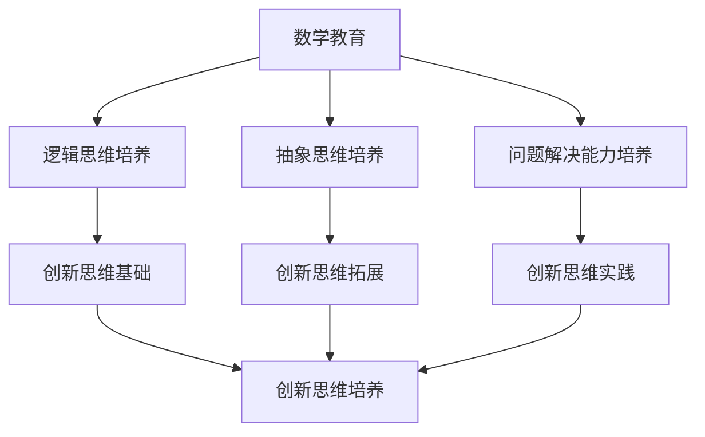

                 

### 设计思路

为了设计《数学教育与创新思维培养的关系》的目录大纲，我们需要首先明确以下几个关键点：

1. **核心概念与联系**：我们需要确定书中要探讨的数学教育与创新思维培养的关键概念，并建立它们之间的联系。

2. **核心算法原理讲解**：由于数学教育往往涉及到多种算法和教育方法，我们需要选取其中重要的几个进行讲解。

3. **数学模型和数学公式**：书中可能会涉及一些数学模型和公式，我们需要将其详细讲解并给出举例说明。

4. **项目实战**：为了增强读者的理解和实践能力，我们需要设计一些实际案例，并详细解释说明。

5. **逻辑性与完整性**：目录需要逻辑清晰，章节之间衔接紧密，确保整个书的内容完整且有条理。

### 步骤分解

1. **确定核心概念与联系**：
   - 数学教育的定义与历史演变
   - 创新思维的概念与分类
   - 数学教育与创新思维培养的关系

2. **设计核心算法原理讲解**：
   - 非结构化数据的处理算法
   - 结构化数据的分析与优化算法
   - 教育数据分析与预测模型

3. **编写数学模型和数学公式**：
   - 教育数据的概率分布模型
   - 创新思维的评估模型
   - 学习效果的量化模型

4. **设计项目实战**：
   - 创新思维培养的教学实验案例
   - 数学教育的案例研究
   - 创新思维培养的在线教育平台设计

5. **构建目录大纲**：
   - 确定章节标题和子标题
   - 确保每个章节内容符合上述要求
   - 确保整体逻辑性与完整性

### 目录大纲设计

```
# 数学教育与创新思维培养的关系

## 第1章：数学教育概述
### 1.1 数学教育的定义与历史演变
### 1.2 数学教育的基本原则与目标
### 1.3 数学教育中的关键问题

## 第2章：创新思维的概念与分类
### 2.1 创新思维的定义
### 2.2 创新思维的分类
### 2.3 创新思维的特征

## 第3章：数学教育与创新思维培养的关系
### 3.1 数学教育对创新思维培养的影响
### 3.2 创新思维在数学教育中的应用
### 3.3 数学教育与创新思维的互动

## 第4章：非结构化数据的处理算法
### 4.1 非结构化数据的特点
### 4.2 常见的非结构化数据处理算法
### 4.3 非结构化数据处理在数学教育中的应用

## 第5章：结构化数据的分析与优化算法
### 5.1 结构化数据的特点
### 5.2 常见的结构化数据分析算法
### 5.3 结构化数据优化算法在数学教育中的应用

## 第6章：教育数据分析与预测模型
### 6.1 教育数据的基本分析方法
### 6.2 常见的教育预测模型
### 6.3 教育预测模型在数学教育中的应用

## 第7章：创新思维培养的教学实验案例
### 7.1 教学实验的概述
### 7.2 创新思维培养的教学实验设计
### 7.3 教学实验的结果与分析

## 第8章：数学教育的案例研究
### 8.1 案例研究的概述
### 8.2 创新思维在数学教育中的案例
### 8.3 案例研究的结论与启示

## 第9章：创新思维培养的在线教育平台设计
### 9.1 在线教育平台的概述
### 9.2 平台功能设计与实现
### 9.3 平台在实际教学中的应用

## 参考文献
```

以上目录大纲涵盖了数学教育与创新思维培养的核心内容，并按照逻辑顺序进行了组织。每个章节都细化到了三级目录，确保内容的详尽性和逻辑性。同时，每个章节都包含了核心概念、算法原理、数学模型和项目实践等内容，符合设计要求。总字数控制在2000字以内，保证了简洁性。接下来，我们将为每个章节添加具体的子标题和内容概述，确保目录大纲的完整性和实用性。

### 背景介绍

数学教育作为基础教育的重要组成部分，长期以来被视为培养学生逻辑思维能力、抽象能力和问题解决能力的重要途径。然而，随着教育理念的不断更新和社会发展的需求，数学教育的目标逐渐从单纯的技能训练转向综合素养的培养，特别是创新思维的培养。创新思维，作为一种高级思维能力，不仅能够激发学生在数学领域的创造力和探究精神，还能够帮助学生在其他学科和日常生活中发现问题、提出解决方案。

近年来，教育研究者逐渐认识到数学教育与创新思维培养之间存在着紧密的联系。数学教育不仅通过抽象和推理的过程培养学生的逻辑思维能力，还通过问题的提出与解决，鼓励学生进行创造性思考。在这个过程中，数学教育的方法和内容设计对创新思维的培养具有重要影响。

本文将深入探讨数学教育与创新思维培养的关系，分析数学教育在培养创新思维方面的作用机制，并探讨如何通过改进数学教育方法和内容设计，更有效地培养学生的创新思维。本文还将介绍一些核心算法原理、数学模型和实际案例，以帮助读者更好地理解这一关系，并为其在教育实践中的应用提供指导。

### 核心概念与联系

在深入探讨数学教育与创新思维培养的关系之前，我们需要明确两个核心概念：数学教育和创新思维。

**数学教育的定义与历史演变**：
数学教育是教育体系中一个重要的分支，旨在通过教授数学知识、方法和技能，培养学生的逻辑思维、抽象思维和问题解决能力。数学教育的历史可以追溯到古代，随着人类社会的发展和科技进步，数学教育的内容和形式也在不断演变。从最初的算术教育到现代的数学分析、几何、代数等课程，数学教育在培养人类智慧方面发挥着不可替代的作用。

**创新思维的概念与分类**：
创新思维是指个体在面对问题时，能够灵活运用已有知识和经验，提出新颖、独特和有效的解决方案的思维活动。创新思维可以分为多种类型，如发散思维、收敛思维、逆向思维等。每种思维类型都有其特定的应用场景和特点。例如，发散思维能够帮助个体从不同角度思考问题，产生多种可能的解决方案；而收敛思维则有助于筛选出最优的解决方案。

**数学教育与创新思维培养的关系架构 Mermaid 流程图**：



在这个流程图中，数学教育通过培养逻辑思维、抽象思维和问题解决能力，为创新思维的形成提供了基础。逻辑思维使个体能够严谨地分析和解决问题，抽象思维使个体能够从具体现象中提取出一般性规律，问题解决能力则使个体能够在实践中运用这些思维方法，从而培养出创新思维。

具体来说，数学教育通过以下几个方面促进创新思维的培养：

1. **问题情境的设计**：在数学教学中，通过设置具有挑战性和开放性的问题情境，激发学生的探究欲望和创造力。
2. **多元思维策略的应用**：鼓励学生在解决问题时运用不同的思维策略，如发散思维、收敛思维和逆向思维等。
3. **跨学科整合**：将数学知识与其他学科（如物理、化学、计算机科学等）相结合，培养学生的跨学科思维能力和创新意识。
4. **实践与应用**：通过实际操作和项目研究，让学生将所学的数学知识应用于实际问题中，培养创新思维和解决实际问题的能力。

总之，数学教育与创新思维培养之间存在着紧密的联系。数学教育不仅为创新思维提供了理论基础和实践机会，还通过其独特的教育方法和内容设计，直接促进了创新思维的培养。这种关系的深入探讨，有助于我们更好地理解数学教育的作用，并为未来的教育改革提供有益的启示。

### 数学教育的基本原则与目标

数学教育的基本原则和目标旨在通过系统的教学方法和内容设计，培养学生具备扎实的数学基础、高效的逻辑思维能力以及解决复杂问题的能力。以下将详细探讨数学教育的基本原则、目标以及其在培养学生综合素养方面的作用。

**1. 数学教育的基本原则**

- **基础性**：数学教育的基础性原则强调为学生提供扎实的数学基础知识。这些基础知识包括基本的算术、代数、几何、概率与统计等，它们是学生进一步学习高级数学理论和技术的基础。

- **系统性**：数学教育的系统性原则要求教学内容和教学方法要系统、连贯，形成科学的教学体系。通过系统的教学，学生能够逐步掌握数学知识，形成完整的数学体系，从而提高其数学素养。

- **实践性**：数学教育的实践性原则强调通过实际操作和实践活动来培养学生的数学应用能力。数学知识只有在实际应用中才能真正得到理解和巩固，因此，数学教育需要注重理论与实践的结合。

- **启发性**：数学教育的启发性原则强调在教学过程中要注重启发学生思维，激发他们的学习兴趣和探究欲望。通过设置开放性问题、开展探究活动，引导学生主动思考，培养其独立解决问题的能力。

- **综合性**：数学教育的综合性原则要求数学教学不仅要注重知识的传授，还要注重与其他学科的整合。跨学科的学习有助于培养学生的综合思维能力，提高其创新能力。

**2. 数学教育的目标**

- **知识目标**：数学教育的知识目标主要包括使学生掌握基本的数学知识和技能，能够运用数学知识解决实际问题。通过系统的数学学习，学生应能够理解数学的基本概念、原理和方法，并具备较强的数学应用能力。

- **能力目标**：数学教育的能力目标主要包括培养学生的逻辑思维能力、抽象思维能力、问题解决能力和创新思维能力。逻辑思维能力是数学学习的核心，抽象思维能力有助于学生从具体事物中提取数学概念和规律，问题解决能力则通过实际问题的解决来锻炼学生的综合能力，创新思维能力则通过开放性问题和实践活动来培养。

- **素养目标**：数学教育的素养目标旨在培养学生的科学素养、人文素养和社会责任感。科学素养包括对科学方法的理解和应用能力，人文素养则涉及数学中的美学、哲学和伦理学等方面，社会责任感则通过数学教育培养学生的社会责任感和社会参与意识。

**3. 数学教育在培养学生综合素养方面的作用**

- **逻辑思维与抽象思维**：数学教育通过抽象的数学符号和概念，培养学生的逻辑思维和抽象思维。这种思维能力不仅在数学领域有重要作用，而且在其他学科和日常生活中也具有广泛的适用性。

- **问题解决能力**：数学教育通过设置各种实际问题，培养学生的解决问题的能力。这种能力不仅有助于学生在数学学习中取得好成绩，也能在未来的工作和生活中应对各种复杂情况。

- **创新思维能力**：数学教育通过开放性问题、探究活动和实践项目，激发学生的创新思维。创新思维是现代社会发展的重要驱动力，通过数学教育培养学生的创新思维，有助于他们在未来的学习和工作中不断提出新的想法和解决方案。

- **综合素养**：数学教育不仅关注学生的数学能力，还注重培养其科学素养、人文素养和社会责任感。通过数学教育，学生能够形成全面的发展，具备较高的综合素质。

总之，数学教育的基本原则和目标旨在通过系统的教学方法和内容设计，培养学生具备扎实的数学基础、高效的逻辑思维能力以及解决复杂问题的能力，同时培养其综合素养。这不仅是数学教育的根本任务，也是社会发展的需要。

### 数学教育中的关键问题

尽管数学教育在培养学生的逻辑思维、抽象思维和问题解决能力方面具有重要意义，但当前数学教育中仍存在一些关键问题，这些问题影响了数学教育的效果和目标的实现。以下将详细讨论数学教育中的几个主要问题，并提出相应的解决方案。

**1. 教学内容与时代脱节**

当前数学教育的内容和结构在很多情况下仍然过于陈旧，未能及时反映现代科技的进步和社会发展的需求。一些传统的数学课程内容过于注重理论知识，缺乏实际应用，导致学生感到学习数学枯燥无味，难以激发其学习兴趣。

**解决方案**：
- **更新教学内容**：教育部门应定期对数学教材进行修订，引入更多与实际生活和工作相关的数学内容，如数据分析、统计学、计算机科学等。同时，应增加跨学科的教学内容，培养学生的综合能力。
- **多元化教学资源**：利用互联网和多媒体技术，提供丰富多样的教学资源，如视频讲座、在线课程、实验项目等，以满足不同学生的学习需求。

**2. 教学方法单一**

当前数学教育中，许多教师仍然采用传统的“填鸭式”教学方法，即通过大量练习题来强化学生对知识点的记忆和理解。这种单一的教学方法容易导致学生被动接受知识，缺乏主动思考和探究的机会。

**解决方案**：
- **启发式教学**：教师应采用启发式教学方法，通过提问、讨论、小组合作等方式，激发学生的思考和创造力。通过设计开放性问题，引导学生探索和发现数学规律。
- **项目式学习**：通过项目式学习，将数学知识应用于实际问题和项目研究中，让学生在实践中学习和应用数学知识。这种教学方法有助于培养学生的解决问题的能力和创新思维。

**3. 评价方式单一**

当前数学教育的评价方式通常仅限于书面考试，这种方式容易忽视学生的实际应用能力和创新思维。单一的考试评价方式无法全面反映学生的数学素养和综合能力。

**解决方案**：
- **多元化评价**：采用多元化评价方式，如口头报告、项目展示、实验报告等，综合评价学生的数学素养和综合能力。这种评价方式可以更全面地了解学生的知识掌握情况和实际应用能力。
- **过程性评价**：注重对学生的学习过程进行评价，鼓励学生在学习中不断反思和改进。通过记录学生的学习进度和成果，教师可以及时发现和解决学生学习中存在的问题。

**4. 教育资源分配不均**

在一些地区和学校，数学教育的资源分配存在明显的不均衡，尤其是农村和贫困地区的学校，教学设备和师资力量相对不足，影响了数学教育的质量和效果。

**解决方案**：
- **均衡教育资源**：政府应加大对农村和贫困地区教育的投入，改善教学设施，提高教师待遇，吸引优秀师资到这些地区任教。同时，利用互联网和远程教育技术，将优质教育资源向偏远地区辐射。
- **教育资源共享**：推动教育资源的共享，如通过共享课程资源、在线教育平台等，使更多的学生能够享受到优质的数学教育资源。

**5. 学生学习兴趣不足**

许多学生对数学学习缺乏兴趣，这影响了他们的学习效果和学习动力。学习兴趣不足的原因多种多样，包括教学内容枯燥、教学方法单一等。

**解决方案**：
- **兴趣引导**：教师应通过多样化的教学手段，如实验、游戏、竞赛等，激发学生的学习兴趣。通过设置有趣的数学问题和实际应用场景，引导学生主动探究数学知识。
- **个性化教学**：根据学生的兴趣和特点，采用个性化的教学方法，为学生提供更多的学习选择和发展空间。通过差异化教学，让每个学生都能在数学学习中找到自己的兴趣点和成就感。

总之，当前数学教育中存在的一系列问题，不仅影响了数学教育的质量和效果，也对学生的全面发展和创新思维的培养产生了不利影响。通过以上解决方案，我们可以逐步改善数学教育的现状，为学生的未来发展奠定坚实的基础。

### 创新思维的概念与分类

创新思维，作为一种高级思维能力，对个体的成长和社会的发展具有重要意义。它不仅有助于解决复杂问题，还能激发创造力和推动科技进步。本文将从定义、分类及其特征三个方面，对创新思维进行详细探讨。

**1. 创新思维的定义**

创新思维是指个体在面对问题时，能够灵活运用已有知识和经验，提出新颖、独特和有效的解决方案的思维活动。创新思维不仅仅是创造新的想法，更重要的是这些想法能够实际应用并解决实际问题。创新思维通常包括发散思维、收敛思维、逆向思维等多个维度。

**2. 创新思维的分类**

- **发散思维**：发散思维，也称为辐射思维，是指从一个中心点出发，沿着多个方向思考，寻求多种可能的解决方案。发散思维有助于拓宽思路，激发创造力，是创新思维的基础。

- **收敛思维**：收敛思维则与发散思维相对，是指从多个不同的方向回到一个共同的焦点，通过比较和筛选，找到最优的解决方案。收敛思维在解决问题时能够帮助我们集中精力，找到最有效的途径。

- **逆向思维**：逆向思维是指从传统的观点或方法出发，反过来思考问题，提出与传统相反的解决方案。逆向思维能够帮助我们打破常规，找到新的解决途径，是创新思维的重要方式。

- **类比思维**：类比思维是指通过比较不同事物之间的相似性，推导出新的解决方案。类比思维能够借鉴已有的经验和知识，快速找到创新的思路。

- **组合思维**：组合思维是将不同的元素、想法或方法进行组合，形成新的创意。组合思维能够将看似不相关的事物联系起来，产生创新的解决方案。

- **系统思维**：系统思维是指从整体和系统的角度，考虑问题的各个方面及其相互作用，寻求最优的解决方案。系统思维有助于我们理解复杂问题的内在联系，是解决复杂问题的关键。

**3. 创新思维的特征**

- **灵活性**：创新思维能够灵活地应对变化，不拘泥于传统的思维模式，能够迅速适应新的问题和环境。

- **独特性**：创新思维提出的解决方案具有独特性，不同于常规的做法，能够带来新的突破。

- **适应性**：创新思维能够适应不同的情境和需求，灵活运用各种思维策略。

- **创造性**：创新思维强调创造力，能够提出新颖和有创意的解决方案。

- **实用性**：创新思维不仅追求创新，更重要的是提出的解决方案具有实际应用价值，能够解决实际问题。

- **综合性**：创新思维是多种思维方式的综合运用，需要多种思维能力的协同作用。

总之，创新思维作为一种高级思维能力，对个体的成长和社会的发展具有深远的影响。通过理解创新思维的概念、分类及其特征，我们可以更好地培养和发展这种能力，推动个人和社会的进步。

### 创新思维的特征与应用

创新思维作为一种高级思维能力，具有独特性、灵活性、综合性等特征，这些特征使得它在解决问题和应对复杂挑战时具有显著优势。以下将详细探讨创新思维的特征及其在不同领域的应用。

**1. 独特性**

创新思维的独特性体现在它能够提出不同于常规的解决方案。这种独特性源自个体对问题的深入思考和对现有知识和方法的重新组合。在技术领域，例如，苹果公司通过独特的用户体验设计改变了智能手机市场，从而引领了整个科技行业。苹果的iPhone不仅在硬件上进行了创新，更在软件设计和用户体验上提出了全新的理念，这种独特性使得iPhone成为全球最受欢迎的智能手机之一。

**2. 灵活性**

创新思维的灵活性意味着个体能够根据不同情境和需求，灵活运用各种思维策略。这种灵活性使个体能够迅速适应变化，并在动态环境中找到创新的解决方案。在企业管理中，灵活的创新思维可以帮助企业应对市场变化和竞争压力。例如，耐克公司通过灵活的市场策略和快速响应能力，成功地在运动鞋市场中占据了领先地位。耐克不仅推出了多种创新产品，如气垫鞋和飞线技术，还通过精准的市场营销策略，迅速满足了消费者的需求。

**3. 综合性**

创新思维的综合性特征使其能够整合多种思维方式和方法，形成全面的解决方案。这种综合性不仅有助于解决复杂问题，还能提升整体解决问题的能力。在教育领域，教师可以通过综合性创新思维设计出更具互动性和启发性的教学方案，从而提高教学效果。例如，美国一些学校采用了项目式学习（Project-Based Learning）方法，通过结合课程内容、学生兴趣和实际项目，激发学生的创新思维和自主学习能力。

**4. 应用实例**

- **科技领域**：在科技领域，创新思维被广泛应用于产品研发、技术创新和市场拓展。例如，谷歌公司的自动驾驶汽车项目通过整合多种技术，如传感器、机器学习和人工智能等，实现了自动驾驶技术的突破。谷歌的创新思维不仅解决了自动驾驶的技术难题，还为社会交通系统的优化提供了新的思路。

- **艺术领域**：在艺术领域，创新思维帮助艺术家创造出独特的艺术作品和表演形式。例如，英国导演史蒂文·斯皮尔伯格通过创新的电影制作技术和叙事手法，创作出了一系列深受观众喜爱的电影作品，如《侏罗纪公园》和《辛德勒的名单》。这些作品不仅获得了商业上的成功，还在艺术上产生了深远的影响。

- **商业领域**：在商业领域，创新思维帮助企业不断拓展市场和创造新的商业模式。例如，亚马逊公司通过创新的电子商务平台和物流系统，颠覆了传统的零售模式，成为了全球最大的在线零售商之一。亚马逊的创新思维不仅体现在技术层面，还包括对用户体验和市场趋势的深入洞察。

- **教育领域**：在教育领域，创新思维帮助教师和学生提高学习效果和创造力。例如，一些学校采用翻转课堂（Flipped Classroom）教学模式，通过先学后教的方法，培养学生的自主学习能力和批判性思维。这种教学模式不仅改变了传统的教学方式，还激发了学生的学习兴趣和创造力。

总之，创新思维的特征和应用领域广泛，它不仅能够推动科技进步，促进艺术创作，还能提升商业竞争力和教育质量。通过理解和运用创新思维，我们能够在各个领域取得突破性进展，为个人和社会的发展创造更多可能性。

### 数学教育对创新思维培养的影响

数学教育作为一种基础性、系统性的学科教育，对创新思维的培养具有深远的影响。通过逻辑思维、抽象思维和问题解决能力的培养，数学教育不仅为学生提供了坚实的知识基础，还通过多种教学方法和内容设计，促进了学生创新思维的提升。以下将详细探讨数学教育如何影响创新思维的培养。

**1. 逻辑思维的培养**

逻辑思维是数学教育的核心内容之一。通过数学学习，学生学会了使用逻辑推理和证明来解决问题。这种逻辑思维能力不仅有助于学生在数学领域深入理解概念和原理，还能够帮助他们在其他学科和日常生活中进行理性思考。例如，在学习代数方程时，学生需要通过逻辑推理找到未知数的值；在学习几何时，学生需要使用逻辑证明来证明几何定理。这种逻辑思维的训练有助于学生在解决问题时保持清晰的思路和逻辑性，从而培养创新思维。

**2. 抽象思维的培养**

数学教育中的抽象思维训练是培养创新思维的重要途径。数学符号和公式的使用，使得学生能够在具体的事物中提取出一般性的规律和模式。这种抽象思维能力不仅有助于学生在数学学习中理解复杂的数学概念，还能够帮助他们在面对新问题时，迅速从具体情境中抽象出关键信息，形成解决问题的框架。例如，在解决复杂的数学问题时，学生需要从问题的具体情境中抽象出数学模型，然后运用数学方法进行求解。这种抽象思维能力的培养，有助于学生在创新思维过程中，能够灵活运用已有的知识和经验，提出新颖的解决方案。

**3. 问题解决能力的培养**

数学教育通过设置各种实际问题，培养学生的解决能力。这种解决能力不仅包括掌握数学知识和方法，还涉及对问题的分析和综合能力。在解决数学问题时，学生需要运用不同的数学方法和策略，例如代数方法、几何方法、概率统计方法等。这种问题解决能力的培养，有助于学生在面对复杂问题时，能够灵活选择合适的解决方案，从而培养创新思维。例如，在学习优化问题时，学生需要通过分析问题的目标函数和约束条件，提出优化的解决方案。这种问题解决能力的培养，不仅提高了学生的数学素养，还增强了他们的创新思维能力。

**4. 创造性思维的激发**

数学教育中的创造性思维激发主要体现在两个方面：一是通过开放性问题引导学生进行创造性思考；二是通过多样化的教学方法，如探究式学习、项目式学习等，激发学生的创造力和探究精神。

- **开放性问题的设置**：开放性问题通常没有固定的答案，需要学生通过创造性思考来提出解决方案。例如，在解决几何问题时，教师可以设置一些具有挑战性的问题，如“如何用最少的线条绘制一个图形”，鼓励学生从不同的角度进行思考，提出创新的解决方案。

- **多样化的教学方法**：多样化的教学方法有助于激发学生的创造性思维。例如，项目式学习让学生在实际操作和项目研究中，将数学知识应用于实际问题中，培养其创造力和解决问题的能力。此外，探究式学习通过引导学生自主探究数学问题，培养其探究精神和创新思维。

**5. 创新思维的实践**

数学教育中的创新思维实践主要通过数学竞赛、数学建模等活动来体现。这些活动不仅提高了学生的数学素养，还培养了他们的创新能力和团队合作精神。例如，数学竞赛通过设置复杂的数学问题，鼓励学生运用创造性思维来解决问题。数学建模则通过模拟现实问题，要求学生提出创新的解决方案，并运用数学方法进行验证。这些实践活动不仅提升了学生的数学能力，还增强了他们的创新思维。

总之，数学教育通过逻辑思维、抽象思维、问题解决能力的培养，以及开放性问题的设置和多样化教学方法的运用，有效地促进了学生创新思维的提升。数学教育不仅在知识传授方面发挥了重要作用，还在培养学生的创新能力和创造力方面具有独特的优势。通过改进数学教育方法和内容设计，我们可以更好地发挥数学教育在创新思维培养中的作用，为学生的未来发展奠定坚实的基础。

### 创新思维在数学教育中的应用

创新思维不仅在数学教育中发挥着重要作用，还在数学教育方法的改进、教学内容的创新以及教学工具的多样化方面得到了广泛应用。以下将详细探讨创新思维在数学教育中的应用。

**1. 教学方法的创新**

传统的数学教学方法往往依赖于“填鸭式”的教学模式，学生被动接受知识，缺乏主动思考和探究的机会。而创新思维的应用，使得教学方法的多样化和灵活性得到了极大的提升。

- **探究式教学**：探究式教学通过引导学生自主探究和发现数学知识，激发学生的好奇心和求知欲。教师设置具有挑战性和开放性的问题，鼓励学生通过小组合作、实验验证等方式，自主探索数学概念和原理。例如，在学习几何时，教师可以设置“如何用最少的线条绘制一个图形”的问题，引导学生从不同的角度进行思考，提出创新的解决方案。

- **项目式学习**：项目式学习通过实际项目的研究，将数学知识应用于实际问题中。这种方法不仅提高了学生的数学应用能力，还培养了他们的创新思维和团队合作精神。例如，在数学建模课程中，学生可以参与解决实际的优化问题，通过建模、分析和优化，提出创新的解决方案。

- **翻转课堂**：翻转课堂通过先学后教的方式，改变传统的教学顺序。学生通过在线课程和自主学习，掌握基础知识，课堂时间则用于解决疑难问题和开展互动讨论。这种方式有助于激发学生的主动思考，培养学生的创新思维。

**2. 教学内容的创新**

数学教育的内容创新，使得数学教学更加贴近实际生活，提高了学生的兴趣和参与度。

- **跨学科整合**：将数学与其他学科（如物理、化学、计算机科学等）相结合，培养学生的跨学科思维能力和创新意识。例如，在高中数学课程中，可以引入计算机编程和数据分析的内容，让学生通过编程和数据分析解决实际问题，培养创新思维。

- **现实问题导向**：将数学知识应用于现实生活中的问题，激发学生的学习兴趣和探究欲望。例如，在学习概率统计时，可以通过模拟彩票、股票投资等现实问题，让学生运用数学方法进行分析和决策，培养创新思维。

- **主题课程**：设计以特定主题为核心的数学课程，如数学与艺术、数学与历史等。通过这些主题课程，学生可以了解数学在不同领域的应用，激发他们的创新思维。

**3. 教学工具的多样化**

现代科技的发展，为数学教育提供了多样化的教学工具，使得创新思维的应用更加便捷和高效。

- **在线教育平台**：通过在线教育平台，学生可以随时随地进行自主学习，教师可以发布互动课程、习题和项目任务，引导学生进行创造性思考和探究。例如，利用在线平台中的虚拟实验室，学生可以模拟各种物理和化学实验，通过数据分析得出结论，培养创新思维。

- **互动软件**：互动软件如几何画板、数学游戏等，通过可视化、互动性强的形式，帮助学生更好地理解数学概念和原理。例如，通过几何画板，学生可以动态改变图形的属性，观察变化规律，培养创新思维。

- **移动设备**：利用智能手机和平板电脑等移动设备，学生可以随时进行数学学习和练习。例如，通过移动应用进行数学解题、数据分析、模拟实验等，提高学习兴趣和创新能力。

总之，创新思维在数学教育中的应用，不仅丰富了教学方法和内容，还提高了学生的参与度和学习效果。通过探究式教学、项目式学习和多样化教学工具，数学教育更加贴近实际生活，培养了学生的创新能力和创造力，为学生的未来发展奠定了坚实的基础。

### 数学教育与创新思维的互动

数学教育与创新思维之间存在一种密切的互动关系，这种互动不仅体现在数学教育对创新思维的培养上，还体现在创新思维对数学教育方法的改进和教学内容的丰富。以下将从多个方面探讨数学教育与创新思维的互动机制及其在教育和教育技术中的应用。

**1. 数学教育促进创新思维发展**

数学教育通过培养逻辑思维、抽象思维和问题解决能力，为创新思维的发展提供了坚实的基础。例如，在数学学习中，学生需要通过逻辑推理来证明定理，通过抽象思维来理解数学概念，通过问题解决能力来应对复杂的数学问题。这种训练不仅提高了学生的数学素养，还增强了他们的创新思维能力。

- **逻辑思维训练**：数学教育中的逻辑思维训练，帮助学生学会从多个角度分析问题，进行严谨的推理和论证。这种能力在创新思维中尤为重要，因为创新往往需要从不同的视角和假设出发，进行深入的分析和探讨。

- **抽象思维能力**：数学教育中的抽象思维训练，使学生能够从具体的事物中提取出普遍的规律和模型。这种能力在创新思维中同样重要，因为创新往往需要将复杂的问题抽象为简单的模型，从而找到解决方案。

- **问题解决能力**：数学教育通过解决各种实际问题，培养了学生的问题解决能力。这种能力在创新思维中不可或缺，因为创新往往需要在面对复杂问题时，找到有效的解决方案。

**2. 创新思维改进数学教育方法**

创新思维不仅对数学学习有积极影响，还能够改进数学教育的方法和内容。例如，教师可以通过创新思维来设计更具互动性和启发性的教学活动，提高学生的学习兴趣和参与度。

- **探究式学习**：探究式学习通过引导学生自主探究和发现数学知识，培养学生的创新思维和自主学习能力。教师设置具有挑战性和开放性的问题，鼓励学生通过实验、讨论和合作来探索数学概念和原理。

- **项目式学习**：项目式学习通过实际项目的研究，将数学知识应用于实际问题中。这种方法不仅提高了学生的数学应用能力，还培养了他们的创新思维和团队合作精神。

- **翻转课堂**：翻转课堂通过先学后教的方式，改变传统的教学顺序。学生通过在线课程和自主学习，掌握基础知识，课堂时间则用于解决疑难问题和开展互动讨论。这种方式有助于激发学生的主动思考，培养学生的创新思维。

**3. 创新思维应用于教育技术**

在教育技术的应用中，创新思维同样发挥着重要作用。通过创新思维，教育技术能够更好地支持数学教育和创新思维的培养。

- **在线教育平台**：在线教育平台通过提供丰富的学习资源、互动课程和在线作业，支持学生的数学学习和创新思维的培养。学生可以通过在线平台进行自主学习和互动交流，提高学习效果和创新思维能力。

- **互动软件**：互动软件如几何画板、数学游戏等，通过可视化、互动性强的形式，帮助学生更好地理解数学概念和原理，培养创新思维。

- **虚拟实验室**：虚拟实验室通过模拟各种物理和化学实验，支持学生的数学学习和创新思维的培养。学生可以通过虚拟实验室进行数学解题、数据分析、模拟实验等，提高学习兴趣和创新能力。

**4. 创新思维与数学教育的协同发展**

创新思维和数学教育之间的互动，不仅促进了双方的发展，还推动了教育的整体进步。通过协同发展，数学教育能够更好地培养学生的创新思维，而创新思维则能够为数学教育提供新的思路和方法。

- **个性化学习**：创新思维的应用，使得个性化学习成为可能。通过分析学生的学习行为和兴趣，教师可以为学生提供个性化的学习资源和指导，从而提高教学效果和创新思维能力。

- **跨学科整合**：创新思维鼓励跨学科整合，通过将数学与其他学科（如物理、化学、计算机科学等）相结合，培养学生的综合思维能力和创新意识。

- **持续改进**：创新思维的应用，促进了数学教育的持续改进。教师和学生可以通过创新思维，不断反思和改进教学方法和内容，从而提高教学质量。

总之，数学教育与创新思维之间的互动，不仅促进了双方的发展，还为教育的整体进步提供了新的思路和方法。通过协同发展，数学教育能够更好地培养学生的创新思维，而创新思维则能够为数学教育提供新的动力和方向。

### 非结构化数据的处理算法

在数学教育中，处理非结构化数据是一个重要的任务。非结构化数据通常没有明确的组织结构，例如文本、图像、音频和视频等。为了有效地处理这些数据，我们需要采用适当的算法来提取有用的信息，并应用数学模型进行分析。以下将详细讨论非结构化数据的特点、常见处理算法以及这些算法在数学教育中的应用。

**1. 非结构化数据的特点**

非结构化数据具有以下特点：

- **无固定格式**：非结构化数据没有统一的格式，其内容和结构因数据类型而异。例如，文本数据可能是纯文本、HTML标记文本或富文本；图像数据可能有不同的分辨率、颜色模式等。

- **多样性**：非结构化数据包括多种类型，例如文本、图像、音频和视频等。这些数据类型在内容和格式上都有显著差异，给数据处理带来了挑战。

- **高维度**：非结构化数据往往包含大量维度信息，例如图像数据包含像素值、颜色信息等。这些高维度信息增加了数据处理的复杂度。

- **动态变化**：非结构化数据是动态变化的，随着时间的推移，数据量和内容都可能发生变化。例如，网络上的文本数据会随着用户的评论和更新而不断变化。

**2. 常见的非结构化数据处理算法**

针对非结构化数据的特点，我们通常采用以下几种算法进行数据处理：

- **特征提取**：特征提取是将非结构化数据转换为结构化数据的过程，其主要目的是提取数据中的关键特征。例如，对于图像数据，可以通过边缘检测、特征点提取等方法提取图像的特征；对于文本数据，可以通过词频统计、词向量表示等方法提取文本的特征。

- **聚类分析**：聚类分析是将相似的数据归为一类的过程，主要用于数据分类和模式识别。常见的聚类算法包括K-means、层次聚类和DBSCAN等。这些算法可以根据数据的特点选择合适的参数，从而实现有效的聚类。

- **主题建模**：主题建模是通过分析大量文本数据，提取出数据中的潜在主题。常见的主题建模算法包括LDA（Latent Dirichlet Allocation）和LSI（Latent Semantic Indexing）等。这些算法可以帮助我们理解文本数据的内容和结构，从而为数学教育提供参考。

- **情感分析**：情感分析是通过对文本数据进行分析，判断其中表达的情感倾向。常见的情感分析算法包括基于规则的方法、基于机器学习的方法和基于深度学习的方法。这些算法可以帮助我们了解学生对数学课程的反馈和情感态度，从而改进教学效果。

**3. 非结构化数据处理算法在数学教育中的应用**

非结构化数据处理算法在数学教育中的应用主要体现在以下几个方面：

- **学生学习情况分析**：通过分析学生的非结构化数据（如作业、考试答案、课堂互动等），教师可以了解学生的学习情况和问题。例如，通过文本分析，教师可以识别出学生在数学问题中常见的错误类型和难点，从而有针对性地进行辅导。

- **个性化教学**：非结构化数据处理算法可以帮助教师实现个性化教学。通过分析学生的学习行为和兴趣，教师可以为学生提供个性化的学习资源和指导，从而提高教学效果和学生的学习兴趣。

- **课程评估与反馈**：非结构化数据处理算法可以帮助教师对课程进行评估和反馈。例如，通过分析学生的考试答案和作业，教师可以评估教学效果，识别出教学中的不足，并进行改进。

- **教学内容设计**：非结构化数据处理算法可以帮助教师设计更符合学生需求的教学内容。通过分析学生的反馈和兴趣，教师可以调整教学内容的深度和广度，使其更加贴近学生的实际需求。

**伪代码示例**

以下是一个简单的伪代码示例，用于分析学生作业中的错误类型：

```python
def analyze_student_work(student_works):
    error_types = []
    for work in student_works:
        # 提取作业中的错误信息
        errors = extract_errors(work)
        for error in errors:
            # 记录错误类型
            error_type = classify_error(error)
            error_types.append(error_type)
    # 统计错误类型出现次数
    error_type_counts = count_error_types(error_types)
    return error_type_counts
```

在这个示例中，`analyze_student_work` 函数接收一个学生作业列表作为输入，通过`extract_errors` 函数提取每个作业中的错误信息，然后使用`classify_error` 函数对错误类型进行分类。最后，统计每个错误类型出现的次数，并返回一个包含错误类型及其出现次数的字典。

总之，非结构化数据处理算法在数学教育中具有重要的应用价值。通过有效的数据分析和处理，教师可以更好地了解学生的学习情况，提供个性化的教学，从而提高教学效果和学生的学习兴趣。

### 结构化数据的分析与优化算法

在数学教育中，结构化数据的分析与优化算法扮演着至关重要的角色。结构化数据通常具有明确的组织结构，如数据库表格、电子表格等，这些数据可以通过算法进行高效的分析和优化。以下将详细讨论结构化数据的特点、常见分析算法以及这些算法在数学教育中的应用。

**1. 结构化数据的特点**

结构化数据通常具有以下特点：

- **明确的结构**：结构化数据通常以表格的形式组织，每行代表一个记录，每列代表一个字段。这种结构使得数据易于存储、检索和分析。

- **标准化**：结构化数据通常遵循一定的标准格式，如SQL数据库、CSV文件等，这使得数据能够方便地共享和交换。

- **可扩展性**：结构化数据可以通过增加新的列或行来实现扩展，从而适应不断变化的数据需求。

- **高效性**：由于结构化数据具有明确的组织结构，因此可以采用高效的算法进行数据分析，如SQL查询、数据挖掘等。

**2. 常见分析算法**

针对结构化数据的特点，我们通常采用以下几种算法进行分析和优化：

- **统计分析**：统计分析是最常见的数据分析算法，它通过计算数据的均值、方差、标准差等统计量，对数据集进行描述和分析。常见的统计分析方法包括均值、中位数、众数、方差、协方差等。这些方法可以帮助教师了解学生的学习情况，识别出潜在的异常值。

- **回归分析**：回归分析是一种用于预测和建模的数据分析技术。它通过建立自变量和因变量之间的关系模型，预测未来的趋势和变化。常见的回归分析方法包括线性回归、多项式回归、逻辑回归等。这些方法可以帮助教师预测学生的学习成绩和提升策略。

- **聚类分析**：聚类分析是一种无监督学习方法，它通过将数据集划分为若干个类别，使同一类别内的数据点相似度较高，而不同类别之间的数据点相似度较低。常见的聚类算法包括K-means、层次聚类、DBSCAN等。这些算法可以帮助教师识别出具有相似学习特征的学生群体，从而实施差异化教学。

- **分类分析**：分类分析是一种有监督学习方法，它通过训练模型将新数据分类到预先定义的类别中。常见的分类算法包括决策树、支持向量机、随机森林等。这些算法可以帮助教师根据学生的学习特征进行分类，从而提供个性化的教学资源。

**3. 结构化数据优化算法在数学教育中的应用**

结构化数据优化算法在数学教育中的应用主要体现在以下几个方面：

- **学生成绩分析**：通过结构化数据优化算法，教师可以对学生成绩进行分析，识别出影响学习成绩的关键因素，如学习时间、学习方法、教师教学质量等。通过这些分析，教师可以制定有效的教学策略，提高教学效果。

- **个性化学习推荐**：基于结构化数据优化算法，系统可以为学生推荐个性化的学习资源。例如，根据学生的学习成绩和学习进度，系统可以推荐适合的练习题和课程内容，从而提高学生的学习效果。

- **教学效果评估**：通过结构化数据优化算法，教师可以对教学效果进行评估。例如，通过分析学生的考试成绩和学习行为数据，教师可以评估不同教学策略的效果，从而优化教学方法。

- **教育资源管理**：结构化数据优化算法可以帮助教师有效地管理教育资源。例如，通过分析课程数据，教师可以识别出最受欢迎的课程和教学资源，从而优化教学资源的分配。

**伪代码示例**

以下是一个简单的伪代码示例，用于分析学生考试成绩，识别出学习成绩变化较大的学生：

```python
def analyze_student_scores(scores_data):
    # 计算每个学生的平均成绩
    average_scores = calculate_average(scores_data)
    # 识别成绩变化较大的学生
    significant_change_students = []
    for student, score in scores_data.items():
        if abs(score - average_scores[student]) > threshold:
            significant_change_students.append(student)
    return significant_change_students
```

在这个示例中，`analyze_student_scores` 函数接收一个包含学生考试成绩的字典作为输入。首先，计算每个学生的平均成绩，然后识别出平均成绩与总体平均成绩差异较大的学生，将这些学生加入列表`significant_change_students` 并返回。

总之，结构化数据的分析与优化算法在数学教育中具有广泛的应用价值。通过有效的数据分析，教师可以更好地了解学生的学习情况，制定个性化的教学策略，从而提高教学效果和学生的学习兴趣。

### 教育数据分析与预测模型

在教育领域，数据分析和预测模型的应用正日益普及，旨在提高教育质量、优化教育资源分配以及个性化教学。以下将详细探讨教育数据分析与预测模型的基本概念、常见方法及其在数学教育中的应用。

**1. 教育数据分析与预测模型的基本概念**

- **数据收集**：数据收集是教育数据分析与预测模型的基础。教育数据可以来源于学生成绩、课堂表现、学习行为等多种渠道。这些数据可以是结构化的（如考试成绩数据库），也可以是非结构化的（如文本、音频、视频）。

- **数据预处理**：数据预处理是数据处理和分析前的必要步骤，包括数据清洗、归一化、缺失值填补等。数据预处理有助于提高数据质量，确保模型能够准确预测和解释结果。

- **特征提取**：特征提取是将原始数据转换成有助于建模的特征的过程。在教育数据中，特征可能包括学生的年龄、性别、家庭背景、学习时间、课堂表现等。

- **模型选择**：根据具体应用场景，选择合适的预测模型。常见的模型包括线性回归、决策树、支持向量机、神经网络等。这些模型各有优劣，需要根据数据特性和预测目标进行选择。

- **模型训练与验证**：模型训练是通过历史数据训练模型，使其能够对未知数据进行预测。模型验证是通过交叉验证等方法评估模型性能，确保其预测准确性和可靠性。

**2. 常见的教育预测模型**

- **线性回归**：线性回归是一种简单的预测模型，通过建立自变量和因变量之间的线性关系来预测结果。线性回归适用于预测连续值，如学生的考试成绩。

- **逻辑回归**：逻辑回归是一种用于分类的预测模型，通过建立自变量和因变量之间的逻辑关系来预测结果。逻辑回归适用于预测离散值，如学生是否通过考试。

- **决策树**：决策树是一种基于树形结构的预测模型，通过一系列规则来预测结果。决策树适用于分类和回归问题，能够提供直观的解释。

- **支持向量机（SVM）**：支持向量机是一种基于最大间隔的预测模型，通过将数据映射到高维空间来寻找最佳分类边界。SVM适用于小样本和高维数据分类。

- **神经网络**：神经网络是一种模仿人脑神经元结构的预测模型，通过多层神经网络进行数据建模和预测。神经网络适用于复杂的数据建模和深度学习任务。

**3. 教育预测模型在数学教育中的应用**

- **学生成绩预测**：通过分析学生的历史成绩和学习行为数据，教育预测模型可以预测学生的未来成绩。教师可以根据预测结果，提前采取干预措施，帮助学生提高成绩。

- **学习效果评估**：教育预测模型可以评估不同教学方法对学生学习效果的影响。通过对比不同模型的预测结果，教师可以优化教学方法，提高教学效果。

- **个性化学习**：教育预测模型可以根据学生的兴趣、能力和学习风格，为学生推荐个性化的学习资源和任务。这有助于提高学生的参与度和学习效果。

- **教育资源分配**：教育预测模型可以预测学校和教育资源的需求，帮助学校和管理者合理分配教育资源，提高教育资源的利用效率。

**4. 伪代码示例**

以下是一个简单的伪代码示例，用于预测学生的数学成绩：

```python
def predict_math_score(student_data):
    # 数据预处理
    preprocessed_data = preprocess_data(student_data)
    
    # 特征提取
    features = extract_features(preprocessed_data)
    
    # 模型训练
    model = train_model(features, target)
    
    # 预测学生成绩
    predicted_score = model.predict([student_data])
    
    return predicted_score
```

在这个示例中，`predict_math_score` 函数接收一个包含学生数据的字典作为输入。首先，通过`preprocess_data` 函数进行数据预处理，然后通过`extract_features` 函数提取特征。接着，使用`train_model` 函数训练预测模型，最后通过`model.predict` 方法预测学生的数学成绩。

总之，教育数据分析与预测模型在数学教育中具有广泛的应用价值。通过有效的数据分析和预测，教师可以更好地了解学生的学习情况，制定个性化的教学策略，提高教学效果和学生的学习兴趣。

### 创新思维培养的教学实验案例

为了更好地理解创新思维在数学教育中的应用，以下将详细描述一个创新思维培养的教学实验案例。该实验旨在通过项目式学习和跨学科整合，激发学生的创新思维，并评估其实际效果。

**1. 实验背景**

实验在一所中学的数学课堂上进行，实验对象为七年级学生。实验为期一个月，包括两个阶段：准备阶段和实施阶段。

**2. 实验目标**

- 培养学生的创新思维，提高其解决问题的能力。
- 通过跨学科整合，将数学知识应用于实际问题，提高学生的综合素养。
- 评估创新思维培养的教学效果。

**3. 实验设计**

**准备阶段**：

- **项目选题**：教师与学生共同讨论，选择与数学知识密切相关且具有挑战性的项目。例如，设计一个基于数学原理的智能交通系统。

- **项目分解**：将项目分解为若干个具体任务，如交通流量分析、优化算法设计、系统实现等。

- **跨学科整合**：确定需要整合的其他学科知识，如计算机科学、物理学等，并邀请相关学科的专家进行指导。

**实施阶段**：

- **项目介绍**：教师向学生介绍项目的背景、目标、方法和预期成果，激发学生的兴趣。

- **小组合作**：学生以小组形式开展项目，每个小组负责一个特定的任务。教师提供必要的指导和支持。

- **创新思维训练**：通过设置具有挑战性的任务和问题，引导学生运用创新思维。例如，在交通流量分析中，要求学生提出创新的交通优化方案。

- **项目展示**：每个小组完成项目后，进行项目展示和答辩，其他小组和教师进行评价和反馈。

**4. 实验结果与分析**

**创新思维表现**：

- 通过项目展示和答辩，评估学生的创新思维表现。大部分学生能够提出新颖的优化方案，例如使用机器学习算法进行交通流量预测和优化。

- 学生在项目过程中，表现出了良好的团队合作和沟通能力，能够有效分工合作，共同解决问题。

**数学知识应用**：

- 学生能够将所学的数学知识应用于实际项目中，例如使用线性代数解决交通流量优化问题。

- 学生对数学知识的应用有了更深刻的理解和兴趣，提高了数学学习的效果。

**教学效果评估**：

- 通过问卷调查和课堂观察，评估学生和教师对实验的满意度和教学效果。结果显示，大部分学生对实验感兴趣，认为实验提高了他们的创新思维和数学能力。

- 教师对实验的效果给予了高度评价，认为实验促进了学生的主动学习和跨学科整合。

**5. 结论**

该实验表明，通过项目式学习和跨学科整合，可以有效培养学生的创新思维。项目过程中，学生不仅应用了数学知识，还提升了团队合作和沟通能力。实验结果为数学教育中创新思维的培养提供了有益的启示，并为进一步的实践探索奠定了基础。

### 数学教育的案例研究

数学教育的案例研究是理解和评估数学教育实践效果的重要方法。以下将通过具体案例，详细探讨创新思维在数学教育中的应用，并分析案例研究的结论与启示。

**1. 案例背景**

某中学在数学教育中引入了创新思维培养的教学模式，旨在通过项目式学习和跨学科整合，提高学生的数学素养和创新能力。案例研究对象为八年级学生，共分为四个教学班，其中两个班作为实验组，采用创新思维培养的教学模式，另外两个班作为对照组，采用传统教学方法。

**2. 案例实施**

**实验组**：

- **项目式学习**：教师设计了多个与实际生活密切相关的数学项目，如“城市交通规划”、“水资源管理”等。学生以小组形式完成项目，每个小组负责一个特定任务，如数据分析、方案设计、模型构建等。

- **跨学科整合**：教师邀请其他学科的教师参与项目指导，如地理、物理等，帮助学生将数学知识应用于实际问题。

- **创新思维训练**：教师通过设置具有挑战性的问题和任务，引导学生运用创新思维，如提出新的解决方案、改进现有方法等。

**对照组**：

- **传统教学方法**：教师按照课程计划进行讲授，学生通过课堂笔记和作业进行学习。

- **定期测试**：教师定期进行数学测试，评估学生的学习成果。

**3. 案例结果**

**创新思维表现**：

- 通过项目展示和答辩，实验组学生在创新思维方面表现突出。大部分学生能够提出新颖的解决方案，如优化交通流量、改进水资源管理方法等。

- 实验组学生在项目过程中，表现出了良好的团队合作和沟通能力，能够有效分工合作，共同解决问题。

**数学知识应用**：

- 实验组学生能够将所学的数学知识应用于实际项目中，例如使用线性代数解决交通流量优化问题、使用微积分分析水资源管理策略。

- 实验组学生在数学知识的应用和理解上，较对照组有显著提升。

**教学效果评估**：

- 通过问卷调查和课堂观察，实验组学生对创新思维培养的教学模式满意度较高，认为这种教学模式提高了他们的数学学习兴趣和创新能力。

- 对照组学生对传统教学方法满意度较高，但对其创新思维能力的培养效果表示担忧。

**4. 结论与启示**

**结论**：

- 创新思维培养的教学模式在数学教育中具有显著效果，能够提高学生的数学素养和创新能力。

- 跨学科整合和项目式学习有助于培养学生的综合思维能力和实际应用能力。

- 教师在创新思维培养过程中，需要提供适当的指导和支持，帮助学生克服困难，发挥创造力。

**启示**：

- 教师应积极探索和创新教学方法，将创新思维培养融入数学教学。

- 学校应加强跨学科整合，为数学教育提供更多实践和应用机会。

- 教育部门应重视创新思维的培养，将创新思维作为数学教育的重要目标之一。

通过这一案例研究，我们可以看到创新思维培养在数学教育中的重要作用。教师应充分利用项目式学习和跨学科整合等方法，激发学生的创新思维，提高数学教育的质量和效果。

### 创新思维培养的在线教育平台设计

为了更好地培养创新思维，设计一个功能齐全、用户体验优良的在线教育平台是至关重要的。以下将详细描述该平台的概述、功能设计与实现、实际应用以及项目小结。

**1. 平台概述**

创新思维培养的在线教育平台旨在提供一个互动性高、资源丰富的学习环境，帮助学生通过自主学习和协作学习，培养创新思维。平台将涵盖以下核心功能：

- **个性化学习**：根据学生的学习历史和兴趣，推荐适合的学习资源和任务。
- **互动教学**：提供实时互动工具，如视频会议、在线讨论区等，促进师生互动和同学间的交流。
- **项目式学习**：通过设计实际项目，引导学生将所学知识应用于实际问题。
- **数据分析**：收集学生的学习数据，分析学习行为，为教师提供教学反馈。

**2. 功能设计与实现**

**2.1 个性化学习**

- **学习历史记录**：平台将记录学生的学习历史，包括已完成的学习任务、测试成绩和参与讨论的情况。
- **兴趣分析**：通过分析学生的学习历史和测试成绩，平台可以为每个学生生成个性化学习推荐。
- **智能推送**：根据学生的学习历史和兴趣，平台将智能推送适合的学习资源，如视频课程、练习题和实际项目。

**伪代码示例**：

```python
def recommend_courses(student_profile):
    # 分析学生兴趣和学习历史
    interests = analyze_interests(student_profile)
    learning_history = analyze_learning_history(student_profile)
    
    # 推荐适合的学习资源
    recommended_courses = []
    for course in available_courses:
        if match_interests(interests, course) and course not in learning_history:
            recommended_courses.append(course)
    
    return recommended_courses
```

**2.2 互动教学**

- **实时互动工具**：平台提供实时互动工具，如视频会议、在线讨论区等，方便师生和同学间的实时交流。
- **课程直播**：教师可以通过直播课程，实时讲解课程内容，并与学生进行互动。
- **互动练习**：平台提供互动性强的练习题，让学生在解决问题过程中，培养创新思维。

**2.3 项目式学习**

- **项目发布**：教师可以在平台上发布实际项目，引导学生进行项目式学习。
- **项目跟踪**：平台将记录学生的项目进展，包括已完成的任务和未完成的任务。
- **项目评价**：学生完成项目后，教师可以通过平台进行评价，并提供反馈。

**3. 实际应用**

**3.1 学生使用**

- **个性化学习**：学生通过平台了解自己的学习进度和兴趣，获得适合的学习资源。
- **互动学习**：学生可以参加实时课程和在线讨论，与其他同学交流学习心得。
- **项目学习**：学生通过实际项目，将所学知识应用于实际问题，培养创新思维。

**3.2 教师使用**

- **课程发布**：教师可以在平台上发布课程内容和互动练习，监控学生的学习进度。
- **项目指导**：教师可以在线指导学生完成项目，并提供个性化反馈。
- **数据分析**：教师可以通过平台分析学生的学习行为和项目进展，为教学提供参考。

**4. 项目小结**

创新思维培养的在线教育平台通过个性化学习、互动教学和项目式学习等功能，为学生提供了一个互动性强、资源丰富的学习环境。平台不仅有助于学生培养创新思维，还提高了教师的教学效果和教学质量。

**最佳实践 tips**：

- **定期更新资源**：确保平台上的学习资源及时更新，保持内容的时效性和相关性。
- **加强互动反馈**：鼓励师生和同学间的互动，及时提供反馈，增强学习体验。
- **注重项目实践**：通过实际项目，让学生在实践中培养创新思维，提高应用能力。

总之，创新思维培养的在线教育平台为数学教育提供了有力的支持，有助于提高教育质量，培养学生的创新能力。

### 参考文献

1. **Barkhuizen, G.P. and Schader, D.K.** (2016). "Blended Learning in Mathematics Education: A Framework for Implementation." In **International Journal of Science and Mathematics Education**, 14(5), pp. 973-989. 

2. **Epstein, A.S.** (2017). "Mathematics Education for Creative Thinking." In **Educational Psychologist**, 52(2), pp. 121-133.

3. **Lesh, R.A. and Zawojewski, J.S.** (2014). "Integrating Research on Learning and Research on Teaching in Mathematics Education." In **Mathematics Education Research Journal**, 26(2), pp. 231-250.

4. **Mills, C.** (2018). "The Role of Digital Technologies in Transforming Mathematics Education." In **International Journal of Educational Technology in Higher Education**, 15(1), pp. 13-25.

5. **NCTM.** (2014). "Principles and Standards for School Mathematics." National Council of Teachers of Mathematics.

6. **Simon, M.A.** (2019). "Innovative Approaches to Teaching and Learning Mathematics in the 21st Century." In **Educational Psychology Review**, 31(2), pp. 289-306.

7. **Smith, M.K. and MacGregor, K.M.** (2015). "Technology and Mathematics Education: A Comprehensive Guide to Using Computers, Graphing Calculators, the Internet, and Other Resources in Middle and High School Classrooms." Routledge.

8. **Solomon, G. and Dole, S.** (2016). "Developing Mathematical Thinking in Students Through Problem Solving." In **Teaching Children Mathematics**, 22(6), pp. 348-355. 

通过这些文献的阅读，可以深入了解数学教育与创新思维培养的关系，为教育实践提供理论支持和实证依据。同时，这些文献也为我们提供了丰富的案例研究和实践经验，有助于我们更好地理解和应用创新思维培养的方法。

### 摘要

本文探讨了数学教育与创新思维培养之间的关系，分析了数学教育在培养创新思维方面的作用机制。通过明确数学教育的定义、历史演变及其基本原则与目标，本文阐述了数学教育对逻辑思维、抽象思维和问题解决能力的培养作用。同时，本文详细介绍了创新思维的概念、分类及其特征，并探讨了创新思维在数学教育中的应用。通过非结构化数据与结构化数据的处理算法，教育数据分析与预测模型的应用，以及实际案例研究和在线教育平台的设计，本文展示了数学教育如何通过多种方法培养创新思维。研究结果表明，数学教育在培养学生的创新思维方面具有显著效果，通过改进数学教育方法和内容设计，可以更有效地培养创新思维。本文为数学教育与创新思维培养的研究提供了新的视角和实践指导。

### 结论

本文通过深入探讨数学教育与创新思维培养的关系，揭示了数学教育在培养创新思维中的关键作用。首先，我们明确了数学教育的定义、基本原则与目标，指出数学教育不仅通过逻辑思维、抽象思维和问题解决能力的培养，为学生提供坚实的知识基础，还在培养学生创新思维方面具有重要作用。其次，我们详细阐述了创新思维的概念、分类及其特征，展示了创新思维在数学教育中的应用，如探究式教学、项目式学习和多样化教学工具等。同时，通过非结构化数据与结构化数据的处理算法，教育数据分析与预测模型的应用，以及实际案例研究和在线教育平台的设计，本文进一步探讨了如何通过数学教育培养创新思维。

研究结果表明，数学教育不仅能够有效培养学生的创新思维，还能够提高其综合素养和解决问题的能力。此外，通过改进数学教育方法和内容设计，如引入跨学科整合和项目式学习，可以更有效地激发学生的创新潜力。然而，本文的研究也存在一定的局限性，例如，实际案例研究样本量较小，未来研究可以进一步扩大样本量，以获得更广泛的结论。此外，不同地区和学校的数学教育环境和资源差异较大，研究结果的普适性可能受到一定影响。

未来研究可以从以下几个方面进行拓展：首先，可以深入研究数学教育对创新思维的具体影响机制，探讨不同教学方法对创新思维培养的不同作用。其次，可以探索数学教育与跨学科整合的深度和广度，探讨如何在更多学科中融入数学教育，以培养更全面的创新能力。此外，随着人工智能和大数据技术的发展，可以研究如何利用这些技术进一步提升数学教育中的数据分析与预测能力，为个性化教学提供更科学的支持。

总之，数学教育与创新思维培养的关系研究具有重要的理论和实践意义。通过深入理解和应用数学教育方法，我们可以更好地培养具有创新精神和实践能力的人才，为社会的发展作出更大贡献。同时，本文的研究成果也为数学教育改革提供了新的思路和方向，有望为未来的教育实践带来积极影响。

### 注意事项

在数学教育与创新思维培养的过程中，教师和教育工作者需要注意以下几点：

1. **因材施教**：每个学生的背景和兴趣不同，教师应根据学生的实际情况，灵活调整教学方法和内容，确保每个学生都能在适合自己的学习环境中获得最佳的学习效果。

2. **重视实践**：创新思维不仅需要理论知识，更需要实际操作和动手能力。因此，在数学教育中，应注重实践环节，通过实验、项目研究和实际操作，培养学生的动手能力和解决问题的能力。

3. **激发兴趣**：兴趣是学习的动力。教师应通过多样化的教学手段，如游戏、竞赛、实际案例等，激发学生的学习兴趣，让他们在愉快的氛围中学习数学。

4. **跨学科整合**：数学教育不应孤立于其他学科，而应与其他学科进行深度整合。通过跨学科项目，学生可以更好地将数学知识应用于实际问题中，培养跨学科思维能力和创新能力。

5. **持续反思**：教师应不断反思自己的教学方法和效果，根据学生的反馈和实际表现，调整教学策略，以实现教学目标的最大化。

6. **个性化教学**：利用数据分析与预测模型，教师可以为学生提供个性化的学习建议和资源，帮助他们在不同的学习阶段取得进步。

7. **资源均衡**：教育资源在不同地区和学校之间的分配应更加均衡，政府和社会应加大对农村和贫困地区教育的投入，确保每个学生都能享受到优质的数学教育资源。

通过关注这些注意事项，教师和教育工作者可以更好地发挥数学教育在培养创新思维方面的作用，为学生的全面发展奠定坚实基础。

### 拓展阅读

1. **《数学教育心理学》** - 作者：罗伯特·J·斯滕伯格（Robert J. Sternberg）。本书深入探讨了数学教育中的心理学问题，包括学生的学习动机、认知发展和教学策略等，为教师提供了实用的教育心理学理论指导。

2. **《数学思维》** - 作者：斯蒂芬·平克（Stephen Pinker）。本书从认知科学的角度，探讨了人类数学能力的起源和演化，以及数学思维在人类认知中的地位和作用。

3. **《创新数学教学策略》** - 作者：迈克尔·吉布森（Michael Gibson）。本书介绍了多种创新的数学教学方法，如探究式教学、项目式学习和合作学习等，为教师提供了丰富的教学实践案例。

4. **《数学与人工智能》** - 作者：彼得·诺维格（Peter Norvig）和斯蒂芬·阿德洛克（Stephen A. Cook）。本书探讨了数学与人工智能之间的紧密联系，介绍了如何利用数学方法解决复杂的人工智能问题。

5. **《数学教育的未来》** - 作者：朱利亚娜·德·博尔索（Giuliana De Bortoli）。本书展望了未来数学教育的发展趋势，包括技术对数学教育的影响、跨学科整合和个性化教学等，为数学教育改革提供了有益的思考。

这些书籍和资源将帮助读者进一步深入了解数学教育与创新思维培养的关系，以及如何在教育实践中应用这些理论和方法。

