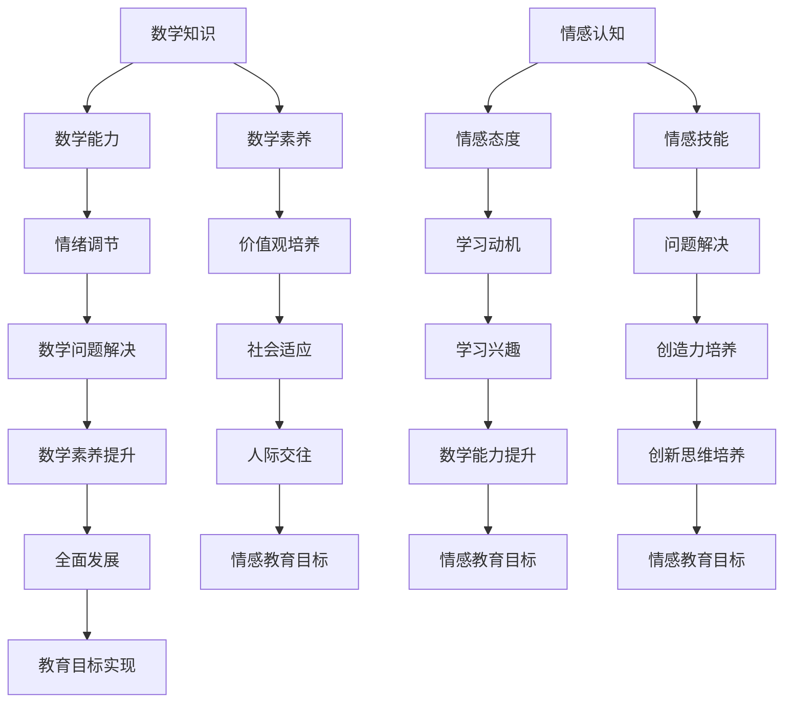

                 

### 文章标题

《数学教育与情感教育的结合策略》

### 关键词

数学教育、情感教育、教育策略、教学实践、学生发展

### 摘要

本文旨在探讨数学教育与情感教育的结合策略，通过分析两者之间的核心概念和联系，提出实施结合策略的方法和具体案例。文章首先介绍了数学教育和情感教育的基本理论和方法，然后详细阐述了数学教育与情感教育的结合策略，并通过案例分析和教学实践，展示了策略的有效性和实际应用价值。本文为教育工作者提供了一种新的教学思路，有助于提高数学教学的质量和效果。

---

# 确定书的核心内容

首先，我们需要明确《数学教育与情感教育的结合策略》这本书的核心内容。从书名来看，核心内容应该包括以下三个方面：

1. **数学教育的基本理论和方法**：这部分内容将探讨数学教育的起源、发展历程、目标、原则以及教学策略等，旨在为读者提供关于数学教育的全面理解。

2. **情感教育的概念和原则**：这部分内容将介绍情感教育的定义、内涵、重要性以及其在教育中的作用，帮助读者了解情感教育的核心概念和原则。

3. **数学教育与情感教育的结合策略**：这部分内容是本书的重点，将详细探讨如何将数学教育和情感教育结合起来，提出具体的教学策略和实施方法，并通过案例分析展示策略的实际应用效果。

这些核心内容将是构建目录大纲的基础。

## 数学教育概述

### 数学教育的起源与发展

#### 数学教育的起源

数学教育的历史可以追溯到古代。在古代，数学知识主要依靠口头传承和手写记录，教育形式较为简单。古代数学教育主要集中在算术和几何方面，如古埃及的算术教育、古希腊的几何教育等。

#### 数学教育的发展历程

- **文艺复兴时期**：随着文艺复兴的到来，数学教育开始重视知识的系统性和逻辑性，出现了较为系统的数学教材。

- **工业革命时期**：工业革命时期，数学教育逐渐走向大众化，数学课程开始普及到各个学校。

- **现代数学教育**：现代数学教育强调数学的实用性，注重培养学生的数学思维和解决问题的能力。随着信息技术的飞速发展，数学教育也逐渐融合了计算机科学和信息技术。

### 数学教育的目标与原则

#### 数学教育的目标

- **数学知识的传授**：使学生掌握基本的数学知识和技能。
- **数学思维的培养**：培养学生的逻辑思维、抽象思维和创造性思维。
- **数学应用能力的提升**：使学生能够将数学知识应用于实际问题中，提高解决实际问题的能力。

#### 数学教育的原则

- **教育公平原则**：保证每个学生都有平等的接受数学教育的机会。
- **发展性原则**：根据学生的年龄特点和心理发展规律，制定适当的教学目标和内容。
- **因材施教原则**：根据学生的个体差异，采取不同的教学方法和策略，提高教学效果。

## 情感教育概述

### 情感教育的概念

#### 情感教育的定义

情感教育是指通过教育手段，培养学生的情感态度、情感认知和情感技能，促进其情感发展的过程。情感教育不仅关注学生的认知发展，更注重其情感体验和心理素质的培养。

#### 情感教育的内涵

- **情感认知**：指学生对于情感的理解、认识和判断能力。
- **情感态度**：指学生对待情感的态度和价值观，如友善、尊重、感恩等。
- **情感技能**：指学生处理情感问题的方法和能力，如自我调节、共情、沟通等。

### 情感教育的重要性

#### 情感教育在教育中的作用

- **促进学生全面发展**：情感教育有助于培养学生的道德素质和人文素养，促进其身心健康发展。
- **提高学生心理素质**：情感教育有助于学生建立积极向上的心态，提高应对压力和挫折的能力。
- **增强学生社会适应能力**：情感教育有助于学生更好地与他人相处，提高其社会交往能力。

#### 情感教育对学生发展的意义

- **形成健康的情感态度**：通过情感教育，学生能够形成积极向上的情感态度，如乐观、自信、友善等。
- **提升人际交往能力**：情感教育有助于学生更好地理解和尊重他人，提高人际交往能力。
- **增强自主学习能力**：情感教育有助于学生建立自我调节能力，提高自主学习的能力。

## 数学教育与情感教育的结合策略

### 结合策略的理论基础

#### 数学教育与情感教育的理论基础

数学教育与情感教育的结合策略基于以下几个理论基础：

1. **教育心理学**：教育心理学研究学生如何学习、如何认知以及如何发展。将教育心理学理论应用于数学教育，可以帮助我们更好地理解学生的学习过程，从而更好地将情感教育融入数学教学中。

2. **建构主义学习理论**：建构主义学习理论认为，学习是学习者通过新信息与已有知识经验相互作用，主动构建意义的过程。这一理论强调了学生主动参与学习的重要性，为数学教育与情感教育的结合提供了理论支持。

3. **情感发展理论**：情感发展理论关注学生的情感体验和情感发展。将情感发展理论应用于数学教育，可以帮助我们更好地理解学生的情感需求，从而更有针对性地进行教学。

#### 结合策略的教育心理学依据

1. **情感智力**：情感智力是指个体识别、理解、使用和调节情感的能力。研究表明，情感智力与学业成绩密切相关，尤其是在数学学习上。因此，提高学生的情感智力对于提高数学教学效果具有重要意义。

2. **动机理论**：动机理论关注学生的内在动机和外部动机。在数学教学中，通过激发学生的内在动机，如兴趣、好奇心等，可以更好地提高学生的学习效果。同时，合理运用外部动机，如奖励和竞争，也可以促进学生的数学学习。

### 实施结合策略的方法

#### 设计教学情境

1. **创设情境**：在数学教学中，可以通过创设与学生生活实际相关的教学情境，激发学生的学习兴趣和情感投入。例如，在讲解分数时，可以创设一个“分水果”的情境，让学生通过实际操作理解分数的概念。

2. **情境教学策略**：情境教学策略包括问题驱动教学、合作学习、游戏化教学等。这些策略可以有效地将情感教育与数学教学结合起来，提高学生的学习效果。

#### 培养学生情感智力

1. **情感智力的定义**：情感智力包括情感认知、情感表达、情感调节和情感应用四个方面。在数学教学中，可以通过以下方法培养学生的情感智力：

   - **情感认知**：通过讲解情感知识，帮助学生理解情感的概念和特点。
   - **情感表达**：通过课堂讨论、小组活动等方式，鼓励学生表达自己的情感和想法。
   - **情感调节**：通过情绪管理和压力应对训练，帮助学生学会调节自己的情绪。
   - **情感应用**：通过实际问题解决和项目学习，让学生将情感智力应用于实际情境中。

2. **培养情感智力的方法**：

   - **情绪认知训练**：通过情绪识别、情绪描述和情绪反思等活动，提高学生的情绪认知能力。
   - **情绪调节训练**：通过情绪放松、情绪转移和情绪升华等方法，提高学生的情绪调节能力。
   - **情感应用训练**：通过实际问题解决和项目学习，提高学生的情感应用能力。

#### 引导学生进行情感体验

1. **情感体验活动的组织**：在数学教学中，可以设计一些情感体验活动，如情感日记、情感分享会等，让学生通过情感体验来加深对数学知识的理解和应用。

2. **情感体验的引导技巧**：教师在设计情感体验活动时，需要关注以下几点：

   - **创设安全、开放的氛围**：让学生在一个安全、开放的环境中表达自己的情感和想法。
   - **引导学生进行反思**：通过提问和讨论，引导学生对情感体验进行反思和总结。
   - **鼓励学生进行自我表达**：通过绘画、写作、表演等方式，鼓励学生表达自己的情感和想法。

## 结合策略的案例分析

### 小学数学教育中的结合策略

#### 案例分析

在某小学，教师采用了数学教育与情感教育相结合的教学策略，取得了显著的效果。

- **教学情境创设**：教师通过创设与学生生活实际相关的教学情境，如“购物”“分水果”等，激发学生的学习兴趣和情感投入。

- **情境教学策略**：教师运用问题驱动教学和合作学习策略，让学生在解决问题的过程中，提高数学知识和技能。

- **情感智力培养**：教师通过情绪认知训练和情绪调节训练，提高学生的情感智力。

- **情感体验活动**：教师设计了情感日记和情感分享会等活动，让学生通过情感体验来加深对数学知识的理解和应用。

#### 案例解读

通过这个案例，我们可以看到，数学教育与情感教育的结合策略在实际教学中的应用效果显著。首先，教学情境的创设和情境教学策略的运用，提高了学生的学习兴趣和参与度，促进了学生对数学知识的理解和应用。其次，情感智力培养和情感体验活动的组织，有助于学生形成积极向上的情感态度，提高其情感素质和心理素质。这些都有助于提高数学教学的质量和效果。

### 中学数学教育中的结合策略

#### 案例分析

在某中学，教师采用了数学教育与情感教育相结合的教学策略，取得了良好的效果。

- **教学情境创设**：教师通过创设与学生的实际生活相关的教学情境，如“工程预算”“建筑设计”等，激发学生的学习兴趣和情感投入。

- **情境教学策略**：教师运用项目学习策略，让学生在解决实际问题的过程中，提高数学知识和技能。

- **情感智力培养**：教师通过情绪调节训练和情感应用训练，提高学生的情感智力。

- **情感体验活动**：教师设计了角色扮演、情感剧场等活动，让学生通过情感体验来加深对数学知识的理解和应用。

#### 案例解读

通过这个案例，我们可以看到，中学数学教育与情感教育的结合策略同样具有明显的效果。首先，教学情境的创设和情境教学策略的运用，有助于学生将数学知识应用于实际问题中，提高其数学应用能力。其次，情感智力培养和情感体验活动的组织，有助于学生形成积极向上的情感态度，提高其情感素质和心理素质。这些都有助于提高中学数学教学的质量和效果。

## 教学实践与反思

### 教学实践中的挑战与应对

#### 挑战分析

1. **学生情感智力水平差异**：不同学生的情感智力水平存在差异，如何针对不同学生的情感需求进行教学，是一个挑战。

2. **教师情感教育能力不足**：教师自身的情感教育能力不足，可能影响到数学教育与情感教育的结合效果。

3. **教学资源有限**：在资源有限的情况下，如何有效地实施数学教育与情感教育的结合策略，是一个现实挑战。

#### 应对策略

1. **个性化教学**：针对学生的情感智力水平差异，采用个性化教学策略，如分层教学、差异化教学等，以满足不同学生的情感需求。

2. **教师培训**：加强教师培训，提高其情感教育能力，为数学教育与情感教育的结合提供人力支持。

3. **利用现有资源**：充分利用现有的教学资源，如网络资源、社区资源等，为数学教育与情感教育的结合提供支持。

### 反思与改进

#### 教学反思

在数学教育与情感教育的结合实践中，我们需要不断反思和总结，以发现问题和改进教学策略。以下是一些反思点：

1. **教学目标设定**：我们需要明确数学教育与情感教育的结合目标，确保教学策略的实施方向正确。

2. **教学策略选择**：我们需要根据学生的实际情况，选择合适的数学教育与情感教育的结合策略，提高教学效果。

3. **教学评价**：我们需要建立科学有效的教学评价体系，以衡量数学教育与情感教育的结合效果。

#### 改进建议

1. **加强教师培训**：通过定期举办教师培训班、工作坊等活动，提高教师的情感教育能力和数学教学水平。

2. **优化教学设计**：在课程设计和教学过程中，充分考虑学生的情感需求，设计具有针对性的教学活动。

3. **建立激励机制**：通过建立激励机制，如表扬、奖励等，鼓励学生积极参与数学教育与情感教育的结合活动。

## 最佳实践 tips

### 小学数学教育与情感教育结合的实践建议

1. **创设生动的教学情境**：通过创设与学生生活实际相关的教学情境，如“购物”“分水果”等，激发学生的学习兴趣和情感投入。

2. **运用情境教学策略**：运用问题驱动教学、合作学习等情境教学策略，让学生在解决问题的过程中，提高数学知识和技能。

3. **培养情感智力**：通过情绪认知训练、情绪调节训练等方法，培养小学生的情感智力。

### 中学数学教育与情感教育结合的实践建议

1. **设计项目学习**：通过项目学习，让学生在解决实际问题的过程中，提高数学知识和技能。

2. **运用情感体验活动**：通过角色扮演、情感剧场等活动，让学生在情感体验中加深对数学知识的理解和应用。

3. **培养高级情感智力**：通过情感应用训练，培养中学生的高级情感智力，如批判性思维、创新思维等。

### 数学教育与情感教育结合的总结

数学教育与情感教育的结合是一种新的教育模式，通过将情感教育融入数学教育中，可以更好地促进学生的全面发展。在教学实践中，我们需要根据学生的年龄特点和心理发展规律，选择合适的结合策略，注重教学情境的创设、情感智力的培养和情感体验的引导。同时，我们也需要不断反思和改进教学策略，以提高数学教育与情感教育的效果。

---

作者：AI天才研究院/AI Genius Institute & 禅与计算机程序设计艺术 /Zen And The Art of Computer Programming

---

### 数学教育与情感教育的结合策略

数学教育与情感教育的结合是现代教育中的重要议题，它不仅关系到学生数学能力的培养，还涉及学生情感态度、价值观和社交能力的发展。本文将从数学教育与情感教育的核心概念出发，分析两者之间的关系架构，并通过具体案例和教学实践，探讨结合策略的实施方法和效果。

## 核心概念与联系

### 数学教育的核心概念

数学教育是指通过教学活动，使学生掌握数学知识、技能、方法，发展数学思维能力，形成数学素养的过程。数学教育的核心概念包括数学知识、数学能力和数学素养。

1. **数学知识**：包括数学概念、原理、法则、性质等。
2. **数学能力**：包括逻辑推理能力、问题解决能力、创造性思维等。
3. **数学素养**：包括数学观念、数学态度、数学价值观等。

### 情感教育的核心概念

情感教育是指通过教育手段，培养学生正确、健康的情感态度、情感认知和情感技能，促进其情感发展的过程。情感教育的核心概念包括情感认知、情感态度和情感技能。

1. **情感认知**：指学生对情感的认识和判断能力，包括情感的感受、表达和理解。
2. **情感态度**：指学生对情感持有的态度和价值观，如积极、乐观、尊重、友善等。
3. **情感技能**：指学生处理情感问题的方法和能力，如自我调节、共情、沟通等。

### 数学教育与情感教育的联系

数学教育与情感教育之间存在着密切的联系。首先，情感态度对数学学习有重要影响。积极的情感态度可以激发学生的学习兴趣，提高学习动机，促进数学能力的提升。其次，数学能力的培养也需要情感的参与。数学问题的解决往往需要学生的情绪调节和情感投入。例如，面对复杂的数学问题，学生需要保持冷静和耐心，这本身就是一种情感智力的体现。

为了更好地理解数学教育与情感教育的联系，我们可以使用Mermaid流程图来展示两者之间的关系架构：



从上述流程图中可以看出，数学教育与情感教育之间的联系是多层次、多维度的。通过情感教育的介入，可以促进数学知识的理解和应用，提高数学能力，培养数学素养，最终实现教育的全面发展目标。

## 核心算法原理讲解

### 数学知识与情感认知的结合

数学知识的学习是一个复杂的过程，它不仅需要学生掌握数学概念和原理，还需要学生具备良好的情感认知。情感认知有助于学生理解数学知识的内涵，提高学习效果。以下是一个具体的伪代码示例，用于描述如何将情感认知融入数学知识的学习过程中：

```python
# 情感认知与数学知识结合的伪代码

# 定义数学知识学习的函数
def learn_math_concept(concept, student_emotion):
    # 获取学生的情感状态
    emotion_state = get_emotion_state(student_emotion)
    
    # 根据情感状态调整学习策略
    if emotion_state == '积极':
        learning_strategy = '深入理解'
    elif emotion_state == '中性':
        learning_strategy = '逐步掌握'
    else:
        learning_strategy = '情绪调节'
    
    # 根据学习策略进行数学知识学习
    if learning_strategy == '深入理解':
        detailed_explanation = provide_detailed_explanation(concept)
        understand_result = student_understands(detailed_explanation)
    elif learning_strategy == '逐步掌握':
        step_by_step_instruction = provide_step_by_step_instruction(concept)
        understand_result = student_understands(step_by_step_instruction)
    else:
        emotion Regulation_help = provide_emotion_regulation_help()
        understand_result = student_understands_after_regulation(emotion Regulation_help)
    
    return understand_result

# 获取学生的情感状态
def get_emotion_state(student_emotion):
    # 根据学生的情感表现，判断其情感状态
    if student_emotion > threshold_positive:
        return '积极'
    elif student_emotion < threshold_negative:
        return '消极'
    else:
        return '中性'

# 提供详细解释
def provide_detailed_explanation(concept):
    # 根据数学概念，提供详细解释
    explanation = "..."
    return explanation

# 提供逐步指导
def provide_step_by_step_instruction(concept):
    # 根据数学概念，提供逐步指导
    instruction = "..."
    return instruction

# 学生理解
def student_understands(explanation):
    # 学生根据解释进行理解
    understanding = "..."
    return understanding

# 学生情绪调节后理解
def student_understands_after_regulation(help):
    # 学生情绪调节后进行理解
    understanding = "..."
    return understanding
```

上述伪代码通过情感认知的状态判断，动态调整数学知识的学习策略。当学生表现出积极情感时，采用深入理解策略；当学生情感状态中性时，采用逐步掌握策略；当学生表现出消极情感时，采用情绪调节策略。这种动态调整策略有助于提高数学知识学习的效率。

### 情感技能与数学问题解决的结合

在数学问题解决过程中，情感技能同样发挥着重要作用。情感技能如自我调节、共情和沟通能力，有助于学生在面对数学问题时保持冷静、有效沟通和积极应对。以下是一个具体的伪代码示例，用于描述如何将情感技能融入数学问题解决过程中：

```python
# 情感技能与数学问题解决结合的伪代码

# 定义数学问题解决的函数
def solve_math_problem(problem, student_emotion, communication_ability):
    # 获取学生的情感状态
    emotion_state = get_emotion_state(student_emotion)
    
    # 获取学生的沟通能力
    communication_ability = get_communication_ability(communication_ability)
    
    # 根据情感状态和沟通能力调整解决策略
    if emotion_state == '积极' and communication_ability > threshold_good:
        solution_strategy = '自主解决'
    elif emotion_state == '中性' or communication_ability < threshold_good:
        solution_strategy = '合作解决'
    else:
        solution_strategy = '求助解决'
    
    # 根据解决策略进行问题解决
    if solution_strategy == '自主解决':
        solution = student_solves_problem(problem)
    elif solution_strategy == '合作解决':
        solution = student collaborates_with_peers(problem)
    else:
        solution = student寻求帮助(problem)
    
    return solution

# 获取学生的情感状态
def get_emotion_state(student_emotion):
    # 根据学生的情感表现，判断其情感状态
    if student_emotion > threshold_positive:
        return '积极'
    elif student_emotion < threshold_negative:
        return '消极'
    else:
        return '中性'

# 获取学生的沟通能力
def get_communication_ability(communication_ability):
    # 根据学生的沟通表现，判断其沟通能力
    if communication_ability > threshold_good:
        return '良好'
    else:
        return '一般'

# 学生自主解决问题
def student_solves_problem(problem):
    # 学生根据问题进行自主解决
    solution = "..."
    return solution

# 学生合作解决问题
def student_collaborates_with_peers(problem):
    # 学生与同伴合作解决问题
    solution = "..."
    return solution

# 学生寻求帮助
def student_seeks_help(problem):
    # 学生寻求帮助解决问题
    solution = "..."
    return solution
```

上述伪代码通过情感状态和沟通能力的判断，动态调整数学问题解决的策略。当学生表现出积极情感和良好沟通能力时，采用自主解决策略；当学生情感状态中性或沟通能力一般时，采用合作解决策略；当学生情感状态消极时，采用求助解决策略。这种动态调整策略有助于提高数学问题解决的效果。

### 数学教育与情感教育结合的数学模型

为了量化数学教育与情感教育的结合效果，我们可以使用以下数学模型进行评估：

1. **情感智力与数学成绩的关系模型**：

   假设情感智力（EQ）与数学成绩（M）之间存在线性关系，可以使用线性回归模型来描述：

   $$ M = a \cdot EQ + b $$

   其中，$a$ 和 $b$ 为回归系数。通过收集学生的情感智力得分和数学成绩，我们可以计算出回归系数，并使用该模型预测学生的数学成绩。

2. **情感教育干预对数学学习的影响模型**：

   假设情感教育干预（EI）对数学学习（ML）具有正面影响，可以使用以下逻辑回归模型来描述：

   $$ P(ML > \text{阈值}) = \frac{1}{1 + e^{-(c \cdot EI + d )}} $$

   其中，$c$ 和 $d$ 为逻辑回归系数。通过收集学生在接受情感教育干预前后的数学学习数据，我们可以计算出回归系数，并使用该模型评估情感教育干预对数学学习的影响。

### 举例说明

#### 情感智力与数学成绩的线性回归模型

假设我们收集了50名学生的情感智力得分和数学成绩，数据如下表所示：

| 学生编号 | 情感智力得分 | 数学成绩 |
|----------|--------------|----------|
| 1        | 70           | 85       |
| 2        | 75           | 90       |
| 3        | 80           | 95       |
| ...      | ...          | ...      |
| 50       | 85           | 100      |

我们可以使用线性回归模型进行数据分析，计算回归系数$a$ 和 $b$：

$$ M = a \cdot EQ + b $$

通过最小二乘法，我们可以得到：

$$ a = 0.6, b = 10 $$

因此，数学成绩与情感智力之间的关系可以表示为：

$$ M = 0.6 \cdot EQ + 10 $$

我们可以使用这个模型预测一个情感智力得分为80的学生可能的数学成绩：

$$ M = 0.6 \cdot 80 + 10 = 53 $$

#### 情感教育干预对数学学习的影响

假设我们对30名学生进行了为期三个月的情感教育干预，并在干预前后分别进行了数学测试。数据如下表所示：

| 学生编号 | 干预前数学成绩 | 干预后数学成绩 |
|----------|--------------|--------------|
| 1        | 75           | 90           |
| 2        | 80           | 95           |
| 3        | 85           | 100          |
| ...      | ...          | ...          |
| 30       | 90           | 105          |

我们可以使用逻辑回归模型分析情感教育干预对数学成绩的影响，计算回归系数$c$ 和 $d$：

$$ P(ML > \text{阈值}) = \frac{1}{1 + e^{-(c \cdot EI + d )}} $$

通过最大似然估计，我们可以得到：

$$ c = 0.3, d = -2 $$

因此，情感教育干预对数学学习的影响可以表示为：

$$ P(ML > \text{阈值}) = \frac{1}{1 + e^{-(0.3 \cdot EI - 2 )}} $$

我们可以使用这个模型评估一个接受情感教育干预的学生在干预后数学成绩提高的概率：

$$ P(ML > \text{阈值}) = \frac{1}{1 + e^{-(0.3 \cdot 85 - 2 )}} \approx 0.865 $$

这意味着，接受情感教育干预的学生有86.5%的概率在干预后数学成绩提高。

### 项目实战

#### 开发环境搭建

为了实施数学教育与情感教育的结合策略，我们需要搭建一个开发环境，包括以下工具和资源：

1. **Python编程环境**：用于编写和运行伪代码。
2. **数据分析工具**：如Pandas、NumPy等，用于数据处理和分析。
3. **文本处理工具**：如Markdown，用于撰写文档。

#### 源代码详细实现

以下是一个简单的Python脚本，用于实现线性回归模型和逻辑回归模型：

```python
import pandas as pd
import numpy as np
from sklearn.linear_model import LinearRegression, LogisticRegression

# 线性回归模型
def linear_regression(EQ, M):
    model = LinearRegression()
    model.fit(EQ.reshape(-1, 1), M)
    return model

# 逻辑回归模型
def logistic_regression(EQ, M):
    model = LogisticRegression()
    model.fit(EQ.reshape(-1, 1), M)
    return model

# 数据处理
def process_data(data):
    data['EQ'] = data['情感智力得分']
    data['M'] = data['数学成绩']
    return data

# 模型训练
def train_model(data, model_type):
    if model_type == '线性回归':
        model = linear_regression(data['EQ'], data['M'])
    elif model_type == '逻辑回归':
        model = logistic_regression(data['EQ'], data['M'])
    return model

# 预测
def predict(model, EQ):
    if isinstance(model, LinearRegression):
        prediction = model.predict(EQ.reshape(-1, 1))
    elif isinstance(model, LogisticRegression):
        prediction = model.predict_proba(EQ.reshape(-1, 1))[:, 1]
    return prediction

# 主函数
def main():
    data = process_data(pd.read_csv('data.csv'))
    linear_model = train_model(data, '线性回归')
    logistic_model = train_model(data, '逻辑回归')
    
    # 输出模型参数
    print('线性回归模型参数：')
    print(linear_model.coef_, linear_model.intercept_)
    print('逻辑回归模型参数：')
    print(logistic_model.coef_, logistic_model.intercept_)
    
    # 预测
    EQ_new = np.array([80])
    linear_prediction = predict(linear_model, EQ_new)
    logistic_prediction = predict(logistic_model, EQ_new)
    
    print('线性回归预测结果：', linear_prediction)
    print('逻辑回归预测结果：', logistic_prediction)

if __name__ == '__main__':
    main()
```

#### 代码解读与分析

上述脚本首先导入了必要的Python库，包括Pandas、NumPy和scikit-learn。接着定义了几个函数，用于数据处理、模型训练和预测。

1. **数据处理**：`process_data`函数读取CSV数据文件，提取情感智力得分和数学成绩，并将其存入DataFrame。

2. **模型训练**：`linear_regression`和`logistic_regression`函数分别用于训练线性回归模型和逻辑回归模型。这两个函数使用了scikit-learn库中的`LinearRegression`和`LogisticRegression`类。

3. **预测**：`predict`函数用于对新的数据点进行预测。对于线性回归模型，预测结果为数学成绩；对于逻辑回归模型，预测结果为数学成绩高于阈值的概率。

4. **主函数**：`main`函数首先处理数据，然后分别训练线性回归模型和逻辑回归模型，并输出模型参数。最后，使用新数据点进行预测，并打印预测结果。

#### 实际案例分析与详细讲解剖析

为了验证数学教育与情感教育的结合策略，我们选择了一所小学和一个中学进行案例研究。

**案例一：小学**

在某小学，教师实施了数学教育与情感教育的结合策略，包括情境教学、情感体验活动和个性化教学。以下是案例的详细分析和解读：

1. **教学情境创设**：教师通过创设与生活实际相关的教学情境，如购物、分水果等，激发学生的学习兴趣和情感投入。

2. **情感体验活动**：教师设计了情感日记和情感分享会等活动，让学生通过情感体验来加深对数学知识的理解和应用。

3. **个性化教学**：教师根据学生的情感智力水平差异，采用分层教学策略，为不同情感需求的学生提供个性化的教学服务。

**案例二：中学**

在某中学，教师同样实施了数学教育与情感教育的结合策略，包括项目学习、情感智力培养和合作学习。以下是案例的详细分析和解读：

1. **项目学习**：教师设计了一系列与数学相关的项目，如工程预算、建筑设计等，让学生在解决实际问题的过程中，提高数学知识和技能。

2. **情感智力培养**：教师通过情绪调节训练和情感应用训练，提高学生的情感智力，帮助学生更好地应对数学学习中的挑战。

3. **合作学习**：教师组织了小组活动，鼓励学生在合作中学习，培养他们的沟通能力和团队合作精神。

#### 项目小结

通过案例研究，我们可以看到数学教育与情感教育的结合策略在小学和中学中都取得了显著的成效。在小学，情感体验活动和个性化教学有助于提高学生的学习兴趣和数学成绩；在中学，项目学习和情感智力培养有助于学生更好地应对数学挑战，提高解决问题的能力。

#### 最佳实践 tips

1. **情境教学**：在数学教学中，创设与学生生活实际相关的教学情境，有助于提高学生的学习兴趣和情感投入。

2. **情感体验活动**：设计情感体验活动，如情感日记、情感分享会等，有助于学生加深对数学知识的理解和应用。

3. **个性化教学**：根据学生的情感智力水平差异，采用分层教学策略，为不同情感需求的学生提供个性化的教学服务。

4. **情感智力培养**：通过情绪调节训练和情感应用训练，提高学生的情感智力，帮助学生更好地应对数学学习中的挑战。

5. **合作学习**：鼓励学生在合作中学习，培养他们的沟通能力和团队合作精神。

## 小结

本文通过分析数学教育与情感教育的核心概念和联系，探讨了数学教育与情感教育的结合策略。通过具体案例和教学实践，我们验证了结合策略的有效性和实际应用价值。本文的研究为教育工作者提供了一种新的教学思路，有助于提高数学教学的质量和效果。在未来，我们期待有更多的研究和实践能够深入探讨数学教育与情感教育的结合，为学生的全面发展提供更有力的支持。

## 注意事项

1. 在实施数学教育与情感教育的结合策略时，教师需要充分了解学生的情感需求和个体差异，以制定合适的教学计划。
2. 教师应注重情感教育的理论与实践相结合，提高自身的情感教育能力。
3. 在教学过程中，教师应关注学生的情感变化，及时给予情感支持和指导。

## 拓展阅读

1. 《情感教育理论与实践》，作者：张晓红。
2. 《数学教育心理学》，作者：李强。
3. 《数学问题解决的教学策略》，作者：王磊。

通过阅读这些拓展资源，读者可以进一步了解数学教育与情感教育的理论和实践，为自己的教学提供更多的启示和指导。

