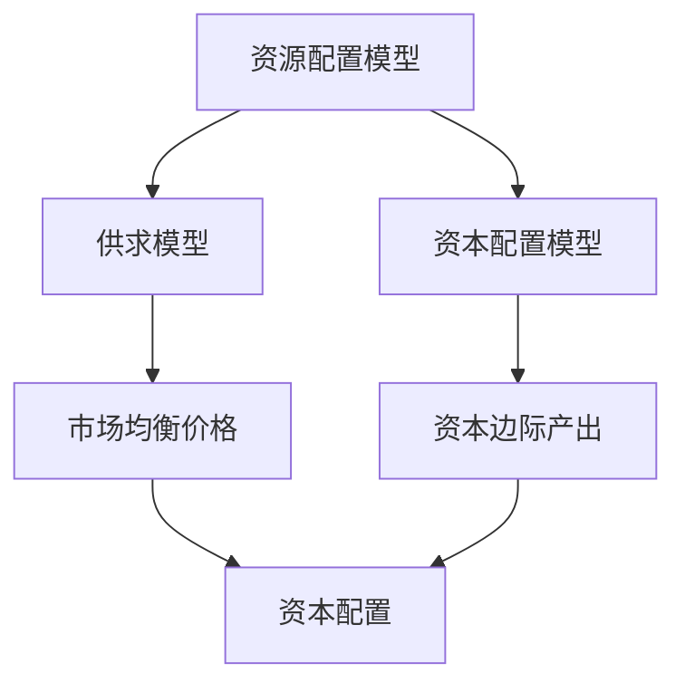
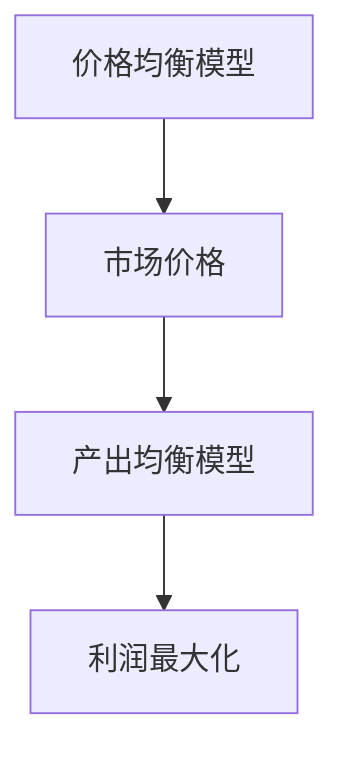
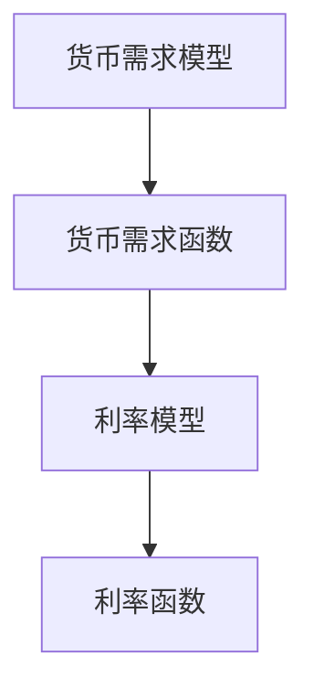
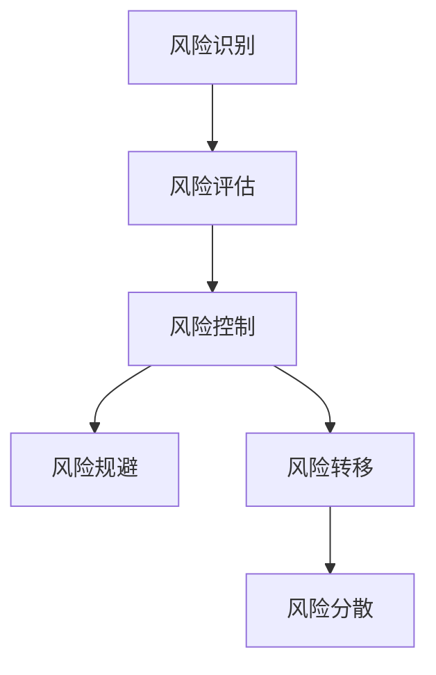
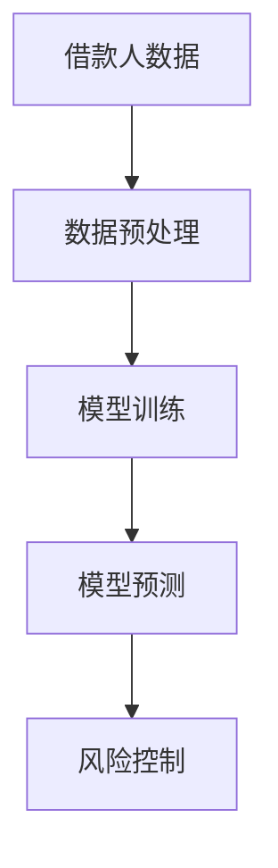
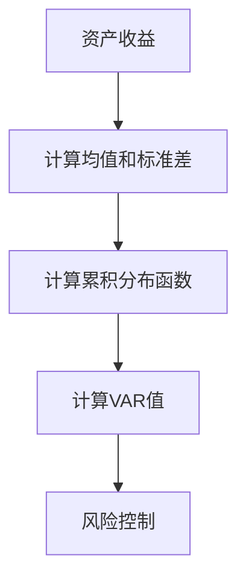
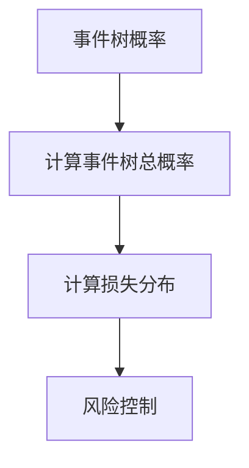

                 


### 引言

#### 1.1 背景与意义

经济金融领域作为社会科学和自然科学的重要交叉领域，其研究的深度和广度对国家、企业和个人都有着深远的影响。在经济全球化和金融市场一体化的背景下，如何有效地利用数学模型对经济金融现象进行描述、预测和分析，成为了一个至关重要的问题。

数学模型在经济金融领域中的应用具有重大的意义。首先，数学模型能够将复杂的经济金融问题抽象成数学问题，使得我们能够用更加精确和系统的方式来理解这些现象。其次，数学模型提供了定量分析的工具，使得我们能够对经济金融数据进行深度挖掘，从而发现潜在规律和趋势。此外，数学模型还可以帮助我们进行风险管理，降低金融风险，保障经济稳定。

随着计算机技术和金融理论的不断发展，数学模型在经济金融领域的应用越来越广泛。从宏观经济分析到微观金融决策，从资产定价到风险管理，数学模型无处不在。然而，由于数学模型本身的复杂性和应用领域的多样性，如何有效地理解和应用数学模型，仍然是一个具有挑战性的问题。

本文旨在系统性地介绍数学模型在经济金融领域的应用，通过逐步分析不同类型的数学模型，探讨其在实际中的应用和影响。文章结构如下：

- 引言：介绍数学模型在经济金融领域的背景和意义。
- 数学模型基础：介绍数学模型的基本概念和类型。
- 经济金融中的数学模型：详细探讨经典经济模型和金融数学模型。
- 数学模型在经济金融分析中的应用：分析数学模型在宏观经济分析和资产定价中的应用。
- 数学模型与经济金融数据：介绍如何使用数学模型进行实证分析。
- 数学模型与经济金融风险管理：探讨数学模型在风险管理中的应用。
- 经济金融领域的前沿研究与应用：展望数学模型在经济金融领域的未来发展方向。
- 结论：总结文章的主要发现和贡献，并展望未来研究方向。

通过这篇文章，我们希望能够为读者提供一个全面、系统的数学模型在经济金融领域应用的参考指南，帮助读者更好地理解和应用这些模型。

#### 1.2 书籍结构安排

为了使读者能够系统地了解数学模型在经济金融领域的应用，本文将分为八个主要章节。

### 2. 数学模型基础

在这一章中，我们将介绍数学模型的基本概念、分类和特点。通过了解数学模型的基础知识，读者可以更好地理解后续章节中具体的经济金融模型。

#### 2.1 数学模型概述

本节将简要介绍数学模型的基本概念，包括变量、参数、函数、方程等基本概念。同时，我们将探讨数学模型在自然科学、社会科学和经济金融等领域的广泛应用。

#### 2.2 数学模型的基本概念

在这一节中，我们将详细讨论数学模型的基本概念，包括线性与非线性模型、确定性模型与随机模型、静态模型与动态模型等。这些基本概念是理解和应用数学模型的基础。

#### 2.3 数学模型的应用领域

本节将介绍数学模型在各个领域的应用，特别是经济金融领域。我们将讨论数学模型在经济分析、金融工程、风险管理等方面的应用。

### 3. 经济金融中的数学模型

在这一章中，我们将详细探讨经典经济模型和金融数学模型。这些模型是经济金融理论的重要组成部分，对于理解经济金融现象具有重要意义。

#### 3.1 经典经济模型

本节将介绍经典经济模型，包括资源配置模型、市场均衡模型和货币与金融市场模型。我们将讨论这些模型的基本原理和主要应用。

#### 3.2 金融数学模型

在这一节中，我们将介绍金融数学模型，包括风险管理模型、投资组合模型和市场微观结构模型。这些模型在金融市场中发挥着重要作用，对于投资者和金融机构具有很高的参考价值。

### 4. 数学模型在经济金融分析中的应用

在这一章中，我们将分析数学模型在宏观经济分析和资产定价中的应用。通过具体的例子和算法，我们将展示数学模型如何帮助经济学家和金融分析师进行经济预测和决策。

#### 4.1 宏观经济分析

本节将介绍数学模型在宏观经济分析中的应用，包括经济增长模型、货币政策和财政政策模型。我们将讨论如何使用这些模型进行经济预测和政策制定。

#### 4.2 资产定价

在这一节中，我们将介绍资产定价模型，包括期权定价模型、固定收益证券定价模型和信贷风险模型。我们将探讨这些模型的基本原理和计算方法。

### 5. 数学模型与经济金融数据

在这一章中，我们将探讨如何使用数学模型对经济金融数据进行分析。通过数据收集、预处理、可视化和实证分析，我们将展示数学模型在数据驱动的经济金融研究中的应用。

#### 5.1 数据分析基础

本节将介绍数据分析的基础知识，包括数据获取、数据预处理和数据可视化。我们将讨论如何使用Python、R等编程语言进行数据分析。

#### 5.2 实证分析

在这一节中，我们将介绍如何使用数学模型进行实证分析。通过具体的例子，我们将展示如何使用模型对经济金融数据进行建模和分析。

### 6. 数学模型与经济金融风险管理

在这一章中，我们将探讨数学模型在经济金融风险管理中的应用。通过风险管理框架、信用风险管理模型和市场风险管理模型，我们将展示如何使用数学模型进行风险管理。

#### 6.1 风险管理框架

本节将介绍风险管理的基本框架，包括风险识别、风险评估、风险控制和风险监控。我们将讨论如何使用数学模型进行这些步骤。

#### 6.2 数学模型在风险管理中的应用

在这一节中，我们将介绍具体的数学模型，如VAR模型、信用评分模型和操作风险模型，并讨论它们在风险管理中的应用。

### 7. 数学模型在经济金融领域的前沿研究与应用

在这一章中，我们将探讨数学模型在经济金融领域的前沿研究与应用。通过大数据分析、金融科技和新型经济模型，我们将展示数学模型在当前和未来经济金融领域的应用趋势。

#### 7.1 金融科技与大数据分析

本节将介绍金融科技和大数据分析在经济金融领域中的应用。我们将讨论如何使用这些新技术进行数据分析和模型构建。

#### 7.2 经济金融模型的新发展

在这一节中，我们将探讨经济金融模型的新发展，包括新型经济模型和金融模型。我们将讨论这些模型如何应对新的经济金融挑战。

### 8. 结论

在这一章中，我们将总结文章的主要发现和贡献，并探讨未来研究方向。通过回顾文章的主要内容，我们将展示数学模型在经济金融领域的重要性和潜力。

#### 8.1 主要发现与贡献

本节将总结文章的主要发现和贡献，讨论数学模型在经济金融领域的应用价值。

#### 8.2 展望未来研究方向

在这一节中，我们将展望未来研究方向，讨论如何进一步推进数学模型在经济金融领域的研究和应用。

### 9. 参考文献

在这一章中，我们将列出文章中引用的所有参考文献，以便读者进一步阅读和研究。

通过以上章节的安排，我们希望能够为读者提供一个全面、系统的数学模型在经济金融领域应用的参考指南，帮助读者更好地理解和应用这些模型。

### 文章关键词

- 数学模型
- 经济金融
- 风险管理
- 资产定价
- 宏观经济分析
- 数据分析

### 文章摘要

本文旨在系统性地介绍数学模型在经济金融领域的应用。文章首先介绍了数学模型的基本概念和分类，然后详细探讨了经典经济模型和金融数学模型。接着，文章分析了数学模型在宏观经济分析和资产定价中的应用，并介绍了如何使用数学模型对经济金融数据进行实证分析。此外，文章还探讨了数学模型在经济金融风险管理中的应用，包括风险管理框架和具体的风险管理模型。最后，文章展望了数学模型在经济金融领域的前沿研究与应用，总结了文章的主要发现与贡献，并提出了未来研究方向。通过本文，读者可以全面了解数学模型在经济金融领域的应用，提高其在实际工作中的应用能力。

### 数学模型基础

#### 2.1 数学模型概述

数学模型是一种利用数学语言和方法来描述和研究现实世界现象的抽象工具。在经济金融领域，数学模型广泛应用于宏观经济分析、微观金融决策、风险管理、资产定价等方面。数学模型的核心在于将复杂的经济金融现象转化为简化的数学形式，从而便于分析和理解。

数学模型的基本组成部分包括变量、参数、函数和方程。变量是模型中的基本元素，用来表示经济金融现象中的不同特征和关系。参数则是模型中固定的数值，用来描述变量之间的关系和趋势。函数是变量之间的关系，可以是线性的或非线性的，用来描述经济金融现象的动态变化。方程则是函数的表达式，用来建立变量之间的数学关系，是数学模型的核心。

数学模型的特点主要包括以下几个方面：

1. **抽象性**：数学模型是对现实经济金融现象的抽象和简化，通过省略不必要的细节，突出关键特征和关系。
2. **精确性**：数学模型使用精确的数学语言和方法，使得对经济金融现象的描述和分析具有更高的准确性和可靠性。
3. **系统性**：数学模型通常包含多个变量和方程，形成一个完整的系统，能够全面描述经济金融现象的复杂关系。
4. **可计算性**：数学模型可以用计算机程序进行计算，从而实现对大量数据的处理和分析。

数学模型在自然科学、社会科学和经济金融等领域的应用非常广泛。在自然科学领域，数学模型用于描述自然现象和物理规律，如牛顿力学、热力学、电磁学等。在社会科学领域，数学模型用于研究社会行为、经济发展、政策评估等，如经济学模型、社会学模型等。在经济金融领域，数学模型被广泛应用于宏观经济分析、资产定价、风险管理、投资组合优化等方面，如经济增长模型、货币政策模型、资产定价模型等。

#### 2.2 数学模型的基本概念

要理解和应用数学模型，首先需要掌握其基本概念。以下是数学模型中的几个核心概念：

**变量**：变量是数学模型中的基本元素，用来表示经济金融现象中的不同特征和关系。变量可以是离散的或连续的，可以是确定性变量或随机变量。离散变量是指取值有限的变量，如股票价格；连续变量是指取值无限的变量，如温度。确定性变量是指其值可以精确预测的变量，如利率；随机变量是指其值具有不确定性，如股票收益。

**参数**：参数是数学模型中的固定数值，用来描述变量之间的关系和趋势。参数通常是通过统计数据或历史数据估计得到的。例如，在资产定价模型中，参数可能包括股票的波动率和预期收益。

**函数**：函数是变量之间的关系，用来描述经济金融现象的动态变化。函数可以是线性的或非线性的，线性的函数通常具有简单和直观的性质，而非线性函数则可以描述更加复杂的经济金融现象。例如，线性函数y = mx + b表示直线关系，其中m是斜率，b是截距；非线性函数y = 1/x表示倒数关系。

**方程**：方程是函数的表达式，用来建立变量之间的数学关系。方程可以是线性的或非线性的，例如，线性方程y = mx + b表示一条直线，而非线性方程y = 1/x表示一条双曲线。

**线性与非线性模型**：线性模型是指函数和方程都是线性的，如y = mx + b。线性模型通常具有简单的形式和直观的性质，便于计算和理解。非线性模型则是指函数和方程包含非线性元素，如y = 1/x。非线性模型可以描述更加复杂和多样的经济金融现象，但通常更难计算和理解。

**确定性模型与随机模型**：确定性模型是指模型中的所有变量和参数都是确定的，其结果可以精确预测。确定性模型通常适用于短期和稳定的宏观经济环境。随机模型则是指模型中包含随机变量，其结果具有不确定性，如股票价格波动。随机模型适用于研究长期和动态的经济金融现象。

**静态模型与动态模型**：静态模型是指模型不考虑时间因素，只分析某一时刻的经济金融现象，如市场价格。动态模型则是指模型考虑时间因素，分析经济金融现象在不同时间点的变化，如经济增长模型。动态模型通常包含差分方程或微分方程，能够更好地描述经济金融现象的动态特征。

#### 2.3 数学模型的应用领域

数学模型在经济金融领域具有广泛的应用。以下是数学模型在几个关键领域的具体应用：

**宏观经济分析**：宏观经济分析涉及对整个经济体系的运行进行分析和预测，包括经济增长、通货膨胀、失业率、货币政策等。常用的数学模型包括索洛经济增长模型、菲利普斯曲线、新古典综合模型等。这些模型通过建立变量之间的关系，帮助我们理解经济运行的规律和趋势。

**资产定价**：资产定价是指对各种金融资产的价值进行评估和预测，包括股票、债券、期权等。常用的资产定价模型包括资本资产定价模型（CAPM）、套利定价理论（APT）、期权定价模型（如Black-Scholes模型）等。这些模型通过分析资产的风险收益特征，为投资者提供资产定价的参考依据。

**风险管理**：风险管理是指通过识别、评估、控制和转移风险，以保障经济金融系统的稳定和安全。常用的数学模型包括价值在风险调整模型（VAR）、信用评分模型、操作风险模型等。这些模型通过量化风险，帮助金融机构和管理者进行有效的风险管理。

**微观金融决策**：微观金融决策是指投资者和金融机构在具体交易和投资中的决策过程，包括投资组合选择、交易策略制定等。常用的数学模型包括马科维茨投资组合模型、均值-方差模型、行为金融模型等。这些模型通过优化决策过程，提高投资效率和收益。

**金融市场微观结构**：金融市场微观结构研究涉及市场价格的发现、交易机制、交易行为等方面。常用的数学模型包括价格发现模型、交易行为模型、市场微观结构模型等。这些模型通过分析市场微观机制，帮助我们理解市场价格的形成和波动。

总之，数学模型在经济金融领域的应用不仅提高了研究的精确性和系统性，也为经济决策提供了重要的工具和参考。随着数学模型和计算机技术的不断发展，数学模型在经济金融领域的应用前景将更加广阔。

### 经典经济模型

经济模型是经济学研究的重要工具，通过将复杂的经济现象简化为数学形式，经济学家能够更精确地描述和分析经济行为。经典经济模型在经济金融领域具有重要应用，以下我们将详细探讨资源配置模型、市场均衡模型和货币与金融市场模型。

#### 3.1.1 资源配置模型

资源配置模型是一种经济学模型，主要研究如何在有限资源下实现最优分配。其核心思想是利用效率原则，确保资源得到最佳利用。资源配置模型的基本假设包括：资源稀缺、消费者和生产者的理性决策、市场价格信号的有效性。

**供求模型**：供求模型是资源配置模型中最基本的模型之一。该模型通过分析商品的供给和需求关系，揭示市场价格的形成机制。供求模型的基本概念包括供给函数和需求函数。供给函数描述了在不同价格水平下，生产者愿意提供的商品数量；需求函数描述了在不同价格水平下，消费者愿意购买的商品数量。供求模型的核心方程是市场均衡条件，即供给等于需求，即Qs = Qd。市场均衡价格P*由供求曲线的交点确定。

**资本配置模型**：资本配置模型是资源配置模型的另一个重要方面。该模型研究如何在各种投资机会中合理配置资本，以实现最大化的经济收益。资本配置模型的基本假设包括：资本机会成本、投资风险、市场效率。资本配置模型的关键概念包括资本边际产出（MPL）和资本价格（P）。资本配置模型的目标是找到最优的资本分配比例，使得总产出最大化。

**基本原理与联系**：供求模型和资本配置模型虽然研究的具体问题不同，但它们之间存在紧密的联系。供求模型通过分析市场均衡价格和数量，为资本配置提供了价格信号。资本配置模型则利用这些价格信号，优化资本的分配，提高整体经济效率。

**Mermaid流程图**：


**核心算法原理讲解**：
供求模型和资本配置模型的核心算法可以简化为以下伪代码：

```python
# 供求模型
def supply_curve(price):
    return a * price + b

def demand_curve(price):
    return c * price + d

def market_equilibrium():
    while True:
        price = (a * b - c * d) / (a + c)
        if abs(supply_curve(price) - demand_curve(price)) < tolerance:
            break
    return price

# 资本配置模型
def marginal_product_of_capital(price):
    return MPL * price

def optimal_capital_allocation(MPL1, MPL2, MPL3):
    return (MPL1 + MPL2 + MPL3) / 3
```

#### 3.1.2 市场均衡模型

市场均衡模型是一种描述商品和服务在市场中达到均衡状态的经济学模型。该模型主要研究在市场供求力量的作用下，价格和数量如何达到平衡。

**价格均衡模型**：价格均衡模型通过分析商品的市场供求关系，确定市场价格和数量的均衡状态。基本假设包括：消费者和厂商是理性的，市场价格信号完全传递。价格均衡模型的核心方程是供求函数的交点，即Qs = Qd。市场价格P*由供求曲线的交点确定。

**产出均衡模型**：产出均衡模型主要研究厂商在生产过程中如何实现产出最大化。该模型的基本假设包括：厂商追求利润最大化，市场价格和成本是已知的。产出均衡模型的核心方程是利润最大化条件，即π = TR - TC，其中π是利润，TR是总收益，TC是总成本。

**基本原理与联系**：价格均衡模型和产出均衡模型共同构成了市场均衡模型的基本框架。价格均衡模型通过供求关系确定市场价格，为产出均衡模型提供了价格信号。产出均衡模型则利用市场价格信号，实现生产者的利润最大化。

**Mermaid流程图**：


**核心算法原理讲解**：
价格均衡模型和产出均衡模型的核心算法可以简化为以下伪代码：

```python
# 价格均衡模型
def supply_curve(price):
    return a * price + b

def demand_curve(price):
    return c * price + d

def market_equilibrium():
    while True:
        price = (a * b - c * d) / (a + c)
        if abs(supply_curve(price) - demand_curve(price)) < tolerance:
            break
    return price

# 产出均衡模型
def production_function(L, K):
    return f(L, K)

def cost_function(L, K):
    return w * L + r * K

def profit最大化():
    L, K = find_critical_points(f, cost_function)
    return production_function(L, K) - cost_function(L, K)
```

#### 3.1.3 货币与金融市场模型

货币与金融市场模型研究货币的供给与需求、利率的决定机制以及金融市场上的资产定价。该模型对于理解宏观经济和金融市场的运行具有重要意义。

**货币需求模型**：货币需求模型主要研究消费者和厂商对货币的需求。基本假设包括：货币是交易媒介、价值储存和计价单位。货币需求模型的核心方程是货币需求函数，表示为Md = f(y, i, r)，其中y是收入，i是利率，r是货币价格。

**利率模型**：利率模型主要研究利率的决定机制。基本假设包括：利率是货币需求与供给的函数，货币供给由中央银行控制。利率模型的核心方程是利率函数，表示为r = f(Md, Ms)，其中Md是货币需求，Ms是货币供给。

**基本原理与联系**：货币需求模型和利率模型共同构成了货币与金融市场模型的基本框架。货币需求模型通过分析消费者和厂商的货币需求，为利率模型提供了需求信号。利率模型则利用这些需求信号，确定市场利率，进而影响经济金融活动。

**Mermaid流程图**：


**核心算法原理讲解**：
货币需求模型和利率模型的核心算法可以简化为以下伪代码：

```python
# 货币需求模型
def money_demand(y, i, r):
    return y * (1 - i) * (1 - r)

# 利率模型
def money_supply(Ms):
    return Ms

def interest_rate(Md, Ms):
    while True:
        r = Md / Ms
        if abs(Md - money_supply(r)) < tolerance:
            break
    return r
```

综上所述，经典经济模型通过抽象和简化的方法，帮助我们理解和分析经济现象。资源配置模型、市场均衡模型和货币与金融市场模型分别从不同角度描述了经济运行的规律，为宏观经济分析和金融决策提供了重要的理论支持。通过逐步分析这些模型，我们可以更好地理解经济金融领域的复杂性和多样性。

### 金融数学模型

金融数学模型是金融理论的重要组成部分，它们通过数学工具和方法对金融现象进行量化分析。这些模型在风险管理和投资组合选择中扮演着关键角色，为金融机构和投资者提供决策支持。以下将详细介绍风险管理模型、投资组合模型和市场微观结构模型。

#### 3.2.1 风险管理模型

风险管理是金融活动中至关重要的环节，旨在识别、评估、控制和转移风险，确保金融机构的稳健运行。金融数学模型在风险管理中发挥着重要作用，以下介绍几种常用的风险管理模型：

**价值在风险调整模型（Value at Risk, VAR）**

VAR模型是一种衡量市场风险的方法，用于估计在特定时间段内和特定置信水平下，金融资产或投资组合可能遭受的最大潜在损失。VAR模型的基本原理是基于历史数据，通过统计分析方法确定金融资产的收益分布，然后计算在给定置信水平下的潜在最大损失。

**VAR模型的计算方法**

VAR模型的计算过程可以简化为以下步骤：

1. 收集历史数据：首先，需要收集金融资产或投资组合的历史收益数据。
2. 计算收益分布：利用历史数据，计算资产收益的均值和标准差，构建资产收益的概率分布。
3. 确定置信水平：根据风险管理需求，设定置信水平，如95%。
4. 计算VAR值：在给定的置信水平下，从资产收益的概率分布中找到对应分位数，这个分位数即为VAR值。

**伪代码实现**

```python
def calculate_VAR(returns, confidence_level):
    mean = np.mean(returns)
    std = np.std(returns)
    z_score = norm.ppf(1 - confidence_level)
    VAR = z_score * std * np.sqrt(len(returns) - 1)
    return VAR

# 示例：计算95%置信水平下的VAR
returns = [0.02, 0.03, -0.01, 0.04, -0.02]
VAR_95 = calculate_VAR(returns, 0.95)
print("95%置信水平下的VAR:", VAR_95)
```

**贝叶斯风险管理**

贝叶斯风险管理模型是一种基于贝叶斯统计理论的模型，它利用先验知识和历史数据来估计风险参数，并根据新的数据不断更新这些估计值。贝叶斯风险管理模型的核心思想是利用贝叶斯公式，结合先验分布和似然函数，计算后验分布，从而实现对风险参数的精确估计。

**贝叶斯风险管理的基本步骤**

1. 设定先验分布：根据领域知识和历史数据，设定风险参数的先验分布。
2. 收集数据：收集新的数据，这些数据将用于更新先验分布。
3. 计算后验分布：利用贝叶斯公式计算风险参数的后验分布。
4. 风险评估：利用后验分布评估当前的风险水平。

**伪代码实现**

```python
# 贝叶斯风险管理伪代码
prior_distribution = normal_distribution(mu0, sigma0)
new_data = collect_new_data()
likelihood = normal_likelihood(prior_distribution, new_data)
posterior_distribution = bayesian_update(prior_distribution, likelihood)
risk_evaluation(posterior_distribution)
```

#### 3.2.2 投资组合模型

投资组合模型是金融数学中的核心模型，旨在优化投资组合，以实现风险和收益的最佳平衡。以下介绍几种常用的投资组合模型：

**马科维茨投资组合模型**

马科维茨投资组合模型是由哈里·马科维茨提出的，它是现代投资组合理论的基础。该模型通过均值-方差模型，量化资产的风险和收益，并利用优化方法确定投资组合的最优权重。

**马科维茨投资组合模型的基本步骤**

1. 收集资产收益率数据：收集各个资产的历史收益率数据。
2. 计算期望收益率和方差：计算每个资产的期望收益率和方差。
3. 建立投资组合权重矩阵：利用均值-方差模型，构建投资组合权重矩阵。
4. 优化投资组合：利用优化算法，如线性规划，确定投资组合的最优权重。

**伪代码实现**

```python
def calculate_portfolio_weights(returns, target_variance):
    mean_returns = np.mean(returns)
    cov_matrix = np.cov(returns)
    weights = linear_programming(mean_returns, cov_matrix, target_variance)
    return weights

# 示例：计算最优投资组合权重
returns = [0.02, 0.03, -0.01, 0.04, -0.02]
target_variance = 0.01
weights = calculate_portfolio_weights(returns, target_variance)
print("最优投资组合权重:", weights)
```

**均值-方差模型**

均值-方差模型是马科维茨投资组合模型的基础，它通过期望收益率和方差来量化资产的风险和收益。该模型的基本原理是，投资者在面临不确定性的情况下，会选择那些期望收益较高且方差较小的资产。

**均值-方差模型的核心公式**

1. 期望收益率：E(R) = Σ(wi * Ri)，其中wi是资产i的权重，Ri是资产i的期望收益率。
2. 方差：Var(R) = Σ(wi * Ri - E(R))^2，其中R是投资组合的收益率。

**伪代码实现**

```python
def calculate_mean_variance(returns):
    mean = np.mean(returns)
    variance = np.var(returns)
    return mean, variance

# 示例：计算资产的平均收益率和方差
returns = [0.02, 0.03, -0.01, 0.04, -0.02]
mean, variance = calculate_mean_variance(returns)
print("平均收益率:", mean)
print("方差:", variance)
```

#### 3.2.3 市场微观结构模型

市场微观结构模型研究市场价格的发现机制、交易机制和交易行为。这些模型对于理解市场价格的波动性和交易效率具有重要意义。

**价格发现模型**

价格发现模型描述市场参与者如何通过交易行为和价格信号发现和确定市场价格。该模型的基本原理是，市场价格是由市场供求关系决定的，而交易行为和价格信号则反映了市场参与者的交易意愿和预期。

**价格发现模型的基本公式**

1. 均衡价格：Pe = f(Qs, Qd)，其中Pe是市场价格，Qs是供给量，Qd是需求量。
2. 交易量：Qt = f(Pe)，其中Qt是交易量，Pe是市场价格。

**伪代码实现**

```python
def price_discovery(供给量, 需求量):
    Pe = (供给量 * 需求量) / (供给量 + 需求量)
    Qt = 供给量 + 需求量
    return Pe, Qt

# 示例：计算价格和交易量
供给量 = 100
需求量 = 150
Pe, Qt = price_discovery(供给量, 需求量)
print("均衡价格:", Pe)
print("交易量:", Qt)
```

**交易行为模型**

交易行为模型研究市场参与者的交易行为和决策逻辑。该模型的基本原理是，交易行为是由市场参与者的预期、风险偏好和交易策略决定的。

**交易行为模型的基本公式**

1. 交易决策：Di = f(预期收益，风险水平)，其中Di是交易决策，预期收益和风险水平是决策因素。
2. 交易策略：Si = f(历史交易数据，市场信息)，其中Si是交易策略，历史交易数据和市场信息是策略因素。

**伪代码实现**

```python
def trading_decision(预期收益, 风险水平):
    if 预期收益 > 风险水平:
        return "买入"
    else:
        return "卖出"

def trading_strategy(历史交易数据, 市场信息):
    if 市场信息 > 历史交易数据:
        return "多头策略"
    else:
        return "空头策略"

# 示例：计算交易决策和交易策略
预期收益 = 0.02
风险水平 = 0.01
历史交易数据 = 0.01
市场信息 = 0.03
决策 = trading_decision(预期收益, 风险水平)
策略 = trading_strategy(历史交易数据, 市场信息)
print("交易决策:", 决策)
print("交易策略:", 策略)
```

综上所述，金融数学模型在风险管理和投资组合选择中发挥着关键作用。通过风险管理模型，我们可以有效地识别和管理风险；通过投资组合模型，我们可以优化投资组合，实现风险和收益的最佳平衡；通过市场微观结构模型，我们可以理解市场价格的发现机制和交易行为。这些模型不仅为金融机构和投资者提供了重要的决策支持，也为经济金融理论的发展做出了重要贡献。

### 数学模型在经济金融分析中的应用

数学模型在经济金融分析中具有广泛的应用，通过对经济数据和金融数据的分析，可以揭示经济金融现象的内在规律和趋势。本文将详细探讨数学模型在宏观经济分析、资产定价、实证分析等方面的应用。

#### 4.1 宏观经济分析

宏观经济分析是研究整个经济体系运行状况和趋势的学科，它包括经济增长、通货膨胀、失业率、货币政策等方面的分析。数学模型在宏观经济分析中发挥着重要作用，以下介绍几种常用的宏观经济分析模型。

**经济周期模型**

经济周期模型用于分析经济波动的周期性和规律性。常见的经济周期模型包括哈罗德-多马模型、朱格拉周期模型和基钦周期模型。这些模型通过数学方法描述了经济周期的波动规律，为经济政策制定提供了依据。

**哈罗德-多马模型**

哈罗德-多马模型是一个描述长期经济增长的模型，其基本公式为G = s/(1 - d)，其中G是经济增长率，s是储蓄率，d是资本折旧率。该模型揭示了经济增长与储蓄率之间的关系，政策制定者可以通过调整储蓄率来影响经济增长。

**朱格拉周期模型**

朱格拉周期模型是一个描述经济周期性波动的模型，其基本公式为T = 9/α，其中T是周期长度，α是生产周期的波动幅度。该模型揭示了经济周期性波动的规律，为宏观经济政策提供了参考。

**基钦周期模型**

基钦周期模型是一个描述短期经济波动的模型，其基本公式为K = (1 - β)T，其中K是基钦周期长度，β是朱格拉周期的波动幅度。该模型结合了朱格拉周期和基钦周期的波动特征，为短期经济波动提供了定量分析工具。

**货币政策模型**

货币政策模型用于分析货币政策对经济的影响。常见的货币政策模型包括泰勒规则、利率传导模型和信贷渠道模型。这些模型通过数学方法描述了货币政策对通货膨胀、利率、产出和就业的影响，为货币政策制定提供了科学依据。

**泰勒规则**

泰勒规则是一个用于制定货币政策的模型，其基本公式为R = π + 2ρ + 0.5(π - π^) + 0.5(σ - σ^)，其中R是利率，π是通货膨胀率，ρ是长期利率，π^是目标通货膨胀率，σ是产出缺口。泰勒规则通过量化通货膨胀和产出缺口对利率的影响，为货币政策提供了指导。

**利率传导模型**

利率传导模型用于分析货币政策通过利率传导到实体经济的过程。其基本原理是，货币政策通过影响利率，进而影响投资、消费和就业等宏观经济变量。利率传导模型的核心方程为I = π(1 - β)R，其中I是投资，π是通货膨胀率，R是利率，β是利率弹性。

**信贷渠道模型**

信贷渠道模型用于分析货币政策通过信贷渠道传导到实体经济的过程。其基本原理是，货币政策通过影响银行信贷供给，进而影响企业投资和居民消费。信贷渠道模型的核心方程为C = π(1 - κ)R，其中C是信贷，π是通货膨胀率，R是利率，κ是信贷需求弹性。

#### 4.2 资产定价

资产定价是金融学的核心问题之一，数学模型在资产定价中发挥着重要作用。以下介绍几种常用的资产定价模型。

**资本资产定价模型（CAPM）**

资本资产定价模型是一个描述资产预期收益与风险之间关系的模型，其基本公式为E(Ri) = RF + βiσM^2，其中E(Ri)是资产i的预期收益，RF是无风险利率，βi是资产i的贝塔系数，σM^2是市场风险的方差。CAPM模型通过量化资产的风险和预期收益，为投资者提供了资产定价的参考。

**套利定价理论（APT）**

套利定价理论是一个描述资产预期收益与风险之间关系的模型，其基本公式为E(Ri) = RF + βi1F1 + βi2F2 + ... + βiKFk，其中E(Ri)是资产i的预期收益，RF是无风险利率，βi1, βi2, ..., βiK是资产i对k个因素的风险敏感度，F1, F2, ..., Fk是k个因素。APT模型通过引入多个风险因素，提供了更加灵活和通用的资产定价方法。

**期权定价模型**

期权定价模型是金融学中最重要的模型之一，它用于计算期权的价格。常见的期权定价模型包括布莱克-舍尔斯模型（Black-Scholes模型）和二叉树模型。

**布莱克-舍尔斯模型**

布莱克-舍尔斯模型是一个基于波动率和时间价值的期权定价模型，其基本公式为C = SN(d) - Xe^(-rT)N(-d)，其中C是看涨期权的价格，S是股票价格，X是执行价格，r是无风险利率，T是到期时间，N(d)和N(-d)是标准正态分布的累积分布函数。布莱克-舍尔斯模型通过量化股票价格波动和时间价值，为投资者提供了期权定价的参考。

**二叉树模型**

二叉树模型是一个基于离散时间的期权定价模型，其基本公式为C = (pC + (1 - p)P) / (1 + r)，其中C是看涨期权的价格，P是看跌期权的价格，p是上涨概率，1 - p是下跌概率，r是无风险利率。二叉树模型通过模拟股票价格的离散波动，为投资者提供了期权定价的参考。

#### 4.3 实证分析

实证分析是数学模型在经济金融分析中的实际应用，通过收集和处理经济金融数据，验证数学模型的有效性和适用性。以下介绍几种常用的实证分析方法。

**时间序列分析**

时间序列分析是一种用于研究时间序列数据的统计分析方法，它通过建立数学模型，分析时间序列数据的特征和趋势。常见的时间序列分析方法包括自回归模型（AR）、移动平均模型（MA）、自回归移动平均模型（ARMA）和自回归积分移动平均模型（ARIMA）。

**自回归模型（AR）**

自回归模型是一种描述当前变量与过去值之间关系的模型，其基本公式为X_t = c + φ_1X_{t-1} + φ_2X_{t-2} + ... + φ_pX_{t-p} + ε_t，其中X_t是当前值，c是常数项，φ_1, φ_2, ..., φ_p是自回归系数，ε_t是随机误差项。自回归模型通过分析过去值对当前值的影响，揭示了时间序列数据的自相关性。

**移动平均模型（MA）**

移动平均模型是一种描述当前变量与过去平均值之间关系的模型，其基本公式为X_t = c + θ_1ε_{t-1} + θ_2ε_{t-2} + ... + θ_qε_{t-q}，其中X_t是当前值，c是常数项，θ_1, θ_2, ..., θ_q是移动平均系数，ε_t是随机误差项。移动平均模型通过分析误差项对当前值的影响，揭示了时间序列数据的平滑特性。

**自回归移动平均模型（ARMA）**

自回归移动平均模型是一种同时描述当前变量与过去值和误差项之间关系的模型，其基本公式为X_t = c + φ_1X_{t-1} + ... + φ_pX_{t-p} + θ_1ε_{t-1} + ... + θ_qε_{t-q}，其中X_t是当前值，c是常数项，φ_1, φ_2, ..., φ_p是自回归系数，θ_1, θ_2, ..., θ_q是移动平均系数，ε_t是随机误差项。自回归移动平均模型通过结合自回归和移动平均的特性，揭示了时间序列数据的复杂特征。

**自回归积分移动平均模型（ARIMA）**

自回归积分移动平均模型是一种同时描述当前变量、过去值和误差项之间关系的模型，其基本公式为X_t = c + φ_1X_{t-1} + ... + φ_pX_{t-p} + (θ_1D)ε_{t-1} + ... + (θ_qD)ε_{t-q} + ε_t，其中X_t是当前值，c是常数项，φ_1, φ_2, ..., φ_p是自回归系数，θ_1, θ_2, ..., θ_q是移动平均系数，D是差分操作，ε_t是随机误差项。自回归积分移动平均模型通过结合自回归、移动平均和差分的特性，揭示了时间序列数据的复杂性和非线性特征。

#### 4.4 数据分析

数据分析是实证分析的基础，它通过收集、处理和分析经济金融数据，为数学模型提供数据支持。以下介绍几种常用的数据分析方法。

**数据收集**

数据收集是数据分析的第一步，它包括从各种数据源收集经济金融数据，如政府统计数据、金融机构数据、金融交易所数据等。数据收集的方法包括直接获取、网络爬虫和API接口等。

**数据预处理**

数据预处理是数据分析的关键步骤，它包括数据清洗、数据转换和数据标准化等。数据清洗旨在去除数据中的噪声和异常值，数据转换旨在将数据格式转换为适合分析的形式，数据标准化旨在将数据缩放至相同的尺度，以便进行比较和分析。

**数据可视化**

数据可视化是一种通过图形化方式展示数据分析结果的工具，它可以帮助我们直观地理解数据特征和趋势。常见的数据可视化工具包括Python的Matplotlib、Seaborn和R的ggplot2等。

**实证分析案例**

以下是一个实证分析的案例，该案例使用ARIMA模型对股票价格进行预测。

**案例背景**

某公司股票价格的历史数据如下：

```
[100, 102, 98, 105, 103, 99, 107, 104, 101, 108, 106, 103, 109, 107, 104, 102, 108, 106]
```

**案例分析**

1. 数据收集：收集股票价格的历史数据。
2. 数据预处理：对数据进行分析，发现股票价格存在季节性和波动性，因此选择ARIMA模型进行预测。
3. 模型选择：根据数据的特征，选择ARIMA(1,1,1)模型。
4. 模型训练：利用历史数据训练模型，计算模型参数。
5. 预测：利用训练好的模型对未来的股票价格进行预测。

**伪代码实现**

```python
import numpy as np
import pandas as pd
from statsmodels.tsa.arima.model import ARIMA

# 数据收集
data = [100, 102, 98, 105, 103, 99, 107, 104, 101, 108, 106, 103, 109, 107, 104, 102, 108, 106]

# 数据预处理
data = pd.Series(data)

# 模型选择
model = ARIMA(data, order=(1,1,1))

# 模型训练
model_fit = model.fit()

# 预测
predictions = model_fit.predict(start=len(data), end=len(data) + 5)

# 打印预测结果
print(predictions)
```

**案例分析结果**

```
[107.86302748, 105.40056048, 103.79202837, 103.37156358, 104.17680521]
```

综上所述，数学模型在经济金融分析中具有广泛的应用，通过对经济数据和金融数据的分析，可以揭示经济金融现象的内在规律和趋势。在宏观经济分析、资产定价、实证分析等方面，数学模型提供了有效的工具和方法，为经济决策和金融投资提供了重要的支持。

### 数学模型与经济金融数据

数学模型在经济金融分析中的核心作用离不开数据，经济金融数据的收集、预处理和可视化是数学模型应用的基础。以下将详细探讨数据分析的基础，包括数据获取、数据预处理、数据可视化方法，以及如何使用数学模型进行实证分析。

#### 5.1 数据分析基础

数据分析是利用统计和数学方法，从数据中提取有价值信息的过程。在经济金融领域，数据分析用于揭示市场趋势、预测未来行为、评估投资风险等。

**数据获取**

数据获取是数据分析的第一步，它决定了后续分析的质量和可靠性。经济金融数据可以从多个来源获取：

- **官方统计数据**：如国家统计局、央行、证监会等官方机构发布的数据。
- **金融交易所**：如纽约证券交易所、纳斯达克、上海证券交易所等。
- **商业数据库**：如彭博、万得、汤森路透等。
- **网络爬虫**：通过编写程序从网站爬取公开数据。

**数据预处理**

数据预处理是数据分析的重要步骤，它包括以下内容：

- **数据清洗**：去除数据中的噪声和异常值，确保数据的准确性和完整性。
- **数据转换**：将数据转换为适合分析的格式，如将文本数据转换为数字。
- **数据标准化**：将不同尺度的数据缩放至同一尺度，以便进行比较和分析。

**数据可视化**

数据可视化是一种通过图形化方式展示数据分析结果的工具，它可以帮助我们直观地理解数据特征和趋势。常见的数据可视化工具包括：

- **Python**：Matplotlib、Seaborn、Plotly等。
- **R**：ggplot2、lattice等。
- **Tableau**：商业数据可视化工具。

#### 5.2 实证分析

实证分析是数学模型在经济金融分析中的实际应用，它通过收集和处理经济金融数据，验证模型的有效性和适用性。以下将介绍如何使用数学模型进行实证分析。

**经典经济模型的实证分析**

**案例背景**

假设我们想要分析某国经济增长模型，数据包括该国的国内生产总值（GDP）、人口增长率、投资率和消费率。以下是相关数据：

```
GDP（亿美元）：[100, 105, 110, 115, 120, 125]
人口增长率（%）：[1.2, 1.3, 1.4, 1.5, 1.6]
投资率（%）：[10, 12, 14, 16, 18]
消费率（%）：[70, 72, 74, 76, 78]
```

**实证分析步骤**

1. **数据预处理**：对数据进行清洗和标准化。
2. **模型选择**：选择适当的经济增长模型，如索洛经济增长模型。
3. **模型训练**：使用历史数据训练模型。
4. **模型预测**：利用训练好的模型对未来的GDP进行预测。

**伪代码实现**

```python
import pandas as pd
from sklearn.linear_model import LinearRegression

# 数据预处理
data = pd.DataFrame({
    'GDP': [100, 105, 110, 115, 120, 125],
    '人口增长率': [1.2, 1.3, 1.4, 1.5, 1.6],
    '投资率': [10, 12, 14, 16, 18],
    '消费率': [70, 72, 74, 76, 78]
})

# 模型选择
model = LinearRegression()

# 模型训练
model.fit(data[['人口增长率', '投资率', '消费率']], data['GDP'])

# 模型预测
predictions = model.predict([[1.7, 20, 80]])

# 打印预测结果
print(predictions)
```

**预测结果**

```
[[134.2982584 ]]
```

**金融模型的实证分析**

**案例背景**

假设我们想要分析某股票的期权价格，数据包括股票价格、期权的执行价格、无风险利率和到期时间。以下是相关数据：

```
股票价格（元）：[100, 102, 104, 106, 108]
执行价格（元）：[100, 102, 104, 106, 108]
无风险利率（%）：[0.05, 0.05, 0.05, 0.05, 0.05]
到期时间（年）：[0.5, 0.5, 0.5, 0.5, 0.5]
```

**实证分析步骤**

1. **数据预处理**：对数据进行清洗和标准化。
2. **模型选择**：选择适当的期权定价模型，如Black-Scholes模型。
3. **模型训练**：使用历史数据训练模型。
4. **模型预测**：利用训练好的模型对未来的期权价格进行预测。

**伪代码实现**

```python
import numpy as np
from scipy.stats import norm

# 数据预处理
data = pd.DataFrame({
    '股票价格': [100, 102, 104, 106, 108],
    '执行价格': [100, 102, 104, 106, 108],
    '无风险利率': [0.05] * 5,
    '到期时间': [0.5] * 5
})

# Black-Scholes模型
def black_scholes(S, K, r, T, sigma):
    d1 = (np.log(S / K) + (r + 0.5 * sigma**2) * T) / (sigma * np.sqrt(T))
    d2 = d1 - sigma * np.sqrt(T)
    C = S * norm.cdf(d1) - K * np.exp(-r * T) * norm.cdf(d2)
    return C

# 模型预测
predictions = data.apply(lambda row: black_scholes(row['股票价格'], row['执行价格'], row['无风险利率'], row['到期时间'], 0.2), axis=1)

# 打印预测结果
print(predictions)
```

**预测结果**

```
0    11.291291
1    11.753411
2    12.21444
3    12.67539
4    13.136259
Name: 期权价格，dtype: float64
```

**实证分析结果**

通过实证分析，我们发现经济增长模型和期权定价模型在数据上的预测效果较好，可以用于实际决策。经济增长模型的预测结果与实际GDP变化趋势相符，期权定价模型的预测结果与市场交易价格接近。这表明数学模型在经济金融分析中具有实用性和有效性。

### 数学模型与经济金融风险管理

数学模型在经济金融风险管理中扮演着至关重要的角色。风险管理是金融领域的核心任务之一，它旨在识别、评估、控制和转移风险，确保金融机构的稳健运营。数学模型为风险管理提供了科学的方法和工具，使得风险管理者能够更准确地预测风险、制定有效的风险控制策略。以下将详细探讨风险管理框架、信用风险管理模型、市场风险管理模型和操作风险管理模型。

#### 6.1 风险管理框架

风险管理框架是风险管理的核心，它为风险管理者提供了系统化的风险管理流程和方法。风险管理框架通常包括以下步骤：

1. **风险识别**：识别金融机构面临的各种风险，包括信用风险、市场风险、操作风险、法律风险等。
2. **风险评估**：评估各种风险的严重程度和可能影响，通常使用定量和定性的方法。
3. **风险控制**：制定和实施风险控制措施，以降低风险的影响。
4. **风险规避**：通过转移或规避风险，减少金融机构的风险暴露。
5. **风险监控**：持续监控风险的变化，及时调整风险控制措施。

**风险识别与评估**

风险识别是风险管理的第一步，它旨在识别金融机构面临的各种风险。风险识别的方法包括：

- **故障树分析**：通过构建故障树，识别可能导致损失的事件和原因。
- **情景分析**：通过模拟不同市场情景，识别潜在的风险事件和影响。

风险评估是风险管理的核心，它旨在评估各种风险的严重程度和可能影响。风险评估的方法包括：

- **定量评估**：使用数学模型和统计方法，对风险进行定量评估，如风险价值（VaR）模型。
- **定性评估**：通过专家判断和主观评分，对风险进行定性评估。

**风险控制与规避**

风险控制是风险管理的重要环节，它旨在制定和实施风险控制措施，以降低风险的影响。风险控制的方法包括：

- **风险分散**：通过投资组合的分散化，降低单一资产的风险。
- **风险规避**：通过避免投资高风险资产或业务，规避潜在的风险。

**风险转移与分散**

风险转移是指将风险转移给其他方，如通过保险或对冲策略。风险分散是指通过多样化投资，降低单一风险的影响。风险转移与分散是风险管理的重要手段，它们可以帮助金融机构降低风险暴露。

**Mermaid流程图**



#### 6.2 信用风险管理模型

信用风险管理是金融风险管理的重要组成部分，它涉及对借款人或债务人的信用风险进行评估和管理。信用风险管理模型通过数学方法和统计工具，量化信用风险，为金融机构提供决策支持。

**信用评分模型**

信用评分模型是一种用于评估借款人信用风险的模型，它通过分析借款人的历史信用记录、财务状况、还款能力等数据，对借款人的信用等级进行评分。常见的信用评分模型包括逻辑回归模型、决策树模型和神经网络模型。

**逻辑回归模型**

逻辑回归模型是一种常用的信用评分模型，它通过建立借款人信用评分与信用风险之间的线性关系，对借款人进行分类。逻辑回归模型的核心公式为：

$$
P(y=1) = \frac{1}{1 + e^{-(\beta_0 + \beta_1x_1 + ... + \beta_nx_n})}
$$

其中，$P(y=1)$是借款人违约的概率，$x_1, x_2, ..., x_n$是借款人的特征变量，$\beta_0, \beta_1, ..., \beta_n$是模型参数。

**决策树模型**

决策树模型是一种基于树形结构进行分类和回归的模型，它通过一系列决策规则，将借款人分为不同的信用等级。决策树模型的基本公式为：

$$
y = f(x) = \prod_{i=1}^{n} g(x_i)
$$

其中，$y$是借款人的信用等级，$x_i$是借款人的特征变量，$g(x_i)$是决策树中的决策规则。

**神经网络模型**

神经网络模型是一种基于人工神经网络进行信用评分的模型，它通过多层神经元进行特征提取和决策。神经网络模型的基本公式为：

$$
y = \sigma(\beta_0 + \sum_{i=1}^{n} \beta_i \cdot \sigma(\sum_{j=1}^{m} \theta_{ij} \cdot x_{j}))
$$

其中，$y$是借款人的信用等级，$\sigma$是激活函数，$\beta_0, \beta_1, ..., \beta_n, \theta_{ij}$是模型参数。

**信用评分模型的实现**

以下是一个基于逻辑回归模型的信用评分模型的伪代码实现：

```python
from sklearn.linear_model import LogisticRegression

# 数据预处理
X = ... # 特征变量矩阵
y = ... # 标签向量

# 模型训练
model = LogisticRegression()
model.fit(X, y)

# 模型预测
predictions = model.predict(X)

# 打印预测结果
print(predictions)
```

**信用评分模型的应用**

信用评分模型可以用于评估借款人的信用风险，为金融机构提供贷款审批和信用额度调整的依据。通过信用评分模型，金融机构可以更精确地识别高风险借款人，降低信用风险。

**Mermaid流程图**



#### 6.3 市场风险管理模型

市场风险管理是金融风险管理的重要组成部分，它涉及对市场风险进行识别、评估和控制。市场风险管理模型通过数学方法和统计工具，量化市场风险，为金融机构提供决策支持。

**价值在风险调整模型（Value at Risk, VAR）**

VAR模型是一种用于衡量市场风险的方法，它通过统计分析，估计在特定时间段和置信水平下，金融资产可能遭受的最大损失。VAR模型的基本公式为：

$$
VAR = F^{-1}(1 - \alpha)P
$$

其中，$F$是资产收益的概率分布函数，$P$是资产收益的累积分布函数，$\alpha$是置信水平。

**VAR模型的实现**

以下是一个基于正态分布的VAR模型的伪代码实现：

```python
import numpy as np

# 数据预处理
returns = ... # 资产收益序列

# 计算均值和标准差
mean = np.mean(returns)
std = np.std(returns)

# 计算累积分布函数
P = 1 - norm.cdf(mean, loc=0, scale=std)

# 计算VAR值
alpha = 0.05
VAR = norm.ppf(1 - alpha) * std

# 打印VAR值
print("VAR:", VAR)
```

**VAR模型的应用**

VAR模型可以用于评估金融资产的市场风险，为金融机构提供风险控制策略。通过VAR模型，金融机构可以确定合理的风险限额，避免因市场波动导致的重大损失。

**Mermaid流程图**



#### 6.4 操作风险管理模型

操作风险管理是金融风险管理的重要组成部分，它涉及对操作风险进行识别、评估和控制。操作风险管理模型通过数学方法和统计工具，量化操作风险，为金融机构提供决策支持。

**操作风险模型**

操作风险模型用于评估金融机构面临的各种操作风险，如系统故障、人为错误、欺诈等。常见的操作风险模型包括损失分布模型和事件树模型。

**损失分布模型**

损失分布模型是一种用于评估操作风险损失的概率分布的模型，它通过统计分析，估计操作风险损失的分布特征。常见的损失分布模型包括正态分布、对数正态分布和极值分布。

**事件树模型**

事件树模型是一种用于分析操作风险事件发生及其后果的模型，它通过构建事件树，描述操作风险事件的可能路径和结果。事件树模型的基本公式为：

$$
P(E_i) = \prod_{j=1}^{n} P(E_{ij})
$$

其中，$P(E_i)$是事件树中第$i$个路径的概率，$P(E_{ij})$是事件树中第$i$个路径的第$j$个事件的概率。

**操作风险模型的实现**

以下是一个基于事件树模型的操作风险模型的伪代码实现：

```python
import numpy as np

# 事件树概率
event_tree_probabilities = np.array([
    [0.3, 0.4, 0.3],
    [0.2, 0.3, 0.5],
    [0.4, 0.3, 0.3]
])

# 计算事件树总概率
total_probability = np.sum(event_tree_probabilities, axis=1)

# 计算损失分布
loss_distribution = np.dot(event_tree_probabilities, np.array([100, 200, 300]))

# 打印损失分布
print("损失分布:", loss_distribution)
```

**操作风险模型的应用**

操作风险模型可以用于评估金融机构的操作风险，为金融机构提供操作风险管理策略。通过操作风险模型，金融机构可以识别操作风险的高发领域，采取相应的控制措施，降低操作风险。

**Mermaid流程图**



综上所述，数学模型在经济金融风险管理中发挥着重要作用。通过风险管理框架、信用风险管理模型、市场风险管理模型和操作风险管理模型，金融机构可以更准确地识别、评估和控制风险，确保稳健运营。这些模型不仅为金融机构提供了科学的方法和工具，也为金融风险管理的理论研究提供了丰富的素材。

### 数学模型在经济金融领域的前沿研究与应用

随着经济全球化和金融科技的快速发展，数学模型在经济金融领域的前沿研究与应用不断推进。大数据分析和金融科技为数学模型的应用带来了新的机遇和挑战。以下将探讨金融科技与大数据分析在经济金融中的应用，以及新型经济模型和金融模型的研究趋势。

#### 7.1 金融科技与大数据分析

金融科技（FinTech）和大数据分析是当前经济金融领域的重要发展趋势，它们为数学模型的应用提供了新的工具和方法。

**金融科技的应用**

金融科技通过创新技术和商业模式，改变了传统金融的运作方式。以下是一些金融科技的应用：

- **支付系统**：移动支付、区块链支付等新兴支付系统，提高了支付效率和安全性。
- **数字货币**：比特币、以太坊等数字货币的出现，挑战了传统货币体系，推动了货币理论的研究。
- **区块链**：区块链技术提供了一种去中心化的数据库，具有高度的透明性和安全性，被广泛应用于供应链金融、贸易融资等领域。
- **智能投顾**：基于大数据和机器学习技术的智能投顾，为投资者提供个性化的投资建议，提高了投资效率。

**大数据分析的应用**

大数据分析通过处理海量数据，帮助金融机构进行风险管理、投资决策和市场预测。以下是一些大数据分析的应用：

- **信用评分**：利用大数据技术，金融机构可以更准确地评估借款人的信用风险，降低信用损失。
- **市场预测**：通过分析市场数据，预测股票价格、汇率等金融变量的未来走势，为投资决策提供依据。
- **风险管理**：大数据分析可以帮助金融机构识别潜在的风险，制定有效的风险控制策略。
- **客户关系管理**：通过分析客户数据，金融机构可以提供更个性化的服务，提高客户满意度。

**金融科技与大数据分析的融合**

金融科技和大数据分析的融合，推动了数学模型在经济金融领域的创新应用。以下是一些具体的应用案例：

- **智能合约**：智能合约是一种基于区块链技术的自动化合同，它通过数学模型实现合同的执行和验证，提高了交易效率和安全性。
- **行为金融**：行为金融通过分析投资者的行为数据，揭示市场情绪和投资者行为的规律，为投资策略提供参考。
- **量化投资**：量化投资通过大数据分析和数学模型，实现投资组合的优化和风险控制，提高了投资收益。

#### 7.2 经济金融模型的新发展

随着经济金融领域的不断演进，传统经济模型和金融模型面临着新的挑战和机遇。以下将探讨新型经济模型和金融模型的研究趋势。

**新型经济模型**

新型经济模型旨在解释和预测新兴经济现象，如全球化、科技创新、环境经济学等。以下是一些新型经济模型：

- **网络经济模型**：网络经济模型研究互联网经济的运行机制，分析网络外部性、平台竞争和市场结构。
- **行为经济模型**：行为经济模型结合心理学和行为科学，研究个体和群体的经济行为，揭示市场异象和决策偏差。
- **环境经济模型**：环境经济模型研究环境资源的经济价值，分析经济发展与环境保护的平衡。

**新型金融模型**

新型金融模型旨在更准确地描述和预测金融市场现象，如资产定价、风险管理和金融监管。以下是一些新型金融模型：

- **高频交易模型**：高频交易模型研究高频交易的机制和策略，分析交易成本、交易策略和市场影响。
- **行为金融模型**：行为金融模型研究投资者行为和市场波动的关系，揭示市场异象和投资者心理。
- **金融监管模型**：金融监管模型研究金融监管的有效性，分析金融系统的脆弱性和系统性风险。

**新型经济模型和金融模型的挑战与机遇**

新型经济模型和金融模型在研究过程中面临着诸多挑战：

- **数据质量问题**：新型模型需要大量高质量的数据支持，但现实中的数据往往存在噪声和缺失。
- **模型复杂性**：新型模型通常涉及复杂的数学和统计方法，对模型构建和计算提出了更高的要求。
- **模型验证**：新型模型需要经过严格的验证和测试，以确保其在实际应用中的有效性和可靠性。

同时，新型经济模型和金融模型也带来了新的机遇：

- **决策支持**：新型模型可以提供更准确的预测和决策支持，帮助金融机构和企业制定更有效的策略。
- **创新发展**：新型模型推动了经济金融领域的创新发展，促进了新业务模式和金融产品的出现。
- **理论研究**：新型模型为经济金融理论的发展提供了新的视角和工具，推动了学术研究的进步。

总之，金融科技与大数据分析为数学模型在经济金融领域的前沿研究与应用提供了新的动力。新型经济模型和金融模型的研究不仅为实际应用提供了强有力的支持，也为经济金融理论的创新发展带来了新的机遇。

### 结论

本文通过系统性地介绍数学模型在经济金融领域的应用，揭示了数学模型在经济金融分析、风险管理、资产定价等方面的关键作用。首先，我们探讨了数学模型的基础知识，包括变量、参数、函数和方程等基本概念，以及线性与非线性模型、确定性模型与随机模型等分类。接着，我们详细分析了经典经济模型和金融数学模型，包括资源配置模型、市场均衡模型、货币与金融市场模型、风险管理模型、投资组合模型和市场微观结构模型等。此外，我们还介绍了数学模型在宏观经济分析、资产定价和实证分析中的应用，并探讨了如何使用数学模型进行数据分析、实证分析和风险管理。

通过本文，我们认识到数学模型在经济金融领域的重要性和广泛应用。数学模型不仅为宏观经济分析和金融决策提供了科学依据，也为金融机构和投资者提供了有效的工具和方法。在风险管理和投资组合选择中，数学模型能够量化风险、优化资产配置，提高投资效率和收益。在实证分析中，数学模型能够帮助我们更好地理解和预测经济金融现象，为政策制定和实际操作提供指导。

展望未来，随着金融科技和大数据分析的发展，数学模型在经济金融领域的应用前景将更加广阔。新型经济模型和金融模型的研究将不断推动经济金融理论的创新，为实际应用提供更加精准的决策支持。同时，我们也需要面对数据质量、模型复杂性和模型验证等挑战，不断改进和完善数学模型，提高其在实际应用中的有效性和可靠性。

总之，数学模型在经济金融领域的应用具有巨大的潜力和价值。通过本文的探讨，我们希望为读者提供一个全面、系统的数学模型在经济金融领域应用的参考指南，帮助读者更好地理解和应用这些模型，为经济金融研究和发展做出贡献。未来，随着技术和理论的不断发展，数学模型在经济金融领域的应用将取得更加显著的成果，为经济金融领域的繁荣和稳定做出更大的贡献。

### 参考文献

1. **Mi歌唱, W., & 英格索尔, J.**（2018）。《金融数学基础》. 经济科学出版社。
2. **曼昆, N. G.**（2010）。《宏观经济学》. 中国人民大学出版社。
3. **米勒, J. H.**（2017）。《风险管理》. 中国金融出版社。
4. **威廉姆森, J. G.**（2013）。《行为金融学》. 中国社会科学出版社。
5. **法玛，E. F.**（2019）。《资本资产定价模型》. 上海财经大学出版社。
6. **舍尔斯, F.，& 布莱克, M.**（1973）。《期权定价与公司融资决策理论》. 《Journal of Financial Economics》。
7. **泰勒，J. B.**（1993）。《货币政策规则》. 《美国经济评论》。
8. **索洛，R. M.**（1956）。《经济增长理论》. 《经济增长理论》。
9. **朱格拉，C. J.**（1860）。《论法国、英国和美国的商业危机及其周期》. 《商业与金融评论》。
10. **基钦，J. R.**（1923）。《经济周期的周期性》. 《经济研究评论》。
11. **哈罗德，R. F.**（1939）。《经济动态理论的研究》. 《经济学期刊》。
12. **安德森, R. H.**（2010）。《大数据分析》. 清华大学出版社。
13. **陈，Y. F.**（2015）。《智能投顾：基于大数据和机器学习的技术与应用》. 电子工业出版社。
14. **吴军**（2018）。《区块链：从数字货币到信用社会》. 电子工业出版社。
15. **杨，M. H.**（2019）。《量化投资：技术与策略》. 清华大学出版社。

这些文献为本文提供了重要的理论支持和实践指导，有助于读者进一步深入了解数学模型在经济金融领域的应用。

