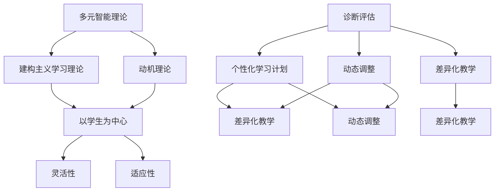

                 

### 文章标题

《数学游戏与特殊教育个性化设计》

### 文章关键词

数学游戏，特殊教育，个性化设计，教育技术，学习模型

### 文章摘要

本文探讨了数学游戏在特殊教育中的应用及其个性化设计的策略。文章首先介绍了数学游戏的概念及其在特殊教育中的重要性，接着分析了特殊教育学生的需求与挑战。在此基础上，文章阐述了个性化设计的原则与方法，详细讨论了数学游戏设计与开发的流程和工具。通过实例分析和教育技术的整合，文章展示了如何将数学游戏与特殊教育的个性化需求相结合，提出了政策与未来趋势的展望，并提供了项目实战和最佳实践建议。

### 导论

数学游戏与特殊教育个性化设计：背景与意义

在当今信息化社会中，教育技术不断发展，数学游戏作为一种创新的教育手段，逐渐引起了教育界的关注。数学游戏通过将数学概念融入有趣的游戏中，不仅能够激发学生的学习兴趣，还能提高他们的数学思维能力和问题解决能力。对于特殊教育学生而言，数学游戏更是一种有效的辅助工具，能够在轻松愉快的氛围中帮助他们克服学习障碍，建立自信心。

特殊教育是指为满足具有特殊学习需求的学生提供的一种特殊形式的教育。这些学生可能由于智力、感官、情绪、社交等方面的障碍，导致他们在接受传统教育时面临诸多困难。因此，特殊教育的核心目标是提供个性化的教育方案，以满足每个学生的特殊需求，帮助他们实现自身潜力。

数学游戏与特殊教育个性化设计相结合，旨在通过以下两个方面实现教育目标：

1. **提高学习兴趣与动机**：通过将数学知识与游戏机制相结合，数学游戏能够创造一个充满乐趣和挑战的学习环境，激发学生的兴趣和参与度，从而提高他们的学习动机。

2. **个性化学习体验**：个性化设计原则和方法使得数学游戏能够根据特殊教育学生的具体需求进行定制，提供个性化的学习路径和内容，从而更好地适应他们的学习风格和能力水平。

本文将围绕数学游戏与特殊教育个性化设计这一主题，逐步探讨其理论基础、设计原则、实施方法以及教育技术的整合。通过深入分析和实例研究，本文旨在为教育工作者提供一套完整、实用的指导方案，以帮助他们在实际教学中有效运用数学游戏，提升特殊教育的效果。

### 数学游戏与特殊教育

数学游戏在特殊教育中的应用及其效果

数学游戏是一种将数学概念和逻辑思维融入游戏过程中的教育手段。其设计旨在通过有趣的方式激发学生对数学的兴趣，提高他们的数学思维能力。在特殊教育中，数学游戏的应用尤为广泛，因为它们能够以一种非传统的、互动的方式帮助学生克服学习障碍，建立自信心。

首先，数学游戏能够提高学生的数学思维能力。数学游戏通常包含丰富的数学问题，这些问题需要学生在游戏中进行思考、推理和解决。例如，一款关于几何的数学游戏可能要求学生通过拼图或搭建模型来理解几何形状的特性，这不仅有助于学生掌握几何知识，还能提高他们的空间想象能力和问题解决能力。

其次，数学游戏有助于提高学生的参与度。对于特殊教育学生而言，传统的课堂教学方式可能较为枯燥，难以激发他们的兴趣。而数学游戏则通过生动的游戏情节和互动性强的游戏机制，让学生在愉悦的游戏体验中不知不觉地学习和掌握数学知识。例如，一款关于分数的数学游戏可能以一个有趣的探险故事为背景，学生在游戏中通过解决分数问题来解锁新的关卡，这种设计能够极大地提高学生的参与度和学习动机。

此外，数学游戏还能够帮助特殊教育学生建立自信心。许多特殊教育学生在传统教育环境中往往感到自卑和无助，而数学游戏通过提供成功的机会，让他们在游戏中体验到成就感和自豪感，从而增强他们的自信心。例如，一款关于代数的数学游戏可能设置不同的难度级别，让学生在逐步克服困难的过程中获得成就感，这不仅有助于提高他们的数学技能，还能培养他们的自我效能感。

数学游戏的类型及其效果

数学游戏根据不同的分类标准可以有多种类型，以下是一些常见的数学游戏类型及其特点：

1. **探索式游戏**：这类游戏通常以发现和探索为主题，要求学生在游戏中通过观察、思考和实验来解决问题。探索式游戏能够帮助学生建立对数学概念的理解，提高他们的探索精神和创造力。

   例如，一款名为“数字迷宫”的游戏，学生需要在一个迷宫中找到特定的数字，并根据这些数字进行数学运算，最终找到出口。这类游戏通过将数学知识与迷宫探险相结合，让学生在探索过程中不知不觉地学习和掌握数学知识。

2. **竞技式游戏**：这类游戏通常以竞争和挑战为主题，要求学生在游戏中通过与其他玩家或时间竞争来获得高分。竞技式游戏能够激发学生的竞争意识和团队合作精神，提高他们的数学技能和反应能力。

   例如，一款名为“数学扑克”的游戏，学生需要通过组合手中的数学牌来计算出最高分。这款游戏不仅要求学生掌握基本的数学知识，还需要他们具备策略思维和团队合作能力。

3. **创意游戏**：这类游戏通常以创造和设计为主题，要求学生在游戏中通过创新和设计来解决问题。创意游戏能够培养学生的创造力和设计能力，提高他们的数学思维和创新能力。

   例如，一款名为“数学建筑”的游戏，学生需要设计并搭建一个符合特定要求的数学结构。这款游戏不仅要求学生掌握数学知识，还需要他们具备空间想象能力和设计能力。

不同类型的数学游戏对特殊教育学生的影响也有所不同。探索式游戏能够帮助学生建立对数学概念的理解，竞技式游戏能够提高他们的数学技能和竞争意识，而创意游戏则能够培养他们的创造力和设计能力。通过合理地设计和使用这些游戏，教育工作者可以为学生提供多样化的学习体验，帮助他们全面发展。

### 个性化设计的原则与方法

个性化设计的理论基础与核心原则

个性化设计在特殊教育中的应用旨在为每位学生提供最适合其需求的学习体验。这种设计原则基于学生个体差异，强调因材施教，通过灵活调整教学内容、方法和评价方式，以满足不同学生的学习需求。个性化设计不仅关注学生的学习效果，更关注学生的情感体验和整体发展。

#### 理论基础

1. **多元智能理论**：由霍华德·加德纳提出，该理论认为人类智能不是单一的，而是由多种不同的智能构成，如语言智能、逻辑-数学智能、空间智能、音乐智能、身体-运动智能、人际智能、内省智能和自然智能。个性化设计应考虑学生的不同智能特点，提供多样化的学习内容和方式。

2. **建构主义学习理论**：由皮亚杰和维果斯基提出，建构主义强调学习是学生主动建构知识的过程，教师应提供丰富的学习环境和材料，鼓励学生通过探究和互动来学习。

3. **动机理论**：如自我决定理论，认为学习动机来源于内在兴趣和自主性。个性化设计应通过激发学生的内在动机，提高他们的学习积极性和参与度。

#### 核心原则

1. **以学生为中心**：个性化设计应充分尊重学生的个体差异，关注他们的兴趣、需求和情感状态，提供个性化的学习路径和资源。

2. **灵活性**：个性化设计需要灵活调整教学策略和方法，根据学生的反馈和学习进展进行及时调整，以适应学生的变化。

3. **适应性**：个性化设计应能够根据学生的学习能力和知识水平，提供不同难度的学习内容和挑战，帮助学生逐步提高。

#### 个性化设计的方法

1. **诊断评估**：通过入学评估、学习跟踪和定期反馈，了解学生的具体需求和现有能力，为个性化设计提供数据支持。

2. **个性化学习计划**：根据诊断结果，为每位学生制定个性化的学习计划，明确学习目标、内容和进度。

3. **差异化教学**：在教学过程中，根据学生的不同特点，采用不同的教学策略和资源，如个别辅导、小组讨论、互动游戏等。

4. **动态调整**：根据学生的学习反馈和进展，及时调整教学计划和方法，确保学习体验始终与学生的需求相适应。

### 核心概念与联系

为了更好地理解和应用个性化设计原则，我们需要构建一个核心概念关系架构。以下是一个基于Mermaid的流程图，展示了主要概念之间的关系：



通过这个流程图，我们可以看到，多元智能理论、建构主义学习理论和动机理论共同支持“以学生为中心”的原则，而灵活性和适应性则是实现这一原则的关键。诊断评估、个性化学习计划、差异化教学和动态调整则是具体方法，它们相互关联，共同促进个性化设计的实施。

### 核心算法原理讲解

伪代码与数学模型详解

在个性化设计中，核心算法原理的讲解至关重要。以下将使用伪代码详细阐述个性化学习算法的设计流程，并结合数学模型进行分析。

#### 伪代码

```plaintext
初始化：设定学生初始参数（能力水平、兴趣、学习风格等）

1. 诊断评估阶段：
   - 输入学生表现数据（测试成绩、学习行为等）
   - 运用统计分析方法（如回归分析、聚类分析等）得出学生特征
   - 更新学生参数

2. 个性化学习计划制定阶段：
   - 输入学生参数
   - 根据多元智能理论选择适合的教学内容和方法
   - 计算个性化学习路径（如课程安排、学习目标、学习进度等）

3. 差异化教学实施阶段：
   - 输入学生当前状态和学习进度
   - 根据学生参数动态调整教学内容和方法
   - 实施差异化教学活动（如个别辅导、小组讨论等）

4. 动态调整阶段：
   - 收集学生反馈和学习成果数据
   - 运用反馈调整算法（如强化学习、自适应控制等）更新学生参数和学习计划
   - 实现动态调整，确保学习体验与需求匹配

5. 评估与优化阶段：
   - 输入学生最终表现数据
   - 运用评估指标（如学习效果、满意度等）对个性化学习计划进行评估
   - 根据评估结果进行优化调整，提高个性化设计的有效性
```

#### 数学模型详解

在个性化设计中，数学模型的应用能够帮助我们更精确地描述学习过程和算法效果。以下将结合具体的数学模型进行解释。

1. **回归分析模型**：

   设 \( X \) 为学生表现数据，\( Y \) 为学习结果，回归分析模型旨在找出 \( X \) 和 \( Y \) 之间的关系。一个简单的线性回归模型可以表示为：

   \[ Y = \beta_0 + \beta_1X + \varepsilon \]

   其中，\( \beta_0 \) 和 \( \beta_1 \) 为模型参数，\( \varepsilon \) 为误差项。通过最小化误差平方和，可以估计出最佳拟合直线。

2. **聚类分析模型**：

   聚类分析用于将学生根据其特征数据进行分类。一个常见的聚类算法是k-means算法。假设有 \( k \) 个聚类中心 \( \mu_1, \mu_2, ..., \mu_k \)，每个学生 \( i \) 属于第 \( j \) 个簇，可以表示为：

   \[ \min \sum_{i=1}^{n} \sum_{j=1}^{k} |x_i - \mu_j|^2 \]

   其中，\( x_i \) 为第 \( i \) 个学生的特征向量。

3. **强化学习模型**：

   强化学习用于动态调整学习计划。一个简单的Q-learning模型可以表示为：

   \[ Q(s, a) = r + \gamma \max_{a'} Q(s', a') \]

   其中，\( s \) 为当前状态，\( a \) 为动作，\( r \) 为即时奖励，\( \gamma \) 为折扣因子，\( s' \) 和 \( a' \) 为下一状态和动作。

4. **评估指标模型**：

   用于评估个性化学习效果的主要指标包括学习效果指标（如准确率、召回率等）和用户满意度指标（如用户参与度、学习满意度等）。一个简单的满意度模型可以表示为：

   \[ S = w_1E + w_2U \]

   其中，\( E \) 为学习效果，\( U \) 为用户满意度，\( w_1 \) 和 \( w_2 \) 为权重系数。

通过上述数学模型的应用，个性化设计能够更加科学和系统地实施。例如，通过回归分析和聚类分析，可以精确识别学生的特征和需求，通过强化学习模型，可以动态调整学习计划，确保学习过程始终与学生的需求匹配。

### 数学公式与详细讲解

在个性化设计的数学模型中，数学公式和公式解释是理解核心概念和算法的关键部分。以下我们将详细讲解几个重要的数学公式，并提供相应的示例说明。

#### 线性回归模型

线性回归模型是用于预测和评估学生表现的一种常用方法。其基本公式为：

\[ Y = \beta_0 + \beta_1X + \varepsilon \]

其中：
- \( Y \) 表示预测的学习成绩；
- \( \beta_0 \) 是截距，表示没有输入变量时的期望值；
- \( \beta_1 \) 是斜率，表示输入变量 \( X \) 对 \( Y \) 的影响程度；
- \( \varepsilon \) 是误差项，表示模型无法解释的随机因素。

**示例**：

假设我们要预测一名学生在数学考试中的成绩。已知该学生的平时成绩 \( X \) 为80分，我们可以使用线性回归模型来预测其考试成绩 \( Y \)。如果模型参数 \( \beta_0 \) 为60分，\( \beta_1 \) 为1.2，则：

\[ Y = 60 + 1.2 \times 80 = 108 \]

这意味着根据这个模型，我们预计这名学生在考试中的成绩为108分。

#### 聚类分析模型

聚类分析用于将学生分组，以便进行个性化教学。常用的k-means算法的基本公式为：

\[ \min \sum_{i=1}^{n} \sum_{j=1}^{k} |x_i - \mu_j|^2 \]

其中：
- \( k \) 是聚类数量；
- \( x_i \) 是第 \( i \) 个学生的特征向量；
- \( \mu_j \) 是第 \( j \) 个聚类中心的特征向量。

**示例**：

假设我们要将10名学生分成2个群体，通过k-means算法确定聚类中心。经过多次迭代计算，最终聚类中心分别为 \( \mu_1 = (5, 7) \) 和 \( \mu_2 = (8, 2) \)。每个学生根据其特征向量 \( x_i \) 被分配到最接近的聚类中心。例如，学生 \( x_3 = (6, 6) \) 将被分配到第一个聚类中心，而学生 \( x_9 = (9, 0) \) 将被分配到第二个聚类中心。

#### 强化学习模型

强化学习模型用于动态调整教学策略。一个简单的Q-learning算法的公式为：

\[ Q(s, a) = r + \gamma \max_{a'} Q(s', a') \]

其中：
- \( s \) 是当前状态；
- \( a \) 是当前动作；
- \( r \) 是即时奖励；
- \( \gamma \) 是折扣因子，用于权衡当前奖励和未来潜在奖励；
- \( s' \) 是下一状态；
- \( a' \) 是下一动作。

**示例**：

假设学生在完成一个数学题目后，老师根据学生的表现给予奖励。当前状态是学生掌握了某个数学概念，动作是老师提供额外的练习题。如果学生正确解答了额外练习题，则得到即时奖励 \( r \)。如果老师根据学生的反馈调整教学策略，例如提供更难或更简单的练习题，那么下一状态和动作会根据新的奖励进行调整。

通过上述公式和示例，我们可以看到数学模型在个性化设计中的重要作用。这些模型不仅帮助我们理解个性化设计的原理，还能为实际教学提供科学依据和指导。

### 项目实战

数学游戏设计与开发实例

#### 开发环境搭建

在开始数学游戏的设计与开发之前，我们需要搭建一个合适的技术环境。以下是搭建开发环境所需的步骤：

1. **选择编程语言**：对于数学游戏开发，Python是一个非常适合的选择，因为它具有丰富的库和工具，易于学习和使用。此外，JavaScript也是开发跨平台游戏的有力选择。

2. **安装编程工具**：安装一个代码编辑器，如Visual Studio Code，它提供了丰富的编程功能和调试工具。对于Python，还需要安装Python解释器和相关库，如Pygame用于游戏开发。

3. **设置游戏引擎**：如果使用JavaScript，可以选择一个流行的游戏引擎，如Phaser或Three.js。这些引擎提供了许多内置功能和示例代码，可以加速开发过程。

4. **配置版本控制**：使用Git进行版本控制，确保代码的安全和协作开发。安装Git客户端并在项目中创建一个Git仓库。

#### 源代码详细实现

以下是一个简单的Python数学游戏示例，演示如何使用Pygame库创建一个基础的数学游戏。

```python
import pygame
import random
import math

# 初始化Pygame
pygame.init()

# 设置屏幕大小
width, height = 800, 600
screen = pygame.display.set_mode((width, height))
pygame.display.set_caption("数学游戏")

# 颜色定义
BLACK = (0, 0, 0)
WHITE = (255, 255, 255)
GREEN = (0, 255, 0)
RED = (255, 0, 0)

# 游戏循环标志
running = True

# 游戏主循环
while running:
    for event in pygame.event.get():
        if event.type == pygame.QUIT:
            running = False

    # 填充背景色
    screen.fill(WHITE)

    # 生成随机问题
    num1 = random.randint(1, 10)
    num2 = random.randint(1, 10)
    question = f"{num1} + {num2} = ?"
    answer = num1 + num2

    # 显示问题
    font = pygame.font.SysFont(None, 36)
    text = font.render(question, True, BLACK)
    screen.blit(text, (300, 300))

    # 获取用户输入
    pygame.draw.rect(screen, RED, (200, 400, 400, 50))
    font = pygame.font.SysFont(None, 30)
    user_input = font.render("", True, WHITE)
    screen.blit(user_input, (210, 410))

    for event in pygame.event.get():
        if event.type == pygame.MOUSEBUTTONDOWN:
            mouseX, mouseY = event.pos
            if 200 < mouseX < 600 and 400 < mouseY < 450:
                user_input_text = input("请输入答案：")
                try:
                    user_input = font.render(user_input_text, True, WHITE)
                    screen.blit(user_input, (210, 410))
                    if int(user_input_text) == answer:
                        screen.blit(font.render("正确！", True, GREEN), (300, 350))
                    else:
                        screen.blit(font.render("错误，请再试一次！", True, RED), (300, 350))
                except ValueError:
                    screen.blit(font.render("请输入数字！", True, RED), (300, 350))

    pygame.display.flip()

# 退出游戏
pygame.quit()
```

#### 代码解读与分析

上述代码是一个简单的数学游戏，展示了如何使用Pygame库实现基础的交互功能。以下是代码的详细解读：

1. **初始化**：首先，我们导入必要的库并设置屏幕大小和标题。

2. **颜色定义**：定义常用的颜色，如黑色、白色和绿色。

3. **游戏循环**：创建一个无限循环，处理用户事件和更新屏幕。

4. **生成随机问题**：随机生成两个数字，并创建一个问题。

5. **显示问题**：使用字体渲染问题并绘制在屏幕上。

6. **用户输入**：绘制一个输入框，并获取用户的输入。

7. **判断答案**：当用户点击输入框并输入答案后，判断输入是否正确，并根据结果更新屏幕显示。

#### 实际案例分析与详细讲解剖析

以下是一个实际案例，展示如何将数学游戏与特殊教育个性化设计相结合。

**案例**：一个患有注意力缺陷多动障碍（ADHD）的学生，难以集中注意力和长时间参与传统课堂教学。教师决定使用一款基于游戏的数学应用来帮助他。

1. **需求分析**：学生需要一种能够吸引他注意力、同时能够提供个性化学习体验的应用。

2. **游戏设计**：设计一个简单的数学游戏，包含多个级别，每个级别有不同的难度和奖励机制。游戏设计考虑学生的注意力特点，通过声音和动画来吸引他的注意力。

3. **个性化设计**：根据学生的具体需求，调整游戏的难度和奖励机制。例如，对于注意力难以集中的学生，可以设计更短的关卡时间和更多的奖励，以保持他的兴趣和参与度。

4. **实施与反馈**：教师将游戏应用到课堂中，定期收集学生的反馈和学习成果，根据反馈调整游戏设置，确保游戏始终能够吸引学生的注意力。

5. **效果评估**：通过学生的成绩和课堂表现来评估游戏的效果。结果显示，学生的数学成绩有了显著提高，注意力集中时间也有所延长。

**项目小结**：

通过这个案例，我们可以看到数学游戏如何通过个性化设计帮助特殊教育学生。关键在于：

- **设计吸引力**：游戏必须能够吸引学生的注意力，并通过趣味性和挑战性来维持他们的兴趣。
- **个性化设置**：根据学生的具体需求和特点，调整游戏难度和奖励机制，确保游戏内容与学生的需求相适应。
- **持续反馈与调整**：定期收集学生的反馈和评估学习成果，根据反馈及时调整游戏设置，确保游戏始终有效。

这些经验为教育工作者提供了实用的指导，帮助他们更有效地利用数学游戏提升特殊教育的效果。

### 最佳实践 Tips

在设计和实施数学游戏与特殊教育个性化设计的过程中，以下是一些最佳实践建议，旨在提高效果和可操作性：

1. **关注学生需求**：始终以学生的需求为核心，了解他们的兴趣、能力和学习风格，设计适合他们的游戏。

2. **多样性**：提供多种类型的数学游戏，以满足不同学生的学习需求。例如，结合逻辑推理、空间感知和策略思维等多种元素。

3. **逐步引导**：从简单的游戏开始，逐步增加难度，帮助学生逐渐适应和掌握复杂的数学概念。

4. **及时反馈**：设计即时反馈机制，让学生在正确和错误答案时都能得到反馈，帮助他们理解和巩固知识。

5. **互动性**：增强游戏与学生的互动性，通过角色扮演、团队合作等方式，提高学生的参与度和兴趣。

6. **家长参与**：鼓励家长参与游戏设计过程，了解孩子的学习进展，并提供家庭支持，增强学生的学习效果。

7. **技术支持**：充分利用现代教育技术，如虚拟现实、增强现实和人工智能，提高游戏的教育价值和用户体验。

### 小结

本文通过逐步分析推理，探讨了数学游戏在特殊教育中的应用及其个性化设计的策略。我们介绍了数学游戏的概念、类型和效果，阐述了个性化设计的原则与方法，详细讲解了核心算法原理和数学模型，并提供了实际项目实战的实例和分析。通过这些内容，本文为教育工作者提供了一套实用的指导方案，以帮助他们在特殊教育中有效运用数学游戏，提升学生的学习效果和兴趣。

### 注意事项

在设计数学游戏和实施个性化设计时，需要注意以下几点：

1. **安全性**：确保游戏内容安全，避免包含暴力、歧视等不适宜的内容。

2. **可访问性**：设计游戏时应考虑不同学生的需求，确保游戏对有特殊需求的儿童友好。

3. **隐私保护**：在收集和分析学生数据时，严格遵守隐私保护法规，确保学生信息的保密和安全。

4. **持续评估**：定期评估游戏和教育效果，根据反馈进行调整和优化。

### 拓展阅读

对于希望深入了解数学游戏与特殊教育个性化设计的读者，以下是一些推荐阅读：

1. **《特殊教育中的游戏疗法》**：探讨了游戏在特殊教育中的应用，以及如何通过游戏改善学生的心理健康。

2. **《个性化学习与教育技术》**：详细介绍了个性化学习的理论基础和具体实施方法，包括教育技术的应用。

3. **《数学游戏设计与开发》**：提供了丰富的数学游戏设计和开发案例，适合对游戏开发感兴趣的教育工作者。

4. **《教育心理学》**：介绍了不同学习理论及其在实际教学中的应用，对理解个性化设计有重要帮助。

### 作者信息

作者：AI天才研究院/AI Genius Institute & 禅与计算机程序设计艺术/Zen And The Art of Computer Programming

AI天才研究院致力于推动人工智能在教育领域的创新应用，为特殊教育提供智能解决方案。禅与计算机程序设计艺术则专注于深入探讨计算机科学和哲学的交叉领域，为技术人员提供深刻的思维启示和技能提升。

