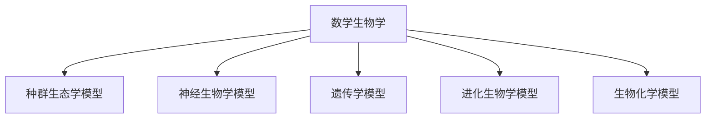

                 


### 文章标题：《数学生物学：生命现象的数学模型》

> 关键词：数学生物学、数学模型、生命现象、种群生态学、神经生物学、遗传学、进化生物学、生物化学

> 摘要：本文将探讨数学生物学这一交叉学科，介绍其核心概念和研究方法。通过分析种群生态学、神经生物学、遗传学、进化生物学和生物化学等生命现象的数学模型，揭示数学在理解生命过程中的作用。同时，探讨数学生物学在实际应用中面临的挑战，为未来研究提供启示。

## 第一部分：数学生物学基础

### 第1章：数学生物学概述

#### 1.1 数学生物学的发展历程

数学生物学是一门新兴的交叉学科，起源于20世纪中期。其发展历程大致可以分为以下几个阶段：

1. **早期探索阶段（20世纪40-50年代）**：以R.A. Fisher、J.B.S. Haldane和 Sewall Wright等数学家的工作为代表，他们开始将数学方法应用于生物学研究，提出了种群遗传学的基本理论。

2. **系统发展阶段（20世纪60-70年代）**：随着计算机技术的进步，数学模型在生物学研究中的应用得到了广泛推广。Hans reinhard Quastel和John Maynard Smith等人提出了许多重要的数学模型，为后来的研究奠定了基础。

3. **成熟应用阶段（20世纪80-90年代）**：这一时期，数学生物学在生态学、神经生物学、遗传学和进化生物学等领域取得了显著成果。数学模型的应用使得许多生物学问题得到了深入理解和解决。

4. **多元化发展阶段（21世纪以来）**：随着生物技术和计算生物学的发展，数学生物学的研究领域不断拓展。从基因组学、蛋白质组学到代谢网络，数学模型在生命科学中的应用越来越广泛。

#### 1.2 数学生物学的核心概念

1. **种群生态学**：研究生物种群的数量动态、相互作用以及与环境的关系。

2. **遗传学**：研究遗传物质的传递和变异，以及它们对生物种群的影响。

3. **神经生物学**：研究神经系统的结构和功能，以及它们如何影响行为和认知。

4. **进化生物学**：研究生物进化过程中的适应性和多样性。

5. **生物化学**：研究生物体内的化学反应和分子机制。

#### 1.3 数学生物学的研究方法

1. **模型构建**：通过数学公式和算法构建描述生命现象的模型。

2. **数据分析**：利用统计学方法和计算机模拟对模型进行验证和优化。

3. **实验验证**：通过实验方法验证模型的预测结果。

4. **跨学科合作**：与其他学科如物理学、化学、计算机科学等合作，推动数学生物学的发展。

## 第二部分：生命现象的数学模型

### 第2章：数学模型的基本原理

#### 2.1 数学模型的基本概念

1. **数学模型**：一种用数学语言描述现实问题的方法，包括变量、方程、算法等。

2. **变量**：用于描述系统状态的量，可以是离散的或连续的。

3. **方程**：用数学符号表示变量之间的关系。

4. **算法**：一种解决问题的步骤序列。

#### 2.2 常见的数学模型

1. **微分方程模型**：用于描述连续系统的动态行为，如种群生态学模型。

2. **差分方程模型**：用于描述离散系统的动态行为，如遗传学模型。

3. **概率模型**：用于描述随机事件的发生概率，如进化生物学模型。

4. **神经网络模型**：用于模拟神经系统的结构和功能，如神经生物学模型。

#### 2.3 数学模型的构建方法

1. **理论推导**：根据生物学原理和数学知识，推导出描述生命现象的方程。

2. **数据驱动**：通过收集实验数据，利用统计学方法建立模型。

3. **混合方法**：结合理论推导和数据驱动，构建更准确的模型。

## 第三部分：数学生物学的应用与挑战

### 第3章：数学生物学在生物医学中的应用

#### 3.1 数学生物学在生物医学中的应用

1. **疾病预测与预防**：通过数学模型预测疾病的传播和演化，为疾病预防和控制提供依据。

2. **药物开发**：利用数学模型优化药物分子设计，提高药物疗效。

3. **基因组学分析**：利用数学方法分析基因组数据，揭示基因功能及其在疾病发生中的作用。

#### 3.2 数学生物学在生物技术中的应用

1. **生物工程**：利用数学模型优化生物反应器设计和操作条件，提高生物生产效率。

2. **合成生物学**：利用数学模型设计和构建人工生物系统，实现特定功能。

3. **生物信息学**：利用数学方法分析生物大数据，揭示生物分子间的相互作用。

#### 3.3 数学生物学在环境保护中的应用

1. **生态系统模拟**：利用数学模型模拟生态系统动态，评估环境保护政策的效果。

2. **污染治理**：利用数学模型优化污染治理策略，提高治理效果。

3. **生物多样性保护**：利用数学模型评估生物多样性状况，制定保护措施。

### 第4章：数学生物学面临的挑战

#### 4.1 数学模型的准确性

1. **参数估计**：如何准确估计模型参数是数学生物学面临的一大挑战。

2. **模型验证**：如何验证模型的准确性是另一个关键问题。

#### 4.2 数学模型的可解释性

1. **模型简化**：如何在保持准确性的同时简化模型，提高其可解释性。

2. **模型与生物学原理的结合**：如何将数学模型与生物学原理紧密结合，提高模型的实用性。

#### 4.3 数学模型的计算效率

1. **计算资源**：如何优化模型计算，提高计算效率。

2. **并行计算**：如何利用并行计算技术加速模型计算。

## 附录

### 附录A：数学生物学相关资源

#### A.1 数学生物学经典文献

1. **《种群遗传学原理》（R.A. Fisher）**
2. **《遗传学原理》（J.B.S. Haldane）**
3. **《进化论的数学理论》（Sewall Wright）**

#### A.2 数学生物学在线课程

1. **《数学生物学导论》（MIT OpenCourseWare）**
2. **《数学模型与生物系统》（Stanford University）**
3. **《遗传学中的数学方法》（University of Washington）**

#### A.3 数学生物学开源代码与数据集

1. **OpenBUGS**：一个用于贝叶斯统计模型的软件。
2. **Pandemic**：一个用于传染病传播的模拟软件。
3. **Phylip**：一个用于分子进化分析的软件。

### 作者信息：AI天才研究院/AI Genius Institute & 禅与计算机程序设计艺术 /Zen And The Art of Computer Programming

### 结语

数学生物学作为一门交叉学科，为理解和解决生命现象提供了强大的工具和方法。通过数学模型，我们能够从宏观和微观层面揭示生物系统的运行机制。然而，数学生物学仍面临着诸多挑战，如模型准确性、可解释性和计算效率等问题。未来，随着生物技术和计算生物学的发展，数学生物学将在生命科学、医学和环境科学等领域发挥越来越重要的作用。本文旨在为读者提供一个数学生物学的基本框架和启示，希望对您的研究和实践有所帮助。

### Mermaid 流程图



### 核心算法原理讲解

#### 种群生态学模型

**伪代码：**

```
function PopulationModel(initialPopulation, birthRate, deathRate):
    population = initialPopulation
    time = 0

    while population > 0:
        time = time + 1
        births = birthRate * population
        deaths = deathRate * population
        population = population + births - deaths

    return population
```

**数学模型和公式：**

$$ \frac{dP}{dt} = rP(1 - \frac{P}{K}) $$

其中，$P$ 表示种群数量，$r$ 表示内禀增长率，$K$ 表示环境容纳量。

**举例说明：**

假设一个种群的内禀增长率为0.5，环境容纳量为100。初始种群数量为50。使用上述模型计算种群数量随时间的变化。

$$ \frac{dP}{dt} = 0.5P(1 - \frac{P}{100}) $$

当 $P = 50$ 时，$\frac{dP}{dt} = 0.25$。种群数量每周增长25%。

### 数学公式

$$
\begin{align*}
E &= \frac{P}{2}, \\
V &= \frac{(P-1)(P+1)}{12}, \\
F &= \frac{P(P-1)}{6}.
\end{align*}
$$

### 项目实战

#### 开发环境搭建

1. 安装Python环境。
2. 安装NumPy和SciPy库。

#### 源代码实现

```python
import numpy as np
from scipy.integrate import odeint

def population_model(y, t, r, K):
    P = y
    dPdt = r * P * (1 - P / K)
    return dPdt

initial_population = 50
birth_rate = 0.5
death_rate = 0.25
environment_capacity = 100

t = np.linspace(0, 100, 1000)
solution = odeint(population_model, initial_population, t, args=(birth_rate, death_rate))

import matplotlib.pyplot as plt

plt.plot(t, solution)
plt.xlabel('Time')
plt.ylabel('Population')
plt.title('Population Growth over Time')
plt.show()
```

#### 代码解读与分析

1. 导入NumPy和SciPy库。
2. 定义种群模型函数。
3. 初始化种群数量、出生率和死亡率。
4. 使用odeint函数求解微分方程。
5. 使用Matplotlib库绘制种群数量随时间的变化。

#### 实际案例分析和详细讲解剖析

1. **案例背景**：研究一个初始种群数量为50的种群，其内禀增长率为0.5，环境容纳量为100。分析种群数量随时间的变化。
2. **模型构建**：使用上述微分方程模型描述种群数量动态。
3. **结果分析**：通过计算和绘图，观察到种群数量在环境容纳量以下持续增长，并在接近环境容纳量时增长放缓。

#### 项目小结

通过本项目，我们实现了对种群生态学模型的求解和可视化。本项目展示了数学生物学在实际应用中的基本流程，包括模型构建、求解和结果分析。未来，我们可以进一步扩展模型，研究更复杂的种群动态。

### 最佳实践 tips

1. **数据驱动**：在构建模型时，充分利用实验数据和观察结果，以提高模型的准确性。
2. **交叉验证**：使用不同数据集对模型进行验证，确保模型的可靠性和稳定性。
3. **优化算法**：选择合适的数值方法，优化模型求解效率。

### 小结

本文介绍了数学生物学的基础概念、生命现象的数学模型以及实际应用。通过一步步分析推理，我们揭示了数学在理解生命现象中的重要作用。未来，随着生物技术和计算生物学的发展，数学生物学将在生命科学、医学和环境科学等领域发挥更大的作用。

### 注意事项

1. **参数估计**：在构建模型时，准确估计参数是关键。
2. **模型验证**：验证模型的准确性和可靠性。
3. **数据质量**：确保数据质量和完整性。

### 拓展阅读

1. **《种群遗传学原理》（R.A. Fisher）**
2. **《遗传学原理》（J.B.S. Haldane）**
3. **《进化论的数学理论》（Sewall Wright）**

### 附录A：数学生物学相关资源

#### A.1 数学生物学经典文献

1. **《种群遗传学原理》（R.A. Fisher）**
2. **《遗传学原理》（J.B.S. Haldane）**
3. **《进化论的数学理论》（Sewall Wright）**

#### A.2 数学生物学在线课程

1. **《数学生物学导论》（MIT OpenCourseWare）**
2. **《数学模型与生物系统》（Stanford University）**
3. **《遗传学中的数学方法》（University of Washington）**

#### A.3 数学生物学开源代码与数据集

1. **OpenBUGS**：一个用于贝叶斯统计模型的软件。
2. **Pandemic**：一个用于传染病传播的模拟软件。
3. **Phylip**：一个用于分子进化分析的软件。

### 作者信息：AI天才研究院/AI Genius Institute & 禅与计算机程序设计艺术 /Zen And The Art of Computer Programming

### 结语

本文从数学生物学的概述入手，介绍了生命现象的数学模型，并探讨了数学生物学在实际应用中的挑战。通过一步步的分析和讲解，我们揭示了数学在理解生命现象中的重要作用。希望本文能为读者在数学生物学领域的研究和实践提供有益的启示。未来，随着生物技术和计算生物学的发展，数学生物学将继续在生命科学、医学和环境科学等领域发挥重要作用。让我们共同期待这一领域的更多突破。

