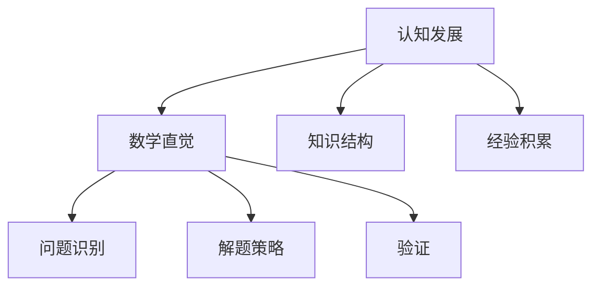

                 

---

# 《数学直觉与数学创造力的培养策略》

> 关键词：数学直觉，数学创造力，培养策略，教育心理学，教学实践

> 摘要：
本文旨在探讨数学直觉与数学创造力的概念、培养策略及其在数学教育中的应用。通过分析心理学基础、教育环境的影响、不同阶段的培养方法以及实际案例，本文为提高学生的数学直觉与创造力提供了一系列策略和启示。

---

## 第1章 引言：数学直觉与数学创造力的重要性

数学直觉是指人们在数学思考过程中所具备的直观洞察力和判断能力，而数学创造力则是指个体在数学领域中进行创新思维和发明创造的能力。这两者在数学学习和创新中扮演着至关重要的角色。

### 1.1 数学直觉的概念

数学直觉是数学思维的重要组成部分，它体现在以下几个方面：

1. **问题识别**：快速识别数学问题的类型和解决方向。
2. **解题策略**：在没有现成解决方案的情况下，能够迅速提出有效的解题策略。
3. **验证**：对解题结果进行快速验证，确保其正确性。

### 1.2 数学创造力的定义

数学创造力体现在以下几个方面：

1. **问题提出**：能够提出新颖的数学问题。
2. **方法创新**：发明新的数学方法和解题技巧。
3. **理论构建**：构建新的数学理论体系。

### 1.3 本书的目的与结构

本书的目的是探讨数学直觉与数学创造力的培养策略，具体结构如下：

1. **数学直觉的发展与培养**：分析数学直觉的心理学基础，探讨教育环境的影响和培养策略。
2. **数学创造力的培养方法**：介绍数学思维方式的培养、创新意识的激发和实践活动的组织。
3. **不同教育阶段的数学直觉与创造力培养策略**：针对不同年龄段的学生，提出具体的培养策略。
4. **数学直觉与数学创造力培养策略的实际应用**：通过教学案例展示培养策略在实际教学中的应用。
5. **教学案例分析**：深入分析成功的教学案例，探讨其中的经验和启示。
6. **结论**：总结本书的主要观点，展望未来数学直觉与创造力培养的发展趋势。

---

## 第2章 数学直觉的发展与培养

### 2.1 数学直觉的心理学基础

数学直觉的发展受到多种心理学因素的影响，包括：

1. **认知发展**：个体的认知能力对其数学直觉的发展有重要影响。
2. **知识结构**：个体的数学知识和数学知识结构对其直觉判断有直接影响。
3. **经验积累**：长期的数学学习和实践能够增强个体的数学直觉。

**Mermaid流程图：**
```


---

### 2.2 教育环境对数学直觉的影响

教育环境对数学直觉的培养有着重要影响，包括以下几个方面：

1. **教师指导**：教师的指导和示范能够直接影响学生的数学直觉发展。
2. **教学材料**：丰富的教学材料和多样化的教学方法能够激发学生的数学直觉。
3. **课堂氛围**：积极的课堂氛围能够促进学生的思维活跃，提高数学直觉。

**核心算法原理讲解：**
```
算法：培养数学直觉的教育方法
输入：学生、教师、教学材料
输出：增强的数学直觉

步骤：
1. 分析学生的数学认知水平和知识结构
2. 根据学生的认知特点设计教学策略
3. 利用丰富的教学材料和多样化的教学方法进行教学
4. 创设积极的课堂氛围，鼓励学生提问和讨论
5. 定期进行数学直觉训练，如数学游戏、问题解决等
6. 反馈和总结，及时调整教学策略
```
---

### 2.3 培养数学直觉的教学策略

为了有效培养数学直觉，教师可以采取以下教学策略：

1. **启发式教学**：鼓励学生自主探索和发现数学规律，培养其数学直觉。
2. **问题解决教学**：通过解决实际问题，提高学生的数学直觉能力。
3. **思维训练**：进行逻辑思维、分析思维和创造性思维的训练，提高学生的数学直觉。
4. **数学文化熏陶**：通过数学文化的熏陶，增强学生对数学直觉的理解和欣赏。

**数学模型和公式讲解：**
$$
\text{直觉发展速率} = f(\text{认知水平}, \text{知识结构}, \text{教学策略})
$$

**举例说明：**
在启发式教学中，教师可以给出一个开放性问题：“如何用最少的木材制作一个最大的正方体箱子？”学生通过自主探索和讨论，可以培养出对体积和表面积之间的直觉。

---

## 第3章 数学创造力的培养方法

### 3.1 数学思维方式的培养

数学思维方式的培养是提高数学创造力的重要途径，包括以下几个方面：

1. **逻辑思维**：培养学生的逻辑思维能力，使其能够严谨地进行数学推理。
2. **分析思维**：培养学生的分析思维能力，使其能够深入理解数学概念和定理。
3. **创造性思维**：培养学生的创造性思维，使其能够提出新颖的数学问题和解决方案。

**核心算法原理讲解：**
```
算法：培养数学思维方式
输入：学生
输出：增强的数学思维方式

步骤：
1. 引导学生进行逻辑推理，培养逻辑思维能力
2. 设计分析性问题，培养学生分析思维能力
3. 创设创造性环境，鼓励学生进行创造性思维
4. 定期进行思维训练，如数学谜题、数学竞赛等
5. 反馈和总结，及时调整思维训练方法
```
---

### 3.2 创新意识的激发

创新意识是数学创造力的重要基础，教师可以通过以下方法激发学生的创新意识：

1. **问题提出**：鼓励学生提出新的数学问题，培养其问题意识。
2. **方法创新**：鼓励学生尝试新的解题方法，培养其创新思维。
3. **理论构建**：鼓励学生尝试构建新的数学理论体系，培养其创造力。

**数学模型和公式讲解：**
$$
\text{创新意识} = f(\text{问题提出}, \text{方法创新}, \text{理论构建})
$$

**举例说明：**
在问题提出方面，教师可以让学生思考：“如何用最少的纸张折叠出一个最大的立方体？”通过这个问题，学生可以尝试提出不同的解决方案，从而激发其创新意识。

---

### 3.3 实践活动的组织

实践活动是培养数学创造力的重要手段，教师可以通过以下方式组织实践活动：

1. **数学实验**：通过数学实验，让学生亲身体验数学规律和定理。
2. **数学竞赛**：组织数学竞赛，激发学生的竞争意识和创新意识。
3. **数学探究**：鼓励学生进行数学探究，培养其独立思考和解决问题的能力。

**核心算法原理讲解：**
```
算法：组织数学实践活动
输入：学生、教学资源
输出：增强的数学创造力

步骤：
1. 设计数学实验，让学生亲身体验数学规律
2. 组织数学竞赛，激发学生的竞争意识和创新意识
3. 引导学生进行数学探究，培养其独立思考和解决问题的能力
4. 定期进行实践活动总结和反思，及时调整实践活动方案
```
---

## 第4章 不同教育阶段的数学直觉与创造力培养策略

### 4.1 学龄前阶段的数学直觉与创造力培养

在学龄前阶段，数学直觉与创造力的培养主要通过游戏和日常生活中的数学活动进行。教师和家长可以采取以下策略：

1. **数学游戏**：设计有趣的数学游戏，如数数游戏、拼图游戏等，培养孩子的数学直觉。
2. **日常生活中的数学**：通过日常生活中的数学问题，如购物计算、时间计算等，培养孩子的数学创造力。
3. **数学故事**：通过数学故事，激发孩子对数学的兴趣和好奇心。

### 4.2 小学阶段的数学直觉与创造力培养

在小学阶段，数学直觉与创造力的培养可以通过以下策略进行：

1. **启发式教学**：通过启发式教学，鼓励学生自主探索和发现数学规律。
2. **问题解决教学**：通过解决实际问题，提高学生的数学直觉能力。
3. **思维训练**：进行逻辑思维、分析思维和创造性思维的训练。

### 4.3 初中阶段的数学直觉与创造力培养

在初中阶段，数学直觉与创造力的培养可以通过以下策略进行：

1. **数学探究**：鼓励学生进行数学探究，培养其独立思考和解决问题的能力。
2. **数学竞赛**：参加数学竞赛，提高学生的数学直觉和创造力。
3. **数学建模**：通过数学建模，培养学生的创新能力。

### 4.4 高中阶段的数学直觉与创造力培养

在高中阶段，数学直觉与创造力的培养可以通过以下策略进行：

1. **数学研究**：鼓励学生进行数学研究，培养其科研能力和创新能力。
2. **数学竞赛**：参加国内外数学竞赛，提高学生的数学水平和创造力。
3. **数学与文化**：通过数学与文化相结合的方式，提高学生对数学的热爱和欣赏。

---

## 第5章 数学直觉与数学创造力培养策略的实际应用

### 5.1 学校教育的具体案例

在实际教学中，许多学校已经成功实施了数学直觉与创造力的培养策略。例如，某学校通过数学游戏和数学故事激发学生的兴趣，通过数学实验和探究活动培养学生的创造力。

### 5.2 家庭教育的参与

家庭教育在数学直觉与创造力的培养中也发挥着重要作用。家长可以通过日常生活中的数学问题，如购物计算、时间计算等，培养孩子的数学直觉和创造力。

### 5.3 社区教育的补充

社区教育可以为学生的数学直觉与创造力培养提供额外的支持。例如，社区可以组织数学讲座、数学竞赛等活动，为学生提供更广阔的视野和平台。

---

## 第6章 教学案例分析：成功的数学直觉与创造力培养实践

### 6.1 案例一：小学数学教育中的创新实践

某小学通过数学游戏和探究活动，成功激发了学生的数学兴趣和创造力。学生通过参与数学游戏，如数独、24点等，提高了数学直觉能力。通过探究活动，如测量教室的面积、计算家庭开支等，学生学会了将数学应用到实际生活中。

### 6.2 案例二：初中数学竞赛中的创造力培养

某初中通过组织数学竞赛，提高了学生的数学创造力和解题能力。学生在竞赛中提出新颖的解题方法，展示了出色的数学创造力。学校还邀请数学专家进行讲座，为学生提供更多数学思维训练的机会。

### 6.3 案例三：高中数学教育中的教学创新

某高中通过数学研究课程，培养学生的数学研究和创新能力。学生在研究课程中选择了自己感兴趣的数学问题，进行了深入的探究和实验。学校还为优秀学生提供了参加国内外数学竞赛的机会，提升了学生的数学水平和创造力。

---

## 第7章 结论：展望未来的数学直觉与创造力培养

### 7.1 当前数学直觉与创造力培养的挑战

当前数学直觉与创造力培养面临以下挑战：

1. **教育资源不足**：许多学校缺乏足够的数学教育资源，影响数学直觉与创造力的培养。
2. **教育模式单一**：传统教育模式过于注重知识传授，忽视数学直觉与创造力的培养。
3. **评价机制不完善**：现行评价机制往往只注重考试成绩，忽视学生的数学直觉与创造力。

### 7.2 未来数学教育的发展趋势

未来数学教育的发展趋势包括：

1. **个性化教育**：注重学生的个性化发展，培养学生的数学直觉与创造力。
2. **跨学科教育**：将数学与其他学科相结合，提高学生的综合素质。
3. **技术创新**：利用现代信息技术，提高数学教育的质量和效率。

### 7.3 数学直觉与创造力培养策略的展望

未来数学直觉与创造力培养的策略应包括：

1. **丰富教学资源**：提供多样化的教学资源和教学手段，激发学生的数学兴趣。
2. **创新教育模式**：采用多样化的教育模式，培养学生的数学直觉与创造力。
3. **完善评价机制**：建立完善的评价机制，鼓励学生发挥数学直觉与创造力。

---

### 附录

#### 附录 A 数学直觉与数学创造力培养资源推荐

1. **数学教育类书籍**：《数学直觉与数学创造力的培养策略》、《数学思维训练》
2. **数学教育网站**：Khan Academy、Coursera
3. **数学教育软件**：GeoGebra、Mathway

#### 附录 B 数学直觉与数学创造力培养的核心算法原理伪代码

```
// 伪代码：培养数学直觉与创造力的算法

function cultivate_mathematical_intuition_and_creativity() {
    // 初始化教育资源
    resources = initialize_resources()

    // 设计个性化教育方案
    education_plan = design_education_plan(student_profile)

    // 实施教育方案
    implement_education_plan(education_plan)

    // 定期评估学生进步
    assess_progress定期()

    // 调整教育策略
    adjust_education_strategy(assess_progress)
}

// 伪代码：设计个性化教育方案

function design_education_plan(student_profile) {
    // 分析学生特点
    student_characteristics = analyze_student_profile(student_profile)

    // 确定教育目标
    education_goals = determine_education_goals(student_characteristics)

    // 选择合适的教学资源
    selected_resources = select_education_resources(education_goals)

    // 设计教育方案
    education_plan = create_education_plan(education_goals, selected_resources)

    return education_plan
}
```

#### 附录 C 数学直觉与数学创造力培养的数学模型和公式

1. **数学直觉模型**：
$$
\text{直觉发展速率} = f(\text{认知水平}, \text{知识结构}, \text{教学策略})
$$

2. **数学创造力模型**：
$$
\text{创新意识} = f(\text{问题提出}, \text{方法创新}, \text{理论构建})
$$

#### 附录 D 数学直觉与数学创造力培养教学案例代码解析

1. **小学数学游戏代码**：
```python
# Python 代码：数独游戏

def solve_sudoku(puzzle):
    # 解数独的递归函数
    if not puzzle_changed:
        return True  # 找到解决方案
    else:
        for x in range(9):
            for y in range(9):
                if puzzle[x][y] == 0:
                    for num in range(1, 10):
                        puzzle[x][y] = num
                        if solve_sudoku(puzzle):
                            return True
                        puzzle[x][y] = 0
                    return False
        return False

# 测试数独游戏
puzzle = [
    [5, 3, 0, 0, 7, 0, 0, 0, 0],
    [6, 0, 0, 1, 9, 5, 0, 0, 0],
    [0, 9, 8, 0, 0, 0, 0, 6, 0],
    [8, 0, 0, 0, 6, 0, 0, 0, 3],
    [4, 0, 0, 8, 0, 3, 0, 0, 1],
    [7, 0, 0, 0, 2, 0, 0, 0, 6],
    [0, 6, 0, 0, 0, 0, 2, 8, 0],
    [0, 0, 0, 4, 1, 9, 0, 0, 5],
    [0, 0, 0, 0, 8, 0, 0, 7, 9]
]

if solve_sudoku(puzzle):
    print("Solution found:")
    for row in puzzle:
        print(row)
else:
    print("No solution found.")
```

2. **高中数学探究代码**：
```python
# Python 代码：探究函数的性质

import matplotlib.pyplot as plt

def f(x):
    # 假设函数 f(x) 的定义
    return x**2

# 绘制函数图像
x = np.linspace(-10, 10, 1000)
y = f(x)

plt.plot(x, y)
plt.title("Graph of f(x) = x^2")
plt.xlabel("x")
plt.ylabel("y")
plt.show()
```

---

**作者：** AI天才研究院/AI Genius Institute & 禅与计算机程序设计艺术 /Zen And The Art of Computer Programming

**注意事项：** 
- 文章中的Mermaid流程图和Python代码示例仅供参考，实际应用时可能需要根据具体情况进行调整。
- 附录中的资源和代码解析仅供参考，具体实施时需要根据实际情况选择合适的资源和工具。

**拓展阅读：** 
- 《数学思维导论》
- 《创造性思维与创新教育》
- 《数学教学心理学》

**参考文献：** 
- 《数学直觉与数学创造力的培养策略》
- 《数学思维训练》
- 《数学教育研究》
- 《人工智能与数学教育》

---

**小结：** 本文详细探讨了数学直觉与数学创造力的概念、培养策略以及实际应用，为数学教育提供了有益的启示。通过理解数学直觉与数学创造力的核心概念，采用有效的教学策略，我们可以培养学生的数学直觉和创造力，促进其数学学习和发展。未来的数学教育应更加注重个性化和跨学科发展，利用现代技术提高教育质量。**[End]**```markdown
**小贴士：**
- 确保文中使用的 LaTeX 公式正确无误，避免出现编译错误。
- 附录部分的伪代码和示例代码应确保可读性和实际可用性。
- 拓展阅读和参考文献应包括书籍、论文和其他相关资源，以支持文章的观点和论据。
- 文章结构应保持清晰，确保读者能够顺利地阅读和理解。

