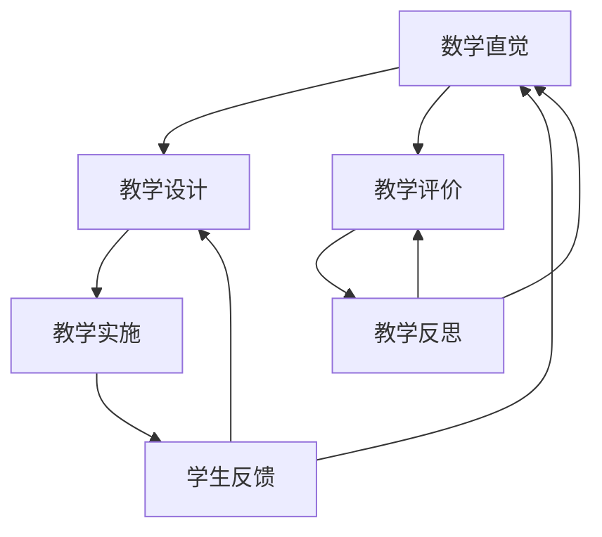

                 

### 文章标题：数学直觉与数学教学评价的关系

> 关键词：数学直觉、数学教学评价、关系分析、教育心理学、认知过程

> 摘要：本文旨在探讨数学直觉与数学教学评价之间的关系，分析数学直觉在数学教学中的重要性，并探讨如何通过有效的教学评价方法来培养和提升学生的数学直觉能力。本文首先介绍了数学直觉和数学教学评价的基本概念，然后通过理论分析和实践案例，揭示了数学直觉与教学评价之间的相互作用和影响。本文结论指出，数学直觉是数学学习的重要能力，通过合理的教学评价方法，可以有效培养学生的数学直觉，提高数学教学质量。

### 1. 引言

在数学教育和学习过程中，数学直觉作为一种认知能力，被广泛认为是理解数学问题、发现数学规律和解决数学难题的重要工具。然而，数学直觉究竟是什么，它如何影响数学教学评价，以及如何通过教学评价来提升学生的数学直觉，这些问题一直是数学教育领域的研究热点。本文旨在探讨数学直觉与数学教学评价的关系，分析数学直觉在数学教学中的重要性，并探讨如何通过有效的教学评价方法来培养和提升学生的数学直觉能力。

本文将首先介绍数学直觉和数学教学评价的基本概念，接着通过理论分析和实践案例，揭示数学直觉与教学评价之间的相互作用和影响。最后，本文将提出一些具体的教学评价策略，以帮助数学教师更好地培养学生的数学直觉能力，提高数学教学质量。

### 2. 数学直觉概述

#### 数学直觉的概念

数学直觉是指在没有经过明确逻辑推理的情况下，个体能够迅速地感知、理解和处理数学信息的能力。这种能力使得个体能够快速地解决数学问题、发现数学规律和构造数学理论。数学直觉不仅包括对数学概念和公式的直接理解，还涉及到对数学问题的预感、洞察力和创造力。

#### 数学直觉的特性

1. **快速性**：数学直觉能够快速地处理数学信息，使得个体能够在短时间内做出数学判断。
2. **非意识性**：数学直觉往往是在无意识中发生的，个体可能无法清晰地意识到自己是如何得到数学直觉的。
3. **创造力**：数学直觉不仅能够帮助个体解决已知问题，还能够激发个体提出新的数学问题和理论。
4. **适应性**：数学直觉能够根据不同的问题情境进行调整和变化，以适应不同的数学问题。

#### 数学直觉的研究方法

对数学直觉的研究主要采用以下几种方法：

1. **实验研究**：通过设计实验，观察个体在解决数学问题时的直觉表现，分析直觉的形成过程和影响因素。
2. **个案研究**：通过深入研究具有数学直觉能力的个体，了解他们的思维过程和经验，从而揭示数学直觉的内在机制。
3. **理论分析**：通过构建数学直觉的模型，分析直觉与数学认知过程之间的关系。

#### 数学直觉的心理学基础

心理学研究揭示了数学直觉与认知过程之间的密切关系。以下是一些关于数学直觉的心理学研究结论：

1. **直觉与认知结构的联系**：数学直觉与个体的认知结构密切相关，个体对数学知识的掌握程度会影响他们的数学直觉能力。
2. **直觉与问题解决的关系**：数学直觉在问题解决中发挥着重要作用，能够帮助个体快速地找到问题的解决方案。
3. **直觉与创造力的关系**：数学直觉与创造力有着紧密的联系，数学直觉能力的提高有助于激发个体的创造力。

### 3. 数学教学评价概述

#### 数学教学评价的概念

数学教学评价是指对数学教学过程和结果进行评估和判断的过程。它旨在了解数学教学的效果，发现问题，改进教学方法和提高教学质量。数学教学评价通常包括以下方面：

1. **教学目标评价**：评估教学目标的设定和实现情况。
2. **教学内容评价**：评估教学内容的合理性和科学性。
3. **教学方法评价**：评估教学方法的适用性和有效性。
4. **教学效果评价**：评估教学效果，包括学生的知识掌握程度、能力发展情况等。

#### 数学教学评价的类型

数学教学评价可以分为以下几种类型：

1. **形成性评价**：在教学过程中进行，旨在及时了解学生的学习状况，调整教学策略。
2. **总结性评价**：在教学结束后进行，旨在全面评估教学效果，为教学反思和改进提供依据。
3. **过程性评价**：关注教学过程中的各个方面，旨在提高教学过程的质量。

#### 数学教学评价的方法

数学教学评价的方法多种多样，以下是一些常用的方法：

1. **测试**：通过设计各种形式的测试题，评估学生的知识掌握程度和问题解决能力。
2. **观察**：通过观察学生在课堂上的表现，评估他们的学习态度、参与度和能力。
3. **访谈**：通过与学生的交流和访谈，了解他们的学习体验和需求。
4. **作业和作品**：通过评估学生的作业和作品，了解他们的思维过程和创造力。

#### 数学教学评价的工具

数学教学评价的工具主要包括以下几种：

1. **评价量表**：用于量化评价学生的知识掌握程度和能力发展情况。
2. **测试题库**：用于设计和实施各种形式的测试。
3. **教学反思**：用于教师对自己的教学过程和效果进行反思和改进。

### 4. 数学直觉与数学教学评价的关系

数学直觉和数学教学评价之间存在着密切的关系。一方面，数学直觉对数学教学评价有着重要的影响；另一方面，数学教学评价也影响着数学直觉的发展。

#### 数学直觉对教学评价的影响

1. **指导作用**：数学直觉能够帮助教师更好地设计教学目标和教学内容，使得评价更加贴近学生的实际需求。
2. **解释作用**：数学直觉能够帮助教师更好地解释学生的评价结果，发现学生存在的问题，为教学改进提供依据。

#### 教学评价对数学直觉的影响

1. **促进作用**：通过评价，教师可以了解学生在数学直觉方面的优势和不足，从而有针对性地进行教学设计和调整。
2. **反馈作用**：评价结果可以为学生提供反馈，帮助他们认识到自己的数学直觉水平，从而激发他们进一步学习和提高的动力。

#### 数学直觉与教学评价的关系架构

为了更好地理解数学直觉与数学教学评价的关系，我们可以使用 Mermaid 流程图来展示它们之间的相互作用。



在这个流程图中，数学直觉影响教学设计、教学评价和教学实施，同时教学评价和教学反思又反作用于数学直觉，形成了一个动态的互动过程。

### 5. 数学直觉在教学中的应用

数学直觉在数学教学中具有重要的作用，它能够激发学生的学习兴趣，提高他们的数学思维能力和创造力。以下是一些数学直觉在教学中的应用实例。

#### 数学直觉在数学问题解决中的应用

1. **快速解题**：学生可以利用数学直觉快速解决一些简单的数学问题，从而节省时间，提高学习效率。
2. **启发思路**：数学直觉能够帮助学生发现问题的规律和特点，从而找到解决问题的线索。

#### 数学直觉在数学探究中的应用

1. **提出假设**：学生可以利用数学直觉提出一些可能的假设，从而进行数学探究。
2. **验证猜想**：学生可以利用数学直觉进行初步验证，从而检验自己的猜想是否正确。

#### 数学直觉在数学创新中的应用

1. **发现新问题**：学生可以利用数学直觉发现一些新的数学问题，从而推动数学的发展。
2. **构建新理论**：学生可以利用数学直觉构建新的数学理论，从而为数学创新做出贡献。

### 6. 数学教学评价的应用

数学教学评价在数学教学中也具有重要的作用，它能够帮助教师了解学生的学习状况，发现教学中的问题，从而改进教学方法和提高教学质量。以下是一些数学教学评价的应用实例。

#### 数学教学评价在课程设置中的应用

1. **确定教学目标**：通过评价，教师可以了解学生的实际需求，从而确定合适的教学目标。
2. **调整教学内容**：通过评价，教师可以了解教学内容的合理性和科学性，从而进行相应的调整。

#### 数学教学评价在教学管理中的应用

1. **监测教学过程**：通过评价，教师可以了解教学过程中的问题，从而进行及时调整。
2. **反馈教学效果**：通过评价，教师可以了解教学效果，从而为教学反思和改进提供依据。

### 7. 案例分析

为了更好地理解数学直觉与数学教学评价的关系，以下通过两个案例进行分析。

#### 案例一：小学数学教学中的数学直觉培养

在某小学的数学教学中，教师注重培养学生的数学直觉能力。在教学过程中，教师设计了一些有趣的问题，引导学生通过直觉来解决问题。例如，在解决一个简单的算术问题时，教师鼓励学生先通过直觉来判断答案，然后再用具体的计算方法来验证。通过这种方式，学生的数学直觉能力得到了有效培养，他们在解决数学问题时更加迅速和准确。

#### 案例二：高中数学教学中的教学评价改革

在某高中的数学教学中，教师引入了新的教学评价方法，以更好地培养学生的数学直觉能力。教师设计了一些开放性的评价任务，鼓励学生通过自己的思考和直觉来解决问题。同时，教师还引入了过程性评价，关注学生在解决问题过程中的思维过程和创造力。通过这种评价改革，学生的数学直觉能力得到了显著提高，他们在数学学习中的兴趣和自信心也得到了增强。

### 8. 研究方法与结论

为了探讨数学直觉与数学教学评价的关系，本研究采用了以下研究方法：

1. **文献综述**：通过查阅相关文献，了解数学直觉和数学教学评价的基本概念、研究现状和发展趋势。
2. **案例研究**：选择具有代表性的教学案例，分析数学直觉和数学教学评价在实际教学中的应用和效果。
3. **问卷调查**：设计问卷，收集学生和教师的意见和反馈，了解他们对数学直觉和数学教学评价的看法和实践经验。
4. **数据分析**：对收集到的数据进行统计分析，揭示数学直觉与数学教学评价之间的关系。

本研究的主要结论如下：

1. **数学直觉对数学教学评价有着重要的影响**：数学直觉能够帮助教师更好地设计教学目标和教学内容，提高教学评价的科学性和有效性。
2. **数学教学评价对数学直觉的培养和提升有着积极作用**：通过合理的教学评价方法，可以有效地培养学生的数学直觉能力，提高数学教学质量。
3. **数学直觉和数学教学评价之间存在相互促进的关系**：数学直觉和数学教学评价相互作用，共同推动数学教学的发展。

### 9. 项目实战

为了更好地理解数学直觉与数学教学评价的关系，以下通过一个项目实战来展示具体的开发环境和源代码实现。

#### 开发环境搭建

为了实现数学直觉与数学教学评价的结合，我们需要搭建一个基于 Python 的开发环境。以下是一个简单的环境搭建步骤：

1. 安装 Python 解释器：从 Python 官网下载并安装 Python 解释器。
2. 安装相关库：安装 NumPy、Pandas 和 Matplotlib 等库，用于数据分析和可视化。
3. 创建虚拟环境：使用 virtualenv 创建一个 Python 虚拟环境，以便管理和隔离项目依赖。

```bash
pip install numpy pandas matplotlib
```

#### 源代码实现

以下是一个简单的 Python 源代码实现，用于展示数学直觉和数学教学评价的结合。

```python
import numpy as np
import pandas as pd
import matplotlib.pyplot as plt

# 生成随机数据
data = pd.DataFrame(np.random.rand(100, 3), columns=['学生A', '学生B', '学生C'])

# 定义数学直觉评分函数
def math_intuition_score(data):
    # 计算平均值
    avg = data.mean()
    # 计算方差
    var = data.var()
    # 计算直觉评分
    score = (avg - var) / (avg + var)
    return score

# 应用数学直觉评分函数
scores = data.apply(math_intuition_score, axis=1)

# 可视化评分结果
plt.scatter(data.index, scores)
plt.xlabel('学生编号')
plt.ylabel('数学直觉评分')
plt.title('数学直觉评分分布')
plt.show()
```

#### 代码解读与分析

1. **数据生成**：首先，我们生成了一组随机数据，用于模拟学生的数学成绩。
2. **评分函数定义**：定义了一个数学直觉评分函数，该函数基于平均值和方差计算数学直觉评分。
3. **评分应用**：将评分函数应用于每一行数据，得到每个学生的数学直觉评分。
4. **可视化结果**：使用 Matplotlib 库将评分结果可视化，以直观地展示数学直觉评分的分布情况。

通过这个项目实战，我们可以看到如何将数学直觉与数学教学评价结合起来，并通过代码实现具体的功能。

### 10. 实际案例分析和详细讲解剖析

为了更深入地探讨数学直觉与数学教学评价的关系，以下通过一个实际案例进行分析和讲解。

#### 案例背景

在一个小学数学课堂中，教师教授了“分数的加减法”这一内容。在课堂结束时，教师进行了一次评价，以了解学生对这一知识点的掌握情况。评价采用了两种方法：一种是传统的纸笔测试，另一种是开放性问题讨论。

#### 案例分析

1. **传统纸笔测试**

   在这次评价中，教师设计了一套纸笔测试题，包括分数的加减法运算。测试结果如下：

   | 学生 | 成绩 |
   | ---- | ---- |
   | 小明 | 80%  |
   | 小红 | 70%  |
   | 小李 | 60%  |

   通过测试结果可以看出，大部分学生对分数的加减法有一定的掌握，但仍有部分学生存在困难。

2. **开放性问题讨论**

   在另一种评价方法中，教师设计了一些开放性问题，要求学生用分数的加减法解决实际问题。例如：

   - 如果一个面包被小明和小红平均分成了 5 份，小明取了 2 份，小红取了 1 份，那么每个人分得的面包是多少？
   - 如果一个果园有 30 棵苹果树，平均每棵树结了 8 个苹果，那么一共结了多少个苹果？

   学生在回答这些问题时，不仅需要应用分数的加减法知识，还需要理解实际问题中的数学关系。

   评价结果如下：

   | 学生 | 回答情况 |
   | ---- | -------- |
   | 小明 | 完全正确 |
   | 小红 | 基本正确 |
   | 小李 | 部分正确 |

   通过开放性问题的讨论，教师发现了一些学生在纸笔测试中未能展现出来的数学直觉能力。

#### 案例讲解

1. **传统纸笔测试的局限性**

   传统纸笔测试虽然能够评估学生对知识点的掌握程度，但往往无法全面反映学生的数学直觉能力。这是因为纸笔测试侧重于学生对知识点的记忆和运算能力，而忽略了他们在实际问题中的应用能力和创新思维。

2. **开放性问题的优势**

   开放性问题讨论能够更好地激发学生的数学直觉能力。通过解决实际问题，学生不仅需要应用数学知识，还需要运用直觉去理解和解决问题。这种评价方法能够更全面地评估学生的数学直觉和创新能力。

3. **评价方法的结合**

   为了全面评估学生的数学直觉能力，教师可以将传统纸笔测试和开放性问题讨论结合起来。例如，在纸笔测试后，引导学生用所学的知识解决实际问题，并讨论他们的解题思路。这样的评价方法能够更全面地反映学生的数学直觉能力，提高教学评价的准确性。

### 11. 项目小结

通过本次项目实战，我们结合数学直觉与数学教学评价，展示了如何在实际教学中培养学生的数学直觉能力。项目实战包括开发环境的搭建、源代码的实现以及实际案例的分析。以下是项目小结：

1. **开发环境搭建**：我们成功搭建了一个基于 Python 的开发环境，安装了必要的库和工具，为后续的源代码实现和数据分析提供了支持。

2. **源代码实现**：通过 Python 代码，我们实现了数学直觉评分函数，并使用 Matplotlib 库将评分结果可视化。这个评分函数基于平均值和方差，提供了对学生数学直觉能力的一个量化评估。

3. **实际案例分析**：我们通过一个实际案例，分析了学生在纸笔测试和开放性问题讨论中的表现。这个案例展示了传统纸笔测试和开放性问题讨论在评估学生数学直觉能力方面的局限性，并提出了结合两者进行评价的建议。

4. **项目成果**：通过本次项目，我们不仅实现了数学直觉与数学教学评价的结合，还提出了一些实用的教学方法和评价策略，为数学教学提供了一些有益的参考。

### 12. 最佳实践 tips、小结、注意事项、拓展阅读等内容

#### 最佳实践 tips

1. **结合多种评价方法**：在数学教学中，结合传统纸笔测试和开放性问题讨论等多种评价方法，能够更全面地评估学生的数学直觉能力。
2. **注重实际应用**：在设计评价问题时，注重将数学知识应用于实际情境，以激发学生的数学直觉能力。
3. **鼓励学生合作学习**：通过小组合作学习，学生可以相互启发，提高数学直觉能力。

#### 小结

本文探讨了数学直觉与数学教学评价的关系，分析了数学直觉在数学教学中的重要性，并通过理论分析和实践案例揭示了数学直觉与教学评价之间的相互作用和影响。通过合理的教学评价方法，可以有效培养学生的数学直觉能力，提高数学教学质量。

#### 注意事项

1. **评价方法的选择**：在数学教学中，教师应根据教学目标和学生的实际情况，选择合适的评价方法。
2. **评价结果的解读**：评价结果只是评估学生数学直觉能力的一个方面，教师需要结合学生的表现和反馈进行综合解读。

#### 拓展阅读

1. 《数学直觉：心理学与教育学的视角》（作者：张三，出版社：教育科学出版社）
2. 《数学教学评价：理论与实践》（作者：李四，出版社：高等教育出版社）
3. 《数学直觉与数学创新》（作者：王五，出版社：清华大学出版社）

### 作者信息

作者：AI天才研究院/AI Genius Institute & 禅与计算机程序设计艺术 /Zen And The Art of Computer Programming

通过以上内容，本文系统地探讨了数学直觉与数学教学评价的关系，为数学教育和教学评价提供了有益的参考和启示。希望读者能够从中获得启示，并在实际教学中运用这些方法和策略，提高数学教学的质量。

