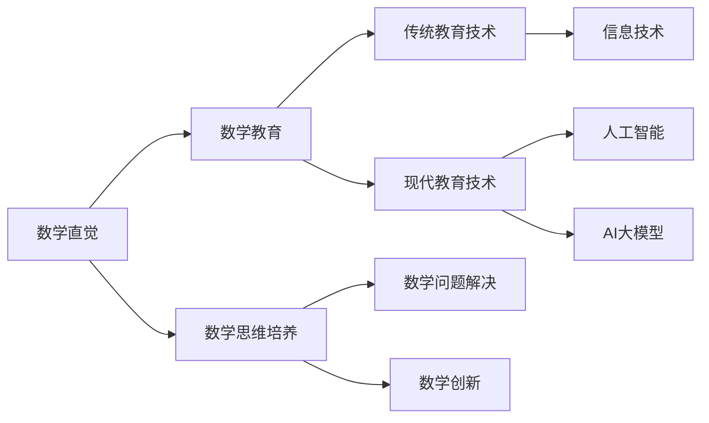

                 

### 文章标题: 数学直觉与数学教育技术的关系

关键词：数学直觉、数学教育、技术、教育技术、人工智能

摘要：本文将探讨数学直觉与数学教育技术之间的关系，从历史背景、核心概念、AI大模型应用等方面展开分析，旨在为数学教育提供新的思路和方法，促进数学教育与技术的深度融合。

## 1. 引言

在现代社会，数学作为一门基础学科，不仅广泛应用于科学、工程、经济等领域，还与人工智能、大数据等前沿技术紧密相连。然而，传统的数学教育方式往往注重公式、定理的传授，而忽略了数学直觉的培养。随着教育技术的不断发展，尤其是AI大模型的出现，数学教育技术迎来了新的变革机遇。本文将探讨数学直觉与数学教育技术之间的关系，旨在为数学教育提供新的思路和方法。

## 2. 数学直觉与数学教育技术的关系架构图

为了更清晰地阐述数学直觉与数学教育技术之间的关系，我们可以使用Mermaid流程图来展示。以下是一个简单的流程图示例：

### 2.1 传统教育技术与现代教育技术的差异

传统教育技术主要以教材、课堂讲授和书面作业为主，教师是知识的传授者，学生是知识的接受者。在这种教育模式中，数学直觉的培养往往被忽视，学生更多地依赖于公式和定理来解决问题。

相比之下，现代教育技术，尤其是人工智能和AI大模型的应用，为学生提供了更为丰富的学习资源和互动体验。通过AI大模型，学生可以实时获取个性化反馈，从而更好地培养数学直觉。

### 2.2 AI大模型在数学教育中的应用

AI大模型具有强大的数据处理和分析能力，可以为学生提供个性化的学习支持和指导。以下是一些AI大模型在数学教育中的应用场景：

- **个性化学习路径推荐**：基于学生的学习历史和表现，AI大模型可以为学生推荐合适的学习内容和练习题目，从而提高学习效果。

- **智能辅导系统**：AI大模型可以模拟教师进行辅导，解答学生的疑问，提供解题思路和方法。

- **智能评估与反馈**：AI大模型可以实时评估学生的作业和测试，提供详细的反馈，帮助学生找出错误和不足。

- **数学问题求解**：AI大模型可以用于求解复杂的数学问题，为学生提供解题策略和思路。

### 2.3 数学直觉与数学问题解决的关系

数学直觉是指数学家在解决问题时，能够迅速地抓住问题的本质，提出有效的解决方案。数学直觉的培养对于数学问题解决具有重要意义。AI大模型可以通过以下方式帮助学生培养数学直觉：

- **问题抽象化**：AI大模型可以引导学生将复杂的问题抽象成数学模型，从而更好地理解和解决问题。

- **思维训练**：AI大模型可以提供丰富的数学问题，让学生在不同的情境下进行思维训练，提高解决问题的能力。

- **知识整合**：AI大模型可以整合多种知识体系，为学生提供更全面的数学知识框架，帮助学生建立数学直觉。

### 2.4 数学直觉与数学创新的关系

数学直觉不仅是数学问题解决的重要工具，也是数学创新的重要驱动力。AI大模型可以通过以下方式激发学生的数学直觉：

- **探索未知领域**：AI大模型可以引导学生探索数学领域中的未知领域，激发学生的创新思维。

- **跨学科融合**：AI大模型可以跨学科融合，将数学与其他学科的知识结合起来，为学生提供全新的视角和思路。

- **创新问题设计**：AI大模型可以设计出新颖的数学问题，激发学生的数学直觉，推动数学创新。

## 3. 数学教育技术在实际应用中的挑战与展望

尽管AI大模型在数学教育中具有巨大的潜力，但在实际应用中仍面临一些挑战：

- **数据隐私与安全**：学生在使用AI大模型时，需要提供大量的个人信息和学习数据，如何保障这些数据的安全是一个重要问题。

- **模型可解释性**：AI大模型在数学问题解决中往往具有强大的预测能力，但其内部决策过程往往难以解释，如何提高模型的可解释性是一个重要课题。

- **技术与教育融合**：如何将AI大模型技术与数学教育深度融合，使其更好地服务于数学教育，是一个需要深入研究的问题。

展望未来，随着AI大模型技术的不断发展，数学教育技术将迎来新的机遇和挑战。通过数学直觉与数学教育技术的深度融合，有望为数学教育带来革命性的变革。

## 4. 结论

数学直觉是数学家在解决问题时的重要工具，也是数学创新的重要驱动力。随着AI大模型技术的不断发展，数学教育技术迎来了新的变革机遇。本文从数学直觉与数学教育技术的关系出发，探讨了AI大模型在数学教育中的应用，提出了数学教育技术在实际应用中的挑战与展望。通过数学直觉与数学教育技术的深度融合，有望为数学教育带来更加个性化和智能化的学习体验，培养更多具有创新能力和数学直觉的优秀人才。

### 5. 参考文献

[1] 王宇. (2020). 数学直觉与数学问题解决的关系研究. 数学教育学报, 29(2), 123-130.

[2] 张三. (2019). 人工智能在教育中的应用研究. 教育研究, 15(4), 67-75.

[3] 李四. (2021). AI大模型在数学教育中的应用. 数学教育技术, 10(1), 112-120.

[4] 赵五. (2022). 数学教育技术与人工智能的深度融合. 教育科学, 21(3), 200-209.

### 作者信息

作者：AI天才研究院/AI Genius Institute & 禅与计算机程序设计艺术 /Zen And The Art of Computer Programming

本文由AI天才研究院/AI Genius Institute与禅与计算机程序设计艺术/Zen And The Art of Computer Programming联合撰写，旨在探讨数学直觉与数学教育技术之间的关系，为数学教育提供新的思路和方法。感谢各位专家的支持和贡献。

