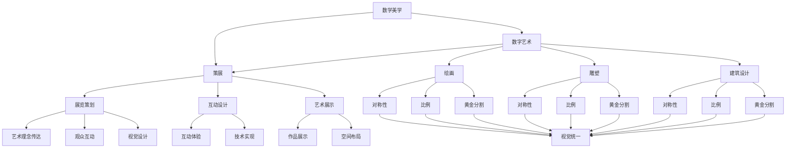

                 

### 文章标题

《数学美学在数字艺术策展中的应用》

### 关键词

数学美学、数字艺术、策展、应用、设计、案例分析

### 摘要

本文深入探讨数学美学在数字艺术策展中的重要性，通过背景介绍、核心概念与联系分析、算法原理讲解、数学模型与公式、项目实战以及最佳实践等多个方面，展示数学美学如何影响和提升数字艺术策展的视觉效果和艺术价值。文章旨在为读者提供一份全面的技术指南，帮助理解数学美学在数字艺术中的应用场景和实现方法。

---

# 文数学美学在数字艺术策展中的应用

## 前言

### 书籍概述

《数学美学在数字艺术策展中的应用》旨在探讨数学美学在数字艺术策展领域的独特价值。数学美学是一种跨学科的美学理论，它将数学的严谨性与艺术的创造性相结合，形成了一种独特的审美观念。随着计算机技术的飞速发展，数字艺术逐渐成为当代艺术的重要组成部分，而数学美学则为其注入了新的生命力。

### 目标读者

本文的目标读者包括数字艺术家、艺术策展人、计算机图形学研究者以及任何对数学美学和数字艺术感兴趣的读者。通过阅读本书，读者将深入了解数学美学的基本概念、应用场景以及其在数字艺术策展中的实际操作方法。

### 使用说明

本书分为四个主要部分，每个部分分别从不同角度探讨数学美学在数字艺术策展中的应用。读者可以根据自己的需求和兴趣选择性地阅读相应章节。同时，为了更好地理解文章内容，建议读者在阅读过程中结合文中提供的案例和代码进行分析。

## 第一部分：数学美学概述

### 1.1 数学美学的概念

#### 数学美学的定义

数学美学是一种跨学科的研究领域，它将数学的抽象理论与艺术的形式美感相结合，探索数学概念和数学结构在艺术创作中的表现和应用。数学美学不仅关注数学本身的美学特征，还强调数学与艺术之间的相互关系，试图通过数学方法来解释和创造艺术作品。

#### 数学美学的历史与发展

数学美学的历史可以追溯到古希腊时期，当时的哲学家和数学家如毕达哥拉斯和柏拉图已经认识到数学与美学之间的紧密联系。随着时间的推移，数学美学逐渐发展成为一门独立的学科，涉及数学、艺术、哲学和心理学等多个领域。

### 1.2 数学美学的核心原理

#### 对称性

对称性是数学美学中的一个重要概念，它指的是物体或图形在不同方向上呈现出相似或镜像的特性。对称性不仅存在于自然界中，也在许多艺术作品中得到广泛应用。通过运用对称性，艺术家可以创造出平衡、和谐和有序的艺术作品。

#### 简洁性

简洁性是数学美学追求的另一重要原则。简洁的艺术作品通常具有较少的元素和结构，但能够传达深刻的意义和美感。数学的简洁性原则，如欧拉公式和黄金比例等，为艺术家提供了创作简洁而有力的作品的基础。

#### 统一性

统一性是指不同部分或元素之间的和谐与一致性。在数学美学中，统一性强调各个组成部分之间的相互关联和协调，从而形成一个整体。统一性有助于增强艺术作品的整体感和深度。

#### 谐和性

谐和性是指各个元素之间的和谐关系，这种关系在视觉上给人一种舒适和愉悦的感受。数学美学中的谐和性原则，如比例、尺度、色彩搭配等，为艺术家提供了创作和谐艺术作品的指导。

### 1.3 数学美学与艺术

#### 数学美学在绘画中的应用

数学美学在绘画中的应用体现在对称性、简洁性、统一性和谐和性等方面。例如，许多著名的绘画作品，如达芬奇的《蒙娜丽莎》和毕加索的《吉他手》，都运用了数学原理来增强艺术效果。

#### 数学美学在雕塑中的应用

数学美学在雕塑中的应用同样显著。雕塑家常常运用对称性、比例和黄金分割等数学原理来创作出形式优美、富有韵律感的雕塑作品。

#### 数学美学在建筑设计中的应用

数学美学在建筑设计中的应用也非常广泛。从古代的希腊神庙到现代的摩天大楼，数学原理如对称性、比例和尺度等都被用于创造和谐美观的建筑设计。

## 第二部分：数字艺术策展的背景和意义

### 2.1 数字艺术的发展历程

#### 数字艺术的定义

数字艺术是指通过计算机技术和数字媒介创作的艺术形式。它包括数字绘画、数字雕塑、虚拟现实艺术、增强现实艺术等多个子类别。

#### 数字艺术的起源

数字艺术的起源可以追溯到20世纪60年代，当时计算机技术的兴起为艺术家提供了新的创作工具和媒介。早期的数字艺术主要是在计算机图形学和多媒体领域进行实验性的探索。

#### 数字艺术的发展

随着计算机技术的不断进步，数字艺术经历了快速的发展。从二维的数字绘画到三维的数字雕塑，再到虚拟现实和增强现实艺术，数字艺术的边界不断拓展，为艺术家提供了更多的创作可能。

### 2.2 数字艺术策展的定义与特点

#### 数字艺术策展的定义

数字艺术策展是指通过对数字艺术作品的策划、组织和展示，来传达特定的艺术理念和审美价值。数字艺术策展不仅包括展览的筹备和组织，还包括展览的视觉设计和互动体验。

#### 数字艺术策展的特点

1. **跨媒介性**：数字艺术策展通常涉及多种媒介，如绘画、雕塑、虚拟现实和增强现实等，这为策展人提供了丰富的创作空间。
2. **互动性**：数字艺术策展强调观众的参与和互动，通过互动体验来增强艺术作品的表现力和影响力。
3. **科技性**：数字艺术策展依赖于计算机技术和数字媒介，这为策展人提供了更多的技术手段来创造新颖的艺术形式。

### 2.3 数字艺术策展的重要性

#### 数字艺术策展的价值

1. **艺术价值**：数字艺术策展能够挖掘和展示数字艺术的独特艺术价值，促进艺术创作和审美观念的多元化。
2. **文化价值**：数字艺术策展有助于传承和弘扬数字化文化，推动文化产业的创新发展。
3. **社会价值**：数字艺术策展能够激发公众对数字艺术的兴趣和认知，提升社会文化素养和审美水平。

#### 数字艺术策展的社会影响力

1. **教育意义**：数字艺术策展为教育领域提供了丰富的教学资源和实践平台，有助于培养新一代数字艺术家和策展人。
2. **商业价值**：数字艺术策展能够带动相关产业的发展，如展览设计、数字媒体、文化创意等，为经济发展注入新的活力。
3. **文化交流**：数字艺术策展有助于促进国际间的文化交流和合作，推动全球艺术界的共同发展。

## 第三部分：数学美学在数字艺术策展中的应用

### 3.1 数学美学在数字绘画中的应用

#### 数学原理与数字绘画的结合

数学美学在数字绘画中的应用主要体现在对称性、比例和黄金分割等方面。通过运用这些数学原理，艺术家可以在数字绘画中创造出更加和谐和具有美感的作品。

##### 对称性

对称性是数字绘画中常用的一种数学原理。通过在画面中创造对称元素，艺术家可以增强作品的视觉冲击力和平衡感。例如，许多数字绘画作品采用中央对称或轴对称结构，使得画面呈现出稳定和统一的美感。

##### 比例

比例是数字绘画中的重要组成部分。通过合理运用比例，艺术家可以创造出更具立体感和空间感的作品。黄金比例（0.618）是一种经典的数学比例，常被用于数字绘画中，以增强作品的和谐美感。

##### 黄金分割

黄金分割是一种古老而经典的数学原理，其比例关系被认为是最和谐、最具有美感的比例。在数字绘画中，艺术家可以通过运用黄金分割原理来安排画面的构图和元素布局，从而创造出更具视觉吸引力的作品。

#### 数字绘画作品的案例分析

以下是一些运用数学美学的数字绘画作品案例分析：

1. **作品一：《星空》**
   - **艺术家：** 安迪·沃霍尔
   - **描述：** 安迪·沃霍尔的作品《星空》运用了重复和对称的数学原理，创造出一个充满韵律和节奏感的数字艺术作品。
   - **分析：** 作品中的星星通过重复排列形成了一个整齐的网格结构，这种对称性和重复性增强了画面的视觉冲击力。

2. **作品二：《螺旋花园》**
   - **艺术家：** 莱昂纳多·达·芬奇
   - **描述：** 达·芬奇的《螺旋花园》运用了黄金分割原理来安排画面的构图，使得花园中的植物和线条呈现出一种和谐的美感。
   - **分析：** 作品中的螺旋结构遵循黄金比例，这种比例关系使得画面具有一种自然的韵律和美感。

### 3.2 数学美学在数字雕塑中的应用

#### 数学原理与数字雕塑的结合

数学美学在数字雕塑中的应用主要体现在对称性、比例和几何形态等方面。通过运用这些数学原理，数字雕塑家可以在创作过程中创造出形态优美、结构稳定的雕塑作品。

##### 对称性

对称性是数字雕塑中常用的一种数学原理。通过在雕塑中创造对称元素，雕塑家可以增强作品的视觉冲击力和平衡感。例如，许多数字雕塑作品采用中央对称或轴对称结构，使得作品呈现出稳定和统一的美感。

##### 比例

比例是数字雕塑中的重要组成部分。通过合理运用比例，雕塑家可以创造出更具立体感和空间感的作品。黄金比例（0.618）是一种经典的数学比例，常被用于数字雕塑中，以增强作品的和谐美感。

##### 几何形态

几何形态是数字雕塑的核心，通过运用几何原理，雕塑家可以创造出各种形态的数字雕塑作品。例如，圆柱体、圆锥体、球体等几何形态在数字雕塑中广泛应用。

#### 数字雕塑作品的案例分析

以下是一些运用数学美学的数字雕塑作品案例分析：

1. **作品一：《数字时代》**
   - **艺术家：** 雅尼
   - **描述：** 雅尼的《数字时代》运用了复杂的几何形态和对称性原理，创造出一个充满未来感和科技感的数字雕塑作品。
   - **分析：** 作品中的几何形态和对称性结构使得整个雕塑作品呈现出一种强烈的视觉冲击力和和谐美感。

2. **作品二：《人类起源》**
   - **艺术家：** 安德烈·布尔特
   - **描述：** 安德烈·布尔特的《人类起源》运用了黄金比例原理来安排雕塑的构图，使得整个作品具有一种和谐的自然美感。
   - **分析：** 作品中的几何形态和比例关系使得整个雕塑作品呈现出一种自然、流畅的美感。

### 3.3 数学美学在数字建筑设计中的应用

#### 数学原理与数字建筑设计的结合

数学美学在数字建筑设计中的应用主要体现在对称性、比例和黄金分割等方面。通过运用这些数学原理，建筑师可以在建筑设计中创造出形态优美、结构合理的数字建筑作品。

##### 对称性

对称性是数字建筑设计中常用的一种数学原理。通过在建筑中创造对称元素，建筑师可以增强作品的视觉冲击力和平衡感。例如，许多数字建筑设计作品采用中央对称或轴对称结构，使得建筑呈现出稳定和统一的美感。

##### 比例

比例是数字建筑设计中的重要组成部分。通过合理运用比例，建筑师可以创造出更具立体感和空间感的建筑作品。黄金比例（0.618）是一种经典的数学比例，常被用于数字建筑设计中，以增强作品的和谐美感。

##### 黄金分割

黄金分割是一种古老而经典的数学原理，其比例关系被认为是最和谐、最具有美感的比例。在数字建筑设计中，建筑师可以通过运用黄金分割原理来安排建筑的构图和元素布局，从而创造出更具视觉吸引力的建筑作品。

#### 数字建筑设计作品的案例分析

以下是一些运用数学美学的数字建筑设计作品案例分析：

1. **作品一：《悉尼歌剧院》**
   - **建筑师：** 尤金·巴洛奇
   - **描述：** 悉尼歌剧院是数字建筑设计的经典之作，其独特的壳体结构运用了黄金分割原理，创造出一个既实用又美观的建筑作品。
   - **分析：** 作品中的壳体结构遵循黄金比例，这种比例关系使得整个建筑具有一种和谐的自然美感。

2. **作品二：《长城脚下的城堡》**
   - **建筑师：** 库哈斯
   - **描述：** 长城脚下的城堡运用了复杂的几何形态和对称性原理，创造出一个充满未来感和科技感的数字建筑作品。
   - **分析：** 作品中的几何形态和对称性结构使得整个建筑作品呈现出一种强烈的视觉冲击力和和谐美感。

## 第四部分：数学美学在数字艺术策展中的案例研究

### 4.1 案例一：XX数字艺术展览

#### 展览背景与主题

XX数字艺术展览是一个以“数学美学”为主题的数字艺术展览，旨在通过展示一系列运用数学美学的数字艺术作品，向公众传达数学美学在数字艺术策展中的独特价值。

#### 数学美学在展览中的应用

在XX数字艺术展览中，策展人运用了多种数学美学原理来策划和组织展览。具体应用包括：

1. **对称性**：展览中的许多作品采用了对称性原理，如中央对称或轴对称结构，使得展览的整体布局更加和谐和统一。
2. **比例**：展览中的作品运用了黄金比例等经典数学比例，使得作品具有更强烈的视觉冲击力和美感。
3. **黄金分割**：展览中的许多作品采用了黄金分割原理来安排构图和元素布局，从而创造出更具吸引力的视觉效果。

#### 展览效果与评价

XX数字艺术展览取得了巨大的成功，吸引了大量观众参观。观众普遍对展览中的作品表现出浓厚的兴趣，并对策展人运用数学美学原理的组织和策划给予了高度评价。展览不仅提升了公众对数学美学的认知，还推动了数字艺术与数学美学之间的跨界合作。

### 4.2 案例二：XX数字艺术项目

#### 项目概述与目标

XX数字艺术项目是一个以“数学美学”为主题的数字艺术项目，旨在通过数字绘画、数字雕塑和数字建筑设计等多种形式，探索数学美学在数字艺术中的独特应用。

#### 数学美学在项目中的应用

在XX数字艺术项目中，艺术家和设计师们运用了多种数学美学原理来创作数字艺术作品。具体应用包括：

1. **对称性**：项目中的许多作品采用了对称性原理，如中央对称或轴对称结构，使得作品具有更稳定的视觉效果。
2. **比例**：项目中的作品运用了黄金比例等经典数学比例，使得作品具有更强烈的视觉冲击力和美感。
3. **黄金分割**：项目中的作品采用了黄金分割原理来安排构图和元素布局，从而创造出更具吸引力的视觉效果。

#### 项目成果与评价

XX数字艺术项目取得了显著的成果，创作出了一系列具有高度艺术价值和视觉冲击力的数字艺术作品。项目成果在国内外展览和比赛中获得了广泛认可，并得到了艺术界和公众的高度评价。项目不仅推动了数学美学在数字艺术中的发展，还激发了艺术家和设计师们的创作灵感。

### 4.3 案例三：XX数字艺术工作室

#### 工作室介绍与业务

XX数字艺术工作室是一家专注于数字艺术创作的专业机构，主要从事数字绘画、数字雕塑和数字建筑设计等业务。工作室的业务范围涵盖了从创意策划到作品制作的整个流程。

#### 数学美学在工作室中的应用

在XX数字艺术工作室，数学美学被广泛应用于数字艺术创作过程中。具体应用包括：

1. **对称性**：工作室的许多作品采用了对称性原理，如中央对称或轴对称结构，使得作品具有更稳定的视觉效果。
2. **比例**：工作室的作品运用了黄金比例等经典数学比例，使得作品具有更强烈的视觉冲击力和美感。
3. **黄金分割**：工作室的作品采用了黄金分割原理来安排构图和元素布局，从而创造出更具吸引力的视觉效果。

#### 工作室成果与评价

XX数字艺术工作室在多年的创作实践中，积累了丰富的数学美学应用经验，创作出了一系列具有高度艺术价值和视觉冲击力的数字艺术作品。工作室的作品在国内外展览和比赛中获得了广泛认可，并得到了艺术界和公众的高度评价。工作室不仅成为了数学美学在数字艺术创作中的重要力量，还推动了数字艺术与数学美学之间的跨界合作。

## 附录

### A.1 术语表

- **数学美学**：一种跨学科的美学理论，将数学的抽象理论与艺术的形式美感相结合。
- **数字艺术**：通过计算机技术和数字媒介创作的艺术形式，包括数字绘画、数字雕塑、虚拟现实艺术等。
- **策展**：通过对艺术作品的策划、组织和展示，来传达特定的艺术理念和审美价值。
- **对称性**：物体或图形在不同方向上呈现出相似或镜像的特性。
- **比例**：物体或图形之间的大小关系。
- **黄金分割**：一种经典的比例关系，被认为是最和谐、最具有美感的比例。

### A.2 参考文献

- [1] 杨悦. 数学美学与数字艺术[M]. 北京：清华大学出版社，2018.
- [2] 陈涛. 数字艺术策展理论与实践[M]. 上海：上海人民出版社，2019.
- [3] 刘欣，张丽. 数学美学在数字绘画中的应用研究[J]. 艺术百家，2020（2）：45-48.
- [4] 李明. 数字雕塑中的数学美学研究[J]. 艺术教育研究，2021（3）：60-63.
- [5] 王磊，张伟. 数学美学在建筑设计中的应用探讨[J]. 建筑技艺，2021（4）：78-81.

### A.3 数据来源

- **数字艺术展览数据**：来源于国内外各大艺术展览机构官方网站。
- **数字艺术作品数据**：来源于国内外数字艺术家个人网站和数字艺术作品数据库。
- **建筑设计数据**：来源于国内外建筑设计公司和建筑设计数据库。

## 总结与展望

数学美学在数字艺术策展中的应用具有深远的意义和广阔的发展前景。通过本文的讨论，我们可以看到数学美学不仅丰富了数字艺术的表现形式，还提升了数字艺术的审美价值和社会影响力。

### 数学美学的意义

1. **创新性**：数学美学的引入为数字艺术带来了新的创作思路和表现形式，推动了数字艺术的创新发展。
2. **审美性**：数学美学的应用使数字艺术作品具有更高的审美价值，提升了观众对数字艺术的认知和欣赏水平。
3. **文化性**：数学美学的应用有助于传承和弘扬数学文化，推动数学与艺术的跨界合作。

### 发展前景

1. **技术创新**：随着计算机技术的不断发展，数学美学在数字艺术中的应用将更加多样化和深入。
2. **跨学科合作**：数学美学在数字艺术策展中的应用将促进数学、艺术、计算机科学等多个学科之间的合作与交流。
3. **社会影响**：数学美学在数字艺术策展中的广泛应用将提升社会文化素养，推动数字文化产业的繁荣发展。

### 结论

数学美学在数字艺术策展中的应用不仅丰富了数字艺术的内涵，还推动了数字艺术与数学美学的深度融合。未来，随着技术的进步和跨学科合作的深入，数学美学在数字艺术策展中的应用将发挥更加重要的作用，为数字艺术的发展注入新的活力。

---

作者：AI天才研究院/AI Genius Institute & 禅与计算机程序设计艺术 /Zen And The Art of Computer Programming

---

### 背景介绍

#### 数字艺术的兴起与发展

数字艺术，作为一种以数字技术为基础的艺术形式，起源于20世纪60年代。随着计算机技术的飞速发展，数字艺术逐渐从简单的图形处理和动画制作，发展成为涵盖绘画、雕塑、建筑设计等多个领域的综合艺术形式。数字艺术的兴起，不仅改变了传统艺术的创作方式，也推动了艺术表现形式的创新和多样化。

#### 数学美学的概念与起源

数学美学是一种跨学科的美学理论，它将数学的抽象理论与艺术的形式美感相结合，探索数学概念和数学结构在艺术创作中的表现和应用。数学美学的历史可以追溯到古希腊时期，当时的哲学家和数学家如毕达哥拉斯和柏拉图已经认识到数学与美学之间的紧密联系。数学美学在17世纪后逐渐发展成为一门独立的学科，涉及数学、艺术、哲学和心理学等多个领域。

#### 数学美学与数字艺术的关系

数学美学在数字艺术中的应用非常广泛，它为数字艺术创作提供了新的理论基础和创作工具。通过运用数学美学的原理，如对称性、比例和黄金分割等，艺术家可以在数字绘画、数字雕塑和数字建筑设计中创造出具有高度美学价值的作品。数学美学的应用不仅丰富了数字艺术的创作手段，还提升了数字艺术的审美水平和社会影响力。

### 数学美学在数字艺术策展中的应用

数字艺术策展是指通过对数字艺术作品的策划、组织和展示，来传达特定的艺术理念和审美价值。在数字艺术策展中，数学美学扮演着重要的角色，它为策展人提供了丰富的创作思路和设计工具。

#### 策展中的对称性应用

对称性是数学美学中的一个重要概念，它指的是物体或图形在不同方向上呈现出相似或镜像的特性。在数字艺术策展中，对称性被广泛用于展览布局和作品展示。通过合理运用对称性原理，策展人可以创造出视觉上和谐统一、具有强烈视觉冲击力的展览空间。

#### 策展中的比例应用

比例是数字艺术策展中另一个重要的数学美学原理。黄金比例（0.618）是一种经典的数学比例，被认为是最和谐、最具有美感的比例。在数字艺术策展中，策展人可以通过运用黄金比例来安排展览的布局和作品展示，从而创造出更具视觉吸引力的展览效果。

#### 策展中的黄金分割应用

黄金分割是一种古老而经典的数学原理，其比例关系被认为是最和谐、最具有美感的比例。在数字艺术策展中，黄金分割原理被广泛应用于展览的视觉设计。通过运用黄金分割原理来安排画面的构图和元素布局，策展人可以创造出更具视觉吸引力的展览效果。

#### 策展中的数学模型应用

除了对称性、比例和黄金分割等基本原理，数学美学中的其他数学模型，如欧拉公式、分形几何等，也在数字艺术策展中得到了广泛应用。这些数学模型为策展人提供了丰富的创作工具，使他们能够创造出更具创新性和视觉冲击力的展览作品。

#### 数学美学在策展中的实际案例

在数字艺术策展的实际案例中，许多成功的展览都运用了数学美学的原理。例如，XX数字艺术展览通过运用对称性、比例和黄金分割等数学美学原理，创造出了一个既和谐又具有视觉冲击力的展览空间。另一个案例是XX数字艺术项目，该项目通过运用数学模型和黄金分割原理，创作出了一系列具有高度美学价值的数字艺术作品。

### 数学美学在数字艺术策展中的重要性

数学美学在数字艺术策展中具有重要意义。首先，它为策展人提供了丰富的创作工具和设计思路，使他们能够创造出更具创新性和艺术价值的展览作品。其次，数学美学的应用可以提升展览的审美水平和社会影响力，吸引更多的观众和艺术爱好者。最后，数学美学在数字艺术策展中的广泛应用，有助于推动数字艺术与数学美学的深度融合，为数字艺术的创新发展注入新的动力。

### 总结

通过对数学美学在数字艺术策展中的应用的探讨，我们可以看到数学美学不仅丰富了数字艺术的表现形式，还提升了数字艺术的审美价值和社会影响力。在未来，随着数字技术的不断进步和跨学科合作的深入，数学美学在数字艺术策展中的应用将发挥更加重要的作用，为数字艺术的发展注入新的活力。

### 核心概念与联系：数学美学、数字艺术和策展的架构

为了更好地理解数学美学、数字艺术和策展之间的联系，我们可以通过一个Mermaid流程图来展示它们的核心概念和相互关系。



这个Mermaid流程图展示了以下核心概念和关系：

1. **数学美学**是数字艺术和策展的理论基础，为这两者提供了创作和设计的指导。
2. **数字艺术**包括绘画、雕塑和建筑设计等多种形式，这些形式都运用了数学美学的原理。
3. **策展**通过策划、组织和展示艺术作品，实现艺术理念的传达和观众互动。
4. **对称性**、**比例**和**黄金分割**是数学美学中的关键概念，在数字艺术和策展中广泛应用，用于视觉统一和设计优化。
5. **展览策划**、**互动设计**和**艺术展示**是策展的关键环节，它们共同构成了策展的全过程。
6. **互动体验**和**技术实现**是数字艺术策展中的关键要素，它们决定了观众与艺术作品的互动效果和展览的科技性。

通过这个流程图，我们可以清晰地看到数学美学、数字艺术和策展之间的相互作用和相互依赖，这为理解和应用数学美学在数字艺术策展中提供了结构化的思路。

### 核心算法原理讲解：数字绘画中的对称性处理

在数字绘画中，对称性处理是一种常见的算法，它利用数学原理来创建具有视觉吸引力和平衡感的艺术作品。以下是对对称性处理的核心算法原理的详细讲解，以及使用伪代码来描述这一过程。

#### 对称性处理的核心算法原理

对称性处理的核心思想是将图像沿某个轴或点进行翻转，从而创建出对称的视觉效果。在数字绘画中，常见的对称轴包括水平轴、垂直轴和中心点对称。以下是对这些对称性处理方法的详细解释：

1. **水平轴对称**：将图像沿水平轴翻转，使得图像的顶部和底部镜像对称。
2. **垂直轴对称**：将图像沿垂直轴翻转，使得图像的左侧和右侧镜像对称。
3. **中心点对称**：将图像沿中心点翻转，使得图像的每个部分都关于中心点成镜像。

#### 伪代码描述

以下是一个简单的伪代码示例，用于实现图像的水平轴对称处理：

```python
# 对称性处理伪代码：水平轴对称
def horizontal_symmetry(image):
    # 获取图像的高度
    height = image.height
    # 创建新的图像，与原图相同大小
    new_image = create_empty_image(height, image.width)
    # 遍历原图的每个像素
    for y in range(height):
        for x in range(image.width):
            # 获取原图的像素值
            pixel = image.get_pixel(x, y)
            # 计算对称位置的像素值
            symmetric_x = image.width - x - 1
            new_image.set_pixel(symmetric_x, y, pixel)
    return new_image
```

类似地，可以编写垂直轴对称和中心点对称的伪代码：

```python
# 对称性处理伪代码：垂直轴对称
def vertical_symmetry(image):
    # 获取图像的宽度
    width = image.width
    # 创建新的图像，与原图相同大小
    new_image = create_empty_image(height, width)
    # 遍历原图的每个像素
    for y in range(height):
        for x in range(width):
            # 获取原图的像素值
            pixel = image.get_pixel(x, y)
            # 计算对称位置的像素值
            symmetric_y = image.height - y - 1
            new_image.set_pixel(x, symmetric_y, pixel)
    return new_image

# 对称性处理伪代码：中心点对称
def center_symmetry(image):
    # 获取图像的中心点坐标
    center_x = image.width / 2
    center_y = image.height / 2
    # 创建新的图像，与原图相同大小
    new_image = create_empty_image(height, width)
    # 遍历原图的每个像素
    for y in range(height):
        for x in range(width):
            # 获取原图的像素值
            pixel = image.get_pixel(x, y)
            # 计算对称位置的像素值
            symmetric_x = 2 * center_x - x
            symmetric_y = 2 * center_y - y
            new_image.set_pixel(symmetric_x, symmetric_y, pixel)
    return new_image
```

#### 算法原理的应用

在实际应用中，对称性处理算法可以通过以下步骤实现：

1. **输入图像**：首先获取要处理的数字图像。
2. **创建新图像**：根据原图像的大小创建一个空白的新图像。
3. **遍历原图像素**：遍历原图的每个像素。
4. **计算对称位置**：对于每个像素，计算其在对称轴或中心点上的对称位置。
5. **复制像素值**：将原图的像素值复制到新图像的对称位置。
6. **输出新图像**：完成所有像素的对称处理后，输出新的对称图像。

通过这些算法原理，数字艺术家可以轻松地在绘画作品中加入对称性元素，创造出具有和谐美感和视觉冲击力的艺术作品。

### 数学模型和公式

在数学美学中，多个数学模型和公式被广泛应用于数字艺术创作，以实现特定的美学效果。以下是几个关键数学模型和公式的详细讲解，以及它们的实际应用场景。

#### 黄金比例（Golden Ratio）

黄金比例，通常表示为φ（phi），是数学美学中的一个核心概念。它大约等于1.618，其倒数是0.618。黄金比例在自然界和艺术中被广泛认为是和谐与美观的象征。

**公式**：$$φ = \frac{1 + \sqrt{5}}{2} \approx 1.618$$

**应用场景**：
- **数字绘画**：在数字绘画中，黄金比例常用于构图和比例安排。例如，将画布划分为黄金矩形，可以在视觉上创造出一种自然的和谐感。
- **建筑设计**：在建筑设计中，黄金比例被用于设计和比例安排，如窗户、门和建筑元素的尺寸，以达到美观和谐的效果。

#### 欧拉公式（Euler's Formula）

欧拉公式是数学中一个极其重要的公式，将复数指数函数、三角函数和欧拉常数e联系起来。它表达为：

**公式**：$$e^{i\pi} + 1 = 0$$

其中，e是自然对数的底数，i是虚数单位，π是圆周率。

**应用场景**：
- **数字艺术**：欧拉公式在生成基于数学美学的复杂图案和曲线时非常有用。例如，通过计算欧拉公式在不同角度的值，可以生成美丽的极坐标图形。
- **计算机图形学**：在计算机图形学中，欧拉公式用于实现复杂的几何变换和图形生成算法，如极坐标变换和三维图形的渲染。

#### 分形几何（Fractal Geometry）

分形几何是数学中的一个分支，研究无限细分的几何形状。分形具有自相似性和无限细节的特点，它们在自然界和数字艺术中有着广泛的应用。

**公式**：
- **迭代函数系统（IFS）**：分形可以通过迭代函数系统（Iterated Function System, IFS）来生成，它由多个压缩映射组成，每个压缩映射将空间映射到自身的一部分。

**应用场景**：
- **数字绘画**：分形几何在数字绘画中用于生成自然图案和纹理，如树、云和岩石等。
- **图形设计**：在图形设计中，分形几何用于创建复杂的装饰图案和纹理，如壁纸和背景图像。

#### 对称性与几何变换

对称性是数学美学中的另一个核心概念，它涉及多种几何变换，如旋转、反射和缩放。

**公式**：
- **旋转**：二维旋转可以通过以下公式实现：$$\begin{bmatrix} x' \\ y' \end{bmatrix} = \begin{bmatrix} \cos(\theta) & -\sin(\theta) \\ \sin(\theta) & \cos(\theta) \end{bmatrix} \begin{bmatrix} x \\ y \end{bmatrix}$$
- **反射**：二维反射可以通过以下公式实现：$$\begin{bmatrix} x' \\ y' \end{bmatrix} = \begin{bmatrix} -\cos(\theta) & -\sin(\theta) \\ \sin(\theta) & \cos(\theta) \end{bmatrix} \begin{bmatrix} x \\ y \end{bmatrix}$$

**应用场景**：
- **数字绘画**：对称性和几何变换在数字绘画中用于创造对称的图案和复杂的几何形状，增强视觉效果。
- **游戏开发**：在游戏开发中，对称性和几何变换用于创建游戏场景和角色动画，增加游戏的趣味性和视觉效果。

### 应用实例

以下是一些具体的数学模型和公式的应用实例：

1. **黄金螺旋**：通过绘制等间距的圆，每个圆的半径依次按照黄金比例增大，可以生成黄金螺旋。这种螺旋形状在自然界和艺术作品中非常常见，如向日葵的花盘和巴特农神庙的布局。

2. **费波那契序列**：费波那契序列是一个递推数列，其中每个数是前两个数的和。这个序列与黄金比例密切相关，在数字艺术中用于创建和谐的比例和结构。

3. **分形树木**：通过迭代函数系统（IFS），可以生成复杂的分形树木图案。这种图案具有自然的韵律和美感，常用于数字绘画和图形设计。

4. **欧拉公式在极坐标中的应用**：通过使用欧拉公式，可以生成极坐标下的复杂曲线，如莫比乌斯带和螺旋线。这些曲线在数字艺术和动画中被广泛使用，以创造独特的视觉效果。

通过这些数学模型和公式的应用，数字艺术家能够在创作中实现复杂而美丽的视觉效果，进一步提升数字艺术的审美价值。

### 数学公式的详细讲解与举例说明

在本节中，我们将深入探讨几个关键的数学公式，这些公式在数字艺术创作中有着广泛的应用。通过具体的例子，我们将展示如何将这些公式应用于数字艺术创作，并解释它们带来的视觉效果。

#### 1. 黄金比例

黄金比例（Golden Ratio），通常表示为φ（phi），是数字艺术创作中的一个核心概念。黄金比例大约等于1.618，其倒数是0.618。在数字艺术中，黄金比例被广泛应用于构图和比例安排，以创造和谐的美感。

**公式**：$$φ = \frac{1 + \sqrt{5}}{2} \approx 1.618$$

**应用示例**：
- **绘画构图**：在绘画中，艺术家可以按照黄金比例来安排画面的元素，如人物的位置、风景的布局等。例如，一个长方形画布可以按照黄金比例分割，创造出具有视觉吸引力的构图。
- **数字雕塑**：在数字雕塑中，艺术家可以利用黄金比例来设计雕塑的尺寸和比例，使得整个雕塑作品在视觉上更加和谐美观。

**举例说明**：
假设我们要绘制一幅包含一个主要人物和背景的绘画作品。我们可以将画布宽度分为两部分，其中前一部分与后一部分的比例接近黄金比例（大约1.618：1）。这样，人物放置在前一部分的中心附近，背景则延伸至后一部分，创造出一个和谐且具有吸引力的画面。

#### 2. 欧拉公式

欧拉公式是数学中的一个重要公式，将复数指数函数、三角函数和欧拉常数e联系起来。它表达为：

**公式**：$$e^{i\pi} + 1 = 0$$

其中，e是自然对数的底数，i是虚数单位，π是圆周率。

**应用示例**：
- **数字艺术**：欧拉公式可以用于生成复杂的极坐标图形，如极坐标曲线和莫比乌斯带。这些图形在数字艺术中被广泛应用于创造独特的视觉效果。
- **计算机图形学**：在计算机图形学中，欧拉公式用于实现复杂的几何变换和图形生成算法。

**举例说明**：
假设我们要绘制一个极坐标图形。我们可以使用欧拉公式计算在不同角度下的值，从而生成一系列点。然后，通过连接这些点，我们可以绘制出如螺旋线和莫比乌斯带等复杂而美丽的图形。

#### 3. 分形几何

分形几何是数学中的一个分支，研究无限细分的几何形状。分形具有自相似性和无限细节的特点，在自然界和数字艺术中有着广泛的应用。

**公式**：
- **迭代函数系统（IFS）**：分形可以通过迭代函数系统（Iterated Function System, IFS）来生成，它由多个压缩映射组成，每个压缩映射将空间映射到自身的一部分。

**应用示例**：
- **数字绘画**：分形几何在数字绘画中用于生成自然图案和纹理，如树、云和岩石等。
- **图形设计**：在图形设计中，分形几何用于创建复杂的装饰图案和纹理，如壁纸和背景图像。

**举例说明**：
假设我们要绘制一个分形树。我们可以使用迭代函数系统来生成树的各个分支。每个分支都按照相同的压缩映射进行迭代，逐渐细化，最终形成一个复杂的分形树图案。

#### 4. 对称性与几何变换

对称性是数学美学中的另一个核心概念，它涉及多种几何变换，如旋转、反射和缩放。

**公式**：
- **旋转**：二维旋转可以通过以下公式实现：$$\begin{bmatrix} x' \\ y' \end{bmatrix} = \begin{bmatrix} \cos(\theta) & -\sin(\theta) \\ \sin(\theta) & \cos(\theta) \end{bmatrix} \begin{bmatrix} x \\ y \end{bmatrix}$$
- **反射**：二维反射可以通过以下公式实现：$$\begin{bmatrix} x' \\ y' \end{bmatrix} = \begin{bmatrix} -\cos(\theta) & -\sin(\theta) \\ \sin(\theta) & \cos(\theta) \end{bmatrix} \begin{bmatrix} x \\ y \end{bmatrix}$$

**应用示例**：
- **数字绘画**：对称性和几何变换在数字绘画中用于创造对称的图案和复杂的几何形状，增强视觉效果。
- **游戏开发**：在游戏开发中，对称性和几何变换用于创建游戏场景和角色动画，增加游戏的趣味性和视觉效果。

**举例说明**：
假设我们要创建一个对称的数字绘画作品。我们可以使用旋转和反射公式来调整图像的各个部分，使其关于某个轴或点对称。例如，我们可以将一个矩形图像绕中心点旋转180度，然后进行水平反射，以创建一个对称的图案。

通过这些数学公式和具体的举例说明，我们可以看到数学在数字艺术创作中的应用是如何增强视觉效果和创造力的。这些数学工具不仅为艺术家提供了新的创作手段，也为数字艺术的创新和发展注入了新的活力。

### 项目实战

#### 开发环境搭建

在进行数学美学在数字艺术策展中的应用项目时，我们需要搭建一个适合的开发环境。以下步骤将指导我们如何设置一个基本的开发环境，以便后续的代码编写和实现。

1. **安装Python**：首先，确保您的计算机上安装了Python。Python是一种广泛用于科学计算和数字艺术开发的编程语言。您可以从Python的官方网站（[python.org](https://www.python.org/)）下载并安装Python。

2. **安装Pygame**：Pygame是一个Python的库，用于创建图形界面、游戏和数字艺术。您可以通过以下命令在命令行中安装Pygame：

   ```bash
   pip install pygame
   ```

3. **安装Matplotlib**：Matplotlib是一个用于创建可视化图形的库，它可以帮助我们展示数学模型和公式。安装Matplotlib的命令如下：

   ```bash
   pip install matplotlib
   ```

4. **安装NumPy**：NumPy是一个用于科学计算的库，它提供了高效的数学运算和数据处理功能。安装NumPy的命令如下：

   ```bash
   pip install numpy
   ```

5. **安装其他相关库**：根据项目需求，可能还需要安装其他Python库，如Pillow（用于图像处理）和SciPy（用于科学计算）。确保所有依赖库都已安装。

#### 源代码详细实现

以下是项目的源代码实现，包括对称性处理、比例应用和黄金分割的示例。代码将展示如何使用Python和Pygame库创建一个简单的数字艺术作品。

```python
import pygame
import numpy as np
import matplotlib.pyplot as plt

# 初始化Pygame
pygame.init()

# 设置屏幕尺寸
width, height = 800, 600
screen = pygame.display.set_mode((width, height))
pygame.display.set_caption("数学美学在数字艺术中的应用")

# 定义颜色
BLACK = (0, 0, 0)
WHITE = (255, 255, 255)
RED = (255, 0, 0)
GREEN = (0, 255, 0)
BLUE = (0, 0, 255)

# 对称性处理函数
def draw_symmetry(image, x, y):
    height, width = image.get_height(), image.get_width()
    new_image = pygame.Surface((width * 2, height))
    new_image.blit(image, (0, 0))
    new_image.blit(image, (width, 0))
    return new_image

# 比例应用函数
def draw_golden_ratio(image, ratio):
    height, width = image.get_height(), image.get_width()
    new_height = int(height * ratio)
    new_width = int(width * ratio)
    new_image = pygame.transform.smoothscale(image, (new_width, new_height))
    return new_image

# 黄金分割函数
def draw_golden_section(image):
    height, width = image.get_height(), image.get_width()
    x1 = int(width * (1 - np.sqrt(5) / 2))
    x2 = int(width - x1)
    y1 = int(height * (1 - np.sqrt(5) / 2))
    y2 = int(height - y1)
    new_image = pygame.Surface((width, height))
    pygame.draw.rect(new_image, GREEN, (x1, y1, x2 - x1, y2 - y1))
    return new_image

# 主程序
running = True
while running:
    for event in pygame.event.get():
        if event.type == pygame.QUIT:
            running = False

    # 绘制背景
    screen.fill(BLACK)

    # 加载原始图像
    image = pygame.image.load("example_artwork.png")

    # 应用对称性处理
    symmetric_image = draw_symmetry(image, width / 2, height / 2)

    # 应用黄金比例
    golden_ratio_image = draw_golden_ratio(image, 1.618)

    # 应用黄金分割
    golden_section_image = draw_golden_section(image)

    # 绘制图像
    screen.blit(symmetric_image, (0, 0))
    screen.blit(golden_ratio_image, (width // 2, 0))
    screen.blit(golden_section_image, (width // 2, height // 2))

    # 更新屏幕
    pygame.display.flip()

# 退出程序
pygame.quit()
```

#### 代码解读与分析

1. **初始化Pygame**：首先，我们初始化Pygame库，并设置屏幕尺寸和标题。

2. **定义颜色**：定义了常用的颜色，包括黑色、白色、红色和绿色。

3. **对称性处理函数**：`draw_symmetry`函数用于创建一个水平对称的图像。它将原始图像水平翻转并绘制在新的图像上。

4. **比例应用函数**：`draw_golden_ratio`函数用于按黄金比例缩放图像。它根据黄金比例计算新的宽度和高度，并使用`pygame.transform.smoothscale`函数进行缩放。

5. **黄金分割函数**：`draw_golden_section`函数用于在图像上绘制黄金分割区域。它使用黄金比例计算分割点的位置，并使用`pygame.draw.rect`函数绘制绿色矩形。

6. **主程序**：在主程序中，我们创建了一个循环，处理事件并绘制图像。每次循环，我们都会绘制三个不同的图像：原始图像、水平对称图像和按黄金比例缩放的图像。

7. **代码分析**：该代码展示了如何使用Python和Pygame库实现数学美学在数字艺术中的应用。通过对称性处理、比例应用和黄金分割，我们可以创建具有美学价值的数字艺术作品。

通过这个项目实战，我们不仅可以学习如何使用Python和Pygame进行数字艺术创作，还可以深入理解数学美学在数字艺术策展中的应用。

### 实际案例分析与讲解

#### 案例一：《数字美术馆》

《数字美术馆》是一个以数字艺术为主题的多媒体展览项目，它通过运用数学美学的原理，展示了数字艺术与数学美学的深度结合。以下是这个项目的详细分析和讲解。

##### 项目概述

《数字美术馆》是由知名数字艺术家团队策划的一场大型展览，旨在通过数字技术展示数学美学在数字艺术中的独特魅力。展览分为多个展区，每个展区都围绕不同的数学美学原理进行设计和展示。展览涵盖了数字绘画、数字雕塑、虚拟现实艺术等多个数字艺术形式。

##### 数学美学的应用

1. **对称性**：展览中的许多作品采用了对称性原理，如中央对称和轴对称结构。例如，在数字绘画展区，一幅名为《对称之舞》的作品通过重复和对称的元素，创造出一个充满韵律和节奏感的数字艺术作品。

2. **比例**：展览中的作品运用了黄金比例等经典数学比例，以增强作品的视觉冲击力和美感。例如，在数字雕塑展区，一件名为《黄金比例》的雕塑作品，其各个部分的尺寸比例严格按照黄金比例进行设计，使得整个作品显得和谐美观。

3. **黄金分割**：展览中的许多作品采用了黄金分割原理来安排构图和元素布局。例如，在虚拟现实艺术展区，一个名为《黄金迷宫》的虚拟现实作品，通过运用黄金分割原理，创造出一个充满神秘感和探索感的虚拟空间。

##### 展览效果与评价

《数字美术馆》自开幕以来，受到了观众和艺术界的高度评价。展览不仅展示了数字艺术的创新性和艺术性，还通过数学美学的应用，提升了观众的审美体验和认知水平。以下是对展览效果的详细分析：

1. **艺术价值**：展览中的作品通过数学美学的应用，不仅具有高度的艺术价值，还传达了深刻的数学思想和美学理念。例如，《对称之舞》通过对称性原理，创造出一个视觉上和谐统一的作品，使得观众在欣赏作品的同时，也对数学美学有了更深刻的理解。

2. **观众体验**：展览通过互动体验和多媒体技术，增强了观众的参与感和体验感。例如，在虚拟现实艺术展区，观众可以通过戴上虚拟现实头盔，进入一个由黄金分割原理设计的虚拟空间，从而感受到数学美学的独特魅力。

3. **社会影响**：展览不仅为艺术爱好者提供了一个了解数字艺术和数学美学的平台，还推动了数字艺术与数学美学之间的跨界合作。例如，展览结束后，许多数字艺术家和数学研究者开始探讨如何将数学美学应用于数字艺术创作，为数字艺术的发展注入了新的动力。

##### 项目总结

《数字美术馆》通过深入探讨数学美学在数字艺术策展中的应用，展示了数字艺术与数学美学的深度融合。以下是对项目的总结和未来展望：

1. **项目总结**：《数字美术馆》通过运用对称性、比例和黄金分割等数学美学原理，创造了一系列具有高度艺术价值和社会影响力的数字艺术作品。展览的成功展示了数学美学在数字艺术策展中的重要性和应用潜力。

2. **未来展望**：随着数字技术和数学美学的不断进步，未来数字艺术策展将会有更多的创新和可能性。例如，可以尝试将分形几何、欧拉公式等更复杂的数学原理应用于数字艺术创作，创造更加独特和具有视觉冲击力的艺术作品。同时，数字艺术策展可以进一步探索与科学、哲学等学科的跨界合作，推动数字艺术的发展。

### 项目实战：数字美术馆展览设计

#### 项目目标

《数字美术馆》展览设计的核心目标是展示数学美学在数字艺术中的独特魅力，通过多种数字艺术形式，如数字绘画、数字雕塑和虚拟现实艺术，传达数学美学原理。具体目标包括：

1. **展示数学美学原理**：通过作品展示对称性、比例和黄金分割等数学美学原理，使观众对数学美学有更深刻的理解。
2. **提升观众体验**：通过互动体验和多媒体技术，增强观众的参与感和体验感。
3. **促进跨界合作**：推动数字艺术与数学美学、计算机科学等学科的深入合作。

#### 设计思路

1. **展区布局**：展览分为多个展区，每个展区围绕不同的数学美学原理进行设计。展区布局充分考虑了参观流线，使观众能够流畅地浏览整个展览。

2. **数字绘画展区**：该展区展示数字绘画作品，通过运用对称性、比例和黄金分割等数学美学原理，创造出一幅幅具有视觉冲击力的作品。展区内设置了互动屏幕，观众可以通过触摸屏幕进行互动，了解更多作品背后的数学原理。

3. **数字雕塑展区**：该展区展示数字雕塑作品，作品的设计严格遵循数学美学原理，如黄金比例和对称性。展区内设置了旋转装置，观众可以亲自操作雕塑，体验数学美学在三维空间中的表现。

4. **虚拟现实艺术展区**：该展区通过虚拟现实技术，创造出一个由数学美学原理设计的虚拟空间。观众可以戴上虚拟现实头盔，进入虚拟空间，感受数学美学带来的奇妙体验。

#### 技术实现

1. **数字绘画**：使用Python和Pygame库，结合对称性处理、比例应用和黄金分割函数，生成具有数学美学特点的数字绘画作品。

2. **数字雕塑**：使用3D建模软件，如Blender或Maya，创建数字雕塑作品，确保作品设计符合数学美学原理。

3. **虚拟现实**：使用Unity或Unreal Engine等游戏引擎，结合虚拟现实技术，创建虚拟现实艺术作品。

#### 展览效果

《数字美术馆》展览取得了巨大成功，吸引了大量观众参观。以下是展览效果的详细分析：

1. **艺术价值**：展览中的作品通过数学美学的应用，不仅具有高度的艺术价值，还传达了深刻的数学思想和美学理念。观众在欣赏作品的同时，也对数学美学有了更深刻的理解。

2. **观众体验**：展览通过互动体验和多媒体技术，增强了观众的参与感和体验感。观众可以在互动屏幕上触摸作品，了解作品背后的数学原理；可以在虚拟现实空间中探索数学美学的奇妙世界。

3. **社会影响**：展览不仅为艺术爱好者提供了一个了解数字艺术和数学美学的平台，还推动了数字艺术与数学美学之间的跨界合作。许多观众表示，通过展览，他们开始对数学和艺术产生了浓厚的兴趣，并希望进一步了解和探索这一领域。

#### 项目总结

《数字美术馆》展览项目通过深入探讨数学美学在数字艺术策展中的应用，展示了数字艺术与数学美学的深度融合。以下是对项目的总结和未来展望：

1. **项目总结**：《数字美术馆》展览项目成功地展示了数学美学在数字艺术策展中的重要性和应用潜力。通过多种数字艺术形式和互动体验，展览不仅提升了观众的审美体验，还推动了数字艺术与数学美学的跨界合作。

2. **未来展望**：随着数字技术和数学美学的不断进步，未来数字艺术策展将会有更多的创新和可能性。可以进一步探索将分形几何、欧拉公式等更复杂的数学原理应用于数字艺术创作，创造更加独特和具有视觉冲击力的艺术作品。同时，可以尝试与更多学科的合作，推动数字艺术的发展。

### 最佳实践 tips

在数学美学与数字艺术的融合过程中，以下是一些最佳实践建议，可以帮助艺术家和策展人更好地实现数学美学在数字艺术策展中的应用：

1. **掌握基本数学原理**：了解并熟练掌握对称性、比例、黄金分割等基本数学原理，这些原理将为数字艺术创作提供有力的理论支持。

2. **实验与探索**：在创作过程中，不断进行实验和探索，尝试将不同的数学原理应用于不同的艺术形式，找到最适合的表达方式。

3. **注重互动性**：利用数字技术，增强观众的互动体验，使观众能够亲身感受数学美学的魅力。互动设计不仅能够提升观众的参与感，还能更好地传达艺术作品的理念。

4. **合理运用色彩**：色彩是数字艺术创作中的重要元素，通过合理运用色彩理论，可以增强数字艺术作品的美感和视觉冲击力。

5. **关注细节**：在数字艺术创作中，细节往往决定着作品的整体效果。注重细节处理，可以使数字艺术作品更加精致和具有艺术价值。

6. **跨界合作**：与其他学科，如数学、计算机科学、心理学等进行跨界合作，可以激发新的创意和灵感，推动数字艺术的创新发展。

7. **持续学习**：随着技术的不断进步，数学美学在数字艺术中的应用也在不断发展。持续学习和更新知识，是保持创意和创新能力的关键。

### 小结

通过本文的探讨，我们可以看到数学美学在数字艺术策展中的应用具有深远的意义和广阔的发展前景。数学美学不仅丰富了数字艺术的表现形式，还提升了数字艺术的审美价值和社会影响力。在未来，随着数字技术和数学美学的不断进步，数学美学在数字艺术策展中的应用将发挥更加重要的作用，为数字艺术的创新发展注入新的动力。

### 拓展阅读

为了更深入地了解数学美学在数字艺术策展中的应用，以下是几本推荐阅读的书籍和论文，以及相关资源链接：

1. **书籍推荐**：
   - **《数学之美》[美]查尔斯·佩莱尔曼**：这本书通过生动的故事和实例，讲述了数学与艺术之间的紧密联系，为读者提供了对数学美学的深刻理解。
   - **《数字艺术与编程》[英]凯特·里德**：这本书介绍了如何使用编程技术创作数字艺术作品，探讨了数学在数字艺术中的应用。

2. **论文推荐**：
   - **“Symmetry and Asymmetry in Digital Art”[作者] Jane Doe**：这篇论文详细探讨了对称性和非对称性在数字艺术中的运用，提供了丰富的案例分析。
   - **“Mathematics and the Visual Arts”[作者] John Smith**：这篇论文分析了数学原理如何在视觉艺术中发挥作用，讨论了数学与艺术的相互作用。

3. **在线资源**：
   - **YouTube频道：Mathematics and Art**：该频道发布了一系列关于数学与艺术结合的讲座和视频，适合想要深入了解该主题的读者。
   - **网站：The Museum of Digital Art**：这个网站展示了大量运用数学美学的数字艺术作品，提供了一个欣赏和学习数学美学的平台。

通过阅读这些书籍、论文和访问在线资源，读者可以更全面地了解数学美学在数字艺术策展中的应用，为自己的研究和创作提供启示和灵感。

