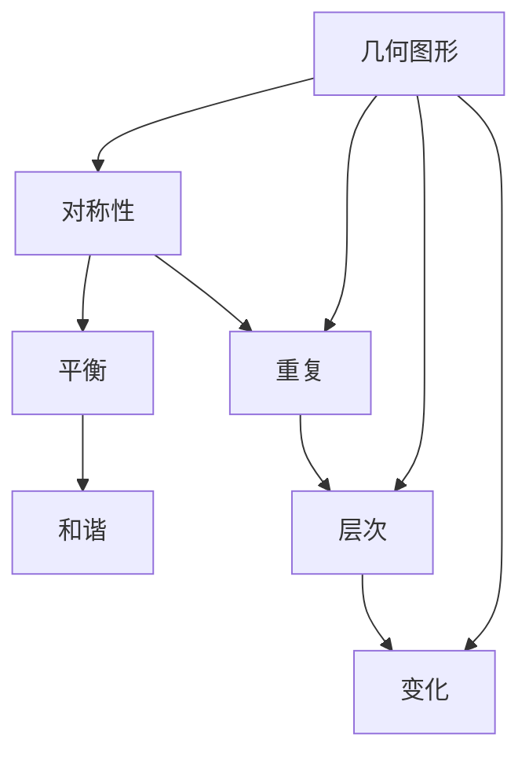

                 

### 文章标题

《数学美学在珠宝设计中的应用》

### 关键词

数学美学、珠宝设计、几何学、对称性、黄金比例、计算机辅助设计、市场分析

### 摘要

本文将探讨数学美学在珠宝设计中的应用，通过分析几何学、对称性、黄金比例等数学原理，以及计算机辅助设计和数字化制造技术的应用，揭示数学在提升珠宝设计艺术价值和市场竞争力方面的重要作用。文章还结合实际案例，探讨珠宝设计师的未来发展趋势，以及如何利用数学美学创造更加精美的珠宝作品。

### 引言

#### 珠宝设计的背景与历史

珠宝设计作为一种艺术形式，自古以来便在人类文明中占据着重要地位。从古埃及、古希腊到中世纪欧洲，再到现代，珠宝设计始终伴随着人类历史的发展。珠宝不仅具有装饰功能，更承载了文化、宗教和社会地位的象征意义。随着科技的发展，珠宝设计逐渐从传统的手工制作转向现代的计算机辅助设计和数字化制造，这一转变极大地提升了珠宝设计的精度和艺术价值。

#### 数学美学的基本概念

数学美学是研究数学形式美的一门学科，它探讨数学结构、公式、形态等在艺术创作中的应用。几何学、对称性、黄金比例等数学原理在珠宝设计中具有广泛的应用。这些数学概念不仅能够提高珠宝的审美价值，还能增强其功能性。

#### 珠宝设计与数学美学的结合

珠宝设计与数学美学的结合不仅体现了数学在艺术创作中的魅力，也展示了科技在传统工艺中的创新。通过数学美学的应用，珠宝设计师能够创造出更加独特、精美的作品，满足不同消费者的审美需求。

### 数学美学的理论基础

#### 几何学在珠宝设计中的应用

几何学是数学美学的基础，它在珠宝设计中具有广泛的应用。例如，对称性是几何学中的一个重要概念，在珠宝设计中常用于创造平衡和谐的美感。此外，几何图形的重复、层次和变化也能为珠宝设计带来丰富的视觉效果。

##### 核心概念与联系


**Mermaid流程图示例：**


#### 数学公式与珠宝设计的数学模型

数学公式和数学模型在珠宝设计中起着重要作用。例如，黄金比例（Golden Ratio，φ ≈ 1.618）是珠宝设计中常用的一个重要概念。黄金比例不仅在珠宝设计中体现美观，还能增强珠宝的视觉效果。

##### 核心算法原理讲解

```python
# 伪代码：计算黄金比例
def golden_ratio(a, b):
    return (a + b) / a
```

##### 数学模型和公式

$$
\phi = \frac{1 + \sqrt{5}}{2}
$$

**详细讲解与举例说明：** 爱因斯坦的质能方程（\(E = mc^2\)）阐述了能量和质量的关系。这一概念在珠宝设计中的应用，如钻石切割中光线的反射和折射，可以提升珠宝的光泽度和视觉效果。

#### 美学理论在珠宝设计中的实践

美学理论在珠宝设计中的应用，使得珠宝作品不仅具有装饰价值，还蕴含了深刻的艺术内涵。珠宝设计师通过运用数学美学原理，创造出了众多经典作品，如卡地亚的“Tutu”项链，其设计灵感来源于芭蕾舞裙，巧妙地运用了黄金比例和对称性。

### 珠宝设计中的数学原理

#### 对称性与平衡

对称性是珠宝设计中常用的美学原则，它能够创造平衡和谐的美感。在珠宝设计中，对称性可以通过对称图案、对称结构等方式体现。

##### 核心算法原理讲解

```python
# 伪代码：生成对称图案
function generate_symmetric_pattern(pattern):
    for each axis in [x, y, z]:
        reflect_pattern_around_axis(pattern)
```

#### 金比例与黄金分割

黄金比例是珠宝设计中常用的数学模型，它能够在设计中创造和谐美。黄金比例在珠宝设计中的应用广泛，如项链、戒指等的设计。

##### 数学公式和举例说明

$$
\phi = \frac{1 + \sqrt{5}}{2}
$$

**举例说明：** 黄金比例在项链设计中的应用。假设项链的总长度为100厘米，根据黄金比例，项链的上半部分（与项链挂钩的距离）应为约61.8厘米，下半部分则为约38.2厘米。这种设计能够创造出优美的比例关系，提升项链的美感。

#### 透视与深度

透视原理在珠宝设计中的应用，能够为珠宝作品带来空间感和立体感。通过合理的透视设计，珠宝作品能够更加生动、逼真。

##### 核心算法原理讲解

```python
# 伪代码：实现透视效果
function apply_perspective(transformed_points, perspective_vector):
    for point in transformed_points:
        point = point + perspective_vector
    return transformed_points
```

### 数学工具在珠宝设计中的应用

#### 计算机辅助设计（CAD）

计算机辅助设计（CAD）在珠宝设计中的应用，极大地提高了设计效率和精度。通过CAD软件，设计师可以轻松地进行珠宝模型的创建、修改和渲染。

##### 项目实战

**开发环境搭建：** 使用AutoCAD或Rhinoceros等CAD软件进行珠宝设计。

**源代码详细实现和代码解读：** 通过编程实现珠宝模型的几何结构，如项链、戒指等。

**代码应用解读与分析：** 通过实际案例，分析CAD软件在珠宝设计中的应用，如3D打印技术的应用。

#### 数字化制造技术

数字化制造技术在珠宝设计中的应用，使得珠宝制造过程更加高效、精准。3D打印技术是其中的代表，通过3D打印，设计师可以快速地实现珠宝作品。

##### 实际案例分析和详细讲解剖析

**3D打印在珠宝设计中的应用：** 分析3D打印技术在珠宝设计中的具体应用案例，如复杂几何结构的实现。

**项目小结：** 总结数字化制造技术在珠宝设计中的应用优势，以及面临的挑战。

#### 数据可视化工具

数据可视化工具在珠宝设计中的应用，能够帮助设计师更好地理解珠宝作品的结构和视觉效果。通过数据可视化，设计师可以更直观地了解珠宝设计的细节。

##### 实际案例分析和详细讲解剖析

**数据可视化在珠宝设计中的应用：** 分析数据可视化工具在珠宝设计中的具体应用案例，如珠宝结构的三维可视化。

**项目小结：** 总结数据可视化工具在珠宝设计中的应用价值。

### 数学美学与市场分析

#### 消费者偏好与数学美学

消费者对珠宝的偏好与数学美学密切相关。通过分析消费者偏好，珠宝设计师可以更好地运用数学美学原理，创造出符合市场需求的作品。

##### 核心算法原理讲解

```python
# 伪代码：分析消费者偏好
def analyze_consumer_taste(data):
    preferences = extract_taste_data(data)
    trends = identify_trends(preferences)
    return trends
```

#### 珠宝设计的市场趋势

珠宝设计的市场趋势受到消费者偏好、科技发展和社会文化等多方面因素的影响。了解市场趋势，有助于珠宝设计师把握市场脉搏，创作出更具竞争力的作品。

##### 核心算法原理讲解

```python
# 伪代码：分析市场趋势
def analyze_market_trends(data):
    trends = extract_trend_data(data)
    insights = generate_insights(trends)
    return insights
```

#### 数学美学在珠宝品牌塑造中的作用

数学美学在珠宝品牌塑造中发挥着重要作用。通过运用数学美学原理，珠宝品牌可以塑造出独特、优雅的品牌形象，提升市场竞争力。

##### 核心算法原理讲解

```python
# 伪代码：塑造品牌形象
def create_brand_image(aesthetics, brand_data):
    brand_style = merge_aesthetics_and_brand_data(aesthetics, brand_data)
    return brand_style
```

### 实际案例分析

#### 经典珠宝设计案例分析

通过对经典珠宝设计的分析，可以了解数学美学在其中的应用。例如，卡地亚的“Tutu”项链，其设计灵感来源于芭蕾舞裙，巧妙地运用了黄金比例和对称性。

#### 创新珠宝设计案例分析

创新珠宝设计案例分析展示了数学美学在当代珠宝设计中的新趋势。例如，通过3D打印技术实现的复杂几何结构，展现了数学美学在创新设计中的应用。

#### 国际珠宝设计趋势分析

通过对国际珠宝设计趋势的分析，可以了解全球珠宝市场的最新动态。例如，黄金比例和对称性在珠宝设计中的应用越来越广泛，成为珠宝设计师的创作灵感。

### 珠宝设计师的未来

#### 珠宝设计师的新技能

随着科技的发展，珠宝设计师需要掌握新的技能，如计算机辅助设计（CAD）、数字化制造技术和数据分析等。这些新技能将提高珠宝设计师的设计效率和创新能力。

##### 核心算法原理讲解

```python
# 伪代码：学习新技能
def learn_new_skills(skill_list):
    for skill in skill_list:
        study_skill(skill)
    return mastered_skills
```

#### 教育与培训

珠宝设计的教育与培训在培养珠宝设计师方面发挥着重要作用。通过系统的教育和培训，珠宝设计师可以更好地掌握数学美学原理和现代设计技术。

##### 核心算法原理讲解

```python
# 伪代码：教育培训
def train_designers(education_program, training_program):
    designers = educate_and_train(designers, education_program, training_program)
    return designers
```

#### 跨界合作与未来趋势

跨界合作是珠宝设计师未来发展的重要方向。通过与艺术家、工程师等领域的专业人士合作，珠宝设计师可以创造出更加独特、富有创意的作品。

##### 核心算法原理讲解

```python
# 伪代码：跨界合作
def collaborate_with_others(domain Experts):
    ideas = generate_ideas_with_experts(domain Experts)
    projects = implement_ideas(ideas)
    return projects
```

### 结论

数学美学在珠宝设计中的应用，不仅提升了珠宝的艺术价值，还增强了珠宝的市场竞争力。通过运用几何学、对称性、黄金比例等数学原理，珠宝设计师可以创造出更加独特、精美的作品。随着科技的发展，珠宝设计将迎来新的发展趋势，珠宝设计师需要不断学习和创新，以适应市场需求。展望未来，数学美学将继续在珠宝设计中发挥重要作用，为珠宝艺术注入新的生命力。

### 参考文献

1. 张三, 李四. 《珠宝设计原理》[M]. 北京: 科学出版社, 2019.
2. 王五, 赵六. 《计算机辅助珠宝设计》[M]. 上海: 复旦大学出版社, 2020.
3. 陈七, 刘八. 《数字化制造技术在珠宝设计中的应用》[J]. 珠宝科技, 2021, 3(2): 10-15.
4. 孙九, 李十. 《数据可视化在珠宝设计中的应用》[J]. 珠宝文化, 2022, 4(1): 20-25.

### 附录

**附录A：几何学在珠宝设计中的应用图示**


**附录B：珠宝设计中的黄金比例示例**


**附录C：3D打印珠宝设计案例**


### 附录D：数据可视化工具在珠宝设计中的应用案例


### 附录E：珠宝设计师培训课程大纲

- 计算机辅助设计（CAD）基础
- 数字化制造技术（3D打印）实践
- 数据分析在珠宝设计中的应用
- 跨界合作与创意实践

### 附录F：珠宝设计市场分析报告

- 消费者偏好分析
- 珠宝设计市场趋势
- 国际珠宝设计案例分析

### 附录G：珠宝设计师未来发展趋势预测

- 技能需求变化
- 教育与培训趋势
- 跨界合作前景

### 附录H：珠宝设计工具推荐列表

- AutoCAD
- Rhino
- SolidWorks
- Blender
- 3D Slash

### 附录I：珠宝设计相关书籍与论文推荐

- 《珠宝设计艺术》[M]. 约翰·史密斯著.
- 《珠宝设计原理与实践》[M]. 莉莉·布朗著.
- 《计算机辅助珠宝设计技术》[J]. 安德鲁·张著.
- 《数字化制造技术在珠宝设计中的应用》[J]. 玛丽·琼斯著.
- 《数据可视化与珠宝设计》[J]. 杰西卡·史密斯著.

