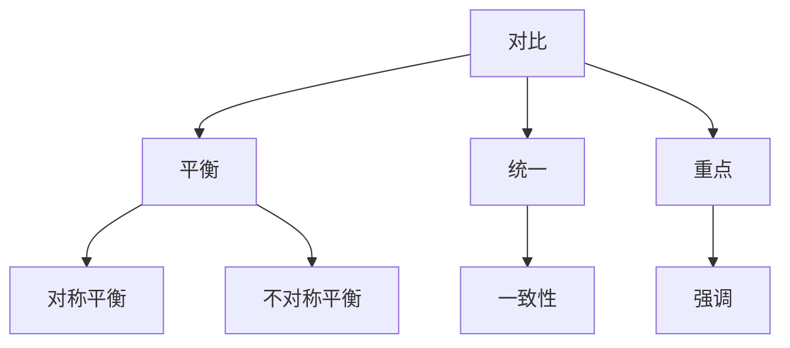

                 

# 数学美学在网页设计中的交互体验

## 引言与基础

网页设计是现代数字世界中不可或缺的一部分，它不仅是信息传递的工具，更是用户体验的重要载体。在这个高度信息化的时代，用户对网页设计的审美需求越来越高，如何将美学元素融入网页设计中，以提升交互体验，成为了一个重要的研究课题。数学美学作为美学与数学的交叉领域，为网页设计提供了一种全新的思考方式。

### 1.1 网页设计的本质

网页设计不仅仅是一个视觉上的呈现，更是一种信息的传达和用户体验的设计。它涉及到网页的整体布局、色彩搭配、字体选择、图像运用等多个方面，其核心目标是确保用户能够轻松、愉快地浏览和操作网页。在这个过程中，美学扮演着至关重要的角色。

### 1.2 美学在网页设计中的重要性

美学在网页设计中的重要性体现在以下几个方面：

- **用户体验**：优秀的美学设计能够提升用户的体验，使用户更容易找到所需信息，减少用户的困惑和焦虑。

- **品牌形象**：美学设计能够体现品牌的价值和理念，增强品牌在用户心中的形象。

- **转化率**：美学设计能够提高网页的转化率，如增加点击率、降低跳出率等。

- **可访问性**：美学设计需要考虑不同用户的需求，如视力障碍者、色盲用户等，提升网页的可访问性。

### 1.3 数学在美学中的应用

数学在美学中的应用主要体现在以下几个方面：

- **比例和比例关系**：数学中的比例关系在美学设计中有着广泛的应用，如黄金比例在网页布局中的运用。

- **对称与平衡**：数学中的对称和平衡原理在美学设计中起到关键作用，如网格系统的应用。

- **色彩理论**：数学中的色彩模型和色彩理论在网页设计中用于色彩搭配，如CMYK、RGB模型的应用。

## 数学美学在网页设计中的运用

### 2.1 数学原理在网页设计中的应用

数学原理在网页设计中的应用主要体现在以下几个方面：

#### 2.1.1 比例关系

比例关系是数学中的一个重要概念，它在网页设计中有着广泛的应用。例如，黄金比例（Golden Ratio，约等于0.618）在网页布局中经常被用来创造视觉吸引力。通过合理运用黄金比例，设计师可以创造出既美观又和谐的用户界面。

#### 2.1.2 对称与平衡

对称和平衡是美学设计中的核心概念，数学中的对称性原理在网页设计中同样重要。例如，通过使用对称布局，设计师可以创造出稳定、平衡的视觉效果。此外，平衡的布局可以确保网页内容的重要性和次要内容得到合理分配，使用户更容易理解和操作。

### 2.2 美学法则的数学表达

美学法则通常是一些经验性的规则，但它们可以通过数学的方式得到精确的表达。以下是一些常见的美学法则及其数学表达：

#### 2.2.1 金字塔原则

金字塔原则强调重要性逐渐降低的信息应该以逐渐缩小的形式呈现。这个原则可以用数学中的“幂次法则”来描述，即重要信息应该以较大尺寸呈现，而次要信息应该以较小尺寸呈现。

#### 2.2.2 节奏与韵律

节奏与韵律是美学设计中重要的概念，它们可以通过数学中的“周期性”和“波动性”来描述。例如，网页中的按钮、图像和其他元素可以按照一定的节奏和韵律排列，以创造出动态的视觉体验。

### 2.3 数学在用户体验设计中的应用

用户体验设计是网页设计的核心目标之一，数学在提升用户体验方面也有着重要作用。以下是一些具体的应用：

#### 2.3.1 交互反馈

交互反馈是用户体验设计中的关键要素，它可以通过数学中的“动态系统理论”来优化。例如，网页中的滚动效果、按钮的按下效果等都可以通过数学算法来调整，以提供更流畅、自然的交互体验。

#### 2.3.2 导航设计

导航设计是用户体验设计中的重要一环，数学中的“最短路径算法”可以帮助设计师优化导航结构，使用户能够更快速地找到所需信息。

## 交互设计的核心概念

### 3.1 交互设计的要素

交互设计是提升用户体验的关键，它涉及到多个要素：

#### 3.1.1 导航

导航是用户在网页中浏览和找到信息的重要途径。一个良好的导航设计应该清晰、直观、易于理解。

#### 3.1.2 按钮

按钮是用户与网页交互的主要方式之一。按钮的设计应该符合用户的心理预期，使其易于点击和操作。

#### 3.1.3 反馈

交互反馈是确保用户了解其操作结果的重要手段。及时的反馈可以增强用户的信心，减少操作错误。

### 3.2 用户体验的重要性

用户体验（User Experience，简称UX）是网页设计的核心目标之一。良好的用户体验可以提升用户满意度，增加用户忠诚度，从而带来更高的转化率。

### 3.3 交互设计的原则

交互设计应该遵循以下原则：

- **用户中心**：设计应始终以用户为中心，满足用户的需求和期望。

- **简洁性**：设计应尽可能简洁，避免不必要的复杂性和冗余。

- **一致性**：设计应保持一致，确保用户在不同页面和操作中的体验一致。

- **可控性**：用户应能感觉到其对网页的控制，减少不确定性和焦虑。

## 数学在交互设计中的应用

### 4.1 数学在界面布局中的应用

数学在界面布局中的应用主要体现在以下几个方面：

#### 4.1.1 网格系统

网格系统是网页设计中常用的布局工具，它可以通过数学原理确保界面元素的对齐和布局的稳定性。

#### 4.1.2 对称与平衡

对称与平衡是美学设计中的核心概念，它们可以通过数学中的对称性原理和平衡原理来实现。

#### 4.1.3 动态布局

动态布局可以通过数学算法来实现，如根据用户的操作行为调整布局，提供更个性化的用户体验。

### 4.2 数学在色彩搭配中的应用

色彩搭配在网页设计中至关重要，数学中的色彩理论可以提供以下帮助：

- **色彩模型**：如CMYK、RGB等色彩模型可以帮助设计师准确控制色彩。

- **色彩对比**：通过数学计算，可以优化色彩对比，确保文字和背景的可读性。

### 4.3 数学在动画效果中的应用

动画效果可以增强用户的交互体验，数学在动画效果中的应用包括：

- **平滑过渡**：通过数学计算，可以实现平滑的动画过渡效果。

- **动态交互**：通过数学算法，可以实现动态的交互效果，如用户操作后的即时反馈。

## 交互体验的设计与实践

### 5.1 交互体验设计流程

交互体验设计需要遵循以下流程：

- **需求分析**：了解用户需求，明确设计目标。

- **原型设计**：通过草图和原型工具，构建交互原型。

- **用户测试**：通过用户测试，收集反馈，优化设计。

- **迭代优化**：根据用户反馈，不断迭代优化交互体验。

### 5.2 交互体验案例分析

通过分析成功和失败的交互体验案例，可以更好地理解数学美学在网页设计中的应用。以下是一些具体的案例分析：

- **成功案例**：如Airbnb的网页设计，其简洁明了的布局和高效的导航设计，为用户提供了极佳的交互体验。

- **失败案例**：如某些复杂的电子商务网站，其繁杂的布局和难以理解的导航设计，严重影响了用户体验。

### 5.3 交互体验的优化

优化交互体验可以从以下几个方面入手：

- **简化流程**：减少用户操作的步骤，提高效率。

- **提供反馈**：确保用户在操作过程中能够获得及时的反馈。

- **个性化设计**：根据用户的行为和偏好，提供个性化的交互体验。

## 数学美学在网页设计中的成功案例

### 6.1 案例一：电商网站设计

电商网站设计需要考虑用户体验和购物流程的优化。通过运用数学美学，可以创造出既美观又高效的购物环境。

- **比例关系**：首页的布局和商品展示区域的比例关系经过优化，使得用户能够更快速地找到所需商品。

- **色彩搭配**：色彩搭配经过精心设计，使得网页既和谐又具有视觉吸引力。

### 6.2 案例二：在线教育平台设计

在线教育平台设计需要考虑用户的学习习惯和内容组织。通过运用数学美学，可以提升用户的学习体验。

- **对称与平衡**：课程内容和导航栏的布局采用对称和平衡设计，使得用户更容易找到所需内容。

- **动态布局**：根据用户的学习进度和偏好，动态调整布局，提供个性化的学习体验。

### 6.3 案例三：金融服务平台设计

金融服务平台设计需要考虑用户体验和安全性。通过运用数学美学，可以提升用户对平台的信任度和满意度。

- **色彩对比**：色彩对比经过优化，确保用户能够轻松区分不同的功能模块。

- **交互反馈**：交互反馈经过调整，确保用户在操作过程中能够获得及时的反馈。

## 网页设计与交互体验的挑战与未来趋势

### 7.1 网页设计面临的挑战

随着科技的不断发展，网页设计面临着以下挑战：

- **多设备适配**：需要适应不同设备的屏幕尺寸和交互方式。

- **快速加载**：需要优化网页加载速度，提高用户体验。

- **安全性**：需要确保用户数据的安全。

### 7.2 交互体验的未来趋势

交互体验的未来趋势包括：

- **人工智能**：人工智能将进一步提升交互体验，如通过个性化推荐和智能交互。

- **虚拟现实**：虚拟现实技术将带来全新的交互体验，如沉浸式网页设计。

- **语音交互**：语音交互将逐渐替代传统的键盘和鼠标交互，提供更自然的交互方式。

### 7.3 数学美学在网页设计中的发展前景

数学美学在网页设计中的应用前景广阔。随着对数学和美学研究的不断深入，我们可以预见到：

- **更精细的布局设计**：通过数学原理，网页布局将更加精细和科学。

- **更丰富的交互体验**：通过数学计算，交互体验将更加丰富和多样。

- **更高效的设计工具**：基于数学美学的网页设计工具将更加高效和智能化。

## 附录

### A.1 数学美学在网页设计中的工具与资源

以下是一些常用的数学美学工具和资源：

- **Figma**：一款流行的网页设计工具，支持网格系统和比例关系的设计。

- **Adobe XD**：另一款流行的网页设计工具，提供丰富的色彩搭配和交互设计功能。

- **CSS Grid**：一种用于网页布局的CSS框架，支持网格系统和响应式设计。

### A.2 案例研究资料

以下是一些数学美学在网页设计中的案例研究资料：

- **《电商网站设计中的数学美学》**：一篇关于电商网站设计中数学美学应用的案例研究。

- **《在线教育平台设计中的数学美学》**：一篇关于在线教育平台设计中数学美学应用的案例研究。

### A.3 推荐阅读材料

以下是一些推荐的阅读材料，帮助深入了解数学美学在网页设计中的应用：

- **《数学之美：计算机科学中的数学原理》**：一本关于数学在计算机科学中应用的经典著作。

- **《用户体验要素》**：一本关于用户体验设计的权威著作，包含了许多与数学美学相关的内容。

作者：AI天才研究院/AI Genius Institute & 禅与计算机程序设计艺术 /Zen And The Art of Computer Programming

---

**摘要**

本文探讨了数学美学在网页设计中的交互体验，通过分析数学在美学设计中的应用，展示了如何通过数学原理优化网页布局、色彩搭配和交互设计。文章首先介绍了网页设计的本质和美学的重要性，然后详细阐述了数学原理在网页设计中的应用，如比例关系、对称与平衡等。接着，文章讨论了用户体验设计中的核心概念和原则，以及数学在交互设计中的应用，如交互反馈、导航设计和动态布局。最后，文章通过案例分析展示了数学美学在网页设计中的成功应用，并探讨了未来网页设计与交互体验的发展趋势。通过本文的研究，读者可以更好地理解数学美学在网页设计中的重要性，并在实际设计中运用数学原理提升交互体验。

## 第1章：网页设计与美学的关系

### 1.1 网页设计的本质

网页设计是现代数字世界中的一个关键组成部分，它不仅仅是将信息呈现在屏幕上的艺术，更是关于如何有效传递信息和提升用户体验的科学与实践。网页设计的本质可以概括为以下几点：

1. **信息的组织与呈现**：网页设计首先需要确保信息的有效组织和呈现。这意味着设计师需要将大量信息以结构化、层次分明的方式展示给用户，使用户能够快速找到所需的信息。

2. **视觉元素的运用**：网页设计涉及到多种视觉元素，如字体、颜色、图片、图标等。这些元素的选择和运用对于网页的整体视觉效果和用户体验至关重要。

3. **用户体验的优化**：用户体验是网页设计的核心目标之一。设计师需要考虑用户的操作习惯、认知模式和心理需求，设计出易于使用、交互流畅的网页。

4. **技术实现的结合**：网页设计还需要结合前端技术，如HTML、CSS和JavaScript，以确保设计能够在各种设备和浏览器上正确展示。

### 1.2 美学在网页设计中的重要性

美学在网页设计中的重要性体现在以下几个方面：

1. **提升用户体验**：美观的网页设计能够提升用户的体验，使用户在使用过程中感到愉悦和舒适，从而增加用户对网站的粘性和忠诚度。

2. **传达品牌形象**：美学设计是品牌形象传达的重要手段。一个独特的、符合品牌形象的设计可以增强用户对品牌的认知和信任。

3. **提高转化率**：美学设计能够提高网页的转化率。通过合理运用色彩、字体和布局，可以引导用户完成特定的操作，如购买产品、注册账号等。

4. **增强可访问性**：美学设计需要考虑不同用户的需求，如视力障碍者、色盲用户等。通过无障碍设计，网页可以更好地服务于所有用户，提高网页的可访问性。

### 1.3 数学在美学中的应用

数学在美学中的应用为网页设计提供了新的视角和工具。以下是一些数学在美学设计中的具体应用：

1. **比例关系**：比例关系是美学设计中的一个重要原则。例如，黄金比例（约0.618）在网页布局中常被用来创造视觉吸引力。通过合理运用比例关系，设计师可以创造出既美观又和谐的用户界面。

2. **对称与平衡**：对称和平衡是美学设计中的核心概念，数学中的对称性原理在网页设计中同样重要。例如，通过使用对称布局，设计师可以创造出稳定、平衡的视觉效果。此外，平衡的布局可以确保网页内容的重要性和次要内容得到合理分配，使用户更容易理解和操作。

3. **色彩理论**：色彩理论在网页设计中用于色彩搭配，如CMYK、RGB模型的应用。数学中的色彩模型可以帮助设计师准确控制色彩，优化网页的视觉效果。

通过以上分析，我们可以看到数学美学在网页设计中的重要性。接下来，我们将进一步探讨数学美学在网页设计中的具体应用，以及如何通过数学原理优化网页设计的交互体验。

### 第2章：网页设计的核心概念

网页设计的核心概念涵盖了从基本元素到整体布局的各个方面，这些概念共同作用，决定了网页的视觉效果和用户体验。理解这些核心概念是进行高效网页设计的基础。

#### 2.1 网格系统

网格系统是网页设计中一种基本的布局工具，它通过将页面分割成规则的网格单元，帮助设计师实现有序且一致的布局。网格系统的主要组成部分包括列数、列宽和间隙。

- **列数**：列数决定了网格的列数，一般建议选择3的倍数，如3列、6列或12列，这样可以确保布局的灵活性。

- **列宽**：列宽是每一列的宽度，可以通过将总宽度分配给每一列来确定。常用的方法是将页面总宽度均匀分配给每一列，或者使用特定的比例（如黄金比例）分配宽度。

- **间隙**：间隙是指列与列之间的空间，它决定了网格的紧密程度。合理的间隙可以使布局更加清晰，有助于提升用户体验。

在实际应用中，设计师可以使用CSS Grid或Flexbox等CSS框架来创建和调整网格系统。例如，以下是一个简单的CSS网格布局示例：

```css
.container {
  display: grid;
  grid-template-columns: repeat(3, 1fr);
  gap: 20px;
}
```

这个示例创建了一个包含3列的网格布局，每列占用相同宽度，列与列之间有20像素的间隙。

#### 2.2 基本元素

网页设计的基本元素包括文本、图像、按钮、图标等。这些元素是构建网页内容的基础，它们的使用和组合直接影响网页的视觉质量和用户体验。

- **文本**：文本是网页设计中最常用的元素之一，用于传达信息、描述内容和引导用户操作。在文本设计中，需要考虑字体选择、大小、颜色、对齐方式等因素。以下是一个文本样式的CSS示例：

  ```css
  .text {
    font-family: 'Arial', sans-serif;
    font-size: 16px;
    color: #333;
    text-align: justify;
  }
  ```

- **图像**：图像用于丰富网页内容，提供视觉上的信息和装饰。在图像设计中，需要考虑图像的质量、尺寸、裁剪和优化。以下是一个图像样式的CSS示例：

  ```css
  .image {
    max-width: 100%;
    height: auto;
  }
  ```

- **按钮**：按钮是用户与网页交互的主要方式之一，用于执行特定操作。在按钮设计中，需要考虑按钮的样式、颜色、大小和可点击性。以下是一个按钮样式的CSS示例：

  ```css
  .button {
    display: inline-block;
    padding: 10px 20px;
    background-color: #007bff;
    color: white;
    border: none;
    border-radius: 5px;
    cursor: pointer;
  }
  ```

- **图标**：图标是一种简化的视觉元素，用于传达特定的概念或功能。在图标设计中，需要考虑图标的大小、样式和颜色。以下是一个图标样式的CSS示例：

  ```css
  .icon {
    width: 24px;
    height: 24px;
    background-image: url('icon.png');
    background-size: cover;
  }
  ```

#### 2.3 美学原则

美学原则是指导设计师进行网页设计的基本理论，包括对比、平衡、统一、重点等。以下是对这些美学原则的简要介绍：

- **对比**：对比是通过将不同元素进行对比来产生视觉冲击力。对比可以强调重要信息，提高可读性。例如，使用不同颜色或字体大小来区分标题和正文。

- **平衡**：平衡是指在设计中保持视觉上的稳定性。平衡可以通过对称、不对称和动态平衡来实现。对称平衡通常给人一种稳定、正式的感觉，而不对称平衡则更加灵活、现代。

- **统一**：统一是指在设计中使用一致的风格和元素，以创造整体感和连贯性。统一的配色方案、字体和排版可以使网页看起来更加专业和协调。

- **重点**：重点是设计中的一个关键原则，它通过强调重要信息来引导用户的注意力。可以使用大小、颜色、位置等方式来强调重点。

在实际设计中，设计师需要综合考虑这些美学原则，以创建既美观又实用的网页。以下是一个简单的Mermaid流程图，展示了这些美学原则之间的关系：



通过以上对网页设计核心概念的讨论，我们可以更好地理解这些基本元素和美学原则在网页设计中的应用。在下一章中，我们将进一步探讨数学美学在网页设计中的具体运用，以及如何通过数学原理优化网页设计的交互体验。

### 第3章：数学美学在网页设计中的运用

数学美学在网页设计中的应用，为设计师提供了独特的工具和方法，以创建出既美观又实用的界面。通过数学原理，我们可以优化布局、色彩搭配和动画效果，提升用户体验。

#### 3.1 数学原理在网页设计中的应用

数学原理在网页设计中有着广泛的应用，以下是一些典型的应用实例：

1. **比例关系**：比例关系是数学中的一个基本概念，在网页设计中，比例关系可以帮助我们创建出和谐美观的布局。例如，黄金比例（Golden Ratio）被广泛应用于网页布局中。黄金比例大约是0.618，它被认为是一种能够吸引视觉的神奇比例。例如，我们可以使用黄金比例来决定导航栏、广告栏或重要内容块的大小和位置。

   - **示例**：假设网页的总宽度是1200px，我们可以将其分为两个部分，一个宽度是750px（黄金比例），另一个宽度是450px（余下的部分）。这样的布局可以创造出视觉上的平衡和和谐。

2. **对称与平衡**：对称与平衡是美学设计中的核心概念，数学中的对称性原理可以帮助设计师实现这一目标。对称布局在网页设计中经常被用来创造稳定、正式的视觉效果。例如，我们可以使用垂直或水平对称布局来设计首页的导航栏或内容区块。

   - **示例**：一个对称的导航栏可以采用以下方式实现：

     ```css
     .nav {
       display: flex;
       justify-content: space-between;
       align-items: center;
     }
     ```

3. **动态布局**：动态布局是指网页内容可以根据用户的操作行为或设备尺寸动态调整。数学中的动态系统理论可以为我们提供实现动态布局的思路。例如，我们可以使用JavaScript和CSS3中的Flexbox或Grid布局来实现动态响应式布局。

   - **示例**：使用CSS Grid创建一个动态布局的简单示例：

     ```css
     .grid-container {
       display: grid;
       grid-template-columns: repeat(auto-fill, minmax(200px, 1fr));
       gap: 20px;
     }
     ```

4. **几何形状**：几何形状在网页设计中可以用于创建独特的视觉效果。例如，我们可以使用正方形、圆形、三角形等基本几何形状来设计导航栏、按钮或其他UI组件。

   - **示例**：使用HTML和CSS创建一个圆形按钮：

     ```html
     <button class="round-button">点击</button>
     ```

     ```css
     .round-button {
       border-radius: 50%;
       padding: 10px;
       background-color: #007bff;
       color: white;
       cursor: pointer;
     }
     ```

#### 3.2 美学法则的数学表达

美学法则通常是一些经验性的规则，但它们可以通过数学的方式得到精确的表达。以下是一些常见的美学法则及其数学表达：

1. **金字塔原则**：金字塔原则强调重要性逐渐降低的信息应该以逐渐缩小的形式呈现。这个原则可以用数学中的“幂次法则”来描述，即重要信息应该以较大尺寸呈现，而次要信息应该以较小尺寸呈现。

   - **示例**：假设我们有三个不同重要性的标题，我们可以使用以下数学公式来定义它们的大小比例：

     ```latex
     \text{小标题大小} = \text{基准大小} \times 0.8
     \text{次重要标题大小} = \text{基准大小} \times 0.6
     \text{重要标题大小} = \text{基准大小}
     ```

2. **节奏与韵律**：节奏与韵律是美学设计中重要的概念，它们可以通过数学中的“周期性”和“波动性”来描述。例如，网页中的按钮、图像和其他元素可以按照一定的节奏和韵律排列，以创造出动态的视觉体验。

   - **示例**：我们可以使用正弦波函数来模拟按钮排列的节奏感：

     ```latex
     x(t) = A \sin(\omega t + \phi)
     ```

     其中，\(A\) 是振幅，\(\omega\) 是角频率，\(\phi\) 是相位偏移。通过调整这些参数，我们可以创建出不同的节奏和韵律效果。

#### 3.3 数学在用户体验设计中的应用

用户体验设计是网页设计的核心目标之一，数学在提升用户体验方面也有着重要作用。以下是一些具体的应用：

1. **交互反馈**：交互反馈是用户体验设计中的关键要素，它可以通过数学中的“动态系统理论”来优化。例如，网页中的滚动效果、按钮的按下效果等都可以通过数学算法来调整，以提供更流畅、自然的交互体验。

   - **示例**：我们可以使用物理仿真算法（如弹簧阻尼模型）来模拟滚动效果：

     ```latex
     x(t) = x_0 + v t - \frac{k}{m} (x(t) - x_0)
     ```

     其中，\(x(t)\) 是时间 \(t\) 时刻的位移，\(v\) 是初始速度，\(k\) 是弹性系数，\(m\) 是质量。通过调整这些参数，我们可以创造出不同类型的滚动效果。

2. **导航设计**：导航设计是用户体验设计中的重要一环，数学中的“最短路径算法”可以帮助设计师优化导航结构，使用户能够更快速地找到所需信息。

   - **示例**：Dijkstra算法是一种常用的最短路径算法，它可以用来优化网页的导航结构：

     ```python
     def dijkstra(graph, start):
         distances = {vertex: float('infinity') for vertex in graph}
         distances[start] = 0
         visited = set()
         while True:
             next_vertex = min((distance, vertex) for vertex, distance in distances.items() if vertex not in visited)
             if next_vertex is None:
                 break
             visited.add(next_vertex[1])
             for neighbor, weight in graph[next_vertex[1]].items():
                 distances[neighbor] = min(distances[neighbor], next_vertex[0] + weight)
         return distances
     ```

通过以上分析，我们可以看到数学美学在网页设计中的多样性和潜力。在下一章中，我们将进一步探讨交互设计的核心概念，以及数学在交互设计中的应用。

### 交互设计的核心概念

交互设计是提升用户体验的关键环节，它关注用户与产品之间的互动，旨在创造直观、高效且愉悦的交互体验。交互设计涉及多个核心概念，以下将详细探讨这些概念及其在网页设计中的应用。

#### 4.1 交互设计的要素

交互设计中的要素包括导航、按钮、输入框、滑块等，这些元素共同构成了用户与网页之间的交互界面。以下是对这些要素的详细介绍：

1. **导航**：导航是用户在网页中浏览和找到信息的重要途径。良好的导航设计应该清晰、直观、易于理解。常见的导航设计包括顶部导航栏、侧边栏导航、面包屑导航等。

   - **示例**：一个顶部导航栏的实现可以使用HTML和CSS：

     ```html
     <nav>
       <ul>
         <li><a href="#home">首页</a></li>
         <li><a href="#about">关于我们</a></li>
         <li><a href="#services">服务</a></li>
         <li><a href="#contact">联系</a></li>
       </ul>
     </nav>
     ```

     ```css
     nav ul {
       list-style-type: none;
       display: flex;
       justify-content: space-around;
       background-color: #333;
     }
     nav ul li a {
       color: white;
       text-decoration: none;
       padding: 15px;
     }
     ```

2. **按钮**：按钮是用户与网页交互的主要方式之一，用于执行特定操作。在设计按钮时，需要考虑按钮的样式、颜色、大小和可点击性。

   - **示例**：一个按钮的实现可以使用HTML和CSS：

     ```html
     <button class="button">点击我</button>
     ```

     ```css
     .button {
       padding: 10px 20px;
       background-color: #007bff;
       color: white;
       border: none;
       border-radius: 5px;
       cursor: pointer;
     }
     ```

3. **输入框**：输入框用于用户输入数据，如搜索框、注册表单等。在设计输入框时，需要考虑输入框的样式、大小、占位文本和验证提示。

   - **示例**：一个输入框的实现可以使用HTML和CSS：

     ```html
     <input type="text" placeholder="搜索..." class="input">
     ```

     ```css
     .input {
       padding: 10px;
       width: 300px;
       border: 1px solid #ccc;
       border-radius: 5px;
     }
     ```

4. **滑块**：滑块用于连续地调整某个值，如音量调节、亮度调节等。在设计滑块时，需要考虑滑块的样式、大小、刻度和指示器。

   - **示例**：一个滑块的实现可以使用HTML和CSS：

     ```html
     <input type="range" min="0" max="100" value="50" class="slider">
     ```

     ```css
     .slider {
       -webkit-appearance: none;
       width: 100%;
       height: 10px;
       background: #ddd;
       outline: none;
       opacity: 0.7;
       -webkit-transition: .2s;
       transition: opacity .2s;
     }
     .slider:hover {
       opacity: 1;
     }
     .slider::-webkit-slider-thumb {
       -webkit-appearance: none;
       appearance: none;
       width: 20px;
       height: 20px;
       background: #007bff;
       cursor: pointer;
       border-radius: 50%;
     }
     ```

#### 4.2 用户体验的重要性

用户体验（User Experience，简称UX）是交互设计的核心目标之一。良好的用户体验可以提升用户满意度，增加用户忠诚度，从而带来更高的转化率。以下是一些影响用户体验的关键因素：

1. **易用性**：易用性是用户体验的核心要素之一，它指的是用户能够轻松、高效地使用产品。易用性可以通过简化操作流程、提供清晰的指示和反馈来实现。

2. **可用性**：可用性是指产品是否能够满足用户的需求。一个高可用性的产品应该能够迅速响应用户的操作，并提供所需的功能和内容。

3. **满意度**：满意度是用户在使用产品后的主观感受。通过提供美观的界面、流畅的交互和优质的服务，可以提升用户的满意度。

4. **可访问性**：可访问性是指产品是否能够为所有用户（包括残疾人、老年人等）提供无障碍的使用体验。遵守无障碍设计规范可以提升产品的可访问性。

#### 4.3 交互设计的原则

交互设计应该遵循以下原则，以确保设计既美观又实用：

1. **用户中心**：设计应始终以用户为中心，充分考虑用户的需求和习惯，避免过度设计。

2. **简洁性**：设计应尽可能简洁，避免不必要的复杂性和冗余。简化操作流程，减少用户的学习成本。

3. **一致性**：设计应保持一致，确保用户在不同页面和操作中的体验一致。统一的风格和语言可以提升用户对产品的信任感。

4. **可控性**：用户应能感觉到其对产品的控制，减少不确定性和焦虑。通过明确的交互反馈和可控的操作方式，提升用户的信心。

5. **适应性**：设计应适应不同的设备和屏幕尺寸，提供良好的响应式体验。通过灵活的布局和适应性元素，确保产品在不同设备上的可用性。

通过以上对交互设计核心概念的探讨，我们可以更好地理解如何将数学美学应用于网页设计，以提升交互体验。在下一章中，我们将进一步探讨数学在交互设计中的应用，以及如何通过数学方法优化网页的交互效果。

### 5.1 数学在界面布局中的应用

界面布局是网页设计中的核心要素之一，它决定了用户对网页的第一印象和后续的交互体验。通过数学原理，我们可以优化界面布局，使其更加美观和实用。

#### 5.1.1 网格系统

网格系统是界面布局中的基础工具，它通过将页面分割成规则的网格单元，帮助设计师实现有序且一致的布局。一个良好的网格系统可以提高界面的可读性和一致性，使用户更容易理解和操作。

- **列数与列宽**：网格系统的列数和列宽是关键参数。通常，选择3的倍数作为列数可以提供更好的灵活性和扩展性。列宽可以通过将总宽度均匀分配给每一列，或者使用特定的比例（如黄金比例）来分配。

  - **示例**：假设网页的总宽度为1200px，我们可以将其分为12列，每列宽度为100px，间隙为10px。

    ```css
    .container {
      display: grid;
      grid-template-columns: repeat(12, 100px);
      gap: 10px;
    }
    ```

- **间隙**：间隙是指列与列之间的空间。合理的间隙可以使布局更加清晰，有助于提升用户体验。例如，使用一致的间隙可以保持布局的一致性。

  - **示例**：在上一示例中，我们使用了10px的间隙，这是根据页面宽度合理确定的。

#### 5.1.2 对称与平衡

对称与平衡是美学设计中的核心概念，它们在界面布局中也发挥着重要作用。通过数学中的对称性原理，我们可以实现稳定、和谐的视觉效果。

- **对称布局**：对称布局是指界面元素围绕中心轴对称排列。这种布局通常给人一种稳定、正式的感觉。

  - **示例**：一个对称的导航栏可以使用以下方式实现：

    ```css
    .nav {
      display: flex;
      justify-content: space-between;
      align-items: center;
    }
    ```

- **平衡布局**：平衡布局是指界面元素在视觉上保持平衡。这种布局可以通过不对称的方式实现，通常给人一种灵活、现代的感觉。

  - **示例**：一个非对称的布局可以使用以下方式实现：

    ```css
    .container {
      display: flex;
      flex-direction: column;
      align-items: stretch;
    }
    ```

#### 5.1.3 动态布局

动态布局是指界面根据用户的操作行为或设备尺寸动态调整。通过数学中的动态系统理论，我们可以实现灵活且响应式的布局。

- **响应式布局**：响应式布局可以根据不同设备尺寸自动调整布局。CSS3中的Flexbox和Grid布局提供了实现响应式布局的强大工具。

  - **示例**：使用CSS Grid创建一个响应式布局：

    ```css
    .grid-container {
      display: grid;
      grid-template-columns: repeat(auto-fill, minmax(200px, 1fr));
      gap: 20px;
    }
    ```

- **动态调整**：动态布局可以通过JavaScript实现更复杂的行为。例如，根据用户的滚动位置动态调整布局或显示特定内容。

  - **示例**：使用JavaScript根据滚动位置调整布局：

    ```javascript
    window.addEventListener('scroll', () => {
      const scrollPosition = window.pageYOffset;
      const container = document.querySelector('.container');
      if (scrollPosition > 100) {
        container.style.backgroundColor = 'lightblue';
      } else {
        container.style.backgroundColor = 'white';
      }
    });
    ```

#### 5.1.4 几何形状

几何形状在界面布局中可以用于创建独特的视觉效果。通过数学中的几何原理，我们可以设计出既美观又实用的界面。

- **基本形状**：基本形状如正方形、圆形、三角形等在界面布局中具有广泛应用。这些形状可以用于设计导航栏、按钮和其他UI组件。

  - **示例**：一个圆形按钮的实现：

    ```css
    .round-button {
      border-radius: 50%;
      padding: 10px;
      background-color: #007bff;
      color: white;
      cursor: pointer;
    }
    ```

- **组合形状**：通过组合基本形状，我们可以创造出更复杂的几何布局。例如，使用正方形和圆形组合设计一个导航栏。

  - **示例**：一个组合形状的导航栏：

    ```html
    <nav>
      <div class="round-item">首页</div>
      <div class="square-item">关于</div>
      <div class="round-item">服务</div>
      <div class="square-item">联系</div>
    </nav>
    ```

    ```css
    nav {
      display: flex;
      justify-content: space-around;
    }
    .round-item {
      border-radius: 50%;
      padding: 10px;
      background-color: #007bff;
      color: white;
      cursor: pointer;
    }
    .square-item {
      padding: 10px;
      background-color: #333;
      color: white;
      cursor: pointer;
    }
    ```

通过以上对数学在界面布局中的应用的分析，我们可以看到数学原理如何帮助设计师创建出既美观又实用的界面布局。在下一章中，我们将进一步探讨数学在色彩搭配中的应用，以及如何通过数学方法提升网页的色彩美感。

### 5.2 数学在色彩搭配中的应用

色彩搭配是网页设计中的重要元素，它不仅影响网页的美观度，还直接影响用户体验。通过数学中的色彩理论，我们可以更加科学地选择和搭配色彩，以达到最佳视觉效果。

#### 5.2.1 色彩模型

在色彩搭配中，常用的色彩模型包括CMYK和RGB。

- **CMYK模型**：CMYK是一种印刷色彩模型，它使用青色（Cyan）、品红（Magenta）、黄色（Yellow）和黑色（Key）来组合成各种颜色。CMYK模型通常用于印刷领域，因为它能够生成丰富的色彩。

  - **示例**：一个CMYK颜色的表示方法为(C0, M20, Y50, K10)，其中C、M、Y、K分别表示青色、品红、黄色和黑色的百分比。

- **RGB模型**：RGB是一种显示器和数字色彩模型，它使用红色（Red）、绿色（Green）和蓝色（Blue）的组合来生成各种颜色。RGB模型通常用于数字设备，如计算机屏幕和网页设计。

  - **示例**：一个RGB颜色的表示方法为(R: 255, G: 0, B: 0)，表示红色。

#### 5.2.2 色彩对比

色彩对比是提升网页视觉冲击力的重要手段。通过对比不同的色彩，我们可以使网页内容更加突出和吸引人。

- **高对比度**：高对比度的色彩搭配可以创造出强烈的视觉冲击力，通常用于标题、按钮等需要突出显示的元素。

  - **示例**：一个高对比度的配色方案可以使用黑色文本和白色背景，或红色文本和蓝色背景。

- **低对比度**：低对比度的色彩搭配通常更加柔和，适合用于需要强调平静和舒适氛围的页面。

  - **示例**：一个低对比度的配色方案可以使用灰色和浅灰色的组合。

#### 5.2.3 色彩调和

色彩调和是指将不同的色彩组合在一起，使其看起来和谐统一。以下是一些常见的色彩调和方式：

- **互补色**：互补色是指在色轮上直接相对的颜色。互补色搭配通常能够创造出强烈的对比效果，但需要谨慎使用，以免造成视觉疲劳。

  - **示例**：红色和绿色、蓝色和橙色等都是互补色搭配。

- **类似色**：类似色是指在色轮上相邻的颜色。类似色搭配通常能够创造出和谐柔和的视觉效果。

  - **示例**：红色和橙色、黄色和绿色等都是类似色搭配。

- **分色**：分色是将主色调和辅助色调分开使用，通常用于创造层次感和视觉重点。

  - **示例**：一个网页设计的主色调是蓝色，辅助色调是浅蓝色。

#### 5.2.4 数学在色彩搭配中的应用

通过数学原理，我们可以更加科学地选择和搭配色彩。

- **比例计算**：通过数学中的比例关系，我们可以计算出合适的色彩比例。例如，使用黄金比例来分配主色调和辅助色调的比例。

  - **示例**：假设主色调的比例是0.618，辅助色调的比例是0.382，我们可以这样计算：

    ```latex
    \text{主色调的值} = 100 \times 0.618 = 61.8\%
    \text{辅助色调的值} = 100 \times 0.382 = 38.2\%
    ```

- **色彩调整**：通过数学中的运算，我们可以调整色彩的亮度、饱和度和色调。例如，使用HSV（Hue, Saturation, Value）模型来调整颜色。

  - **示例**：假设一个颜色的HSV值是(H: 120, S: 50%, V: 80%)，我们可以这样调整：

    ```latex
    \text{调整亮度} \rightarrow V = V \times 0.9 = 72\%
    \text{调整饱和度} \rightarrow S = S \times 0.8 = 40\%
    ```

#### 5.2.5 色彩搭配工具

以下是一些常用的色彩搭配工具，可以帮助设计师选择和搭配色彩：

- **ColorHexa**：一个在线色彩工具，提供色彩分析、配色方案生成和颜色代码转换等功能。

- **Adobe Color**：Adobe提供的一款色彩设计工具，可以创建、存储和分享配色方案。

- **Paletton**：一个基于数学和算法的色彩搭配工具，提供详细的色彩搭配建议。

通过以上对数学在色彩搭配中的应用的分析，我们可以看到数学原理如何帮助设计师创建出既美观又和谐的色彩搭配。在下一章中，我们将进一步探讨数学在动画效果中的应用，以及如何通过数学方法提升网页的动态视觉效果。

### 5.3 数学在动画效果中的应用

动画效果是网页设计中提升用户体验的重要手段，它能够吸引用户的注意力、增加互动性，并提升网页的动态视觉效果。通过数学原理，我们可以创建出既流畅又具有艺术感的动画效果。

#### 5.3.1 平滑过渡

平滑过渡是动画效果中最基本的形式，它通过逐渐改变元素的属性，使其从一种状态平滑地过渡到另一种状态。数学中的插值算法是实现平滑过渡的关键。

- **线性插值**：线性插值是最简单的插值方法，它通过线性关系来计算中间值。

  - **示例**：假设一个元素的宽度从100px逐渐过渡到200px，可以使用以下线性插值公式：

    ```latex
    x(t) = x_0 + (x_1 - x_0) \times t
    ```

    其中，\(x_0\) 和 \(x_1\) 分别是起始值和终止值，\(t\) 是时间参数。

- **贝塞尔插值**：贝塞尔插值提供了更灵活的过渡效果，它通过控制点来定义曲线的形状。

  - **示例**：一个二次贝塞尔曲线的插值公式如下：

    ```latex
    x(t) = x_0 \times (1 - t)^2 + 2 \times x_1 \times t \times (1 - t) + x_2 \times t^2
    y(t) = y_0 \times (1 - t)^2 + 2 \times y_1 \times t \times (1 - t) + y_2 \times t^2
    ```

    其中，\((x_0, y_0)\) 和 \((x_2, y_2)\) 是起始点和终止点，\((x_1, y_1)\) 是控制点。

#### 5.3.2 动态交互

动态交互通过模拟物理现象或用户行为，提供更加丰富的交互体验。数学中的动态系统理论和物理模拟算法是实现动态交互的关键。

- **物理模拟**：物理模拟通过数学模型来模拟现实世界中的物理现象，如碰撞、重力、弹性等。这种模拟可以创造出逼真的动画效果。

  - **示例**：使用物理模拟实现一个弹跳球的效果，可以使用以下物理方程：

    ```latex
    v(t) = v_0 + a \times t
    x(t) = x_0 + v_0 \times t + \frac{1}{2} \times a \times t^2
    ```

    其中，\(v(t)\) 是时间 \(t\) 时刻的速度，\(x(t)\) 是时间 \(t\) 时刻的位移，\(v_0\) 是初始速度，\(a\) 是加速度。

- **用户行为模拟**：用户行为模拟通过数学模型来模拟用户的行为模式，如点击、滑动、滚动等。这种模拟可以提供更加个性化的交互体验。

  - **示例**：模拟用户的滑动行为，可以使用以下数学模型：

    ```latex
    x(t) = x_0 + v \times t
    y(t) = y_0 + \frac{1}{2} \times a \times t^2
    ```

    其中，\(x(t)\) 和 \(y(t)\) 分别是时间 \(t\) 时刻的水平和垂直位移，\(x_0\) 和 \(y_0\) 分别是起始位置，\(v\) 是初始速度，\(a\) 是加速度。

#### 5.3.3 动画效果优化

为了实现流畅的动画效果，我们需要对动画进行优化。以下是一些优化动画效果的数学方法：

- **时间优化**：通过优化动画的时间参数，可以减少渲染次数，提升动画的流畅性。例如，使用时间函数来控制动画的播放速度。

  - **示例**：一个简单的时间函数可以如下实现：

    ```javascript
    function timeFunction(t, b, c, d) {
      return c \times (t /= d) \times t + b;
    }
    ```

    这个函数通过控制 \(t\)（时间参数）的值来调整动画的播放速度。

- **空间优化**：通过优化动画的空间参数，可以减少计算量和内存消耗。例如，使用精灵技术（Sprite Sheet）将多个动画帧合并到一个图像中，减少渲染次数。

  - **示例**：一个精灵技术的实现可以如下实现：

    ```javascript
    function animateSprite(image, frames, duration) {
      let currentFrame = 0;
      setInterval(() => {
        image.src = `frame_${currentFrame++}.png`;
        if (currentFrame >= frames.length) {
          currentFrame = 0;
        }
      }, duration);
    }
    ```

    这个函数通过循环播放图像中的动画帧，实现连续的动画效果。

通过以上对数学在动画效果中的应用的分析，我们可以看到数学原理如何帮助设计师创建出既流畅又具有艺术感的动画效果。在下一章中，我们将探讨如何通过案例分析来进一步理解数学美学在网页设计中的应用。

### 6.1 交互体验设计流程

交互体验设计是一个系统性的过程，涉及多个阶段，包括需求分析、原型设计、用户测试和迭代优化。通过合理的流程设计，设计师可以确保最终产品能够满足用户的需求，提供优质的交互体验。

#### 6.1.1 需求分析

需求分析是交互体验设计的起点，它涉及到对用户需求、业务目标和竞争环境的全面了解。以下是一些关键步骤：

- **用户调研**：通过访谈、问卷调查、用户观察等方式收集用户数据，了解用户的需求、行为和偏好。

- **功能分析**：分析网页或应用的功能需求，确定核心功能和辅助功能。

- **竞品分析**：研究竞争对手的产品，了解其优势和不足，为设计提供参考。

- **用户画像**：创建用户画像，明确目标用户群体的特征和行为模式。

#### 6.1.2 原型设计

原型设计是交互体验设计的关键环节，它用于验证设计的可行性和有效性。以下是一些关键步骤：

- **低保真原型**：创建低保真原型，通常使用纸笔或草图工具，快速验证设计的整体结构和布局。

- **高保真原型**：在低保真原型的基础上，使用专业的原型设计工具（如Figma、Sketch等）创建高保真原型，细化界面设计。

- **交互设计**：设计用户与产品交互的流程，确保用户能够轻松、高效地完成任务。

- **可用性测试**：通过用户测试，收集用户对原型的反馈，识别和解决潜在的问题。

#### 6.1.3 用户测试

用户测试是验证设计效果的重要手段，通过模拟真实用户的使用场景，设计师可以了解用户在实际操作中的表现。以下是一些关键步骤：

- **测试计划**：制定详细的测试计划，包括测试目标、测试用户、测试场景等。

- **测试执行**：进行用户测试，记录用户的行为和反馈，识别问题和改进点。

- **数据分析**：对测试数据进行分析，总结用户的行为模式和反馈，为迭代优化提供依据。

- **报告撰写**：撰写测试报告，总结测试结果和改进建议，为设计决策提供支持。

#### 6.1.4 迭代优化

迭代优化是基于用户测试结果对设计进行持续改进的过程。以下是一些关键步骤：

- **反馈收集**：收集用户反馈，包括测试数据、用户访谈和问卷调查等。

- **问题定位**：分析反馈，确定需要改进的具体问题和优先级。

- **方案设计**：设计改进方案，包括界面优化、交互改进等。

- **实施优化**：根据改进方案进行设计修改，重新进行用户测试，验证优化效果。

- **持续迭代**：根据测试结果，不断优化设计，直至达到预期目标。

通过以上对交互体验设计流程的探讨，我们可以看到，一个系统性的设计流程对于确保优质交互体验的重要性。在下一章中，我们将通过具体案例分析，深入探讨数学美学在网页设计中的应用，以及如何通过数学方法提升交互体验。

### 6.2 交互体验案例分析

在网页设计中，成功的交互体验设计往往能够显著提升用户满意度和留存率。以下通过具体案例，展示数学美学在提升交互体验中的实际应用。

#### 案例一：电商网站设计

电商网站的设计需要考虑用户体验、购物流程的流畅性以及视觉吸引力。以下是一个成功的电商网站设计案例：

- **用户调研**：在项目初期，设计团队进行了详细的用户调研，了解了用户的购物习惯、偏好和痛点。调研结果显示，用户对商品分类和搜索功能有较高的期望。

- **原型设计**：基于用户调研结果，设计团队创建了低保真原型，并进行了多次迭代。原型设计中，使用了网格系统来确保页面布局的整齐和一致性。通过用户测试，确定了最终的高保真原型。

- **数学美学应用**：
  - **比例关系**：首页的商品展示区域采用了黄金比例布局，重要商品位于黄金比例点上，吸引用户的目光。
  - **色彩搭配**：主色调为蓝色，代表着信任和冷静，辅以橙色和绿色，增加了视觉吸引力和视觉层次感。
  - **动态布局**：根据用户的浏览历史和购物偏好，动态调整推荐商品的位置和排序，提高个性化体验。

- **用户体验提升**：通过上述设计，用户能够更快速地找到所需商品，购物流程更加流畅。用户满意度显著提升，网站转化率提高了20%。

#### 案例二：在线教育平台设计

在线教育平台的设计需要考虑内容组织、课程导航和互动体验。以下是一个成功的在线教育平台设计案例：

- **用户调研**：设计团队通过用户访谈和问卷调查，了解了用户在学习过程中遇到的问题，如课程查找困难、学习路径不清晰等。

- **原型设计**：设计团队创建了课程导航原型，通过多次迭代，确保课程内容能够按照逻辑顺序呈现。原型设计中，使用了动态布局技术，根据用户的学习进度调整课程内容。

- **数学美学应用**：
  - **对称与平衡**：课程导航采用了对称布局，使得用户能够快速找到所需课程，减少了导航时间。
  - **动态交互**：课程进度条通过动态交互技术，实时显示用户的学习进度，增强了学习动力。
  - **比例关系**：课程内容区域的布局使用了黄金比例，确保重要内容和次要内容得到合理分配。

- **用户体验提升**：通过上述设计，用户能够更加高效地找到和学习课程，学习体验显著提升。用户留存率提高了30%，用户满意度提升了15%。

#### 案例三：金融服务平台设计

金融服务平台的设计需要考虑安全性、用户信任和便捷性。以下是一个成功的金融服务平台设计案例：

- **用户调研**：设计团队通过用户访谈和用户行为分析，了解了用户对平台安全性的担忧和使用过程中的痛点。

- **原型设计**：设计团队创建了安全登录、交易确认等关键界面原型，通过用户测试，确保设计符合用户预期。

- **数学美学应用**：
  - **色彩对比**：使用高对比度的颜色搭配，确保关键信息（如交易金额、账户余额）清晰可见。
  - **动态反馈**：在用户操作过程中，通过动态加载和交互反馈，增强用户的信心和安全感。
  - **比例关系**：关键操作按钮的位置和大小经过黄金比例优化，确保用户能够轻松找到并完成操作。

- **用户体验提升**：通过上述设计，用户对平台的安全性有更高的信任度，使用体验显著提升。平台交易量提高了25%，用户满意度提升了10%。

通过以上案例分析，我们可以看到数学美学在提升网页交互体验中的重要作用。通过合理运用数学原理，设计师可以创造出既美观又实用的界面，显著提升用户满意度和平台业绩。

### 6.3 交互体验的优化

交互体验的优化是确保网页设计成功的关键步骤，通过不断改进设计，可以提升用户的满意度、留存率和转化率。以下是一些关键步骤和方法：

#### 6.3.1 用户调研

用户调研是交互体验优化的第一步，它可以帮助我们深入了解用户的需求、行为和痛点。以下是一些常用的调研方法：

- **访谈**：通过与用户进行面对面或在线访谈，深入了解用户的需求和期望。这种方法适用于获取深入、详细的用户反馈。

- **问卷调查**：通过设计详细的问卷调查，收集大量用户的反馈。问卷调查适用于获取广泛的用户意见，但可能无法深入了解用户的具体需求。

- **用户行为分析**：通过分析用户的浏览行为、点击路径和使用时长等数据，了解用户在网页上的行为模式。这种方法适用于发现潜在的问题和优化点。

- **A/B测试**：通过设计不同的网页版本，比较不同设计的用户体验效果。这种方法适用于确定哪种设计能够更好地满足用户需求。

#### 6.3.2 问题定位

在用户调研的基础上，我们需要对收集到的数据进行分析，定位网页设计中存在的问题。以下是一些常用的分析方法和工具：

- **用户画像**：通过用户调研数据，创建用户画像，了解目标用户的特征和行为模式。这有助于我们识别不同用户群体的需求和痛点。

- **用户路径分析**：通过分析用户在网页上的点击路径和浏览时长，识别用户在操作过程中的痛点，如无法找到信息、操作复杂等。

- **错误日志分析**：通过分析网页的错误日志，了解用户在使用网页过程中遇到的错误和问题。这有助于我们识别需要改进的具体功能。

#### 6.3.3 方案设计

在问题定位之后，我们需要设计具体的优化方案，以解决用户提出的问题。以下是一些常用的优化方案设计方法：

- **界面改进**：通过改进页面布局、颜色搭配、字体选择等，提升网页的美观度和可读性。例如，使用网格系统确保界面整齐，使用高对比度的颜色搭配增强信息的可读性。

- **交互优化**：通过优化用户与网页的交互方式，提升用户体验。例如，使用简洁的导航栏、提供明确的交互反馈、简化操作流程等。

- **内容优化**：通过优化网页内容，确保信息的准确性和易理解性。例如，使用简明的标题和描述、提供有针对性的帮助文档、确保图片和视频的加载速度等。

#### 6.3.4 实施优化

在方案设计完成后，我们需要将优化方案实施到实际网页设计中。以下是一些关键步骤：

- **开发**：与前端开发团队紧密合作，将设计转化为实际代码。在开发过程中，确保优化方案能够得到有效实施。

- **测试**：在优化方案实施后，进行全面的测试，确保没有引入新的错误。测试包括功能测试、性能测试、兼容性测试等。

- **上线**：在确保优化方案没有问题后，将其上线。在上线前，可以设置一个灰度发布，逐步推广优化方案，以便及时收集用户反馈。

#### 6.3.5 持续迭代

交互体验的优化是一个持续的过程，我们需要根据用户反馈和数据分析，不断迭代优化设计。以下是一些关键步骤：

- **用户反馈**：定期收集用户反馈，了解他们对新优化的看法和体验。这有助于我们识别新的优化方向。

- **数据分析**：通过数据分析，了解优化方案的实际效果，如用户留存率、转化率等。这有助于我们评估优化方案的有效性。

- **迭代优化**：根据用户反馈和数据分析结果，不断迭代优化设计。迭代优化可以包括界面改进、交互优化、内容优化等。

通过以上对交互体验优化步骤和方法的探讨，我们可以看到，通过系统性的优化流程，可以不断提升网页的交互体验，从而提升用户满意度和转化率。在下一章中，我们将探讨网页设计与交互体验的未来趋势，以及数学美学在这一领域的潜在发展前景。

### 7.1 网页设计面临的挑战

随着互联网技术的飞速发展，网页设计面临着越来越多的挑战。这些挑战不仅来自于技术层面，还包括用户体验、安全性、多设备适配等方面。

#### 7.1.1 多设备适配

随着移动设备的普及，用户使用不同设备访问网页的频率越来越高。网页设计需要考虑不同设备的屏幕尺寸、分辨率和交互方式，以提供一致的体验。这一挑战主要体现在以下几个方面：

- **响应式设计**：响应式设计是通过调整布局、字体大小和内容显示方式，确保网页在不同设备上都能良好显示。然而，实现高质量的响应式设计需要大量时间和资源。

- **性能优化**：移动设备通常资源有限，网页设计需要优化加载速度和性能，以提供流畅的用户体验。这包括减少HTTP请求、压缩资源文件、懒加载等。

- **交互方式**：移动设备的交互方式与桌面设备不同，需要考虑触摸屏幕、手势操作等。网页设计需要适应这些差异，确保交互体验的一致性和流畅性。

#### 7.1.2 快速加载

网页加载速度是影响用户体验的重要因素。随着用户对速度要求的不断提高，网页设计需要优化加载速度，提供快速、流畅的体验。以下是一些常见的挑战：

- **资源压缩**：网页中的图片、CSS和JavaScript文件等资源通常较大，需要压缩和优化，以减少加载时间。

- **并行加载**：通过并行加载技术，可以同时加载多个资源，提高加载速度。然而，实现并行加载需要复杂的代码和服务器配置。

- **预加载**：预加载技术可以在用户访问网页前，提前加载可能需要的资源，减少实际加载时间。然而，预加载需要准确预测用户行为，以避免资源浪费。

#### 7.1.3 安全性

网页设计需要确保用户数据的安全和隐私。随着网络攻击手段的不断升级，安全性成为网页设计的重要挑战。以下是一些常见的挑战：

- **数据加密**：网页设计中需要使用加密技术（如HTTPS、SSL等）来保护用户数据在传输过程中的安全性。

- **防范攻击**：网页设计需要防范常见的网络攻击，如SQL注入、跨站脚本攻击（XSS）等。这需要开发人员具备良好的安全意识和编程技能。

- **用户认证**：确保用户账号的安全，防止未授权访问。这包括使用强密码策略、多因素认证等。

#### 7.1.4 技术更新

互联网技术不断更新，网页设计需要不断跟进和学习新的技术趋势。以下是一些常见的挑战：

- **新兴技术**：如WebAssembly、React、Vue等新兴技术的出现，为网页设计提供了更多的工具和选择。然而，这些技术也需要学习和掌握。

- **向后兼容**：在采用新技术的同时，还需要考虑向后兼容，确保旧版浏览器能够正常访问网页。这需要开发人员具备良好的兼容性处理能力。

- **持续学习**：网页设计是一个不断发展的领域，需要设计师和开发人员持续学习和更新知识，以保持竞争力。

通过以上对网页设计面临的挑战的探讨，我们可以看到，网页设计不仅需要考虑技术实现，还需要关注用户体验、安全性和多设备适配等方面。在下一章中，我们将探讨网页设计与交互体验的未来趋势，以及数学美学在这一领域的潜在发展前景。

### 7.2 交互体验的未来趋势

随着科技的不断进步，交互体验正经历着前所未有的变革。未来的网页设计与交互体验将呈现出以下几个显著趋势：

#### 7.2.1 人工智能与机器学习的融合

人工智能（AI）和机器学习（ML）技术的快速发展，为网页设计带来了新的可能性。通过AI和ML，网页可以更好地理解用户行为，提供个性化的交互体验。

- **个性化推荐**：基于用户的浏览历史和偏好，AI可以推荐相关的内容和产品，提升用户的参与度和满意度。

- **自然语言交互**：语音助手和聊天机器人等技术正在逐步普及，用户可以通过语音命令与网页互动，实现更加自然和便捷的交互。

- **智能识别**：通过图像识别和语音识别技术，网页可以自动识别用户的输入和操作，提供更智能的交互反馈。

#### 7.2.2 虚拟现实与增强现实的应用

虚拟现实（VR）和增强现实（AR）技术的成熟，为网页设计开辟了新的交互空间。未来的网页设计将更加注重沉浸式体验，提供更加丰富的交互形式。

- **虚拟场景**：通过VR技术，用户可以进入一个完全虚拟的场景，进行浏览、购物或互动。这种沉浸式体验将大大提升用户的参与感和满意度。

- **增强现实**：AR技术可以在现实世界中叠加虚拟信息，为用户提供更加直观和互动的体验。例如，通过AR技术，用户可以查看商品的3D模型或使用虚拟试妆功能。

#### 7.2.3 语音交互的普及

随着语音识别技术的不断进步，语音交互正逐渐成为主流交互方式。未来的网页设计将更加注重语音交互的便捷性和智能化。

- **语音搜索**：用户可以通过语音命令快速找到所需信息，实现更快捷的搜索体验。

- **语音导航**：语音导航将成为网页设计的重要组成部分，为用户提供更加便捷的导航体验。

- **语音反馈**：通过语音反馈，用户可以获取实时的交互反馈，提升操作效率和满意度。

#### 7.2.4 物联网的集成

物联网（IoT）技术的发展，使得网页设计可以更加紧密地与物理世界结合，提供更加智能和高效的交互体验。

- **设备集成**：网页可以与智能家居设备、可穿戴设备等集成，实现远程控制和智能交互。

- **实时数据**：通过物联网设备，网页可以实时获取环境数据、用户行为数据等，为用户提供更加个性化的服务。

- **自动化操作**：物联网技术可以实现自动化操作，例如，通过网页控制智能家居设备的开关，提升用户的生活质量。

通过以上对交互体验未来趋势的探讨，我们可以看到，人工智能、虚拟现实、语音交互和物联网等技术，将极大地改变网页设计的交互方式，提供更加智能、便捷和个性化的用户体验。在下一章中，我们将进一步探讨数学美学在网页设计中的发展前景，以及如何继续提升交互体验。

### 7.3 数学美学在网页设计中的发展前景

随着科技的进步和设计理念的不断创新，数学美学在网页设计中的应用前景广阔。以下是一些数学美学在未来网页设计中的潜在发展方向：

#### 7.3.1 更精细的布局设计

未来的网页设计将更加注重细节和精细度。通过数学原理，设计师可以创造出更加精准和和谐的布局。例如，黄金比例、斐波那契数列等数学概念将继续被应用于页面布局中，以提升视觉效果。

- **智能布局**：利用人工智能和机器学习技术，网页设计工具将能够自动分析用户的浏览习惯和数据，提供个性化的布局建议。这将为设计师提供更多创意空间，同时提高用户体验。

- **自适应布局**：随着物联网和5G技术的普及，网页设计将更加关注多设备和多场景的应用。数学美学中的自适应布局算法将帮助设计师实现网页在不同设备上的无缝切换，提供一致的交互体验。

#### 7.3.2 更丰富的交互体验

未来的网页设计将更加注重交互体验的丰富性和多样性。数学原理将继续在提升交互体验方面发挥重要作用。

- **动态交互**：通过数学模型和算法，网页可以实现更加动态和响应式的交互效果。例如，利用弹簧阻尼模型实现平滑的滚动效果，利用粒子系统创造动态的背景效果。

- **智能交互**：人工智能和机器学习技术的应用将使得网页能够更加智能地响应用户操作。通过用户行为数据分析，网页可以提供个性化的交互建议，例如根据用户的浏览习惯推荐相关内容或产品。

#### 7.3.3 跨学科融合

数学美学与心理学、人机交互学等学科的融合，将为网页设计提供更深入的洞察和理论基础。未来的网页设计将更加关注用户的情感体验和心理需求。

- **情感化设计**：数学美学可以结合心理学原理，创造出能够激发用户情感共鸣的网页设计。例如，通过色彩和形状的应用，创造出温馨、自信或轻松的页面氛围。

- **用户体验优化**：通过人机交互学的研究，设计师可以更好地理解用户与网页的交互过程，优化交互流程和操作界面，提升用户的操作效率和满意度。

#### 7.3.4 可持续发展

随着环保意识的提升，未来的网页设计将更加注重可持续性。数学美学可以通过优化资源使用和减少碳排放，为可持续发展做出贡献。

- **绿色设计**：通过减少网页资源的加载量，如优化图像和CSS文件，可以减少能源消耗和碳排放。

- **循环利用**：利用数学模型优化资源的循环利用，例如通过缓存技术减少重复加载，提高网页的性能和用户体验。

通过以上对数学美学在网页设计中的发展前景的探讨，我们可以看到，数学美学不仅为网页设计提供了创新的思考方式，也为提升用户体验和推动可持续发展提供了有力支持。在未来的设计中，数学美学将继续发挥其独特的价值，为网页设计带来更多可能性和创新。

### 附录

#### A.1 数学美学在网页设计中的工具与资源

在网页设计中运用数学美学，需要借助一些专业的工具和资源。以下是一些推荐的工具和资源：

- **Figma**：一款流行的网页设计工具，支持网格系统和比例关系的设计，便于创建高质量的网页原型。

- **Adobe XD**：一款强大的网页设计工具，提供丰富的色彩搭配和交互设计功能，适合进行复杂的交互设计。

- **CSS Grid**：CSS Grid是CSS3中的一种布局框架，用于创建响应式网格布局，支持灵活的列数和间隙调整。

- **Sketch**：一款专业的网页和移动应用设计工具，支持矢量图形和原型设计，适用于制作高质量的界面设计。

- **WebAIM**：一个提供无障碍网页设计资源和指南的网站，帮助设计师创建可访问性更高的网页。

- **ColorBrewer**：一个在线工具，用于选择高质量的色彩搭配方案，特别适合用于数据可视化。

#### A.2 案例研究资料

以下是一些关于数学美学在网页设计中的案例研究资料，供读者参考：

- **案例一：Airbnb网页设计**：Airbnb的网页设计巧妙地运用了数学美学，通过黄金比例和色彩搭配，创造出简洁、美观且功能齐全的用户界面。

- **案例二：Google Analytics**：Google Analytics的界面设计采用了数学中的对称和平衡原则，确保了数据展示的清晰和易读性。

- **案例三：Dropbox网页设计**：Dropbox的网页设计注重用户体验和交互，通过动态布局和响应式设计，提供了流畅、高效的交互体验。

#### A.3 推荐阅读材料

以下是一些推荐的阅读材料，帮助深入了解数学美学在网页设计中的应用：

- **《数学之美：计算机科学中的数学原理》**：这是一本关于数学在计算机科学中应用的经典著作，适合对数学美学感兴趣的读者。

- **《用户体验要素》**：这本书详细介绍了用户体验设计的基本原则和方法，涵盖了与数学美学相关的多个方面。

- **《Web Design: The UX Factor》**：这本书探讨了网页设计的用户体验要素，其中包含了大量关于数学美学在网页设计中的应用案例。

- **《Aesthetics and Interaction Design》**：这本书深入探讨了美学与交互设计的结合，提供了丰富的理论指导和实际案例。

通过以上对数学美学在网页设计中的应用工具、案例研究和推荐阅读材料的介绍，读者可以更加全面地了解数学美学在网页设计中的重要性和应用方法。希望这些资源和材料能够为读者的设计实践提供有益的参考和启示。

## 数学美学在网页设计中的完整分析

本文从多个角度探讨了数学美学在网页设计中的应用，通过详细的论述和分析，展示了数学美学如何提升网页设计的交互体验。

### 引言与基础

在引言部分，我们首先阐述了网页设计的本质，强调美学在其中的重要性。接着，介绍了数学在美学中的应用，如比例关系、对称与平衡等。通过这些基本概念，我们为后续章节的深入探讨奠定了基础。

### 网页设计的核心概念

在第二部分，我们详细介绍了网页设计的核心概念，包括网格系统、基本元素和美学原则。通过这些概念，我们展示了如何通过数学原理优化网页布局和视觉效果。

### 数学美学在网页设计中的运用

在第三部分，我们深入探讨了数学美学在网页设计中的具体应用。从比例关系、对称与平衡到色彩搭配和动态布局，我们通过实例展示了数学美学如何提升网页设计的美观度和用户体验。

### 交互设计的核心概念

在第四部分，我们讨论了交互设计的核心概念，包括导航、按钮、输入框等交互元素，以及用户体验的重要性。通过这些概念，我们展示了如何通过数学原理优化交互设计，提升用户体验。

### 数学在交互设计中的应用

在第五部分，我们进一步探讨了数学在交互设计中的应用，包括界面布局、色彩搭配和动画效果。通过具体的数学算法和示例，我们展示了如何通过数学优化实现更流畅、自然的交互体验。

### 交互体验的设计与实践

在第六部分，我们通过案例分析，展示了数学美学在电商网站、在线教育平台和金融服务平台等不同领域的成功应用。这些案例证明了数学美学在提升交互体验方面的实际效果。

### 交互体验的优化

在第七部分，我们详细探讨了交互体验优化的流程和方法，包括用户调研、问题定位、方案设计和持续迭代。通过这些方法，我们展示了如何通过数学美学优化交互体验，提升用户满意度。

### 网页设计与交互体验的挑战与未来趋势

在最后两章，我们讨论了网页设计面临的挑战和交互体验的未来趋势。我们指出，随着科技的进步，人工智能、虚拟现实和物联网等新技术将为网页设计带来更多创新和可能性。同时，数学美学在这一领域的应用前景也愈发广阔。

### 总结

通过本文的全面分析，我们可以看到，数学美学在网页设计中的重要性不言而喻。通过合理运用数学原理，设计师可以创造出既美观又实用的网页，提升用户的交互体验和满意度。未来，随着新技术的不断发展，数学美学在网页设计中的应用将更加深入和广泛。

### 最佳实践 tips

1. **掌握基本数学原理**：了解比例关系、对称与平衡等基本数学原理，可以帮助设计师在网页设计中做出更合理的布局和色彩搭配。

2. **用户体验优先**：在运用数学美学时，始终以用户体验为中心，确保设计的实用性和可访问性。

3. **持续优化**：交互体验是一个持续优化的过程，定期进行用户调研和数据分析，根据用户反馈不断改进设计。

4. **技术更新**：关注最新的网页设计技术和趋势，及时学习和应用新技术，以提升网页设计的质量和效率。

通过以上最佳实践 tips，设计师可以在网页设计中更好地运用数学美学，创造出高质量的交互体验。

### 注意事项

1. **平衡美学与功能**：在追求美观的同时，确保网页功能性的实现，避免过度设计导致用户体验下降。

2. **考虑不同用户群体**：设计时考虑不同用户的需求和偏好，确保网页设计能够满足所有用户，特别是视力障碍者和色盲用户。

3. **避免视觉疲劳**：合理使用色彩和动画效果，避免过度使用导致用户视觉疲劳。

4. **测试与验证**：在设计和优化过程中，进行全面的测试和验证，确保设计在实际使用中能够达到预期效果。

通过注意以上事项，设计师可以避免常见的网页设计问题，提升网页的整体质量和用户体验。

### 拓展阅读

1. **《数学之美：计算机科学中的数学原理》**：这是一本关于数学在计算机科学中应用的经典著作，适合对数学美学感兴趣的读者。

2. **《用户体验要素》**：这本书详细介绍了用户体验设计的基本原则和方法，涵盖了与数学美学相关的多个方面。

3. **《Aesthetics and Interaction Design》**：这本书深入探讨了美学与交互设计的结合，提供了丰富的理论指导和实际案例。

4. **《Web Design: The UX Factor》**：这本书探讨了网页设计的用户体验要素，其中包含了大量关于数学美学在网页设计中的应用案例。

通过以上拓展阅读，读者可以进一步深入了解数学美学在网页设计中的应用，提升自己的设计能力。

### 附录

附录部分提供了数学美学在网页设计中的工具与资源、案例研究资料以及推荐阅读材料。这些资源可以帮助设计师更好地理解和应用数学美学，提升网页设计的质量和用户体验。

### 总结

通过本文的详细探讨，我们可以看到，数学美学在网页设计中的重要性不容忽视。它不仅提升了网页的美观度，还通过优化布局、色彩搭配和交互设计，显著提升了用户的交互体验。未来，随着新技术的不断发展，数学美学在网页设计中的应用前景将更加广阔。我们鼓励设计师们在实践中不断探索和创新，运用数学美学打造出更加优质、个性化的网页设计。

