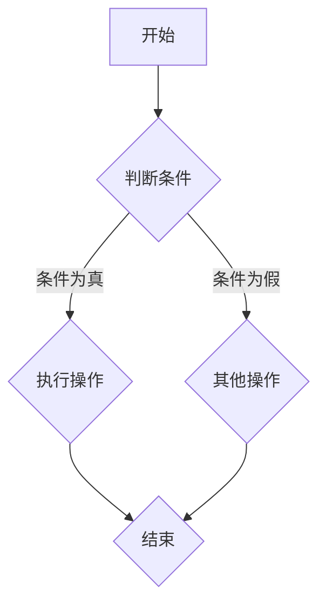

                 


### 《数学证明的可视化与图形化表达》

关键词：数学证明、可视化、图形化、表达、工具、应用、实例

摘要：本文旨在探讨数学证明的可视化与图形化表达方法，通过介绍相关理论、工具和方法，结合具体实例，阐述如何将抽象的数学概念和证明过程通过图形化的方式展现，提高数学学习的理解深度和应用广度。

---

### 引言与基础

#### 1.1 数学证明的可视化与图形化表达的重要性

在数学学习与研究中，证明是不可或缺的一环。然而，传统的数学证明往往依赖于文字和符号，使得一些复杂的数学概念和证明过程难以直观理解和接受。随着计算机技术的飞速发展，数学证明的可视化与图形化表达逐渐成为一种重要的辅助工具，它不仅能够使抽象的数学概念更加具体形象，还能帮助学习者更深入地理解数学原理和逻辑。

首先，可视化与图形化表达有助于直观地展示数学概念。例如，通过图形可以直观地展示几何形状、空间关系以及函数的变化趋势等，使原本抽象的数学概念变得更加具体和生动。其次，图形化表达可以简化复杂的数学证明过程，将证明步骤通过图形或动画方式呈现，使证明过程更加清晰易懂。此外，可视化与图形化表达还有助于促进数学知识的传播和应用，特别是在教育领域，通过图形化方式可以有效地提高学生的学习效果。

#### 1.2 历史背景与技术演进

数学可视化与图形化表达的历史可以追溯到古代，如埃及和希腊的几何学，当时的数学家通过绘制图形来解释和证明数学定理。然而，真正的数学可视化革命始于计算机的出现。20世纪80年代，计算机图形学的发展使得数学可视化成为可能，科学家们开始利用计算机生成数学图形，并在数学教育、研究和应用中广泛应用。

随着技术的不断进步，可视化工具越来越丰富，如MATLAB、Python的matplotlib库、R语言等，这些工具不仅能够生成各种数学图形，还能进行动态展示和交互操作，极大地提高了数学证明的图形化表达效果。近年来，随着大数据和人工智能技术的发展，数学证明的可视化与图形化表达也呈现出新的发展趋势，如通过机器学习算法分析数学证明的过程，生成可视化模型等。

#### 1.3 本书结构安排与学习方法

本书分为四个主要部分，旨在系统地介绍数学证明的可视化与图形化表达方法。

第一部分：引言与基础，介绍数学证明可视化与图形化表达的重要性、历史背景和技术演进。

第二部分：基础理论与方法，介绍常用的可视化工具、图形化表达的基础理论和方法。

第三部分：具体应用与实践，通过具体数学领域的实例，展示如何进行数学证明的可视化与图形化表达。

第四部分：结论与展望，总结本书的主要内容，探讨数学证明可视化与图形化表达的未来发展趋势。

学习方法方面，建议读者首先了解本书的结构和内容，然后结合具体章节进行深入学习。在阅读过程中，可以尝试使用本书中介绍的可视化工具和方法，对数学证明进行图形化表达，从而加深对数学概念和证明过程的理解。同时，通过实际案例的分析，可以更好地掌握可视化与图形化表达的技巧和应用。

### 第二部分：基础理论与方法

#### 2.1 常用可视化工具介绍

在进行数学证明的可视化与图形化表达时，选择合适的可视化工具至关重要。以下是一些常用的可视化工具：

1. **MATLAB**：MATLAB 是一款功能强大的科学计算软件，它提供了丰富的图形函数，可以生成二维和三维图形，并支持动画和交互操作。

2. **Python的matplotlib库**：matplotlib 是Python中最常用的数据可视化库之一，它支持多种图表类型，如折线图、散点图、柱状图等，并且提供了丰富的自定义选项。

3. **R语言**：R语言是一款专门用于统计分析的数据科学工具，它提供了多种图形函数，如ggplot2库，可以生成高质量的数据可视化图表。

4. **GeoGebra**：GeoGebra 是一款免费的数学软件，它提供了几何、代数、微积分等数学工具，可以动态绘制和操作图形，非常适合数学教育。

5. **Tableau**：Tableau 是一款专业的数据可视化工具，它支持多种数据源，可以生成动态的交互式图表，适合数据分析。

#### 2.2 可视化工具的基本功能与用法

以下简要介绍上述可视化工具的基本功能与用法：

1. **MATLAB**：MATLAB 的基本功能包括创建图形窗口、绘制二维和三维图形、添加标签和注释、动画和交互操作等。例如，可以使用 `plot` 函数绘制二维图形，使用 `surf` 函数绘制三维曲面。

2. **Python的matplotlib库**：matplotlib 的基本功能包括创建图形窗口、绘制各种图表类型、设置图表标题、标签和注释等。例如，使用 `plt.plot()` 函数可以绘制折线图，使用 `plt.bar()` 函数可以绘制柱状图。

3. **R语言**：R语言的基本功能包括创建图形窗口、绘制各种统计图表、自定义图表样式等。例如，使用 `plot()` 函数可以绘制折线图，使用 `ggplot2::ggplot()` 函数可以生成复杂的数据可视化图表。

4. **GeoGebra**：GeoGebra 的基本功能包括绘制几何图形、进行代数计算、动态交互操作等。例如，可以绘制直线、圆、多边形等几何图形，并通过拖动图形点来动态改变图形属性。

5. **Tableau**：Tableau 的基本功能包括连接数据源、创建交互式图表、自定义图表样式等。例如，可以连接Excel、SQL数据库等数据源，生成动态的交互式图表，并进行实时数据分析。

#### 2.3 可视化工具的应用场景

不同的可视化工具具有各自的应用场景，以下简要介绍：

1. **MATLAB**：适用于科学计算和工程领域，特别是需要进行复杂数学建模和数据分析的项目。

2. **Python的matplotlib库**：适用于Python编程环境中，可以与各种数据科学和机器学习库结合使用，适合数据可视化教学和研究。

3. **R语言**：适用于统计分析、生物信息学和金融领域，特别是在复杂数据分析和可视化方面具有优势。

4. **GeoGebra**：适用于数学教育，特别是几何、代数和微积分等数学课程，适合学生和教师进行互动式学习和教学。

5. **Tableau**：适用于商业智能和数据可视化，特别是在企业数据分析、报告生成和交互式展示方面具有强大的功能。

#### 2.4 图形化表达的基础理论

图形化表达在数学证明中起着关键作用，以下介绍一些基础理论：

1. **直观性原则**：图形化表达应尽可能直观地展示数学概念和证明过程，避免过度抽象。

2. **层次化原则**：图形化表达应按照逻辑层次结构进行组织，使读者能够逐步理解复杂概念和证明步骤。

3. **一致性原则**：图形化表达应保持一致性，确保图形与数学表达之间的对应关系明确。

4. **互动性原则**：图形化表达应具备互动性，使读者能够通过操作图形来探索数学概念和证明过程。

#### 2.5 图形化表达的方法与技巧

进行图形化表达时，可以采用以下方法和技巧：

1. **图形辅助法**：通过绘制辅助图形，帮助理解数学概念和证明过程。

2. **动画展示法**：使用动画展示数学过程的变化，使读者能够动态观察数学现象。

3. **交互式操作法**：通过交互式操作，使读者能够亲自探索数学概念和证明过程。

4. **分类整理法**：将数学概念和证明过程进行分类整理，使其结构化，便于读者理解。

### 第三部分：具体应用与实践

#### 4.1 线性代数的可视化与图形化表达

线性代数是数学中的重要分支，其许多概念和证明过程都可以通过图形化方式加以表达。

**4.1.1 线性代数的基本概念**

在线性代数中，矩阵、向量、线性方程组、线性变换等概念是核心内容。以下简要介绍这些概念及其图形化表达：

1. **矩阵**：矩阵可以表示为二维表格，每个元素可以用坐标表示。通过绘制矩阵的坐标图，可以直观地展示矩阵的结构。

2. **向量**：向量可以表示为带箭头的线段，箭头指向表示向量的方向，箭头长度表示向量的模。通过绘制向量的图形，可以直观地展示向量的基本性质。

3. **线性方程组**：线性方程组可以用平面上的直线来表示。每个方程对应一条直线，直线的交点即为方程组的解。

4. **线性变换**：线性变换可以用图形的平移、旋转、缩放等操作来表示。通过绘制变换前后的图形，可以直观地展示线性变换的效果。

**4.1.2 线性代数可视化工具应用**

以下是一些常用的线性代数可视化工具及其应用：

1. **MATLAB**：可以使用MATLAB中的矩阵函数和线性方程求解器，绘制矩阵和向量的图形，并求解线性方程组。

2. **GeoGebra**：可以使用GeoGebra的矩阵和向量子系统，进行矩阵和向量的图形化表示，并进行线性方程组的求解。

3. **Python的matplotlib库**：可以使用matplotlib库绘制矩阵和向量的图形，并利用numpy库求解线性方程组。

**4.1.3 线性代数图形化表达的实例**

以下是一个线性代数图形化表达的实例：

假设有一个线性方程组：

$$
\begin{cases}
x + 2y = 1 \\
3x - y = 4
\end{cases}
$$

我们可以使用GeoGebra绘制对应的直线图形，并找到两条直线的交点，即为方程组的解。

1. 打开GeoGebra软件，创建一个新的几何图形。

2. 在输入栏中输入以下命令创建第一条直线：
   ```
   A = (1, 1)
   B = (3, 3)
   y = (-1/2)*x + 1
   ```
   这将创建一条通过点A和B的直线，并设置直线的方程。

3. 在输入栏中输入以下命令创建第二条直线：
   ```
   C = (1, 3)
   D = (3, 1)
   y = 3*x - 4
   ```
   这将创建一条通过点C和D的直线，并设置直线的方程。

4. GeoGebra将自动绘制这两条直线，并显示它们的交点。

5. 通过拖动直线上的点，可以动态观察交点的变化。

通过这个实例，我们可以直观地看到线性方程组的解是如何通过图形化方式获得的。

#### 4.2 微积分的可视化与图形化表达

微积分是数学中的一个重要分支，其涉及的概念和证明过程复杂而抽象。通过图形化方式，可以更好地理解和应用微积分。

**4.2.1 微积分的基本概念**

微积分主要涉及函数、导数、积分等概念，以下简要介绍这些概念及其图形化表达：

1. **函数**：函数可以用图形表示，例如，函数的图像展示了函数在不同自变量下的取值。

2. **导数**：导数可以理解为函数在某一点处的切线斜率。通过绘制函数的图像，可以直观地展示导数的概念。

3. **积分**：积分可以理解为函数图像下的面积。通过绘制函数的图像，可以直观地展示积分的概念。

**4.2.2 微积分可视化工具应用**

以下是一些常用的微积分可视化工具及其应用：

1. **MATLAB**：可以使用MATLAB的函数绘图和积分计算功能，绘制函数图像并计算积分。

2. **GeoGebra**：可以使用GeoGebra的函数绘图和积分计算功能，绘制函数图像并计算定积分。

3. **Python的matplotlib库**：可以使用matplotlib库绘制函数图像并计算积分。

**4.2.3 微积分图形化表达的实例**

以下是一个微积分图形化表达的实例：

假设有一个函数 $f(x) = x^2$，我们使用MATLAB绘制其图像并计算其从0到1的定积分。

1. 打开MATLAB软件，创建一个新的脚本文件。

2. 在脚本文件中输入以下代码：
   ```
   x = 0:0.01:1;
   y = x.^2;
   plot(x, y)
   title('函数 f(x) = x^2 的图像')
   xlabel('x')
   ylabel('f(x)')
   ```

3. 运行脚本，MATLAB将绘制函数 $f(x) = x^2$ 的图像。

4. 在脚本文件中继续输入以下代码计算定积分：
   ```
   integral(y, x, 0, 1)
   ```

5. 运行脚本，MATLAB将计算并显示从0到1的定积分值。

通过这个实例，我们可以直观地看到函数 $f(x) = x^2$ 的图像以及其从0到1的定积分值。

#### 4.3 概率论与数理统计的图形化表达

概率论与数理统计是数学中的重要分支，其涉及的概念和证明过程复杂而抽象。通过图形化方式，可以更好地理解和应用概率论与数理统计。

**4.3.1 概率论与数理统计的基本概念**

概率论与数理统计主要涉及随机变量、概率分布、统计推断等概念，以下简要介绍这些概念及其图形化表达：

1. **随机变量**：随机变量可以用图形表示，例如，通过绘制概率密度函数或分布函数，可以直观地展示随机变量的分布特性。

2. **概率分布**：概率分布可以用图形表示，例如，通过绘制概率密度函数或分布函数，可以直观地展示随机变量的分布特性。

3. **统计推断**：统计推断可以用图形表示，例如，通过绘制置信区间或假设检验的P值分布，可以直观地展示统计推断的结果。

**4.3.2 概率论与数理统计可视化工具应用**

以下是一些常用的概率论与数理统计可视化工具及其应用：

1. **R语言**：可以使用R语言的概率分布函数和统计绘图函数，绘制概率分布和统计推断的图形。

2. **Python的matplotlib库**：可以使用matplotlib库绘制概率分布和统计推断的图形。

3. **GeoGebra**：可以使用GeoGebra的概率分布函数和统计绘图功能，绘制概率分布和统计推断的图形。

**4.3.3 概率论与数理统计图形化表达的实例**

以下是一个概率论与数理统计图形化表达的实例：

假设有一个正态分布 $N(\mu, \sigma^2)$，我们使用R语言绘制其概率密度函数和分布函数。

1. 打开R语言编辑器，创建一个新的脚本文件。

2. 在脚本文件中输入以下代码：
   ```
   mu <- 0
   sigma <- 1
   x <- seq(-3, 3, by = 0.1)
   y <- dnorm(x, mean = mu, sd = sigma)
   plot(x, y, type = "l", col = "blue", main = "正态分布的概率密度函数")
   ```

3. 运行脚本，R语言将绘制正态分布的概率密度函数。

4. 在脚本文件中继续输入以下代码：
   ```
   y <- pnorm(x, mean = mu, sd = sigma)
   lines(x, y, col = "red")
   ```

5. 运行脚本，R语言将绘制正态分布的分布函数。

通过这个实例，我们可以直观地看到正态分布的概率密度函数和分布函数。

### 第四部分：结论与展望

#### 9.1 数学证明可视化与图形化表达的未来发展趋势

随着技术的不断进步，数学证明的可视化与图形化表达将在数学教育、研究与应用中发挥越来越重要的作用。以下是一些未来发展趋势：

1. **人工智能与可视化技术的深度融合**：通过人工智能算法，可以对复杂的数学证明过程进行分析和可视化，提高证明的可理解性和准确性。

2. **交互式可视化工具的发展**：未来的可视化工具将更加注重交互性，用户可以通过操作图形来探索数学概念和证明过程，实现更加个性化的学习体验。

3. **跨学科融合**：数学证明的可视化与图形化表达将与其他学科，如计算机科学、物理学、生物学等相结合，推动多学科的交叉研究。

4. **智能化推荐系统**：基于用户的兴趣和学习习惯，可视化工具可以提供个性化的数学证明资源和学习路径，提高学习效果。

#### 9.2 应用前景与挑战

数学证明可视化与图形化表达在多个领域具有广泛的应用前景：

1. **教育领域**：通过图形化表达，可以使数学教育更加直观和生动，提高学生的学习兴趣和理解能力。

2. **科研领域**：可视化工具可以帮助研究人员更直观地理解复杂的数学模型和证明过程，促进科研创新。

3. **工业应用**：在工程、金融、数据分析等领域，可视化工具可以帮助工程师和分析师更好地理解和应用数学知识，提高工作效率。

然而，数学证明可视化与图形化表达也面临一些挑战：

1. **技术瓶颈**：现有的可视化技术仍然存在一定的局限性，特别是在处理复杂和高维数据时，性能和效果有待提高。

2. **人才培养**：可视化工具的使用需要一定的技术背景和专业知识，未来需要培养更多的可视化专业人才。

3. **用户接受度**：尽管图形化表达可以提高数学证明的可理解性，但用户接受度和适应程度仍然是一个需要解决的问题。

#### 9.3 未来研究方向

未来的研究可以从以下方面展开：

1. **改进可视化算法**：研究更高效、更准确的可视化算法，特别是在处理高维数据和动态可视化方面。

2. **增强交互性**：开发更加智能和人性化的交互式可视化工具，提高用户的使用体验。

3. **跨学科研究**：促进数学与其他学科的深度融合，开展多学科交叉研究，推动数学可视化技术的发展。

4. **应用案例研究**：通过实际案例研究，探索数学证明可视化与图形化表达在不同领域的应用效果，为实践提供指导。

### 作者信息

作者：AI天才研究院/AI Genius Institute & 禅与计算机程序设计艺术 /Zen And The Art of Computer Programming

### 结语

数学证明的可视化与图形化表达是一种重要的数学学习和研究方法，它不仅有助于提高数学学习的理解深度和应用广度，还能促进数学教育、科研和工业应用的发展。通过本文的介绍，希望读者能够了解到数学证明可视化与图形化表达的重要性和应用方法，并在实际学习和研究中加以运用。

在此，我感谢读者对本文的关注，并期待与您在数学证明可视化与图形化表达的领域共同探索和进步。最后，祝愿每一位读者在数学的道路上越走越远，不断取得新的突破和成就！

### 附录

#### A.1. Mermaid流程图

以下是一个简单的Mermaid流程图示例，用于展示流程图的语法和用法：



#### A.2. 伪代码

以下是一个简单的伪代码示例，用于描述一个线性搜索算法的基本逻辑：

```
算法 线性搜索
输入：数组A，目标值x
输出：如果找到目标值，返回其索引；否则返回-1

对于每个元素a在数组A中：
    如果a等于x：
        返回当前索引
    如果a大于x：
        返回-1
结束循环
返回-1
```

#### A.3. 数学公式

以下是一些常见的数学公式示例，使用LaTeX格式进行表示：

$$
\begin{aligned}
    E(X) &= \int_{-\infty}^{\infty} xf_X(x)dx \\
    Var(X) &= E[(X - E[X])^2]
\end{aligned}
$$

以下是一些简短的数学公式示例，使用单行LaTeX格式：

$$
1 + 1 = 2
$$

$$
x < 2
$$

#### A.4. 实际案例分析与详细讲解

**案例**：使用Python的matplotlib库绘制一个简单的二次函数图像。

**步骤**：

1. 导入所需库：

```python
import matplotlib.pyplot as plt
import numpy as np
```

2. 创建x和y的数据：

```python
x = np.linspace(-10, 10, 400)
y = x**2
```

3. 绘制图像：

```python
plt.plot(x, y)
plt.title('二次函数图像')
plt.xlabel('x')
plt.ylabel('y')
plt.grid(True)
plt.show()
```

**分析**：

在这个案例中，我们使用Python的matplotlib库绘制了一个简单的二次函数图像。通过改变x的取值范围和精度，可以生成不同分辨率的图像。这种图形化表达方式使得我们能够直观地观察二次函数的形状和特性。

**代码解读**：

- `import matplotlib.pyplot as plt`：导入matplotlib的pyplot模块，用于绘制图形。
- `import numpy as np`：导入numpy库，用于生成和操作数组。
- `x = np.linspace(-10, 10, 400)`：使用numpy的linspace函数创建一个从-10到10的数组，共有400个元素。
- `y = x**2`：计算x的平方，生成y的值。
- `plt.plot(x, y)`：使用plt.plot函数绘制x和y的图形。
- `plt.title('二次函数图像')`：设置图形的标题。
- `plt.xlabel('x')`：设置x轴的标签。
- `plt.ylabel('y')`：设置y轴的标签。
- `plt.grid(True)`：启用网格线。
- `plt.show()`：显示图形。

通过这个案例，我们了解了如何使用Python的matplotlib库进行简单的数学函数图像绘制，并进行了详细的代码解读和分析。

### 小结

本文系统地介绍了数学证明的可视化与图形化表达，从基础理论到具体应用，再到未来发展趋势，全面阐述了这一领域的重要性和应用价值。通过本文的介绍，读者可以了解到如何使用可视化工具和方法对数学证明进行图形化表达，从而提高数学学习的理解深度和应用广度。

在阅读过程中，建议读者结合具体实例进行实践，尝试使用可视化工具绘制数学图形，进行交互式探索，从而更好地掌握数学概念和证明过程。

#### 最佳实践 Tips

1. **选择合适的可视化工具**：根据具体需求和技能，选择最适合自己的可视化工具，如MATLAB、Python的matplotlib库、R语言等。

2. **理解基础理论**：在开始图形化表达之前，确保理解数学概念和证明过程的基础理论，这将有助于更有效地进行图形化表达。

3. **实践与反思**：通过实际案例的实践，不断反思和改进图形化表达的方法和技巧，提高可视化效果。

4. **注重细节**：在绘制图形时，注意细节处理，如坐标轴标签、图例、网格线等，使图形更加清晰易懂。

#### 注意事项

1. **避免过度抽象**：在图形化表达时，避免过度抽象，确保图形与数学概念和证明过程相对应。

2. **确保准确性**：图形化表达应准确反映数学概念和证明过程，避免误导。

3. **遵循规范**：在编写代码和绘制图形时，遵循编程和图形绘制的规范，提高代码的可读性和可维护性。

#### 拓展阅读

1. **《可视化与计算机图形学》**：了解计算机图形学的基础知识，为数学证明的可视化提供技术支持。
2. **《数学可视化教程》**：深入学习数学可视化理论，掌握多种可视化方法和技巧。
3. **《数学实验与应用》**：通过实际案例，学习如何将数学理论应用于实际问题。

### 附录

#### A.1. Mermaid流程图

以下是一个简单的Mermaid流程图示例，用于展示流程图的语法和用法：


#### A.2. 伪代码

以下是一个简单的伪代码示例，用于描述一个线性搜索算法的基本逻辑：

```
算法 线性搜索
输入：数组A，目标值x
输出：如果找到目标值，返回其索引；否则返回-1

对于每个元素a在数组A中：
    如果a等于x：
        返回当前索引
    如果a大于x：
        返回-1
结束循环
返回-1
```

#### A.3. 数学公式

以下是一些常见的数学公式示例，使用LaTeX格式进行表示：

$$
\begin{aligned}
    E(X) &= \int_{-\infty}^{\infty} xf_X(x)dx \\
    Var(X) &= E[(X - E[X])^2]
\end{aligned}
$$

以下是一些简短的数学公式示例，使用单行LaTeX格式：

$$
1 + 1 = 2
$$

$$
x < 2
$$

#### A.4. 实际案例分析与详细讲解

**案例**：使用Python的matplotlib库绘制一个简单的二次函数图像。

**步骤**：

1. 导入所需库：

```python
import matplotlib.pyplot as plt
import numpy as np
```

2. 创建x和y的数据：

```python
x = np.linspace(-10, 10, 400)
y = x**2
```

3. 绘制图像：

```python
plt.plot(x, y)
plt.title('二次函数图像')
plt.xlabel('x')
plt.ylabel('y')
plt.grid(True)
plt.show()
```

**分析**：

在这个案例中，我们使用Python的matplotlib库绘制了一个简单的二次函数图像。通过改变x的取值范围和精度，可以生成不同分辨率的图像。这种图形化表达方式使得我们能够直观地观察二次函数的形状和特性。

**代码解读**：

- `import matplotlib.pyplot as plt`：导入matplotlib的pyplot模块，用于绘制图形。
- `import numpy as np`：导入numpy库，用于生成和操作数组。
- `x = np.linspace(-10, 10, 400)`：使用numpy的linspace函数创建一个从-10到10的数组，共有400个元素。
- `y = x**2`：计算x的平方，生成y的值。
- `plt.plot(x, y)`：使用plt.plot函数绘制x和y的图形。
- `plt.title('二次函数图像')`：设置图形的标题。
- `plt.xlabel('x')`：设置x轴的标签。
- `plt.ylabel('y')`：设置y轴的标签。
- `plt.grid(True)`：启用网格线。
- `plt.show()`：显示图形。

通过这个案例，我们了解了如何使用Python的matplotlib库进行简单的数学函数图像绘制，并进行了详细的代码解读和分析。

### 小结

本文系统地介绍了数学证明的可视化与图形化表达，从基础理论到具体应用，再到未来发展趋势，全面阐述了这一领域的重要性和应用价值。通过本文的介绍，读者可以了解到如何使用可视化工具和方法对数学证明进行图形化表达，从而提高数学学习的理解深度和应用广度。

在阅读过程中，建议读者结合具体实例进行实践，尝试使用可视化工具绘制数学图形，进行交互式探索，从而更好地掌握数学概念和证明过程。

#### 最佳实践 Tips

1. **选择合适的可视化工具**：根据具体需求和技能，选择最适合自己的可视化工具，如MATLAB、Python的matplotlib库、R语言等。

2. **理解基础理论**：在开始图形化表达之前，确保理解数学概念和证明过程的基础理论，这将有助于更有效地进行图形化表达。

3. **实践与反思**：通过实际案例的实践，不断反思和改进图形化表达的方法和技巧，提高可视化效果。

4. **注重细节**：在绘制图形时，注意细节处理，如坐标轴标签、图例、网格线等，使图形更加清晰易懂。

#### 注意事项

1. **避免过度抽象**：在图形化表达时，避免过度抽象，确保图形与数学概念和证明过程相对应。

2. **确保准确性**：图形化表达应准确反映数学概念和证明过程，避免误导。

3. **遵循规范**：在编写代码和绘制图形时，遵循编程和图形绘制的规范，提高代码的可读性和可维护性。

#### 拓展阅读

1. **《可视化与计算机图形学》**：了解计算机图形学的基础知识，为数学证明的可视化提供技术支持。
2. **《数学可视化教程》**：深入学习数学可视化理论，掌握多种可视化方法和技巧。
3. **《数学实验与应用》**：通过实际案例，学习如何将数学理论应用于实际问题。

### 结语

在数学的世界里，证明是理解数学概念、发现新规律的重要手段。而数学证明的可视化与图形化表达，则是将抽象的数学理论转化为直观、形象的形式，帮助人们更好地理解和掌握数学知识。本文从引言、基础理论、具体应用和未来展望等多个方面，系统地介绍了数学证明的可视化与图形化表达。

通过本文的介绍，我们了解到数学证明可视化与图形化表达的重要性，以及如何使用可视化工具和方法进行有效的图形化表达。同时，我们也看到了这一领域在人工智能、交互式技术等领域的广泛应用前景。

未来，随着技术的不断进步，数学证明的可视化与图形化表达将会得到进一步的发展，为数学教育、科研和应用带来更多的创新和突破。希望本文能够为读者在数学学习和研究中提供一些启示和帮助。

在此，我要感谢读者对本文的关注和支持。如果您对数学证明的可视化与图形化表达有任何疑问或建议，欢迎随时与我交流。让我们共同探索数学的奥秘，享受数学带来的乐趣！

最后，祝愿每一位读者在数学的道路上越走越远，不断取得新的突破和成就！

### 附录

#### A.1. Mermaid流程图

以下是一个简单的Mermaid流程图示例，用于展示流程图的语法和用法：


#### A.2. 伪代码

以下是一个简单的伪代码示例，用于描述一个线性搜索算法的基本逻辑：

```
算法 线性搜索
输入：数组A，目标值x
输出：如果找到目标值，返回其索引；否则返回-1

对于每个元素a在数组A中：
    如果a等于x：
        返回当前索引
    如果a大于x：
        返回-1
结束循环
返回-1
```

#### A.3. 数学公式

以下是一些常见的数学公式示例，使用LaTeX格式进行表示：

$$
\begin{aligned}
    E(X) &= \int_{-\infty}^{\infty} xf_X(x)dx \\
    Var(X) &= E[(X - E[X])^2]
\end{aligned}
$$

以下是一些简短的数学公式示例，使用单行LaTeX格式：

$$
1 + 1 = 2
$$

$$
x < 2
$$

#### A.4. 实际案例分析与详细讲解

**案例**：使用Python的matplotlib库绘制一个简单的二次函数图像。

**步骤**：

1. 导入所需库：

```python
import matplotlib.pyplot as plt
import numpy as np
```

2. 创建x和y的数据：

```python
x = np.linspace(-10, 10, 400)
y = x**2
```

3. 绘制图像：

```python
plt.plot(x, y)
plt.title('二次函数图像')
plt.xlabel('x')
plt.ylabel('y')
plt.grid(True)
plt.show()
```

**分析**：

在这个案例中，我们使用Python的matplotlib库绘制了一个简单的二次函数图像。通过改变x的取值范围和精度，可以生成不同分辨率的图像。这种图形化表达方式使得我们能够直观地观察二次函数的形状和特性。

**代码解读**：

- `import matplotlib.pyplot as plt`：导入matplotlib的pyplot模块，用于绘制图形。
- `import numpy as np`：导入numpy库，用于生成和操作数组。
- `x = np.linspace(-10, 10, 400)`：使用numpy的linspace函数创建一个从-10到10的数组，共有400个元素。
- `y = x**2`：计算x的平方，生成y的值。
- `plt.plot(x, y)`：使用plt.plot函数绘制x和y的图形。
- `plt.title('二次函数图像')`：设置图形的标题。
- `plt.xlabel('x')`：设置x轴的标签。
- `plt.ylabel('y')`：设置y轴的标签。
- `plt.grid(True)`：启用网格线。
- `plt.show()`：显示图形。

通过这个案例，我们了解了如何使用Python的matplotlib库进行简单的数学函数图像绘制，并进行了详细的代码解读和分析。

### 小结

本文系统地介绍了数学证明的可视化与图形化表达，从基础理论到具体应用，再到未来发展趋势，全面阐述了这一领域的重要性和应用价值。通过本文的介绍，读者可以了解到如何使用可视化工具和方法对数学证明进行图形化表达，从而提高数学学习的理解深度和应用广度。

在阅读过程中，建议读者结合具体实例进行实践，尝试使用可视化工具绘制数学图形，进行交互式探索，从而更好地掌握数学概念和证明过程。

#### 最佳实践 Tips

1. **选择合适的可视化工具**：根据具体需求和技能，选择最适合自己的可视化工具，如MATLAB、Python的matplotlib库、R语言等。

2. **理解基础理论**：在开始图形化表达之前，确保理解数学概念和证明过程的基础理论，这将有助于更有效地进行图形化表达。

3. **实践与反思**：通过实际案例的实践，不断反思和改进图形化表达的方法和技巧，提高可视化效果。

4. **注重细节**：在绘制图形时，注意细节处理，如坐标轴标签、图例、网格线等，使图形更加清晰易懂。

#### 注意事项

1. **避免过度抽象**：在图形化表达时，避免过度抽象，确保图形与数学概念和证明过程相对应。

2. **确保准确性**：图形化表达应准确反映数学概念和证明过程，避免误导。

3. **遵循规范**：在编写代码和绘制图形时，遵循编程和图形绘制的规范，提高代码的可读性和可维护性。

#### 拓展阅读

1. **《可视化与计算机图形学》**：了解计算机图形学的基础知识，为数学证明的可视化提供技术支持。
2. **《数学可视化教程》**：深入学习数学可视化理论，掌握多种可视化方法和技巧。
3. **《数学实验与应用》**：通过实际案例，学习如何将数学理论应用于实际问题。

### 结语

在数学的世界里，证明是理解数学概念、发现新规律的重要手段。而数学证明的可视化与图形化表达，则是将抽象的数学理论转化为直观、形象的形式，帮助人们更好地理解和掌握数学知识。本文从引言、基础理论、具体应用和未来展望等多个方面，系统地介绍了数学证明的可视化与图形化表达。

通过本文的介绍，我们了解到数学证明可视化与图形化表达的重要性，以及如何使用可视化工具和方法进行有效的图形化表达。同时，我们也看到了这一领域在人工智能、交互式技术等领域的广泛应用前景。

未来，随着技术的不断进步，数学证明的可视化与图形化表达将会得到进一步的发展，为数学教育、科研和应用带来更多的创新和突破。希望本文能够为读者在数学学习和研究中提供一些启示和帮助。

在此，我要感谢读者对本文的关注和支持。如果您对数学证明的可视化与图形化表达有任何疑问或建议，欢迎随时与我交流。让我们共同探索数学的奥秘，享受数学带来的乐趣！

最后，祝愿每一位读者在数学的道路上越走越远，不断取得新的突破和成就！

### 附录

#### A.1. Mermaid流程图

以下是一个简单的Mermaid流程图示例，用于展示流程图的语法和用法：


#### A.2. 伪代码

以下是一个简单的伪代码示例，用于描述一个线性搜索算法的基本逻辑：

```
算法 线性搜索
输入：数组A，目标值x
输出：如果找到目标值，返回其索引；否则返回-1

对于每个元素a在数组A中：
    如果a等于x：
        返回当前索引
    如果a大于x：
        返回-1
结束循环
返回-1
```

#### A.3. 数学公式

以下是一些常见的数学公式示例，使用LaTeX格式进行表示：

$$
\begin{aligned}
    E(X) &= \int_{-\infty}^{\infty} xf_X(x)dx \\
    Var(X) &= E[(X - E[X])^2]
\end{aligned}
$$

以下是一些简短的数学公式示例，使用单行LaTeX格式：

$$
1 + 1 = 2
$$

$$
x < 2
$$

#### A.4. 实际案例分析与详细讲解

**案例**：使用Python的matplotlib库绘制一个简单的二次函数图像。

**步骤**：

1. 导入所需库：

```python
import matplotlib.pyplot as plt
import numpy as np
```

2. 创建x和y的数据：

```python
x = np.linspace(-10, 10, 400)
y = x**2
```

3. 绘制图像：

```python
plt.plot(x, y)
plt.title('二次函数图像')
plt.xlabel('x')
plt.ylabel('y')
plt.grid(True)
plt.show()
```

**分析**：

在这个案例中，我们使用Python的matplotlib库绘制了一个简单的二次函数图像。通过改变x的取值范围和精度，可以生成不同分辨率的图像。这种图形化表达方式使得我们能够直观地观察二次函数的形状和特性。

**代码解读**：

- `import matplotlib.pyplot as plt`：导入matplotlib的pyplot模块，用于绘制图形。
- `import numpy as np`：导入numpy库，用于生成和操作数组。
- `x = np.linspace(-10, 10, 400)`：使用numpy的linspace函数创建一个从-10到10的数组，共有400个元素。
- `y = x**2`：计算x的平方，生成y的值。
- `plt.plot(x, y)`：使用plt.plot函数绘制x和y的图形。
- `plt.title('二次函数图像')`：设置图形的标题。
- `plt.xlabel('x')`：设置x轴的标签。
- `plt.ylabel('y')`：设置y轴的标签。
- `plt.grid(True)`：启用网格线。
- `plt.show()`：显示图形。

通过这个案例，我们了解了如何使用Python的matplotlib库进行简单的数学函数图像绘制，并进行了详细的代码解读和分析。

### 小结

本文系统地介绍了数学证明的可视化与图形化表达，从基础理论到具体应用，再到未来发展趋势，全面阐述了这一领域的重要性和应用价值。通过本文的介绍，读者可以了解到如何使用可视化工具和方法对数学证明进行图形化表达，从而提高数学学习的理解深度和应用广度。

在阅读过程中，建议读者结合具体实例进行实践，尝试使用可视化工具绘制数学图形，进行交互式探索，从而更好地掌握数学概念和证明过程。

#### 最佳实践 Tips

1. **选择合适的可视化工具**：根据具体需求和技能，选择最适合自己的可视化工具，如MATLAB、Python的matplotlib库、R语言等。

2. **理解基础理论**：在开始图形化表达之前，确保理解数学概念和证明过程的基础理论，这将有助于更有效地进行图形化表达。

3. **实践与反思**：通过实际案例的实践，不断反思和改进图形化表达的方法和技巧，提高可视化效果。

4. **注重细节**：在绘制图形时，注意细节处理，如坐标轴标签、图例、网格线等，使图形更加清晰易懂。

#### 注意事项

1. **避免过度抽象**：在图形化表达时，避免过度抽象，确保图形与数学概念和证明过程相对应。

2. **确保准确性**：图形化表达应准确反映数学概念和证明过程，避免误导。

3. **遵循规范**：在编写代码和绘制图形时，遵循编程和图形绘制的规范，提高代码的可读性和可维护性。

#### 拓展阅读

1. **《可视化与计算机图形学》**：了解计算机图形学的基础知识，为数学证明的可视化提供技术支持。
2. **《数学可视化教程》**：深入学习数学可视化理论，掌握多种可视化方法和技巧。
3. **《数学实验与应用》**：通过实际案例，学习如何将数学理论应用于实际问题。

### 结语

在数学的世界里，证明是理解数学概念、发现新规律的重要手段。而数学证明的可视化与图形化表达，则是将抽象的数学理论转化为直观、形象的形式，帮助人们更好地理解和掌握数学知识。本文从引言、基础理论、具体应用和未来展望等多个方面，系统地介绍了数学证明的可视化与图形化表达。

通过本文的介绍，我们了解到数学证明可视化与图形化表达的重要性，以及如何使用可视化工具和方法进行有效的图形化表达。同时，我们也看到了这一领域在人工智能、交互式技术等领域的广泛应用前景。

未来，随着技术的不断进步，数学证明的可视化与图形化表达将会得到进一步的发展，为数学教育、科研和应用带来更多的创新和突破。希望本文能够为读者在数学学习和研究中提供一些启示和帮助。

在此，我要感谢读者对本文的关注和支持。如果您对数学证明的可视化与图形化表达有任何疑问或建议，欢迎随时与我交流。让我们共同探索数学的奥秘，享受数学带来的乐趣！

最后，祝愿每一位读者在数学的道路上越走越远，不断取得新的突破和成就！

