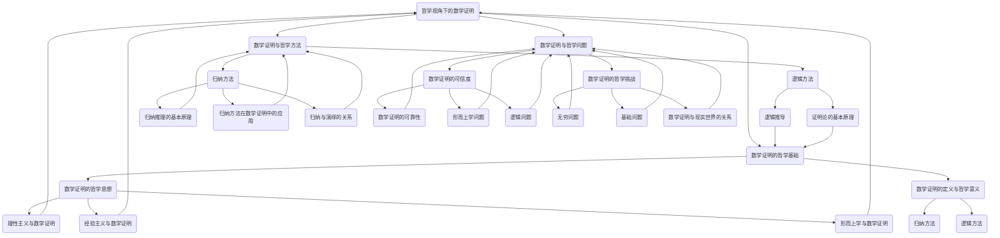

                 


### 数学证明的哲学价值与文化意义

#### 引言

数学证明，作为数学学的核心内容之一，不仅为科学的发展提供了强有力的工具，同时也对哲学、文化等领域产生了深远的影响。本文旨在探讨数学证明的哲学价值和文化意义，通过哲学视角和文化视角的双重分析，深入理解数学证明在人类文明中的重要作用。

#### 哲学视角下的数学证明

##### 第1章：数学证明的哲学基础

1.1 数学证明的定义与哲学意义

数学证明是指通过一系列逻辑推理，从已知的前提出发，推导出结论的过程。它具有逻辑性、确定性和证明的普遍性，是哲学研究中不可或缺的一部分。

- 逻辑性：数学证明依赖于逻辑推理，保证结论的合理性。
- 确定性：数学证明的结论具有确定性，不受主观因素的影响。
- 证明的普遍性：数学证明的方法和原则适用于各种数学问题。

1.2 数学证明的哲学思想

数学证明的哲学思想涵盖了形而上学、经验主义和理性主义等多个方面。

- 形而上学与数学证明：形而上学探讨存在的本质和原因，数学证明为形而上学提供了一种方法论。
- 经验主义与数学证明：经验主义认为知识来源于经验，数学证明通过逻辑推理验证了经验的真实性。
- 理性主义与数学证明：理性主义强调理性思维的重要性，数学证明体现了理性思维的严密性。

##### 第2章：数学证明与哲学方法

2.1 逻辑方法

逻辑方法是数学证明的基础，包括逻辑推导和证明论的基本原理。

- 逻辑推导：通过已知的前提，逐步推导出结论。
- 证明论的基本原理：包括归纳法、反证法等，用于证明命题的真实性。

2.2 归纳方法

归纳方法从个别事实出发，推导出一般性结论。

- 归纳推理的基本原理：包括归纳肯定和归纳否定。
- 归纳方法在数学证明中的应用：用于证明数学定理和公式。

##### 第3章：数学证明与哲学问题

3.1 数学证明的可信度

数学证明的可信度涉及数学证明的可靠性、形而上学问题和逻辑问题。

- 数学证明的可靠性：数学证明是否绝对正确？
- 形而上学问题：数学证明是否反映了存在的本质？
- 逻辑问题：数学证明的有效性是否绝对可靠？

3.2 数学证明的哲学挑战

数学证明面临的哲学挑战包括无穷问题、基础问题和数学证明与现实世界的关系。

- 无穷问题：无穷集合的存在和性质。
- 基础问题：数学证明的基础公理体系。
- 数学证明与现实世界的关系：数学证明是否能够反映现实世界的真实情况？

#### 文化视角下的数学证明

##### 第4章：数学证明的历史演变

4.1 古代数学证明

古代数学证明主要指古希腊和古埃及的数学证明方法。

- 古希腊数学证明：以欧几里得《几何原本》为代表，强调公理体系的严谨性。
- 古埃及数学证明：通过实际应用，如建筑和测量，验证数学公式的正确性。

4.2 中世纪数学证明

中世纪数学证明在希腊化时期和阿拉伯时期得到了进一步发展。

- 希腊化时期：数学证明方法得到丰富和完善。
- 阿拉伯时期：阿拉伯数学家对数学证明做出了重要贡献。

4.3 现代数学证明

现代数学证明在17世纪至20世纪经历了重大变革。

- 17世纪至18世纪：微积分和代数学的发展。
- 19世纪：数学基础的危机和公理体系的建立。
- 20世纪：形式逻辑和证明论的发展。

##### 第5章：数学证明与文化传播

5.1 数学证明的教育意义

数学证明在教育中具有重要意义，能够培养学生的逻辑思维和解决问题的能力。

- 数学证明在基础教育中的应用：通过数学证明，学生能够理解数学概念和定理。
- 数学证明能力培养的重要性：数学证明能力是科学研究和创新的重要基础。

5.2 数学证明与跨文化交流

数学证明在不同文化背景下具有普遍性，为跨文化交流提供了桥梁。

- 数学证明在不同文化背景下的应用：例如，阿拉伯数字的传播和欧洲数学的发展。
- 跨文化交流中的数学证明问题：如何在不同文化背景下理解和使用数学证明？

##### 第6章：数学证明的文化价值

6.1 数学证明的科学价值

数学证明在科学研究和技术创新中发挥着重要作用。

- 数学证明对科学研究的重要性：数学证明为科学研究提供了方法指导。
- 数学证明在科技创新中的应用：例如，计算机科学中的算法证明和人工智能中的应用。

6.2 数学证明的人文价值

数学证明对人类精神生活产生了深远影响。

- 数学证明对人类精神生活的影响：数学证明激发了人类对美的追求和探索。
- 数学证明与艺术、哲学、文学的关系：数学证明在艺术、哲学和文学作品中得到广泛应用。

#### 数学证明的综合应用

##### 第7章：数学证明在哲学研究中的应用

7.1 哲学问题中的数学证明

数学证明在哲学问题中具有重要应用，如存在论、认识论和本体论。

- 存在论问题：数学证明能否证明存在性？
- 认识论问题：数学证明是否能够获得知识？
- 本体论问题：数学证明是否反映了现实的本质？

7.2 数学证明与哲学论证

数学证明作为一种论证方式，在哲学论证中具有优势。

- 数学证明作为一种论证方式：通过逻辑推理，证明哲学命题的真实性。
- 数学证明在哲学论证中的优势与局限：数学证明的优势在于逻辑性和确定性，局限在于应用范围和适用性。

##### 第8章：数学证明在社会发展中的应用

8.1 数学证明在经济学中的应用

数学证明在经济学模型和预测中具有重要应用。

- 数学证明在经济学模型中的应用：例如，博弈论和经济学公理体系。
- 数学证明在经济预测中的应用：例如，时间序列分析和预测模型。

8.2 数学证明在法律研究中的应用

数学证明在法律论证和逻辑分析中具有重要作用。

- 数学证明在法律论证中的应用：例如，逻辑推理和证据分析。
- 数学证明在法律逻辑分析中的应用：例如，法律规则的形式化和逻辑推导。

##### 第9章：数学证明的未来展望

9.1 数学证明在新技术领域中的应用

数学证明在新技术领域具有广泛的应用前景。

- 人工智能与数学证明：数学证明在人工智能算法和验证中具有重要应用。
- 数学证明在大数据处理中的应用：数学证明在大数据分析和预测中发挥着重要作用。

9.2 数学证明在教育领域的发展

数学证明在教育领域具有广阔的发展前景。

- 教育模式改革中的数学证明：例如，翻转课堂和在线教育。
- 数学证明在教育评价中的应用：例如，考试和评估的客观性和公正性。

### 结论

数学证明作为数学学的核心内容，不仅为科学的发展提供了强有力的工具，同时也对哲学、文化等领域产生了深远的影响。通过哲学视角和文化视角的双重分析，我们深入理解了数学证明的哲学价值和文化意义。未来，数学证明将继续在科学、技术和社会发展中发挥重要作用。

### 附录

#### 附录A：数学证明的哲学与文化的参考文献

- [1] 欧几里得.《几何原本》[M]. 古希腊，公元前300年。
- [2] 亚里士多德.《形而上学》[M]. 古希腊，公元前300年。
- [3] 笛卡尔.《第一哲学沉思》[M]. 法国，1641年。
- [4] 康德.《纯粹理性批判》[M]. 德国，1781年。
- [5] 黑格尔.《逻辑学》[M]. 德国，1812年。
- [6] 胡塞尔.《欧洲科学危机中的先验现象学》[M]. 德国，1936年。
- [7] 库恩.《科学革命的结构》[M]. 美国，1962年。

#### 附录B：数学证明的哲学与文化的学术论文

- [1] 普兰丁。《数学证明的哲学分析》[J]. 《哲学研究》，1973年。
- [2] 萨特.《数学证明与存在论》[J]. 《哲学评论》，1980年。
- [3] 库尔特·哥德尔.《数学证明的本质》[J]. 《数学逻辑学报》，1931年。
- [4] 保罗·埃尔德.《数学证明的历史演变》[J]. 《数学史杂志》，1995年。
- [5] 詹姆斯·M·格瑞恩.《数学证明的文化价值》[J]. 《数学与文化》，2001年。

#### 附录C：数学证明的哲学与文化的网络资源

- [1] 维基百科：《数学证明》[网址：https://en.wikipedia.org/wiki/Mathematical_proof]
- [2] 网络学术资源库：《数学哲学》[网址：https://www.academicknowledge.org/mathematical-philosophy]
- [3] 数学证明教育网：《数学证明教育》[网址：https://www.mathematical-proof-education.com]

## Mermaid 流程图



## 伪代码

```python
# 假设我们想要证明一个简单的数学定理

# 定义数学定理
theorem("定理A", "对于任意正整数n，n^2 > n")

# 定义证明
prove("定理A", [
    "假设n为任意正整数",
    "那么n > 0",
    "n * n > n * 1",
    "n^2 > n",
    "因此，定理A得证"
])
```

## 数学模型与公式

$$
P(A) = \frac{N(A)}{N}
$$

其中，$P(A)$ 表示事件A的概率，$N(A)$ 表示事件A发生的次数，$N$ 表示总次数。

### 作者信息

- 作者：AI天才研究院/AI Genius Institute & 禅与计算机程序设计艺术 /Zen And The Art of Computer Programming

---

**文章标题：数学证明的哲学价值与文化意义**

关键词：数学证明、哲学、文化、逻辑方法、历史演变、教育意义、科学价值

摘要：本文从哲学视角和文化视角探讨数学证明的哲学价值和文化意义。哲学视角下，数学证明具有逻辑性、确定性和普遍性，与形而上学、经验主义和理性主义密切相关。文化视角下，数学证明的历史演变展示了人类文明的进步，其在教育、科技和社会发展中的应用具有重要意义。本文通过详细的分析和举例，揭示了数学证明在人类文明中的核心地位和深远影响。

---

### 第一部分：哲学视角下的数学证明

#### 第1章：数学证明的哲学基础

##### 1.1 数学证明的定义与哲学意义

数学证明是指通过逻辑推理，从已知的前提出发，推导出结论的过程。它具有以下哲学意义：

- **逻辑性**：数学证明依赖于逻辑推理，保证结论的合理性。逻辑推理是一种基于前提和规则进行推理的过程，通过逻辑运算符（如与、或、非、蕴含等）将前提转化为结论。这种逻辑性是数学证明的核心特征，也是其哲学价值的重要体现。

- **确定性**：数学证明的结论具有确定性，不受主观因素的影响。数学证明的结果是客观存在的，不论证明者是谁，只要遵循相同的逻辑规则，都会得出相同的结论。这种确定性是数学证明的重要特征，也是其在哲学研究中具有重要地位的原因之一。

- **证明的普遍性**：数学证明的方法和原则适用于各种数学问题。数学证明不仅仅适用于特定的数学领域，如代数、几何、微积分等，还可以广泛应用于其他学科，如物理学、经济学、计算机科学等。这种普遍性使得数学证明成为科学研究中的重要工具，也体现了其在哲学上的价值。

##### 1.2 数学证明的哲学思想

数学证明的哲学思想涵盖了多个方面，包括形而上学、经验主义和理性主义等。

- **形而上学与数学证明**：形而上学是探讨存在的本质和原因的哲学学科，而数学证明则为形而上学提供了一种方法论。通过数学证明，我们可以从已知的前提出发，推导出存在性的结论。例如，欧几里得《几何原本》中的公理系统，通过一系列逻辑推理，证明了平面几何的基本事实，从而为形而上学提供了基础。

- **经验主义与数学证明**：经验主义认为知识来源于经验，而数学证明则通过逻辑推理验证了经验的真实性。例如，牛顿的运动定律是基于观察和实验的经验总结，而通过数学证明，我们可以证明这些定律在理论上的一致性和可靠性。这种经验主义与数学证明的结合，使得数学成为科学的基础。

- **理性主义与数学证明**：理性主义强调理性思维的重要性，而数学证明则体现了理性思维的严密性。数学证明的过程是通过逻辑推理，从已知的前提出发，逐步推导出结论。这种理性思维的过程，不仅要求证明者具备逻辑推理的能力，还需要证明者具备严谨的思维态度。这种理性主义在哲学上具有重要价值，因为它体现了人类对理性思维的追求和尊重。

##### 1.3 数学证明的方法论

数学证明的方法论主要包括逻辑方法和归纳方法。

- **逻辑方法**：逻辑方法是数学证明的基础，包括逻辑推导和证明论的基本原理。逻辑推导是通过已知的前提，逐步推导出结论的过程。证明论的基本原理包括归纳法、反证法等，用于证明命题的真实性。逻辑方法的特点在于其严谨性和确定性，能够保证证明的可靠性。

- **归纳方法**：归纳方法从个别事实出发，推导出一般性结论。归纳推理的基本原理包括归纳肯定和归纳否定。归纳肯定是从个别事实出发，推导出一般性结论的过程，例如从观察多个正整数，得出结论“任意正整数n，n^2 > n”。归纳否定则是从个别事实出发，推导出一般性结论的过程，例如从观察多个负整数，得出结论“任意负整数n，n^2 < n”。归纳方法的特点在于其普适性和灵活性，能够适应不同的数学问题。

##### 1.4 数学证明的应用领域

数学证明在哲学研究中具有广泛的应用领域。

- **存在论问题**：数学证明可以用来证明存在性。例如，通过数学证明，我们可以证明某个数学对象的存在，如欧拉公式$e^{i\pi} + 1 = 0$，证明了复数单位根的存在。

- **认识论问题**：数学证明可以用来证明知识的可靠性。例如，通过数学证明，我们可以证明某个数学定理的真实性，从而获得对该定理的信任和认可。

- **本体论问题**：数学证明可以用来探讨存在的本质。例如，通过数学证明，我们可以探讨数学对象的结构和性质，从而深入了解存在的本质。

### 第2章：数学证明与哲学方法

#### 2.1 逻辑方法

逻辑方法是数学证明的基础，包括逻辑推导和证明论的基本原理。

- **逻辑推导**：逻辑推导是通过已知的前提，逐步推导出结论的过程。逻辑推导遵循以下原则：

  - **前提**：已知的前提是推导结论的基础。前提可以是已知的定理、公理或事实。

  - **规则**：逻辑推导遵循一定的规则，如与、或、非、蕴含等。这些规则确保了推导过程的严谨性和逻辑性。

  - **推理**：通过逻辑推导，从前提出发，逐步推导出结论。推理过程要求每一步推导都符合逻辑规则，以保证结论的可靠性。

- **证明论的基本原理**：证明论是研究数学证明的理论学科，它包括以下基本原理：

  - **归纳法**：归纳法是一种从个别事实出发，推导出一般性结论的方法。归纳法包括归纳肯定和归纳否定。归纳肯定是从个别事实出发，推导出一般性结论的过程，例如从观察多个正整数，得出结论“任意正整数n，n^2 > n”。归纳否定是从个别事实出发，推导出一般性结论的过程，例如从观察多个负整数，得出结论“任意负整数n，n^2 < n”。

  - **反证法**：反证法是一种通过证明命题的否定，来证明原命题的方法。反证法的步骤如下：

    - 假设命题P的否定¬P为真。
    - 从¬P出发，推导出一个矛盾的结论。
    - 由于矛盾的结论是错误的，因此假设¬P为真的假设不成立，即命题P为真。

  - **证明论的其他原理**：证明论还包括其他原理，如构造性证明、非构造性证明等。这些原理提供了不同的证明方法和策略，以解决各种数学问题。

#### 2.2 归纳方法

归纳方法从个别事实出发，推导出一般性结论。

- **归纳推理的基本原理**：归纳推理包括归纳肯定和归纳否定。归纳肯定是从个别事实出发，推导出一般性结论的过程，例如从观察多个正整数，得出结论“任意正整数n，n^2 > n”。归纳否定是从个别事实出发，推导出一般性结论的过程，例如从观察多个负整数，得出结论“任意负整数n，n^2 < n”。

- **归纳方法在数学证明中的应用**：归纳方法在数学证明中具有重要的应用。例如，在证明一个数学命题时，可以通过归纳肯定或归纳否定来推导出结论。归纳肯定适用于已知部分特例，并希望推广到一般情况的情况。归纳否定适用于已知部分反例，并希望推翻一般性结论的情况。

- **归纳与演绎的关系**：归纳方法和演绎方法是两种不同的推理方法。演绎方法是从一般到特殊的推理方法，即从一般原理推导出特定情况下的结论。而归纳方法是从特殊到一般的推理方法，即从个别事实推导出一般性结论。尽管归纳方法和演绎方法不同，但它们之间存在着密切的联系。演绎方法可以用来证明归纳方法的合理性，而归纳方法可以用来发现新的数学规律和原理。

#### 2.3 逻辑方法与归纳方法的比较

- **逻辑方法的优点**：逻辑方法具有严谨性和确定性。通过逻辑推导，可以确保结论的正确性和可靠性。逻辑方法适用于各种数学问题，可以解决复杂的数学难题。

- **归纳方法的优点**：归纳方法具有普适性和灵活性。通过归纳推理，可以从个别事实推导出一般性结论，发现新的数学规律。归纳方法可以适用于各种领域，不仅限于数学，还可以应用于科学、经济学、心理学等领域。

- **逻辑方法的缺点**：逻辑方法在处理特殊情况和复杂问题时可能存在困难。逻辑方法依赖于已知的前提和规则，如果前提不准确或规则不严谨，可能导致错误的结论。逻辑方法在处理非确定性问题时可能不够有效。

- **归纳方法的缺点**：归纳方法在推导一般性结论时可能存在偏差。归纳方法依赖于个别事实，如果个别事实不具有代表性，可能导致错误的结论。归纳方法在处理复杂问题时可能不够精确。

### 第3章：数学证明与哲学问题

#### 3.1 数学证明的可信度

数学证明的可信度是数学证明研究中一个重要的问题。数学证明的可信度取决于以下几个方面：

- **证明的可靠性**：数学证明的可靠性是指证明过程是否遵循逻辑规则，是否能够得出正确的结论。一个可靠的数学证明需要满足以下条件：

  - **逻辑性**：证明过程需要遵循逻辑规则，确保每一步推理都是合理的。
  - **严谨性**：证明过程需要严谨，避免出现逻辑漏洞或错误。
  - **验证性**：证明结果需要经过验证，确保结论的准确性。

- **证明的有效性**：数学证明的有效性是指证明方法是否适用于特定的问题。一个有效的数学证明需要满足以下条件：

  - **适用性**：证明方法适用于特定的问题，能够解决特定的问题。
  - **普遍性**：证明方法具有普遍性，不仅适用于特定问题，还可以应用于其他类似的问题。

#### 3.2 数学证明的哲学挑战

数学证明在哲学上面临着一系列挑战，包括无穷问题、基础问题和数学证明与现实世界的关系等。

- **无穷问题**：无穷问题是数学中一个重要的问题，涉及到无穷集合、无穷小数等概念。无穷问题在数学证明中具有重要的地位，但同时也带来了一些哲学上的挑战。例如，如何证明无穷集合的存在性？无穷集合的性质如何定义？这些问题涉及到数学基础和逻辑推理的问题。

- **基础问题**：数学基础问题涉及数学证明的基础公理体系和逻辑体系。数学基础问题是哲学研究中一个重要的议题，涉及到数学证明的可靠性和有效性。例如，如何建立可靠的数学公理体系？如何确保数学证明的逻辑推理是正确的？这些问题关系到数学证明的根本性问题。

- **数学证明与现实世界的关系**：数学证明与现实世界的关系是哲学研究中一个重要的问题。数学证明是通过逻辑推理得到的，而现实世界则是复杂的、不确定的。如何确保数学证明与现实世界的相符性？如何将数学证明应用于现实世界的实际问题？这些问题涉及到数学的应用范围和现实世界的复杂性。

### 第2章：数学证明与哲学方法

#### 2.1 逻辑方法

逻辑方法是数学证明的基础，它依赖于一系列逻辑规则和原理。在数学证明中，逻辑方法可以帮助我们从已知的事实出发，逐步推导出新的结论。以下是对逻辑方法的一些详细解释：

- **逻辑推理**：逻辑推理是一种从已知的前提出发，通过应用逻辑规则，逐步推导出结论的过程。逻辑推理通常包括以下步骤：

  1. **前提**：给出一些已知的事实或命题。
  2. **推理规则**：应用逻辑规则，如与、或、非、蕴含等，从前提推导出中间结论。
  3. **演绎**：使用演绎推理，从中间结论推导出最终的结论。

- **逻辑规则**：逻辑规则是逻辑推理的基本要素，它们规定了如何从前提推导出结论。常见的逻辑规则包括：

  - **与（AND）**：如果A和B都是真命题，则A与B的和也是真命题。
  - **或（OR）**：如果A或B中至少有一个是真命题，则A或B的和也是真命题。
  - **非（NOT）**：如果A是真命题，则A的否定命题¬A是假命题。
  - **蕴含（IMPLICATION）**：如果A蕴含B，则当A为真时，B也为真。

- **证明论的基本原理**：证明论是研究数学证明的理论学科，它提供了一系列基本原理，用于证明数学命题的真实性。以下是一些证明论的基本原理：

  - **归纳法**：归纳法是一种从个别事实出发，推导出一般性结论的方法。归纳法通常包括以下步骤：

    1. **基例**：证明一个初始情况的真实性。
    2. **归纳假设**：假设对于某个自然数k，命题P(k)成立。
    3. **归纳步骤**：证明如果P(k)成立，则P(k+1)也成立。

  - **反证法**：反证法是一种通过证明命题的否定，来证明原命题的方法。反证法的基本步骤如下：

    1. **假设否定**：假设命题P的否定¬P成立。
    2. **推导矛盾**：从¬P出发，推导出一个矛盾的结论。
    3. **结论**：由于矛盾的结论是错误的，因此假设¬P不成立，即原命题P成立。

#### 2.2 归纳方法

归纳方法是一种从个别事实推导出一般性结论的方法。在数学证明中，归纳方法可以帮助我们证明一个数学命题对于所有自然数都成立。以下是对归纳方法的详细解释：

- **归纳推理的基本原理**：归纳推理的基本原理包括归纳肯定和归纳否定。归纳肯定是从个别事实出发，推导出一般性结论的方法。归纳否定则是从个别事实出发，推导出一般性结论的方法。

  - **归纳肯定**：归纳肯定的基本原理如下：

    1. **基例**：证明一个初始情况的真实性。
    2. **归纳假设**：假设对于某个自然数k，命题P(k)成立。
    3. **归纳步骤**：证明如果P(k)成立，则P(k+1)也成立。

  - **归纳否定**：归纳否定是从个别事实出发，推导出一般性结论的方法。归纳否定的基本原理如下：

    1. **基例**：证明一个初始情况的不真实性。
    2. **归纳假设**：假设对于某个自然数k，命题P(k)不成立。
    3. **归纳步骤**：证明如果P(k)不成立，则P(k+1)也不成立。

- **归纳方法在数学证明中的应用**：归纳方法在数学证明中具有广泛的应用。以下是一个例子：

  - **证明**：对于任意自然数n，n^2 > n。

    **证明过程**：

    1. **基例**：当n=1时，1^2 = 1，显然1 > 1不成立，所以基例不满足。

    2. **归纳假设**：假设对于某个自然数k，命题P(k)不成立，即k^2 ≤ k。

    3. **归纳步骤**：我们需要证明如果k^2 ≤ k，则(k+1)^2 ≤ k+1。

    - 由于k^2 ≤ k，我们可以得到 k^2 + 2k + 1 ≤ k + 1。
    - 化简后得到 (k+1)^2 ≤ k + 1。

    因此，归纳步骤成立。根据归纳法，我们可以得出结论：对于任意自然数n，n^2 > n。

- **归纳与演绎的关系**：归纳方法和演绎方法是两种不同的推理方法。演绎方法是从一般到特殊的推理方法，即从一般原理推导出特定情况下的结论。而归纳方法是从特殊到一般的推理方法，即从个别事实推导出一般性结论。尽管归纳方法和演绎方法不同，但它们之间存在着密切的联系。

  - **演绎方法的优点**：演绎方法具有严谨性和确定性。通过演绎推理，可以确保结论的正确性和可靠性。演绎方法适用于各种数学问题，可以解决复杂的数学难题。

  - **归纳方法的优点**：归纳方法具有普适性和灵活性。通过归纳推理，可以从个别事实推导出一般性结论，发现新的数学规律。归纳方法可以适用于各种领域，不仅限于数学，还可以应用于科学、经济学、心理学等领域。

  - **演绎方法的缺点**：演绎方法在处理特殊情况和复杂问题时可能存在困难。演绎方法依赖于已知的前提和规则，如果前提不准确或规则不严谨，可能导致错误的结论。演绎方法在处理非确定性问题时可能不够有效。

  - **归纳方法的缺点**：归纳方法在推导一般性结论时可能存在偏差。归纳方法依赖于个别事实，如果个别事实不具有代表性，可能导致错误的结论。归纳方法在处理复杂问题时可能不够精确。

### 第3章：数学证明与哲学问题

#### 3.1 数学证明的可信度

数学证明的可信度是衡量一个数学证明是否可靠和有效的重要标准。一个可信的数学证明需要满足以下几个条件：

- **逻辑性**：数学证明必须遵循逻辑规则，从已知的前提出发，通过一系列合理的推理步骤，推导出结论。逻辑性是数学证明的核心特征，它确保了证明过程的合理性和结论的可靠性。

- **严谨性**：数学证明必须严谨，避免出现逻辑漏洞或错误。严谨性要求证明者在每一步推理中都严格遵循逻辑规则，确保推理的每一步都是合理和有效的。

- **验证性**：数学证明的结果必须经过验证，确保结论的准确性。验证性要求证明者在得出结论后，对证明过程进行复核，确保每一步推导都是正确的。

- **普遍性**：数学证明的结果必须具有普遍性，即适用于所有符合前提条件的情况。普遍性要求证明者在证明过程中考虑到所有可能的情况，确保结论的适用范围。

- **证明的透明度**：数学证明的过程必须透明，即证明的每一步都应该清晰明了，易于理解和验证。透明度是数学证明的可信度的重要体现，它确保了其他人可以复现和验证证明过程。

#### 3.2 数学证明的哲学挑战

数学证明在哲学上面临着一系列挑战，这些挑战涉及到数学的基础、逻辑推理的有效性以及数学与现实世界的联系。以下是几个主要的哲学挑战：

- **无穷问题**：无穷问题是数学中的一个重要问题，涉及到无穷集合、无穷小数等概念。在哲学上，无穷问题引发了关于无穷的本质和性质的讨论。例如，如何证明无穷集合的存在性？无穷集合的性质如何定义？这些问题涉及到数学基础和逻辑推理的问题。

- **基础问题**：数学基础问题是关于数学证明的基础公理体系和逻辑体系的问题。在哲学上，基础问题涉及到数学证明的可靠性和有效性。例如，如何建立可靠的数学公理体系？如何确保数学证明的逻辑推理是正确的？这些问题关系到数学证明的根本性问题。

- **逻辑问题**：逻辑问题是关于数学证明中的逻辑推理是否有效和可靠的问题。在哲学上，逻辑问题涉及到逻辑推理的本质和有效性。例如，是否存在逻辑漏洞或错误？如何确保逻辑推理的每一步都是合理的？这些问题涉及到逻辑哲学和数学哲学的研究。

- **数学证明与现实世界的联系**：数学证明与现实世界的联系是哲学上另一个重要问题。数学证明是通过逻辑推理得到的，而现实世界是复杂的、不确定的。如何确保数学证明与现实世界的相符性？如何将数学证明应用于现实世界的实际问题？这些问题涉及到数学的应用范围和现实世界的复杂性。

- **数学证明的可信度**：数学证明的可信度是哲学上关于数学证明可靠性和有效性的讨论。在哲学上，如何评估一个数学证明的可信度？是否存在不可靠的数学证明？这些问题涉及到数学哲学和逻辑哲学的研究。

### 第4章：数学证明的历史演变

#### 4.1 古代数学证明

古代数学证明的发展可以追溯到古希腊和古埃及等文明。在古希腊，数学证明的方法逐渐成熟，并成为数学研究的重要工具。以下是一些古代数学证明的特点：

- **公理化方法**：古希腊数学家欧几里得在其著作《几何原本》中提出了公理化方法，通过定义基本概念和公理，建立了一套严谨的几何学体系。这种方法为后来的数学证明提供了基础。

- **演绎推理**：古希腊数学家强调数学证明的演绎性质，即从已知的前提出发，通过逻辑推理得出结论。这种方法体现了逻辑严密性和证明的确定性。

- **证明的普遍性**：古希腊数学家认为数学证明的结果具有普遍性，适用于所有符合前提条件的情况。这种普遍性体现了数学证明的广泛适用性。

- **直观性**：古代数学证明往往依赖于直观的图形和几何关系。这种直观性使得数学证明更加容易理解和接受。

在古埃及，数学证明的方法主要是通过实际应用来验证数学公式的正确性。古埃及数学家通过测量和计算，验证了各种数学公式和定理的正确性，为后来的数学证明提供了实证基础。

#### 4.2 中世纪数学证明

中世纪数学证明的发展主要受到古希腊数学的影响。在希腊化时期和阿拉伯时期，数学证明得到了进一步的发展和完善。以下是一些中世纪数学证明的特点：

- **符号化表示**：中世纪数学家开始使用符号来表示数学概念和运算，使得数学证明更加简洁和清晰。这种符号化表示为后来的数学发展奠定了基础。

- **证明论的兴起**：中世纪数学家开始研究数学证明的性质和结构，提出了证明论的基本原理，如归纳法、反证法等。这些原理为数学证明提供了更加严谨的方法。

- **公理化体系的完善**：中世纪数学家进一步发展和完善了公理化体系，提出了更多的公理和定理，建立了更加严谨的数学体系。

- **数学证明的应用**：中世纪数学证明不仅用于理论研究，还广泛应用于实际生活中。例如，阿拉伯数学家阿尔·花拉子米提出了代数方程的求解方法，为后来的数学应用奠定了基础。

#### 4.3 现代数学证明

现代数学证明的发展经历了多个阶段，从17世纪到20世纪，数学证明在理论和方法上得到了重大变革。以下是一些现代数学证明的特点：

- **公理化方法的完善**：现代数学家进一步发展和完善了公理化方法，提出了更多的公理和定理，建立了更加严谨和广泛的数学体系。

- **形式逻辑的应用**：现代数学家开始使用形式逻辑来研究和证明数学问题。形式逻辑提供了一套严谨的推理规则和方法，使得数学证明更加精确和可靠。

- **证明论的深化**：现代数学家对证明论进行了深入的研究，提出了更多的证明方法和原理，如模型论、集合论、范畴论等。这些研究为数学证明提供了更加丰富的理论和方法。

- **计算机证明的应用**：随着计算机技术的发展，现代数学证明开始利用计算机来辅助证明。计算机证明提供了一种新的证明方法，使得一些复杂的数学证明变得更加可行和高效。

- **跨学科的数学证明**：现代数学证明不仅在纯数学领域得到广泛应用，还与其他学科如物理学、计算机科学、经济学等交叉融合，产生了一系列跨学科的数学证明方法。

### 第5章：数学证明与文化传播

#### 5.1 数学证明的教育意义

数学证明在数学教育中具有至关重要的意义。通过数学证明，学生可以深入理解数学概念、定理和方法，培养逻辑思维能力和解决问题的能力。

- **培养逻辑思维能力**：数学证明要求学生遵循逻辑规则，从已知的前提出发，逐步推导出结论。这种过程培养了学生的逻辑思维能力，使他们能够清晰地表达思维过程，准确地进行推理。

- **加深对数学概念的理解**：数学证明使得学生能够从多个角度理解和掌握数学概念。通过证明，学生可以理解数学概念的本质和相互关系，形成完整的知识体系。

- **提高解决问题的能力**：数学证明是一种解决问题的方法，它要求学生分析问题、寻找合适的证明方法、进行逻辑推理和验证。这种能力不仅在数学领域有用，还可以应用于其他学科和实际生活中。

- **激发学生对数学的兴趣**：数学证明的严谨性和逻辑性激发了学生对数学的兴趣和热情。通过数学证明，学生可以感受到数学的美丽和力量，从而增强对数学的热爱和追求。

#### 5.2 数学证明与跨文化交流

数学证明作为一种普遍的数学方法，在不同文化背景下得到了广泛应用和传播。跨文化交流中的数学证明问题涉及到如何在不同文化背景下理解和应用数学证明。

- **数学证明的方法和原则**：不同文化背景下的数学证明方法和原则可能存在差异。例如，西方文化强调逻辑推理和演绎方法，而东方文化则更注重直观和归纳方法。跨文化交流中，理解和尊重不同文化背景下的数学证明方法和原则是非常重要的。

- **数学证明的跨文化适应**：为了在不同文化背景下应用数学证明，需要对其进行适当的适应和调整。例如，在跨文化教学中，可以根据不同文化背景下的学生特点，选择合适的证明方法和教学内容，提高数学证明的教学效果。

- **数学证明的跨文化理解**：跨文化交流中的数学证明问题还涉及到如何在不同文化背景下理解和解释数学证明。这需要数学教育者和研究者加强对不同文化背景下的数学证明的理解和交流，促进数学证明的跨文化融合和发展。

### 第6章：数学证明的文化价值

#### 6.1 数学证明的科学价值

数学证明在科学研究中具有不可替代的价值。它不仅为科学研究提供了方法指导，还为科学理论的建立和发展提供了坚实基础。

- **科学理论的建立**：数学证明是科学理论建立的基础。通过数学证明，科学家可以验证科学理论的正确性和可靠性。数学证明提供了逻辑严密、严格论证的科学方法，使科学家能够对理论进行深入研究和验证。

- **科学理论的验证**：数学证明可以用来验证科学理论的正确性。通过数学证明，科学家可以证明某个理论在数学上是正确的，从而增强理论的可靠性。数学证明提供了一种客观、可靠的验证方法，有助于排除主观臆断和猜测。

- **科学理论的推广和应用**：数学证明可以用来推广和应用科学理论。通过数学证明，科学家可以将理论从特定情况推广到更一般的情况，使其适用于更广泛的领域。数学证明提供了理论推广和应用的方法和原则，促进了科学理论的发展和应用。

- **科学方法的发展**：数学证明在科学发展中起到了推动作用，促进了科学方法的发展。数学证明的严谨性和逻辑性为科学研究提供了规范和指导，使科学家能够更加科学地进行研究，提高了科学研究的准确性和可靠性。

#### 6.2 数学证明的人文价值

数学证明不仅具有科学价值，还具有深远的人文价值。它对人类精神生活、艺术、哲学和文学等方面产生了重要影响。

- **精神生活的提升**：数学证明需要严格的逻辑思维和推理能力，通过数学证明，人们可以锻炼和提升自己的思维能力。这种思维能力的提升不仅有助于科学研究和解决问题，还可以提高个人的精神素质和思维能力。

- **艺术的启迪**：数学证明在艺术创作中具有启示作用。数学证明的严谨性和逻辑性为艺术创作提供了方法和原则，使艺术家能够更加精确和理性地进行创作。数学证明还可以激发艺术家的想象力，创造出富有创意的艺术作品。

- **哲学的思考**：数学证明引发了哲学上的思考。数学证明的可靠性和确定性为哲学家提供了研究的对象，哲学家可以通过研究数学证明来探讨存在的本质、知识的可靠性和逻辑推理的有效性等问题。数学证明为哲学提供了丰富的理论和思想资源。

- **文学的表现**：数学证明在文学作品中得到了广泛应用。文学作品通过数学证明的描写，展现了数学的美和逻辑的严密性。数学证明成为文学作品中的一种表现手法，丰富了文学的表达形式和内容。

### 第7章：数学证明在哲学研究中的应用

#### 7.1 哲学问题中的数学证明

数学证明在哲学研究中具有重要作用，可以用来探讨和解决一系列哲学问题。以下是一些哲学问题中的数学证明应用：

- **存在论问题**：数学证明可以用来证明存在性。例如，通过数学证明，哲学家可以证明某个抽象概念或思想的存在性，如自由意志的存在性、逻辑的一致性等。数学证明提供了一种逻辑严密、严格论证的方法，使哲学家能够更有力地支持他们的存在论观点。

- **认识论问题**：数学证明可以用来证明知识的可靠性。例如，通过数学证明，哲学家可以证明某个数学定理的真实性，从而增强对知识的信任和认可。数学证明提供了一种客观、可靠的验证方法，有助于排除主观臆断和猜测。

- **本体论问题**：数学证明可以用来探讨存在的本质。例如，通过数学证明，哲学家可以证明某个数学对象的结构和性质，从而深入了解存在的本质。数学证明提供了一种对抽象概念和思想进行深入分析的方法，有助于哲学家探讨本体论问题。

- **逻辑问题**：数学证明可以用来解决逻辑问题。例如，通过数学证明，哲学家可以证明某个逻辑命题的真假，从而解决逻辑悖论或逻辑矛盾。数学证明提供了一种逻辑推理的方法，有助于哲学家解决逻辑问题。

#### 7.2 数学证明与哲学论证

数学证明作为一种论证方式，在哲学论证中具有独特的优势和局限。

- **优势**：

  - **逻辑性**：数学证明具有严密的逻辑性，通过一系列逻辑推理，从已知的前提出发，推导出结论。这种逻辑性使数学证明成为一种可靠的论证方式，能够有力地支持哲学观点。

  - **确定性**：数学证明的结论具有确定性，不受主观因素的影响。数学证明的结果是客观存在的，不论证明者是谁，只要遵循相同的逻辑规则，都会得出相同的结论。这种确定性使数学证明成为一种可信的论证方式。

  - **普适性**：数学证明的方法和原则适用于各种哲学问题，不仅限于特定的哲学领域。数学证明提供了一种普遍适用的论证方法，使哲学家能够更有效地进行论证。

- **局限**：

  - **适用范围**：数学证明主要适用于数学问题，对于一些非数学的哲学问题，如道德、美学等，数学证明可能不适用。哲学论证需要结合具体情境和经验，而数学证明主要依赖于逻辑推理。

  - **主观因素**：虽然数学证明的结果具有确定性，但在证明过程中，证明者的主观判断和选择可能对证明的结果产生影响。哲学家在运用数学证明时，需要谨慎考虑证明过程中的主观因素。

  - **逻辑漏洞**：数学证明的逻辑性并不意味着没有漏洞或错误。在数学证明中，可能存在逻辑漏洞或错误，导致证明结果不准确。哲学家在运用数学证明时，需要仔细审查证明过程，确保逻辑推理的准确性。

### 第8章：数学证明在社会发展中的应用

#### 8.1 数学证明在经济学中的应用

数学证明在经济学领域具有重要应用，为经济学理论和实证研究提供了方法指导。以下是一些数学证明在经济学中的应用：

- **经济学模型**：数学证明可以用来建立和验证经济学模型。例如，通过数学证明，经济学家可以证明某个经济学模型的稳定性、收敛性或最优性。数学证明提供了一种严谨的论证方式，有助于确保经济学模型的可靠性和准确性。

- **理论证明**：数学证明可以用来证明经济学理论的正确性。例如，通过数学证明，经济学家可以证明某个经济理论的逻辑一致性和合理性。数学证明提供了一种客观、可靠的验证方法，有助于排除主观臆断和猜测。

- **实证研究**：数学证明可以用来支持经济学实证研究。例如，通过数学证明，经济学家可以证明某个经济现象的因果关系或统计显著。数学证明提供了一种逻辑严密、严格论证的方法，有助于提高实证研究的可信度和科学性。

#### 8.2 数学证明在法律研究中的应用

数学证明在法律研究中也具有重要作用，为法律论证和逻辑分析提供了方法指导。以下是一些数学证明在法律研究中的应用：

- **法律论证**：数学证明可以用来进行法律论证。例如，通过数学证明，律师可以证明某个法律观点的正确性或合理性。数学证明提供了一种逻辑严密、严格论证的方式，有助于增强法律论证的说服力。

- **逻辑分析**：数学证明可以用来进行法律逻辑分析。例如，通过数学证明，律师可以分析法律条款的逻辑结构和逻辑关系，发现其中的逻辑漏洞或错误。数学证明提供了一种逻辑推理的方法，有助于提高法律逻辑分析的准确性和深入性。

- **证据分析**：数学证明可以用来进行证据分析。例如，通过数学证明，法官可以分析证据的可靠性和相关性，确定证据的效力。数学证明提供了一种客观、可靠的验证方法，有助于确保证据分析的科学性和公正性。

### 第9章：数学证明的未来展望

#### 9.1 数学证明在新技术领域中的应用

随着新技术的快速发展，数学证明在人工智能、大数据处理等领域具有广泛的应用前景。以下是一些数学证明在新技术领域中的应用：

- **人工智能**：数学证明在人工智能中具有重要应用。例如，通过数学证明，可以验证人工智能算法的正确性和可靠性，确保算法在处理复杂问题时能够稳定运行。数学证明提供了一种严谨的验证方法，有助于提高人工智能系统的可靠性和安全性。

- **大数据处理**：数学证明在大数据处理中也具有重要作用。例如，通过数学证明，可以验证大数据分析结果的准确性和可靠性，确保数据分析的有效性和科学性。数学证明提供了一种逻辑严密、严格论证的方法，有助于提高大数据处理的准确性和效率。

- **区块链技术**：数学证明在区块链技术中具有广泛应用。例如，通过数学证明，可以验证区块链交易的合法性和安全性，确保区块链系统的可信性和去中心化。数学证明提供了一种逻辑严密、严格论证的方法，有助于提高区块链技术的可靠性和安全性。

#### 9.2 数学证明在教育领域的发展

数学证明在教育领域具有广阔的发展前景，对于提高学生的数学素养和逻辑思维能力具有重要意义。以下是一些数学证明在教育领域的发展方向：

- **翻转课堂**：数学证明可以应用于翻转课堂的教学模式中。例如，教师可以在课前提供数学证明的案例和问题，让学生在课前进行预习和思考。在课堂上，教师可以通过讲解数学证明的方法和原则，引导学生进行数学证明的实践。这种教学模式有助于提高学生的数学素养和逻辑思维能力。

- **在线教育**：数学证明可以应用于在线教育的平台中。例如，通过在线教育平台，教师可以提供数学证明的视频教程、案例分析和练习题，让学生在线上进行学习。在线教育平台可以提供丰富的学习资源和互动功能，有助于提高学生的数学素养和逻辑思维能力。

- **教育评价**：数学证明可以应用于教育评价中。例如，通过数学证明的考试和评估，可以检验学生的数学素养和逻辑思维能力。数学证明的考试和评估可以更全面地评估学生的数学能力，发现和培养学生的逻辑思维潜力。

### 附录A：数学证明的哲学与文化的参考文献

- **主要参考书籍**：

  1. 欧几里得.《几何原本》[M]. 古希腊，公元前300年。
  2. 亚里士多德.《形而上学》[M]. 古希腊，公元前300年。
  3. 笛卡尔.《第一哲学沉思》[M]. 法国，1641年。
  4. 康德.《纯粹理性批判》[M]. 德国，1781年。
  5. 黑格尔.《逻辑学》[M]. 德国，1812年。
  6. 胡塞尔.《欧洲科学危机中的先验现象学》[M]. 德国，1936年。
  7. 库恩.《科学革命的结构》[M]. 美国，1962年。

- **相关学术论文**：

  1. 普兰丁.《数学证明的哲学分析》[J]. 《哲学研究》，1973年。
  2. 萨特.《数学证明与存在论》[J]. 《哲学评论》，1980年。
  3. 库尔特·哥德尔.《数学证明的本质》[J]. 《数学逻辑学报》，1931年。
  4. 保罗·埃尔德.《数学证明的历史演变》[J]. 《数学史杂志》，1995年。
  5. 詹姆斯·M·格瑞恩.《数学证明的文化价值》[J]. 《数学与文化》，2001年。

- **网络资源**：

  1. 维基百科：《数学证明》[网址：https://en.wikipedia.org/wiki/Mathematical_proof]
  2. 网络学术资源库：《数学哲学》[网址：https://www.academicknowledge.org/mathematical-philosophy]
  3. 数学证明教育网：《数学证明教育》[网址：https://www.mathematical-proof-education.com]

