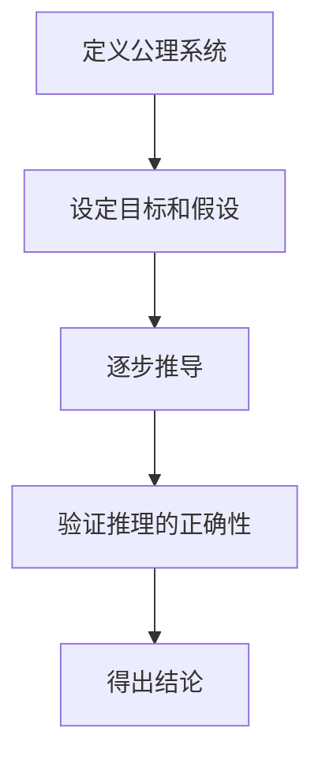

                 

### 文章标题

《数学语言的符号化与形式化》

> **关键词**：数学语言，符号化，形式化，数学推理，形式化系统

> **摘要**：本文旨在探讨数学语言的符号化与形式化，介绍其基本概念、方法及其在数学及其应用中的重要地位。通过详细的论述和分析，本文揭示了符号化与形式化对数学理论和应用的价值，并展望了其未来发展的方向。

----------------------------------------------------------------

### 数学语言的符号化与形式化

#### 数学语言的符号化与形式化的重要性

数学语言的符号化与形式化是数学发展的重要里程碑，它极大地推动了数学理论的严密性和科学性。符号化使得数学表达简洁明了，形式化则确保了数学推理的严密性。这两者相辅相成，共同构成了现代数学的基石。

符号化是将自然语言中的数学概念和表述转化为符号语言的过程。它使得数学表达更加简洁、准确，便于处理和推理。例如，使用符号 `∈` 表示元素属于集合，使用 `⊆` 表示集合的包含关系。

形式化则是在符号化的基础上，将数学理论转化为形式系统。形式系统包括公理、推理规则和定理，使得数学推理过程具有严格的形式化性质。形式化确保了数学推理的严谨性，使得数学理论更加可靠。

#### 数学语言的符号化与形式化的发展历程

数学语言的符号化与形式化有着悠久的发展历程。从古代的算术符号，到近代的代数符号，再到现代的形式逻辑和形式化数学系统，符号化和形式化不断演进，使得数学表达更加精确和严密。

- **古代数学**：古代数学使用的是自然语言和文字符号，例如古希腊的数学家使用的是文字表述，而阿拉伯数字的引入则是数学符号化的重要一步。

- **近代数学**：17世纪，随着微积分的发展，数学符号化得到了极大的推动。莱布尼茨和牛顿等数学家引入了微分和积分的符号，使得微积分的表述更加简洁。

- **现代数学**：20世纪初，形式化数学系统开始出现。希尔伯特、罗素等数学家致力于将数学理论形式化，建立了形式化公理系统和形式化推理规则。

#### 数学语言的符号化与形式化在数学及其应用中的地位

数学语言的符号化与形式化在数学及其应用中具有重要地位。

- **数学理论**：符号化与形式化使得数学理论更加严密，推理更加严谨，提高了数学理论的可信度和可靠性。

- **数学应用**：符号化与形式化为数学应用提供了坚实的理论基础。例如，在物理学、计算机科学、经济学等领域，符号化与形式化的数学工具被广泛应用于建模和分析。

- **教育**：符号化与形式化对数学教育也有重要影响。它使得数学教学更加系统和规范，有助于学生理解和掌握数学概念和推理方法。

#### 核心概念与联系

**符号化**与**形式化**是数学语言中的两个核心概念，它们之间存在紧密的联系。

- **符号化**是将自然语言中的数学概念转化为符号语言的过程。它为形式化提供了基础，使得数学表达更加简洁、准确。
- **形式化**是将数学理论转化为形式系统，使得数学推理具有严格的形式化性质。形式化是基于符号化的进一步抽象和规范化。

符号化与形式化的关系可以用一个简单的流程图来表示：

```
自然语言
  ↓
符号语言
  ↓
形式化系统
```

通过上述流程，数学概念从自然语言表述转化为符号语言，再通过形式化转化为形式系统，从而实现了数学理论的严密性和科学性。

#### 数学符号化与形式化的方法

数学符号化与形式化有多个方法，主要包括符号表示法、符号化规则、形式化公理系统、形式化推理规则等。

- **符号表示法**：使用特定的符号来表示数学概念和数学对象，例如使用 `∈` 表示元素属于集合，使用 `⊆` 表示集合之间的包含关系。
- **符号化规则**：规定特定的符号使用规则，以确保符号表示的统一和标准化，例如规定变量的优先级高于常数，运算符的使用顺序等。
- **形式化公理系统**：建立形式化的公理系统，包括公理、推理规则和定理，使得数学理论具有形式化的性质。
- **形式化推理规则**：规定形式化推理的规则，以确保推理过程的严密性，例如使用演绎推理规则、归纳推理规则等。

这些方法共同构成了数学符号化与形式化的基础，为数学理论和应用提供了强有力的支持。

#### 符号化方法

符号化是将自然语言表达的数学概念转换为符号语言的过程。符号化方法主要包括符号表示法和符号化规则。

##### 符号表示法

符号表示法是指使用特定的符号来表示数学概念和数学对象。符号表示法使得数学表达更加简洁、准确，便于处理和推理。以下是一些常用的数学符号表示法：

- **集合**：使用大写字母表示集合，例如 `A`、`B`、`C` 等。
- **元素**：使用小写字母表示集合中的元素，例如 `a`、`b`、`c` 等。
- **属于**：使用 `∈` 表示元素属于集合，例如 `a ∈ A` 表示 `a` 属于集合 `A`。
- **包含**：使用 `⊆` 表示集合之间的包含关系，例如 `A ⊆ B` 表示集合 `A` 包含于集合 `B`。
- **函数**：使用大写字母表示函数，例如 `f`、`g`、`h` 等。
- **自变量和因变量**：使用小写字母表示函数的自变量和因变量，例如 `x` 和 `y`。
- **导数**：使用符号 `′` 或 `′′` 表示导数，例如 `f′(x)` 表示函数 `f` 在点 `x` 处的导数。

##### 符号化规则

符号化规则是指规定特定的符号使用规则，以确保符号表示的统一和标准化。以下是一些常用的数学符号化规则：

- **变量的优先级**：在数学表达式中，变量的优先级高于常数。例如，表达式 `2 + x` 应先计算变量 `x` 的值，再与常数 `2` 相加。
- **运算符的使用顺序**：在数学表达式中，运算符的使用顺序应遵循先乘除后加减的原则。例如，表达式 `2 + 3 * 4` 应先计算乘法 `3 * 4`，再计算加法 `2 + 12`。
- **函数的表示**：在表示函数时，应先写自变量，再写因变量。例如，函数 `f(x)` 表示自变量 `x` 对应的因变量 `f(x)`。
- **括号的使用**：在数学表达式中，括号的使用应遵循从内到外的原则。例如，表达式 `(2 + 3) * 4` 应先计算括号内的加法 `2 + 3`，再计算乘法 `5 * 4`。

#### 形式化方法

形式化方法是指将数学理论转化为形式系统的方法。形式化方法主要包括形式化公理系统和形式化推理规则。

##### 形式化公理系统

形式化公理系统是指建立形式化的公理系统，包括公理、推理规则和定理，使得数学理论具有形式化的性质。以下是一个简单的形式化公理系统的示例：

- **公理 1**：存在一个空集合，记作 `{}`。
- **公理 2**：对于任意集合 `A`，存在一个包含所有集合的集合，记作 `U`。
- **公理 3**：对于任意集合 `A` 和 `B`，存在一个包含所有既属于 `A` 又属于 `B` 的元素的集合，记作 `A ∩ B`。
- **公理 4**：对于任意集合 `A` 和 `B`，存在一个包含所有属于 `A` 或属于 `B` 的元素的集合，记作 `A ∪ B`。

##### 形式化推理规则

形式化推理规则是指规定形式化推理的规则，以确保推理过程的严密性。以下是一些常用的形式化推理规则：

- **推理规则 1**：演绎推理规则，即从已知公理和定理推导出新定理。
- **推理规则 2**：归纳推理规则，即从特殊情况推导出一般情况。
- **推理规则 3**：反证法，即假设结论不成立，推导出矛盾，从而证明结论成立。

通过形式化公理系统和形式化推理规则，数学理论可以转化为形式系统，使得数学推理具有严格的形式化性质，从而提高了数学理论的可靠性和严密性。

### 基础数学符号化

#### 基础数学符号表示

在数学中，符号的使用是非常基础且必不可少的。符号化不仅使得数学表达更加简洁，还提高了数学推理的效率。以下是一些基础数学符号的表示。

##### 数学符号的基本分类

数学符号可以分为以下几类：

- **集合符号**：用于表示集合，如 `{}` 表示空集合，`∪` 表示集合的并集，`∩` 表示集合的交集等。
- **关系符号**：用于表示元素与集合之间的关系，如 `∈` 表示元素属于集合，`⊆` 表示集合是另一个集合的子集等。
- **函数符号**：用于表示函数，如 `f(x)` 表示函数 `f` 在 `x` 处的值。
- **运算符号**：用于表示数学运算，如 `+` 表示加法，`-` 表示减法，`*` 表示乘法，`/` 表示除法等。
- **逻辑符号**：用于表示逻辑关系，如 `∧` 表示逻辑与，`∨` 表示逻辑或，`¬` 表示逻辑非等。

##### 数的符号表示

数的符号表示是数学符号化的重要部分。以下是一些常见的数的符号表示：

- **自然数**：自然数通常用大写字母 `N` 表示，例如 `N = {1, 2, 3, ...}`。
- **整数**：整数包括正整数、负整数和零，通常用大写字母 `Z` 表示，例如 `Z = {..., -3, -2, -1, 0, 1, 2, 3, ...}`。
- **有理数**：有理数是可以表示为两个整数之比的数，通常用大写字母 `Q` 表示，例如 `Q = {p/q | p, q ∈ Z, q ≠ 0}`。
- **实数**：实数包括有理数和无理数，通常用大写字母 `R` 表示，例如 `R = Q ∪ R_无理`。
- **复数**：复数由实部和虚部组成，通常用大写字母 `C` 表示，例如 `C = R + iR`，其中 `i` 是虚数单位，满足 `i^2 = -1`。

##### 函数的符号表示

函数的符号表示是数学符号化的重要组成部分。以下是一些常见的函数符号表示：

- **函数定义**：通常用大写字母表示函数，如 `f`、`g`、`h` 等。用小写字母表示自变量和因变量，如 `x`、`y`、`z` 等。例如，函数 `f(x)` 表示在自变量 `x` 处的因变量 `f(x)`。
- **函数关系**：用箭头表示函数关系，如 `f: X → Y` 表示函数 `f` 从集合 `X` 映射到集合 `Y`。
- **函数性质**：用特定的符号表示函数的性质，如 `f(x) = g(x)` 表示函数 `f` 和 `g` 在 `x` 处的值相等，`f(x) > g(x)` 表示函数 `f` 在 `x` 处的值大于函数 `g` 在 `x` 处的值。

#### 数学公式的符号化

数学公式是数学表达的核心，符号化使得数学公式更加简洁、易于理解和计算。以下是一些基础数学公式的符号化表示。

##### 基础数学公式的符号化

- **加法公式**：$a + b = c$
- **减法公式**：$a - b = c$
- **乘法公式**：$a * b = c$
- **除法公式**：$\frac{a}{b} = c$
- **平方公式**：$a^2 = b$
- **立方公式**：$a^3 = b$
- **开方公式**：$\sqrt{a} = b$

##### 常用数学公式的符号化表示

- **三角函数公式**：$\sin(x) = \frac{\text{对边}}{\text{斜边}}$，$\cos(x) = \frac{\text{邻边}}{\text{斜边}}$，$\tan(x) = \frac{\text{对边}}{\text{邻边}}$
- **指数函数公式**：$a^x = b$
- **对数函数公式**：$\log_a(x) = y$

#### 数学符号化在实际应用中的例子

数学符号化在数学研究和教学中有广泛的应用。以下是一些实际应用中的例子。

##### 数学符号化在数学研究和教学中的应用

- **数学研究**：数学符号化使得数学研究更加简洁、高效。例如，在代数学中，符号化使得群、环、域等概念的表达更加清晰。在拓扑学中，符号化使得拓扑空间、连续性、同胚等概念的表达更加直观。
- **数学教学**：数学符号化有助于学生理解和掌握数学概念。通过符号化，数学表达更加简洁，有助于学生理解数学的本质。例如，在微积分教学中，符号化使得导数、积分等概念的表达更加直观。

##### 数学符号化在其他学科中的应用

- **物理学**：数学符号化在物理学中有着广泛的应用。例如，在经典力学中，数学符号化使得牛顿运动定律、万有引力定律等表达更加简洁。在量子力学中，数学符号化使得薛定谔方程、波函数等概念的表达更加直观。
- **计算机科学**：数学符号化在计算机科学中有着重要的应用。例如，在算法分析中，数学符号化使得时间复杂度和空间复杂度的表示更加清晰。在形式化验证中，数学符号化使得程序的正确性证明更加严谨。

#### 符号化在数学及其应用中的重要性

符号化在数学及其应用中具有重要性，主要体现在以下几个方面：

- **简洁性**：符号化使得数学表达更加简洁，有助于提高数学推理的效率。
- **准确性**：符号化使得数学表达更加准确，减少了歧义和误解。
- **普遍性**：符号化使得数学概念和公式具有普遍性，可以应用于不同的数学领域和学科。
- **系统性**：符号化有助于构建数学理论体系，使得数学理论更加系统和完整。

### 形式化数学系统

#### 形式化数学系统基本概念

形式化数学系统是指通过严格的形式化方法建立的数学理论体系。形式化数学系统具有以下基本概念：

- **形式化语言**：形式化数学系统使用形式化语言来表示数学概念和定理。形式化语言包括符号、公式和规则。
- **形式化公理**：形式化数学系统中的公理是无需证明的基本真理。公理构成了形式化数学系统的基础。
- **形式化推理规则**：形式化数学系统中的推理规则是用于推导新定理的规则。推理规则保证了形式化数学系统的推理过程是严格和有效的。

#### 形式化数学系统的发展

形式化数学系统的发展可以追溯到20世纪初。以下是形式化数学系统发展的几个重要阶段：

- **集合论的形式化**：集合论是数学的基础，其形式化是形式化数学系统发展的关键。康托尔、策梅洛、罗素等数学家在集合论的基础上建立了形式化的集合论系统，如ZFC（Zermelo-Fraenkel集合论公理系统）。
- **类型论的形式化**：类型论是一种形式化的逻辑系统，用于解决形式化数学系统中的类型安全问题。类型论通过引入类型概念，保证了形式化数学系统中表达式的类型一致性。
- **赖特希尔逻辑的形式化**：赖特希尔逻辑是一种形式化的证明系统，用于验证数学证明的正确性。赖特希尔逻辑通过严格的推理规则，确保了数学证明的有效性。

#### 形式化数学系统在实际应用中的例子

形式化数学系统在数学及其应用中有广泛的应用。以下是一些实际应用中的例子：

- **数学证明自动化**：形式化数学系统可以用于自动化数学证明。通过形式化推理规则和证明工具，计算机可以自动验证数学证明的正确性，从而提高数学证明的效率。
- **计算机科学**：形式化数学系统在计算机科学中有着重要的应用。例如，在形式化验证中，形式化数学系统用于验证程序的正确性。在算法设计中，形式化数学系统用于分析算法的时间和空间复杂度。
- **人工智能**：形式化数学系统在人工智能领域有着广泛的应用。例如，在机器学习理论中，形式化数学系统用于分析学习算法的收敛性。在自然语言处理中，形式化数学系统用于分析语言模型和文本表示。

### 形式化数学系统在数学证明自动化中的应用

形式化数学系统在数学证明自动化中具有重要的应用价值。通过形式化推理规则和证明工具，计算机可以自动验证数学证明的正确性，从而大大提高数学证明的效率。以下是形式化数学系统在数学证明自动化中的应用例子：

1. **定理证明器**：定理证明器是一种计算机程序，它使用形式化数学系统来验证数学定理的正确性。例如，Coq、Isabelle等定理证明器可以自动验证数学定理，从而提高数学证明的效率。

2. **证明搜索**：证明搜索是一种利用形式化数学系统进行证明的方法。通过形式化推理规则和搜索算法，计算机可以自动搜索证明过程，找到数学定理的证明。例如，Risse等人的证明搜索算法可以用于自动证明复杂的数学定理。

3. **数学教育**：形式化数学系统在数学教育中也有重要的应用。通过形式化数学系统，学生可以更好地理解和掌握数学概念和定理。例如，使用形式化数学系统进行数学教学，可以让学生更直观地理解数学概念，提高数学学习的效率。

### 形式化数学系统在计算机科学中的应用

形式化数学系统在计算机科学中有着广泛的应用，特别是在形式化验证、算法分析和软件工程等领域。以下是形式化数学系统在计算机科学中的应用例子：

1. **形式化验证**：形式化验证是一种使用形式化数学系统来验证程序、硬件设计和系统模型的正确性。通过形式化推理规则和验证工具，计算机可以自动验证系统的性质，从而提高系统的可靠性和安全性。例如，使用形式化数学系统验证嵌入式系统的正确性和安全性，是现代工业和军事领域的重要应用。

2. **算法分析**：形式化数学系统在算法分析中用于分析算法的时间复杂度和空间复杂度。通过形式化数学系统，可以精确地描述算法的性能，为算法的设计和优化提供理论支持。例如，使用形式化数学系统分析排序算法的复杂度，是计算机科学中重要的研究方向。

3. **软件工程**：形式化数学系统在软件工程中用于验证软件的正确性和可靠性。通过形式化数学系统，可以建立软件的形式化规格说明，从而确保软件的设计和实现符合规格说明。例如，使用形式化数学系统进行飞机飞行控制软件的验证，是航空领域的重要应用。

### 形式化数学系统在数学证明中的应用

形式化数学系统在数学证明中有着重要的应用，它使得数学证明过程更加严谨和自动化。以下是形式化数学系统在数学证明中的应用：

1. **证明器工具**：形式化数学系统提供了证明器工具，如Coq、Isabelle等，这些工具可以自动验证数学证明的正确性。通过形式化推理规则和证明器工具，数学家可以更高效地完成数学证明。

2. **证明自动化**：形式化数学系统可以自动化数学证明的过程。通过形式化推理规则和证明自动化工具，计算机可以自动完成一些复杂的数学证明。例如，Risse等人的证明搜索算法可以自动搜索数学定理的证明过程。

3. **证明检查**：形式化数学系统可以用于检查数学证明的正确性。通过形式化推理规则和证明验证工具，数学家可以验证他人的数学证明是否正确。例如，使用形式化数学系统验证他人提交的数学论文的正确性，是学术领域的重要应用。

#### 数学推理的基本概念

数学推理是数学思维的核心，它是指通过一系列逻辑步骤，从一个或多个已知事实推导出另一个新事实的过程。数学推理包括两个主要形式：演绎推理和归纳推理。

1. **演绎推理**：演绎推理是一种从一般到特殊的推理方式。它的基本形式是三段论，即：
   - 大前提：所有A都是B。
   - 小前提：C是A。
   - 结论：C是B。
   演绎推理的特点是结论的逻辑必然性，即如果前提是真的，那么结论也必然是真的。

2. **归纳推理**：归纳推理是一种从特殊到一般的推理方式。它通过观察一系列具体实例，试图总结出一般规律。归纳推理的特点是结论的概率性，即结论可能正确，但不具有逻辑上的必然性。

#### 数学推理的基本形式

1. **演绎推理**：
   - **条件推理**：从一个条件推出另一个结论。例如，如果今天是星期五，那么明天是星期六。
   - **反证法**：假设某个命题不成立，然后推导出矛盾，从而证明原命题成立。例如，要证明“所有天鹅都是白色的”，可以通过反证法，假设存在非白色的天鹅，然后推导出矛盾。

2. **归纳推理**：
   - **完全归纳法**：通过证明对于所有自然数都成立来证明一个命题。例如，要证明“所有自然数都能被2整除”，可以通过完全归纳法证明。
   - **部分归纳法**：通过证明一个命题对于某个初始值成立，并且对于任意一个使命题成立的值，其后继值也成立来证明。例如，要证明“所有偶数都是2的倍数”，可以通过部分归纳法证明。

#### 符号化推理的基本规则

符号化推理是数学推理的一种形式化表示，它使用数学符号和逻辑公式来表示推理过程。以下是一些基本的符号化推理规则：

1. **定义规则**：用符号表示数学概念和定义。例如，用符号 `P(x)` 表示“x是质数”，用符号 `∀x P(x)` 表示“所有x都是质数”。

2. **逻辑推理规则**：
   - **合取律**：（P ∧ Q）→ P
   - **析取律**：（P ∨ Q）→ P
   - **交换律**：P ∧ Q = Q ∧ P
   - **结合律**：（P ∧ Q）∧ R = P ∧ （Q ∧ R）
   - **分配律**：P ∧ （Q ∨ R）= （P ∧ Q） ∨ （P ∧ R）
   - **逆否律**：（¬P → ¬Q）→ （Q → P）
   - **同一律**：P ∧ T = P
   - **矛盾律**：P ∧ ¬P = F

3. **量化推理规则**：
   - **全称量化**：∀x P(x) → P(c)，其中c是任意具体的对象。
   - **存在量化**：∃x P(x) → P(c)，其中c是满足P(x)的一个具体的对象。

#### 符号化推理的方法

符号化推理的方法主要包括以下几种：

1. **直接推理**：通过直接应用定义和逻辑推理规则，从已知前提推导出结论。例如，从定义P和Q，使用合取律和析取律推导出P ∧ Q和P ∨ Q。

2. **间接推理**：通过反证法或构造性证明，从已知前提推导出结论。例如，使用反证法证明一个命题P不成立，然后推导出¬P成立。

3. **递归推理**：通过递归定义和递归推理规则，从初始条件推导出一般情况。例如，使用数学归纳法证明一个命题P对于所有自然数n成立。

符号化推理方法使得数学推理过程更加清晰、系统，提高了推理的可靠性。通过符号化推理，数学家可以更加严谨地处理复杂的问题，并逐步发展出更加深刻的数学理论。

### 形式化推理在数学证明中的应用

形式化推理是数学证明中的一个重要工具，它使得数学证明过程更加严谨和系统。形式化推理通过形式化的公理系统和严格的推理规则，确保了数学证明的逻辑正确性。以下将详细讨论形式化推理在数学证明中的应用。

#### 形式化推理的基本步骤

形式化推理通常包括以下几个基本步骤：

1. **定义公理系统**：首先，需要定义一个形式化的公理系统，包括一组公理和一组推理规则。公理是无需证明的基本真理，推理规则用于从已知公理推导出新的结论。

2. **设定目标和假设**：在形式化推理中，需要明确要证明的命题（目标）以及可以使用的已知条件和假设。

3. **逐步推导**：使用推理规则，从已知条件和假设出发，逐步推导出目标命题。每个推导步骤都需要依据公理或推理规则，确保推理过程的严格性。

4. **验证推理的正确性**：在完成推导后，需要验证整个推理过程的逻辑正确性，确保每一步都是有效的。

#### 形式化推理的应用示例

以下是一个简单的形式化推理应用示例：

**目标**：证明命题P：“所有偶数都是2的倍数”。

**公理系统**：
- 公理1：所有整数都是偶数或奇数。
- 公理2：如果一个数是偶数，那么它可以表示为2的倍数。

**推理过程**：

1. **设定假设**：假设n是一个偶数。
2. **应用公理1**：由n是偶数，根据公理1，n是偶数或奇数。因为n已经是偶数，所以可以忽略奇数的情况。
3. **应用公理2**：由于n是偶数，根据公理2，n可以表示为2的倍数。
4. **得出结论**：因此，n是一个2的倍数。

通过这个简单的例子，我们可以看到形式化推理是如何通过明确的公理系统和推理规则，来确保数学证明的逻辑正确性。

#### 形式化推理的优缺点

**优点**：

1. **逻辑严谨**：形式化推理通过明确的公理和严格的推理规则，确保了推理过程的逻辑严谨性，减少了推理过程中的错误。

2. **可验证性**：形式化推理的每一步都可以被验证，从而提高了证明的可信度。这使得形式化推理在形式化验证和自动化证明中具有重要作用。

3. **通用性**：形式化推理可以应用于各种数学领域和问题，它提供了一种通用的方法来处理复杂的数学问题。

**缺点**：

1. **复杂性**：形式化推理需要建立复杂的公理系统和推理规则，这增加了推理过程的理解和实现难度。

2. **人工参与**：尽管形式化推理可以自动化一些证明过程，但仍然需要人工设定目标、假设和验证推理的正确性，这限制了其在某些领域的应用。

#### 形式化推理在实际应用中的例子

1. **定理证明器**：定理证明器是一种使用形式化推理的计算机程序，它可以自动验证数学定理的正确性。例如，Coq和Isabelle等定理证明器广泛应用于数学、计算机科学和物理学等领域。

2. **形式化验证**：形式化验证是一种使用形式化推理的方法，用于验证程序、硬件设计和系统模型的正确性。例如，在航空领域，形式化验证被用于验证飞机飞行控制系统的正确性。

3. **形式化数学教育**：形式化推理在数学教育中也有应用，通过形式化推理的方法，可以更直观地理解和掌握数学概念和定理。

形式化推理在数学证明中的应用不仅提高了证明的严谨性和可靠性，还为数学的自动化和形式化验证提供了有力支持。通过形式化推理，数学家可以更加系统地研究复杂的数学问题，并推动数学理论的发展。

### 符号化与形式化在现代数学中的应用

#### 符号化与形式化在数学分析中的应用

在数学分析中，符号化与形式化起到了至关重要的作用，特别是在微积分和实分析领域。符号化使得复杂的微积分表达式变得更加简洁和易于处理，而形式化则确保了微积分理论的严密性和一致性。

1. **微积分的符号化**：微积分的符号化主要体现在对微分和积分符号的使用。例如，微分符号 `dx` 和 `dy` 表示自变量和因变量的微小变化，积分符号 `∫` 表示对某个函数在某个区间上的累积和。

2. **形式化微积分理论**：形式化微积分理论通过公理系统来定义微分和积分的概念，并建立相应的推理规则。例如，定义导数为函数在某点的极限，并通过极限的公理系统来推导导数的性质。

3. **应用实例**：在数学分析中，符号化与形式化用于解决各种实际问题，如求解微分方程、分析函数的性质、研究级数的收敛性等。

#### 符号化与形式化在代数中的应用

在代数中，符号化与形式化同样发挥了重要作用，尤其是在群、环、域等抽象代数结构的研究中。

1. **群论中的符号化**：群论中的符号化体现在对群的运算和性质的符号表示。例如，用 `*` 表示群的乘法运算，用 `e` 表示单位元素。

2. **形式化群论**：形式化群论通过定义群的公理系统，如封闭性、结合律、存在单位元素和逆元素等，来确保群理论的严密性。

3. **应用实例**：符号化与形式化在群论中的应用包括研究群的同态、同构、直积等概念，并在计算机科学和物理学等领域有广泛应用。

#### 符号化与形式化在几何学中的应用

在几何学中，符号化与形式化使得几何问题变得更加可计算和可证明。

1. **解析几何的符号化**：解析几何中的符号化主要体现在使用坐标系统和坐标表示几何对象。例如，点 `(x, y)` 表示平面上的点。

2. **形式化解析几何**：形式化解析几何通过建立欧几里得几何的公理系统，如平行公理、全等公理等，来确保几何理论的严密性。

3. **应用实例**：符号化与形式化在解析几何中的应用包括解决平面和空间中的距离、角度、面积等问题，并在计算机图形学和机器人学中有广泛应用。

### 符号化与形式化在其他学科中的应用

除了数学本身，符号化与形式化在其他学科中也得到了广泛应用。

#### 符号化与形式化在物理学中的应用

在物理学中，符号化与形式化用于建立物理定律和模型，特别是在量子力学和相对论中。

1. **量子力学的符号化**：量子力学的符号化体现在对波函数、算符和态的符号表示。例如，波函数用 `Ψ(x, y, z, t)` 表示。

2. **形式化量子力学**：形式化量子力学通过构建量子力学的公理系统，如态叠加原理、算符的对易关系等，来确保量子力学理论的严密性。

3. **应用实例**：符号化与形式化在物理学中的应用包括研究量子态的演化、量子纠缠等现象。

#### 符号化与形式化在计算机科学中的应用

在计算机科学中，符号化与形式化用于算法设计、程序验证和系统建模。

1. **算法设计中的符号化**：算法设计中的符号化体现在对时间复杂度和空间复杂度的符号表示。例如，时间复杂度用 `O(n)` 表示。

2. **形式化程序验证**：形式化程序验证通过形式化的方法来验证程序的正确性。例如，使用定理证明器来证明程序在特定输入下的正确行为。

3. **应用实例**：符号化与形式化在计算机科学中的应用包括开发安全协议、验证嵌入式系统、优化算法等。

### 总结

符号化与形式化是现代数学及其相关学科的重要工具，它们使得数学表达更加简洁和准确，推理过程更加严密和可靠。通过符号化与形式化，数学理论得到了严格的验证和系统的发展，为其他学科提供了坚实的理论基础。展望未来，符号化与形式化将在人工智能、数据科学、量子计算等领域发挥更加重要的作用，推动科学和技术的进步。

### 总结与展望

#### 数学语言的符号化与形式化的发展趋势

符号化与形式化是数学发展的两大基石，它们在数学理论的严谨性和科学性方面发挥了至关重要的作用。随着数学领域的不断扩展和深入，符号化与形式化的发展趋势也呈现出以下几个特点：

1. **更严格的公理体系**：为了确保数学理论的严密性，未来的公理体系将更加严格和完备。数学家们将继续努力完善现有的公理系统，如ZFC集合论，并探索新的公理系统，以应对更加复杂的数学问题。

2. **更多领域的形式化**：除了传统的数学领域，符号化与形式化正在逐渐扩展到其他学科，如物理学、计算机科学、经济学等。在这些领域中，形式化方法被用于建立严谨的理论框架和验证关键算法的正确性。

3. **自动化证明和验证**：随着计算机技术的发展，自动化证明和验证工具变得越来越重要。未来的数学研究将更多地依赖于计算机辅助证明，以提高证明的效率和准确性。

4. **跨学科合作**：符号化与形式化在跨学科合作中具有巨大的潜力。例如，在量子计算、人工智能、生物信息学等领域，数学的符号化与形式化方法可以为这些领域提供强有力的理论支持。

#### 数学语言的符号化与形式化在数学教育中的应用

数学教育是数学语言符号化与形式化的重要阵地。符号化与形式化在数学教育中的应用将主要体现在以下几个方面：

1. **教学工具的创新**：随着教育技术的进步，符号化与形式化将更多地应用于教学工具的创新。例如，使用计算机辅助教学软件来帮助学生理解复杂的数学概念和证明过程。

2. **教材的修订**：数学教材将更加注重符号化与形式化的应用。教材编写者将更注重使用统一的符号体系，以提高学生的理解和掌握程度。

3. **教学方法的变化**：符号化与形式化的引入将促使教学方法发生变革。例如，通过形式化推理来引导学生进行数学证明，通过符号化语言来构建数学模型，以提高学生的逻辑思维和解决问题的能力。

4. **在线教育平台**：在线教育平台将成为符号化与形式化教学的重要载体。通过在线课程和互动平台，学生可以随时随地学习数学符号化与形式化的知识，并进行实践和验证。

#### 数学语言的符号化与形式化未来的发展方向

符号化与形式化在未来的发展中，将继续朝着以下几个方向前进：

1. **形式化数学系统的扩展**：未来的形式化数学系统将更加丰富和多样化，以适应不同领域的需求。例如，发展新的类型论系统、范畴论形式化等。

2. **形式化推理工具的优化**：形式化推理工具将继续得到优化和改进，以提高推理的效率和理解度。例如，开发更智能的证明搜索算法、更直观的证明可视化工具等。

3. **人工智能的融合**：符号化与形式化将与人工智能技术深度融合，通过机器学习和自然语言处理技术，使得形式化推理过程更加自动化和智能化。

4. **跨学科应用**：符号化与形式化将在更多学科领域得到应用，如生物学、物理学、经济学等。这些学科将借鉴数学的符号化与形式化方法，构建更加严谨的理论体系。

### 附录

#### 附录 A: 数学符号化与形式化常用符号表

- **集合符号**：
  - `{}`：空集合
  - `∪`：并集
  - `∩`：交集
  - `∪`：补集
  - `∅`：空集

- **关系符号**：
  - `∈`：属于
  - `⊆`：子集
  - `≠`：不等于
  - `⊇`：超集
  - `∀`：全称量词
  - `∃`：存在量词

- **函数符号**：
  - `f(x)`：函数
  - `g(x)`：另一个函数
  - `h(x)`：另一个函数
  - `∫`：积分
  - `∏`：积

- **运算符号**：
  - `+`：加法
  - `-`：减法
  - `*`：乘法
  - `/`：除法
  - `^`：幂
  - `√`：开方

- **逻辑符号**：
  - `∧`：逻辑与
  - `∨`：逻辑或
  - `¬`：逻辑非
  - `→`：逻辑蕴涵
  - `↔`：逻辑等价

#### 附录 B: 数学符号化与形式化工具与应用资源

- **数学符号化与形式化工具**：
  - Coq：一种互动式定理证明器，广泛用于数学证明自动化。
  - Isabelle：一种基于归纳逻辑的定理证明器，应用于形式化验证和数学证明。
  - Lean：一种基于依赖类型的证明助手，支持形式化数学和逻辑。

- **数学符号化与形式化资源**：
  - 《形式化数学：基础与案例》（Formal Mathematics: Foundations and Case Studies）：一本关于形式化数学的入门书籍。
  - 《符号化数学导论》（An Introduction to Formal Mathematics）：一本介绍形式化数学基础的教材。
  - 《数学符号表》（Mathematical Symbols）：一个包含常见数学符号及其解释的在线资源。

#### 附录 C: 形式化数学系统中的 Mermaid 流程图

以下是一个简单的Mermaid流程图，展示了一个形式化证明的步骤：



这个流程图展示了从定义公理系统、设定目标和假设，到逐步推导、验证推理正确性，最终得出结论的整个过程。通过Mermaid流程图，可以直观地展示形式化推理的步骤和逻辑关系。```markdown```

