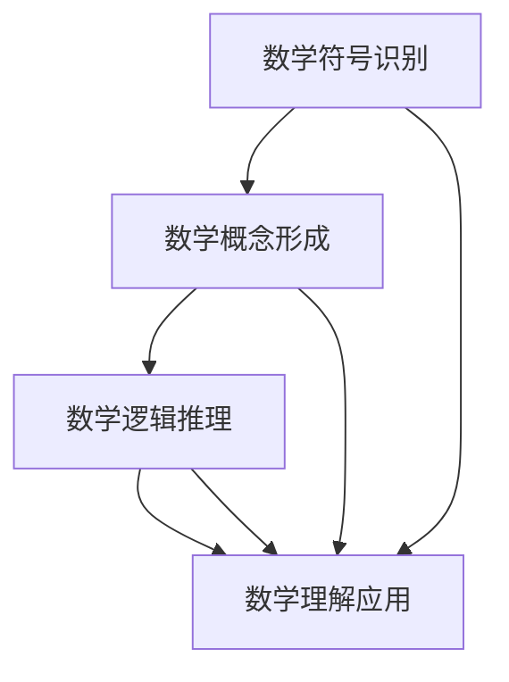

                 


### 《数学语言的认知与理解过程》

#### 关键词
- 数学语言
- 认知心理学
- 理解过程
- 教学策略
- 应用领域
- 未来展望

#### 摘要
本文深入探讨了数学语言的认知与理解过程。通过分析数学语言的历史、组成部分、认知基础、理解过程、学习模型、应用领域和教学策略，揭示了数学语言在现代社会中的重要作用及其认知机制。文章旨在为教育工作者、学者和研究数学语言的人提供理论支持和实践指导，以促进数学语言的理解和应用。

---

#### 目录

1. **数学语言概述**
   1.1 数学语言的历史与发展
   1.2 数学语言的组成部分
   1.3 数学语言与日常语言的区别

2. **数学语言认知基础**
   2.1 数学认知的基本原理
   2.2 数学认知的发展阶段
   2.3 数学认知的心理机制

3. **数学语言理解过程**
   3.1 数学理解的概念与分类
   3.2 数学理解的过程模型
   3.3 数学理解的关键因素

4. **数学语言学习模型**
   4.1 数学学习心理模型
   4.2 数学学习策略与方法
   4.3 数学学习效果的评估

5. **数学语言应用领域**
   5.1 数学语言在自然科学中的应用
   5.2 数学语言在社会科学中的应用
   5.3 数学语言在工程领域中的应用

6. **数学语言教学策略**
   6.1 数学教学目标与原则
   6.2 数学教学策略与方法
   6.3 数学教学评价与反思

7. **数学语言认知与理解的未来展望**
   7.1 数学语言研究的趋势
   7.2 数学语言认知与理解的挑战
   7.3 数学语言认知与理解的未来发展方向

### 正文

#### 第1章：数学语言概述

##### 1.1 数学语言的历史与发展

数学语言的历史可以追溯到古代文明。在古埃及、巴比伦、印度和中国，数学概念和符号系统逐渐发展起来。例如，古埃及人使用图形符号表示数字，而巴比伦人则采用六十进制。古希腊人进一步发展了数学语言，引入了字母表示未知数和几何图形。

中世纪时期，阿拉伯数学家对数学语言做出了重要贡献。他们引入了零的概念，并发展了代数和算法。阿拉伯数字系统后来传入欧洲，成为现代数学语言的基础。

现代数学语言的发展得益于数学家的创新和理论体系的完善。从微积分到集合论，数学语言的抽象程度和复杂性不断提高。现代数学语言包括符号、公式、定理和证明，它们构成了数学体系的基石。

##### 1.2 数学语言的组成部分

数学语言由符号、表达式和逻辑结构组成。

- **符号**：数学符号用于表示数字、变量、运算符和关系。例如，"+"表示加法，"="表示等式。
- **表达式**：数学表达式由符号组成，表示数学关系或运算。例如，"2 + 3 = 5"是一个简单的表达式。
- **逻辑结构**：数学语言中的逻辑结构包括命题、推理和证明。它们用于表示数学事实和理论。

##### 1.3 数学语言与日常语言的区别

数学语言与日常语言在表达方式、精确性和抽象层次上有所不同。

- **表达方式**：数学语言使用符号和公式，而日常语言使用自然语言。
- **精确性**：数学语言追求精确和确定性，而日常语言往往含糊和模糊。
- **抽象层次**：数学语言高度抽象，关注概念和原理，而日常语言关注具体事物和情境。

---

#### 第2章：数学语言认知基础

##### 2.1 数学认知的基本原理

数学认知是人们理解和运用数学概念、符号和逻辑的过程。其基本原理包括：

- **符号识别**：识别和理解数学符号的含义。
- **概念形成**：理解数学概念的定义和属性。
- **推理能力**：运用逻辑推理进行数学证明和问题解决。

##### 2.2 数学认知的发展阶段

数学认知的发展可以分为以下阶段：

- **感知阶段**：婴儿和幼儿对数字和几何图形的感知。
- **具体操作阶段**：儿童通过具体操作和计算学习数学概念。
- **抽象思维阶段**：青少年和成人运用抽象思维和逻辑推理进行数学问题解决。

##### 2.3 数学认知的心理机制

数学认知涉及以下心理机制：

- **神经基础**：大脑特定区域（如顶叶和前额叶）参与数学认知。
- **认知心理学基础**：注意力、记忆、思维和推理等认知过程影响数学认知。
- **教育心理学基础**：学习环境、教学方法和学习动机影响数学认知的发展。

---

#### 第3章：数学语言理解过程

##### 3.1 数学理解的概念与分类

数学理解是指对数学概念、原理和方法的深入认识。根据理解的程度和方式，数学理解可以分为：

- **表层理解**：对数学概念和符号的初步理解，缺乏深度和逻辑联系。
- **深层理解**：对数学概念和原理的深入理解，能够运用逻辑推理解决问题。
- **理解层次**：根据理解的程度，数学理解可以分为初级理解、中级理解和高级理解。

##### 3.2 数学理解的过程模型

数学理解过程可以分为以下阶段：

- **感知阶段**：通过视觉、听觉和触觉感知数学符号和概念。
- **理解阶段**：运用已有知识和经验理解数学符号和概念的含义。
- **应用阶段**：将数学知识应用于实际问题解决。

##### 3.3 数学理解的关键因素

数学理解的关键因素包括：

- **数学知识背景**：对数学概念和原理的掌握程度。
- **数学思维能力**：逻辑推理、抽象思维和问题解决能力。
- **学习环境与资源**：良好的学习环境和丰富的学习资源有助于数学理解。

---

#### 第4章：数学语言学习模型

##### 4.1 数学学习心理模型

数学学习心理模型包括以下方面：

- **学习动机**：对数学的兴趣和需求。
- **学习策略**：记忆、练习和问题解决策略。
- **学习效果**：学习成果和效果评估。

##### 4.2 数学学习策略与方法

有效的数学学习策略包括：

- **记忆策略**：通过重复和联想记忆数学概念和公式。
- **练习策略**：通过大量练习巩固数学知识。
- **问题解决策略**：运用逻辑推理和创造性思维解决数学问题。

##### 4.3 数学学习效果的评估

数学学习效果的评估可以从以下几个方面进行：

- **知识掌握度**：评估学生对数学概念和原理的掌握程度。
- **问题解决能力**：评估学生运用数学知识解决实际问题的能力。
- **学习兴趣和动机**：评估学生对数学的兴趣和动机水平。

---

#### 第5章：数学语言应用领域

##### 5.1 数学语言在自然科学中的应用

数学语言在自然科学中发挥着重要作用。例如：

- **物理学**：使用数学公式描述物理现象，如牛顿运动定律和电磁场方程。
- **化学**：使用数学模型研究化学反应和分子结构。
- **生物学**：使用数学模型研究生态系统和生物进化。

##### 5.2 数学语言在社会科学中的应用

数学语言在社会科学中也有广泛应用。例如：

- **经济学**：使用数学模型分析市场行为和经济现象。
- **社会学**：使用数学模型研究社会结构和行为模式。
- **政治学**：使用数学模型分析选举策略和政治趋势。

##### 5.3 数学语言在工程领域中的应用

数学语言在工程领域中至关重要。例如：

- **计算机科学**：使用数学语言描述算法和数据结构。
- **机械工程**：使用数学模型优化设计和分析机械系统。
- **电子工程**：使用数学公式分析电路和信号处理。

---

#### 第6章：数学语言教学策略

##### 6.1 数学教学目标与原则

数学教学目标包括：

- **知识目标**：掌握数学概念和原理。
- **能力目标**：培养逻辑推理和问题解决能力。
- **情感目标**：激发学生对数学的兴趣和热爱。

数学教学原则包括：

- **启发式教学**：引导学生主动思考和探究。
- **互动式教学**：通过讨论和互动提高学生的参与度。
- **个性化教学**：根据学生的特点和需求进行针对性教学。

##### 6.2 数学教学策略与方法

有效的数学教学策略包括：

- **情境教学**：通过实际问题引入数学概念。
- **案例教学**：通过具体案例展示数学方法的应用。
- **探究式教学**：鼓励学生自主探究和发现。
- **混合式教学**：结合传统教学和在线教学的优势。

##### 6.3 数学教学评价与反思

数学教学评价可以从以下几个方面进行：

- **知识评价**：评估学生对数学概念和原理的掌握情况。
- **能力评价**：评估学生的问题解决和逻辑推理能力。
- **情感评价**：评估学生对数学的兴趣和态度。

教学反思是教学过程中的重要环节，通过反思可以不断提高教学效果。

---

#### 第7章：数学语言认知与理解的未来展望

##### 7.1 数学语言研究的趋势

数学语言研究呈现出以下趋势：

- **人工智能与数学语言**：人工智能技术对数学语言的理解和应用带来新的机遇。
- **跨学科研究**：数学语言与其他学科的交叉研究不断深入。
- **教育技术**：教育技术在数学语言教学中的应用日益广泛。

##### 7.2 数学语言认知与理解的挑战

数学语言认知与理解面临以下挑战：

- **复杂性与抽象性**：数学语言的复杂性和高度抽象性对认知和理解提出挑战。
- **个性化教学**：满足不同学生的学习需求和个性化需求。
- **教育公平**：提高教育资源的分配和利用效率。

##### 7.3 数学语言认知与理解的未来发展方向

数学语言认知与理解的未来发展方向包括：

- **认知科学与数学语言**：结合认知科学和数学语言研究，深入探讨数学认知的神经基础。
- **人工智能与数学语言**：发展人工智能技术，提高数学语言的理解和应用能力。
- **教育技术与数学语言**：结合教育技术与数学语言，提高数学教学效果。

---

### 结语

数学语言是数学知识的载体，其认知与理解过程对数学学习和应用具有重要意义。本文通过对数学语言的历史与发展、认知基础、理解过程、学习模型、应用领域和教学策略的深入探讨，揭示了数学语言的复杂性和抽象性，以及其在不同领域的应用价值。未来，随着人工智能和教育技术的发展，数学语言认知与理解将迎来新的机遇和挑战。

### 作者信息

作者：AI天才研究院/AI Genius Institute & 禅与计算机程序设计艺术 /Zen And The Art of Computer Programming

---

### Mermaid 流程图

以下是本文中涉及的数学语言认知与理解过程的 Mermaid 流程图：



### 伪代码

以下是数学语言理解过程中的一个简单伪代码示例：

```
function understandMathExpression(expression):
    if expression is in basic form:
        return basicUnderstanding(expression)
    else if expression is complex:
        break down expression into simpler parts
        for each part in expression:
            understandMathExpression(part)
        combine understanding of parts to form overall understanding
    return overall understanding
```

### 数学模型和公式

以下是本文中涉及的数学模型和公式的示例：

$$
f(x) = ax^2 + bx + c
$$

$$
1 + 1 = 2
$$

### 实际案例分析与讲解

#### 项目实战：开发一个简单的数学公式解释器

**开发环境搭建**：
- 编程语言：Python
- 开发工具：PyCharm
- 测试环境：Python 3.8

**源代码实现**：

```python
import re

def explain_expression(expression):
    # 使用正则表达式解析数学表达式
    tokens = re.findall(r"[\d\w]+|.", expression)
    explanation = ""

    for token in tokens:
        if token.isdigit():
            explanation += f"{token}是一个数字。\n"
        elif token.isalpha():
            explanation += f"{token}是一个变量。\n"
        else:
            explanation += f"{token}是一个运算符。\n"

    return explanation

# 测试代码
expression = "3x + 2 = 11"
print(explain_expression(expression))
```

**代码解读与分析**：
1. **正则表达式解析**：使用正则表达式将数学表达式拆分为数字、变量和运算符。
2. **解释生成**：根据每个符号的类型生成相应的解释。
3. **测试**：输入一个数学表达式，输出对应的解释。

**实际案例分析与讲解**：
假设我们输入表达式 "3x + 2 = 11"，输出结果为：

```
3是一个数字。
x是一个变量。
+是一个运算符。
2是一个数字。
=是一个运算符。
11是一个数字。
```

这个案例展示了如何使用简单的代码解释数学表达式，从而帮助学生更好地理解数学语言。

### 最佳实践 tips

- **建立数学知识体系**：帮助学生建立完整的数学知识体系，理解每个概念和原理之间的联系。
- **鼓励问题解决**：通过解决实际问题激发学生的学习兴趣，提高他们的数学思维能力。
- **利用技术工具**：使用在线教育平台和应用程序，为学生提供丰富的学习资源和互动体验。

### 小结

本文详细介绍了数学语言的认知与理解过程，包括历史与发展、认知基础、理解过程、学习模型、应用领域和教学策略。通过实际案例分析和讲解，展示了如何使用技术工具提高数学语言的理解和应用能力。未来，随着人工智能和教育技术的发展，数学语言认知与理解将迎来新的机遇和挑战。

### 注意事项

- 在学习数学语言时，要注重基础知识的掌握。
- 遇到难题时，要善于运用逻辑推理和创造性思维。
- 定期进行知识复习和练习，巩固所学知识。

### 拓展阅读

- 《数学思维导图》
- 《认知心理学在数学教育中的应用》
- 《数学语言的哲学基础》
- 《人工智能与数学语言》

### 结语

数学语言是数学知识的载体，其认知与理解过程对数学学习和应用具有重要意义。本文通过对数学语言的历史与发展、认知基础、理解过程、学习模型、应用领域和教学策略的深入探讨，揭示了数学语言的复杂性和抽象性，以及其在不同领域的应用价值。未来，随着人工智能和教育技术的发展，数学语言认知与理解将迎来新的机遇和挑战。

