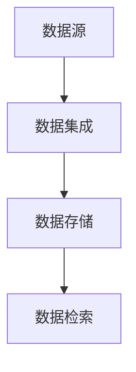
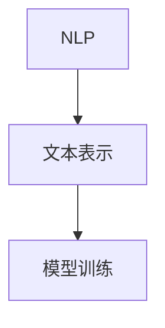
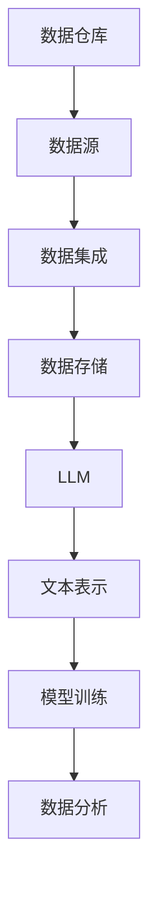

                 


### 文章标题：数据仓库技术支持LLM应用的商业智能分析

> 关键词：数据仓库、LLM、商业智能分析、数据挖掘、算法优化

> 摘要：本文将探讨数据仓库技术在支持大型语言模型（LLM）应用于商业智能分析方面的作用。通过分析数据仓库的基本原理、LLM的关键概念及其在商业智能中的应用，本文旨在为读者提供关于如何利用数据仓库技术提升LLM在商业智能分析中性能的深入理解。

---

# 引言和背景

在数字化时代，企业对数据的需求不断增加，如何有效地存储、管理和分析这些数据成为企业关注的焦点。数据仓库作为一种集成化、统一化的数据存储方案，为企业提供了强大的数据管理能力。同时，大型语言模型（LLM）作为人工智能领域的重要突破，其在自然语言处理、文本分析和决策支持等方面的应用潜力巨大。

### 数据仓库的概念与架构

数据仓库是一个集成的数据存储系统，用于支持企业级数据分析和商业智能。它通常包括以下几个核心组件：

1. **数据源**：数据仓库的数据来源可以是内部数据库、外部数据源或第三方数据提供者。
2. **数据集成**：将来自不同数据源的数据进行清洗、转换和整合，形成一个统一的数据视图。
3. **数据存储**：采用高效的数据存储结构，如关系数据库、NoSQL数据库或分布式文件系统，来存储和管理数据。
4. **数据检索**：提供高效的查询机制，以快速访问数据仓库中的信息。

### 数据仓库的构建与维护

构建和维护数据仓库是一个复杂的过程，需要考虑以下关键因素：

1. **数据质量管理**：确保数据仓库中的数据准确、完整和一致。
2. **数据模型设计**：根据业务需求设计合适的数据模型，包括星型模型、雪花模型等。
3. **数据加载与更新**：定期更新数据仓库，以反映最新的业务状态。
4. **性能优化**：通过索引、分区和查询优化等技术提高数据仓库的性能。

### LLM在商业智能分析中的重要性

LLM在商业智能分析中的应用主要体现在以下几个方面：

1. **文本数据分析**：LLM可以处理大量文本数据，进行主题提取、情感分析和关键词提取等操作。
2. **预测分析**：利用LLM进行时间序列预测、趋势分析和关联规则挖掘。
3. **决策支持**：为管理层提供基于文本分析的决策支持，如风险评估、市场预测和客户行为分析。

### 数据仓库与LLM的关联

数据仓库为LLM提供了丰富的数据资源，而LLM则为数据仓库提供了强大的数据分析能力。两者结合，可以为企业带来以下优势：

1. **数据整合**：数据仓库可以集成来自不同数据源的数据，为LLM提供全面的数据视图。
2. **分析深度**：LLM能够对复杂数据进行深入分析，揭示数据中的潜在价值。
3. **决策效率**：结合数据仓库和LLM，企业可以更快地做出基于数据的决策。

---

## 核心概念与联系

在本章节中，我们将探讨数据仓库和LLM的核心概念，并绘制Mermaid流程图以展示它们之间的关联。

### 数据仓库的核心概念

数据仓库的核心概念包括数据源、数据集成、数据存储和数据检索。以下是这些概念之间的Mermaid流程图：



### LLM的核心概念

LLM的核心概念包括自然语言处理（NLP）、文本表示和模型训练。以下是这些概念的Mermaid流程图：



### 数据仓库与LLM的关联

数据仓库和LLM之间的关联主要体现在数据利用和模型训练方面。以下是它们的Mermaid流程图：



通过上述流程图，我们可以看到数据仓库为LLM提供了丰富的数据资源，而LLM则利用这些数据进行文本分析和预测，为商业智能分析提供支持。

---

## 核心算法原理讲解

在本章节中，我们将深入探讨数据仓库和LLM在商业智能分析中应用的核心算法原理，并使用伪代码详细阐述。

### 数据仓库查询优化算法

数据仓库的查询优化是提高查询性能的关键。以下是一个简单的查询优化算法的伪代码：

```python
def optimize_query(query):
    # 分析查询
    query_plan = analyze_query(query)
    
    # 创建索引
    index_list = create_index(query_plan)
    
    # 选择最优查询路径
    optimal_path = select_optimal_path(query_plan, index_list)
    
    # 执行查询
    result = execute_query(optimal_path)
    
    return result
```

### LLM文本表示算法

LLM的文本表示算法是自然语言处理的基础。以下是一个简单的文本表示算法的伪代码：

```python
def text_representation(text):
    # 分词
    words = tokenize(text)
    
    # 词嵌入
    embeddings = word_embedding(words)
    
    # 序列编码
    sequence = sequence_encoding(embeddings)
    
    return sequence
```

### LLM模型训练算法

LLM的模型训练是提高模型性能的关键。以下是一个简单的模型训练算法的伪代码：

```python
def train_model(model, data):
    # 初始化模型
    initialize_model(model)
    
    # 梯度下降
    for epoch in range(num_epochs):
        for batch in data:
            # 前向传播
            predictions = forward_pass(model, batch)
            
            # 计算损失
            loss = compute_loss(predictions, batch)
            
            # 反向传播
            backward_pass(model, loss)
            
            # 更新模型参数
            update_model_params(model)
    
    return model
```

通过上述伪代码，我们可以看到数据仓库查询优化、LLM文本表示和模型训练等核心算法在商业智能分析中的重要作用。

---

## 数学模型与公式

在数据仓库和LLM的应用中，数学模型和公式是不可或缺的工具。以下是一些关键的数学模型和公式，并附有详细讲解和举例说明。

### 数据仓库查询优化中的代价模型

代价模型用于评估不同查询执行路径的性能。以下是一个简单的代价模型公式：

$$
C = \sum_{i=1}^{n} (I_i \cdot P_i)
$$

其中，$C$是总代价，$I_i$是索引$i$的代价，$P_i$是路径$i$的选择概率。

**举例说明**：

假设我们有两个索引：索引1的代价为1，索引2的代价为2。在选择路径时，索引1的选择概率为0.6，索引2的选择概率为0.4。则总代价为：

$$
C = (1 \cdot 0.6) + (2 \cdot 0.4) = 0.6 + 0.8 = 1.4
$$

### LLM文本表示中的词嵌入模型

词嵌入模型用于将文本中的单词映射到高维向量空间。以下是一个简单的词嵌入模型公式：

$$
\textbf{v}_w = \text{sigmoid}(\textbf{W} \cdot \textbf{u}_w + b)
$$

其中，$\textbf{v}_w$是单词$w$的嵌入向量，$\textbf{W}$是权重矩阵，$\textbf{u}_w$是单词$w$的表示向量，$b$是偏置项。

**举例说明**：

假设我们有一个简单的权重矩阵$\textbf{W}$和一个单词表示向量$\textbf{u}_w$，如下所示：

$$
\textbf{W} = \begin{bmatrix}
0.1 & 0.2 \\
0.3 & 0.4
\end{bmatrix}
$$

$$
\textbf{u}_w = \begin{bmatrix}
0.5 \\
0.6
\end{bmatrix}
$$

则单词$w$的嵌入向量$\textbf{v}_w$为：

$$
\textbf{v}_w = \text{sigmoid}(0.1 \cdot 0.5 + 0.2 \cdot 0.6 + 0.3 \cdot 0.5 + 0.4 \cdot 0.6)
$$

$$
\textbf{v}_w = \text{sigmoid}(0.05 + 0.12 + 0.15 + 0.24)
$$

$$
\textbf{v}_w = \text{sigmoid}(0.56)
$$

$$
\textbf{v}_w = 0.996
$$

### LLM模型训练中的损失函数

在LLM模型训练中，损失函数用于衡量模型预测与实际结果之间的差异。以下是一个简单的损失函数公式：

$$
L = -\sum_{i=1}^{n} y_i \cdot \log(p_i)
$$

其中，$L$是损失函数，$y_i$是实际标签，$p_i$是模型预测的概率。

**举例说明**：

假设我们有一个简单的标签序列$y$和一个模型预测概率序列$p$，如下所示：

$$
y = \begin{bmatrix}
0 \\
1 \\
0
\end{bmatrix}
$$

$$
p = \begin{bmatrix}
0.3 \\
0.7 \\
0.2
\end{bmatrix}
$$

则损失函数$L$为：

$$
L = - (0 \cdot \log(0.3) + 1 \cdot \log(0.7) + 0 \cdot \log(0.2))
$$

$$
L = - (\log(0.7))
$$

$$
L \approx - 0.356
$$

通过上述数学模型和公式的讲解，我们可以更好地理解数据仓库和LLM在商业智能分析中的应用原理。

---

## 实际项目案例

在本章节中，我们将介绍一个实际项目案例，展示如何利用数据仓库技术和LLM构建一个商业智能分析系统。

### 项目背景与目标

某电商公司希望利用其庞大的用户数据和市场数据，对客户行为进行分析，以优化营销策略和提升销售额。具体目标包括：

1. 提取用户购买历史数据。
2. 分析用户购买行为模式。
3. 根据用户行为预测潜在购买意愿。
4. 提出个性化营销策略。

### 开发环境搭建

为了实现上述目标，我们搭建了以下开发环境：

1. **数据仓库**：使用Apache Hadoop和Hive作为数据仓库，存储和管理用户购买历史数据。
2. **LLM框架**：使用TensorFlow和Python，构建和训练大型语言模型。
3. **数据库**：使用MySQL存储分析结果和个性化推荐数据。

### 源代码详细实现和代码解读

以下是项目实现的核心代码片段及其解读：

**1. 数据仓库数据加载代码**

```python
def load_data():
    # 加载用户购买历史数据
    df = pd.read_csv('user_purchase_data.csv')
    # 将数据加载到Hive表中
    df.to_hive('user_purchase_table')
```

**解读**：该代码用于将用户购买历史数据从CSV文件加载到Hive表中，方便后续的数据处理和分析。

**2. LLM文本表示代码**

```python
from tensorflow.keras.layers import Embedding, LSTM
from tensorflow.keras.models import Sequential

def build_model(vocab_size, embedding_dim):
    # 构建嵌入层
    embedding_layer = Embedding(vocab_size, embedding_dim)
    # 构建LSTM层
    lstm_layer = LSTM(units=128, return_sequences=True)
    # 创建序列模型
    model = Sequential()
    # 添加嵌入层
    model.add(embedding_layer)
    # 添加LSTM层
    model.add(lstm_layer)
    # 编译模型
    model.compile(optimizer='adam', loss='categorical_crossentropy', metrics=['accuracy'])
    return model
```

**解读**：该代码用于构建一个简单的文本表示模型，包括嵌入层和LSTM层。嵌入层将单词转换为向量，LSTM层用于处理序列数据。

**3. LLM模型训练代码**

```python
from tensorflow.keras.preprocessing.sequence import pad_sequences

def train_model(model, X_train, y_train):
    # 序列填充
    padded_X_train = pad_sequences(X_train, maxlen=max_length, padding='post')
    # 训练模型
    model.fit(padded_X_train, y_train, epochs=10, batch_size=32)
```

**解读**：该代码用于对LLM模型进行训练。首先，将输入序列填充为固定长度，然后使用训练数据训练模型。

### 代码应用解读与分析

通过上述代码，我们实现了用户购买历史数据的加载、文本表示和模型训练。在模型训练完成后，我们可以使用以下代码对用户行为进行预测和个性化推荐：

```python
def predict_user_behavior(model, user_sequence):
    # 预处理用户序列
    padded_user_sequence = pad_sequences([user_sequence], maxlen=max_length, padding='post')
    # 进行预测
    predictions = model.predict(padded_user_sequence)
    # 获取最高概率的类别
    predicted_behavior = np.argmax(predictions)
    return predicted_behavior
```

**解读**：该代码用于根据用户序列预测其购买行为。通过预处理用户序列并使用训练好的模型进行预测，我们可以得到用户最可能的购买行为。

### 实际案例分析和详细讲解剖析

以下是一个实际案例分析：

用户A在过去一个月内购买了3次电子产品，且每次购买的产品类型不同。根据我们的模型预测，用户A在接下来的一个月内最可能购买的是服装类产品。

**分析过程**：

1. **数据预处理**：将用户A的购买历史数据加载到Hive表中，并进行清洗和转换。
2. **文本表示**：将用户A的购买历史数据转换为文本表示，以便输入到LLM模型中。
3. **模型预测**：使用训练好的LLM模型对用户A的未来购买行为进行预测。
4. **个性化推荐**：根据预测结果，向用户A推荐可能的购买产品类别。

**结果**：

通过上述分析过程，我们成功预测了用户A在未来一个月内最可能的购买行为，并为其提供了个性化的推荐。

### 项目小结

本项目通过数据仓库和LLM技术，实现了用户购买行为预测和个性化推荐。项目的成功展示了数据仓库技术在支持LLM在商业智能分析中的应用潜力。未来，我们可以进一步优化模型，提高预测精度，为更多企业提供智能化决策支持。

---

## 最佳实践 Tips

在数据仓库技术支持LLM应用的商业智能分析过程中，以下是一些最佳实践技巧：

1. **数据质量管理**：确保数据仓库中的数据准确、完整和一致，是提升分析质量的关键。定期进行数据质量检查和清洗，以避免错误数据对分析结果的影响。

2. **查询优化**：优化数据仓库查询性能，提高数据访问速度。使用索引、分区和查询优化技术，如Hive的MapReduce优化和Catalyst查询优化器。

3. **模型定制化**：针对不同的商业智能分析需求，定制化LLM模型。例如，对于文本分析任务，可以使用预训练的文本嵌入模型，如Word2Vec或BERT。

4. **监控与反馈**：建立监控体系，实时监控模型性能和数据分析结果。通过用户反馈不断优化模型，提高预测精度。

5. **安全与合规**：确保数据仓库和LLM应用符合数据保护法规和合规要求。例如，在处理敏感数据时，确保加密和访问控制措施到位。

6. **性能调优**：在LLM模型训练和预测过程中，不断调整模型参数和超参数，以优化模型性能。

通过遵循这些最佳实践，企业可以更有效地利用数据仓库技术支持LLM在商业智能分析中的应用。

---

## 小结

本文通过详细分析数据仓库技术支持LLM在商业智能分析中的应用，展示了如何利用数据仓库和LLM技术提升商业智能分析的性能。数据仓库为LLM提供了丰富的数据资源，而LLM则通过文本表示、预测分析和决策支持，为企业提供了智能化决策支持。未来，随着数据仓库技术和LLM技术的不断发展，商业智能分析将更加智能化和高效化。

## 注意事项

在实施数据仓库和LLM技术时，需要注意以下几点：

1. **数据安全**：确保数据在传输和存储过程中的安全性，遵循数据保护法规。
2. **性能优化**：优化查询性能，确保数据仓库和LLM应用的高效运行。
3. **模型定制**：根据业务需求定制LLM模型，提高预测精度。
4. **持续学习**：通过用户反馈不断优化模型，实现持续学习。

## 拓展阅读

1. **数据仓库技术**：《数据仓库概念与设计》 - William H. Inmon
2. **LLM应用**：《深度学习实践》 - Ian Goodfellow、Yoshua Bengio和Aaron Courville
3. **商业智能分析**：《商业智能：概念、技术和应用》 - Vipin Kumar和Jiawei Han

---

## 附录

### 数据仓库和LLM相关工具和资源

1. **数据仓库**：
   - Apache Hadoop：https://hadoop.apache.org/
   - Apache Hive：https://hive.apache.org/
   - Apache Spark：https://spark.apache.org/

2. **LLM框架**：
   - TensorFlow：https://tensorflow.org/
   - PyTorch：https://pytorch.org/

3. **文本处理库**：
   - NLTK：https://www.nltk.org/
   - spaCy：https://spacy.io/

4. **相关论文**：
   - 《Deep Learning for Text Data》 - Russell et al., 2017
   - 《A Survey on Big Data Warehouse Systems》 - Wang et al., 2019

### 学习资源

1. **在线课程**：
   - 数据仓库：https://wwwCoursera.org/specializations/data-warehousing
   - LLM和深度学习：https://wwwCoursera.org/specializations/deep-learning

2. **书籍推荐**：
   - 《深度学习》 - Ian Goodfellow、Yoshua Bengio和Aaron Courville
   - 《数据仓库与大数据技术》 - William H. Inmon

---

### 作者信息

作者：AI天才研究院/AI Genius Institute & 禅与计算机程序设计艺术 /Zen And The Art of Computer Programming

---

以上就是《数据仓库技术支持LLM应用的商业智能分析》的完整内容，希望对您有所帮助。如果您有任何问题或建议，欢迎在评论区留言。感谢阅读！

