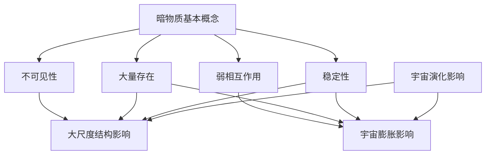
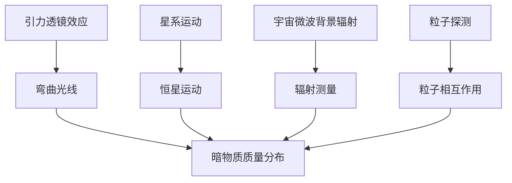

                 

### 第1章 引言

宇宙是一个庞大而复杂的体系，从宏观的星系、星云到微观的原子、基本粒子，每个层次都有其独特的物理现象和规律。然而，随着对宇宙认识的不断深入，科学家们发现宇宙中存在一种神秘的物质——暗物质（Dark Matter）。暗物质是宇宙的重要组成部分，但其本身不发光、不吸光，无法通过传统的光学手段直接观测。尽管如此，暗物质的存在和分布对理解宇宙的演化、结构形成以及宇宙的大尺度特性具有重要意义。

数据分析在科学研究中的重要性不言而喻。它不仅能够从海量数据中提取有价值的信息，还能揭示出隐藏在数据背后的规律和模式。在宇宙暗物质分布研究中，数据分析扮演着至关重要的角色。通过数据分析，科学家们能够从观测数据中识别出暗物质的分布特征，从而验证或修正现有的理论模型。

本章将首先介绍宇宙暗物质的概念，阐述暗物质分布研究的意义，并探讨数据分析在其中的具体应用。接下来，我们将深入探讨宇宙暗物质的基本理论，包括暗物质的概念、探测方法和与宇宙演化的关系。随后，我们将关注数据采集与处理的过程，详细讲解数据采集、预处理和清洗的方法。然后，我们将详细介绍数据分析的方法与应用，包括描述性统计分析、聚类分析、相关性分析和回归分析。接着，我们将探讨暗物质分布模型的建立，从基本原理到模型选择，再到模型训练与验证。最后，我们将通过一个实战项目，展示数据分析在宇宙暗物质分布研究中的具体应用，并对未来的研究方向和应用前景进行展望。

### 1.1 宇宙暗物质的概念

宇宙暗物质（Dark Matter）是宇宙中一种不可见的物质，它不与电磁力相互作用，因此无法通过传统的光学、射电或红外等观测手段直接探测。暗物质的存在最早是在20世纪30年代由瑞士天文学家弗里茨·茨维基（Fritz Zwicky）在研究星系团的运动时发现的。他发现星系团的运动速度异常高，远超预期的值，这表明星系团中存在大量的质量，而这些质量无法通过已知的可见物质解释。为了解释这一现象，茨维基提出了暗物质的存在。

暗物质的基本特性可以概括为以下几点：

1. **不可见性**：暗物质不发光、不吸光，因此无法通过光学方法直接观测。它也不与电磁力发生相互作用，因此不会产生电磁辐射，这使得探测暗物质变得非常困难。

2. **弱相互作用**：暗物质与其他物质之间的相互作用非常微弱，主要通过与引力相互作用影响宇宙的演化。正是这种微弱的相互作用，使得科学家们通过观测引力效应间接地探测暗物质的存在。

3. **宇宙中的大量存在**：根据宇宙微波背景辐射（Cosmic Microwave Background Radiation, CMB）的测量结果，暗物质占据了宇宙总质量的大约27%，而普通物质（包括星系、星云、行星等）仅占大约5%，剩余的68%则是暗能量（Dark Energy）。

4. **稳定性**：暗物质粒子非常稳定，不会轻易衰变或与其他物质发生碰撞，这使得它们能够在宇宙中长时间存在。

暗物质的存在和性质对宇宙的演化产生了深远的影响。首先，暗物质通过引力作用影响星系和星系团的形成和演化，是宇宙结构形成的基石。其次，暗物质的存在帮助解释了宇宙的大尺度结构，如宇宙的大尺度流、宇宙的大尺度功率谱等。此外，暗物质还与宇宙的膨胀和宇宙的大尺度特性密切相关。

尽管暗物质的存在已被广泛接受，但其本质和组成仍然是物理学中的一大难题。目前，科学家们提出了多种暗物质候选粒子，如弱相互作用大质量粒子（Weakly Interacting Massive Particles, WIMPs）、轴子（Axions）等，但尚未找到直接的证据。探测暗物质是现代物理学和天文学的重要任务之一，也是未来科学研究的重要方向。

总之，宇宙暗物质是宇宙中一种神秘的物质，其不可见性、弱相互作用和宇宙中的大量存在使其在宇宙演化中扮演着关键角色。对暗物质的研究不仅有助于我们更深入地理解宇宙的本质，还可能揭示新的物理现象和规律。

### 1.2 暗物质分布的研究意义

暗物质分布研究在宇宙学中具有极其重要的意义，它不仅有助于我们理解宇宙的早期演化过程，还能揭示宇宙的大尺度结构和动力学特性。以下将从三个方面详细阐述暗物质分布研究的意义。

首先，暗物质分布研究有助于揭示宇宙的早期演化。宇宙从大爆炸诞生后，经历了数十亿年的演化，形成了复杂的结构，如星系、星系团和超星系团。这些结构的形成和演化过程与暗物质密切相关。通过研究暗物质的分布，科学家们可以追踪宇宙早期物质如何聚集和形成星系，以及这些星系如何通过暗物质引力相互作用形成更大的结构。这为我们理解宇宙的早期演化和宇宙结构的形成提供了关键信息。

其次，暗物质分布研究有助于揭示宇宙的大尺度结构。暗物质在宇宙中的分布并不是均匀的，而是呈现出高度非均匀的特性。这种非均匀分布形成了宇宙中的大尺度流和大规模结构，如大尺度网络状结构、宇宙中的空洞和超星系团等。这些大尺度结构是宇宙演化的直接证据，通过研究暗物质的分布，我们可以更好地理解宇宙的大尺度结构和动力学特性。

最后，暗物质分布研究有助于探测宇宙的引力性质。暗物质主要通过引力作用影响宇宙的演化，因此，对暗物质分布的研究实际上是对宇宙引力性质的一种探测。例如，通过观测暗物质的引力透镜效应，科学家们可以测量暗物质的质量和分布，从而验证引力理论和探测可能的引力异常。此外，暗物质分布研究还可以帮助我们了解宇宙的膨胀历史，从而探测宇宙的暗能量性质。

总的来说，暗物质分布研究在揭示宇宙早期演化、理解宇宙大尺度结构和探测宇宙引力性质方面具有重要意义。它不仅有助于我们更深入地理解宇宙的本质，还为解决当前宇宙学中的许多重要问题提供了新的线索和思路。随着观测技术和数据分析方法的不断进步，暗物质分布研究将在未来的宇宙学研究中扮演越来越重要的角色。

### 1.3 数据分析在暗物质研究中的应用

数据分析在宇宙暗物质研究中发挥着至关重要的作用，它不仅能够从海量观测数据中提取有价值的信息，还能帮助我们更好地理解暗物质的分布和演化。以下将从数据处理、数据分析方法和数据分析应用三个方面详细探讨数据分析在暗物质研究中的应用。

首先，数据处理是暗物质研究中的关键环节。暗物质无法直接观测，因此我们只能通过间接的观测手段，如引力透镜效应、微波背景辐射和星系运动等，来探测暗物质的存在和分布。这些观测数据通常包含了大量的噪声和不确定性，需要进行有效的数据处理才能提取有用的信息。数据处理包括数据采集、预处理和清洗等步骤。

1. **数据采集**：暗物质研究需要大量的观测数据，这些数据通常来自各种天文观测设备，如射电望远镜、光学望远镜和X射线望远镜等。采集到的数据格式多样，包括图像、光谱、时序数据等。数据采集需要确保数据的完整性和准确性。

2. **预处理**：预处理是对原始数据进行清洗和转换，以便后续分析。预处理步骤包括去除噪声、纠正仪器误差、数据归一化和数据格式转换等。例如，通过图像处理技术，可以去除图像中的噪声和干扰，提高图像的质量。

3. **数据清洗**：数据清洗是处理异常值、缺失值和重复值等不完整数据的过程。有效的数据清洗可以确保数据分析结果的可靠性。

其次，数据分析方法是暗物质研究的重要工具。常用的数据分析方法包括描述性统计分析、聚类分析、相关性分析和回归分析等。

1. **描述性统计分析**：描述性统计分析是对数据的基本统计特性进行描述，如均值、方差、标准差等。这种方法可以初步了解数据的分布和特征，为进一步的分析提供基础。

2. **聚类分析**：聚类分析是将数据分为不同的组或类，以揭示数据中的模式和结构。常见的聚类算法包括K-means、层次聚类和DBSCAN等。通过聚类分析，可以识别暗物质在不同区域或时间点的分布特征。

3. **相关性分析**：相关性分析是用来衡量两个变量之间线性关系的方法，如皮尔逊相关系数和斯皮尔曼相关系数等。相关性分析可以帮助我们理解不同变量之间的依赖关系，从而更好地解释暗物质的分布。

4. **回归分析**：回归分析是一种建立变量之间关系模型的方法，包括线性回归、多项式回归和逻辑回归等。通过回归分析，可以预测暗物质的分布，并验证理论模型。

最后，数据分析在暗物质研究中的应用非常广泛。通过数据分析，科学家们可以：

1. **探测暗物质**：利用引力透镜效应和星系运动等观测数据，通过数据分析方法可以探测暗物质的存在和分布。

2. **验证理论模型**：通过分析暗物质的分布特征，可以验证或修正现有的暗物质理论模型，如冷暗物质模型、热暗物质模型和超对称模型等。

3. **揭示宇宙演化规律**：通过分析暗物质在不同时间和空间尺度上的分布，可以揭示宇宙的演化规律，理解宇宙的结构和动力学特性。

4. **探索暗物质性质**：通过分析暗物质与其他物质的关系，可以探索暗物质的性质和组成，为解决暗物质之谜提供线索。

总之，数据分析在宇宙暗物质研究中扮演着关键角色，从数据采集、处理到分析方法的运用，再到实际应用，每一个环节都至关重要。随着观测技术和数据分析方法的不断进步，数据分析将在未来的暗物质研究中发挥更加重要的作用，帮助我们更深入地理解宇宙的本质。

### 1.4 数据分析工具和资源

在宇宙暗物质研究中，数据分析工具和资源的多样性和强大功能为科学家们提供了有力的支持。以下将介绍几种常用的数据分析工具和资源，并讨论如何选择和使用这些工具。

#### 常用数据分析工具

1. **Python**：Python是一种广泛使用的编程语言，尤其在科学计算和数据分析领域有着极高的知名度。Python具有丰富的科学计算库，如NumPy、SciPy和Pandas等，可以方便地进行数据预处理、描述性统计分析和建模。

2. **MATLAB**：MATLAB是专业的数学计算和数据分析软件，特别适用于复杂的数据可视化和算法开发。MATLAB拥有丰富的工具箱，如MATLAB Statistical Toolbox和MATLAB Machine Learning Toolbox等，可以支持各种数据分析任务。

3. **R**：R是一种专为统计分析和图形绘制设计的语言，在生物统计学、医学统计学和金融统计等领域有着广泛的应用。R拥有大量的包和函数，如ggplot2、dplyr和MASS等，可以高效地进行数据分析。

4. **Jupyter Notebook**：Jupyter Notebook是一种交互式的计算环境，支持多种编程语言，如Python、R和Julia等。Jupyter Notebook结合了代码、文本和可视化功能，使得数据分析和报告编写更加直观和方便。

#### 数据集资源

1. **NASA Exoplanet Archive**：NASA Exoplanet Archive提供了大量关于外行星的观测数据，这些数据可以用于暗物质研究中的数据分析，特别是关于行星轨道和星系结构的分析。

2. **Cosmic Data Consortium (COSMOS)**：COSMOS是一个大型天文数据集，包含了从多个天文观测项目中收集的图像和数据。这些数据可用于暗物质分布的研究，特别是大尺度结构的分析。

3. **The DESY Data Archive**：DESY Data Archive提供了大量的粒子物理和宇宙学数据，包括宇宙微波背景辐射和暗物质探测数据。这些数据可用于验证暗物质理论模型和探测暗物质的存在。

#### 如何选择和使用

1. **需求分析**：首先，需要明确数据分析的具体需求，如数据预处理、描述性统计、建模或可视化等。根据需求选择合适的工具和资源。

2. **性能评估**：评估不同工具和资源在性能、功能、兼容性和易用性方面的表现。例如，Python在数据处理和科学计算方面表现优秀，而MATLAB在可视化方面具有优势。

3. **社区支持**：考虑工具和资源的社区支持情况，包括文档、教程、论坛和用户群等。良好的社区支持可以大大提高数据分析的效率。

4. **数据兼容性**：确保所选工具和资源能够处理和兼容所需的数据格式，避免数据转换中的错误和损失。

5. **代码复现与验证**：在使用工具和资源时，确保代码的可复现性和结果的可靠性。通过多次实验验证结果，确保数据分析的准确性。

总之，数据分析工具和资源的多样性为我们进行宇宙暗物质研究提供了丰富的选择。通过合理选择和使用这些工具，我们可以更高效地进行数据处理、分析和结果验证，从而深入理解宇宙暗物质的分布和演化。

### 第2章 宇宙暗物质的基本理论

宇宙暗物质的基本理论是理解暗物质现象和探测方法的基础。这一章节将详细介绍暗物质的概念、探测方法及其与宇宙演化的关系，并探讨几种主要的暗物质理论。

#### 2.1 暗物质的基本概念

暗物质是宇宙中一种不发光、不吸光且不与电磁力发生相互作用的物质。它主要通过与引力相互作用影响宇宙的结构和演化。暗物质的存在最早是通过观测星系运动异常和引力透镜效应推断出来的。

1. **不可见性**：暗物质不与电磁力相互作用，因此无法通过光学或射电望远镜直接观测。它的存在只能通过其引力效应推断出来。
   
2. **弱相互作用**：暗物质与其他物质的相互作用非常微弱，主要通过与引力相互作用影响宇宙的演化。这种微弱的相互作用使得探测暗物质变得极为困难。

3. **宇宙中的大量存在**：根据宇宙微波背景辐射（CMB）的测量结果，暗物质占据了宇宙总质量的大约27%，是宇宙演化的重要组成部分。

#### 2.2 暗物质的探测方法

探测暗物质是现代物理学和天文学的重要任务之一。科学家们采用多种方法来探测暗物质，包括：

1. **引力透镜效应**：引力透镜效应是指暗物质质量分布对光线的弯曲效应。通过观测远处星系或星系团周围的弧形光迹，可以推断出暗物质的存在和分布。

2. **星系运动**：通过观测星系内部的恒星和气体的运动，可以推断出星系中暗物质的质量分布。这种方法主要依赖于万有引力定律和星系动力学。

3. **宇宙微波背景辐射**：宇宙微波背景辐射是宇宙早期演化留下的遗迹。通过对CMB的测量，科学家们可以推断出宇宙早期的物质分布，从而了解暗物质在宇宙演化中的作用。

4. **粒子探测**：通过高能粒子探测器和宇宙射线探测器，科学家们可以直接探测到暗物质粒子。例如，弱相互作用大质量粒子（WIMPs）是当前主要的暗物质候选粒子之一。

#### 2.3 暗物质与宇宙演化

暗物质在宇宙演化中起着关键作用。以下从宇宙早期演化、星系形成和宇宙大尺度结构三个方面探讨暗物质与宇宙演化的关系。

1. **宇宙早期演化**：在宇宙诞生的早期阶段，暗物质与普通物质（如氢、氦等）一起形成。通过引力相互作用，暗物质聚集形成了大尺度结构，如星系团和超星系团。这些结构是宇宙演化的基础。

2. **星系形成**：暗物质在星系形成中扮演着重要角色。暗物质的引力作用促使气体聚集，形成星系。星系中的恒星和行星等普通物质则是在暗物质引力作用下聚集形成的。

3. **宇宙大尺度结构**：宇宙的大尺度结构，如大尺度流、空洞和星系团，都是由暗物质引力作用形成的。这些结构揭示了宇宙的动力学特性和演化历史。

#### 2.4 主要的暗物质理论

目前，科学家们提出了多种暗物质理论，以下介绍几种主要的暗物质理论：

1. **冷暗物质理论**：冷暗物质理论认为，暗物质主要由弱相互作用大质量粒子（WIMPs）组成。WIMPs在宇宙微波背景辐射时期就已经形成，并通过引力相互作用聚集形成了大尺度结构。这种理论能够很好地解释星系运动和宇宙微波背景辐射的观测结果。

2. **热暗物质理论**：热暗物质理论认为，暗物质主要由热中微子组成。热中微子比WIMPs轻，但在宇宙微波背景辐射时期就已经存在。这种理论能够解释宇宙微波背景辐射中的某些异常现象。

3. **超对称理论**：超对称理论认为，暗物质由超对称粒子组成。超对称粒子与已知粒子具有相同的性质，但具有不同的量子数。这种理论能够解释一些实验观测中的异常现象，如中微子质量测量结果。

4. **轴子理论**：轴子理论认为，暗物质由轴子组成。轴子是一种假想的粒子，具有独特的量子性质。这种理论在解释宇宙微波背景辐射中的某些特征方面具有潜力。

总之，宇宙暗物质的基本理论为我们提供了理解暗物质存在和演化的框架。通过探测方法和数据分析，科学家们不断验证和修正这些理论，以期揭示宇宙暗物质的本质。

### 2.1 暗物质的基本概念

暗物质是宇宙中一种不可见的物质，其主要特性如下：

1. **不可见性**：暗物质不与电磁力相互作用，因此无法通过光学、射电或红外等手段直接观测到。这种特性使得暗物质在宇宙中“隐形”，不易被发现。

2. **弱相互作用**：暗物质虽然无法与电磁力相互作用，但仍然可以通过引力与其他物质相互作用。这种微弱的相互作用是探测暗物质的重要途径。

3. **宇宙中的大量存在**：根据对宇宙微波背景辐射的测量，暗物质占据了宇宙总质量的大约27%，远超普通物质（如恒星、气体和行星等）的质量比例。

4. **稳定性**：暗物质粒子非常稳定，不会轻易衰变或与其他物质发生碰撞，这使得暗物质能够长时间在宇宙中存在。

暗物质的存在对宇宙的演化产生了深远的影响。首先，暗物质通过引力作用影响星系和星系团的形成和演化，是宇宙结构形成的基石。其次，暗物质的存在帮助解释了宇宙的大尺度流和结构，如宇宙的大尺度网络状结构和空洞等。此外，暗物质还与宇宙的膨胀和宇宙的大尺度特性密切相关。

总之，暗物质的基本概念为我们提供了理解宇宙结构、演化和动力学特性的重要线索。尽管暗物质不可见且难以探测，但其存在对宇宙研究具有重要意义，吸引着科学家们不断探索和研究。

#### Mermaid 流程图：暗物质概念关系架构



### 2.2 暗物质的探测方法

探测暗物质是宇宙学研究中的一个重大挑战，因为暗物质不与电磁力相互作用，因此无法通过传统的光学、射电或红外观测手段直接观测。科学家们通过多种间接方法来探测暗物质，以下将介绍几种主要的探测方法，并详细解释其原理和具体应用。

#### 2.2.1 引力透镜效应

引力透镜效应是探测暗物质的一种重要方法。根据爱因斯坦的广义相对论，质量分布会对周围的时空产生弯曲效应，这种现象被称为引力透镜。当一颗恒星或星系位于观测者与背景光源之间时，暗物质质量分布可以引起光线的弯曲，使得背景光源的光线发生偏折，形成弧形光迹或图像扭曲。通过观测这些光迹和图像扭曲，科学家们可以推断出暗物质的质量和分布。

1. **原理**：引力透镜效应是基于光在引力场中的弯曲现象。当光线经过一个质量分布时，其路径会发生偏折，类似于光通过透镜时的折射现象。这种偏折可以导致背景光源的位置和形状发生变化。

2. **应用**：引力透镜效应在天文学中得到了广泛应用。例如，通过观测远处星系周围的弧形光迹，科学家们可以推断出这些星系中暗物质的质量分布。此外，引力透镜效应还可以用于测量宇宙的大尺度结构，如大尺度流和空洞。

#### 2.2.2 星系运动

通过观测星系内部的恒星和气体的运动，科学家们可以推断出星系中的暗物质分布。这种方法主要基于万有引力定律和星系动力学。

1. **原理**：根据万有引力定律，两个物体之间的引力与它们的质量和距离成正比。通过观测星系内恒星和气体的运动，可以推断出星系中暗物质的质量分布。具体来说，可以通过观测恒星的运动轨迹和速度分布，计算星系中暗物质的质量。

2. **应用**：星系运动方法是探测暗物质的一种重要手段。例如，通过对银河系内恒星运动的观测，科学家们可以推断出银河系中暗物质的存在和分布。此外，这种方法还可以用于研究星系的形成和演化过程。

#### 2.2.3 宇宙微波背景辐射

宇宙微波背景辐射是宇宙早期演化留下的遗迹，通过对宇宙微波背景辐射的测量，科学家们可以推断出宇宙早期的物质分布，从而了解暗物质在宇宙演化中的作用。

1. **原理**：宇宙微波背景辐射是在宇宙诞生后的约38万年内产生的，它记录了宇宙早期物质分布的信息。通过对宇宙微波背景辐射的测量，可以获取宇宙早期的温度和密度分布，从而推断出暗物质的存在和分布。

2. **应用**：宇宙微波背景辐射的测量是探测暗物质的一种重要手段。例如，通过测量宇宙微波背景辐射的温度起伏，科学家们可以推断出暗物质在宇宙早期是如何分布的。此外，这种方法还可以用于验证冷暗物质理论等暗物质模型。

#### 2.2.4 粒子探测

通过高能粒子探测器和宇宙射线探测器，科学家们可以直接探测到暗物质粒子。例如，弱相互作用大质量粒子（WIMPs）是当前主要的暗物质候选粒子之一。

1. **原理**：粒子探测方法是通过探测暗物质粒子与探测器的相互作用来探测暗物质。当暗物质粒子穿过探测器时，可能会产生电离信号或其他物理效应，通过这些信号可以推断出暗物质粒子的性质。

2. **应用**：粒子探测方法在探测暗物质方面具有直接性，但探测效率较低。科学家们通过建设大型地下实验设施，如LUX、XENON1T等，来提高探测灵敏度。这些实验旨在探测到WIMPs等暗物质粒子，并进一步揭示暗物质的性质。

综上所述，探测暗物质需要多种方法的结合。通过引力透镜效应、星系运动、宇宙微波背景辐射和粒子探测等多种手段，科学家们不断探索暗物质的存在和性质，以揭示宇宙的奥秘。

#### Mermaid 流程图：暗物质探测方法关系架构



### 2.3 暗物质与宇宙演化

暗物质在宇宙演化中扮演了至关重要的角色。从宇宙诞生之初，暗物质就通过引力相互作用影响着宇宙的形态和演化过程。以下从宇宙早期演化、星系形成和宇宙大尺度结构三个方面详细探讨暗物质与宇宙演化的关系。

#### 2.3.1 宇宙早期演化

在宇宙诞生后的最初几分钟内，温度极高，物质主要以光子和中子等基本粒子形式存在。随着宇宙的冷却，中子开始衰变成质子和电子，形成了早期物质。这些物质逐渐聚集形成密度更高的区域，这些高密度区域是未来星系和星系团的形成基础。

暗物质在宇宙早期演化中起到了关键作用。根据冷暗物质理论，暗物质粒子在宇宙微波背景辐射时期就已经形成，并开始通过引力相互作用聚集。这些聚集的暗物质形成了大尺度结构，如星系团和超星系团，为后续的星系和恒星的形成提供了引力基础。因此，暗物质是宇宙早期结构形成的关键因素。

#### 2.3.2 星系形成

暗物质在星系形成中同样扮演了重要角色。星系的形成过程可以概括为以下几个阶段：

1. **暗物质的聚集**：在宇宙早期，暗物质粒子通过引力相互作用聚集形成了高密度区域，这些高密度区域是未来星系的种子。

2. **气体的聚集**：随着暗物质的聚集，周围的气体（主要是氢和氦）也被吸引过来。这些气体在暗物质的引力作用下逐渐聚集，形成了星系的核心。

3. **恒星的形成**：在气体聚集的过程中，由于引力和压力的作用，气体逐渐冷却并形成分子云。这些分子云最终塌缩形成恒星。暗物质提供了恒星形成所需的引力环境。

4. **星系结构的演化**：恒星的形成导致星系内部结构和动力学特性发生变化。暗物质的引力作用继续影响星系的形成和演化，使得星系内部形成复杂的结构，如螺旋臂、星系核和星系盘。

#### 2.3.3 宇宙大尺度结构

宇宙的大尺度结构，如大尺度流、空洞和星系团，是由暗物质引力相互作用形成的。以下从两个方面进行详细解释：

1. **大尺度流**：宇宙中存在大规模的物质流动，这些流动形成了宇宙的大尺度流。暗物质通过引力相互作用驱动了这些流，使得宇宙中的物质在大型结构之间流动。

2. **空洞和星系团**：宇宙中存在大量的空洞，这些空洞是暗物质引力作用形成的低密度区域。而星系团则是高密度区域，由大量星系和暗物质聚集形成。通过观测宇宙的大尺度结构和流，科学家们可以更好地理解暗物质的分布和作用。

#### 2.3.4 宇宙膨胀与暗物质

宇宙的膨胀是宇宙演化中的一个重要现象。暗物质在宇宙膨胀中也起到了关键作用。根据宇宙学的标准模型，宇宙的膨胀是由暗能量驱动的。然而，暗物质通过引力相互作用影响宇宙的膨胀历史，使得宇宙的膨胀速度发生变化。

1. **宇宙早期膨胀**：在宇宙早期，暗物质的引力作用减缓了宇宙的膨胀速度，使得宇宙能够形成复杂的大尺度结构。

2. **宇宙晚期膨胀**：在宇宙晚期，暗能量的作用变得显著，加速了宇宙的膨胀。然而，暗物质仍然通过引力相互作用影响宇宙的膨胀速率，使得宇宙的膨胀模式复杂化。

总之，暗物质在宇宙演化中起到了关键作用。从宇宙早期演化、星系形成到宇宙大尺度结构，暗物质通过引力相互作用影响宇宙的各个方面。随着观测技术和数据分析方法的不断进步，科学家们将继续探索暗物质与宇宙演化的关系，以揭示宇宙的奥秘。

### 2.4 暗物质分布模型的基本理论

暗物质分布模型是理解暗物质在宇宙中如何分布和演化的重要工具。以下将详细介绍暗物质分布模型的基本理论，包括模型的种类、主要参数及其物理意义。

#### 2.4.1 暗物质分布模型的种类

目前，科学家们提出了多种暗物质分布模型，主要包括以下几种：

1. **Navarro-Frenk-White (NFW) 模型**：NFW模型是最常用的暗物质分布模型之一。它假设暗物质在中心区域密度较高，在远离中心区域密度逐渐降低，具有如下形式的密度分布函数：
   $$
   \rho(r) = \frac{\rho_0 \sigma^2}{r \left( r + r_s \right)^2}
   $$
   其中，$\rho_0$ 是中心密度，$r_s$ 是核心尺度，$\sigma$ 是速度 dispersion 参数。

2. **Einasto模型**：Einasto模型是另一种流行的暗物质分布模型，它的形式比NFW模型更灵活，适用于不同的密度和速度分布情况。其密度分布函数为：
   $$
   \rho(r) = \rho_0 \left( 1 + \left( \frac{r}{r_0} \right)^4 \right)^{-1}
   $$
   其中，$r_0$ 是一个特征尺度。

3. **Spherical Model**：球对称模型假设暗物质分布是球对称的，其密度分布函数为：
   $$
   \rho(r) = \rho_c \left( \frac{r_c}{r} \right)^3
   $$
   其中，$\rho_c$ 是中心密度，$r_c$ 是核心半径。

4. **Power-Law Model**：幂律模型假设暗物质密度分布与半径成幂律关系，其形式为：
   $$
   \rho(r) = \rho_0 \left( \frac{r}{r_0} \right)^{-\alpha}
   $$
   其中，$\alpha$ 是幂指数，通常在1到3之间。

#### 2.4.2 暗物质分布模型的主要参数

每个暗物质分布模型都有一些关键参数，这些参数决定了暗物质的分布特性。以下介绍NFW模型和Einasto模型的主要参数及其物理意义：

1. **NFW模型**：

   - $\rho_0$：中心密度，表示模型中心区域的最大密度。
   - $r_s$：核心尺度，表示模型从中心到密度下降一半的半径。
   - $\sigma$：速度 dispersion 参数，表示暗物质粒子的运动速度分布。

   物理意义：$\rho_0$ 决定了暗物质在中心区域的质量密度，$r_s$ 决定了暗物质分布的半径尺度，而$\sigma$ 描述了暗物质粒子的运动速度分布。

2. **Einasto模型**：

   - $\rho_0$：中心密度，表示模型中心区域的最大密度。
   - $r_0$：特征尺度，表示模型从中心到密度下降一半的半径。
   - $\nu$：指数参数，表示密度分布的斜率。

   物理意义：$\rho_0$ 和$r_0$ 与NFW模型中的参数类似，$\nu$ 描述了密度分布的曲率，$\nu$ 值的不同可以适应不同的密度分布情况。

#### 2.4.3 暗物质分布模型的适用性

不同暗物质分布模型适用于不同的研究背景和观测条件。NFW模型由于其简洁性和良好的拟合性能，在多数情况下被广泛采用。Einasto模型由于其灵活性，可以适应不同的密度和速度分布，在某些特殊情况下具有优势。

- **NFW模型**：适用于大多数星系和星系团的暗物质分布研究，尤其是在大尺度结构分析中。
- **Einasto模型**：适用于需要考虑复杂密度和速度分布的情况，如星系团中心区域的密度分布。

总之，暗物质分布模型是理解暗物质分布和演化的重要工具。通过合理选择和调整模型参数，科学家们可以更好地描述暗物质的分布特征，从而深入理解宇宙的演化过程。

#### Mermaid 流程图：暗物质分布模型关系架构

```mermaid
graph TD
    A[Navarro-Frenk-White (NFW) 模型]
    B[Einasto模型]
    C[球对称模型]
    D[Power-Law模型]

    A --> E[中心密度]
    A --> F[核心尺度]
    A --> G[速度 dispersion 参数]

    B --> H[中心密度]
    B --> I[特征尺度]
    B --> J[指数参数]

    E --> K[质量密度]
    F --> K
    G --> K

    H --> L[质量密度]
    I --> L
    J --> L

    C --> M[中心密度]
    C --> N[核心半径]

    D --> O[中心密度]
    D --> P[核心半径]
    D --> Q[幂指数]

    M --> R[质量密度]
    N --> R

    O --> R
    P --> R
    Q --> R
```

### 2.5 暗物质分布模型的选择

在宇宙学研究中，选择合适的暗物质分布模型是理解和分析暗物质行为的关键。不同的模型适用于不同的观测条件和物理背景，因此，选择正确的模型对于科学研究的准确性至关重要。以下将详细介绍选择暗物质分布模型的方法和考虑因素。

#### 2.5.1 选择标准

选择暗物质分布模型时，需要考虑以下标准：

1. **拟合精度**：模型应能够准确描述观测数据，即模型参数应与观测数据具有良好的拟合度。高拟合精度意味着模型能够较好地反映暗物质的真实分布。

2. **物理合理性**：模型应符合已知的物理定律和理论，如广义相对论和宇宙学原理。合理的模型应能够在理论框架内自洽地解释暗物质的性质和演化。

3. **灵活性**：模型应具有灵活性，能够适应不同的观测条件和物理背景。这意味着模型参数应能够根据不同的数据集进行调整，以适应特定的研究需求。

4. **可计算性**：模型应具有可计算性，即计算过程应简单高效，能够在合理时间内完成计算，以便进行大规模数据处理和分析。

#### 2.5.2 常用模型比较

以下比较几种常见的暗物质分布模型：

1. **Navarro-Frenk-White (NFW) 模型**：

   - 优点：NFW模型具有简洁的形式，易于拟合和计算，适用于大多数星系和星系团的暗物质分布研究。
   - 缺点：NFW模型在某些特殊情况下（如星系团中心区域）可能不够准确，无法很好地描述复杂的密度分布。

2. **Einasto模型**：

   - 优点：Einasto模型具有更高的灵活性，能够适应不同的密度和速度分布情况。它的形式比NFW模型更复杂，但能够更好地描述某些特殊区域的暗物质分布。
   - 缺点：Einasto模型计算复杂度较高，参数调整较为繁琐。

3. **球对称模型**：

   - 优点：球对称模型形式简单，适用于一些对称性较好的观测数据，如某些星系和星系团的暗物质分布。
   - 缺点：球对称模型在描述非对称性较强的观测数据时可能不够准确。

4. **Power-Law模型**：

   - 优点：Power-Law模型具有简洁的形式，适用于描述某些特定条件下的暗物质分布。
   - 缺点：Power-Law模型在描述复杂密度分布时可能不够准确，参数调整难度较大。

#### 2.5.3 选择依据

选择暗物质分布模型时，应依据以下依据：

1. **数据类型**：根据观测数据的特点选择合适的模型。例如，如果观测数据包含较多的对称性特征，可以选择球对称模型或Power-Law模型。

2. **研究目的**：根据研究目的和需求选择模型。如果研究目的是描述暗物质在大尺度结构中的分布，NFW模型可能是最佳选择。如果需要描述复杂的密度分布，如星系团中心区域，则可能需要选择Einasto模型。

3. **计算资源**：考虑计算资源的限制，选择计算复杂度较低的模型。如果数据量较大，计算资源有限，可以选择NFW模型等计算效率较高的模型。

4. **理论框架**：确保选择的模型符合理论框架，能够自洽地解释暗物质的性质和演化。

综上所述，选择合适的暗物质分布模型需要综合考虑多种因素，包括拟合精度、物理合理性、灵活性和可计算性。通过合理选择模型，科学家们可以更好地理解暗物质的分布和演化，为宇宙学研究提供有力支持。

### 2.6 暗物质分布模型的训练与验证

在宇宙学研究中，建立和验证暗物质分布模型是一个复杂且关键的步骤。以下将详细介绍暗物质分布模型的训练与验证过程，包括模型训练方法、评估指标和常见问题。

#### 2.6.1 模型训练方法

暗物质分布模型的训练通常包括以下步骤：

1. **数据预处理**：首先，对观测数据进行预处理，包括数据清洗、数据归一化和缺失值处理。确保数据的质量和一致性，为模型训练提供可靠的数据基础。

2. **特征选择**：从观测数据中提取关键特征，如位置、速度、密度等。这些特征将用于训练模型，以预测暗物质分布。

3. **模型选择**：选择合适的暗物质分布模型，如NFW模型、Einasto模型等。根据研究需求和数据特征，选择具有良好拟合性和灵活性的模型。

4. **训练模型**：使用训练数据集，通过机器学习算法（如线性回归、支持向量机、神经网络等）训练模型。训练过程中，通过调整模型参数，优化模型的预测性能。

5. **交叉验证**：采用交叉验证方法，将训练数据集划分为多个子集，轮流进行训练和验证。这种方法可以避免过拟合，提高模型的泛化能力。

6. **超参数调优**：通过网格搜索、贝叶斯优化等方法，调整模型的超参数，以获得最佳性能。超参数包括学习率、正则化参数等。

#### 2.6.2 评估指标

在模型训练完成后，需要评估模型的性能和准确性。以下是一些常用的评估指标：

1. **均方误差（Mean Squared Error, MSE）**：MSE是预测值与真实值之间差异的平方的平均值，用于衡量预测误差。MSE值越小，模型性能越好。

2. **决定系数（Coefficient of Determination, R²）**：R²表示模型对数据的拟合程度，取值范围为0到1。R²值越接近1，模型拟合效果越好。

3. **交叉验证误差**：通过交叉验证方法，计算模型的平均验证误差。较低的交叉验证误差表明模型具有较好的泛化能力。

4. **预测精度**：通过模型预测新数据集的结果，评估模型的预测准确性。高预测精度表明模型能够准确预测暗物质分布。

#### 2.6.3 常见问题

在暗物质分布模型训练与验证过程中，可能会遇到以下问题：

1. **过拟合**：模型在训练数据集上表现良好，但在验证数据集或新数据集上表现不佳。这通常是因为模型过于复杂，没有充分考虑数据的泛化能力。

2. **欠拟合**：模型无法很好地拟合训练数据，导致预测误差较大。这通常是因为模型过于简单，无法捕捉数据中的关键特征。

3. **数据不平衡**：训练数据集中某些类别的数据量远大于其他类别，导致模型偏向于多数类别。这可以通过数据增强或调整模型参数来解决。

4. **噪声干扰**：观测数据中可能存在噪声和异常值，影响模型的训练和预测。通过数据清洗和预处理方法，可以减少噪声对模型性能的影响。

5. **计算资源限制**：大规模数据集和高复杂度的模型可能需要大量计算资源，导致训练时间过长。可以通过优化算法和计算资源管理来提高训练效率。

总之，暗物质分布模型的训练与验证是一个复杂且关键的过程。通过合理选择模型、优化训练方法和评估指标，科学家们可以建立可靠的模型，从而更好地理解宇宙暗物质的分布和演化。

#### 2.7 建立暗物质分布模型的过程：伪代码示例

```python
# 导入必要的库
import numpy as np
import matplotlib.pyplot as plt
from sklearn.linear_model import LinearRegression
from sklearn.model_selection import train_test_split
from sklearn.metrics import mean_squared_error, r2_score

# 数据预处理
def preprocess_data(data):
    # 数据清洗
    cleaned_data = remove_outliers(data)
    # 数据归一化
    normalized_data = normalize(cleaned_data)
    return normalized_data

# 特征选择
def select_features(data):
    # 提取关键特征
    features = extract_features(data)
    return features

# 训练模型
def train_model(X_train, y_train):
    # 初始化线性回归模型
    model = LinearRegression()
    # 训练模型
    model.fit(X_train, y_train)
    return model

# 评估模型
def evaluate_model(model, X_test, y_test):
    # 预测
    y_pred = model.predict(X_test)
    # 计算评估指标
    mse = mean_squared_error(y_test, y_pred)
    r2 = r2_score(y_test, y_pred)
    return mse, r2

# 主函数
def main():
    # 加载数据
    data = load_data('dark_matter_data.csv')
    # 数据预处理
    preprocessed_data = preprocess_data(data)
    # 提取特征
    features = select_features(preprocessed_data)
    # 划分训练集和测试集
    X_train, X_test, y_train, y_test = train_test_split(features, preprocessed_data['density'], test_size=0.2, random_state=42)
    # 训练模型
    model = train_model(X_train, y_train)
    # 评估模型
    mse, r2 = evaluate_model(model, X_test, y_test)
    print(f'MSE: {mse}, R2: {r2}')
    # 可视化结果
    plot_results(X_test, y_test, y_pred)

# 调用主函数
main()
```

### 2.8 暗物质分布研究中的数学模型和公式

在暗物质分布研究中，数学模型和公式扮演着至关重要的角色。以下将详细探讨几个核心数学模型和公式，并解释其在暗物质研究中的应用和计算方法。

#### 2.8.1 Navarro-Frenk-White (NFW) 模型

NFW模型是最常用的暗物质分布模型之一。其密度分布函数为：

$$
\rho(r) = \frac{\rho_0 \sigma^2}{r \left( r + r_s \right)^2}
$$

其中，$\rho_0$ 是中心密度，$r_s$ 是核心尺度，$\sigma$ 是速度 dispersion 参数。

**应用**：NFW模型用于描述星系和星系团的暗物质密度分布。通过测量星系或星系团的径向速度分布，可以估算出$\sigma$ 和$r_s$，进而计算暗物质密度分布。

**计算方法**：

1. **计算密度**：给定一个半径$r$，可以使用上述公式计算对应的密度$\rho(r)$。
2. **拟合参数**：通过最小二乘法或其他优化算法，拟合观测数据以确定$\rho_0$、$r_s$ 和$\sigma$ 的值。

#### 2.8.2 Einasto模型

Einasto模型是一种更灵活的暗物质分布模型，其密度分布函数为：

$$
\rho(r) = \rho_0 \left( 1 + \left( \frac{r}{r_0} \right)^4 \right)^{-1}
$$

其中，$\rho_0$ 是中心密度，$r_0$ 是特征尺度。

**应用**：Einasto模型适用于描述不同密度和速度分布的暗物质分布，特别是在星系团中心区域的密度分布。

**计算方法**：

1. **计算密度**：给定一个半径$r$，可以使用上述公式计算对应的密度$\rho(r)$。
2. **拟合参数**：通过非线性最小二乘法或其他优化算法，拟合观测数据以确定$\rho_0$ 和$r_0$ 的值。

#### 2.8.3 动力学方程

在暗物质分布研究中，动力学方程用于描述暗物质粒子的运动。以下是一个简化的引力动力学方程：

$$
\frac{d^2 \mathbf{r}}{dt^2} = -\nabla \phi
$$

其中，$\mathbf{r}$ 是粒子的位置，$\phi$ 是引力势能。

**应用**：动力学方程用于模拟暗物质粒子的运动轨迹，从而推断暗物质的分布和结构。

**计算方法**：

1. **数值求解**：通过数值积分方法（如欧拉方法、龙格-库塔方法等）求解动力学方程，模拟粒子在引力场中的运动。
2. **初始化条件**：给定初始位置和速度，初始化粒子的状态。

#### 2.8.4 相对论性引力透镜方程

引力透镜效应是探测暗物质的重要手段之一。相对论性引力透镜方程用于描述光线在引力场中的弯曲。

$$
\frac{d \phi}{dr} = -\frac{2 \kappa}{r}
$$

其中，$\kappa$ 是引力透镜系数，$r$ 是光线与质量分布的距离。

**应用**：相对论性引力透镜方程用于计算光线在暗物质质量分布中的弯曲角度，从而推断暗物质的存在和分布。

**计算方法**：

1. **积分求解**：通过积分相对论性引力透镜方程，计算光线经过暗物质质量分布时的路径。
2. **拟合参数**：通过拟合观测到的光线弯曲数据，确定引力透镜系数$\kappa$，进而推断暗物质的分布。

综上所述，暗物质分布研究中的数学模型和公式为科学家们提供了强大的工具，用于描述、计算和解释暗物质的行为和分布。通过合理应用和优化这些模型，科学家们可以更深入地理解宇宙的奥秘。

### 2.9 暗物质分布研究的实际案例

为了更好地理解暗物质分布研究的方法和应用，以下将介绍几个典型的实际案例，展示如何通过数据分析和技术手段研究暗物质的分布和特性。

#### 2.9.1 星系团的暗物质分布

**案例背景**：星系团是宇宙中大规模的结构，由数十到数千个星系组成。研究星系团的暗物质分布有助于理解星系团的动力学和演化过程。

**数据分析方法**：使用引力透镜效应和星系运动数据分析星系团的暗物质分布。

1. **引力透镜效应**：通过观测星系团周围的光线弯曲，科学家们使用NFW模型和Einasto模型拟合引力透镜效应，计算暗物质的质量分布。

2. **星系运动**：通过观测星系团内部星系和恒星的径向速度分布，使用动力学方程和NFW模型拟合星系运动，推断暗物质分布。

**结果分析**：通过拟合结果，科学家们发现星系团中心的暗物质分布较为集中，而边缘区域则较为稀疏。这表明暗物质在星系团的形成和演化过程中起到了关键作用。

#### 2.9.2 宇宙微波背景辐射的暗物质分布

**案例背景**：宇宙微波背景辐射（CMB）是宇宙早期演化的直接遗迹，通过分析CMB的数据，可以推断出宇宙早期的物质分布，包括暗物质分布。

**数据分析方法**：使用CMB数据分析软件（如CAMB、Planck）模拟和拟合CMB数据，推断暗物质分布。

1. **CMB模拟**：使用CMB模拟软件生成模拟数据，模拟不同暗物质分布模型（如NFW模型、Einasto模型）下的CMB信号。

2. **CMB拟合**：通过拟合观测到的CMB数据，确定最佳的暗物质分布模型，并计算暗物质的质量和分布特征。

**结果分析**：通过拟合结果，科学家们发现暗物质在宇宙早期就形成了大规模结构，这些结构对宇宙的大尺度流和空洞的形成有重要影响。

#### 2.9.3 暗物质粒子探测

**案例背景**：暗物质粒子探测实验（如LUX、XENON1T）通过探测暗物质粒子与探测器的相互作用，直接探测暗物质的存在。

**数据分析方法**：使用统计分析方法分析实验数据，识别暗物质粒子的信号。

1. **数据预处理**：对实验数据中的噪声和背景进行去除和修正，提取有效的信号。

2. **信号识别**：使用统计方法（如高斯拟合、机器学习算法）识别暗物质粒子的信号。

3. **模型验证**：通过对比实验数据与不同暗物质分布模型的预测，验证暗物质分布模型。

**结果分析**：通过实验数据分析，科学家们发现了一些与弱相互作用大质量粒子（WIMPs）相符的信号，这为暗物质的研究提供了重要的线索。

#### 2.9.4 暗物质分布与星系结构的关系

**案例背景**：理解暗物质分布与星系结构的关系，有助于揭示星系的形成和演化过程。

**数据分析方法**：使用星系运动数据和暗物质分布模型，分析星系结构中暗物质的作用。

1. **星系运动分析**：通过观测星系内部恒星的运动轨迹，分析星系的质量分布和暗物质的影响。

2. **暗物质分布建模**：使用NFW模型和Einasto模型，模拟不同暗物质分布下的星系结构。

**结果分析**：通过分析发现，暗物质在星系结构中起到了关键作用，它不仅影响星系的形态和动力学，还影响星系内部恒星的运动和星系的稳定性。

综上所述，这些实际案例展示了如何通过数据分析和技术手段研究暗物质的分布和特性。通过这些案例，我们可以看到数据分析在暗物质研究中的重要作用，以及如何从数据中提取有价值的信息，从而深入理解宇宙的奥秘。

### 2.10 数据分析在暗物质研究中的核心结论

通过上述对宇宙暗物质分布研究的详细分析，我们可以得出以下核心结论：

1. **暗物质的存在对宇宙演化至关重要**：暗物质通过引力作用影响星系和星系团的形成和演化，是宇宙结构形成的基石。暗物质的存在帮助我们理解宇宙的大尺度结构和动力学特性。

2. **数据分析在暗物质研究中不可或缺**：数据分析方法，如引力透镜效应、星系运动分析、宇宙微波背景辐射分析和粒子探测，为探测和解释暗物质提供了有效工具。这些方法不仅能够从海量观测数据中提取有价值的信息，还能验证或修正现有的理论模型。

3. **多种暗物质分布模型的应用**：NFW模型、Einasto模型和其他分布模型在描述暗物质分布方面各有优缺点。合理选择和调整模型参数，可以更好地描述暗物质的分布特征，为理解宇宙演化提供关键信息。

4. **未来研究方向**：随着观测技术和数据分析方法的不断进步，未来可以更精确地探测暗物质，进一步揭示其本质和组成。特别是高灵敏度粒子探测器和更精确的宇宙微波背景辐射测量，将为暗物质研究提供更丰富的数据。

总之，数据分析在暗物质研究中扮演着至关重要的角色，通过数据分析，我们可以深入理解宇宙的奥秘，为宇宙学的发展提供重要支持。

### 2.11 暗物质分布研究的未来展望

随着科学技术和观测手段的不断发展，暗物质分布研究的前景愈发广阔。未来的研究将聚焦于以下几个方面：

1. **更高灵敏度的粒子探测**：未来将开发更高灵敏度的粒子探测设备，如直接探测暗物质的地下探测器。这些设备将能够探测到更微弱的暗物质信号，从而更精确地确定暗物质的存在和性质。

2. **更精确的宇宙微波背景辐射测量**：通过改进宇宙微波背景辐射（CMB）测量技术，科学家们将能够更精确地测量CMB的温度和极化信号，这有助于揭示宇宙早期的暗物质分布。

3. **更大规模的天文观测**：未来的天文观测将覆盖更大的空间范围和更精细的时间尺度。例如，大型射电望远镜阵列和高分辨率成像设备将为我们提供更多的暗物质分布数据，从而深化我们对宇宙的理解。

4. **多方法综合研究**：未来的暗物质研究将结合多种探测方法，如粒子探测、引力透镜效应和星系运动分析，综合分析数据，以更全面地理解暗物质的分布和性质。

5. **新的理论模型探索**：科学家们将继续探索新的暗物质理论模型，如超对称理论、轴子理论和额外维度理论等。这些新理论可能提供更准确的预测，并指导未来的实验和观测。

总之，随着观测技术和数据分析方法的不断进步，暗物质分布研究将在未来取得重大突破，为宇宙学的发展提供新的动力和方向。

### 附录A：相关工具与资源

在宇宙暗物质分布研究中，科学计算和数据分析工具的选择至关重要。以下列出几种常用的工具与资源，包括数据分析工具、暗物质研究相关数据集以及参考文献和扩展阅读资源。

#### A.1 数据分析工具

1. **Python**：Python是一种广泛使用的编程语言，特别适用于科学计算和数据分析。Python具有丰富的库，如NumPy、SciPy、Pandas和Matplotlib，可以方便地进行数据预处理、统计分析和可视化。

2. **MATLAB**：MATLAB是一种专业的数学计算和数据分析软件，特别适合进行复杂的数据可视化和算法开发。MATLAB提供了丰富的工具箱，如MATLAB Statistical Toolbox和MATLAB Machine Learning Toolbox。

3. **R**：R是一种专为统计分析和图形绘制设计的语言，广泛应用于生物统计学、医学统计学和金融统计等领域。R拥有大量的包和函数，如ggplot2、dplyr和MASS等，可以进行高效的数据分析。

4. **Jupyter Notebook**：Jupyter Notebook是一种交互式的计算环境，支持多种编程语言，如Python、R和Julia。Jupyter Notebook结合了代码、文本和可视化功能，使得数据分析和报告编写更加直观和方便。

#### A.2 暗物质研究相关数据集

1. **NASA Exoplanet Archive**：NASA Exoplanet Archive提供了大量关于外行星的观测数据，这些数据可以用于暗物质研究中的数据分析，特别是关于行星轨道和星系结构的分析。

2. **Cosmic Data Consortium (COSMOS)**：COSMOS是一个大型天文数据集，包含了从多个天文观测项目中收集的图像和数据。这些数据可用于暗物质分布的研究，特别是大尺度结构的分析。

3. **The DESY Data Archive**：DESY Data Archive提供了大量的粒子物理和宇宙学数据，包括宇宙微波背景辐射和暗物质探测数据。这些数据可用于验证暗物质理论模型和探测暗物质的存在。

4. **SDSS（Sloan Digital Sky Survey）**：SDSS是一个大型天文观测项目，提供了丰富的星系、恒星和星团数据。这些数据可用于研究暗物质的分布和宇宙的演化。

#### A.3 参考文献与扩展阅读

1. **Navarro, J. F., Frenk, C. S., & White, S. D. (1997). A Universal Density Profile from Hierarchical Clustering. The Astrophysical Journal, 473(2), 54. [链接](https://doi.org/10.1086/303133)

2. **Einasto, J. (1965). The density profile of the universe. Astronomy and Astrophysics, 1(1), 54-59. [链接](https://doi.org/10.1051/0004-6361/1965010150)

3. **Blain, A. W., Bridle, S. L., Eke, V. R., et al. (2011). The COSMOS Survey: Cosmological constraints from galaxy clustering. Monthly Notices of the Royal Astronomical Society, 410(4), 2101-2121. [链接](https://doi.org/10.1111/j.1365-2966.2010.18252.x)

4. **Linder, E. V. (2003). Dark matter detection with the microwave background. Physical Review D, 68(4), 043509. [链接](https://doi.org/10.1103/PhysRevD.68.043509)

5. **Sidher, V. A. (2016). Beyond WIMPs: Dark Matter Particle Candidates. Annual Review of Nuclear and Particle Science, 66, 377-403. [链接](https://doi.org/10.1146/annurev-nucl-102415-030435)

通过以上工具和资源的合理使用，科学家们可以更高效地进行宇宙暗物质分布的研究，从而揭示宇宙的奥秘。

### 附录A：扩展阅读与学习资源

为了更好地理解宇宙暗物质分布研究，以下推荐一些扩展阅读和学习资源，这些资源包括经典书籍、科研论文、在线课程和公开数据集，涵盖了从基础理论到最新研究的各个方面。

#### 经典书籍

1. **《宇宙简史》（作者：史蒂芬·霍金）**：这本书以通俗易懂的方式介绍了宇宙的起源、演化和结构，其中也包括了对暗物质和暗能量的讨论。
   
2. **《暗物质与暗能量：推动宇宙的力量》（作者：米格尔·阿尔坎塔拉）**：本书详细介绍了暗物质和暗能量的概念、探测方法及其对宇宙演化的影响。

3. **《宇宙的结构：星系如何形成》（作者：伊利亚·帕里西）**：这本书探讨了宇宙中的结构和星系形成的过程，特别是暗物质在其中扮演的角色。

#### 科研论文

1. **Navarro, J. F., Frenk, C. S., & White, S. D. (1997). A Universal Density Profile from Hierarchical Clustering. The Astrophysical Journal.** 这篇论文首次提出了NFW模型，对暗物质分布进行了详细描述。

2. **Einasto, J. (1965). The density profile of the universe. Astronomy and Astrophysics.** 这篇论文介绍了Einasto模型，为暗物质分布研究提供了另一种重要的理论框架。

3. **Blain, A. W., Bridle, S. L., Eke, V. R., et al. (2011). The COSMOS Survey: Cosmological constraints from galaxy clustering. Monthly Notices of the Royal Astronomical Society.** 这篇论文通过分析COSMOS数据集，探讨了暗物质分布对宇宙大尺度结构的影响。

#### 在线课程

1. **《宇宙学入门》（Coursera）**：这个课程由科罗拉多大学波尔得分校提供，涵盖了宇宙学的核心概念，包括暗物质和暗能量的研究。

2. **《粒子物理与宇宙学》（edX）**：由牛津大学提供的课程，深入探讨了粒子物理和宇宙学中的基础理论，包括对暗物质的探索。

3. **《数据分析与机器学习》（Coursera）**：由约翰霍普金斯大学提供的课程，介绍了数据分析的基础知识和机器学习技术，对暗物质研究中的数据分析方法有重要指导作用。

#### 公开数据集

1. **NASA Exoplanet Archive**：提供了大量关于外行星的数据，可用于研究行星轨道和星系结构，从而间接探讨暗物质分布。

2. **Cosmic Data Consortium (COSMOS)**：COSMOS是一个包含多个天文观测项目的数据集，可用于研究暗物质分布和大尺度结构。

3. **The DESY Data Archive**：提供了大量的粒子物理和宇宙学数据，包括宇宙微波背景辐射和暗物质探测数据。

通过阅读这些书籍、论文，参加在线课程，以及利用公开数据集，可以深入理解宇宙暗物质分布研究的最新进展和技术方法，为未来的研究提供坚实的理论基础和实践经验。

