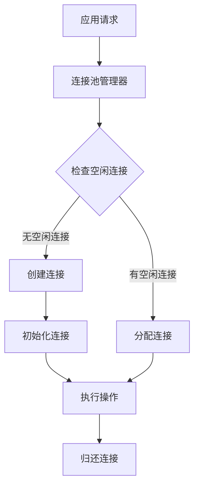

                 

### 数据库连接池优化LLM应用资源利用

#### 关键词
- 数据库连接池
- LLM应用
- 资源利用
- 优化方法
- 性能监控

#### 摘要
本文旨在探讨如何优化数据库连接池在LLM（大型语言模型）应用中的资源利用。我们将逐步分析数据库连接池的工作原理和优化方法，并深入探讨如何针对LLM应用的特点进行针对性优化。通过案例分析，我们将展示实际优化过程中的关键步骤和成果，为开发者提供实用的指导和借鉴。

## 第1章: 数据库连接池基础

### 1.1 数据库连接池的概念

数据库连接池是一种在应用程序与数据库之间管理数据库连接的组件。它通过预建立和管理一定数量的数据库连接，以避免频繁地创建和销毁连接，从而提高数据库性能和系统资源的利用率。

**核心概念与联系**

数据库连接池主要包括以下组成部分：

1. **连接池管理器**：负责管理连接池的创建、销毁、分配和回收等操作。
2. **连接池配置**：定义连接池的初始连接数、最大连接数、连接超时时间等参数。
3. **数据库连接**：实际与数据库建立连接的实体，通常包括数据库的连接信息、会话信息等。
4. **数据库操作**：通过数据库连接执行的各种SQL查询、数据操作等。

使用Mermaid流程图展示数据库连接池的组成部分和交互流程：



**详细讲解**

1. **连接池管理器**：连接池管理器负责连接池的初始化和管理工作，通常在应用启动时创建。它通过连接池配置参数来确定连接池的初始连接数和最大连接数。当应用程序需要数据库连接时，它会向连接池管理器请求连接。

2. **连接池配置**：连接池配置参数包括最大连接数、最小连接数、连接超时时间、连接空闲时间等。这些参数对连接池的性能和资源利用率有很大影响。合理配置这些参数可以优化连接池的性能。

3. **数据库连接**：数据库连接是应用程序与数据库之间的通信桥梁。通过数据库连接，应用程序可以执行各种数据库操作，如查询、插入、更新和删除等。连接池管理器负责管理这些数据库连接，确保连接的有效性和可用性。

4. **数据库操作**：应用程序通过数据库连接执行各种数据库操作。这些操作可以是简单的SQL查询，也可以是复杂的数据库事务。数据库连接池能够复用已存在的数据库连接，避免了频繁创建和销毁连接的开销，从而提高数据库性能和系统资源的利用率。

### 1.2 数据库连接池的作用与优势

数据库连接池在数据库应用中发挥着重要作用，其主要优势如下：

1. **减少数据库连接开销**：数据库连接是一个开销较大的操作，包括网络通信、认证、会话初始化等。通过连接池，应用程序可以复用已建立的数据库连接，避免了频繁创建和销毁连接的开销。

2. **提高数据库性能**：连接池能够减少数据库连接的创建和销毁次数，从而降低数据库服务器的负载，提高数据库性能。

3. **减少系统资源消耗**：连接池能够有效地管理数据库连接，减少系统资源的消耗。通过合理配置连接池参数，可以避免过多连接同时占用系统资源。

4. **提高系统稳定性**：连接池能够保证数据库连接的有效性和可用性。在连接池管理器的管理下，应用程序可以始终获得有效的数据库连接，避免因连接异常导致的应用程序失败。

### 1.3 数据库连接池的工作原理

数据库连接池的工作原理主要包括以下几个步骤：

1. **初始化连接池**：在应用程序启动时，连接池管理器会根据连接池配置参数创建一定数量的数据库连接，并将其放入连接池中。

2. **请求连接**：当应用程序需要访问数据库时，它会向连接池管理器请求一个数据库连接。如果连接池中存在空闲连接，则直接分配给应用程序；否则，连接池管理器会创建一个新的数据库连接。

3. **执行操作**：应用程序通过获取的数据库连接执行各种数据库操作，如查询、插入、更新和删除等。

4. **归还连接**：当应用程序完成数据库操作后，它会将连接归还给连接池。连接池管理器会将归还的连接重新放入连接池，供其他应用程序使用。

5. **连接回收**：如果连接池中的连接长时间未被使用，连接池管理器会将这些连接回收，以释放系统资源。

**核心算法原理讲解**

以下是数据库连接池的初始化、连接获取和归还过程的伪代码：

```python
initialize_pool(config):
    # 初始化连接池，根据配置创建一定数量的连接
    connections = [create_connection() for _ in range(config.max_pool_size)]

get_connection():
    # 从连接池中获取一个可用连接
    if connections:
        conn = connections.pop(0)
        return conn
    else:
        # 如果没有可用连接，则创建一个新的连接
        conn = create_connection()
        return conn

return_connection(conn):
    # 将连接归还给连接池
    connections.append(conn)
```

### 1.4 数据库连接池的常见实现方式

数据库连接池有多种实现方式，以下是几种常见的实现方式：

1. **手动管理**：手动管理连接池是一种简单的实现方式。应用程序在需要数据库连接时，直接创建连接；在完成数据库操作后，关闭连接。这种方式适用于连接数较少且数据库连接创建和销毁开销较低的场景。

2. **JDBC连接池**：JDBC连接池是Java数据库连接（JDBC）的一种实现方式。它通过JDBC驱动程序提供的连接池管理功能，实现连接的创建、销毁、分配和回收。常见的JDBC连接池实现有HikariCP、Apache DBCP等。

3. **第三方连接池框架**：第三方连接池框架提供更高级的连接池管理功能，如连接池监控、动态调整连接池参数等。常见的第三方连接池框架有Druid、HikariCP等。

### 第2章: LLM应用资源利用概述

### 2.1 LLM应用的背景

LLM（大型语言模型）是一种基于深度学习技术的自然语言处理模型，具有强大的文本生成、理解和推理能力。近年来，随着计算资源和算法技术的不断发展，LLM在各个领域得到了广泛应用，如智能客服、内容生成、文本分类、机器翻译等。

**背景介绍**

1. **技术发展**：随着深度学习技术的不断进步，特别是神经网络结构的优化和计算资源的提升，LLM的模型规模和性能得到了显著提升。如今，LLM模型可以处理更复杂的任务，生成更高质量的文本。

2. **应用需求**：随着人工智能技术的普及，越来越多的企业和组织对LLM应用的需求不断增加。LLM应用在提高生产效率、降低人力成本、提升用户体验等方面具有显著优势。

3. **市场规模**：根据市场研究机构的预测，全球LLM应用市场规模在未来几年将保持高速增长，预计到2025年将达到数十亿美元。

### 2.2 LLM应用的特点与挑战

LLM应用具有以下特点：

1. **大规模计算需求**：LLM模型通常具有数亿甚至数十亿个参数，训练和推理过程需要大量的计算资源，特别是GPU资源。

2. **高并发访问**：LLM应用常常面临高并发访问的场景，例如智能客服系统需要在短时间内处理大量用户请求。

3. **实时响应**：许多LLM应用需要实现实时响应，以满足用户对速度和准确性的要求。

4. **数据安全与隐私**：LLM应用涉及大量用户数据和敏感信息，需要确保数据安全与隐私。

**挑战**

1. **计算资源不足**：由于LLM模型对计算资源的高需求，许多企业和组织面临计算资源不足的挑战。

2. **连接池性能瓶颈**：传统的数据库连接池技术在应对高并发访问时，可能存在性能瓶颈，影响LLM应用的响应速度。

3. **内存管理难题**：LLM应用涉及大量数据，需要高效的内存管理策略，避免内存泄漏和内存占用过高。

4. **安全性问题**：在LLM应用中，需要确保数据传输和存储过程中的安全性，防止数据泄露和滥用。

### 2.3 LLM应用资源利用的目标与策略

LLM应用资源利用的目标是最大化资源利用率，提高系统性能和稳定性。为实现这一目标，可以采取以下策略：

1. **合理配置连接池参数**：根据LLM应用的特点，调整连接池的最大连接数、最小连接数、连接超时时间等参数，以提高连接池的性能。

2. **优化数据库连接池实现**：采用高性能的数据库连接池实现，如HikariCP，以降低连接创建和销毁的开销。

3. **分布式架构设计**：通过分布式架构设计，将LLM应用分解为多个模块，实现负载均衡和资源利用率优化。

4. **内存管理优化**：采用内存管理优化技术，如对象池、内存复用等，降低内存占用和内存泄漏风险。

5. **连接池监控与调优**：实时监控连接池的性能指标，根据实际情况进行调优，确保连接池的高效运行。

### 第3章: 数据库连接池优化方法

#### 3.1 数据库连接池性能优化

数据库连接池的性能优化是提高系统性能和响应速度的关键环节。以下是几种常见的数据库连接池性能优化方法：

**3.1.1 连接池配置优化**

连接池配置参数对性能和资源利用率有很大影响。以下是一些优化建议：

1. **最大连接数与最小连接数**：合理设置最大连接数和最小连接数。最大连接数应大于系统最大并发数，以确保有足够的连接供应用程序使用。最小连接数应大于0，避免频繁创建和销毁连接。

2. **连接超时时间**：合理设置连接超时时间。连接超时时间应大于应用程序的最大操作时间，以确保连接能够正常使用。同时，应避免设置过长的连接超时时间，以防止连接资源浪费。

3. **空闲连接超时时间**：设置合理的空闲连接超时时间，避免连接长时间占用资源。空闲连接超时时间应根据应用程序的使用情况调整，以确保连接能够及时回收。

**3.1.2 连接重用与复用**

连接重用与复用是提高连接池性能的有效手段。以下是一些优化建议：

1. **连接重用**：当应用程序需要数据库连接时，优先从连接池中获取已存在的连接。如果连接池中没有可用连接，则创建一个新的连接。连接重用可以减少连接创建和销毁的开销，提高系统性能。

2. **连接复用**：将已使用的连接归还给连接池后，连接池会将其放入空闲连接队列。其他应用程序可以继续使用这些空闲连接，避免了频繁创建和销毁连接的开销。

3. **连接池线程隔离**：在多线程环境中，应确保每个线程都有独立的连接池，以避免线程之间的连接竞争和冲突。

**3.1.3 连接超时与异常处理**

连接超时与异常处理是保证数据库连接稳定性和可靠性的关键环节。以下是一些优化建议：

1. **连接超时处理**：当应用程序请求数据库连接时，如果连接池无法在指定时间内提供连接，应返回错误信息或重试连接。连接超时时间应设置得足够长，以确保连接能够正常建立。

2. **异常处理**：当应用程序执行数据库操作时，如果发生异常，应确保连接能够正确处理异常，并尽快归还连接。异常处理应尽可能减少对连接池的影响，避免因异常导致连接池性能下降。

**3.1.4 其他性能优化方法**

以下是一些其他性能优化方法，以提高数据库连接池性能：

1. **数据库索引优化**：合理设置数据库索引，可以提高查询性能，减少数据库连接的负载。

2. **数据库分库分表**：当数据库表数据量较大时，可以通过分库分表的方式，降低单个数据库的负载，提高系统性能。

3. **数据库缓存**：使用数据库缓存技术，可以减少对数据库的直接访问，提高系统性能。

#### 3.2 内存管理优化

内存管理优化是确保数据库连接池稳定运行和高效利用系统资源的重要方面。以下是一些常见的内存管理优化方法：

**3.2.1 内存占用分析**

1. **连接对象大小**：分析连接对象的大小，以确定连接对象是否过大或过多。过大的连接对象会导致内存占用过高，影响系统性能。

2. **内存泄漏排查**：定期排查内存泄漏问题，确保连接对象能够及时释放，避免内存占用持续增加。

**3.2.2 内存泄漏排查与解决**

1. **内存泄漏原因**：内存泄漏通常由以下原因引起：
   - 对象生命周期管理不当，导致对象无法及时释放。
   - 连接池配置不合理，导致连接对象过多或过大。
   - 线程池配置不合理，导致线程长时间占用内存。

2. **内存泄漏排查方法**：使用内存分析工具（如MAT、VisualVM等）对应用程序进行内存分析，查找内存泄漏的原因。针对排查出的问题，采取相应的解决措施。

3. **解决内存泄漏**：针对内存泄漏问题，可以采取以下解决方法：
   - 优化连接对象的设计，减少对象大小。
   - 调整连接池配置，合理设置连接池参数。
   - 优化线程池配置，避免线程长时间占用内存。

**3.2.3 内存复用与对象池**

1. **内存复用**：通过内存复用技术，可以减少内存分配和释放的频率，提高系统性能。例如，可以使用对象池技术，将常用的连接对象缓存起来，避免频繁创建和销毁连接。

2. **对象池配置**：合理设置对象池的初始容量、最大容量和空闲时间，以确保对象池的高效运行。对象池的配置应考虑连接对象的实际使用情况，避免内存占用过高或过低。

#### 3.3 线程管理与并发优化

线程管理与并发优化是确保数据库连接池在高并发环境下稳定运行的关键。以下是一些常见的线程管理与并发优化方法：

**3.3.1 并发控制策略**

1. **线程安全**：确保连接对象在多线程环境中的线程安全，避免因并发访问导致的数据竞争和异常。

2. **线程池**：使用线程池技术，可以减少线程创建和销毁的开销，提高系统性能。线程池可以根据实际并发访问情况动态调整线程数量，避免因线程数量不足或过多导致性能下降。

3. **连接池线程隔离**：在多线程环境中，应确保每个线程都有独立的连接池，避免线程之间的连接竞争和冲突。

**3.3.2 线程池配置与调整**

1. **线程池配置**：合理设置线程池的参数，如核心线程数、最大线程数、线程空闲时间等。线程池的配置应考虑应用程序的并发访问情况，避免因线程数量不足或过多导致性能下降。

2. **动态调整线程池参数**：根据应用程序的实际运行情况，动态调整线程池参数，以实现最佳性能。

3. **线程池监控**：实时监控线程池的性能指标，如线程数量、执行时间、队列长度等，根据实际情况进行调整。

#### 3.4 资源利用率优化

资源利用率优化是提高数据库连接池性能和系统资源利用效率的重要手段。以下是一些常见的资源利用率优化方法：

**3.4.1 资源利用率评估**

1. **资源利用率指标**：评估资源利用率的关键指标包括连接池使用率、线程池使用率、内存使用率等。

2. **资源利用率分析**：通过监控工具对数据库连接池、线程池和内存使用情况进行分析，识别资源利用率较低的原因。

**3.4.2 资源利用策略优化**

1. **连接池参数调整**：根据资源利用率分析结果，调整连接池参数，如最大连接数、最小连接数、连接超时时间等，以提高资源利用率。

2. **线程池参数调整**：根据资源利用率分析结果，调整线程池参数，如核心线程数、最大线程数、线程空闲时间等，以提高资源利用率。

3. **内存管理优化**：通过优化内存管理策略，如对象池、内存复用等，提高内存使用率，降低内存占用。

4. **负载均衡**：通过负载均衡技术，将负载分配到不同的数据库连接池和线程池中，提高资源利用率。

### 第4章: LLM应用资源利用案例分析

#### 4.1 案例一：电商平台的LLM应用优化

**4.1.1 案例背景**

某电商平台引入了LLM技术，用于智能客服、商品推荐和内容生成等场景。随着用户数量的增加，平台的LLM应用面临了较高的并发访问压力，导致数据库连接池性能瓶颈和系统资源利用率不足。

**4.1.2 优化目标与策略**

1. **优化目标**：提高数据库连接池性能，降低系统资源消耗，提高资源利用率。

2. **优化策略**：
   - 优化连接池配置，调整最大连接数、最小连接数和连接超时时间等参数。
   - 采用高性能的数据库连接池实现，如HikariCP。
   - 优化内存管理，采用对象池技术减少内存分配和释放的频率。
   - 调整线程池参数，确保线程池的高效运行。

**4.1.3 实施过程与效果**

1. **实施过程**：
   - 分析现有连接池配置，确定需要调整的参数。
   - 替换原有连接池实现，采用HikariCP。
   - 调整内存管理策略，采用对象池技术。
   - 调整线程池参数，根据实际并发访问情况进行动态调整。

2. **效果**：
   - 数据库连接池性能显著提升，连接获取速度加快，响应时间缩短。
   - 系统资源利用率提高，CPU和内存占用降低。
   - 用户满意度提高，平台稳定性增强。

#### 4.2 案例二：金融行业的LLM应用资源优化

**4.2.1 案例背景**

某金融公司引入了LLM技术，用于风险控制、客户服务和投资建议等场景。随着业务规模的扩大，金融公司的LLM应用面临了较高的并发访问压力，导致数据库连接池性能瓶颈和系统资源利用率不足。

**4.2.2 优化目标与策略**

1. **优化目标**：提高数据库连接池性能，降低系统资源消耗，提高资源利用率。

2. **优化策略**：
   - 优化连接池配置，调整最大连接数、最小连接数和连接超时时间等参数。
   - 采用分布式数据库架构，降低单个数据库的负载。
   - 调整线程池参数，确保线程池的高效运行。
   - 优化内存管理，采用对象池技术减少内存分配和释放的频率。

**4.2.3 实施过程与效果**

1. **实施过程**：
   - 分析现有连接池配置，确定需要调整的参数。
   - 采用分布式数据库架构，将数据分散存储在多个数据库实例中。
   - 调整线程池参数，根据实际并发访问情况进行动态调整。
   - 优化内存管理策略，采用对象池技术。

2. **效果**：
   - 数据库连接池性能显著提升，连接获取速度加快，响应时间缩短。
   - 系统资源利用率提高，CPU和内存占用降低。
   - 业务处理能力增强，客户满意度提高。

### 第5章: 数据库连接池与LLM应用集成

#### 5.1 集成架构设计

在LLM应用中集成数据库连接池，需要考虑以下架构设计：

**5.1.1 集成方式与选择**

1. **独立集成**：将数据库连接池作为独立组件引入LLM应用，与现有数据库访问代码分离。这种方式适用于需要灵活调整连接池配置的场景。

2. **统一集成**：将数据库连接池与LLM应用的数据库访问代码整合在一起，统一管理连接池。这种方式适用于连接池配置简单、应用规模较小的场景。

**5.1.2 集成过程中需考虑的问题**

1. **连接池配置**：在集成过程中，需要根据LLM应用的特点和需求，合理配置连接池参数，如最大连接数、最小连接数、连接超时时间等。

2. **数据库访问方式**：需要确保数据库访问代码与连接池的实现方式兼容，避免出现连接异常或连接无法回收等问题。

3. **性能监控**：集成过程中，需要引入性能监控机制，实时监控连接池的性能指标，以便及时发现和解决问题。

#### 5.2 集成案例分析

**5.2.1 案例一：集成到Web应用**

**场景描述**：某Web应用引入了LLM技术，用于用户画像和智能推荐。随着用户数量的增加，应用的数据库连接池性能瓶颈和系统资源利用率不足。

**优化方案**：
1. **调整连接池配置**：根据Web应用的特点，调整连接池的最大连接数、最小连接数和连接超时时间等参数。
2. **引入高性能连接池实现**：采用HikariCP等高性能连接池实现，优化连接创建和销毁的性能。
3. **优化数据库访问代码**：优化数据库访问代码，避免长时间占用连接，确保连接能够及时归还。

**实施过程**：
1. 分析现有连接池配置，确定需要调整的参数。
2. 替换原有连接池实现，采用HikariCP。
3. 优化数据库访问代码，确保连接能够及时归还。

**效果**：
- 数据库连接池性能显著提升，连接获取速度加快，响应时间缩短。
- 系统资源利用率提高，CPU和内存占用降低。
- 用户满意度提高，平台稳定性增强。

**5.2.2 案例二：集成到移动应用**

**场景描述**：某移动应用引入了LLM技术，用于智能语音助手和文本生成。随着用户数量的增加，应用的数据库连接池性能瓶颈和系统资源利用率不足。

**优化方案**：
1. **优化网络连接**：由于移动网络的不稳定性，优化数据库连接的网络连接配置，确保连接的稳定性和可靠性。
2. **调整连接池配置**：根据移动应用的特点，调整连接池的最大连接数、最小连接数和连接超时时间等参数。
3. **引入本地缓存**：在移动应用中引入本地缓存机制，减少对数据库的访问频率，降低数据库连接的压力。

**实施过程**：
1. 优化网络连接配置，确保连接的稳定性和可靠性。
2. 分析现有连接池配置，确定需要调整的参数。
3. 引入本地缓存机制，减少对数据库的访问频率。

**效果**：
- 数据库连接池性能得到优化，连接获取速度加快，响应时间缩短。
- 系统资源利用率提高，CPU和内存占用降低。
- 用户满意度提高，应用稳定性增强。

### 第6章: LLM应用资源监控与调优

#### 6.1 资源监控概述

资源监控是确保LLM应用稳定运行和高效利用系统资源的重要手段。以下内容将介绍资源监控的目标、指标和方法。

**6.1.1 监控目标**

资源监控的目标包括：
- 识别系统性能瓶颈和资源利用问题。
- 及时发现和解决系统故障和异常。
- 提高系统性能和稳定性，确保用户体验。

**6.1.2 监控指标**

常用的监控指标包括：
- **CPU利用率**：CPU利用率是衡量系统处理能力的指标，表示CPU在一段时间内被占用的情况。
- **内存使用率**：内存使用率是衡量系统内存资源的利用率，表示内存使用量与总内存量的比值。
- **磁盘IO**：磁盘IO是衡量系统磁盘读写性能的指标，包括读写速度、读写请求队列长度等。
- **网络带宽**：网络带宽是衡量系统网络传输能力的指标，包括上行和下行带宽。
- **数据库连接池性能**：数据库连接池性能指标包括连接获取速度、连接池使用率、连接超时等。

**6.1.3 监控方法**

资源监控的方法包括：
- **日志监控**：通过分析系统日志，发现异常情况和性能瓶颈。
- **性能监控工具**：使用性能监控工具（如Prometheus、Grafana等）实时监控系统性能指标。
- **自动报警**：设置自动报警机制，当监控指标超过预设阈值时，自动发送报警通知。

#### 6.2 资源调优策略

资源调优策略旨在提高系统性能和资源利用率，以下是一些常见的资源调优方法：

**6.2.1 性能调优**

1. **优化数据库查询**：分析数据库查询语句，优化索引、查询条件和查询策略，提高查询效率。
2. **优化LLM模型**：通过模型压缩、量化等技术，降低模型对计算资源的需求。
3. **负载均衡**：采用负载均衡技术，将负载分配到多个服务器或实例上，避免单点性能瓶颈。

**6.2.2 可靠性调优**

1. **容错机制**：设计容错机制，确保系统在遇到故障时能够自动恢复。
2. **数据库备份与恢复**：定期备份数据库，确保数据安全，并建立快速恢复机制。
3. **健康检查**：定期进行系统健康检查，发现潜在问题并提前处理。

**6.2.3 资源利用调优**

1. **连接池参数调整**：根据实际使用情况，调整连接池的最大连接数、最小连接数和连接超时时间等参数。
2. **内存管理优化**：优化内存分配和回收策略，减少内存泄漏和内存占用。
3. **线程池参数调整**：根据并发访问情况，调整线程池的核心线程数、最大线程数和线程空闲时间等参数。

### 第7章: 未来展望与趋势

#### 7.1 数据库连接池的发展趋势

随着云计算、大数据和人工智能技术的不断发展，数据库连接池技术在以下几个方面有较大的发展潜力：

1. **云原生连接池**：云原生数据库连接池将充分利用云计算的优势，提供更高的可扩展性和弹性。通过容器化、微服务架构等技术，实现连接池的高效管理和资源调度。

2. **智能连接池**：利用机器学习和人工智能技术，实现连接池的智能监控、预测和优化。通过分析历史数据，预测连接池的负载情况，自动调整连接池参数，提高资源利用率。

3. **分布式连接池**：分布式数据库连接池将支持跨数据中心的连接管理，实现负载均衡和故障转移。通过分布式数据库架构，提高数据库连接池的可扩展性和可靠性。

#### 7.2 LLM应用资源利用的新方法

LLM应用资源利用的新方法包括：

1. **异构计算**：利用GPU、FPGA等异构计算资源，提高LLM模型的训练和推理速度。通过异构计算，实现计算资源的合理分配和利用。

2. **动态资源调度**：通过动态资源调度技术，实现计算资源与存储资源的动态调整。根据实际负载情况，自动调整计算资源的使用，提高资源利用率。

3. **边缘计算**：将LLM应用部署到边缘计算节点，降低对中心服务器的依赖，提高响应速度和用户体验。通过边缘计算，实现计算资源的本地化管理和优化。

#### 7.3 未来发展方向与挑战

数据库连接池和LLM应用资源利用在未来面临着以下发展方向和挑战：

1. **发展方向**：
   - 实现更高效的连接池管理和资源调度。
   - 探索新型连接池架构，提高系统性能和稳定性。
   - 开发基于人工智能的智能连接池技术。

2. **挑战**：
   - 确保连接池在复杂环境下的一致性和可靠性。
   - 提高连接池的跨平台兼容性和可扩展性。
   - 处理大规模LLM应用带来的计算和存储资源压力。

### 附录

#### A.1 数据库连接池与LLM应用相关工具与资源

以下是一些与数据库连接池和LLM应用相关的工具和资源：

1. **数据库连接池框架**：
   - HikariCP：高性能的Java数据库连接池。
   - Druid：用于处理大数据的分布式数据库连接池。

2. **LLM应用框架**：
   - TensorFlow：用于构建和训练深度学习模型的框架。
   - PyTorch：用于构建和训练深度学习模型的框架。

3. **性能监控工具**：
   - Prometheus：开源的性能监控解决方案。
   - Grafana：用于可视化性能监控数据的工具。

4. **学习资源**：
   - 《数据库连接池原理与实战》
   - 《大型语言模型应用实战》
   - 《云计算与大数据技术》

通过学习和应用这些工具和资源，开发者可以更好地理解和优化数据库连接池和LLM应用的资源利用。

### 作者信息

作者：AI天才研究院/AI Genius Institute & 禅与计算机程序设计艺术 /Zen And The Art of Computer Programming

---

### 感谢与致谢

在此，我要感谢AI天才研究院（AI Genius Institute）为我提供的研究资源和指导。同时，我要感谢禅与计算机程序设计艺术（Zen And The Art of Computer Programming）一书，它为我提供了丰富的理论知识和启示。最后，我要感谢所有读者，是你们的阅读和支持让我能够不断进步和成长。感谢大家！

